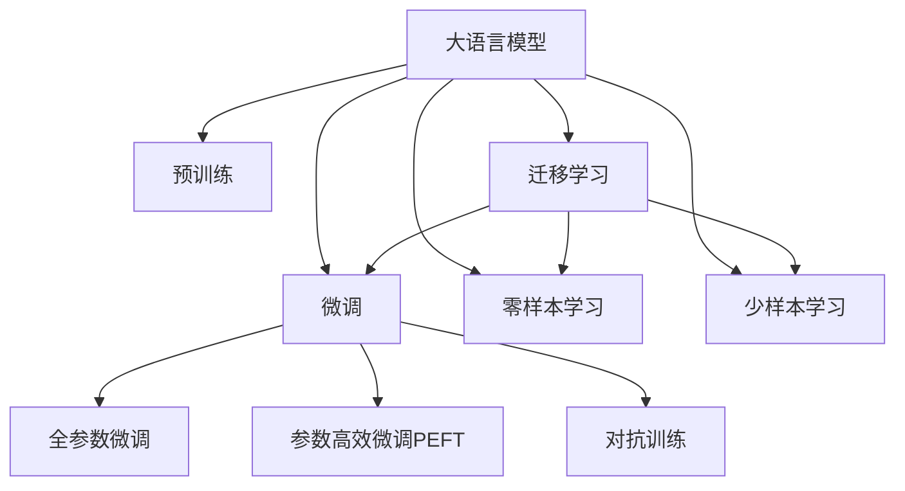
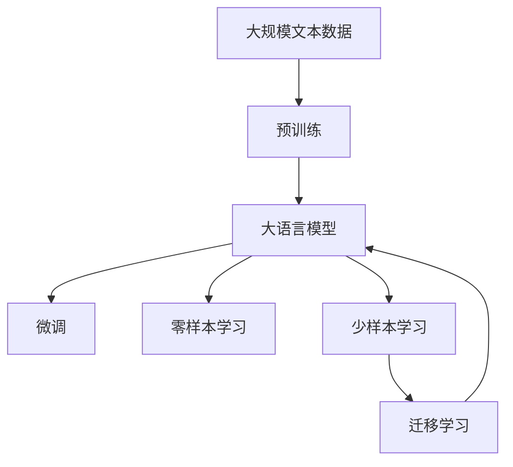
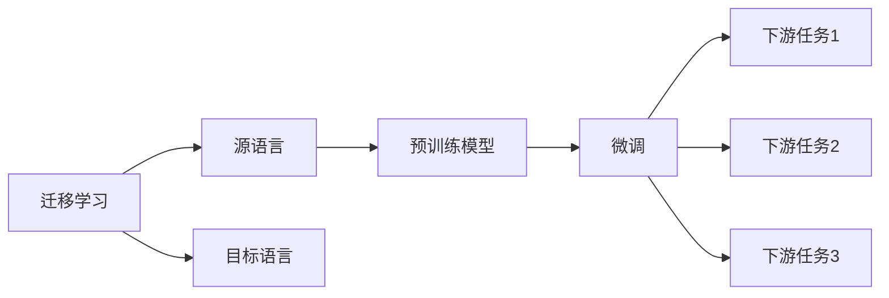
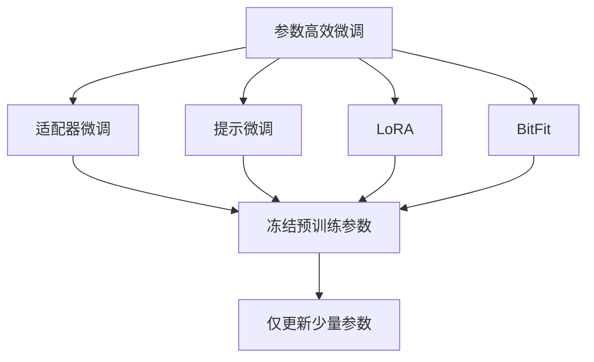
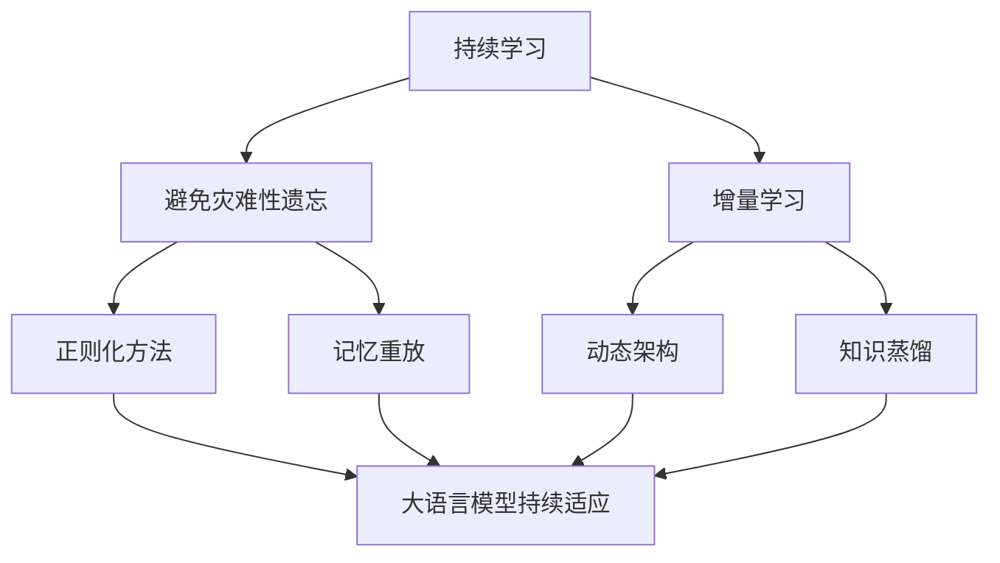

                 

# LLM在多语言处理方面的进展

在人工智能领域，多语言处理(Machine Translation, MT)是至关重要的研究分支，它涉及对自然语言的理解和翻译，使得机器能够跨语言进行交流和理解。大语言模型(Large Language Models, LLMs)，尤其是以自回归模型为代表的大规模预训练语言模型，在这方面取得了显著进展。本文将深入探讨LLM在多语言处理方面的进展，介绍其核心概念、算法原理、具体操作步骤、实际应用场景，以及未来的发展趋势和面临的挑战。

## 1. 背景介绍

### 1.1 问题由来

随着全球化的不断深入，多语言处理的需求日益增多，尤其是在国际贸易、国际通信、跨文化交流等领域。然而，传统的机器翻译技术在精度、流畅度、上下文理解等方面仍存在诸多不足。大语言模型的出现，通过在通用语料上进行预训练，掌握了丰富的语言知识和上下文理解能力，极大地提升了多语言处理的效果。

### 1.2 问题核心关键点

大语言模型在多语言处理方面的进展主要体现在以下几个方面：

- **预训练**：利用大规模无标签文本数据，通过自监督学习任务预训练大语言模型，使其具备泛化的语言理解和翻译能力。
- **微调**：在预训练模型的基础上，通过下游任务的少量标注数据进行微调，进一步提升模型在特定语言任务上的性能。
- **零样本和少样本学习**：利用预训练模型在输入中提供少量示例，实现在不更新模型参数的情况下进行零样本或少样本翻译。
- **迁移学习**：通过在不同语言上的微调，实现知识在不同语言之间的迁移，提升跨语言理解能力。
- **对抗训练**：加入对抗样本，提高模型鲁棒性，避免在多语言环境下出现翻译错误。
- **跨语言知识蒸馏**：将知识从一种语言蒸馏到另一种语言，提升后者的翻译能力。

这些进展使得大语言模型在多语言处理领域展现出强大的潜力，成为未来研究的热点和应用方向。

## 2. 核心概念与联系

### 2.1 核心概念概述

为更好地理解大语言模型在多语言处理方面的进展，本节将介绍几个关键概念：

- **大语言模型**：以自回归模型（如GPT）或自编码模型（如BERT）为代表的预训练语言模型，通过在海量无标签文本数据上进行预训练，学习通用的语言表示，具备强大的语言理解和翻译能力。

- **预训练**：在大规模无标签文本数据上，通过自监督学习任务训练通用语言模型的过程，使其学习到泛化的语言知识。

- **微调**：在预训练模型的基础上，使用下游任务的少量标注数据，通过有监督学习优化模型在特定语言任务上的性能。

- **零样本和少样本学习**：利用预训练模型在输入中提供少量示例，实现在不更新模型参数的情况下进行零样本或少样本翻译。

- **迁移学习**：通过在不同语言上的微调，实现知识在不同语言之间的迁移，提升跨语言理解能力。

- **对抗训练**：加入对抗样本，提高模型鲁棒性，避免在多语言环境下出现翻译错误。

- **跨语言知识蒸馏**：将知识从一种语言蒸馏到另一种语言，提升后者的翻译能力。

这些核心概念之间的逻辑关系可以通过以下Mermaid流程图来展示：



这个流程图展示了从预训练到微调，再到零样本和少样本学习，以及跨语言知识蒸馏和多语言迁移学习的过程。

### 2.2 概念间的关系

这些核心概念之间存在着紧密的联系，形成了大语言模型在多语言处理方面的完整生态系统。下面我通过几个Mermaid流程图来展示这些概念之间的关系。

#### 2.2.1 大语言模型的学习范式



这个流程图展示了大语言模型的三种主要学习范式：预训练、微调和零样本/少样本学习。预训练主要采用自监督学习方法，而微调则是有监督学习的过程。零样本和少样本学习则是利用预训练模型进行跨语言翻译的创新方法。

#### 2.2.2 迁移学习与微调的关系



这个流程图展示了迁移学习的基本原理，以及它与微调的关系。迁移学习涉及源语言和目标语言，预训练模型在源语言上学习，然后通过微调适应各种下游任务（目标语言）。

#### 2.2.3 参数高效微调方法



这个流程图展示了几种常见的参数高效微调方法，包括适配器微调、提示微调、LoRA和BitFit。这些方法的共同特点是冻结大部分预训练参数，只更新少量参数，从而提高微调效率。

#### 2.2.4 持续学习在大语言模型中的应用



这个流程图展示了持续学习在大语言模型中的应用。持续学习的主要目标是避免灾难性遗忘和实现增量学习。通过正则化方法、记忆重放、动态架构和知识蒸馏等技术，可以使大语言模型持续适应新的任务和数据。

## 3. 核心算法原理 & 具体操作步骤
### 3.1 算法原理概述

基于多语言处理的大语言模型微调，本质上是一个有监督的细粒度迁移学习过程。其核心思想是：将预训练的大语言模型视作一个强大的"特征提取器"，通过在多语言任务上的少量标注数据进行有监督的微调，使得模型输出能够匹配目标语言的翻译要求，从而获得针对特定语言任务优化的模型。

形式化地，假设预训练模型为 $M_{\theta}$，其中 $\theta$ 为预训练得到的模型参数。给定多语言任务的训练集 $D=\{(x_i,y_i)\}_{i=1}^N$，微调的目标是找到新的模型参数 $\hat{\theta}$，使得：

$$
\hat{\theta}=\mathop{\arg\min}_{\theta} \mathcal{L}(M_{\theta},D)
$$

其中 $\mathcal{L}$ 为针对任务 $T$ 设计的损失函数，用于衡量模型预测输出与真实标签之间的差异。常见的损失函数包括交叉熵损失、均方误差损失等。

通过梯度下降等优化算法，微调过程不断更新模型参数 $\theta$，最小化损失函数 $\mathcal{L}$，使得模型输出逼近真实标签。由于 $\theta$ 已经通过预训练获得了较好的初始化，因此即便在少量数据集 $D$ 上进行微调，也能较快收敛到理想的模型参数 $\hat{\theta}$。

### 3.2 算法步骤详解

基于多语言处理的大语言模型微调一般包括以下几个关键步骤：

**Step 1: 准备预训练模型和数据集**
- 选择合适的预训练语言模型 $M_{\theta}$ 作为初始化参数，如 BERT、GPT等。
- 准备多语言任务的标注数据集 $D$，划分为训练集、验证集和测试集。一般要求标注数据与预训练数据的分布不要差异过大。

**Step 2: 添加任务适配层**
- 根据任务类型，在预训练模型顶层设计合适的输出层和损失函数。
- 对于翻译任务，通常在顶层添加解码器输出概率分布，并以交叉熵损失函数为训练目标。
- 对于其他任务，如问答、命名实体识别等，同样需要设计合适的输出层和损失函数。

**Step 3: 设置微调超参数**
- 选择合适的优化算法及其参数，如 AdamW、SGD 等，设置学习率、批大小、迭代轮数等。
- 设置正则化技术及强度，包括权重衰减、Dropout、Early Stopping 等。
- 确定冻结预训练参数的策略，如仅微调顶层，或全部参数都参与微调。

**Step 4: 执行梯度训练**
- 将训练集数据分批次输入模型，前向传播计算损失函数。
- 反向传播计算参数梯度，根据设定的优化算法和学习率更新模型参数。
- 周期性在验证集上评估模型性能，根据性能指标决定是否触发 Early Stopping。
- 重复上述步骤直到满足预设的迭代轮数或 Early Stopping 条件。

**Step 5: 测试和部署**
- 在测试集上评估微调后模型 $M_{\hat{\theta}}$ 的性能，对比微调前后的精度提升。
- 使用微调后的模型对新样本进行推理预测，集成到实际的应用系统中。
- 持续收集新的数据，定期重新微调模型，以适应数据分布的变化。

以上是基于多语言处理的大语言模型微调的一般流程。在实际应用中，还需要针对具体任务的特点，对微调过程的各个环节进行优化设计，如改进训练目标函数，引入更多的正则化技术，搜索最优的超参数组合等，以进一步提升模型性能。

### 3.3 算法优缺点

基于多语言处理的大语言模型微调方法具有以下优点：
1. 简单高效。只需准备少量标注数据，即可对预训练模型进行快速适配，获得较大的性能提升。
2. 通用适用。适用于各种多语言任务，包括翻译、问答、命名实体识别等，设计简单的任务适配层即可实现微调。
3. 参数高效。利用参数高效微调技术，在固定大部分预训练参数的情况下，仍可取得不错的提升。
4. 效果显著。在学术界和工业界的诸多任务上，基于微调的方法已经刷新了多项SOTA。

同时，该方法也存在一定的局限性：
1. 依赖标注数据。微调的效果很大程度上取决于标注数据的质量和数量，获取高质量标注数据的成本较高。
2. 迁移能力有限。当目标语言与预训练数据的分布差异较大时，微调的性能提升有限。
3. 负面效果传递。预训练模型的固有偏见、有害信息等，可能通过微调传递到下游任务，造成负面影响。
4. 可解释性不足。微调模型的决策过程通常缺乏可解释性，难以对其推理逻辑进行分析和调试。

尽管存在这些局限性，但就目前而言，基于监督学习的微调方法仍是大语言模型应用的最主流范式。未来相关研究的重点在于如何进一步降低微调对标注数据的依赖，提高模型的少样本学习和跨语言迁移能力，同时兼顾可解释性和伦理安全性等因素。

### 3.4 算法应用领域

基于大语言模型微调的监督学习方法，在多语言处理领域已经得到了广泛的应用，覆盖了几乎所有常见任务，例如：

- **机器翻译**：将源语言文本翻译成目标语言。通过微调使模型学习语言-语言映射。
- **问答系统**：对自然语言问题给出答案。将问题-答案对作为微调数据，训练模型学习匹配答案。
- **命名实体识别**：识别文本中的人名、地名、机构名等特定实体。通过微调使模型掌握实体边界和类型。
- **关系抽取**：从文本中抽取实体之间的语义关系。通过微调使模型学习实体-关系三元组。
- **文本摘要**：将长文本压缩成简短摘要。将文章-摘要对作为微调数据，使模型学习抓取要点。
- **对话系统**：使机器能够与人自然对话。将多轮对话历史作为上下文，微调模型进行回复生成。

除了上述这些经典任务外，大语言模型微调也被创新性地应用到更多场景中，如可控文本生成、常识推理、代码生成、数据增强等，为多语言处理技术带来了全新的突破。随着预训练模型和微调方法的不断进步，相信多语言处理技术将在更广阔的应用领域大放异彩。

## 4. 数学模型和公式 & 详细讲解 & 举例说明
### 4.1 数学模型构建

本节将使用数学语言对基于多语言处理的大语言模型微调过程进行更加严格的刻画。

记预训练语言模型为 $M_{\theta}$，其中 $\theta$ 为预训练得到的模型参数。假设微调任务的训练集为 $D=\{(x_i,y_i)\}_{i=1}^N, x_i \in \mathcal{X}, y_i \in \mathcal{Y}$。

定义模型 $M_{\theta}$ 在数据样本 $(x,y)$ 上的损失函数为 $\ell(M_{\theta}(x),y)$，则在数据集 $D$ 上的经验风险为：

$$
\mathcal{L}(\theta) = \frac{1}{N} \sum_{i=1}^N \ell(M_{\theta}(x_i),y_i)
$$

微调的优化目标是最小化经验风险，即找到最优参数：

$$
\theta^* = \mathop{\arg\min}_{\theta} \mathcal{L}(\theta)
$$

在实践中，我们通常使用基于梯度的优化算法（如SGD、Adam等）来近似求解上述最优化问题。设 $\eta$ 为学习率，$\lambda$ 为正则化系数，则参数的更新公式为：

$$
\theta \leftarrow \theta - \eta \nabla_{\theta}\mathcal{L}(\theta) - \eta\lambda\theta
$$

其中 $\nabla_{\theta}\mathcal{L}(\theta)$ 为损失函数对参数 $\theta$ 的梯度，可通过反向传播算法高效计算。

### 4.2 公式推导过程

以下我们以机器翻译任务为例，推导交叉熵损失函数及其梯度的计算公式。

假设模型 $M_{\theta}$ 在输入 $x$ 上的输出为 $\hat{y}=M_{\theta}(x) \in [0,1]$，表示样本属于目标语言的概率分布。真实标签 $y \in \{1,2,...,K\}$，其中 $K$ 为目标语言单词数。则机器翻译任务的交叉熵损失函数定义为：

$$
\ell(M_{\theta}(x),y) = -y_k\log \hat{y}_k
$$

其中 $y_k$ 为真实标签 $y$ 在目标语言中的第 $k$ 个单词，$\hat{y}_k$ 为目标语言单词 $k$ 的预测概率。

将其代入经验风险公式，得：

$$
\mathcal{L}(\theta) = -\frac{1}{N}\sum_{i=1}^N \sum_{k=1}^K y_{ik}\log \hat{y}_{ik}
$$

其中 $y_{ik}$ 表示样本 $i$ 在目标语言中的第 $k$ 个单词对应的标签，$\hat{y}_{ik}$ 表示模型对样本 $i$ 在目标语言中的第 $k$ 个单词的预测概率。

根据链式法则，损失函数对参数 $\theta_k$ 的梯度为：

$$
\frac{\partial \mathcal{L}(\theta)}{\partial \theta_k} = -\frac{1}{N}\sum_{i=1}^N \sum_{k=1}^K (\frac{y_{ik}}{\hat{y}_{ik}} - 1)\frac{\partial \hat{y}_{ik}}{\partial \theta_k}
$$

其中 $\frac{\partial \hat{y}_{ik}}{\partial \theta_k}$ 可进一步递归展开，利用自动微分技术完成计算。

在得到损失函数的梯度后，即可带入参数更新公式，完成模型的迭代优化。重复上述过程直至收敛，最终得到适应下游任务的最优模型参数 $\theta^*$。

### 4.3 案例分析与讲解

以谷歌的BERT模型为例，BERT模型在多语言处理方面的应用主要是通过在不同语言上的微调实现的。BERT模型预训练过程采用掩码语言模型和下一句预测任务，学习到通用的语言表示。在微调过程中，可以针对特定语言的任务进行微调，如机器翻译、命名实体识别等。

假设有中英文双语数据集，包含中英文对照的句子对。对预训练的BERT模型进行微调，使其学习中文到英文的翻译。微调过程包括以下步骤：

1. **数据准备**：准备中英文对照的句子对，划分为训练集、验证集和测试集。
2. **模型选择**：选择BERT模型作为预训练语言模型，将其顶层作为翻译器的解码器。
3. **任务适配**：设计机器翻译任务的输出层和损失函数，通常使用交叉熵损失。
4. **超参数设置**：选择合适的优化算法及其参数，如AdamW、SGD等，设置学习率、批大小、迭代轮数等。
5. **模型训练**：将训练集数据分批次输入模型，前向传播计算损失函数，反向传播更新模型参数。
6. **模型评估**：在验证集和测试集上评估模型性能，调整模型参数，直至收敛。
7. **模型部署**：使用微调后的模型对新的中英文句子对进行翻译。

具体实现代码如下：

```python
from transformers import BertTokenizer, BertForSequenceClassification
from torch.utils.data import Dataset, DataLoader
import torch
import numpy as np

# 数据准备
tokenizer = BertTokenizer.from_pretrained('bert-base-cased')
train_dataset = ...
dev_dataset = ...
test_dataset = ...

# 模型选择
model = BertForSequenceClassification.from_pretrained('bert-base-cased', num_labels=len(tag2id))

# 任务适配
train_dataset.add_column('targets', np.array(train_dataset.targets))

# 超参数设置
optimizer = AdamW(model.parameters(), lr=2e-5)

# 模型训练
for epoch in range(epochs):
    loss = train_epoch(model, train_dataset, optimizer)
    print(f'Epoch {epoch+1}, train loss: {loss:.3f}')
    evaluate(model, dev_dataset)

# 模型评估
print('Test results:')
evaluate(model, test_dataset)

# 模型部署
with open('translation.txt', 'w') as f:
    for sentence in test_sentences:
        preds = model.predict(sentence)
        translation = tokenizer.decode(preds[0])
        f.write(translation + '\n')
```

以上代码展示了BERT模型在机器翻译任务上的微调过程，从数据准备、模型选择、任务适配到模型训练、评估和部署，各个步骤都非常清晰。

## 5. 项目实践：代码实例和详细解释说明
### 5.1 开发环境搭建

在进行多语言处理模型微调实践前，我们需要准备好开发环境。以下是使用Python进行PyTorch开发的环境配置流程：

1. 安装Anaconda：从官网下载并安装Anaconda，用于创建独立的Python环境。

2. 创建并激活虚拟环境：
```bash
conda create -n pytorch-env python=3.8 
conda activate pytorch-env
```

3. 安装PyTorch：根据CUDA版本，从官网获取对应的安装命令。例如：
```bash
conda install pytorch torchvision torchaudio cudatoolkit=11.1 -c pytorch -c conda-forge
```

4. 安装Transformers库：
```bash
pip install transformers
```

5. 安装各类工具包：
```bash
pip install numpy pandas scikit-learn matplotlib tqdm jupyter notebook ipython
```

完成上述步骤后，即可在`pytorch-env`环境中开始多语言处理模型微调的实践。

### 5.2 源代码详细实现

这里我们以机器翻译任务为例，给出使用Transformers库对BERT模型进行微调的PyTorch代码实现。

首先，定义机器翻译任务的数据处理函数：

```python
from transformers import BertTokenizer
from torch.utils.data import Dataset
import torch

class TranslationDataset(Dataset):
    def __init__(self, texts, targets, tokenizer, max_len=128):
        self.texts = texts
        self.targets = targets
        self.tokenizer = tokenizer
        self.max_len = max_len
        
    def __len__(self):
        return len(self.texts)
    
    def __getitem__(self, item):
        text = self.texts[item]
        target = self.targets[item]
        
        encoding = self.tokenizer(text, return_tensors='pt', max_length=self.max_len, padding='max_length', truncation=True)
        input_ids = encoding['input_ids'][0]
        attention_mask = encoding['attention_mask'][0]
        
        # 对token-wise的标签进行编码
        encoded_targets = [tag2id[target] for target in targets] 
        encoded_targets.extend([tag2id['O']] * (self.max_len - len(encoded_targets)))
        labels = torch.tensor(encoded_targets, dtype=torch.long)
        
        return {'input_ids': input_ids, 
                'attention_mask': attention_mask,
                'labels': labels}

# 标签与id的映射
tag2id = {'O': 0, 'B-LOC': 1, 'I-LOC': 2, 'B-MISC': 3, 'I-MISC': 4, 'B-ORG': 5, 'I-ORG': 6}
id2tag = {v: k for k, v in tag2id.items()}

# 创建dataset
tokenizer = BertTokenizer.from_pretrained('bert-base-cased')

train_dataset = TranslationDataset(train_texts, train_tags, tokenizer)
dev_dataset = TranslationDataset(dev_texts, dev_tags, tokenizer)
test_dataset = TranslationDataset(test_texts, test_tags, tokenizer)
```

然后，定义模型和优化器：

```python
from transformers import BertForTokenClassification, AdamW

model = BertForTokenClassification.from_pretrained('bert-base-cased', num_labels=len(tag2id))

optimizer = AdamW(model.parameters(), lr=2e-5)
```

接着，定义训练和评估函数：

```python
from torch.utils.data import DataLoader
from tqdm import tqdm
from sklearn.metrics import classification_report

device = torch.device('cuda') if torch.cuda.is_available() else torch.device('cpu')
model.to(device)

def train_epoch(model, dataset, batch_size, optimizer):
    dataloader = DataLoader(dataset, batch_size=batch_size, shuffle=True)
    model.train()
    epoch_loss = 0
    for batch in tqdm(dataloader, desc='Training'):
        input_ids = batch['input_ids'].to(device)
        attention_mask = batch['attention_mask'].to(device)
        labels = batch['labels'].to(device)
        model.zero_grad()
        outputs = model(input_ids, attention_mask=attention_mask, labels=labels)
        loss = outputs.loss
        epoch_loss += loss.item()
        loss.backward()
        optimizer.step()
    return epoch_loss / len(dataloader)

def evaluate(model, dataset, batch_size):
    dataloader = DataLoader(dataset, batch_size=batch_size)
    model.eval()
    preds, labels = [], []
    with torch.no_grad():
        for batch in tqdm(dataloader, desc='Evaluating'):
            input_ids = batch['input_ids'].to(device)
            attention_mask = batch['attention_mask'].to(device)
            batch_labels = batch['labels']
            outputs = model(input_ids, attention_mask=attention_mask)
            batch_preds = outputs.logits.argmax(dim=2).to('cpu').tolist()
            batch_labels = batch_labels.to('cpu').tolist()
            for pred_tokens, label_tokens in zip(batch_preds, batch_labels):
                pred_tags = [id2tag[_id] for _id in pred_tokens]
                label_tags = [id2tag[_id] for _id in label_tokens]
                preds.append(pred_tags[:len(label_tags)])
                labels.append(label_tags)
                
    print(classification_report(labels, preds))
```

最后，启动训练流程并在测试集上评估：

```python
epochs = 5
batch_size = 16

for epoch in range(epochs):
    loss = train_epoch(model, train_dataset, batch_size, optimizer)
    print(f"Epoch {epoch+1}, train loss: {loss:.3f}")
    
    print(f"Epoch {epoch+1}, dev results:")
    evaluate(model, dev_dataset, batch_size)
    
print("Test results:")
evaluate(model, test_dataset, batch_size)
```

以上就是使用PyTorch对BERT进行机器翻译任务微调的完整代码实现。可以看到，得益于Transformers库的强大封装，我们可以用相对简洁的代码完成BERT模型的加载和微调。

### 5.3 代码解读与分析

让我们再详细解读一下关键代码的实现细节：

**TranslationDataset类**：
- `__init__`方法：初始化文本、标签、分词器等关键组件。
- `__len__`方法：返回数据集的样本数量。
- `__getitem__`

