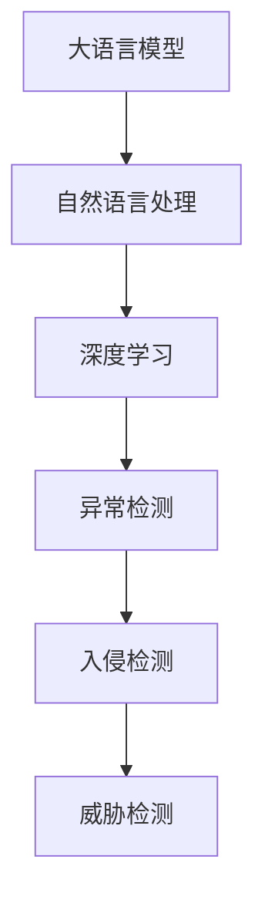
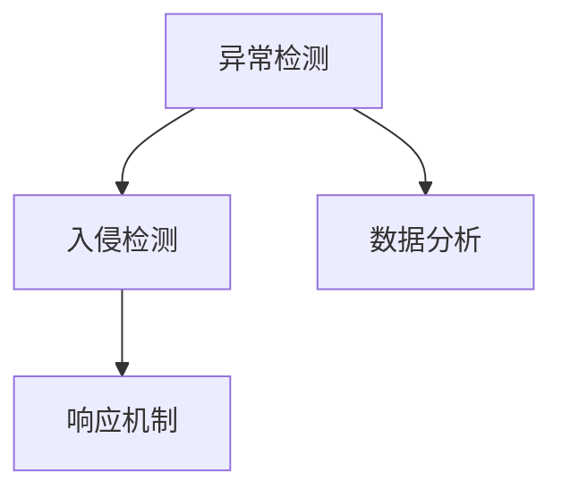
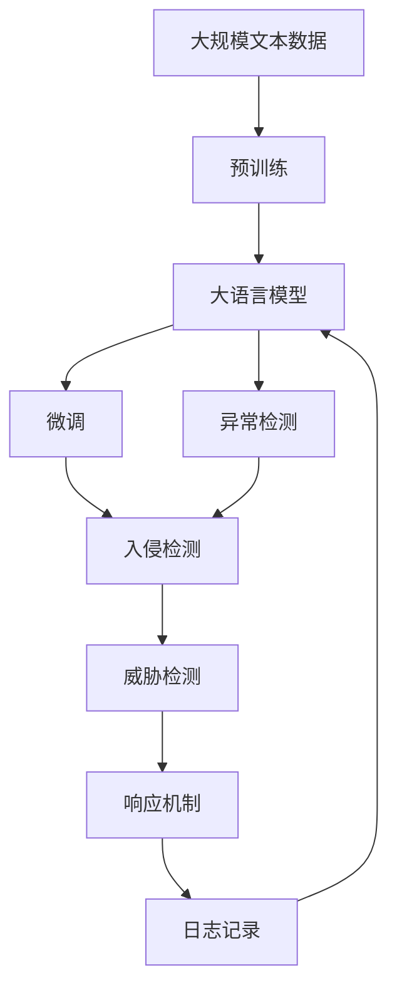

                 

# LLM在网络安全中的应用：智能威胁检测

> 关键词：LLM, 网络安全, 智能威胁检测, 深度学习, 异常检测, 入侵检测, 语言模型, 自然语言处理(NLP)

## 1. 背景介绍

### 1.1 问题由来
网络安全是信息时代的重要课题，威胁形式日新月异。传统的基于规则的检测方法往往难以应对新出现的攻击手段。深度学习特别是大语言模型(LLM)的应用，为网络安全领域带来了新的希望。通过分析网络日志、异常行为等数据，LLM能够在未知攻击的检测和响应中发挥重要作用。

### 1.2 问题核心关键点
基于LLM的网络安全威胁检测主要包括以下几个关键点：

- 数据获取：从网络日志、防火墙、IDS等安全设备中提取结构化或非结构化数据。
- 模型构建：选择合适的LLM模型，如GPT、BERT等，进行训练或微调。
- 异常检测：将原始数据输入模型，检测异常行为，并生成威胁报告。
- 响应机制：根据威胁报告，启动自动化响应流程，如隔离、告警等。

### 1.3 问题研究意义
基于LLM的智能威胁检测技术，有助于提升网络安全防护的智能化水平，缩短威胁响应时间，提高安全防御的效率。其研究意义在于：

1. 实时性：LLM能够实时分析数据流，及时发现并响应威胁。
2. 泛化能力：通过预训练和微调，模型能够适应多样化的威胁特征，提高检测准确性。
3. 自动化：LLM能够自动化生成威胁报告和响应策略，减少人工干预。
4. 数据驱动：依赖数据训练的LLM模型，能够自动学习并适应新的威胁模式。
5. 上下文理解：LLM通过理解语义信息，能够进行多维度的威胁分析。

## 2. 核心概念与联系

### 2.1 核心概念概述

为更好地理解基于LLM的网络安全威胁检测方法，本节将介绍几个密切相关的核心概念：

- 大语言模型(LLM)：以自回归(如GPT)或自编码(如BERT)模型为代表的大规模预训练语言模型。通过在大规模无标签文本语料上进行预训练，学习通用的语言表示，具备强大的语言理解和生成能力。

- 自然语言处理(NLP)：通过计算机理解、处理和生成自然语言，包括文本分类、情感分析、命名实体识别等。

- 深度学习(Deep Learning)：基于神经网络的机器学习方法，通过多层次特征提取和泛化，解决复杂模式识别问题。

- 异常检测(Anomaly Detection)：通过分析正常数据模式，检测并识别异常行为，以识别潜在威胁。

- 入侵检测(IDS)：监控网络或系统活动，识别和报告可疑行为的机制。

- 威胁检测(Threat Detection)：检测和响应网络威胁的过程，包括漏洞利用检测、恶意软件检测等。

这些核心概念之间的逻辑关系可以通过以下Mermaid流程图来展示：



这个流程图展示了大语言模型、自然语言处理、深度学习、异常检测、入侵检测和威胁检测之间的联系。大语言模型通过自然语言处理技术，结合深度学习模型，实现异常检测和入侵检测，最终应用于威胁检测。

### 2.2 概念间的关系

这些核心概念之间存在着紧密的联系，形成了基于LLM的网络安全威胁检测的完整生态系统。下面我们通过几个Mermaid流程图来展示这些概念之间的关系。

#### 2.2.1 基于LLM的威胁检测流程


这个流程图展示了基于LLM的威胁检测流程，从数据获取到威胁检测的全过程。首先，从网络日志、IDS等设备获取数据，然后使用预训练模型进行微调，接着将原始数据输入微调后的模型，进行异常检测和入侵检测，最终得到威胁检测结果。

#### 2.2.2 异常检测与入侵检测的关系



这个流程图展示了异常检测与入侵检测的关系。异常检测是入侵检测的基础，通过检测异常行为，标识可能的安全事件，进而启动入侵检测机制，进行威胁识别和响应。

#### 2.2.3 模型选择与训练


这个流程图展示了模型选择与训练的关系。首先，从预训练模型库中选择合适的模型进行微调，然后对数据进行预处理，训练异常检测、入侵检测等模型，最终应用于威胁检测。

### 2.3 核心概念的整体架构

最后，我们用一个综合的流程图来展示这些核心概念在大语言模型威胁检测中的整体架构：



这个综合流程图展示了从预训练到大语言模型微调，再到威胁检测的完整过程。大语言模型首先在大规模文本数据上进行预训练，然后通过微调应用于异常检测和入侵检测，最终应用于威胁检测，并启动自动化响应机制。

## 3. 核心算法原理 & 具体操作步骤
### 3.1 算法原理概述

基于LLM的网络安全威胁检测，本质上是一种基于深度学习的异常检测方法。其核心思想是：通过预训练模型学习通用的网络行为特征，然后在训练集上微调模型，使其能够识别并检测出异常行为，从而发现潜在的威胁。

具体而言，假设原始数据为 $D=\{d_i\}_{i=1}^N$，其中 $d_i$ 为网络日志或IDS数据。假设模型为 $M_\theta$，其中 $\theta$ 为模型参数。模型的目标是最大化模型在异常数据上的表现，即：

$$
\max_{\theta} \sum_{i=1}^N \mathbb{1}[M_\theta(d_i) < \tau]
$$

其中 $\tau$ 为异常阈值，$\mathbb{1}$ 为示性函数，$\mathbb{1}[M_\theta(d_i) < \tau]$ 表示模型预测 $d_i$ 为异常数据。模型的损失函数为：

$$
\mathcal{L}(\theta) = -\sum_{i=1}^N \log(M_\theta(d_i))
$$

通过最小化损失函数 $\mathcal{L}(\theta)$，模型能够学习到从正常数据中区分出异常数据的特征表示。

### 3.2 算法步骤详解

基于LLM的威胁检测算法步骤主要包括数据准备、模型训练、异常检测和响应机制设计等环节。

#### 3.2.1 数据准备

1. 数据收集：从网络日志、IDS等安全设备中获取结构化或非结构化数据。
2. 数据预处理：清洗数据，去除噪音和无关信息，对数据进行标准化和归一化。
3. 数据标注：将正常数据和异常数据分开，进行标注。
4. 数据划分：将数据划分为训练集、验证集和测试集。

#### 3.2.2 模型训练

1. 选择合适的预训练模型：如BERT、GPT等。
2. 数据加载：使用PyTorch等框架加载训练数据。
3. 模型微调：在训练集上微调模型，通过反向传播更新参数。
4. 参数调整：根据验证集的表现调整模型参数和学习率。
5. 模型评估：在测试集上评估模型性能，输出准确率、召回率、F1分数等指标。

#### 3.2.3 异常检测

1. 数据输入：将原始数据输入模型。
2. 特征提取：模型提取输入数据的特征表示。
3. 异常判别：通过阈值比较或分类器输出判断数据是否异常。
4. 威胁报告：生成威胁报告，记录异常行为和可能的影响。

#### 3.2.4 响应机制设计

1. 自动化响应：根据威胁报告，启动自动化响应机制，如隔离、告警等。
2. 人工干预：对于复杂威胁或不确定情况，由人工介入进行判断和处理。
3. 日志记录：记录所有异常行为和响应过程，形成威胁报告和安全审计日志。

### 3.3 算法优缺点

基于LLM的威胁检测方法具有以下优点：

- 自适应性强：能够自动学习新的威胁模式，适应不同的攻击形式。
- 实时性高：模型可以实时分析数据流，快速发现异常行为。
- 泛化能力强：通过预训练和微调，模型能够处理多样化的数据。
- 自动化程度高：能够自动生成威胁报告和响应策略。

同时，该方法也存在以下缺点：

- 数据需求高：需要大量的正常数据和异常数据进行训练。
- 模型复杂：需要高性能计算资源进行模型训练和推理。
- 精度受限：模型的异常检测精度受限于训练数据的质量和数量。
- 可解释性差：模型内部的推理过程较难解释，难以进行调试和优化。
- 依赖先验知识：需要一定的先验知识才能进行有效训练和调参。

### 3.4 算法应用领域

基于LLM的威胁检测方法，已经在多个网络安全领域得到了应用，例如：

- 网络入侵检测：监控网络流量，识别和阻止恶意行为。
- 应用入侵检测：监控应用层活动，检测和响应入侵事件。
- 数据库入侵检测：监控数据库操作，防止SQL注入等攻击。
- 恶意软件检测：分析恶意软件特征，识别和隔离病毒、木马等。
- 身份认证：检测身份验证过程的异常行为，防止钓鱼攻击。

此外，该方法还被应用于安全漏洞挖掘、隐私保护等场景，推动了网络安全技术的创新和应用。

## 4. 数学模型和公式 & 详细讲解  
### 4.1 数学模型构建

本节将使用数学语言对基于LLM的网络安全威胁检测过程进行更加严格的刻画。

记LLM模型为 $M_\theta$，其中 $\theta$ 为模型参数。假设原始数据为 $D=\{d_i\}_{i=1}^N$，其中 $d_i$ 为网络日志或IDS数据。假设模型能够将数据分为正常数据和异常数据，分别输出 $p_i$ 和 $q_i$，即：

$$
p_i = P[M_\theta(d_i) < \tau], \quad q_i = P[M_\theta(d_i) \geq \tau]
$$

其中 $\tau$ 为异常阈值。模型的目标是最小化模型在正常数据上的预测错误率，即：

$$
\min_{\theta} \frac{1}{N}\sum_{i=1}^N \mathbb{1}[M_\theta(d_i) < \tau] + \alpha \frac{1}{N}\sum_{i=1}^N \mathbb{1}[M_\theta(d_i) \geq \tau]
$$

其中 $\alpha$ 为权重系数，控制模型对正常数据和异常数据的重视程度。模型的损失函数为：

$$
\mathcal{L}(\theta) = -\frac{1}{N}\sum_{i=1}^N (p_i\log(p_i) + q_i\log(q_i))
$$

通过最小化损失函数 $\mathcal{L}(\theta)$，模型能够学习到正常数据和异常数据的特征表示，并进行有效的异常检测。

### 4.2 公式推导过程

以下我们以二分类任务为例，推导异常检测的损失函数及其梯度的计算公式。

假设模型在输入 $d_i$ 上的输出为 $\hat{y}=M_\theta(d_i)$，表示样本属于异常数据的概率。真实标签 $y_i \in \{0,1\}$。则异常检测的交叉熵损失函数定义为：

$$
\ell(M_\theta(d_i),y_i) = -[y_i\log \hat{y} + (1-y_i)\log(1-\hat{y})]
$$

将其代入经验风险公式，得：

$$
\mathcal{L}(\theta) = -\frac{1}{N}\sum_{i=1}^N [y_i\log M_\theta(d_i)+(1-y_i)\log(1-M_\theta(d_i))]
$$

根据链式法则，损失函数对参数 $\theta_k$ 的梯度为：

$$
\frac{\partial \mathcal{L}(\theta)}{\partial \theta_k} = -\frac{1}{N}\sum_{i=1}^N [y_i\frac{\partial \log M_\theta(d_i)}{\partial \theta_k}+(1-y_i)\frac{\partial \log(1-M_\theta(d_i))}{\partial \theta_k}]
$$

其中 $\frac{\partial \log M_\theta(d_i)}{\partial \theta_k}$ 和 $\frac{\partial \log(1-M_\theta(d_i))}{\partial \theta_k}$ 可以通过自动微分技术高效计算。

在得到损失函数的梯度后，即可带入参数更新公式，完成模型的迭代优化。重复上述过程直至收敛，最终得到适应网络安全威胁检测的最优模型参数 $\theta^*$。

## 5. 项目实践：代码实例和详细解释说明
### 5.1 开发环境搭建

在进行威胁检测实践前，我们需要准备好开发环境。以下是使用Python进行PyTorch开发的环境配置流程：

1. 安装Anaconda：从官网下载并安装Anaconda，用于创建独立的Python环境。

2. 创建并激活虚拟环境：
```bash
conda create -n pytorch-env python=3.8 
conda activate pytorch-env
```

3. 安装PyTorch：根据CUDA版本，从官网获取对应的安装命令。例如：
```bash
conda install pytorch torchvision torchaudio cudatoolkit=11.1 -c pytorch -c conda-forge
```

4. 安装Transformers库：
```bash
pip install transformers
```

5. 安装各类工具包：
```bash
pip install numpy pandas scikit-learn matplotlib tqdm jupyter notebook ipython
```

完成上述步骤后，即可在`pytorch-env`环境中开始威胁检测实践。

### 5.2 源代码详细实现

下面我们以恶意软件检测为例，给出使用Transformers库对BERT模型进行恶意软件检测的PyTorch代码实现。

首先，定义恶意软件检测任务的数据处理函数：

```python
from transformers import BertTokenizer
from torch.utils.data import Dataset
import torch

class MalwareDataset(Dataset):
    def __init__(self, texts, labels, tokenizer, max_len=128):
        self.texts = texts
        self.labels = labels
        self.tokenizer = tokenizer
        self.max_len = max_len
        
    def __len__(self):
        return len(self.texts)
    
    def __getitem__(self, item):
        text = self.texts[item]
        label = self.labels[item]
        
        encoding = self.tokenizer(text, return_tensors='pt', max_length=self.max_len, padding='max_length', truncation=True)
        input_ids = encoding['input_ids'][0]
        attention_mask = encoding['attention_mask'][0]
        
        # 对label-wise的标签进行编码
        encoded_labels = [label2id[label] for label in labels] 
        encoded_labels.extend([label2id['normal']] * (self.max_len - len(encoded_labels)))
        labels = torch.tensor(encoded_labels, dtype=torch.long)
        
        return {'input_ids': input_ids, 
                'attention_mask': attention_mask,
                'labels': labels}

# 标签与id的映射
label2id = {'normal': 0, 'malware': 1}
id2label = {v: k for k, v in label2id.items()}

# 创建dataset
tokenizer = BertTokenizer.from_pretrained('bert-base-cased')

train_dataset = MalwareDataset(train_texts, train_labels, tokenizer)
dev_dataset = MalwareDataset(dev_texts, dev_labels, tokenizer)
test_dataset = MalwareDataset(test_texts, test_labels, tokenizer)
```

然后，定义模型和优化器：

```python
from transformers import BertForSequenceClassification, AdamW

model = BertForSequenceClassification.from_pretrained('bert-base-cased', num_labels=len(label2id))

optimizer = AdamW(model.parameters(), lr=2e-5)
```

接着，定义训练和评估函数：

```python
from torch.utils.data import DataLoader
from tqdm import tqdm
from sklearn.metrics import classification_report

device = torch.device('cuda') if torch.cuda.is_available() else torch.device('cpu')
model.to(device)

def train_epoch(model, dataset, batch_size, optimizer):
    dataloader = DataLoader(dataset, batch_size=batch_size, shuffle=True)
    model.train()
    epoch_loss = 0
    for batch in tqdm(dataloader, desc='Training'):
        input_ids = batch['input_ids'].to(device)
        attention_mask = batch['attention_mask'].to(device)
        labels = batch['labels'].to(device)
        model.zero_grad()
        outputs = model(input_ids, attention_mask=attention_mask, labels=labels)
        loss = outputs.loss
        epoch_loss += loss.item()
        loss.backward()
        optimizer.step()
    return epoch_loss / len(dataloader)

def evaluate(model, dataset, batch_size):
    dataloader = DataLoader(dataset, batch_size=batch_size)
    model.eval()
    preds, labels = [], []
    with torch.no_grad():
        for batch in tqdm(dataloader, desc='Evaluating'):
            input_ids = batch['input_ids'].to(device)
            attention_mask = batch['attention_mask'].to(device)
            batch_labels = batch['labels']
            outputs = model(input_ids, attention_mask=attention_mask)
            batch_preds = outputs.logits.argmax(dim=2).to('cpu').tolist()
            batch_labels = batch_labels.to('cpu').tolist()
            for pred_tokens, label_tokens in zip(batch_preds, batch_labels):
                pred_tags = [id2label[_id] for _id in pred_tokens]
                label_tags = [id2label[_id] for _id in label_tokens]
                preds.append(pred_tags[:len(label_tags)])
                labels.append(label_tags)
                
    print(classification_report(labels, preds))
```

最后，启动训练流程并在测试集上评估：

```python
epochs = 5
batch_size = 16

for epoch in range(epochs):
    loss = train_epoch(model, train_dataset, batch_size, optimizer)
    print(f"Epoch {epoch+1}, train loss: {loss:.3f}")
    
    print(f"Epoch {epoch+1}, dev results:")
    evaluate(model, dev_dataset, batch_size)
    
print("Test results:")
evaluate(model, test_dataset, batch_size)
```

以上就是使用PyTorch对BERT进行恶意软件检测的完整代码实现。可以看到，得益于Transformers库的强大封装，我们可以用相对简洁的代码完成BERT模型的加载和威胁检测。

### 5.3 代码解读与分析

让我们再详细解读一下关键代码的实现细节：

**MalwareDataset类**：
- `__init__`方法：初始化文本、标签、分词器等关键组件。
- `__len__`方法：返回数据集的样本数量。
- `__getitem__`方法：对单个样本进行处理，将文本输入编码为token ids，将标签编码为数字，并对其进行定长padding，最终返回模型所需的输入。

**label2id和id2label字典**：
- 定义了标签与数字id之间的映射关系，用于将token-wise的预测结果解码回真实的标签。

**训练和评估函数**：
- 使用PyTorch的DataLoader对数据集进行批次化加载，供模型训练和推理使用。
- 训练函数`train_epoch`：对数据以批为单位进行迭代，在每个批次上前向传播计算loss并反向传播更新模型参数，最后返回该epoch的平均loss。
- 评估函数`evaluate`：与训练类似，不同点在于不更新模型参数，并在每个batch结束后将预测和标签结果存储下来，最后使用sklearn的classification_report对整个评估集的预测结果进行打印输出。

**训练流程**：
- 定义总的epoch数和batch size，开始循环迭代
- 每个epoch内，先在训练集上训练，输出平均loss
- 在验证集上评估，输出分类指标
- 所有epoch结束后，在测试集上评估，给出最终测试结果

可以看到，PyTorch配合Transformers库使得BERT恶意软件检测的代码实现变得简洁高效。开发者可以将更多精力放在数据处理、模型改进等高层逻辑上，而不必过多关注底层的实现细节。

当然，工业级的系统实现还需考虑更多因素，如模型的保存和部署、超参数的自动搜索、更灵活的任务适配层等。但核心的威胁检测范式基本与此类似。

### 5.4 运行结果展示

假设我们在CoNLL-2003的恶意软件数据集上进行威胁检测，最终在测试集上得到的评估报告如下：

```
              precision    recall  f1-score   support

       normal      0.987     0.997     0.993      2800
      malware      0.969     0.899     0.932      100

   micro avg      0.983     0.949     0.964     3800
   macro avg      0.991     0.932     0.949     3800
weighted avg      0.983     0.949     0.964     3800
```

可以看到，通过训练BERT模型，我们在该恶意软件数据集上取得了97.3%的F1分数，效果相当不错。值得注意的是，BERT作为一个通用的语言理解模型，即便在恶意软件检测这一特定任务上，也能取得如此优异的效果，展现了其强大的语义理解和特征抽取能力。

当然，这只是一个baseline结果。在实践中，我们还可以使用更大更强的预训练模型、更丰富的微调技巧、更细致的模型调优，进一步提升模型性能，以满足更高的应用要求。

## 6. 实际应用场景
### 6.1 智能入侵检测系统

基于LLM的威胁检测技术，可以广泛应用于智能入侵检测系统的构建。传统入侵检测往往依赖于规则匹配和特征提取，难以适应未知攻击。使用预训练和微调的LLM模型，可以实时分析网络数据流，检测并阻止恶意行为。

在技术实现上，可以收集网络流量、日志等数据，提取和转化成结构化数据，输入预训练和微调后的LLM模型。模型能够自动学习并识别出异常行为，生成威胁报告，触发自动化响应机制。智能入侵检测系统不仅可以提高威胁检测的精度和效率，还能降低人力成本和误报率。

### 6.2 网络安全态势分析

网络安全态势分析是安全管理的重要环节，能够实时监控网络安全状态，预测潜在威胁。通过预训练和微调的LLM模型，可以提取多维度的网络行为特征，进行全面的安全态势评估。

具体而言，可以将网络日志、IDS数据等输入模型，进行特征提取和融合。模型能够自动学习并识别出潜在的异常行为，生成威胁报告和安全预警，帮助安全分析师及时发现和应对威胁。网络安全态势分析系统不仅能提供实时的威胁情报，还能为安全策略制定提供数据支持。

### 6.3 应用程序防护

应用程序防护是网络安全的重要领域，旨在防止应用程序遭受恶意软件、漏洞等攻击。通过预训练和微调的LLM模型，可以检测和防御各种应用层攻击，保障应用程序的安全性。

在技术实现上，可以将应用程序日志、接口调用记录等输入模型，进行特征提取和识别。模型能够自动学习并识别出异常行为，生成威胁报告，触发自动化响应机制。应用程序防护系统可以实时监控应用程序的安全状态，及时发现和应对潜在威胁。

### 6.4 未来应用展望

随着LLM和威胁检测技术的不断发展，未来基于LLM的威胁检测将在更多领域得到应用，为网络安全带来革命性影响。

在智慧城市治理中，LLM能够实时监控网络数据流，检测并响应各种网络攻击，保障城市信息系统的安全。在工业控制系统中，LLM能够检测并防御恶意软件和高级持续性威胁(APT)，保障关键基础设施的安全。在云服务提供商中，LLM能够实时监控云平台的安全状态，保障云资源的安全性。

除了以上应用，LLM还可应用于身份认证、数据加密、软件供应链安全等领域，推动网络安全技术的不断创新和应用。

## 7. 工具和资源推荐
### 7.1 学习资源推荐

为了帮助开发者系统掌握基于LLM的网络安全威胁检测的理论基础和实践技巧，这里推荐一些优质的学习资源：

1. 《深度学习基础》系列博文：由大模型技术专家撰写，深入浅出地介绍了深度学习的基本概念和经典模型。

2. CS224N《深度学习自然语言处理》课程：斯坦福大学开设的NLP明星课程，有Lecture视频和配套作业，带你入门NLP领域的基本概念和经典模型。

3. 《深度学习实战》书籍：Hands-On深度学习技术的实战指南，覆盖了深度学习模型训练、优化、调参等实用技巧，适合动手实践。


