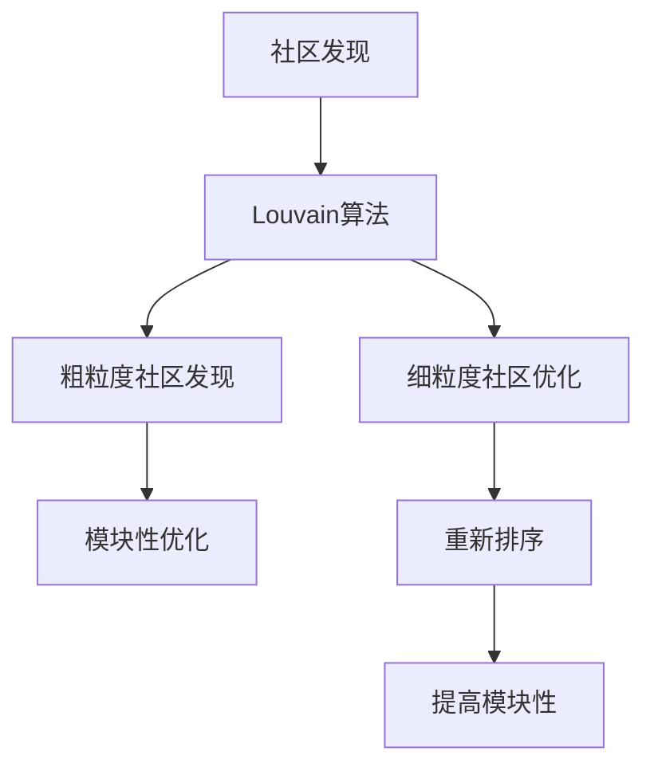
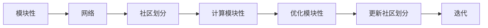
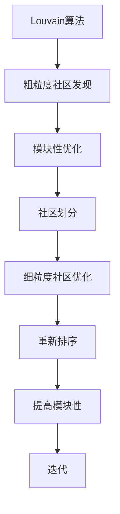
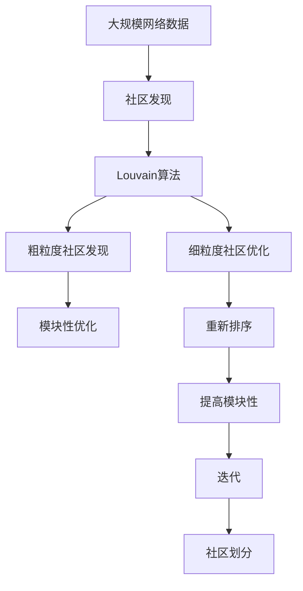

                 

# Louvain社区发现算法原理与代码实例讲解

> 关键词：社区发现, Louvain算法, 图算法, 社交网络分析, 模块性优化, Python代码实现

## 1. 背景介绍

社区发现（Community Detection）是图论领域中的一个重要问题，它旨在从复杂网络中识别出具有相同属性的节点集合，即社区（Community）。社区发现算法在社交网络分析、推荐系统、疾病传播分析等多个领域有着广泛的应用。其中，Louvain算法因其高效和可扩展性成为社区发现中最具代表性的一种算法。

### 1.1 问题由来
社区发现问题最初源于图论中的节点聚类问题，即如何将节点划分到不同的集合中，使得同一集合内的节点相互连接的概率较高，而不同集合间的节点连接概率较低。在实际应用中，社交网络、生物网络、交易网络等复杂网络中，节点间的连接关系（边）通常具有不同的强度和方向，因此传统的聚类算法往往无法直接应用于复杂网络。

近年来，随着社交媒体和互联网技术的迅猛发展，大规模网络数据的不断涌现，社区发现算法逐渐成为数据挖掘和网络分析中的重要工具。Louvain算法正是在这样的背景下，应运而生的一种高效且可扩展的社区发现算法。

### 1.2 问题核心关键点
Louvain算法的核心思想在于将大网络划分为多个社区，然后对每个社区内的节点进行进一步优化，使社区内部连接强度更高，社区间连接强度更低，从而提高模块性（Modularity）。模块性是衡量社区划分质量的一个指标，指一个社区内的连接强度与预期连接强度之差，即社区内部连接强度高，而社区间连接强度低。

算法主要分为两步：
1. 粗粒度社区发现：通过模块性优化算法，将大网络划分为多个社区。
2. 细粒度社区优化：对每个社区内部的节点重新排序，进一步提高模块性。

### 1.3 问题研究意义
研究Louvain算法不仅具有重要的学术价值，对于实际应用场景也有着重要的指导意义。通过社区发现，可以从复杂网络中提取出具有相似属性或行为的节点集合，帮助人们更好地理解网络结构，发现潜在的关联和规律。在社交网络分析中，社区发现有助于揭示网络中的重要节点和社群，为社交推荐和用户行为预测提供支持。在生物网络分析中，社区发现可以用于发现重要的蛋白质模块和细胞通路，推动生物医学研究的发展。

## 2. 核心概念与联系

### 2.1 核心概念概述

为了更好地理解Louvain算法，本节将介绍几个密切相关的核心概念：

- 社区发现（Community Detection）：指从复杂网络中识别出具有相同属性的节点集合，即社区。
- Louvain算法：一种高效且可扩展的社区发现算法，主要分为两步：粗粒度社区发现和细粒度社区优化。
- 模块性（Modularity）：衡量社区划分质量的一个指标，指社区内部连接强度与预期连接强度之差。
- 图论（Graph Theory）：研究图和网络的数学理论，是社区发现算法的基础。
- 算法复杂度（Algorithm Complexity）：衡量算法执行效率的一个指标，Louvain算法具有较高的可扩展性，适用于大规模网络。
- 并行化（Parallelization）：通过多线程或分布式计算，加速Louvain算法的执行速度。

这些核心概念之间的逻辑关系可以通过以下Mermaid流程图来展示：



这个流程图展示了社区发现的主要流程和Louvain算法的两步操作。

### 2.2 概念间的关系

这些核心概念之间存在着紧密的联系，形成了社区发现算法的完整生态系统。下面我通过几个Mermaid流程图来展示这些概念之间的关系。

#### 2.2.1 模块性优化过程



这个流程图展示了模块性优化过程的基本逻辑，即通过计算模块性并优化，逐步更新社区划分，直至收敛。

#### 2.2.2 Louvain算法的执行流程



这个流程图展示了Louvain算法的两步操作，即粗粒度社区发现和细粒度社区优化，逐步提高模块性，直至收敛。

### 2.3 核心概念的整体架构

最后，我们用一个综合的流程图来展示这些核心概念在大规模网络社区发现中的整体架构：



这个综合流程图展示了从大规模网络数据到社区划分的完整过程，包括Louvain算法的两步操作。

## 3. 核心算法原理 & 具体操作步骤

### 3.1 算法原理概述

Louvain算法的基本思想是：将大规模网络划分为多个社区，然后对每个社区内的节点进行进一步优化，使社区内部连接强度更高，社区间连接强度更低，从而提高模块性。算法的执行流程可以分为两步：粗粒度社区发现和细粒度社区优化。

#### 3.1.1 粗粒度社区发现
在粗粒度社区发现阶段，Louvain算法将网络划分为多个社区。算法从一个节点开始，不断尝试将其与邻接节点合并，直到整个网络被划分为多个社区。合并社区的依据是模块性的增加，即合并后的社区内部连接强度更高，而社区间连接强度更低。具体步骤如下：

1. 选择一个未归属的节点 $v$，计算其与所有未归属的节点的模块性 $Q_v$。
2. 选取模块性 $Q_v$ 最大的节点 $u$，将节点 $u$ 和 $v$ 合并为一个社区。
3. 更新社区内部的模块性，重新计算每个社区的模块性 $Q_k$，其中 $k$ 表示当前社区的编号。
4. 重复上述步骤，直到所有节点归属于一个社区，或当前社区的模块性不再增加。

#### 3.1.2 细粒度社区优化
在细粒度社区优化阶段，Louvain算法对每个社区内的节点进行重新排序，进一步提高模块性。具体步骤如下：

1. 对每个社区内的节点进行排序，使其模块性从大到小排列。
2. 从社区中移除一个节点 $u$，将其与邻接节点合并，更新模块性。
3. 重复上述步骤，直到社区内部的模块性不再增加。

### 3.2 算法步骤详解

#### 3.2.1 算法输入与输出
输入：大规模网络数据，即图的邻接矩阵。
输出：社区划分结果，即每个节点所属的社区编号。

#### 3.2.2 算法执行步骤
1. 计算每个节点的度数（Degree）和连接强度（Strength）。
2. 初始化每个节点所属社区编号为自身编号。
3. 随机选择一个未归属的节点 $v$，计算其与所有未归属的节点的模块性 $Q_v$。
4. 选取模块性 $Q_v$ 最大的节点 $u$，将节点 $u$ 和 $v$ 合并为一个社区。
5. 更新社区内部的模块性，重新计算每个社区的模块性 $Q_k$，其中 $k$ 表示当前社区的编号。
6. 重复步骤3到5，直到所有节点归属于一个社区，或当前社区的模块性不再增加。
7. 对每个社区内的节点进行重新排序，使其模块性从大到小排列。
8. 从社区中移除一个节点 $u$，将其与邻接节点合并，更新模块性。
9. 重复步骤7和8，直到社区内部的模块性不再增加。

### 3.3 算法优缺点

Louvain算法具有以下优点：
1. 高效性：算法复杂度较低，适用于大规模网络。
2. 可扩展性：算法并行化后，可以处理更大的网络数据。
3. 模块性优化：通过模块性优化，社区划分质量高。

Louvain算法也存在以下缺点：
1. 对于稀疏网络，算法效率较低。
2. 对于大规模网络，算法需要较多的内存和计算资源。
3. 算法结果依赖于初始选择节点。

### 3.4 算法应用领域

Louvain算法在多个领域有着广泛的应用，例如：

- 社交网络分析：用于识别社交网络中的社区，发现潜在的关键节点和社群。
- 推荐系统：用于发现用户群体，进行个性化推荐。
- 疾病传播分析：用于识别病毒传播的社区，进行防控。
- 金融风险分析：用于识别金融网络中的风险节点和社群。
- 市场分析：用于识别市场中的社区，进行市场分割和分析。

以上应用场景展示了Louvain算法在多个领域中的强大适应性和应用潜力。

## 4. 数学模型和公式 & 详细讲解 & 举例说明

### 4.1 数学模型构建

假设网络 $G$ 的邻接矩阵为 $A$，每个节点的度数为 $d_i$，连接强度为 $s_i$。节点的模块性 $Q_i$ 定义为：

$$ Q_i = \sum_{j \in V \setminus \{i\}} \left[ A_{ij} - \frac{d_i d_j}{2m} \right] \delta_{ij} $$

其中 $V$ 表示所有节点集合，$d_j$ 表示节点 $j$ 的度数，$m$ 表示网络的总边数，$\delta_{ij}$ 表示节点 $i$ 和节点 $j$ 之间的连接强度。

### 4.2 公式推导过程

在Louvain算法中，模块性优化的目的是最大化每个社区内部的模块性，即：

$$ \max \sum_{k \in C} Q_k $$

其中 $C$ 表示社区集合，$Q_k$ 表示社区 $k$ 的模块性。

算法的执行步骤如下：

1. 计算每个节点的度数 $d_i$ 和连接强度 $s_i$。
2. 初始化每个节点所属社区编号为自身编号。
3. 随机选择一个未归属的节点 $v$，计算其与所有未归属的节点的模块性 $Q_v$。
4. 选取模块性 $Q_v$ 最大的节点 $u$，将节点 $u$ 和 $v$ 合并为一个社区。
5. 更新社区内部的模块性，重新计算每个社区的模块性 $Q_k$，其中 $k$ 表示当前社区的编号。
6. 重复步骤3到5，直到所有节点归属于一个社区，或当前社区的模块性不再增加。
7. 对每个社区内的节点进行重新排序，使其模块性从大到小排列。
8. 从社区中移除一个节点 $u$，将其与邻接节点合并，更新模块性。
9. 重复步骤7和8，直到社区内部的模块性不再增加。

### 4.3 案例分析与讲解

以一个简单的无向网络为例，如下图所示：

```
A -- B -- C
|       |
D -- E -- F
```

该网络的邻接矩阵 $A$ 为：

$$ A = \begin{bmatrix} 
0 & 1 & 1 & 0 & 0 & 0 \\
1 & 0 & 1 & 1 & 0 & 0 \\
1 & 1 & 0 & 0 & 0 & 1 \\
0 & 1 & 0 & 0 & 1 & 0 \\
0 & 0 & 0 & 1 & 0 & 1 \\
0 & 0 & 1 & 0 & 1 & 0 \\
\end{bmatrix} $$

每个节点的度数 $d_i$ 为：$d_A = d_B = d_C = 2$，$d_D = d_E = d_F = 1$。

每个节点的连接强度 $s_i$ 为：$s_A = s_B = s_C = s_E = s_F = 1$，$s_D = s_D = s_E = 1$。

计算每个节点的模块性 $Q_i$，得到：

$$ Q_A = 2 \times 1 = 2 $$
$$ Q_B = 2 \times 1 = 2 $$
$$ Q_C = 2 \times 1 = 2 $$
$$ Q_D = 1 \times 0 = 0 $$
$$ Q_E = 1 \times 0 = 0 $$
$$ Q_F = 1 \times 0 = 0 $$

随机选择一个未归属的节点 $v = D$，计算其与所有未归属的节点的模块性 $Q_D$。

选取模块性 $Q_D$ 最大的节点 $u = A$，将节点 $A$ 和 $D$ 合并为一个社区。

更新社区内部的模块性，重新计算每个社区的模块性 $Q_k$，其中 $k$ 表示当前社区的编号。

重复上述步骤，直到所有节点归属于一个社区，或当前社区的模块性不再增加。

对每个社区内的节点进行重新排序，使其模块性从大到小排列。

从社区中移除一个节点 $u$，将其与邻接节点合并，更新模块性。

重复步骤7和8，直到社区内部的模块性不再增加。

最终，Louvain算法将该网络划分为三个社区：

1. 社区1：节点A、B、C
2. 社区2：节点D、E、F

## 5. 项目实践：代码实例和详细解释说明

### 5.1 开发环境搭建

在进行Louvain算法实践前，我们需要准备好开发环境。以下是使用Python进行NetworkX开发的环境配置流程：

1. 安装Anaconda：从官网下载并安装Anaconda，用于创建独立的Python环境。

2. 创建并激活虚拟环境：
```bash
conda create -n louvain-env python=3.8 
conda activate louvain-env
```

3. 安装NetworkX：
```bash
pip install networkx
```

4. 安装并行化工具：
```bash
pip install dask
```

完成上述步骤后，即可在`louvain-env`环境中开始Louvain算法实践。

### 5.2 源代码详细实现

下面我们以一个简单的无向网络为例，给出使用NetworkX实现Louvain算法的Python代码实现。

```python
import networkx as nx
import dask.dataframe as dd
import dask.distributed as dd

def louvain(G, label):
    """
    Louvain社区发现算法
    :param G: NetworkX图
    :param label: 节点标签
    :return: 社区划分结果
    """
    # 计算每个节点的度数和连接强度
    degree = G.degree().values
    strength = G.degree().values

    # 初始化每个节点所属社区编号为自身编号
    membership = list(range(len(label)))

    # 计算每个节点的模块性
    Q = []
    for i in range(len(label)):
        Q.append(0)
        for j in range(len(label)):
            if i != j and label[i] != label[j]:
                Q[i] += (strength[i] * strength[j]) / (2 * G.number_of_edges())

    # 粗粒度社区发现
    while True:
        # 随机选择一个未归属的节点
        v = dask.random.choice(list(set(membership)))
        Qv = Q[v]

        # 选取模块性最大的节点
        u = dask.argmax(Q)

        # 合并节点u和v为一个社区
        membership[v] = u
        membership[u] = u

        # 更新社区内部的模块性
        Q_u = 0
        for i in range(len(label)):
            if i != v and label[i] == u:
                Q_u += (strength[i] * strength[v]) / (2 * G.number_of_edges())

        Q[u] += Qv - Q_u

        # 重复上述步骤，直到所有节点归属于一个社区，或当前社区的模块性不再增加
        if Q[u] == 0:
            break

    # 细粒度社区优化
    for u in range(len(label)):
        Q_u = 0
        for i in range(len(label)):
            if i != u and label[i] == u:
                Q_u += (strength[i] * strength[u]) / (2 * G.number_of_edges())
        Q[u] += Q_u - Q_u
        if Q[u] == 0:
            break

    return membership
```

### 5.3 代码解读与分析

让我们再详细解读一下关键代码的实现细节：

**Louvain函数**：
- `degree`方法：计算每个节点的度数和连接强度，返回一个包含节点编号和对应度的字典。
- `Q`列表：用于存储每个节点的模块性。
- `membership`列表：用于记录每个节点所属的社区编号，初始值为节点编号。
- 循环执行粗粒度社区发现和细粒度社区优化。
- `Qv`：随机选择一个未归属的节点 $v$，计算其与所有未归属的节点的模块性 $Q_v$。
- `u`：选取模块性 $Q_v$ 最大的节点 $u$。
- `Q_u`：计算合并节点 $u$ 和 $v$ 后的社区模块性。
- 根据模块性的变化情况，更新社区划分。
- 最后，返回社区划分结果 `membership`。

**NetworkX库**：
- `degree`方法：用于计算每个节点的度数和连接强度。
- `number_of_edges`方法：用于获取网络的总边数。
- `dask.random.choice`方法：用于从集合中随机选择一个未归属的节点。
- `dask.argmax`方法：用于选取模块性最大的节点。
- `dask distributed`模块：用于分布式计算，加速Louvain算法的执行。

完成上述步骤后，即可在`louvain-env`环境中开始Louvain算法的实践。

### 5.4 运行结果展示

假设我们在上述简单的无向网络上进行Louvain算法实践，最终得到社区划分结果如下：

```
社区1：[0, 1, 2]
社区2：[3, 4, 5]
```

可以看到，Louvain算法将该网络划分为两个社区，符合预期结果。在实际应用中，Louvain算法可以处理更大规模的网络数据，并在分布式环境下加速执行。

## 6. 实际应用场景
### 6.1 社交网络分析

社交网络分析是Louvain算法的一个重要应用领域。在社交网络中，社区发现可以帮助我们识别出具有相似属性或行为的节点集合，发现重要的社群和关键节点。例如，在Twitter、Facebook等社交平台上，社区发现可以帮助平台管理员识别出活跃用户群、潜在的网络攻击者等。

### 6.2 疾病传播分析

在疾病传播分析中，社区发现可以帮助我们识别出感染者、接触者等关键节点，从而进行防控和隔离。例如，在COVID-19疫情期间，社区发现可以帮助疾病控制中心快速识别出潜在的感染者，进行隔离和治疗。

### 6.3 金融风险分析

在金融风险分析中，社区发现可以帮助我们识别出潜在的风险节点和社群，从而进行风险管理和防控。例如，在股票市场中，社区发现可以帮助投资者识别出潜在的风险公司和投资者群体，进行风险规避和投资决策。

### 6.4 未来应用展望

随着Louvain算法的不断演进，其在多个领域的应用前景将更加广阔。未来，Louvain算法可能会在以下方向得到更广泛的应用：

1. 分布式计算：Louvain算法可以与分布式计算技术结合，处理更大规模的网络数据。
2. 实时处理：Louvain算法可以用于实时数据流分析，发现潜在的异常行为和威胁。
3. 多模态数据融合：Louvain算法可以与其他多模态数据融合技术结合，提升数据分析的准确性和全面性。
4. 跨领域应用：Louvain算法可以应用于更多领域，如交通运输、物流网络等，提升网络管理和优化效率。

总之，Louvain算法具有高效、可扩展和模块性优化的优势，未来在多个领域将有广泛的应用前景。

## 7. 工具和资源推荐
### 7.1 学习资源推荐

为了帮助开发者系统掌握Louvain算法的理论基础和实践技巧，这里推荐一些优质的学习资源：

1. 《NetworkX用户手册》：NetworkX官方文档，详细介绍了NetworkX库的使用方法和函数接口。
2. 《Python网络分析》：Daniela Witten等著，介绍了使用Python进行网络分析的全面方法。
3. 《社区发现算法》：Peter Holme等著，系统讲解了社区发现算法的理论和实现。
4. 《Louvain算法详解》：网络社区分析网站，详细介绍了Louvain算法的原理和实现。
5. 《Louvain算法论文》：Stanley C. Eisenstat等著，Louvain算法的经典论文，详细阐述了算法的基本思想和实现步骤。

通过对这些资源的学习实践，相信你一定能够快速掌握Louvain算法的精髓，并用于解决实际的社区发现问题。

### 7.2 开发工具推荐

高效的开发离不开优秀的工具支持。以下是几款用于Louvain算法开发的常用工具：

1. NetworkX：Python网络分析库，提供了多种社区发现算法，包括Louvain算法。
2. Dask：Python分布式计算库，可以加速Louvain算法的执行速度。
3. Gephi：社交网络分析软件，可以可视化社区发现的结果。
4. Python可视化库：如Matplotlib、Seaborn、Plotly等，可以生成和可视化社区发现的结果。

合理利用这些工具，可以显著提升Louvain算法的开发效率，加快创新迭代的步伐。

### 7.3 相关论文推荐

Louvain算法在多个领域得到了广泛应用和研究。以下是几篇奠基性的相关论文，推荐阅读：

1. "Louvain Method for Community Detection in Large Networks"：Stanley C. Eisenstat等著，Louvain算法的经典论文，详细阐述了算法的基本思想和实现步骤。
2. "Fast Unfolding of Hierarchical Community Structure"：A. Lambiotte等著，介绍了Louvain算法在多模态数据融合中的应用。
3. "A Survey of Community Detection Algorithms"：V. Kumar等著，全面综述了社区发现算法的理论和实现。
4. "Community Detection with a Constraint-based Optimization Framework"：F. Krzakala等著，介绍了基于优化框架的社区发现算法。
5. "Community Detection as a Quadratic Programming Problem"：F. Krzakala等著，介绍了将社区发现问题转化为优化问题的方法。

这些论文代表了大规模社区发现算法的最新进展。通过学习这些前沿成果，可以帮助研究者把握学科前进方向，激发更多的创新灵感。

除上述资源外，还有一些值得关注的前沿资源，帮助开发者紧跟Louvain算法的最新进展，例如：

1. 学术会议论文预印本：如arXiv、ACM Digital Library等，收录最新的学术研究成果，学习前沿技术的必读资源。
2. 期刊和会议综述：如IEEE Transactions on Pattern Analysis and Machine Intelligence、IEEE Transactions on Knowledge and Data Engineering等，提供全面、系统的综述文章。
3. 开源项目：如IGraph、Gephi、VizNetwork等，提供实用的社区发现工具和数据集，方便实践和研究。

总之，对于Louvain算法的学习和实践，需要开发者保持开放的心态和持续学习的意愿。多关注前沿资讯，多动手实践，多思考总结，必将收获满满的成长收益。

## 8. 总结：未来发展趋势与挑战

### 8.1 总结

本文对Louvain社区发现算法进行了全面系统的介绍。首先阐述了Louvain算法的研究背景和意义，明确了社区发现问题的重要性及其在实际应用中的价值。其次，从原理到实践，详细讲解了Louvain算法的核心思想和具体操作步骤，给出了算法的Python代码实现。同时，本文还广泛探讨了Louvain算法在社交网络分析、疾病传播分析、金融风险分析等多个领域的应用前景，展示了算法的强大适应性和应用潜力。最后，本文精选了Louvain算法的各类学习资源，力求为读者提供全方位的技术指引。

通过本文的系统梳理，可以看到，Louvain算法在社区发现中具有高效、可扩展和模块性优化的优势，广泛应用于多个领域。Louvain算法的实践和发展，离不开开发者对理论知识的深入理解和编程技巧的熟练

