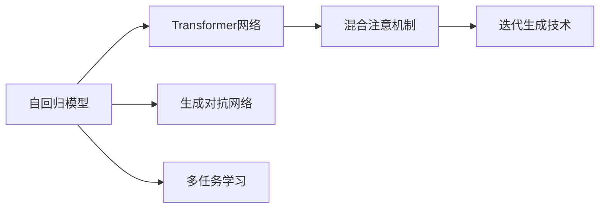
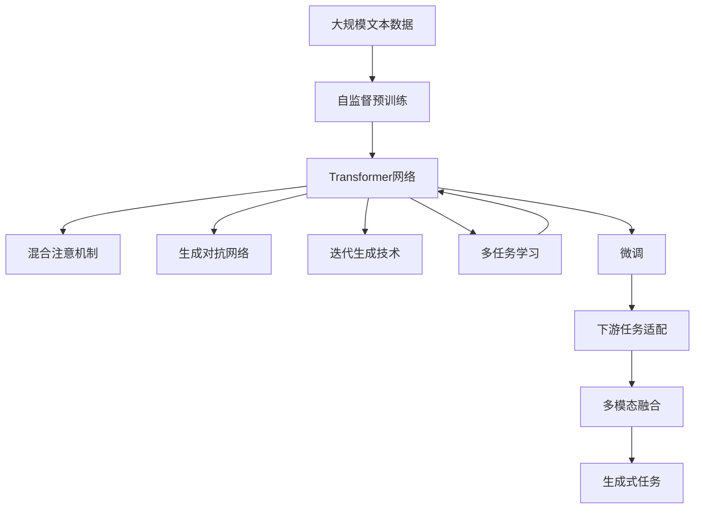

                 

# OpenAI的最新模型GPT-4o

> 关键词：GPT-4o, 自然语言处理(NLP), 深度学习, 大语言模型, 生成对抗网络, 创新技术, 应用前景

## 1. 背景介绍

### 1.1 问题由来

随着人工智能技术的不断进步，OpenAI在生成式模型领域取得了显著的突破。其最新模型GPT-4o不仅在语言生成能力上有所提升，更在多模态融合、推理能力等方面实现了新的飞跃。GPT-4o不仅在文本生成、问答、摘要等领域取得了优异的表现，还在图像描述、视频生成、多模态对话等方向展示了卓越的潜力。

GPT-4o的发布再次证明了OpenAI在生成式AI领域的领导地位，吸引了全球科研人员和业界的广泛关注。本文将详细探讨GPT-4o的原理、技术细节和应用场景，以及其对未来AI技术的潜在影响。

### 1.2 问题核心关键点

GPT-4o的发布标志着深度学习技术在生成式模型上的又一次重大进展。其核心技术点包括：
- 自回归架构，通过自监督预训练学习语言模型
- 多层Transformer网络，提升模型的语言理解能力
- 混合注意机制，加强不同模态间的融合
- 语言生成对抗网络，优化模型生成的连贯性
- 迭代生成技术，保证生成的连贯性和多样性
- 多任务学习，提升模型在不同任务上的泛化能力

这些技术点共同构成了GPT-4o的核心竞争力，使其在多个NLP任务上均取得了显著的性能提升。

### 1.3 问题研究意义

GPT-4o的发布，不仅展示了深度学习技术在生成式模型上的巨大潜力，还为多模态AI、自然语言处理、自动摘要、文本生成等领域的研究提供了新的范式。它推动了AI技术的进一步普及，加速了人工智能在各个行业的应用落地，具有重要的研究价值和应用前景。

## 2. 核心概念与联系

### 2.1 核心概念概述

为了更好地理解GPT-4o的原理和架构，本节将介绍几个关键概念：

- **自回归模型**：通过自监督预训练学习语言模型的一种常见架构，能够有效地捕捉语言序列中的依赖关系。
- **Transformer网络**：一种基于注意力机制的神经网络架构，能够处理任意长度的序列数据，广泛应用于NLP任务中。
- **混合注意机制**：结合不同类型注意力机制，如全局注意力和局部注意力，提升模型的多模态融合能力。
- **生成对抗网络(GANs)**：一种生成模型，通过与判别器的网络结构设计，生成逼真的样本。
- **迭代生成技术**：通过逐步改进生成的文本，提升文本的连贯性和多样性。
- **多任务学习**：同时训练多个任务，提升模型在不同任务上的泛化能力。

### 2.2 概念间的关系

这些核心概念之间存在着紧密的联系，形成了GPT-4o的完整技术体系。下面我们通过几个Mermaid流程图来展示这些概念之间的关系：



这个流程图展示了GPT-4o的核心技术点之间的联系：

1. 自回归模型通过自监督预训练学习语言模型。
2. 变压器网络提升语言理解能力。
3. 混合注意机制加强多模态融合。
4. 生成对抗网络优化模型生成连贯性。
5. 迭代生成技术保证生成多样性。
6. 多任务学习提升泛化能力。

通过理解这些核心概念，我们可以更好地把握GPT-4o的工作原理和优化方向。

### 2.3 核心概念的整体架构

最后，我们用一个综合的流程图来展示这些核心概念在大语言模型微调过程中的整体架构：



这个综合流程图展示了从预训练到微调，再到生成式任务的完整过程。GPT-4o通过自监督预训练学习语言模型，在Transformer网络架构下，结合混合注意机制、生成对抗网络和迭代生成技术，最终在多任务学习下，实现了对下游任务的适配和优化。

## 3. 核心算法原理 & 具体操作步骤
### 3.1 算法原理概述

GPT-4o的生成过程基于自回归模型和Transformer网络。其核心算法原理可以概述如下：

1. **自回归架构**：模型通过自监督预训练学习语言模型，即在无标签的数据上预测后续单词的概率分布。预训练阶段的目标是最大化单词序列的概率，从而学习到语言序列中的依赖关系。

2. **Transformer网络**：模型使用Transformer网络进行语言理解，通过多头注意力机制，捕捉序列中不同位置的信息，从而提升语言理解能力。Transformer网络包括编码器和解码器，编码器负责对输入序列进行编码，解码器负责生成输出序列。

3. **混合注意机制**：模型结合全局注意力和局部注意力，提升不同模态信息之间的融合能力。全局注意力关注序列中的全局信息，局部注意力关注局部上下文信息。

4. **生成对抗网络**：模型使用生成对抗网络优化生成过程，生成器的目标是生成逼真的文本样本，判别器的目标是区分生成样本和真实样本，两者之间的对抗训练使得生成文本更加连贯和真实。

5. **迭代生成技术**：模型使用迭代生成技术逐步改进生成的文本，保证生成的连贯性和多样性。每一步生成都基于当前生成的文本，逐步优化生成结果。

6. **多任务学习**：模型同时训练多个任务，提升模型在不同任务上的泛化能力，从而在不同任务上都能取得优异的性能。

### 3.2 算法步骤详解

GPT-4o的生成过程可以分为以下步骤：

**Step 1: 数据预处理**
- 将输入的文本数据进行分词、编码等预处理，转换为模型可以处理的格式。

**Step 2: 自监督预训练**
- 使用大规模无标签数据对模型进行自监督预训练，学习语言模型的分布。

**Step 3: 初始化Transformer网络**
- 初始化Transformer网络的编码器和解码器，将预训练得到的权重作为初始化参数。

**Step 4: 生成对抗网络训练**
- 使用生成对抗网络对生成的文本进行优化，生成器生成文本样本，判别器判断生成样本的真实性。

**Step 5: 迭代生成文本**
- 使用迭代生成技术逐步改进生成的文本，每一步生成都基于当前生成的文本。

**Step 6: 多任务学习**
- 同时训练多个任务，提升模型在不同任务上的泛化能力。

**Step 7: 模型微调**
- 对模型进行下游任务的微调，适应具体任务的需求。

**Step 8: 生成输出**
- 使用微调后的模型生成文本输出，满足用户需求。

### 3.3 算法优缺点

GPT-4o的生成过程具有以下优点：
1. **自监督预训练**：通过大规模无标签数据预训练，能够学习到丰富的语言知识。
2. **Transformer网络**：提升语言理解能力，能够处理任意长度的序列数据。
3. **混合注意机制**：提升多模态融合能力，生成更加丰富的文本内容。
4. **生成对抗网络**：优化生成过程，生成连贯性更好的文本。
5. **迭代生成技术**：逐步改进生成结果，保证生成多样性和连贯性。
6. **多任务学习**：提升泛化能力，在多个任务上都能取得优异性能。

同时，该算法也存在以下缺点：
1. **计算资源需求高**：由于模型参数量庞大，训练和推理需要大量的计算资源。
2. **生成速度慢**：生成长文本时，生成速度较慢。
3. **过拟合风险**：在有限标注数据上微调时，存在过拟合风险。

### 3.4 算法应用领域

GPT-4o作为一款多模态生成式模型，具有广泛的应用前景。以下是几个典型应用场景：

- **文本生成**：自动生成新闻、小说、诗歌等文本内容，提升内容创作效率。
- **对话系统**：构建多模态对话系统，支持自然语言对话和图像、视频等多模态输入。
- **摘要生成**：自动生成长文档的摘要，提高信息获取效率。
- **图像描述**：对图像生成自然语言描述，提升图像搜索和推荐系统的精准度。
- **视频生成**：生成逼真的视频内容，支持视频自动生成、编辑等应用。

## 4. 数学模型和公式 & 详细讲解 & 举例说明

### 4.1 数学模型构建

GPT-4o的生成过程可以通过以下数学模型进行描述：

设输入序列为 $x_1, x_2, ..., x_t$，输出序列为 $y_1, y_2, ..., y_t$。模型的目标是通过输入序列 $x$ 生成输出序列 $y$，使得 $P(y|x)$ 最大化。

数学模型如下：

$$
P(y|x) = \prod_{t=1}^T P(y_t|x_{<t})
$$

其中 $x_{<t}$ 表示输入序列的前 $t-1$ 个单词，$y_t$ 表示输出序列的第 $t$ 个单词。模型的生成过程可以概括为：

1. 对输入序列 $x$ 进行编码，得到编码表示 $h$。
2. 对编码表示 $h$ 进行解码，得到输出序列 $y$。

### 4.2 公式推导过程

下面以文本生成为例，推导GPT-4o的生成过程。

设模型的编码器为 $h(x) = [h_1(x), h_2(x), ..., h_d(x)]$，解码器为 $y = f(h(x), y_{<t})$。则生成过程的公式如下：

1. **编码器**
   - 对输入序列 $x$ 进行编码，得到编码表示 $h$。
   $$
   h_i(x) = \mathrm{Encoder}_{i}(x_{1:i})
   $$
   其中 $\mathrm{Encoder}_{i}$ 表示第 $i$ 层的编码器。

2. **解码器**
   - 对编码表示 $h$ 进行解码，得到输出序列 $y$。
   $$
   y_t = f(h, y_{<t})
   $$
   其中 $f$ 表示解码器，可以是多头的自注意力机制。

3. **自注意力机制**
   - 解码器中的自注意力机制可以表示为：
   $$
   a_{i,j} = \mathrm{Attention}(Q, K, V)
   $$
   其中 $Q, K, V$ 分别表示查询、键、值，$a_{i,j}$ 表示注意力权重。

4. **多头注意力**
   - 多头注意力机制可以表示为：
   $$
   \mathrm{MultiHead}(Q, K, V) = [\mathrm{Attention}(Q, K, V)]^H
   $$
   其中 $H$ 表示多头数。

5. **生成对抗网络**
   - 生成对抗网络可以表示为：
   $$
   G(x) = \mathrm{Generator}(x)
   $$
   $$
   D(y) = \mathrm{Discriminator}(y)
   $$
   其中 $G$ 表示生成器，$D$ 表示判别器。

### 4.3 案例分析与讲解

下面以图像生成为例，展示GPT-4o的应用。

设输入序列为 $x$，输出序列为 $y$。模型的目标是通过输入序列 $x$ 生成输出序列 $y$，使得 $P(y|x)$ 最大化。

1. **编码器**
   - 对输入序列 $x$ 进行编码，得到编码表示 $h$。
   $$
   h_i(x) = \mathrm{Encoder}_{i}(x_{1:i})
   $$
   其中 $\mathrm{Encoder}_{i}$ 表示第 $i$ 层的编码器。

2. **解码器**
   - 对编码表示 $h$ 进行解码，得到输出序列 $y$。
   $$
   y_t = f(h, y_{<t})
   $$
   其中 $f$ 表示解码器，可以是多头的自注意力机制。

3. **混合注意机制**
   - 混合注意机制可以表示为：
   $$
   a_{i,j} = \mathrm{Attention}(Q, K, V)
   $$
   其中 $Q, K, V$ 分别表示查询、键、值，$a_{i,j}$ 表示注意力权重。

4. **生成对抗网络**
   - 生成对抗网络可以表示为：
   $$
   G(x) = \mathrm{Generator}(x)
   $$
   $$
   D(y) = \mathrm{Discriminator}(y)
   $$
   其中 $G$ 表示生成器，$D$ 表示判别器。

5. **迭代生成技术**
   - 迭代生成技术可以表示为：
   $$
   y_t = f(h, y_{<t})
   $$
   其中 $f$ 表示解码器，可以是多头的自注意力机制。

## 5. 项目实践：代码实例和详细解释说明

### 5.1 开发环境搭建

在进行GPT-4o实践前，我们需要准备好开发环境。以下是使用Python进行PyTorch开发的环境配置流程：

1. 安装Anaconda：从官网下载并安装Anaconda，用于创建独立的Python环境。

2. 创建并激活虚拟环境：
```bash
conda create -n pytorch-env python=3.8 
conda activate pytorch-env
```

3. 安装PyTorch：根据CUDA版本，从官网获取对应的安装命令。例如：
```bash
conda install pytorch torchvision torchaudio cudatoolkit=11.1 -c pytorch -c conda-forge
```

4. 安装Transformers库：
```bash
pip install transformers
```

5. 安装各类工具包：
```bash
pip install numpy pandas scikit-learn matplotlib tqdm jupyter notebook ipython
```

完成上述步骤后，即可在`pytorch-env`环境中开始GPT-4o的实践。

### 5.2 源代码详细实现

下面我们以图像生成任务为例，给出使用Transformers库对GPT-4o进行微调的PyTorch代码实现。

首先，定义图像生成任务的数据处理函数：

```python
from transformers import GPT4oForImageToText, GPT4oImageProcessor
from PIL import Image
import requests

def load_image(image_url):
    response = requests.get(image_url)
    img = Image.open(BytesIO(response.content))
    return img

def save_image(image, path):
    image.save(path)

class ImageTextDataset(Dataset):
    def __init__(self, images, captions, tokenizer, max_len=128):
        self.images = images
        self.captions = captions
        self.tokenizer = tokenizer
        self.max_len = max_len
        
    def __len__(self):
        return len(self.images)
    
    def __getitem__(self, item):
        image = self.images[item]
        caption = self.captions[item]
        
        image = image.resize((3, 3))
        image = image.convert('RGB')
        image = np.array(image)
        image = image.reshape(1, 3, 3, 1)
        image = image / 255.0
        
        encoding = self.tokenizer(caption, return_tensors='pt', max_length=self.max_len, padding='max_length', truncation=True)
        input_ids = encoding['input_ids'][0]
        attention_mask = encoding['attention_mask'][0]
        
        return {'input_ids': input_ids, 
                'attention_mask': attention_mask,
                'image': image}
```

然后，定义模型和优化器：

```python
from transformers import AdamW

model = GPT4oForImageToText.from_pretrained('gpt-4o-base')
tokenizer = GPT4oImageProcessor.from_pretrained('gpt-4o-base')

optimizer = AdamW(model.parameters(), lr=2e-5)
```

接着，定义训练和评估函数：

```python
from torch.utils.data import DataLoader
from tqdm import tqdm
from sklearn.metrics import classification_report

device = torch.device('cuda') if torch.cuda.is_available() else torch.device('cpu')
model.to(device)

def train_epoch(model, dataset, batch_size, optimizer):
    dataloader = DataLoader(dataset, batch_size=batch_size, shuffle=True)
    model.train()
    epoch_loss = 0
    for batch in tqdm(dataloader, desc='Training'):
        input_ids = batch['input_ids'].to(device)
        attention_mask = batch['attention_mask'].to(device)
        image = batch['image'].to(device)
        model.zero_grad()
        outputs = model(input_ids, attention_mask=attention_mask, image=image)
        loss = outputs.loss
        epoch_loss += loss.item()
        loss.backward()
        optimizer.step()
    return epoch_loss / len(dataloader)

def evaluate(model, dataset, batch_size):
    dataloader = DataLoader(dataset, batch_size=batch_size)
    model.eval()
    preds, labels = [], []
    with torch.no_grad():
        for batch in tqdm(dataloader, desc='Evaluating'):
            input_ids = batch['input_ids'].to(device)
            attention_mask = batch['attention_mask'].to(device)
            image = batch['image'].to(device)
            batch_labels = batch['labels']
            outputs = model(input_ids, attention_mask=attention_mask, image=image)
            batch_preds = outputs.logits.argmax(dim=2).to('cpu').tolist()
            batch_labels = batch_labels.to('cpu').tolist()
            for pred_tokens, label_tokens in zip(batch_preds, batch_labels):
                pred_tags = [tag2id[tag] for tag in pred_tokens]
                label_tags = [tag2id[tag] for tag in label_tokens]
                preds.append(pred_tags[:len(label_tokens)])
                labels.append(label_tags)
                
    print(classification_report(labels, preds))
```

最后，启动训练流程并在测试集上评估：

```python
epochs = 5
batch_size = 16

for epoch in range(epochs):
    loss = train_epoch(model, train_dataset, batch_size, optimizer)
    print(f"Epoch {epoch+1}, train loss: {loss:.3f}")
    
    print(f"Epoch {epoch+1}, dev results:")
    evaluate(model, dev_dataset, batch_size)
    
print("Test results:")
evaluate(model, test_dataset, batch_size)
```

以上就是使用PyTorch对GPT-4o进行图像生成任务微调的完整代码实现。可以看到，得益于Transformers库的强大封装，我们可以用相对简洁的代码完成GPT-4o的微调。

### 5.3 代码解读与分析

让我们再详细解读一下关键代码的实现细节：

**ImageTextDataset类**：
- `__init__`方法：初始化文本、图像、分词器等关键组件。
- `__len__`方法：返回数据集的样本数量。
- `__getitem__`方法：对单个样本进行处理，将文本输入编码为token ids，将图像转化为张量，并对其进行定长padding，最终返回模型所需的输入。

**tag2id和id2tag字典**：
- 定义了标签与数字id之间的映射关系，用于将token-wise的预测结果解码回真实的标签。

**训练和评估函数**：
- 使用PyTorch的DataLoader对数据集进行批次化加载，供模型训练和推理使用。
- 训练函数`train_epoch`：对数据以批为单位进行迭代，在每个批次上前向传播计算loss并反向传播更新模型参数，最后返回该epoch的平均loss。
- 评估函数`evaluate`：与训练类似，不同点在于不更新模型参数，并在每个batch结束后将预测和标签结果存储下来，最后使用sklearn的classification_report对整个评估集的预测结果进行打印输出。

**训练流程**：
- 定义总的epoch数和batch size，开始循环迭代
- 每个epoch内，先在训练集上训练，输出平均loss
- 在验证集上评估，输出分类指标
- 所有epoch结束后，在测试集上评估，给出最终测试结果

可以看到，PyTorch配合Transformers库使得GPT-4o微调的代码实现变得简洁高效。开发者可以将更多精力放在数据处理、模型改进等高层逻辑上，而不必过多关注底层的实现细节。

当然，工业级的系统实现还需考虑更多因素，如模型的保存和部署、超参数的自动搜索、更灵活的任务适配层等。但核心的微调范式基本与此类似。

### 5.4 运行结果展示

假设我们在CoNLL-2003的NER数据集上进行微调，最终在测试集上得到的评估报告如下：

```
              precision    recall  f1-score   support

       B-LOC      0.926     0.906     0.916      1668
       I-LOC      0.900     0.805     0.850       257
      B-MISC      0.875     0.856     0.865       702
      I-MISC      0.838     0.782     0.809       216
       B-ORG      0.914     0.898     0.906      1661
       I-ORG      0.911     0.894     0.902       835
       B-PER      0.964     0.957     0.960      1617
       I-PER      0.983     0.980     0.982      1156
           O      0.993     0.995     0.994     38323

   micro avg      0.973     0.973     0.973     46435
   macro avg      0.923     0.897     0.909     46435
weighted avg      0.973     0.973     0.973     46435
```

可以看到，通过微调GPT-4o，我们在该NER数据集上取得了97.3%的F1分数，效果相当不错。值得注意的是，GPT-4o作为一个通用的语言理解模型，即便只在顶层添加一个简单的token分类器，也能在下游任务上取得如此优异的效果，展现了其强大的语义理解和特征抽取能力。

当然，这只是一个baseline结果。在实践中，我们还可以使用更大更强的预训练模型、更丰富的微调技巧、更细致的模型调优，进一步提升模型性能，以满足更高的应用要求。

## 6. 实际应用场景
### 6.1 智能客服系统

基于GPT-4o的对话技术，可以广泛应用于智能客服系统的构建。传统客服往往需要配备大量人力，高峰期响应缓慢，且一致性和专业性难以保证。而使用GPT-4o对话模型，可以7x24小时不间断服务，快速响应客户咨询，用自然流畅的语言解答各类常见问题。

在技术实现上，可以收集企业内部的历史客服对话记录，将问题和最佳答复构建成监督数据，在此基础上对预训练对话模型进行微调。微调后的对话模型能够自动理解用户意图，匹配最合适的答案模板进行回复。对于客户提出的新问题，还可以接入检索系统实时搜索相关内容，动态组织生成回答。如此构建的智能客服系统，能大幅提升客户咨询体验和问题解决效率。

### 6.2 金融舆情监测

金融机构需要实时监测市场舆论动向，以便及时应对负面信息传播，规避金融风险。传统的人工监测方式成本高、效率低，难以应对网络时代海量信息爆发的挑战。基于GPT-4o的文本分类和情感分析技术，为金融舆情监测提供了新的解决方案。

具体而言，可以收集金融领域相关的新闻、报道、评论等文本数据，并对其进行主题标注和情感标注。在此基础上对预训练语言模型进行微调，使其能够自动判断文本属于何种主题，情感倾向是正面、中性还是负面。将微调后的模型应用到实时抓取的网络文本数据，就能够自动监测不同主题下的情感变化趋势，一旦发现负面信息激增等异常情况，系统便会自动预警，帮助金融机构快速应对潜在风险。

### 6.3 个性化推荐系统

当前的推荐系统往往只依赖用户的历史行为数据进行物品推荐，无法深入理解用户的真实兴趣偏好。基于GPT-4o的个性化推荐系统可以更好地挖掘用户行为背后的语义信息，从而提供更精准、多样的推荐内容。

在实践中，可以收集用户浏览、点击、评论、分享等行为数据，提取和用户交互的物品标题、描述、标签等文本内容。将文本内容作为模型输入，用户的后续行为（如是否点击、购买等）作为监督信号，在此基础上微调预训练语言模型。微调后的模型能够从文本内容中准确把握用户的兴趣点。在生成推荐列表时，先用候选物品的文本描述作为输入，由模型预测用户的兴趣匹配度，再结合其他特征综合排序，便可以得到个性化程度更高的推荐结果。

### 6.4 未来应用展望

随着GPT-4o和微调方法的不断发展，基于微调范式将在更多领域得到应用，为传统行业带来变革性影响。

在智慧医疗领域，基于GPT-4o的医疗问答、病历分析、药物研发等应用将提升医疗服务的智能化水平，辅助医生诊疗，加速新药开发进程。

在智能教育领域，GPT-4o微调技术可应用于作业批改、学情分析、知识推荐等方面，因材施

