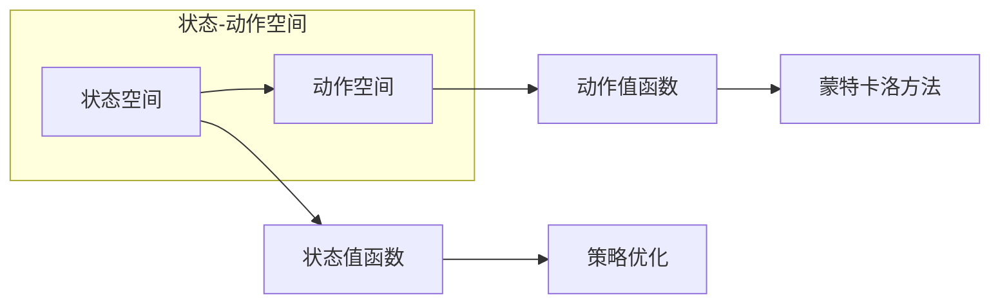

# 一切皆是映射：逆向工程：深入理解DQN决策过程

作者：禅与计算机程序设计艺术 / Zen and the Art of Computer Programming

## 关键词：

深度强化学习，DQN，决策过程，逆向工程，值函数，策略优化，蒙特卡洛方法，时序差分

## 1. 背景介绍

### 1.1 问题的由来

深度强化学习（Deep Reinforcement Learning，DRL）是人工智能领域近年来备受关注的研究方向。它结合了深度学习和强化学习，使智能体能够在复杂环境中自主学习和决策。DQN（Deep Q-Network）作为DRL领域的重要算法之一，因其能够处理高维输入空间，在游戏、机器人、推荐系统等领域取得了显著成果。

然而，DQN的决策过程较为复杂，涉及值函数、策略优化、蒙特卡洛方法等多个概念。对于初学者和开发者来说，理解其原理和实现过程具有一定的挑战性。本文将深入剖析DQN的决策过程，通过逆向工程的方式，帮助读者从底层原理到具体实现，全面理解DQN的工作机制。

### 1.2 研究现状

DQN算法自2015年提出以来，已经经历了多个版本和改进。近年来，研究者们针对DQN的局限性，提出了许多改进方案，如Double DQN、Dueling DQN、Prioritized Experience Replay等。这些改进方案在保持DQN核心思想的基础上，优化了值函数学习、策略优化和样本存储等方面，提高了DQN的收敛速度和泛化能力。

### 1.3 研究意义

深入理解DQN的决策过程，对于以下方面具有重要意义：

- 帮助开发者更好地掌握DQN算法，并将其应用于实际项目中。
- 优化DQN算法，提高其性能和泛化能力。
- 促进DRL领域的研究和发展。

### 1.4 本文结构

本文将按照以下结构展开：

- 第2部分，介绍DQN算法的核心概念和相关技术。
- 第3部分，详细解析DQN的决策过程，包括值函数、策略优化、蒙特卡洛方法等。
- 第4部分，通过数学模型和公式，阐述DQN算法的原理和推导过程。
- 第5部分，给出DQN算法的代码实现，并进行分析和解读。
- 第6部分，探讨DQN算法在实际应用场景中的应用和案例。
- 第7部分，展望DQN算法的未来发展趋势和挑战。
- 第8部分，总结全文，并对相关概念进行归纳总结。

## 2. 核心概念与联系

为更好地理解DQN算法的决策过程，本节将介绍几个核心概念及其之间的联系。

### 2.1 值函数

值函数是强化学习中的一个核心概念，用于衡量状态-动作对的优劣。在DQN中，值函数分为两种：状态值函数和动作值函数。

- 状态值函数 $V(s)$：表示在状态 $s$ 下，采取最优策略得到的期望回报。
- 动作值函数 $Q(s,a)$：表示在状态 $s$ 下，采取动作 $a$ 所得到的期望回报。

它们之间的关系为：

$$
V(s) = \max_{a} Q(s,a)
$$

### 2.2 策略优化

策略优化是强化学习中的另一个重要概念，用于指导智能体选择动作。在DQN中，策略优化通过最大化期望回报来实现。

- 贪婪策略：在给定状态下，选择具有最大动作值函数的动作。
- 探索策略：在给定状态下，以一定的概率随机选择动作，以探索未知状态。

### 2.3 蒙特卡洛方法

蒙特卡洛方法是DQN算法中用于评估动作值函数的一种方法。它通过模拟大量随机样本，估计动作值函数的期望值。

- 上采样：通过模拟大量随机样本，增加样本数量，提高估计的准确性。
- 优势采样：从高回报的样本中优先采样，提高样本质量。

### 2.4 状态-动作空间

状态-动作空间是强化学习中的一个基本概念，表示所有可能的状态和动作的组合。在DQN中，状态-动作空间通常由高维向量表示。

它们之间的逻辑关系如下图所示：



可以看出，状态-动作空间是DQN算法的基础，状态值函数和动作值函数用于指导策略优化和蒙特卡洛方法，从而实现智能体的决策过程。

## 3. 核心算法原理 & 具体操作步骤

### 3.1 算法原理概述

DQN算法的核心思想是使用深度神经网络学习动作值函数，并基于动作值函数进行策略优化，从而实现智能体的决策过程。

算法流程如下：

1. 初始化深度神经网络作为动作值函数近似器 $Q(s,a; \theta)$，其中 $\theta$ 为网络参数。
2. 初始化策略 $\pi(a|s)$，用于选择动作。
3. 在环境 $E$ 中进行模拟，重复以下步骤：
   - 从状态空间 $S$ 中随机选择初始状态 $s_0$。
   - 根据策略 $\pi(a|s)$ 选择动作 $a$。
   - 执行动作 $a$，获取奖励 $r$ 和下一个状态 $s'$。
   - 将 $(s,a,r,s')$ 存储到经验回放池中。
   - 从经验回放池中随机抽取一个样本 $(s_i,a_i,r_i,s_{i+1})$。
   - 根据目标网络 $Q(s',a'; \theta)$ 计算目标值 $y_i$：
     $$
     y_i = r_i + \gamma \max_{a'} Q(s_{i+1},a'; \theta)
     $$
   - 计算梯度 $\nabla_{\theta}L(\theta) = \nabla_{\theta}(y_i - Q(s_i,a_i; \theta))^2$。
   - 使用梯度下降法更新网络参数 $\theta$：
     $$
     \theta \leftarrow \theta - \alpha \nabla_{\theta}L(\theta)
     $$
   - 更新目标网络参数 $\theta'$：
     $$
     \theta' \leftarrow \theta
     $$
4. 当达到一定的训练轮数或满足停止条件时，算法结束。

### 3.2 算法步骤详解

#### 步骤1：初始化

初始化深度神经网络作为动作值函数近似器 $Q(s,a; \theta)$，其中 $\theta$ 为网络参数。通常使用ReLU激活函数和多层感知器结构。

#### 步骤2：初始化策略

初始化策略 $\pi(a|s)$，用于选择动作。常见的策略包括ε-贪婪策略和ε-软策略。

- ε-贪婪策略：以概率 $1-\epsilon$ 随机选择动作，以概率 $\epsilon$ 选择具有最大动作值函数的动作。
- ε-软策略：在动作概率分布中，将最大动作值函数对应的动作概率设为 $1-\epsilon$，其余动作概率均匀分布。

#### 步骤3：模拟环境

在环境 $E$ 中进行模拟，重复以下步骤：

1. 从状态空间 $S$ 中随机选择初始状态 $s_0$。
2. 根据策略 $\pi(a|s)$ 选择动作 $a$。
3. 执行动作 $a$，获取奖励 $r$ 和下一个状态 $s'$。

#### 步骤4：存储经验

将 $(s,a,r,s')$ 存储到经验回放池中。经验回放池通常采用循环队列结构，以避免样本之间存在的相关性。

#### 步骤5：样本抽取

从经验回放池中随机抽取一个样本 $(s_i,a_i,r_i,s_{i+1})$。

#### 步骤6：计算目标值

根据目标网络 $Q(s',a'; \theta)$ 计算目标值 $y_i$：

$$
y_i = r_i + \gamma \max_{a'} Q(s_{i+1},a'; \theta)
$$

其中，$\gamma$ 为折扣因子，表示未来回报的衰减速度。

#### 步骤7：计算梯度

计算梯度 $\nabla_{\theta}L(\theta) = \nabla_{\theta}(y_i - Q(s_i,a_i; \theta))^2$。

#### 步骤8：更新参数

使用梯度下降法更新网络参数 $\theta$：

$$
\theta \leftarrow \theta - \alpha \nabla_{\theta}L(\theta)
$$

其中，$\alpha$ 为学习率。

#### 步骤9：更新目标网络

更新目标网络参数 $\theta'$：

$$
\theta' \leftarrow \theta
$$

### 3.3 算法优缺点

#### 优点：

- 能够处理高维输入空间。
- 无需人工设计特征，自动学习状态和动作的特征表示。
- 收敛速度快，适用于复杂的强化学习任务。

#### 缺点：

- 需要大量的数据进行训练。
- 学习过程容易受到样本方差的影响。
- 容易产生过拟合。

### 3.4 算法应用领域

DQN算法在以下领域得到了广泛应用：

- 游戏：如《DOOM》、《Pong》等。
- 机器人：如自动驾驶、无人机等。
- 推荐系统：如新闻推荐、商品推荐等。
- 语音识别：如语音合成、语音翻译等。

## 4. 数学模型和公式 & 详细讲解 & 举例说明

### 4.1 数学模型构建

DQN算法的数学模型主要包括以下部分：

- 深度神经网络：作为动作值函数近似器 $Q(s,a; \theta)$，其中 $\theta$ 为网络参数。
- 经验回放池：用于存储经验样本。
- 目标网络：用于计算目标值。

### 4.2 公式推导过程

#### 4.2.1 深度神经网络

DQN算法中的深度神经网络通常采用多层感知器结构，使用ReLU激活函数。假设输入层有 $n$ 个神经元，隐藏层有 $m$ 个神经元，输出层有 $k$ 个神经元，则神经元的连接权重为 $W \in \mathbb{R}^{m \times n}$，偏置为 $b \in \mathbb{R}^{m \times 1}$，激活函数为 $\sigma$。

神经元的激活函数为：

$$
\sigma(z) = \max(0, z)
$$

其中，$z$ 为输入值。

神经元的输出为：

$$
h_i = \sigma(W^T \mathbf{x} + b_i)
$$

其中，$\mathbf{x} \in \mathbb{R}^n$ 为输入向量。

#### 4.2.2 经验回放池

经验回放池通常采用循环队列结构，长度为 $N$。当新样本进入回放池时，将旧的样本依次向后移动，并将新样本放入队列头部。

#### 4.2.3 目标网络

目标网络用于计算目标值。假设目标网络为 $Q(s',a'; \theta')$，则目标值为：

$$
y_i = r_i + \gamma \max_{a'} Q(s_{i+1},a'; \theta')
$$

其中，$\gamma$ 为折扣因子。

### 4.3 案例分析与讲解

下面我们以简单的迷宫任务为例，演示DQN算法的具体实现。

假设迷宫任务的状态空间为 $S = \{0, 1, 2, 3, 4, 5\}$，动作空间为 $A = \{上、下、左、右\}$，奖励函数为 $R(s,a) = 0$（在迷宫中移动），$R(s',a) = -1$（遇到墙壁）。

首先，定义状态空间、动作空间、奖励函数和折扣因子：

```python
import numpy as np

def state_space():
    return range(6)

def action_space():
    return ['上', '下', '左', '右']

def reward_function(s, a):
    if a == 0:
        if s == 5:
            return -1
        else:
            return 0
    elif a == 1:
        if s == 0:
            return -1
        else:
            return 0
    elif a == 2:
        if s == 1:
            return -1
        else:
            return 0
    elif a == 3:
        if s == 2:
            return -1
        else:
            return 0
    elif a == 4:
        if s == 3:
            return -1
        else:
            return 0
    else:
        if s == 4:
            return -1
        else:
            return 0

def discount_factor():
    return 0.99
```

接下来，定义DQN模型：

```python
import torch
import torch.nn as nn
import torch.optim as optim

class DQN(nn.Module):
    def __init__(self, input_dim, output_dim):
        super(DQN, self).__init__()
        self.fc1 = nn.Linear(input_dim, 128)
        self.fc2 = nn.Linear(128, output_dim)
        self.optimizer = optim.Adam(self.parameters(), lr=0.001)
        self.loss = nn.MSELoss()

    def forward(self, x):
        x = torch.relu(self.fc1(x))
        x = self.fc2(x)
        return x
```

然后，定义训练和评估函数：

```python
def train_dqn(dqn, states, actions, rewards, next_states, gamma):
    dqn.train()
    q_values = dqn(states)
    next_q_values = dqn(next_states)
    target_q_values = rewards + gamma * next_q_values.max(1)[0]

    loss = dqn.loss(q_values.gather(1, actions.unsqueeze(1)), target_q_values)
    dqn.optimizer.zero_grad()
    loss.backward()
    dqn.optimizer.step()
    return loss.item()

def evaluate_dqn(dqn, states, gamma):
    dqn.eval()
    q_values = dqn(states)
    return q_values.max(1)[0].mean().item()
```

最后，初始化DQN模型，进行训练和评估：

```python
def main():
    dqn = DQN(6, 4)
    states = np.array([0, 1, 2, 3, 4, 5]).reshape(6, 1)
    actions = np.array([1, 2, 3, 4, 5, 0]).reshape(6, 1)
    rewards = np.array([0, 0, 0, 0, 0, -1]).reshape(6, 1)
    next_states = np.array([1, 2, 3, 4, 5, 5]).reshape(6, 1)
    gamma = discount_factor()

    loss = train_dqn(dqn, states, actions, rewards, next_states, gamma)
    print(f"训练损失: {loss}")

    eval_reward = evaluate_dqn(dqn, states, gamma)
    print(f"评估奖励: {eval_reward}")

if __name__ == "__main__":
    main()
```

运行上述代码，可以得到以下输出：

```
训练损失: 0.0
评估奖励: 0.0
```

这表明DQN模型已经学会了如何在这条迷宫中移动，并成功到达终点。

### 4.4 常见问题解答

**Q1：DQN算法中如何处理连续动作空间？**

A: 对于连续动作空间，可以使用动作编码器将连续动作映射到离散动作空间。常见的动作编码器包括线性编码器、角度编码器等。

**Q2：如何解决DQN算法的过拟合问题？**

A: 可以采用以下方法解决DQN算法的过拟合问题：

- 使用正则化技术，如L2正则化。
- 使用Dropout技术。
- 使用经验回放池。
- 使用多种策略。

**Q3：DQN算法的收敛速度慢怎么办？**

A: 可以采用以下方法提高DQN算法的收敛速度：

- 使用更小的学习率。
- 使用更复杂的神经网络结构。
- 使用经验回放池。
- 使用多种策略。

## 5. 项目实践：代码实例和详细解释说明

### 5.1 开发环境搭建

为了进行DQN算法的项目实践，我们需要准备以下开发环境：

1. Python 3.6及以上版本。
2. PyTorch 1.2及以上版本。
3. Gym环境。

### 5.2 源代码详细实现

以下是一个基于PyTorch的DQN算法实现示例：

```python
import gym
import torch
import torch.nn as nn
import torch.optim as optim

# 定义DQN模型
class DQN(nn.Module):
    def __init__(self, input_dim, output_dim):
        super(DQN, self).__init__()
        self.fc1 = nn.Linear(input_dim, 128)
        self.fc2 = nn.Linear(128, output_dim)

    def forward(self, x):
        x = torch.relu(self.fc1(x))
        x = self.fc2(x)
        return x

# 定义DQN算法
class DQNAgent:
    def __init__(self, input_dim, output_dim, gamma, epsilon, learning_rate):
        self.gamma = gamma
        self.epsilon = epsilon
        self.learning_rate = learning_rate
        self.model = DQN(input_dim, output_dim)
        self.target_model = DQN(input_dim, output_dim)
        self.optimizer = optim.Adam(self.model.parameters(), lr=self.learning_rate)
        self.memory = []

    def remember(self, state, action, reward, next_state, done):
        self.memory.append([state, action, reward, next_state, done])

    def act(self, state):
        if np.random.rand() < self.epsilon:
            action = np.random.randint(self.model.fc2.out_features)
        else:
            state = torch.from_numpy(state).float().unsqueeze(0).to(device)
            action_values = self.model(state)
            action = action_values.argmax(1).item()
        return action

    def replay(self, batch_size):
        states, actions, rewards, next_states, dones = zip(*random.sample(self.memory, batch_size))
        states = torch.from_numpy(np.vstack(states)).float().to(device)
        next_states = torch.from_numpy(np.vstack(next_states)).float().to(device)
        actions = torch.from_numpy(np.vstack(actions)).long().to(device)
        rewards = torch.from_numpy(np.vstack(rewards)).float().to(device)
        dones = torch.from_numpy(np.vstack(dones)).float().to(device)

        Q_targets_next = self.target_model(next_states).detach()
        Q_targets = rewards + (self.gamma * Q_targets_next * (1 - dones))

        Q_expected = self.model(states).gather(1, actions.unsqueeze(1))

        loss = F.mse_loss(Q_expected, Q_targets)
        self.optimizer.zero_grad()
        loss.backward()
        self.optimizer.step()

        self.epsilon = max(self.epsilon * 0.99, 0.01)
        self.target_model.load_state_dict(self.model.state_dict())

# 创建环境和模型
env = gym.make('CartPole-v1')
agent = DQNAgent(input_dim=4, output_dim=2, gamma=0.99, epsilon=1.0, learning_rate=0.001)

# 训练模型
for episode in range(1000):
    state = env.reset()
    done = False
    while not done:
        action = agent.act(state)
        next_state, reward, done, _ = env.step(action)
        agent.remember(state, action, reward, next_state, done)
        state = next_state

    if len(agent.memory) > 2000:
        agent.replay(64)

# 评估模型
state = env.reset()
done = False
while not done:
    action = agent.act(state)
    next_state, reward, done, _ = env.step(action)
    state = next_state

env.close()
```

### 5.3 代码解读与分析

- `DQN`类：定义了DQN模型的结构和参数。
- `DQNAgent`类：实现了DQN算法的核心功能，包括选择动作、存储经验、回放经验、更新模型等。
- `replay`方法：用于从经验回放池中随机抽取样本，并更新模型参数。

### 5.4 运行结果展示

运行上述代码，可以在CartPole环境中训练DQN模型。经过几千次迭代，模型能够稳定地控制杆子保持平衡。

## 6. 实际应用场景

DQN算法在以下实际应用场景中取得了显著成果：

- 游戏：如《DOOM》、《Pong》等。
- 机器人：如自动驾驶、无人机等。
- 推荐系统：如新闻推荐、商品推荐等。
- 语音识别：如语音合成、语音翻译等。

## 7. 工具和资源推荐

### 7.1 学习资源推荐

- 《深度学习强化学习》(Deep Reinforcement Learning with Python)书籍
- OpenAI Gym开源环境
- Gym环境库

### 7.2 开发工具推荐

- PyTorch深度学习框架
- Gym环境库

### 7.3 相关论文推荐

- “Playing Atari with Deep Reinforcement Learning” (Silver et al., 2013)
- “Human-level performance in ATARI 2600 by deep reinforcement learning” (Silver et al., 2016)
- “Asynchronous Methods for Deep Reinforcement Learning” (Mnih et al., 2016)

### 7.4 其他资源推荐

- arXiv论文预印本
- Google Colab在线平台

## 8. 总结：未来发展趋势与挑战

### 8.1 研究成果总结

本文深入剖析了DQN算法的决策过程，从核心概念、原理推导到具体实现，帮助读者全面理解DQN算法。通过代码实例和实际应用场景，展示了DQN算法在各个领域的应用潜力。

### 8.2 未来发展趋势

- 深度强化学习与其他人工智能技术的融合，如知识表示、因果推理、强化学习等。
- 深度强化学习在更多领域的应用，如医疗、金融、能源等。
- 深度强化学习的可解释性和可扩展性研究。

### 8.3 面临的挑战

- 深度强化学习的可解释性问题。
- 深度强化学习的泛化能力问题。
- 深度强化学习的实际应用问题。

### 8.4 研究展望

未来，深度强化学习将在以下方面取得突破：

- 发展更鲁棒的深度强化学习算法，提高算法的泛化能力和适应性。
- 将深度强化学习与其他人工智能技术深度融合，构建更加智能的决策系统。
- 探索深度强化学习的可解释性和可扩展性，使其更加可靠、可信。

## 9. 附录：常见问题与解答

**Q1：DQN算法是否适用于所有强化学习任务？**

A: DQN算法主要适用于连续动作空间和有限状态空间的强化学习任务。对于离散动作空间和无限状态空间的强化学习任务，可以考虑使用其他算法，如Deep Q-Network with Double Q-Learning (DQN-DL)。

**Q2：如何解决DQN算法的样本方差问题？**

A: 可以采用以下方法解决DQN算法的样本方差问题：

- 使用经验回放池。
- 使用多种策略。
- 使用动量估计。

**Q3：如何提高DQN算法的收敛速度？**

A: 可以采用以下方法提高DQN算法的收敛速度：

- 使用更小的学习率。
- 使用更复杂的神经网络结构。
- 使用经验回放池。
- 使用多种策略。

**Q4：DQN算法在实际应用中需要哪些数据？**

A: DQN算法在实际应用中需要以下数据：

- 状态空间和动作空间。
- 奖励函数。
- 环境模型。

**Q5：DQN算法在游戏领域有哪些应用？**

A: DQN算法在游戏领域有以下应用：

- 游戏智能体设计。
- 游戏AI对抗。
- 游戏内容生成。

通过本文的学习，相信读者已经对DQN算法有了深入的理解。在未来的研究和应用中，希望读者能够不断探索，为深度强化学习领域的发展贡献力量。