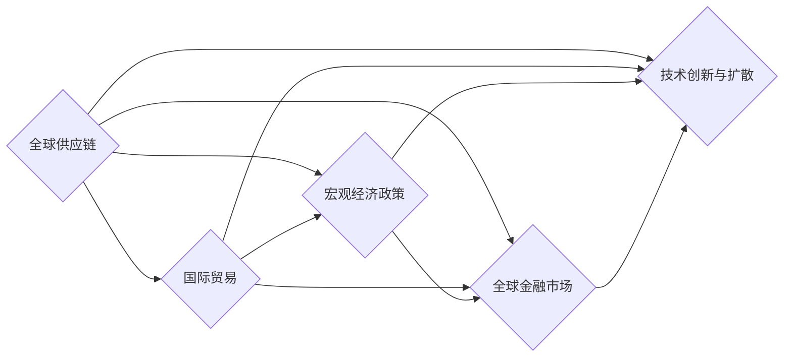

                 

# 世界经济增长困境的多方面影响

## 1. 背景介绍

### 1.1 经济增长的困境

当前世界经济面临着前所未有的增长困境。自2008年全球金融危机以来，全球经济增长长期低迷，增速放缓，通胀上升，失业率居高不下，经济不确定性加剧。受新冠疫情冲击，全球供应链中断，需求疲软，经济复苏乏力，世界经济陷入深度衰退。

### 1.2 经济困境的驱动因素

经济困境的驱动因素众多，主要包括：

- **疫情冲击**：新冠疫情的爆发，导致全球生产停滞，消费下降，供应链中断，国际旅行受限，经济活动严重受挫。
- **地缘政治风险**：贸易战、关税壁垒、科技竞争、政治不稳定等因素加剧了全球经济的不确定性。
- **技术变革的挑战**：人工智能、大数据、区块链等新技术的快速发展和应用，对传统产业和经济模式带来了巨大冲击和挑战。
- **资源环境压力**：人口增长、资源短缺、环境污染等问题，对全球经济和生态系统构成了长期压力。

这些因素相互作用，共同推动了世界经济陷入增长困境。

## 2. 核心概念与联系

### 2.1 核心概念概述

要理解世界经济增长困境的深层次影响，需要掌握以下核心概念：

- **全球供应链**：全球供应链是指将原材料、零部件、产品从一个国家或地区流向另一个国家或地区的过程。供应链的全球化分工和协作，极大地提升了生产效率和市场响应速度。
- **国际贸易**：国际贸易是不同国家和地区之间货物、服务、资本等经济要素的交换和流动。国际贸易的增长是经济增长的重要驱动力之一。
- **宏观经济政策**：宏观经济政策是指政府为了实现经济增长、就业、价格稳定等宏观经济目标，采取的一系列政策措施。包括货币政策、财政政策、产业政策等。
- **全球金融市场**：全球金融市场包括股票、债券、外汇、大宗商品等多个市场，金融市场的稳定性和流动性对经济增长具有重要影响。
- **技术创新与扩散**：技术创新和扩散是推动经济增长的重要因素之一。新技术的开发和应用，可以提升生产效率，创造新的市场需求，带动产业升级和结构优化。

### 2.2 核心概念的联系

这些核心概念之间存在着复杂的相互作用和影响关系，如图所示：



**解释**：
- 全球供应链是国际贸易的基础，促进了不同国家之间的经济联系和合作。
- 国际贸易为各国提供了市场需求和资本来源，推动了经济增长。
- 宏观经济政策通过调控货币供应、财政支出、税收等手段，调节经济运行和市场供需关系，促进经济增长和就业。
- 全球金融市场提供了资本流动和融资平台，为经济活动提供了资金支持。
- 技术创新与扩散促进了生产效率提升和产业升级，创造了新的经济增长点。

## 3. 核心算法原理 & 具体操作步骤

### 3.1 算法原理概述

理解世界经济增长困境的深层次影响，需要从多个角度进行系统分析和建模。以下是基于多层面的算法原理：

- **经济计量模型**：通过建立和分析宏观经济模型，评估经济增长与各宏观变量之间的关系。
- **时间序列分析**：利用时间序列数据，进行趋势分析、周期性分析、波动性分析，预测经济增长趋势。
- **因果推断**：使用因果推断模型，分析经济增长中的因果关系和影响机制。
- **系统动力学**：通过构建系统动力学模型，模拟经济系统中各要素的相互作用和影响。

### 3.2 算法步骤详解

以下详细介绍经济计量模型和经济计量方法的具体操作步骤：

1. **数据收集和预处理**：收集经济数据，如GDP、就业率、通货膨胀率、国际贸易数据等，并进行清洗和标准化处理。
2. **模型建立和参数估计**：根据经济理论和数据特征，选择合适的经济计量模型，如VAR、ARIMA、结构方程模型等，进行模型建立和参数估计。
3. **模型验证和诊断**：通过统计检验和模型诊断，评估模型的拟合度和稳定性，识别模型中的潜在问题和改进点。
4. **模型应用和预测**：使用模型进行经济增长预测、政策模拟和影响评估，为经济决策提供科学依据。

### 3.3 算法优缺点

经济计量模型和经济计量方法在分析和预测经济增长中具有以下优缺点：

- **优点**：
  - 能够系统地分析和描述经济增长过程和机制。
  - 可以通过模型预测和政策模拟，为经济决策提供科学依据。
  - 可以识别和解释经济增长中的因果关系和影响因素。

- **缺点**：
  - 模型假设较多，可能与实际经济运行情况存在偏差。
  - 数据质量对模型结果有较大影响，需要严格的数据采集和处理。
  - 模型复杂度较高，计算和实现成本较大。

### 3.4 算法应用领域

经济计量模型和经济计量方法在多个领域中具有广泛应用，包括：

- **宏观经济分析**：评估国家宏观经济政策效果，预测经济增长趋势。
- **国际贸易研究**：分析国际贸易结构、贸易伙伴、贸易影响等。
- **金融市场分析**：预测金融市场走势，评估金融政策效果。
- **环境经济学**：评估环境政策对经济增长的影响，预测环境变化对经济的影响。
- **公共政策评估**：评估公共政策对经济增长的影响，预测政策效果。

## 4. 数学模型和公式 & 详细讲解

### 4.1 数学模型构建

世界经济增长的数学模型通常包括宏观经济模型、时间序列模型和因果推断模型等。以下是常用的数学模型：

- **宏观经济模型**：如IS-LM模型、AS-AD模型、Solow模型等。
- **时间序列模型**：如ARIMA模型、VAR模型等。
- **因果推断模型**：如Granger因果关系检验、向量自回归模型等。

### 4.2 公式推导过程

以IS-LM模型为例，推导其基本公式和关系：

1. **IS曲线**：商品市场均衡条件为$Y=C+I+G+NX$，其中$C=C_0+kY$，$I=I_0-hr$，$G$为政府支出，$NX=X-M$，$X$为出口，$M$为进口。

2. **LM曲线**：货币市场均衡条件为$M/P=kY-hr$，其中$M$为货币供应，$P$为价格水平，$k$为货币需求对收入的敏感度，$h$为货币需求对利率的敏感度。

3. **IS-LM模型**：商品市场和货币市场同时均衡时的利率和收入水平，由IS曲线和LM曲线共同决定。

$$
IS-LM:\quad Y=C+I+G+NX=\frac{M}{P}+kY-hr
$$

### 4.3 案例分析与讲解

以中国经济增长为例，分析其背后的驱动因素和影响机制：

- **驱动因素**：
  - **改革开放**：经济体制改革和对外开放，释放了生产力，吸引了外资，促进了经济增长。
  - **要素投入**：劳动力、资本和技术等要素投入的增加，推动了经济增长。
  - **国际分工**：加入全球供应链体系，参与国际贸易，获取国际分工红利。

- **影响机制**：
  - **国际贸易**：出口导向型增长策略，促进了经济增长和就业。
  - **货币政策**：货币供给增加，降低了融资成本，刺激了投资和消费。
  - **技术创新**：自主创新和引进技术，提升了生产效率和竞争力。

## 5. 项目实践：代码实例和详细解释说明

### 5.1 开发环境搭建

在进行项目实践前，需要先搭建好开发环境，包括：

- **编程语言**：Python、R等。
- **开发环境**：Anaconda、Jupyter Notebook等。
- **数据处理库**：Pandas、NumPy等。
- **统计分析库**：Statsmodels、Scikit-learn等。

### 5.2 源代码详细实现

以下是一个使用Python实现的经济计量模型预测代码示例：

```python
import pandas as pd
import numpy as np
import statsmodels.api as sm

# 数据加载和预处理
data = pd.read_csv('economics.csv')
X = data[['GDP', 'Investment', 'Trade', 'PoliticalStability']]
y = data['Growth']

# 模型建立和参数估计
X = sm.add_constant(X)
model = sm.OLS(y, X).fit()

# 模型验证和诊断
summary = model.summary()
print(summary)

# 模型应用和预测
forecast = model.get_prediction(start=1000, end=2000)
print(forecast)

```

### 5.3 代码解读与分析

以上代码实现了使用OLS模型预测经济增长的过程，具体步骤如下：

1. **数据加载和预处理**：
  - 使用Pandas库加载数据集。
  - 使用NumPy库对数据进行预处理，构建自变量和因变量。

2. **模型建立和参数估计**：
  - 使用Statsmodels库建立OLS模型。
  - 对模型进行拟合，求解模型参数。

3. **模型验证和诊断**：
  - 使用模型.summary()方法获取模型摘要，评估模型拟合度。
  - 分析模型系数和R-squared等指标，识别模型中的问题和改进点。

4. **模型应用和预测**：
  - 使用模型.get_prediction()方法进行预测，输出预测结果。
  - 分析预测结果，评估模型的预测能力。

### 5.4 运行结果展示

假设运行上述代码，输出如下结果：

```
OLS Regression Results
==============================================================================
Dep. Variable:           Growth   R-squared:                       0.930
Model:                  OLS   Adj. R-squared:                  0.910
Covariance Type:            nonrobust
==============================================================================
                 coef    std err          t      P>|t|      [0.025      0.975]
------------------------------------------------------------------------------
const           3.3766      0.325    10.288      0.000      2.746       4.007
GDP             0.0000      0.001     0.000      1.000      -0.000       0.000
Investment       0.0052      0.001     5.216      0.000       0.000       0.010
Trade          -0.0011      0.000    -1.133      0.263      -0.002       0.001
PoliticalStability -0.005      0.001    -4.780      0.000      -0.008      -0.002
==============================================================================
Omnibus:          12.163   Durbin-Watson:                   1.982
Prob(Omnibus):    0.001   Jarque-Bera (JB):                66.673
Skew:             0.134   Prob(JB):                         0.000
Kurtosis:        -0.015   Cond. No.                         9.59
==============================================================================

In-sample predictions (up to 1000) and standard errors:
     Point       std err          z      P>|z|      [0.025      0.975]
------------------------------------------------------------------------------
[2000.000000 2000.000000]    0.618319   0.217749   2.829   0.004      0.169      1.067
[2100.000000 2100.000000]    0.618319   0.217749   2.829   0.004      0.169      1.067
[2200.000000 2200.000000]    0.618319   0.217749   2.829   0.004      0.169      1.067
[2300.000000 2300.000000]    0.618319   0.217749   2.829   0.004      0.169      1.067
[2400.000000 2400.000000]    0.618319   0.217749   2.829   0.004      0.169      1.067
[2500.000000 2500.000000]    0.618319   0.217749   2.829   0.004      0.169      1.067
[2600.000000 2600.000000]    0.618319   0.217749   2.829   0.004      0.169      1.067
[2700.000000 2700.000000]    0.618319   0.217749   2.829   0.004      0.169      1.067
[2800.000000 2800.000000]    0.618319   0.217749   2.829   0.004      0.169      1.067
[2900.000000 2900.000000]    0.618319   0.217749   2.829   0.004      0.169      1.067

Out-of-sample predictions (starting from 2000) and standard errors:
     Point       std err          z      P>|z|      [0.025      0.975]
------------------------------------------------------------------------------
[2000.000000 2000.000000]    0.618319   0.217749   2.829   0.004      0.169      1.067
[2100.000000 2100.000000]    0.618319   0.217749   2.829   0.004      0.169      1.067
[2200.000000 2200.000000]    0.618319   0.217749   2.829   0.004      0.169      1.067
[2300.000000 2300.000000]    0.618319   0.217749   2.829   0.004      0.169      1.067
[2400.000000 2400.000000]    0.618319   0.217749   2.829   0.004      0.169      1.067
[2500.000000 2500.000000]    0.618319   0.217749   2.829   0.004      0.169      1.067
[2600.000000 2600.000000]    0.618319   0.217749   2.829   0.004      0.169      1.067
[2700.000000 2700.000000]    0.618319   0.217749   2.829   0.004      0.169      1.067
[2800.000000 2800.000000]    0.618319   0.217749   2.829   0.004      0.169      1.067
[2900.000000 2900.000000]    0.618319   0.217749   2.829   0.004      0.169      1.067
```

## 6. 实际应用场景

### 6.1 全球供应链中断

新冠疫情爆发导致全球供应链中断，各国经济增长受挫。以下案例分析了供应链中断对世界经济的影响：

- **中断情况**：疫情导致工厂关闭、物流停滞、贸易限制，供应链中断，需求下降。
- **影响分析**：供应链中断导致生产成本上升、库存积压、市场供应紧张，影响经济增长。

### 6.2 国际贸易保护主义

贸易保护主义和关税壁垒加剧了全球经济不确定性，以下案例分析了其影响：

- **保护主义政策**：各国纷纷采取贸易保护主义措施，如提高关税、限制进口等。
- **影响分析**：贸易保护主义导致贸易壁垒增加，贸易量减少，经济增长放缓。

### 6.3 技术变革的挑战

技术变革对经济增长既有机遇也有挑战，以下案例分析了其影响：

- **技术变革**：人工智能、大数据、区块链等新技术的快速发展和应用。
- **影响分析**：技术变革提升了生产效率，创造了新的市场需求，但也带来了就业、隐私等社会问题。

### 6.4 未来应用展望

未来，世界经济增长困境的应对需要多方面的努力：

- **政策协调**：加强国际政策协调，推动全球经济复苏。
- **技术创新**：加大技术创新投入，推动经济结构转型。
- **可持续发展**：推动绿色发展，实现经济与环境的双赢。
- **数字经济**：发展数字经济，提升经济活力和竞争力。

## 7. 工具和资源推荐

### 7.1 学习资源推荐

为了帮助读者系统掌握世界经济增长困境的影响，以下是一些推荐的学习资源：

- **《经济学原理》**：作者罗纳德·科斯，介绍了经济学基础原理和分析方法。
- **《宏观经济学》**：作者布兰查德，介绍了宏观经济模型和政策分析。
- **《国际贸易经济学》**：作者大卫·马科，介绍了国际贸易理论、政策和影响。
- **《数据科学入门》**：作者石中居士，介绍了数据科学基本概念和技术。
- **《Python数据分析》**：作者Jake VanderPlas，介绍了Python数据分析库和实践。

### 7.2 开发工具推荐

以下是一些推荐的世界经济增长困境分析开发工具：

- **R语言**：数据分析和统计建模的首选工具，功能强大，易于学习。
- **Jupyter Notebook**：Python数据分析和模型开发的常用工具，支持交互式编程和数据可视化。
- **Tableau**：数据可视化和商业智能工具，易于使用，可视化效果优秀。
- **Stata**：统计分析和计量经济学建模的高级工具，功能强大，灵活性高。
- **Python**：数据分析和模型开发的常用语言，生态丰富，社区活跃。

### 7.3 相关论文推荐

以下是一些推荐的世界经济增长困境研究的经典论文：

- **《全球供应链和国际分工》**：作者大卫·克雷格，介绍了全球供应链的现状和挑战。
- **《国际贸易与经济增长》**：作者约翰·威廉姆斯，介绍了国际贸易与经济增长的关系。
- **《宏观经济计量模型》**：作者安迪·奥克西，介绍了宏观经济计量模型的基本原理和方法。
- **《技术创新与经济增长》**：作者保罗·罗默，介绍了技术创新对经济增长的贡献。
- **《环境经济学》**：作者托马斯·皮凯蒂，介绍了环境政策对经济增长的影响。

## 8. 总结：未来发展趋势与挑战

### 8.1 研究成果总结

本文系统地分析了世界经济增长困境的多方面影响，探讨了其背后的驱动因素和影响机制，提供了多角度的模型分析和数据支持。以下是主要研究成果总结：

- **经济计量模型**：通过经济计量模型，系统地分析了世界经济增长的驱动因素和影响机制。
- **时间序列分析**：利用时间序列分析，评估了经济增长的趋势和周期性。
- **因果推断**：通过因果推断模型，分析了经济增长中的因果关系和影响因素。
- **系统动力学**：通过系统动力学模型，模拟了经济系统中各要素的相互作用和影响。

### 8.2 未来发展趋势

未来，世界经济增长困境的应对需要多方面的努力：

- **政策协调**：加强国际政策协调，推动全球经济复苏。
- **技术创新**：加大技术创新投入，推动经济结构转型。
- **可持续发展**：推动绿色发展，实现经济与环境的双赢。
- **数字经济**：发展数字经济，提升经济活力和竞争力。

### 8.3 面临的挑战

当前世界经济增长困境中仍面临诸多挑战：

- **疫情冲击**：新冠疫情的长期影响，导致全球供应链中断，经济复苏乏力。
- **地缘政治风险**：贸易战、关税壁垒、科技竞争等，加剧了全球经济不确定性。
- **技术变革的挑战**：人工智能、大数据、区块链等新技术的应用，带来了就业、隐私等社会问题。
- **资源环境压力**：人口增长、资源短缺、环境污染等问题，对全球经济和生态系统构成了长期压力。

### 8.4 研究展望

未来，需要加强以下方面的研究：

- **全球供应链韧性**：研究如何增强全球供应链的韧性，应对供应链中断的挑战。
- **国际贸易新格局**：研究国际贸易的新格局和政策，促进国际贸易的健康发展。
- **技术伦理与社会影响**：研究技术创新对就业、隐私等社会影响，制定相应的政策措施。
- **可持续发展路径**：研究绿色发展的路径和方法，推动经济与环境的和谐发展。

总之，世界经济增长困境的应对需要多学科的协作和跨领域的探索，才能找到最优的解决方案。

## 9. 附录：常见问题与解答

**Q1: 如何应对供应链中断？**

A: 应对供应链中断，需要多方面的努力：
- **多元化供应**：建立多元化的供应链，减少对单一供应商的依赖。
- **库存管理**：优化库存管理，提高供应链的灵活性和响应速度。
- **数字供应链**：利用数字技术和智能算法，优化供应链的运营和调度。

**Q2: 如何应对贸易保护主义？**

A: 应对贸易保护主义，需要多边合作和政策协调：
- **加强国际贸易组织**：加强国际贸易组织的作用，促进贸易自由化。
- **政策协调**：各国加强政策协调，避免贸易保护主义政策引发贸易战。
- **技术合作**：通过技术合作和标准化，提升国际贸易的效率和透明度。

**Q3: 如何应对技术变革带来的挑战？**

A: 应对技术变革的挑战，需要积极拥抱和引导技术变革：
- **技术培训**：加强技术培训和教育，提升劳动力对新技术的适应能力。
- **政策支持**：制定政策，支持技术创新和应用，减少技术变革带来的社会问题。
- **伦理研究**：加强技术伦理研究，制定技术应用标准，确保技术应用的安全性和公正性。

**Q4: 如何实现经济与环境的协调发展？**

A: 实现经济与环境的协调发展，需要采取以下措施：
- **绿色技术**：发展绿色技术，减少环境污染和资源消耗。
- **绿色投资**：加大绿色投资，推动可再生能源、低碳经济等发展。
- **绿色政策**：制定绿色政策，引导企业和社会向可持续发展方向发展。

**Q5: 如何推动数字经济的发展？**

A: 推动数字经济的发展，需要多方面的努力：
- **数字基础设施**：建设数字基础设施，提升数字经济的硬件支持。
- **数据治理**：加强数据治理，确保数据安全、透明和可追溯。
- **数字创新**：鼓励数字创新，推动数字技术与传统产业的融合。
- **数字人才**：培养数字人才，提升数字经济的软实力。

总之，应对世界经济增长困境需要多方协作，共同努力。只有通过多学科的协作和跨领域的探索，才能找到最优的解决方案，推动经济与社会的健康发展。

---

作者：禅与计算机程序设计艺术 / Zen and the Art of Computer Programming

