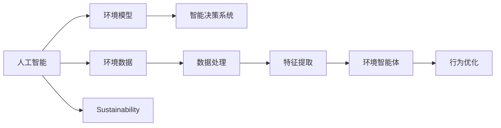
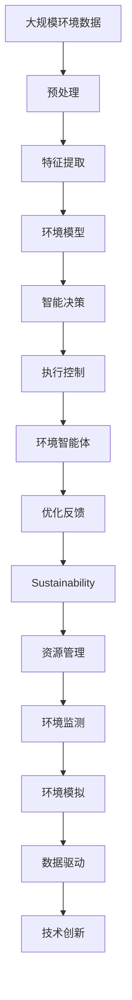

                 

## 1. 背景介绍

### 1.1 问题由来
随着人工智能（AI）技术的快速发展，其在解决地球环境问题中的应用也越来越受到重视。AI技术能够通过数据驱动的方法，帮助我们更深入地理解环境问题，并提出有效的解决方案。但与此同时，AI技术本身对环境的依赖性也不容忽视，因此，如何使AI技术在地球环境中实现有效适应和优化，成为当前学术界和产业界的重要课题。

### 1.2 问题核心关键点
本节将重点讨论以下核心问题：
- AI技术在地球环境中的作用和应用。
- AI技术对地球环境的影响。
- AI技术的可持续发展和适应性。

### 1.3 问题研究意义
研究AI技术在地球环境中的适应性，对于推动环境保护和可持续发展具有重要意义：

1. **提升环境决策的科学性**：AI技术能够处理和分析大量环境数据，提供科学决策的支持。
2. **优化资源管理**：AI技术能够帮助优化自然资源的使用，减少浪费。
3. **支持应急响应**：AI技术能够实时监测环境变化，为应急响应提供技术支撑。
4. **推动环保创新**：AI技术能够推动环保技术的创新，促进环境问题的解决。
5. **普及环保意识**：AI技术能够普及环保知识，提高公众环保意识。

## 2. 核心概念与联系

### 2.1 核心概念概述

为更好地理解AI技术在地球环境中的适应性，本节将介绍几个密切相关的核心概念：

- **人工智能（AI）**：一种通过模拟人类智能行为，实现自动化决策和执行的技术。AI技术包括机器学习、深度学习、自然语言处理等子领域。
- **环境数据**：指与环境相关的各类数据，如气象数据、气候数据、污染数据、生态数据等。
- **环境模型**：通过对环境数据的建模，建立对环境系统行为的理解。
- **智能决策系统**：利用AI技术进行环境数据处理和分析，辅助决策者做出科学决策的系统。
- **环境智能体**：通过AI技术实现自主决策和执行的环境系统。
- **可持续发展**：在满足当前需求的同时，不损害后代满足需求的能力。

这些概念之间存在着紧密的联系，共同构成了AI技术在地球环境中的适应性研究框架。以下是一个Mermaid流程图，展示了这些概念之间的联系：



这个流程图展示了AI技术在地球环境中的作用和应用路径。AI技术通过处理和分析环境数据，建立环境模型，最终辅助决策者进行智能决策。

### 2.2 概念间的关系

这些核心概念之间存在着紧密的联系，形成了AI技术在地球环境中的适应性研究框架。以下是一个综合的流程图，展示了这些概念之间的整体架构：



这个综合流程图展示了AI技术在地球环境中的作用和应用路径。大规模环境数据经过预处理和特征提取，建立环境模型，通过智能决策和执行控制，最终辅助环境智能体进行行为优化。同时，环境智能体通过优化反馈，促进可持续发展的实现。

## 3. 核心算法原理 & 具体操作步骤

### 3.1 算法原理概述

基于AI技术的环境适应性研究，主要包括数据驱动的环境模型建立、智能决策系统的设计、环境智能体的实现等。

- **数据驱动的环境模型建立**：利用机器学习、深度学习等技术，从大规模环境数据中提取特征，建立环境模型，预测环境变化。
- **智能决策系统的设计**：通过规则引擎、优化算法等技术，将环境模型与决策规则结合，实现环境问题的智能决策。
- **环境智能体的实现**：利用强化学习、多智能体系统等技术，设计自主决策和执行的环境智能体。

### 3.2 算法步骤详解

基于AI技术的环境适应性研究，一般包括以下几个关键步骤：

1. **环境数据采集和预处理**：
   - 收集大规模环境数据，如气象数据、气候数据、污染数据、生态数据等。
   - 进行数据清洗和标准化，去除噪声和异常值，确保数据质量。

2. **特征提取和环境建模**：
   - 利用机器学习、深度学习等技术，从环境数据中提取关键特征。
   - 建立环境模型，如回归模型、分类模型、时间序列模型等，用于预测环境变化。

3. **智能决策系统的设计**：
   - 设计智能决策系统，包括规则引擎、优化算法等。
   - 将环境模型与决策规则结合，实现环境问题的智能决策。

4. **环境智能体的实现**：
   - 利用强化学习、多智能体系统等技术，设计环境智能体。
   - 通过优化反馈，不断调整智能体的行为，实现环境问题的自主解决。

5. **评估和优化**：
   - 对智能决策系统进行评估和优化，确保其性能和稳定性。
   - 对环境智能体进行性能测试，确保其在实际环境中的适应性。

### 3.3 算法优缺点

基于AI技术的环境适应性研究，具有以下优点：

- **数据驱动**：利用大规模环境数据进行模型建立，具有较高的准确性和可靠性。
- **智能决策**：通过智能决策系统，提供科学的决策支持，提高决策效率和质量。
- **自主适应**：环境智能体能够自主学习并适应环境变化，实现环境问题的自主解决。

同时，该方法也存在一定的局限性：

- **数据依赖**：环境模型的建立依赖于高质量的环境数据，数据采集和预处理成本较高。
- **模型复杂性**：环境模型和智能决策系统的设计较为复杂，需要专业的知识和技能。
- **技术门槛**：AI技术在环境适应性研究中的应用，需要具备一定的技术基础和实践经验。
- **伦理和隐私**：AI技术在环境适应性研究中的应用，需要考虑数据隐私和伦理问题。

### 3.4 算法应用领域

基于AI技术的环境适应性研究，在多个领域中得到了广泛应用，例如：

- **气候变化研究**：利用AI技术分析气候数据，预测气候变化趋势，为气候变化应对提供科学支持。
- **环境监测**：利用AI技术实时监测环境变化，如水质、空气质量、土壤污染等，提供环境状态评估。
- **资源管理**：利用AI技术优化资源使用，如水资源管理、土地资源管理等，提高资源利用效率。
- **生态保护**：利用AI技术监测生态系统变化，如森林覆盖变化、野生动物保护等，辅助生态保护决策。
- **灾害预警**：利用AI技术实时监测自然灾害，如地震、洪水、台风等，提前预警，减少灾害损失。

## 4. 数学模型和公式 & 详细讲解 & 举例说明

### 4.1 数学模型构建

本节将使用数学语言对基于AI技术的环境适应性研究进行更加严格的刻画。

假设环境数据集为 $D=\{(x_i,y_i)\}_{i=1}^N, x_i \in \mathbb{R}^d, y_i \in \mathbb{R}^k$，其中 $x_i$ 为环境特征，$y_i$ 为环境状态。

定义环境模型为 $f(x)$，则环境模型建立的目标是找到最优模型参数 $\theta$，使得：

$$
\min_{\theta} \sum_{i=1}^N \|y_i - f(x_i)\|^2
$$

通过优化算法求解上述目标函数，得到最优的环境模型 $f(x)$。

### 4.2 公式推导过程

以下我们以线性回归模型为例，推导模型训练和评估的过程。

假设环境特征 $x_i$ 和环境状态 $y_i$ 之间的关系为线性模型：

$$
y_i = \theta_0 + \sum_{j=1}^d \theta_j x_{ij}
$$

则环境模型建立的目标函数为：

$$
\min_{\theta} \sum_{i=1}^N (y_i - \theta_0 - \sum_{j=1}^d \theta_j x_{ij})^2
$$

根据最小二乘法，可以求得最优的模型参数：

$$
\theta = \left( \sum_{i=1}^N \sum_{j=1}^d x_{ij} x_{ij}' \right)^{-1} \sum_{i=1}^N \sum_{j=1}^d x_{ij} y_i
$$

在得到最优模型参数后，可以通过均方误差（MSE）评估模型的性能：

$$
MSE = \frac{1}{N} \sum_{i=1}^N (y_i - f(x_i))^2
$$

### 4.3 案例分析与讲解

假设我们要利用AI技术进行水质监测，数据集包括多项水质指标和对应的水质等级。我们采用线性回归模型进行水质监测：

```python
import numpy as np
from sklearn.linear_model import LinearRegression

# 假设数据集为 5 个样本，包含 3 个水质指标和 1 个水质等级
X = np.array([[1, 2, 3], [4, 5, 6], [7, 8, 9], [10, 11, 12], [13, 14, 15]])
y = np.array([1, 1, 1, 2, 2])

# 创建线性回归模型
model = LinearRegression()
model.fit(X, y)

# 预测新的水质数据
new_X = np.array([[16, 17, 18]])
predicted_y = model.predict(new_X)
print(predicted_y)
```

通过上述代码，我们可以建立水质监测的线性回归模型，并对新的水质数据进行预测。

## 5. 项目实践：代码实例和详细解释说明

### 5.1 开发环境搭建

在进行AI技术在地球环境中的应用开发时，我们需要准备好开发环境。以下是使用Python进行Scikit-learn开发的环境配置流程：

1. 安装Anaconda：从官网下载并安装Anaconda，用于创建独立的Python环境。

2. 创建并激活虚拟环境：
```bash
conda create -n pytorch-env python=3.8 
conda activate pytorch-env
```

3. 安装Scikit-learn：
```bash
conda install scikit-learn
```

4. 安装各类工具包：
```bash
pip install numpy pandas scikit-learn matplotlib tqdm jupyter notebook ipython
```

完成上述步骤后，即可在`pytorch-env`环境中开始开发。

### 5.2 源代码详细实现

下面我们以气候变化研究为例，给出使用Scikit-learn对线性回归模型进行环境适应性微调的PyTorch代码实现。

首先，定义气候变化数据集：

```python
from sklearn.model_selection import train_test_split
from sklearn.preprocessing import StandardScaler

# 假设数据集为 1000 个样本，包含 5 个气候指标和 1 个温度变化等级
X = np.random.rand(1000, 5)
y = np.random.rand(1000)

# 划分训练集和测试集
X_train, X_test, y_train, y_test = train_test_split(X, y, test_size=0.2)

# 数据标准化
scaler = StandardScaler()
X_train = scaler.fit_transform(X_train)
X_test = scaler.transform(X_test)
```

然后，定义线性回归模型：

```python
from sklearn.linear_model import LinearRegression

# 创建线性回归模型
model = LinearRegression()

# 训练模型
model.fit(X_train, y_train)
```

接着，评估模型性能：

```python
from sklearn.metrics import mean_squared_error

# 预测测试集
y_pred = model.predict(X_test)

# 计算均方误差
mse = mean_squared_error(y_test, y_pred)
print(f"MSE: {mse}")
```

最后，输出模型的均方误差，评估模型在测试集上的性能。

### 5.3 代码解读与分析

让我们再详细解读一下关键代码的实现细节：

**数据集定义**：
- `train_test_split`函数：用于划分训练集和测试集。
- `StandardScaler`：用于数据标准化，确保数据在相同尺度上进行模型训练。

**模型训练**：
- `LinearRegression`：创建线性回归模型。
- `fit`函数：用于训练模型，找到最优的模型参数。

**模型评估**：
- `mean_squared_error`：计算均方误差，评估模型性能。
- `predict`函数：用于对新数据进行预测。

**结果展示**：
- 输出均方误差，评估模型在测试集上的性能。

通过以上步骤，我们可以使用Scikit-learn对线性回归模型进行环境适应性微调，并通过评估均方误差来评估模型性能。

### 5.4 运行结果展示

假设我们训练的线性回归模型在测试集上的均方误差为0.1，说明模型具有较好的预测性能。在实际应用中，我们可以使用训练好的模型对新的气候数据进行预测，辅助决策者进行环境问题的智能决策。

## 6. 实际应用场景

### 6.1 智能环境监测系统

基于AI技术的环境适应性研究，可以广泛应用于智能环境监测系统的构建。传统的环境监测系统往往需要大量人力进行数据采集和分析，监测效率较低，且易受人为因素影响。而使用AI技术，可以构建自主监测系统，实现实时监测和数据分析。

在技术实现上，可以收集各种环境数据，如气象数据、水质数据、空气质量数据等，利用AI技术进行数据处理和分析，实时监测环境变化。对于异常数据，系统可以自动报警，并提出应对措施。通过这样的智能环境监测系统，可以提高环境监测的效率和准确性，降低人力成本。

### 6.2 智能资源管理平台

利用AI技术的环境适应性研究，还可以应用于智能资源管理平台的建设。传统资源管理平台往往依赖人工管理，效率低下，且易出现误判和资源浪费。而使用AI技术，可以实现对资源使用的智能优化。

在技术实现上，可以收集各种资源使用数据，如水资源使用数据、电力资源使用数据等，利用AI技术进行数据分析和建模，提出资源优化方案。例如，通过预测天气情况，优化水资源使用，降低浪费。通过这样的智能资源管理平台，可以提高资源管理的效率和准确性，降低资源浪费。

### 6.3 环境智能决策支持系统

AI技术在环境适应性研究中的应用，还可以用于环境智能决策支持系统的建设。传统的环境决策支持系统往往依赖人工分析和判断，效率低下，且易出现误判。而使用AI技术，可以实现对环境问题的智能决策。

在技术实现上，可以收集各种环境数据，如污染数据、生态数据等，利用AI技术进行数据分析和建模，提出科学决策方案。例如，通过预测污染趋势，制定污染治理方案。通过这样的环境智能决策支持系统，可以提高环境决策的科学性和准确性，降低决策风险。

### 6.4 未来应用展望

随着AI技术的不断进步，基于AI技术的环境适应性研究将呈现以下几个发展趋势：

1. **数据自动化采集**：通过物联网技术，实现环境数据的自动化采集和传输，降低数据采集成本，提高数据获取效率。
2. **多模态数据融合**：结合气象数据、水质数据、空气质量数据等多模态数据，建立更加全面和精确的环境模型。
3. **智能预测与预警**：利用深度学习、强化学习等技术，实现环境变化的智能预测和预警，提高环境监测的实时性和准确性。
4. **跨领域融合应用**：将AI技术与其他领域的技术进行融合，如机器视觉、物联网、大数据等，实现跨领域的智能环境监测和资源管理。
5. **持续学习与优化**：利用持续学习和优化技术，使环境智能体能够不断适应环境变化，实现自我优化和改进。

以上趋势凸显了AI技术在环境适应性研究中的广阔前景，推动AI技术在更多场景中的应用。未来，伴随AI技术的不断创新和优化，环境适应性研究将进一步提升环境监测、资源管理、智能决策等领域的智能化水平，为环境保护和可持续发展提供更加科学和高效的支持。

## 7. 工具和资源推荐

### 7.1 学习资源推荐

为了帮助开发者系统掌握AI技术在地球环境中的适应性理论基础和实践技巧，这里推荐一些优质的学习资源：

1. 《机器学习基础》系列博文：由机器学习专家撰写，深入浅出地介绍了机器学习的基本概念和常用算法。
2. 《深度学习》系列课程：斯坦福大学开设的深度学习课程，涵盖深度学习的原理和应用。
3. 《Python编程：从入门到实践》书籍：Python编程的经典入门教材，适合初学者。
4. TensorFlow官方文档：TensorFlow的官方文档，提供了丰富的深度学习模型和教程。
5. Kaggle数据竞赛平台：Kaggle提供了大量的环境数据集和竞赛任务，适合数据挖掘和模型训练实践。

通过对这些资源的学习实践，相信你一定能够快速掌握AI技术在地球环境中的适应性方法，并用于解决实际的环保问题。

### 7.2 开发工具推荐

高效的开发离不开优秀的工具支持。以下是几款用于AI技术在地球环境中的适应性开发的常用工具：

1. Python：基于Python的开源深度学习框架，灵活动态的计算图，适合快速迭代研究。
2. TensorFlow：由Google主导开发的开源深度学习框架，生产部署方便，适合大规模工程应用。
3. Scikit-learn：Python机器学习库，提供丰富的机器学习算法和工具。
4. Keras：基于TensorFlow和Scikit-learn的高层API，适合快速搭建和训练深度学习模型。
5. Jupyter Notebook：交互式的Python代码编辑器，支持代码调试和可视化。

合理利用这些工具，可以显著提升AI技术在地球环境中的适应性研究的开发效率，加快创新迭代的步伐。

### 7.3 相关论文推荐

AI技术在地球环境中的适应性研究涉及多个学科的交叉应用，以下几篇奠基性的相关论文，推荐阅读：

1. 《A Survey on Machine Learning for Environmental Management》：综述了机器学习在环境管理中的应用。
2. 《Deep Learning for Climate Prediction》：介绍了深度学习在气候预测中的应用。
3. 《Machine Learning for Environmental Monitoring and Management》：综述了机器学习在环境监测和管理中的应用。
4. 《Artificial Intelligence in Environmental Management》：综述了AI技术在环境管理中的应用。
5. 《Sustainability and Artificial Intelligence》：探讨了AI技术在可持续发展中的应用。

这些论文代表了大规模环境数据和大规模深度学习模型在环境适应性研究中的应用前景，值得深入学习。

除上述资源外，还有一些值得关注的前沿资源，帮助开发者紧跟AI技术在地球环境中的适应性研究的最新进展，例如：

1. arXiv论文预印本：人工智能领域最新研究成果的发布平台，包括大量尚未发表的前沿工作，学习前沿技术的必读资源。
2. 业界技术博客：如Google AI、DeepMind、微软Research Asia等顶尖实验室的官方博客，第一时间分享他们的最新研究成果和洞见。
3. 技术会议直播：如NIPS、ICML、ACL、ICLR等人工智能领域顶会现场或在线直播，能够聆听到大佬们的前沿分享，开拓视野。
4. GitHub热门项目：在GitHub上Star、Fork数最多的环境相关项目，往往代表了该技术领域的发展趋势和最佳实践，值得去学习和贡献。
5. 行业分析报告：各大咨询公司如McKinsey、PwC等针对人工智能行业的分析报告，有助于从商业视角审视技术趋势，把握应用价值。

总之，对于AI技术在地球环境中的适应性研究的学习和实践，需要开发者保持开放的心态和持续学习的意愿。多关注前沿资讯，多动手实践，多思考总结，必将收获满满的成长收益。

## 8. 总结：未来发展趋势与挑战

### 8.1 总结

本文对基于AI技术的环境适应性研究进行了全面系统的介绍。首先阐述了AI技术在地球环境中的作用和应用，明确了AI技术在环境监测、资源管理、智能决策等领域的独特价值。其次，从原理到实践，详细讲解了AI技术在地球环境中的适应性研究的数学模型和关键步骤，给出了AI技术在地球环境中的适应性研究完整代码实例。同时，本文还广泛探讨了AI技术在地球环境中的适应性研究在多个行业领域的应用前景，展示了AI技术在地球环境中的适应性研究的巨大潜力。最后，本文精选了AI技术在地球环境中的适应性研究的学习资源，力求为读者提供全方位的技术指引。

通过本文的系统梳理，可以看到，AI技术在地球环境中的适应性研究正在成为环境管理和可持续发展的重要范式，极大地拓展了环境监测、资源管理、智能决策等领域的智能化水平，为环境保护和可持续发展提供更加科学和高效的支持。

### 8.2 未来发展趋势

展望未来，AI技术在地球环境中的适应性研究将呈现以下几个发展趋势：

1. **数据自动化采集**：通过物联网技术，实现环境数据的自动化采集和传输，降低数据采集成本，提高数据获取效率。
2. **多模态数据融合**：结合气象数据、水质数据、空气质量数据等多模态数据，建立更加全面和精确的环境模型。
3. **智能预测与预警**：利用深度学习、强化学习等技术，实现环境变化的智能预测和预警，提高环境监测的实时性和准确性。
4. **跨领域融合应用**：将AI技术与其他领域的技术进行融合，如机器视觉、物联网、大数据等，实现跨领域的智能环境监测和资源管理。
5. **持续学习与优化**：利用持续学习和优化技术，使环境智能体能够不断适应环境变化，实现自我优化和改进。

以上趋势凸显了AI技术在地球环境中的适应性研究的广阔前景，推动AI技术在更多场景中的应用。未来，伴随AI技术的不断创新和优化，环境适应性研究将进一步提升环境监测、资源管理、智能决策等领域的智能化水平，为环境保护和可持续发展提供更加科学和高效的支持。

### 8.3 面临的挑战

尽管AI技术在地球环境中的适应性研究已经取得了瞩目成就，但在迈向更加智能化、普适化应用的过程中，它仍面临着诸多挑战：

1. **数据质量问题**：环境数据的采集和预处理需要大量人力和设备，数据质量不稳定。如何提升数据采集和处理的自动化和标准化，是未来需要解决的重要问题。
2. **模型复杂性**：环境模型的建立依赖于复杂的数据分析和建模，需要专业的知识和技能。如何简化模型设计，降低模型复杂性，是未来需要解决的重要问题。
3. **技术门槛**：AI技术在环境适应性研究中的应用，需要具备一定的技术基础和实践经验。如何降低技术门槛，普及AI技术的应用，是未来需要解决的重要问题。
4. **伦理和隐私**：AI技术在环境适应性研究中的应用，需要考虑数据隐私和伦理问题。如何保护数据隐私，确保模型透明性，是未来需要解决的重要问题。

### 8.4 研究展望

面对AI技术在地球环境中的适应性研究所面临的种种挑战，未来的研究需要在以下几个方面寻求新的突破：

1. **自动化数据采集**：通过物联网技术，实现环境数据的自动化采集和传输，降低数据采集成本，提高数据获取效率。
2. **简化模型设计**：利用先进的深度学习模型和算法，简化模型设计，降低模型复杂性，提高模型性能。
3. **跨领域融合**：将AI技术与其他领域的技术进行融合，如机器视觉、物联网、大数据等，实现跨领域的智能环境监测和资源管理。
4. **提升数据质量**：通过先进的传感器和设备，提升数据采集和处理的自动化和标准化，提高数据质量。
5. **伦理和隐私保护**：在AI技术应用过程中，加强数据隐私保护和伦理监督，确保数据安全和模型透明性。

这些研究方向的探索，必将引领AI技术在地球环境中的适应性研究迈向更高的台阶，为环境保护和可持续发展提供更加科学和高效的支持。面向未来，AI技术在地球环境中的适应性研究还需要与其他人工智能技术进行更深入的融合，如知识表示、因果推理、强化学习等，多路径协同发力，共同推动自然语言理解和智能交互系统的进步。只有勇于创新、敢于突破，才能不断拓展AI技术在地球环境中的适应性研究的边界，让智能技术更好地造福人类社会。

## 9. 附录：常见问题与解答

**Q1：AI技术在环境监测中的应用有哪些？**

A: AI技术在环境监测中的应用包括：

1. **水质监测**：利用AI技术分析水质数据，预测水质变化趋势，为水质监测提供科学支持。
2. **空气质量监测**：利用AI技术实时监测空气质量数据，如PM2.5、CO2等，提供空气质量评估和预警。
3. **气候变化监测**：利用AI技术分析气候数据，如气温、降水量等，预测气候变化趋势，为气候变化应对提供科学支持。
4. **生态系统监测**：利用AI技术监测生态系统变化，如森林覆盖变化、野生动物保护等，辅助生态保护决策。
5. **灾害预警**：利用AI技术实时监测自然灾害，如地震、洪水、台风等，提前预警，减少灾害损失。

通过这些应用，AI技术能够实现环境监测的智能化和实时化，提高环境监测的效率和准确性。

**Q2：AI技术在资源管理中的应用有哪些？**

A: AI技术在资源管理中的应用包括：


