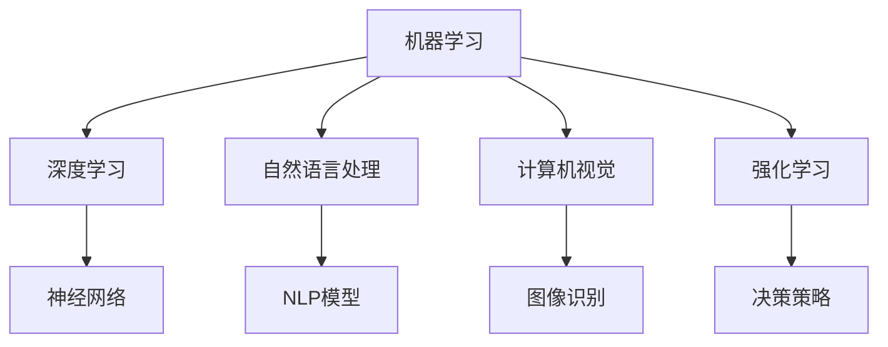

                 

# 人工智能术语的首次提出

## 1. 背景介绍

### 1.1 人工智能术语的起源

人工智能（Artificial Intelligence, AI）这个术语首次出现是在1956年的达特茅斯会议（Dartmouth Conference）上。该会议由约翰·麦卡锡（John McCarthy）、马文·明斯基（Marvin Minsky）、克劳德·香农（Claude Shannon）等计算机科学的先驱发起，被认为是人工智能的开端。会议期间，与会者一致同意将“人工智能”作为这个新兴领域的名字，并定义了其研究目标：使计算机能够模拟人类的智能行为。

### 1.2 达特茅斯会议的重要性

达特茅斯会议不仅是人工智能的诞生地，更是确立了其研究方向的里程碑事件。会议标志着AI作为一个独立学科的正式形成，吸引了大量研究者加入这一领域，并为后来的技术发展和应用奠定了基础。会议的议程中，麦卡锡和明斯基提出了“智能”和“认知”的概念，奠定了人工智能研究的基础。

## 2. 核心概念与联系

### 2.1 核心概念概述

人工智能是一门多学科交叉的技术，涉及计算机科学、认知科学、心理学、语言学等多个领域。其核心概念包括但不限于：

- 机器学习（Machine Learning）：让机器通过数据学习规律，无需显式编程的一种智能实现方式。
- 深度学习（Deep Learning）：利用多层神经网络模拟人脑处理信息的一种机器学习技术。
- 自然语言处理（Natural Language Processing, NLP）：使计算机能够理解、处理和生成人类语言的技术。
- 计算机视觉（Computer Vision）：让计算机理解和分析图像和视频中的视觉信息的技术。
- 强化学习（Reinforcement Learning）：通过奖励机制训练机器，使其在特定环境中做出最优决策的技术。

### 2.2 概念间的关系

这些核心概念之间存在着紧密的联系，构成了人工智能的完整生态系统。以下是这些概念间的关系图：



从上述图表可以看出，深度学习是机器学习的一种，而自然语言处理、计算机视觉、强化学习都是机器学习的子领域。其中，神经网络是深度学习的基础，NLP模型是自然语言处理的核心，图像识别是计算机视觉的关键技术，决策策略是强化学习的核心。

## 3. 核心算法原理 & 具体操作步骤

### 3.1 算法原理概述

人工智能算法主要分为三大类：监督学习（Supervised Learning）、无监督学习（Unsupervised Learning）和强化学习（Reinforcement Learning）。这三种算法分别对应着不同的应用场景，但它们都遵循一个共同的原则：让计算机通过数据或交互来学习智能行为。

- **监督学习**：给定带有标签的数据集，训练模型预测未标注数据的标签。
- **无监督学习**：使用未标注的数据集，自动发现数据的内在结构和规律。
- **强化学习**：通过奖励机制，训练模型在特定环境中做出最优决策。

### 3.2 算法步骤详解

以监督学习为例，其步骤主要包括：

1. **数据准备**：收集标注数据集，将其划分为训练集和测试集。
2. **模型选择**：选择合适的机器学习模型，如线性回归、决策树、支持向量机等。
3. **模型训练**：使用训练集数据，通过反向传播算法优化模型参数，最小化损失函数。
4. **模型评估**：在测试集上评估模型性能，使用准确率、精确率、召回率等指标衡量。
5. **模型应用**：将训练好的模型应用于实际问题，进行预测或决策。

### 3.3 算法优缺点

监督学习的优点在于其模型训练有明确的监督信号，模型效果较为稳定。但其缺点是依赖标注数据，标注成本较高，且容易过拟合。

无监督学习的优点在于其数据准备简单，适用于数据标注成本高或无法获得标注数据的情况。但其缺点是模型效果不稳定，需要更多的领域知识进行指导。

强化学习的优点在于其适用于复杂决策问题，可以通过试错学习最优决策策略。但其缺点是需要大量计算资源，且训练过程较为复杂。

### 3.4 算法应用领域

监督学习在图像识别、语音识别、自然语言处理等领域应用广泛。无监督学习在数据降维、聚类分析、异常检测等领域有重要应用。强化学习在游戏AI、自动驾驶、机器人控制等领域展示了强大的能力。

## 4. 数学模型和公式 & 详细讲解  
### 4.1 数学模型构建

监督学习的数学模型可以表示为：

$$
\hat{y} = f(x;\theta)
$$

其中，$y$ 是标签，$x$ 是输入，$\theta$ 是模型参数，$f(x;\theta)$ 是模型预测函数。常见的监督学习算法包括线性回归、逻辑回归、决策树等。

以线性回归为例，其模型参数可以通过最小二乘法求解：

$$
\theta = (X^TX)^{-1}X^Ty
$$

其中，$X$ 是训练数据矩阵，$y$ 是训练标签向量。

### 4.2 公式推导过程

以线性回归为例，其推导过程如下：

1. **损失函数**：均方误差损失函数

$$
\mathcal{L}(\theta) = \frac{1}{2N}\sum_{i=1}^N(y_i-f(x_i;\theta))^2
$$

2. **梯度下降**：计算梯度并更新参数

$$
\frac{\partial \mathcal{L}(\theta)}{\partial \theta} = -\frac{1}{N}\sum_{i=1}^N(x_i-y_i)X_i
$$

3. **迭代更新**：在每次迭代中，使用梯度下降公式更新参数

$$
\theta = \theta - \eta\frac{\partial \mathcal{L}(\theta)}{\partial \theta}
$$

其中，$\eta$ 是学习率，控制每次迭代的步长。

### 4.3 案例分析与讲解

线性回归的典型应用包括房价预测、股票价格预测等。假设我们有一个包含房价和面积的训练数据集，可以使用线性回归模型预测房价。通过求解上述线性回归模型，我们可以得到房价与面积之间的线性关系。

## 5. 项目实践：代码实例和详细解释说明

### 5.1 开发环境搭建

为了进行线性回归的实践，我们需要安装Python和相关的科学计算库。以下是安装步骤：

1. 安装Python：
```
sudo apt-get update
sudo apt-get install python3
```

2. 安装NumPy和SciPy：
```
pip install numpy scipy
```

3. 安装Matplotlib和Pandas：
```
pip install matplotlib pandas
```

### 5.2 源代码详细实现

以下是使用NumPy实现线性回归的代码：

```python
import numpy as np

# 定义线性回归模型
def linear_regression(X, y, learning_rate=0.01, num_iters=1000):
    m, n = X.shape
    theta = np.zeros(n)
    for i in range(num_iters):
        hypothesis = X.dot(theta)
        loss = hypothesis - y
        gradient = X.T.dot(loss) / m
        theta -= learning_rate * gradient
    return theta

# 生成训练数据
X = np.random.rand(100, 2)
y = 2*X[:, 0] + 3*X[:, 1] + np.random.randn(100, 1)

# 训练模型
theta = linear_regression(X, y)

# 预测新数据
new_X = np.array([[0.5, 0.5]])
pred_y = new_X.dot(theta)

print("预测房价为：", pred_y)
```

### 5.3 代码解读与分析

线性回归模型的实现比较简单，主要分为两个步骤：

1. **模型训练**：通过梯度下降算法更新模型参数。
2. **模型预测**：使用训练好的模型对新数据进行预测。

## 6. 实际应用场景

### 6.1 自然语言处理

自然语言处理是人工智能的重要应用领域之一。在文本分类、情感分析、机器翻译等任务中，机器学习算法被广泛应用。以情感分析为例，可以使用监督学习算法对文本进行情感极性的分类。

### 6.2 图像识别

图像识别是计算机视觉的重要任务。使用卷积神经网络（Convolutional Neural Network, CNN）等深度学习算法，可以对图像进行分类、检测、分割等处理。

### 6.3 自动驾驶

自动驾驶是强化学习的重要应用场景。通过在虚拟环境中训练模型，自动驾驶车辆可以学习最优的驾驶策略，从而实现自主导航。

## 7. 工具和资源推荐

### 7.1 学习资源推荐

为了深入了解人工智能的核心概念和算法，推荐以下学习资源：

1. 《人工智能：一种现代方法》（Artificial Intelligence: A Modern Approach）：Walter K. Palmer和Michael J. Russell的著作，是人工智能领域的经典教材。
2. 《深度学习》（Deep Learning）：Ian Goodfellow、Yoshua Bengio和Aaron Courville的著作，详细介绍了深度学习的基本理论和实践。
3. Coursera和Udacity等在线学习平台：提供大量人工智能课程，包括机器学习、深度学习、计算机视觉等。
4. GitHub：收录了大量开源人工智能项目，包括机器学习算法、深度学习模型等。
5. arXiv预印本网站：收录最新的人工智能研究成果，跟踪前沿进展。

### 7.2 开发工具推荐

以下是一些常用的人工智能开发工具：

1. Python：最受欢迎的人工智能开发语言，具有丰富的科学计算库和框架。
2. TensorFlow：由Google开发的深度学习框架，支持GPU加速。
3. PyTorch：由Facebook开发的深度学习框架，支持动态图和静态图。
4. Jupyter Notebook：交互式编程环境，支持代码编写和结果展示。
5. Anaconda：Python和科学计算库的集成环境，方便项目管理。

### 7.3 相关论文推荐

以下是一些经典的人工智能论文，推荐阅读：

1. 《A New Method for Constructing Artificial Neural Networks and Applying It to Handwritten Zebra-Line Recognition Problem》（1957）：麦卡锡和明斯基提出的感知机模型，奠定了神经网络的研究基础。
2. 《Neural Networks and Machine Learning: The Quest for Generalization》（1998）：Geoffrey Hinton的综述论文，介绍了神经网络的进化过程和应用场景。
3. 《Convolutional Neural Networks》（1998）：Yann LeCun的论文，介绍了卷积神经网络的基本原理和应用。
4. 《Long Short-Term Memory》（1997）：Sepp Hochreiter和Jürgen Schmidhuber提出的长短期记忆网络，对深度学习的发展有重要影响。
5. 《Attention Is All You Need》（2017）：Google Brain团队的论文，提出了自注意力机制，开启了Transformer模型的时代。

## 8. 总结：未来发展趋势与挑战

### 8.1 研究成果总结

人工智能技术在过去几十年中取得了巨大的进步，涵盖了机器学习、深度学习、计算机视觉、自然语言处理等多个领域。研究者们不断突破技术瓶颈，推动了人工智能在实际应用中的广泛应用。

### 8.2 未来发展趋势

1. **自监督学习**：无监督学习的一种重要形式，不需要标注数据，具有更好的泛化能力。
2. **模型压缩和优化**：随着模型规模的增大，如何在保证精度的前提下，减小模型的存储空间和计算资源消耗，成为未来的重要研究方向。
3. **强化学习**：在复杂决策问题中的作用越来越重要，特别是在自动驾驶、机器人控制等领域的应用前景广阔。
4. **跨领域融合**：将人工智能与其他领域的技术进行深度融合，如生物信息学、社会科学等，形成更广泛的智能应用场景。

### 8.3 面临的挑战

1. **数据隐私和安全**：人工智能系统依赖大量的数据，如何保护数据隐私和安全，防止数据滥用，成为重要课题。
2. **算法可解释性**：深度学习模型通常被视为“黑盒”系统，难以解释其内部工作机制，如何增强算法的可解释性，是未来的重要挑战。
3. **伦理和法律问题**：人工智能技术在实际应用中可能会带来伦理和法律问题，如何确保算法的公平性、透明性和安全性，需要更多的政策和规范。

### 8.4 研究展望

1. **跨学科研究**：将人工智能与其他学科进行深度融合，形成更加广泛的应用场景。
2. **伦理和社会影响研究**：在推动人工智能技术发展的同时，关注其对社会和伦理的影响，确保技术的安全性和可靠性。
3. **新型智能系统设计**：开发更加高效、可靠、可解释的智能系统，为人类社会的可持续发展提供支持。

## 9. 附录：常见问题与解答

**Q1: 人工智能技术的发展经历了哪些阶段？**

A: 人工智能技术的发展经历了三个主要阶段：

1. **符号主义**：使用规则和符号表示知识，通过推理实现智能。
2. **连接主义**：使用神经网络模拟人脑处理信息，通过学习实现智能。
3. **深度学习**：使用深度神经网络进行特征提取和分类，通过端到端训练实现智能。

**Q2: 人工智能的实际应用有哪些？**

A: 人工智能的实际应用非常广泛，包括但不限于：

1. **自然语言处理**：文本分类、情感分析、机器翻译等。
2. **计算机视觉**：图像识别、目标检测、图像分割等。
3. **自动驾驶**：自动驾驶车辆、智能交通系统等。
4. **机器人**：工业机器人、服务机器人、无人机等。
5. **金融科技**：量化交易、信用评估、风险管理等。
6. **医疗**：疾病诊断、药物研发、健康管理等。
7. **教育**：智能辅导、学习分析、智能推荐等。

**Q3: 人工智能技术的未来发展趋势是什么？**

A: 人工智能技术的未来发展趋势包括：

1. **自监督学习**：无监督学习的一种重要形式，具有更好的泛化能力。
2. **模型压缩和优化**：减小模型的存储空间和计算资源消耗。
3. **强化学习**：在复杂决策问题中的作用越来越重要。
4. **跨领域融合**：与其他学科进行深度融合，形成更广泛的应用场景。
5. **伦理和法律问题**：确保算法的公平性、透明性和安全性。

**Q4: 如何学习人工智能技术？**

A: 学习人工智能技术需要掌握以下几个方面：

1. **数学基础**：掌握线性代数、概率论、统计学等数学知识。
2. **编程技能**：熟练掌握Python等编程语言。
3. **学习资源**：通过在线课程、书籍、论文等学习人工智能的理论和实践。
4. **项目实践**：参与实际的人工智能项目，积累经验。

**Q5: 人工智能技术的应用前景是什么？**

A: 人工智能技术的应用前景非常广阔，涵盖各个行业和领域。未来，人工智能技术将深度渗透到医疗、金融、教育、交通、制造等行业，为人类社会的智能化转型提供支持。

