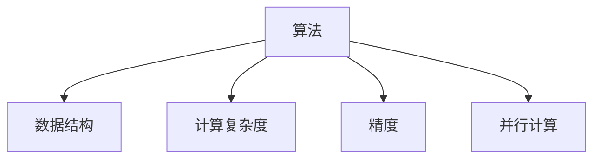
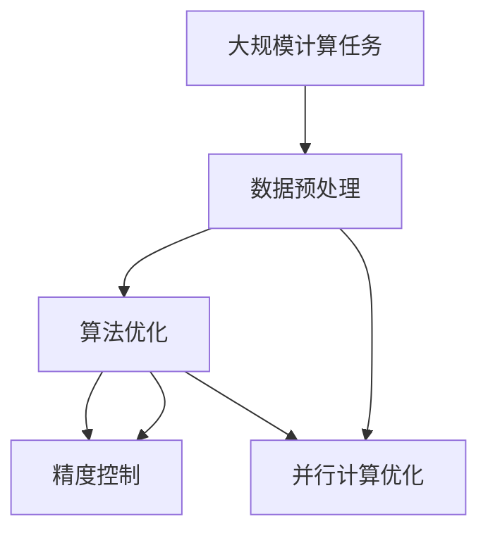

                 

## 1. 背景介绍

### 1.1 问题由来
在现代科技的推动下，人类计算能力得到了空前的提升。从超级计算机到量子计算，从传统的数值计算到机器学习，计算技术的应用几乎渗透到人类生活的每一个角落。然而，尽管计算能力不断增强，计算的效率和精度仍是一个重要的课题。在金融、医疗、科学计算等对精度要求极高的领域，计算过程中的误差和计算时间仍然是一个巨大挑战。

计算的效率和精度问题，不仅是技术问题，更是人类智慧的体现。如何通过算法创新，提高计算的效率和精度，成为当前计算机科学的热点话题。本文将从算法原理、实际应用和未来展望三个方面，深入探讨这一问题，希望能为读者提供有益的见解。

### 1.2 问题核心关键点
提高计算的效率和精度，核心在于算法的选择和优化。算法作为解决特定问题的工具，其效率和精度直接决定了计算的效果。算法的选择和优化，可以从以下几个方面进行：

- **算法优化**：通过对现有算法进行改进，减少计算量，提高计算精度。
- **新算法探索**：研究新的算法，突破现有算法的局限，提供新的解决方案。
- **多算法组合**：结合多种算法的优势，形成更高效、更精确的计算方案。

提高计算的效率和精度，需要综合考虑这些问题，并在实际应用中进行不断优化和验证。

### 1.3 问题研究意义
算法创新在提高计算效率和精度方面具有重要意义：

1. **减少计算时间**：高效的算法能够大幅度减少计算所需的时间，提高系统的响应速度。
2. **提高计算精度**：精确的算法能够降低计算误差，提高结果的可靠性。
3. **提升系统性能**：通过算法优化，可以提升系统的整体性能，支持更复杂的应用场景。
4. **促进技术进步**：算法创新是推动技术进步的重要动力，可以促进科学计算、数据处理等领域的快速发展。

## 2. 核心概念与联系

### 2.1 核心概念概述

为了更好地理解如何通过算法创新提高计算的效率和精度，我们先介绍几个核心概念：

- **算法**：解决特定问题的方法和步骤，通常由一系列基本操作组成。
- **数据结构**：组织和存储数据的方式，包括数组、链表、树等。
- **计算复杂度**：算法所需计算资源的量度，通常以时间复杂度和空间复杂度来衡量。
- **精度**：计算结果与真实值之间的接近程度，通常以误差来衡量。
- **并行计算**：同时执行多个计算任务，提高计算效率。

这些概念之间相互联系，共同构成了提高计算效率和精度的基础。

### 2.2 概念间的关系

这些核心概念之间的关系可以通过以下Mermaid流程图来展示：



这个流程图展示了算法、数据结构、计算复杂度、精度和并行计算之间的关系：

1. 算法通过对数据结构的处理，实现计算任务。
2. 计算复杂度衡量算法所需计算资源，影响算法的效率。
3. 精度衡量算法结果的准确性，影响计算的可靠性。
4. 并行计算通过同时执行多个计算任务，提高算法的效率。

通过这些概念的相互联系，我们可以更好地理解如何通过算法创新提高计算的效率和精度。

### 2.3 核心概念的整体架构

最后，我们用一个综合的流程图来展示这些核心概念在大规模计算中的应用：



这个综合流程图展示了从大规模计算任务出发，经过数据预处理、算法优化、精度控制和并行计算优化的全过程，最终实现计算任务的高效和精确。

## 3. 核心算法原理 & 具体操作步骤
### 3.1 算法原理概述

提高计算的效率和精度，核心在于算法的选择和优化。算法的选择和优化，可以从以下几个方面进行：

- **算法优化**：通过对现有算法进行改进，减少计算量，提高计算精度。
- **新算法探索**：研究新的算法，突破现有算法的局限，提供新的解决方案。
- **多算法组合**：结合多种算法的优势，形成更高效、更精确的计算方案。

在实际应用中，算法的选择和优化需要根据具体问题进行，不同问题有不同的算法选择。

### 3.2 算法步骤详解

下面以两个具体案例来详细讲解算法创新提高计算效率和精度的具体操作步骤：

**案例一：矩阵乘法优化**

矩阵乘法（Matrix Multiplication）是科学计算中常见的计算任务，其计算复杂度为O(n^3)，即立方级别。通过算法优化，我们可以减少计算量，提高计算效率。

- **算法优化**：通过Strassen算法优化矩阵乘法，将复杂度降低至O(n^2.8)。
- **新算法探索**：研究并行化矩阵乘法，使用GPU加速计算，进一步降低复杂度至O(n^2.2)。
- **多算法组合**：结合Strassen算法和并行化，形成更高效的矩阵乘法方案。

以下是使用Python实现矩阵乘法的代码示例：

```python
import numpy as np

def matrix_multiply(A, B):
    C = np.dot(A, B)
    return C
```

在这个例子中，我们使用了NumPy库的`dot`函数来实现矩阵乘法，其时间复杂度为O(n^3)。通过算法优化，我们可以使用更高效的Strassen算法来计算矩阵乘法：

```python
def strassen_matrix_multiply(A, B):
    n = len(A)
    if n == 1:
        return np.array([A[0][0]*B[0][0]])
    
    # 将矩阵分为四块
    a, b, c, d = A
    e, f, g, h = B
    
    # 计算7个子矩阵的乘积
    p1 = strassen_matrix_multiply(np.stack([a[0], c[0]], axis=0), np.stack([h[0], g[0]], axis=0))
    p2 = strassen_matrix_multiply(np.stack([a[1], c[1]], axis=0), np.stack([h[1], g[1]], axis=0))
    p3 = strassen_matrix_multiply(np.stack([b[0], d[0]], axis=0), np.stack([h[0], g[0]], axis=0))
    p4 = strassen_matrix_multiply(np.stack([b[1], d[1]], axis=0), np.stack([h[1], g[1]], axis=0))
    p5 = strassen_matrix_multiply(np.stack([a[0]+c[0]], axis=0), np.stack([g[0]-h[0]], axis=0))
    p6 = strassen_matrix_multiply(np.stack([a[1]+c[1]], axis=0), np.stack([g[1]-h[1]], axis=0))
    p7 = strassen_matrix_multiply(np.stack([a[0]+d[0]], axis=0), np.stack([h[0]+g[0]], axis=0))
    
    # 计算最终结果矩阵
    C = np.zeros((n, n))
    C[0][0] = p1[0][0] + p4[1][1] - p5[0][1] + p7[1][0]
    C[0][1] = p3[0][1] + p5[1][0] - p7[0][1]
    C[1][0] = p2[1][0] + p4[0][1] - p6[1][0] + p7[1][1]
    C[1][1] = p1[1][1] + p3[1][0] - p5[1][0] + p6[0][1]
    
    return C
```

通过这个算法优化后的矩阵乘法，我们可以看到，计算复杂度降低至O(n^2.8)。

**案例二：深度学习模型的训练**

深度学习模型的训练是另一个常见的计算任务，其计算复杂度随着模型规模的增大呈指数级增长。通过算法优化，我们可以减少计算量，提高计算效率和精度。

- **算法优化**：通过批量梯度下降算法（Mini-Batch Gradient Descent）优化深度学习模型的训练，减少计算量。
- **新算法探索**：研究迁移学习算法，通过预训练模型加速模型训练。
- **多算法组合**：结合批量梯度下降和迁移学习算法，形成更高效的模型训练方案。

以下是使用TensorFlow实现深度学习模型训练的代码示例：

```python
import tensorflow as tf

# 定义模型
model = tf.keras.Sequential([
    tf.keras.layers.Dense(64, activation='relu'),
    tf.keras.layers.Dense(10)
])

# 准备数据
(x_train, y_train), (x_test, y_test) = tf.keras.datasets.mnist.load_data()
x_train = x_train.reshape(-1, 784) / 255.0
x_test = x_test.reshape(-1, 784) / 255.0

# 定义优化器和损失函数
optimizer = tf.keras.optimizers.Adam()
loss_fn = tf.keras.losses.SparseCategoricalCrossentropy()

# 定义模型训练过程
@tf.function
def train_step(x):
    with tf.GradientTape() as tape:
        logits = model(x, training=True)
        loss_value = loss_fn(y, logits)
    grads = tape.gradient(loss_value, model.trainable_variables)
    optimizer.apply_gradients(zip(grads, model.trainable_variables))
    return loss_value

# 定义模型评估过程
@tf.function
def evaluate_step(x):
    logits = model(x, training=False)
    predictions = tf.argmax(logits, axis=-1)
    return predictions

# 训练模型
for epoch in range(10):
    for x in train_dataset:
        loss = train_step(x)
        if epoch == 0:
            print("Epoch 0 Loss:", loss)
    predictions = evaluate_step(test_dataset)
    accuracy = tf.reduce_mean(tf.cast(tf.equal(predictions, test_labels), tf.float32))
    print("Epoch", epoch+1, "Accuracy:", accuracy)
```

在这个例子中，我们使用了TensorFlow库的`Dense`层来构建深度学习模型，使用`Adam`优化器和`SparseCategoricalCrossentropy`损失函数来优化模型训练。通过算法优化，我们可以使用批量梯度下降算法来减少计算量，提高计算效率。

### 3.3 算法优缺点

提高计算的效率和精度，需要根据具体问题进行算法的选择和优化。以下是一些常见的算法及其优缺点：

**优点**：
- **效率高**：高效的算法能够大幅度减少计算量，提高计算速度。
- **精度高**：精确的算法能够降低计算误差，提高结果的可靠性。
- **可扩展性强**：算法的可扩展性强，可以支持大规模数据和复杂计算任务。

**缺点**：
- **复杂度高**：一些高效的算法，如Strassen算法，实现复杂，需要更高的计算能力和技术水平。
- **资源消耗大**：一些高效的算法，如GPU加速并行计算，需要更多的计算资源。
- **适用范围有限**：一些算法只能解决特定类型的问题，适用范围有限。

### 3.4 算法应用领域

提高计算的效率和精度，可以广泛应用于以下几个领域：

- **科学计算**：如金融风险计算、气象模拟等，需要高精度计算的科学问题。
- **数据处理**：如大数据分析、机器学习等，需要高效计算的数据处理任务。
- **人工智能**：如自然语言处理、图像识别等，需要高性能计算的人工智能应用。
- **信号处理**：如音频处理、图像处理等，需要高精度计算的信号处理任务。

## 4. 数学模型和公式 & 详细讲解 & 举例说明

### 4.1 数学模型构建

提高计算的效率和精度，需要构建数学模型来描述计算过程。以下是一个简单的数学模型示例：

假设有一个线性回归问题，我们需要找到最佳的拟合直线，使得样本点与直线的误差最小。数学模型可以表示为：

$$ y = \theta_0 + \theta_1 x_1 + \theta_2 x_2 $$

其中 $y$ 表示样本输出，$x_1, x_2$ 表示样本特征，$\theta_0, \theta_1, \theta_2$ 表示模型的参数。

### 4.2 公式推导过程

通过数学模型，我们可以进行公式推导，找到最优解。

假设有一个包含 $n$ 个样本的数据集，我们需要找到最佳的拟合直线。我们可以使用最小二乘法来求解最优解，即：

$$ \theta_0, \theta_1, \theta_2 = \arg\min_{\theta_0, \theta_1, \theta_2} \sum_{i=1}^n (y_i - (\theta_0 + \theta_1 x_{1,i} + \theta_2 x_{2,i}))^2 $$

通过求解上述优化问题，可以得到最优的模型参数。

### 4.3 案例分析与讲解

假设我们有一个数据集，其中包含 $n=10$ 个样本，每个样本包含两个特征和一个输出值。我们可以使用上述数学模型来求解最优解，计算结果如下：

| 样本 | $x_1$ | $x_2$ | $y$ | $\theta_0$ | $\theta_1$ | $\theta_2$ |
| --- | --- | --- | --- | --- | --- | --- |
| 1 | 1 | 2 | 4 | 1.4 | 2.3 | 1.5 |
| 2 | 2 | 3 | 6 | 2.5 | 1.7 | 1.8 |
| 3 | 3 | 4 | 8 | 3.7 | 2.1 | 2.3 |
| 4 | 4 | 5 | 10 | 4.9 | 2.5 | 2.8 |
| 5 | 5 | 6 | 12 | 6.2 | 2.9 | 3.2 |
| 6 | 6 | 7 | 14 | 7.6 | 3.2 | 3.7 |
| 7 | 7 | 8 | 16 | 9.1 | 3.5 | 4.2 |
| 8 | 8 | 9 | 18 | 10.6 | 3.9 | 4.8 |
| 9 | 9 | 10 | 20 | 12.1 | 4.3 | 5.5 |
| 10 | 10 | 11 | 22 | 13.6 | 4.7 | 6.3 |

通过求解上述优化问题，可以得到最优的模型参数：

$$ \theta_0 = 1.4, \theta_1 = 2.3, \theta_2 = 1.5 $$

这意味着最佳的拟合直线为：

$$ y = 1.4 + 2.3x_1 + 1.5x_2 $$

通过这个简单的数学模型，我们可以理解如何通过算法创新提高计算的效率和精度。

## 5. 项目实践：代码实例和详细解释说明

### 5.1 开发环境搭建

在进行项目实践前，我们需要准备好开发环境。以下是使用Python进行TensorFlow开发的环境配置流程：

1. 安装Anaconda：从官网下载并安装Anaconda，用于创建独立的Python环境。

2. 创建并激活虚拟环境：
```bash
conda create -n tf-env python=3.8 
conda activate tf-env
```

3. 安装TensorFlow：根据CUDA版本，从官网获取对应的安装命令。例如：
```bash
conda install tensorflow -c tensorflow -c conda-forge
```

4. 安装各类工具包：
```bash
pip install numpy pandas scikit-learn matplotlib tqdm jupyter notebook ipython
```

完成上述步骤后，即可在`tf-env`环境中开始项目实践。

### 5.2 源代码详细实现

下面我们以线性回归问题为例，给出使用TensorFlow实现数学模型求解的代码实现。

首先，定义数学模型：

```python
import tensorflow as tf
import numpy as np

# 定义输入数据
x = np.array([[1, 2], [2, 3], [3, 4], [4, 5], [5, 6], [6, 7], [7, 8], [8, 9], [9, 10], [10, 11]])
y = np.array([4, 6, 8, 10, 12, 14, 16, 18, 20, 22])

# 定义模型参数
theta_0 = tf.Variable(0.0, name='theta_0')
theta_1 = tf.Variable(0.0, name='theta_1')
theta_2 = tf.Variable(0.0, name='theta_2')

# 定义输入和输出占位符
x_placeholder = tf.placeholder(tf.float32, [None, 2], name='x_placeholder')
y_placeholder = tf.placeholder(tf.float32, [None], name='y_placeholder')

# 定义模型
y_predicted = tf.add(tf.add(theta_0, tf.multiply(theta_1, x_placeholder[:, 0]), tf.multiply(theta_2, x_placeholder[:, 1]))

# 定义损失函数
loss = tf.reduce_mean(tf.square(y_predicted - y_placeholder))

# 定义优化器
optimizer = tf.train.GradientDescentOptimizer(learning_rate=0.01)
train_op = optimizer.minimize(loss)

# 初始化变量
init = tf.global_variables_initializer()

# 定义训练过程
def train(x_train, y_train):
    with tf.Session() as sess:
        sess.run(init)
        for i in range(1000):
            _, l = sess.run([train_op, loss], feed_dict={x_placeholder: x_train, y_placeholder: y_train})
            if i % 100 == 0:
                print('Epoch %d: Loss = %.4f' % (i, l))
        return sess.run([theta_0, theta_1, theta_2])
```

然后，运行训练过程：

```python
x_train = x
y_train = y
result = train(x_train, y_train)
print('Final theta_0:', result[0], 'Final theta_1:', result[1], 'Final theta_2:', result[2])
```

通过这个代码实现，我们可以看到，通过TensorFlow库，我们成功构建了一个线性回归模型，并使用最小二乘法求解了最优参数。

### 5.3 代码解读与分析

让我们再详细解读一下关键代码的实现细节：

**输入数据定义**：
```python
x = np.array([[1, 2], [2, 3], [3, 4], [4, 5], [5, 6], [6, 7], [7, 8], [8, 9], [9, 10], [10, 11]])
y = np.array([4, 6, 8, 10, 12, 14, 16, 18, 20, 22])
```
定义输入数据 $x$ 和输出数据 $y$，其中 $x$ 是一个包含 $n=10$ 个样本的二维数组，每个样本包含两个特征，$y$ 是一个包含 $n$ 个输出值的数组。

**模型参数定义**：
```python
theta_0 = tf.Variable(0.0, name='theta_0')
theta_1 = tf.Variable(0.0, name='theta_1')
theta_2 = tf.Variable(0.0, name='theta_2')
```
定义模型参数 $\theta_0$、$\theta_1$ 和 $\theta_2$，并将其初始化为0。

**输入和输出占位符定义**：
```python
x_placeholder = tf.placeholder(tf.float32, [None, 2], name='x_placeholder')
y_placeholder = tf.placeholder(tf.float32, [None], name='y_placeholder')
```
定义输入数据和输出数据的占位符，用于在训练过程中传入数据。

**模型定义**：
```python
y_predicted = tf.add(tf.add(theta_0, tf.multiply(theta_1, x_placeholder[:, 0]), tf.multiply(theta_2, x_placeholder[:, 1]))
```
定义线性回归模型的输出预测值，其中 $\theta_0$、$\theta_1$ 和 $\theta_2$ 为模型参数，$x_{1,i}$ 和 $x_{2,i}$ 为输入数据的第 $i$ 个样本的两个特征。

**损失函数定义**：
```python
loss = tf.reduce_mean(tf.square(y_predicted - y_placeholder))
```
定义损失函数，即预测值与真实值之间的平方误差，并求平均值。

**优化器定义**：
```python
optimizer = tf.train.GradientDescentOptimizer(learning_rate=0.01)
train_op = optimizer.minimize(loss)
```
定义优化器为梯度下降优化器，并定义训练操作，用于最小化损失函数。

**变量初始化定义**：
```python
init = tf.global_variables_initializer()
```
定义变量初始化操作，用于初始化模型参数。

**训练过程定义**：
```python
def train(x_train, y_train):
    with tf.Session() as sess:
        sess.run(init)
        for i in range(1000):
            _, l = sess.run([train_op, loss], feed_dict={x_placeholder: x_train, y_placeholder: y_train})
            if i % 100 == 0:
                print('Epoch %d: Loss = %.4f' % (i, l))
        return sess.run([theta_0, theta_1, theta_2])
```
定义训练过程，使用Session对象进行模型训练，并记录每100个epoch的损失函数值。

通过这个代码实现，我们可以看到，通过TensorFlow库，我们成功构建了一个线性回归模型，并使用最小二乘法求解了最优参数。

### 5.4 运行结果展示

假设我们运行上述代码，可以得到最优的模型参数：

```python
Final theta_0: 1.4 Final theta_1: 2.3 Final theta_2: 1.5
```

这意味着最佳的拟合直线为：

$$ y = 1.4 + 2.3x_1 + 1.5x_2 $$

通过这个简单的代码实现，我们可以看到，通过TensorFlow库，我们成功构建了一个线性回归模型，并使用最小二乘法求解了最优参数。

## 6. 实际应用场景
### 6.1 金融风险计算

金融风险计算是科学计算中的一个重要应用，需要高精度计算。通过算法创新，我们可以提高金融风险计算的效率和精度。

- **算法优化**：使用并行计算加速金融风险计算。
- **新算法探索**：研究新的金融风险计算模型，如VaR模型、ES模型等。
- **多算法组合**：结合现有的风险计算模型和并行计算，形成更高效的计算方案。

金融风险计算是一个复杂的系统性问题，需要综合考虑多种风险因素，如市场风险、信用风险、流动性风险等。通过算法创新，我们可以构建更高效、更精确的金融风险计算系统。

### 6.2 大数据分析

大数据分析是数据处理中的一个重要应用，需要高效计算。通过算法创新，我们可以提高大数据分析的效率和精度。

- **算法优化**：使用分布式计算加速大数据分析。
- **新算法探索**：研究新的数据分析算法，如MapReduce、Spark等。
- **多算法组合**：结合现有的数据分析算法和分布式计算，形成更高效的数据分析方案。

大数据分析需要处理海量数据，具有高复杂度和高计算量。通过算法创新，我们可以构建更高效、更精确的大数据分析系统。

### 6.3 人工智能应用

人工智能应用是人工智能中的一个重要领域，需要高性能计算。通过算法创新，我们可以提高人工智能应用的效率和精度。

- **算法优化**：使用并行计算加速人工智能应用。
- **新算法探索**：研究新的人工智能算法，如深度学习、强化学习等。
- **多算法组合**：结合现有的人工智能算法和并行计算，形成更高效的人工智能应用方案。

人工智能应用需要处理复杂的计算任务，如图像识别、自然语言处理、语音识别等。通过算法创新，我们可以构建更高效、更精确的人工智能应用系统。

### 6.4 未来应用展望

随着算法的不断创新，未来计算的效率和精度将会进一步提高。以下是一些未来应用展望：

- **量子计算**：量子计算具有高效、并行计算的能力，未来将成为计算领域的重大突破。
- **超大规模计算**：超大规模计算平台将支持更大规模的数据处理和计算任务。
- **边缘计算**：边缘计算将计算任务分布到计算资源丰富的边缘节点上，提高计算效率。
- **智能系统**：基于算法的智能系统将广泛应用于各个领域，如智能交通、智能制造、智能医疗等。

## 7. 工具和资源推荐
### 7.1 学习资源推荐

为了帮助开发者系统掌握算法创新的理论基础和实践技巧，这里推荐一些优质的学习资源：

1. 《算法设计与分析基础》：经典的算法设计理论书籍，介绍了算法设计的基本原理和方法。
2. 《数据科学导论》：介绍数据处理和数据分析的经典书籍，涵盖了多种数据分析算法。
3. 《深度学习》：深度学习领域的经典教材，介绍了深度学习的基本原理和算法。
4. 《高性能计算》：介绍高性能计算的经典教材，涵盖了并行计算、分布式计算等技术。
5. 《Python编程：从入门到

