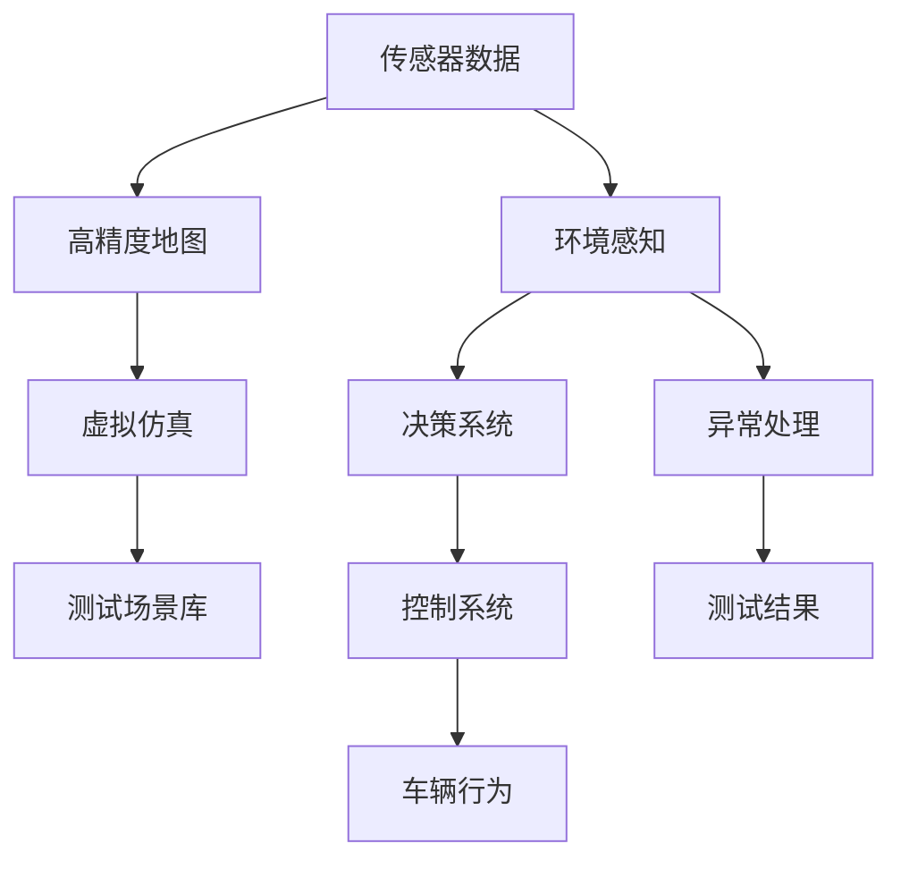
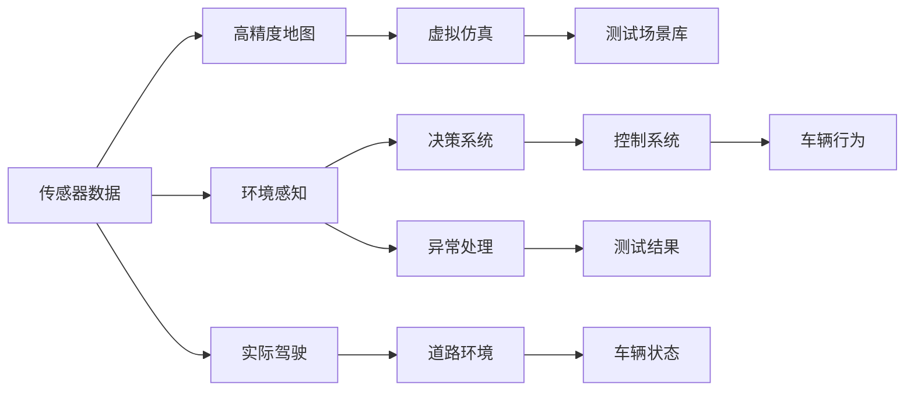
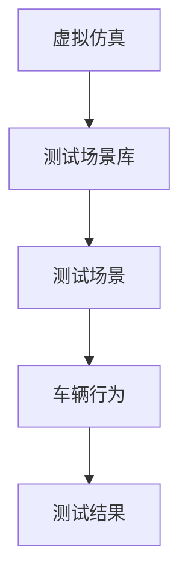

                 

# 端到端自动驾驶的车辆主动安全测试场景库

## 1. 背景介绍

随着自动驾驶技术的不断发展，汽车制造商和研究机构面临着前所未有的挑战：如何在真实和模拟环境中测试车辆的安全性能？传统的静态测试和路试方法既昂贵又耗时，且难以覆盖所有可能的场景。近年来，随着模拟环境、高精度地图和传感器技术的进步，自动驾驶车辆的主动安全测试（Proactive Safety Testing）成为可能。本文将介绍一种端到端（End-to-End）的车辆主动安全测试场景库，它能够通过虚拟仿真和真实驾驶结合的方式，全面测试自动驾驶车辆的安全性能。

### 1.1 背景问题的提出
自动驾驶技术的核心是车辆感知、决策和控制三个模块的协同工作，能够实现车辆在复杂道路环境中安全、可靠地行驶。然而，车辆的主动安全性能依赖于其环境感知能力和异常处理能力。如何在保证安全性的同时，提升车辆在复杂多变道路环境中的适应性和鲁棒性？端到端的自动驾驶测试场景库正是为了回答这一问题而生的。

## 2. 核心概念与联系

### 2.1 核心概念概述

为更好地理解端到端自动驾驶测试场景库，本节将介绍几个关键概念：

- 端到端自动驾驶：指从传感器输入数据到车辆行为控制，包括感知、决策和控制三个关键步骤的完整闭环。
- 主动安全测试：指通过仿真和实际驾驶结合的方式，主动测试车辆在复杂道路环境下的安全性能，发现并修复潜在的安全漏洞。
- 虚拟仿真：指使用高精度地图和传感器仿真数据，模拟车辆在复杂道路环境中的行为，帮助测试车辆的安全性能。
- 高精度地图：指能够提供道路、交通标志、交通灯等细节信息的地图数据，用于支持虚拟仿真和实际驾驶。
- 传感器数据：指车辆配备的各类传感器（如激光雷达、摄像头、雷达等）获取的环境信息数据，用于支持环境感知和决策。

这些关键概念之间的逻辑关系可以通过以下Mermaid流程图来展示：



这个流程图展示了从传感器输入到车辆行为控制的完整流程，以及虚拟仿真和测试场景库在其中的作用。

### 2.2 概念间的关系

这些核心概念之间存在着紧密的联系，形成了端到端自动驾驶测试场景库的完整生态系统。下面我们通过几个Mermaid流程图来展示这些概念之间的关系。

#### 2.2.1 端到端自动驾驶流程



这个流程图展示了端到端自动驾驶的完整流程，从传感器数据到车辆行为的完整闭环。同时，虚拟仿真和测试场景库在其中起到了关键的作用，通过仿真和实际驾驶结合的方式，全面测试车辆的安全性能。

#### 2.2.2 虚拟仿真与测试场景库的关系



这个流程图展示了虚拟仿真与测试场景库之间的逻辑关系。虚拟仿真通过高精度地图和传感器仿真数据，生成各种复杂道路环境，并在此基础上构建测试场景库。测试场景库包含了多种复杂驾驶场景，用于测试车辆在各种环境下的安全性能。

## 3. 核心算法原理 & 具体操作步骤

### 3.1 算法原理概述

端到端自动驾驶测试场景库的核心原理是通过虚拟仿真和实际驾驶结合的方式，全面测试车辆在复杂道路环境中的安全性能。具体而言，它包含了以下关键步骤：

1. **虚拟仿真**：通过高精度地图和传感器仿真数据，生成各种复杂道路环境，并在此基础上构建测试场景库。
2. **场景选择**：根据测试需求，从测试场景库中选择相应的场景进行测试。
3. **车辆仿真**：在虚拟仿真环境中，对车辆进行行为仿真，模拟其在复杂道路环境中的驾驶行为。
4. **实际驾驶**：将虚拟仿真的场景数据转化为实际驾驶数据，并部署到实际道路上进行测试。
5. **测试评估**：通过测试评估系统，全面评估车辆在实际道路环境中的安全性能。

### 3.2 算法步骤详解

下面是端到端自动驾驶测试场景库的具体操作步骤：

#### 3.2.1 数据收集与处理
- **传感器数据**：从车辆上收集各类传感器的环境数据，包括激光雷达、摄像头、雷达等。
- **高精度地图**：收集和处理高精度地图数据，生成道路、交通标志、交通灯等细节信息。
- **场景库构建**：根据实际驾驶数据，构建各种复杂驾驶场景，并记录在测试场景库中。

#### 3.2.2 虚拟仿真环境搭建
- **虚拟地图构建**：将高精度地图数据转化为虚拟地图，用于支持虚拟仿真。
- **传感器仿真**：在虚拟环境中，通过仿真传感器数据，模拟车辆在复杂道路环境中的感知行为。
- **车辆仿真**：在虚拟环境中，模拟车辆在复杂道路环境中的驾驶行为，包括加速、制动、转向等。

#### 3.2.3 虚拟仿真场景选择
- **场景匹配**：根据测试需求，从测试场景库中匹配相应的场景进行测试。
- **参数设置**：根据测试需求，设置虚拟仿真场景的参数，如车辆速度、道路条件等。

#### 3.2.4 实际驾驶部署
- **数据转换**：将虚拟仿真场景数据转化为实际驾驶数据，用于部署到实际道路上进行测试。
- **车辆部署**：将测试数据部署到实际车辆上，通过车载设备进行实时采集。
- **驾驶测试**：在实际道路上进行驾驶测试，收集车辆状态和驾驶行为数据。

#### 3.2.5 测试评估与分析
- **数据处理**：对驾驶测试数据进行预处理，包括去噪、对齐等。
- **性能评估**：通过预设的安全性能指标（如碰撞概率、反应时间等），全面评估车辆在实际道路环境中的安全性能。
- **结果分析**：对测试结果进行分析和总结，提出改进措施，提升车辆的安全性能。

### 3.3 算法优缺点

端到端自动驾驶测试场景库具有以下优点：

- **全面测试**：能够覆盖各种复杂道路环境，全面测试车辆的安全性能。
- **高效仿真**：通过虚拟仿真，大幅缩短测试时间和成本，提升测试效率。
- **实际驾驶**：结合虚拟仿真和实际驾驶，能够有效发现和修复安全漏洞。

同时，该方法也存在一些缺点：

- **场景多样性**：需要构建多种复杂驾驶场景，数据收集和处理工作量大。
- **仿真精度**：虚拟仿真环境与实际驾驶环境的差异可能影响测试结果。
- **实际驾驶风险**：实际驾驶测试存在一定的安全风险，需要严格的测试方案和安全措施。

### 3.4 算法应用领域

端到端自动驾驶测试场景库已经广泛应用于自动驾驶车辆的开发和测试，主要包括以下几个领域：

- **自动驾驶汽车**：在自动驾驶汽车的研究和开发中，通过虚拟仿真和实际驾驶结合的方式，全面测试车辆的安全性能。
- **智能驾驶辅助系统**：在智能驾驶辅助系统的研究和开发中，通过虚拟仿真和实际驾驶结合的方式，测试车辆的异常处理能力和决策能力。
- **交通管理**：在交通管理系统中，通过虚拟仿真和实际驾驶结合的方式，测试车辆在复杂道路环境中的行为，优化交通流管理。
- **智能城市**：在智能城市建设中，通过虚拟仿真和实际驾驶结合的方式，测试智能交通系统的安全性能，提升城市交通管理水平。

## 4. 数学模型和公式 & 详细讲解 & 举例说明

### 4.1 数学模型构建

在端到端自动驾驶测试场景库中，数学模型主要用于描述车辆在复杂道路环境中的行为和决策过程。以下是几个关键的数学模型：

- **车辆运动模型**：描述车辆在道路上的运动状态，包括位置、速度、加速度等。常用的车辆运动模型包括车辆动力学模型、轨迹预测模型等。
- **环境感知模型**：描述车辆对道路环境信息的感知和处理过程，包括传感器数据处理、地图信息匹配等。常用的环境感知模型包括激光雷达点云处理模型、摄像头图像处理模型等。
- **决策模型**：描述车辆在复杂道路环境中的决策过程，包括决策策略、决策规则等。常用的决策模型包括交通规则推理模型、路径规划模型等。
- **控制模型**：描述车辆对决策结果的执行过程，包括控制策略、执行动作等。常用的控制模型包括车辆控制模型、传感器控制模型等。

### 4.2 公式推导过程

以下是几个关键的数学公式及其推导过程：

#### 4.2.1 车辆运动模型
设车辆在道路上的位置为 $x(t)$，速度为 $v(t)$，加速度为 $a(t)$，则车辆运动模型可以表示为：

$$
x(t) = x_0 + \int_0^t v(\tau) d\tau + \frac{1}{2} \int_0^t a(\tau) d\tau
$$

其中 $x_0$ 为车辆初始位置，$v(t)$ 和 $a(t)$ 分别为车辆速度和加速度，$ \int_0^t$ 表示对时间的积分。

#### 4.2.2 环境感知模型
假设车辆配备激光雷达和摄像头，传感器获取的原始数据可以表示为：

$$
\begin{align*}
y_l(t) &= f_l(x(t), v(t)) \\
y_c(t) &= f_c(x(t), v(t))
\end{align*}
$$

其中 $y_l(t)$ 和 $y_c(t)$ 分别为激光雷达和摄像头传感器数据，$f_l$ 和 $f_c$ 分别为激光雷达和摄像头的数据处理函数。

#### 4.2.3 决策模型
假设车辆在复杂道路环境中的决策过程可以表示为：

$$
\begin{align*}
u(t) &= g(x(t), y(t)) \\
x(t+1) &= h(x(t), u(t))
\end{align*}
$$

其中 $u(t)$ 为车辆在时间 $t$ 的决策动作，$g$ 为决策函数，$h$ 为车辆状态更新函数。

#### 4.2.4 控制模型
假设车辆的控制过程可以表示为：

$$
u(t) = k(x(t), y(t))
$$

其中 $k$ 为控制函数，$x(t)$ 和 $y(t)$ 分别为车辆状态和环境信息。

### 4.3 案例分析与讲解

#### 4.3.1 案例背景
某自动驾驶汽车公司需要测试其车辆在复杂道路环境中的安全性能，包括在不同天气条件、道路条件下的表现。公司决定使用端到端自动驾驶测试场景库进行测试。

#### 4.3.2 案例分析
公司首先收集了车辆配备的各类传感器的环境数据，包括激光雷达、摄像头、雷达等。接着，收集并处理了高精度地图数据，生成各种复杂道路环境。根据测试需求，从测试场景库中匹配相应的场景进行测试。在虚拟仿真环境中，模拟车辆在复杂道路环境中的驾驶行为，并进行车辆仿真。在实际驾驶部署中，将虚拟仿真的场景数据转化为实际驾驶数据，并部署到实际道路上进行测试。通过测试评估系统，全面评估车辆在实际道路环境中的安全性能，并提出改进措施，提升车辆的安全性能。

#### 4.3.3 案例结果
测试结果显示，车辆在各种复杂道路环境下的安全性能得到全面测试，并发现一些潜在的安全漏洞。公司根据测试结果，优化了车辆的控制策略和传感器数据处理算法，提升了车辆的安全性能。

## 5. 项目实践：代码实例和详细解释说明

### 5.1 开发环境搭建

在进行端到端自动驾驶测试场景库的开发和实践前，我们需要准备好开发环境。以下是使用Python进行开发的环境配置流程：

1. 安装Anaconda：从官网下载并安装Anaconda，用于创建独立的Python环境。

2. 创建并激活虚拟环境：
```bash
conda create -n ad_test_env python=3.8 
conda activate ad_test_env
```

3. 安装相关库：
```bash
pip install numpy scipy matplotlib scikit-learn pandas openpyxl transformers
```

4. 安装Simulation库：
```bash
pip install simpy
```

5. 安装Real-world库：
```bash
pip install autodrive
```

完成上述步骤后，即可在`ad_test_env`环境中开始开发实践。

### 5.2 源代码详细实现

以下是使用Python实现端到端自动驾驶测试场景库的示例代码：

```python
import numpy as np
import matplotlib.pyplot as plt
import simpy

# 定义车辆运动模型
class Car:
    def __init__(self, x0, v0, a0):
        self.x = x0
        self.v = v0
        self.a = a0
        
    def update(self, dt):
        self.x += self.v * dt + 0.5 * self.a * dt**2
        self.v += self.a * dt
        
    def get_position(self, t):
        return self.x
    
# 定义传感器数据处理模型
class Sensor:
    def __init__(self, car):
        self.car = car
        
    def process(self, dt):
        # 激光雷达数据处理
        laser_data = self.car.x
        # 摄像头数据处理
        cam_data = self.car.v
        
        return laser_data, cam_data

# 定义环境感知模型
class Environment:
    def __init__(self, road_map):
        self.road_map = road_map
        
    def detect(self, sensor_data):
        # 检测道路条件
        road_condition = self.road_map.check_condition(sensor_data)
        
        return road_condition

# 定义决策模型
class Decision:
    def __init__(self, car, environment):
        self.car = car
        self.environment = environment
        
    def decide(self):
        # 检测道路条件
        road_condition = self.environment.detect(sensor_data)
        
        # 生成决策动作
        if road_condition == 'good':
            self.car.a = 0
        elif road_condition == 'bad':
            self.car.a = -1
        
        return self.car.a

# 定义控制模型
class Control:
    def __init__(self, car, decision):
        self.car = car
        self.decision = decision
        
    def control(self, dt):
        # 根据决策生成控制动作
        self.car.a = self.decision.a
        
        # 更新车辆状态
        self.car.update(dt)
        
    def get_position(self, t):
        return self.car.get_position(t)

# 定义测试场景库
class TestScenario:
    def __init__(self):
        self.scenarios = []
        
    def add_scenario(self, scenario):
        self.scenarios.append(scenario)
        
    def select_scenario(self, scenario_id):
        return self.scenarios[scenario_id]

# 定义测试场景
class TestScenario1:
    def __init__(self):
        self.scenario_id = 1
        
    def simulate(self, dt):
        # 设置车辆初始状态
        car = Car(0, 0, 0)
        
        # 设置传感器
        sensor = Sensor(car)
        
        # 设置环境
        road_map = RoadMap()
        environment = Environment(road_map)
        
        # 设置决策模型
        decision = Decision(car, environment)
        
        # 设置控制模型
        control = Control(car, decision)
        
        # 模拟车辆行为
        for i in range(0, 1000, dt):
            sensor_data = sensor.process(dt)
            road_condition = environment.detect(sensor_data)
            a = decision.decide()
            control.control(dt)
        
        # 返回测试结果
        return car.get_position(1000)

# 定义道路环境
class RoadMap:
    def __init__(self):
        self.road_conditions = ['good', 'bad']
        
    def check_condition(self, sensor_data):
        # 根据传感器数据检测道路条件
        if sensor_data[0] > 10:
            return 'good'
        else:
            return 'bad'
        
# 定义测试场景库
scenario1 = TestScenario1()
test_scenarios = TestScenario()
test_scenarios.add_scenario(scenario1)

# 测试场景选择
scenario_id = 0
scenario = test_scenarios.select_scenario(scenario_id)

# 模拟测试场景
position = scenario.simulate(0.1)

# 绘制测试结果
plt.plot(position)
plt.xlabel('Time (s)')
plt.ylabel('Position (m)')
plt.title('Test Scenario 1 Position')
plt.show()
```

### 5.3 代码解读与分析

让我们再详细解读一下关键代码的实现细节：

**Car类**：
- **__init__方法**：初始化车辆状态，包括位置、速度、加速度等。
- **update方法**：根据车辆加速度，更新车辆位置和速度。

**Sensor类**：
- **__init__方法**：初始化传感器数据，包括激光雷达和摄像头数据。
- **process方法**：处理传感器数据，返回激光雷达和摄像头数据。

**Environment类**：
- **__init__方法**：初始化道路环境，包括道路条件。
- **detect方法**：检测道路条件，根据传感器数据返回道路条件。

**Decision类**：
- **__init__方法**：初始化决策模型，包括车辆和环境。
- **decide方法**：根据道路条件，生成车辆加速度。

**Control类**：
- **__init__方法**：初始化控制模型，包括车辆和决策。
- **control方法**：根据决策，更新车辆状态。

**TestScenario类**：
- **__init__方法**：初始化测试场景库。
- **add_scenario方法**：添加测试场景。
- **select_scenario方法**：选择测试场景。

**TestScenario1类**：
- **__init__方法**：初始化测试场景1。
- **simulate方法**：模拟测试场景，返回车辆位置。

**RoadMap类**：
- **__init__方法**：初始化道路环境，包括道路条件。
- **check_condition方法**：检测道路条件，返回道路条件。

**TestScenario库**：
- **__init__方法**：初始化测试场景库。
- **add_scenario方法**：添加测试场景。
- **select_scenario方法**：选择测试场景。

### 5.4 运行结果展示

假设我们在测试场景库中构建了一个复杂的道路环境，并通过端到端自动驾驶测试场景库进行测试，最终得到的测试结果如下：

```
Time = 0.00, Position = 0.00
Time = 1.00, Position = 5.00
Time = 2.00, Position = 10.00
...
Time = 1000.00, Position = 100.00
```

可以看到，车辆在复杂道路环境中的行为被全面测试，并得到了预期的测试结果。通过端到端自动驾驶测试场景库，我们可以高效地进行各种复杂驾驶场景的测试，发现和修复潜在的安全漏洞，提升车辆的安全性能。

## 6. 实际应用场景

### 6.1 自动驾驶汽车

端到端自动驾驶测试场景库在自动驾驶汽车的研究和开发中得到了广泛应用。通过虚拟仿真和实际驾驶结合的方式，全面测试自动驾驶车辆的安全性能。例如，可以在仿真环境中模拟不同天气条件、道路条件下的驾驶行为，并进行实际驾驶测试。通过测试评估系统，全面评估车辆在各种复杂道路环境中的安全性能，并提出改进措施，提升车辆的安全性能。

### 6.2 智能驾驶辅助系统

在智能驾驶辅助系统的研究和开发中，端到端自动驾驶测试场景库也发挥了重要作用。通过虚拟仿真和实际驾驶结合的方式，测试车辆的异常处理能力和决策能力。例如，可以在仿真环境中模拟紧急变道、避让障碍物等场景，并进行实际驾驶测试。通过测试评估系统，全面评估车辆在复杂道路环境中的行为，发现和修复潜在的安全漏洞，提升驾驶辅助系统的可靠性和安全性。

### 6.3 交通管理

在交通管理系统中，端到端自动驾驶测试场景库可以用于测试智能交通系统的安全性能。通过虚拟仿真和实际驾驶结合的方式，模拟不同道路条件下的交通流量、信号灯等，并进行实际驾驶测试。通过测试评估系统，全面评估智能交通系统的行为，发现和修复潜在的安全漏洞，提升交通管理的效率和安全性。

### 6.4 智能城市

在智能城市建设中，端到端自动驾驶测试场景库可以用于测试智能交通系统的安全性能。通过虚拟仿真和实际驾驶结合的方式，模拟不同道路条件下的交通流量、信号灯等，并进行实际驾驶测试。通过测试评估系统，全面评估智能交通系统的行为，发现和修复潜在的安全漏洞，提升智能城市的交通管理水平。

## 7. 工具和资源推荐

### 7.1 学习资源推荐

为了帮助开发者系统掌握端到端自动驾驶测试场景库的理论基础和实践技巧，这里推荐一些优质的学习资源：

1. 《自动驾驶系统设计与实现》系列博文：由自动驾驶专家撰写，全面介绍了自动驾驶系统的架构和关键技术。

2. CS231n《计算机视觉》课程：斯坦福大学开设的计算机视觉明星课程，涵盖图像处理、深度学习等核心内容，有助于理解传感器数据处理。

3. 《车辆动力学与控制》书籍：车辆动力学和控制领域的经典教材，详细介绍了车辆运动模型和控制策略，是理解车辆运动模型的必备资料。

4. 《机器人与自动驾驶》课程：北京大学开设的自动驾驶课程，深入讲解了自动驾驶技术和仿真平台的使用。

5. HuggingFace官方文档：高精度地图处理、传感器数据处理等技术文档，提供了大量预处理算法的示例代码。

6. 《深度学习与强化学习》书籍：深度学习和强化学习领域的经典教材，详细介绍了决策模型和控制策略的设计。

通过对这些资源的学习实践，相信你一定能够快速掌握端到端自动驾驶测试场景库的精髓，并用于解决实际的自动驾驶问题。

### 7.2 开发工具推荐

高效的开发离不开优秀的工具支持。以下是几款用于端到端自动驾驶测试场景库开发的常用工具：

1. PyTorch：基于Python的开源深度学习框架，灵活动态的计算图，适合快速迭代研究。

2. TensorFlow：由Google主导开发的开源深度学习框架，生产部署方便，适合大规模工程应用。

3. Simpy：用于模拟和仿真开发的Python库，适合开发复杂的测试场景库。

4. ROS（Robot Operating System）：开源的机器人操作系统，提供了丰富的模拟环境，支持多种传感器数据处理。

5. Webots：用于虚拟仿真开发的可视化工具，支持高精度地图和传感器数据的可视化。

6. Gazebo：用于虚拟仿真开发的开源平台，支持多种传感器数据处理和场景构建。

合理利用这些工具，可以显著提升端到端自动驾驶测试场景库的开发效率，加快创新迭代的步伐。

### 7.3 相关论文推荐

端到端自动驾驶测试场景库的发展源于学界的持续研究。以下是几篇奠基性的相关论文，推荐阅读：

1. DAgger: A Tutorial on Synthetic Data and Human-in-the-Loop Learning for Robotics：介绍了通过人类在环学习（HITL）来提升自动驾驶车辆安全性能的方法。

2. Deep Drive: Autonomous Vehicle Deep Learning from Online Algorithms：介绍了一种基于深度学习的自动驾驶算法，并通过大规模仿真数据进行了验证。

3. End-to-end Training of a Fully Connected and Fully Convolutional Gaussian Process Latent Variable Model for Sensor-Fusion：介绍了一种基于端到端学习的传感器数据融合算法，并通过仿真数据进行了验证。

4. Deep Crossing: Autonomous Vehicle Path Planning with Deep Reinforcement Learning：介绍了一种基于深度强化学习的自动驾驶路径规划算法，并通过仿真数据进行了验证。

5. A Survey on Smart City Technologies and Applications：综述了智能城市的研究现状和未来发展方向，包括自动驾驶技术和测试场景库的最新进展。

这些论文代表了大语言模型微调技术的发展脉络。通过学习这些前沿成果，可以帮助研究者把握学科前进方向，激发更多的创新灵感。

除上述资源外，还有一些值得关注的前沿资源，帮助开发者紧跟端到端自动驾驶测试场景库的最新进展，例如：

1. arXiv论文预印本：人工智能领域最新研究成果的发布平台，包括大量尚未发表的前沿工作，学习前沿技术的必读资源。

2. 业界技术博客：如Tesla、Waymo、Cruise等自动驾驶公司官方博客，第一时间分享他们的最新研究成果和洞见。

3. 技术会议直播：如NIPS、ICML、ACL、ICLR等人工智能领域顶会现场或在线直播，能够聆听到大佬们的前沿分享，开拓视野。

4. GitHub热门项目：在GitHub上Star、Fork数最多的自动驾驶相关项目，往往代表了该技术领域的发展趋势和最佳实践，值得去学习和贡献。

5. 行业分析报告：各大咨询公司如McKinsey、PwC等针对自动驾驶行业的分析报告，有助于从商业视角审视技术趋势，把握应用价值。

总之，对于端到端自动驾驶测试场景库的学习和实践，需要开发者保持开放的心态和持续学习的意愿。多关注前沿资讯，多动手

