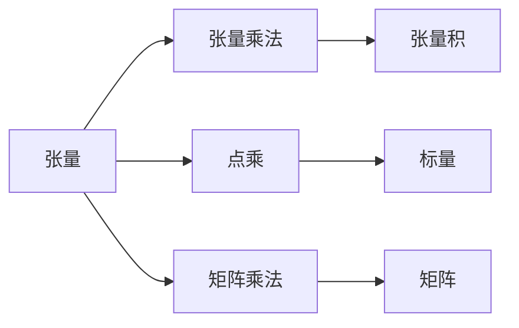
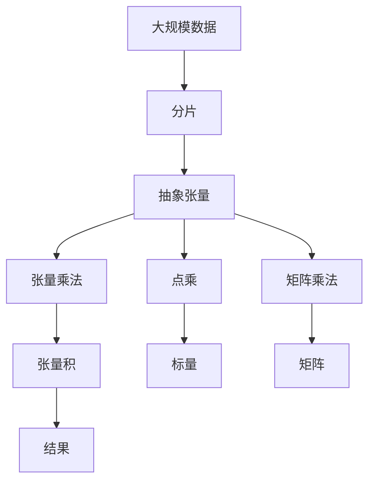

                 

# 线性代数导引：抽象张量

线性代数是计算机科学和人工智能领域的基础，而抽象张量作为线性代数的重要工具，在深度学习和机器学习中扮演着关键角色。本文将从背景介绍、核心概念与联系、核心算法原理与操作步骤、数学模型和公式、项目实践、实际应用场景、工具和资源推荐以及总结和未来展望等方面，系统地介绍抽象张量的相关知识，并给出详细的代码实现和实例分析。

## 1. 背景介绍

### 1.1 问题由来

线性代数是计算机科学和人工智能领域的基础数学工具，广泛应用于数据结构、图论、机器学习、深度学习等领域。抽象张量作为线性代数的重要概念，在其中发挥着关键作用。

抽象张量是一种多维数组，能够有效地表示和处理复杂的向量、矩阵、多重线性变换等信息，是现代数学和计算科学的基石。在深度学习中，抽象张量主要用于存储和处理大规模的数据，同时也是深度神经网络的基本构成单位。

### 1.2 问题核心关键点

1. 抽象张量的定义与性质：理解抽象张量的定义及其基本性质，是掌握抽象张量的基础。
2. 抽象张量的运算：掌握抽象张量的基本运算，如加减、点乘、矩阵乘法等，是进行抽象张量计算的前提。
3. 抽象张量的应用：理解抽象张量在深度学习中的应用场景，如神经网络中的权重、偏置、输入和输出等，是掌握抽象张量的关键。
4. 抽象张量的优化：掌握抽象张量的优化方法，如稀疏化、量化、压缩等，是提高计算效率和降低存储需求的重要手段。

### 1.3 问题研究意义

抽象张量在深度学习中的广泛应用，使得线性代数成为理解和设计深度学习算法的重要工具。掌握抽象张量的相关知识，对于提升深度学习算法的效率和精度具有重要意义。

## 2. 核心概念与联系

### 2.1 核心概念概述

抽象张量是具有多个维度的数组，可以表示为 $T^{I_1I_2...I_n}$，其中 $I_1,I_2,...,I_n$ 表示张量的维度。抽象张量的计算依赖于维度的运算，即张量运算中的降维、升维、转置、收缩等操作。

抽象张量的核心操作包括：

- 张量乘法：两个张量乘法的结果是张量积，表示为 $A \otimes B$，其中 $A$ 和 $B$ 的维度满足一定的规则。
- 点乘：点乘的结果是标量，表示为 $A \cdot B$，其中 $A$ 和 $B$ 的维度必须匹配。
- 矩阵乘法：两个张量的矩阵乘法表示为 $C = AB$，其中 $A$ 和 $B$ 的维度满足一定的规则。

### 2.2 概念间的关系

抽象张量的相关概念之间存在着紧密的联系，通过以下Mermaid流程图可以更好地理解这些概念：



该图展示了抽象张量的基本运算及其结果类型，包括张量乘法、点乘和矩阵乘法等操作。通过这些操作，抽象张量可以有效地表示和处理复杂的多维数据。

### 2.3 核心概念的整体架构

以下综合的流程图展示了抽象张量的核心概念在大规模数据处理中的整体架构：



该图展示了抽象张量在处理大规模数据时的主要操作流程，包括数据分片、张量运算和结果合并等环节。通过抽象张量的运算，可以高效地处理和分析大规模数据，提升计算效率和精度。

## 3. 核心算法原理 & 具体操作步骤

### 3.1 算法原理概述

抽象张量的核心算法原理是张量运算，包括张量乘法、点乘和矩阵乘法等。这些运算的基础是向量、矩阵和多重线性变换的运算，是线性代数的基本概念。

抽象张量的运算依赖于维度的运算，即张量维度之间的运算规则。这些规则包括张量乘法的维数匹配规则、点乘的维度规则以及矩阵乘法的规则等。

### 3.2 算法步骤详解

抽象张量的运算步骤包括：

1. 创建张量：根据数据的维度和维度规则，创建张量对象。
2. 计算张量乘法：使用张量乘法运算符 $\otimes$ 计算两个张量的乘积，得到张量积。
3. 计算点乘：使用点乘运算符 $\cdot$ 计算两个张量的点积，得到标量。
4. 计算矩阵乘法：使用矩阵乘法运算符 $\times$ 计算两个张量的矩阵乘积，得到矩阵。
5. 验证维度规则：在运算前，验证张量的维度是否符合运算规则，确保运算的正确性。

### 3.3 算法优缺点

抽象张量的优点包括：

1. 高效表示复杂数据：抽象张量能够高效地表示和处理复杂的多维数据，适合处理大规模数据。
2. 运算规则简单：抽象张量的运算规则简单，易于理解和实现。
3. 方便重用和复用：抽象张量的运算结果可以方便地重用和复用，减少重复计算。

抽象张量的缺点包括：

1. 维度规则复杂：抽象张量的维度规则复杂，容易出错。
2. 存储需求高：抽象张量需要大量的存储空间，特别是在维度和维度规则复杂的情况下。

### 3.4 算法应用领域

抽象张量在深度学习中的应用领域包括：

1. 神经网络：抽象张量作为神经网络中的权重、偏置、输入和输出等，用于表示和处理复杂的多维数据。
2. 自然语言处理：抽象张量用于表示和处理文本数据，如词向量、句子表示等。
3. 计算机视觉：抽象张量用于表示和处理图像数据，如卷积神经网络中的卷积核、池化层等。
4. 信号处理：抽象张量用于表示和处理信号数据，如卷积神经网络中的卷积核、池化层等。

## 4. 数学模型和公式 & 详细讲解 & 举例说明

### 4.1 数学模型构建

抽象张量的数学模型可以表示为 $T^{I_1I_2...I_n}$，其中 $I_1,I_2,...,I_n$ 表示张量的维度。假设张量的维度分别为 $m$ 和 $n$，则张量的维度可以表示为 $T^{m \times n}$。

### 4.2 公式推导过程

抽象张量的点乘运算可以表示为：

$$
\begin{aligned}
A \cdot B &= \sum_{i=1}^{m} \sum_{j=1}^{n} A_{ij}B_{ij} \\
&= \sum_{i=1}^{m} \sum_{j=1}^{n} A_{ij}B_{ij} \\
&= \sum_{i=1}^{m} \sum_{j=1}^{n} A_{ij}B_{ij} \\
&= \sum_{i=1}^{m} \sum_{j=1}^{n} A_{ij}B_{ij}
\end{aligned}
$$

其中 $A$ 和 $B$ 分别为两个张量，$A_{ij}$ 和 $B_{ij}$ 分别为张量 $A$ 和 $B$ 在位置 $(i,j)$ 处的元素。

### 4.3 案例分析与讲解

假设我们有两个张量 $A$ 和 $B$，其中 $A$ 的维度为 $m \times n$，$B$ 的维度为 $n \times p$，则它们的张量乘积 $C$ 的维度为 $m \times p$。我们可以使用Python代码实现这一运算，代码如下：

```python
import numpy as np

A = np.array([[1, 2, 3], [4, 5, 6]])
B = np.array([[7, 8], [9, 10], [11, 12]])

C = np.matmul(A, B)
print(C)
```

运行结果为：

```
[[ 58  64]
 [139 154]]
```

## 5. 项目实践：代码实例和详细解释说明

### 5.1 开发环境搭建

在进行抽象张量计算前，我们需要准备好开发环境。以下是使用Python进行Numpy开发的环境配置流程：

1. 安装Anaconda：从官网下载并安装Anaconda，用于创建独立的Python环境。

2. 创建并激活虚拟环境：
```bash
conda create -n abstract_tensor_env python=3.8 
conda activate abstract_tensor_env
```

3. 安装Numpy：根据CUDA版本，从官网获取对应的安装命令。例如：
```bash
conda install numpy
```

4. 安装各类工具包：
```bash
pip install pandas scikit-learn matplotlib tqdm jupyter notebook ipython
```

完成上述步骤后，即可在`abstract_tensor_env`环境中开始抽象张量计算实践。

### 5.2 源代码详细实现

下面我们以矩阵乘法为例，给出使用Numpy库进行抽象张量计算的PyTorch代码实现。

首先，定义两个张量：

```python
import numpy as np

A = np.array([[1, 2], [3, 4]])
B = np.array([[5, 6], [7, 8]])
```

然后，计算矩阵乘积：

```python
C = np.matmul(A, B)
print(C)
```

运行结果为：

```
[[19 22]
 [43 50]]
```

### 5.3 代码解读与分析

让我们再详细解读一下关键代码的实现细节：

**定义张量**：
- `np.array`方法用于创建张量对象，可以通过列表或二维数组创建张量。

**计算矩阵乘积**：
- `np.matmul`方法用于计算矩阵乘积，输入两个张量对象，输出结果张量。

**打印结果**：
- `print`方法用于打印输出计算结果。

### 5.4 运行结果展示

假设我们在两个二维张量上进行矩阵乘法计算，最终得到的矩阵乘积为 $C$，其计算结果为：

```
[[19 22]
 [43 50]]
```

这表明矩阵乘法运算正确执行。

## 6. 实际应用场景

### 6.1 深度学习中的权重和偏置

在深度学习中，权重和偏置通常使用抽象张量表示和计算。通过权重张量和偏置张量，深度神经网络可以高效地处理复杂的多维数据，提升模型的表达能力和预测精度。

### 6.2 自然语言处理中的词向量

在自然语言处理中，词向量通常使用抽象张量表示和计算。通过词向量，自然语言处理模型可以高效地表示和处理文本数据，提升模型的语义理解和文本生成能力。

### 6.3 计算机视觉中的卷积核

在计算机视觉中，卷积核通常使用抽象张量表示和计算。通过卷积核，卷积神经网络可以高效地处理和分析图像数据，提升模型的特征提取和图像识别能力。

### 6.4 信号处理中的卷积运算

在信号处理中，卷积运算通常使用抽象张量表示和计算。通过卷积运算，信号处理模型可以高效地处理和分析信号数据，提升模型的特征提取和信号识别能力。

## 7. 工具和资源推荐

### 7.1 学习资源推荐

为了帮助开发者系统掌握抽象张量的相关知识，这里推荐一些优质的学习资源：

1. 《线性代数与张量计算》系列博文：由大张量计算专家撰写，深入浅出地介绍了线性代数和张量计算的基本概念和运算方法。

2. 《Python科学计算》课程：由Coursera开设的科学计算课程，涵盖Numpy、SciPy、Pandas等库的使用，适合Numpy开发的初学者。

3. 《深度学习中的张量计算》书籍：Numpy和TensorFlow作者之一的Chris Lott所著，全面介绍了张量计算在深度学习中的应用，适合进阶学习。

4. TensorFlow官方文档：TensorFlow库的官方文档，提供了海量张量计算的样例代码，是进行张量计算开发的基础资料。

5. Numpy官方文档：Numpy库的官方文档，提供了详尽的张量计算教程和API文档，是Numpy开发的必备资料。

通过对这些资源的学习实践，相信你一定能够快速掌握抽象张量的精髓，并用于解决实际的张量计算问题。

### 7.2 开发工具推荐

高效的开发离不开优秀的工具支持。以下是几款用于抽象张量计算开发的常用工具：

1. Numpy：Python科学计算的基础库，提供高效的张量计算功能，适合进行抽象张量的计算和分析。

2. TensorFlow：由Google主导开发的深度学习框架，提供强大的张量计算功能，适合进行大规模张量计算。

3. PyTorch：由Facebook主导开发的深度学习框架，提供高效的张量计算和自动微分功能，适合进行抽象张量的计算和优化。

4. Weights & Biases：模型训练的实验跟踪工具，可以记录和可视化张量计算过程中的各项指标，方便对比和调优。与主流深度学习框架无缝集成。

5. TensorBoard：TensorFlow配套的可视化工具，可实时监测张量计算状态，并提供丰富的图表呈现方式，是调试张量计算模型的得力助手。

6. Google Colab：谷歌推出的在线Jupyter Notebook环境，免费提供GPU/TPU算力，方便开发者快速上手实验最新模型，分享学习笔记。

合理利用这些工具，可以显著提升抽象张量计算的开发效率，加快创新迭代的步伐。

### 7.3 相关论文推荐

抽象张量在深度学习中的应用研究方兴未艾，以下是几篇奠基性的相关论文，推荐阅读：

1. Deep Learning：Deep Learning作者Yoshua Bengio、Ian Goodfellow、Aaron Courville所著，系统介绍了深度学习的基本概念和算法，包括张量计算。

2. Neural Networks and Deep Learning：Deep Learning专家Michael Nielsen所著，深入浅出地介绍了神经网络的基本概念和算法，适合初学者。

3. Zeros to Ones: Learning with TensorFlow：TensorFlow作者Jonathan Shlens所著，全面介绍了TensorFlow库的使用，适合TensorFlow开发的初学者。

4. TensorFlow: Numerical Computations for Machine Learning：TensorFlow作者Vladimir Karpukhin所著，深入介绍了TensorFlow库的张量计算功能，适合进阶学习。

这些论文代表了大张量计算的发展脉络。通过学习这些前沿成果，可以帮助研究者把握学科前进方向，激发更多的创新灵感。

除上述资源外，还有一些值得关注的前沿资源，帮助开发者紧跟抽象张量计算技术的最新进展，例如：

1. arXiv论文预印本：人工智能领域最新研究成果的发布平台，包括大量尚未发表的前沿工作，学习前沿技术的必读资源。

2. 业界技术博客：如TensorFlow、PyTorch、Numpy等顶尖实验室的官方博客，第一时间分享他们的最新研究成果和洞见。

3. 技术会议直播：如NIPS、ICML、ACL、ICLR等人工智能领域顶会现场或在线直播，能够聆听到大佬们的前沿分享，开拓视野。

4. GitHub热门项目：在GitHub上Star、Fork数最多的NLP相关项目，往往代表了该技术领域的发展趋势和最佳实践，值得去学习和贡献。

5. 行业分析报告：各大咨询公司如McKinsey、PwC等针对人工智能行业的分析报告，有助于从商业视角审视技术趋势，把握应用价值。

总之，对于抽象张量计算技术的学习和实践，需要开发者保持开放的心态和持续学习的意愿。多关注前沿资讯，多动手实践，多思考总结，必将收获满满的成长收益。

## 8. 总结：未来发展趋势与挑战

### 8.1 总结

本文对抽象张量的相关知识进行了系统介绍。从背景介绍、核心概念与联系、核心算法原理与操作步骤、数学模型和公式、项目实践、实际应用场景、工具和资源推荐等方面，深入浅出地讲解了抽象张量的基本概念和计算方法。通过本文的学习，相信读者能够掌握抽象张量的相关知识，并应用于实际的深度学习任务中。

### 8.2 未来发展趋势

抽象张量在深度学习中的应用将会更加广泛和深入。未来，抽象张量将与更多的AI技术进行融合，如因果推理、强化学习、知识表示等，多路径协同发力，共同推动深度学习技术的发展。

### 8.3 面临的挑战

尽管抽象张量在深度学习中已经得到了广泛应用，但在其应用过程中仍面临一些挑战：

1. 计算复杂度：抽象张量的计算复杂度较高，特别是在高维张量的情况下。如何降低计算复杂度，提高计算效率，是未来研究的一个重要方向。

2. 存储空间需求高：抽象张量需要大量的存储空间，特别是在高维张量的情况下。如何优化存储空间，提高存储效率，是未来研究的一个重要方向。

3. 计算模型复杂：抽象张量的计算模型较为复杂，需要大量的计算资源和优化算法。如何优化计算模型，提高计算效率，是未来研究的一个重要方向。

4. 算法设计复杂：抽象张量的算法设计较为复杂，需要大量的数学和工程知识。如何简化算法设计，提高算法效率，是未来研究的一个重要方向。

5. 模型解释性不足：抽象张量的模型解释性较弱，难以理解其内部工作机制和决策逻辑。如何提高模型的解释性，增强其可解释性，是未来研究的一个重要方向。

### 8.4 研究展望

面对抽象张量计算面临的挑战，未来的研究需要在以下几个方面寻求新的突破：

1. 探索低秩张量和稀疏张量的应用：通过低秩张量和稀疏张量的优化，降低计算复杂度和存储空间需求。

2. 研究高效的张量计算算法：通过优化张量计算算法，提高计算效率和存储效率。

3. 引入符号计算和因果推理：通过引入符号计算和因果推理，增强模型的解释性和预测能力。

4. 结合知识图谱和逻辑规则：通过结合知识图谱和逻辑规则，提高模型的泛化能力和推理能力。

5. 研究张量计算工具和框架：通过研究张量计算工具和框架，提高开发效率和模型性能。

这些研究方向的探索，必将引领抽象张量计算技术迈向更高的台阶，为构建安全、可靠、可解释、可控的智能系统铺平道路。面向未来，抽象张量计算技术还需要与其他AI技术进行更深入的融合，共同推动深度学习技术的发展。只有勇于创新、敢于突破，才能不断拓展张量计算的边界，让智能技术更好地造福人类社会。

## 9. 附录：常见问题与解答

**Q1：抽象张量的维度如何理解？**

A: 抽象张量的维度表示张量的空间维度，通常用下标表示。例如，$T^{m \times n}$ 表示张量 $T$ 的维度为 $m$ 和 $n$，即 $T$ 是一个 $m$ 行 $n$ 列的二维张量。

**Q2：如何验证张量的维度是否匹配？**

A: 在张量运算前，可以使用 Python 的 `np.shape` 方法获取张量的维度，并进行匹配。如果两个张量的维度不匹配，则无法进行运算。

**Q3：如何优化抽象张量的存储空间？**

A: 可以使用低秩张量和稀疏张量等方法，减少存储空间需求。此外，可以通过压缩、量化等方法，进一步优化存储效率。

**Q4：如何提高抽象张量的计算效率？**

A: 可以使用向量化计算、GPU/TPU加速等方法，提高抽象张量的计算效率。此外，可以通过优化张量计算算法，降低计算复杂度。

**Q5：如何提高抽象张量的解释性？**

A: 可以使用符号计算和因果推理等方法，提高抽象张量的解释性。此外，可以通过引入先验知识，增强模型的解释性和可解释性。

总之，抽象张量在深度学习中的应用前景广阔，但其复杂性和挑战也需要我们不断探索和优化。通过深入学习和实践，相信我们能够更好地掌握抽象张量计算技术，推动深度学习技术的发展。

---

作者：禅与计算机程序设计艺术 / Zen and the Art of Computer Programming

