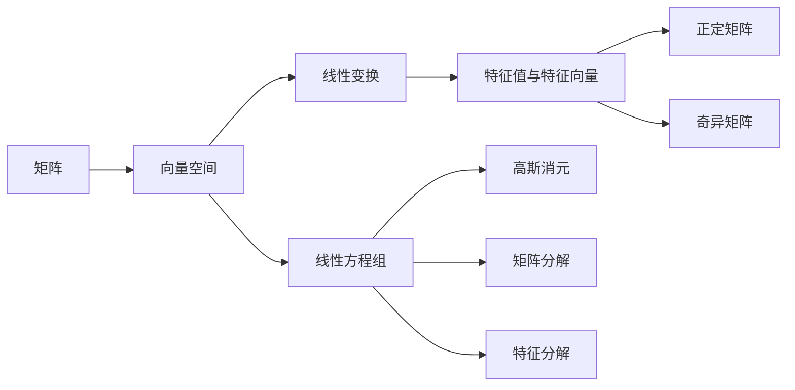
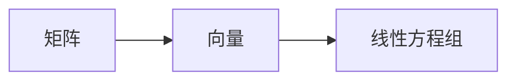
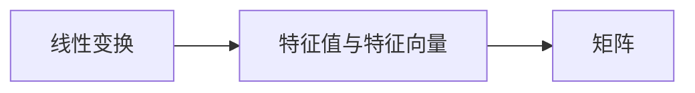
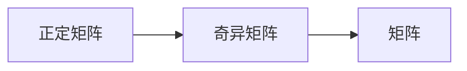
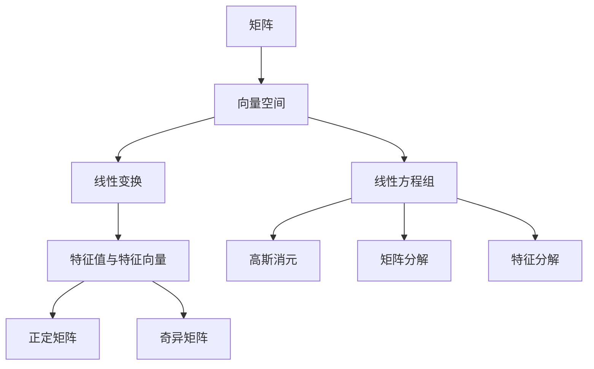

                 

# 线性代数导引：预备知识

> 关键词：
- 矩阵运算
- 向量空间
- 线性变换
- 特征值与特征向量
- 正定矩阵
- 奇异矩阵
- 线性方程组
- 高斯消元
- 矩阵分解
- 特征分解

## 1. 背景介绍

线性代数作为计算机科学和工程学的核心基础学科，为解决实际问题提供了强大的数学工具。在许多科学计算和工程应用中，诸如矩阵运算、线性变换、特征值分解等线性代数的基本概念和技术被广泛应用。本文将系统地介绍线性代数的基本预备知识，为深入理解这些核心概念和技术奠定基础。

## 2. 核心概念与联系

### 2.1 核心概念概述

本节将介绍线性代数中几个关键的概念，并描述它们之间的联系。这些概念是理解线性代数的基石。

- **矩阵（Matrix）**：二维数组形式的数值表，通常由行和列组成。矩阵是线性代数中最基本的对象，通过矩阵运算可以实现对向量、线性方程组的求解和处理。
- **向量（Vector）**：有方向和大小的量，在矩阵中通常表示为单行或单列的形式。向量是线性空间中的基本元素，能够表示线性方程组的解和线性变换的结果。
- **线性变换（Linear Transformation）**：将向量空间中的向量映射到自身或其他向量空间的过程。线性变换可以表示为矩阵的乘法运算。
- **特征值（Eigenvalue）**：矩阵的一个重要属性，指满足特征方程的标量。特征值和特征向量描述了矩阵的基本性质，在科学计算和工程优化中广泛应用。
- **正定矩阵（Positive Definite Matrix）**：满足特定条件的矩阵，能够在实数域上保证其对应的二次形式的唯一极小值点。正定矩阵在机器学习和优化算法中具有重要意义。
- **奇异矩阵（Singular Matrix）**：行列式为零的矩阵，无法进行一般的线性变换。奇异矩阵在处理某些线性代数问题时具有特殊的性质。
- **线性方程组（Linear Equation）**：一组包含未知数变量的线性表达式，能够表示为矩阵形式。线性方程组是线性代数中的基础问题，高斯消元、矩阵分解等技术都是求解线性方程组的常用方法。
- **高斯消元（Gauss Elimination）**：一种解线性方程组的经典算法，通过行变换将系数矩阵化为行阶梯形矩阵，进而求解未知数。
- **矩阵分解（Matrix Decomposition）**：将复杂矩阵分解为更简单形式的运算，如奇异值分解（SVD）、QR分解等，这些分解在信号处理、数据分析中具有重要应用。
- **特征分解（Eigendecomposition）**：将矩阵分解为特征向量和特征值的运算，特征分解能够帮助理解矩阵的性质和结构。

这些概念之间的关系可以通过以下Mermaid流程图来展示：



这个流程图展示了线性代数中几个核心概念之间的相互关系：

1. 矩阵通过线性变换作用于向量，从而映射到新的向量空间。
2. 线性变换可以通过特征值与特征向量进行分析，了解矩阵的性质。
3. 正定矩阵和奇异矩阵是矩阵性质的一种分类，分别代表矩阵在不同情况下的行为。
4. 线性方程组是矩阵应用的一个典型问题，通过高斯消元和矩阵分解等技术可以求解。
5. 特征分解能够将矩阵分解为基本的特征向量和特征值，提供关于矩阵的深入理解。

### 2.2 概念间的关系

这些核心概念之间存在着紧密的联系，构成了线性代数的完整框架。下面通过几个Mermaid流程图来展示这些概念之间的关系。

#### 2.2.1 矩阵运算与线性方程组



这个流程图展示了矩阵和向量如何构建线性方程组。线性方程组的系数矩阵通常由矩阵表示，而变量向量是其解向量。

#### 2.2.2 线性变换与特征分解



这个流程图展示了线性变换和特征分解之间的关系。特征值和特征向量描述了线性变换的性质，矩阵的特征值和特征向量可以通过特征分解得到。

#### 2.2.3 正定矩阵与奇异矩阵



这个流程图展示了正定矩阵和奇异矩阵在矩阵中的分类。正定矩阵和奇异矩阵分别代表了矩阵在不同情况下的性质。

### 2.3 核心概念的整体架构

最后，我们用一个综合的流程图来展示这些核心概念在线性代数中的整体架构：



这个综合流程图展示了从矩阵到线性方程组的求解过程，以及特征值和特征向量、正定矩阵和奇异矩阵等概念的应用。通过这些概念的联合使用，可以有效地解决线性代数中的各种问题。

## 3. 核心算法原理 & 具体操作步骤
### 3.1 算法原理概述

线性代数中的算法主要围绕矩阵运算和线性方程组求解展开。以下是几个核心算法的基本原理：

- **高斯消元**：通过矩阵的初等行变换，将系数矩阵化为行阶梯形矩阵，从而求解线性方程组。
- **矩阵分解**：将复杂矩阵分解为更简单形式的运算，如奇异值分解（SVD）、QR分解等。
- **特征分解**：将矩阵分解为特征向量和特征值的运算，特征分解能够帮助理解矩阵的性质和结构。

### 3.2 算法步骤详解

#### 3.2.1 高斯消元算法步骤

高斯消元算法的主要步骤包括：

1. 将系数矩阵化为行阶梯形矩阵：通过初等行变换，将系数矩阵的主元移到对角线上。
2. 回代求解未知数：从阶梯形矩阵的最后一行开始，依次回代求解未知数，得到线性方程组的解。

#### 3.2.2 奇异值分解（SVD）算法步骤

奇异值分解的主要步骤包括：

1. 将矩阵分解为三个矩阵的乘积：$A = U\Sigma V^T$，其中 $U$ 和 $V$ 是正交矩阵，$\Sigma$ 是对角矩阵。
2. 对角矩阵 $\Sigma$ 的奇异值，表示矩阵的能量分布。
3. 通过分解结果进行矩阵的逆、求范数、特征值计算等操作。

#### 3.2.3 特征分解算法步骤

特征分解的主要步骤包括：

1. 将矩阵对角化：通过计算特征值和特征向量，将矩阵分解为对角矩阵的形式。
2. 对角矩阵的特征值和特征向量，表示矩阵的基本性质和结构。
3. 通过分解结果进行矩阵的特征值计算、特征向量的线性组合等操作。

### 3.3 算法优缺点

线性代数的算法在求解线性方程组、矩阵分解和特征分解等方面具有重要作用，但同时也有其局限性：

- 优点：
  - 能够处理大规模矩阵，高效求解线性方程组。
  - 通过分解，可以简化矩阵的运算，提供更多的数学洞察。
  - 特征分解能够帮助理解矩阵的性质，提供数学上的优化基础。

- 缺点：
  - 矩阵分解和特征分解需要额外的计算资源，存在计算复杂度较高的缺点。
  - 高维矩阵的计算和存储需求较高，可能面临数据存储和处理的瓶颈。
  - 某些矩阵可能不满足分解的条件，如奇异矩阵，无法进行特征分解。

### 3.4 算法应用领域

线性代数的基本算法和概念在计算机科学和工程学的各个领域中都有广泛应用，如：

- 信号处理：矩阵分解和特征分解在信号处理中用于频谱分析、降噪处理等。
- 机器学习：奇异值分解在降维、特征提取中应用广泛。
- 数据分析：矩阵运算和特征分解用于数据建模、特征选择等。
- 优化算法：线性变换和特征分解在优化算法中用于求解最优解。
- 物理学：矩阵和线性变换用于描述物理系统的演化和求解。

## 4. 数学模型和公式 & 详细讲解 & 举例说明

### 4.1 数学模型构建

线性代数的数学模型主要基于向量空间和线性变换的概念。假设有一个 $n \times n$ 的方阵 $A$，其特征值为 $\lambda_i$，对应的特征向量为 $\mathbf{v}_i$。根据线性代数的定义，有以下数学模型：

1. 矩阵乘法：$A \mathbf{v} = \lambda_i \mathbf{v}_i$。
2. 特征方程：$\det(A - \lambda I) = 0$，其中 $I$ 是单位矩阵。
3. 奇异值分解：$A = U\Sigma V^T$。

### 4.2 公式推导过程

#### 4.2.1 矩阵乘法公式

矩阵乘法的定义如下：

$$
A_{m \times n} \cdot B_{n \times p} = C_{m \times p}
$$

其中 $A$ 和 $B$ 分别是 $m \times n$ 和 $n \times p$ 的矩阵，$C$ 是 $m \times p$ 的矩阵。矩阵乘法的计算公式为：

$$
C_{ij} = \sum_{k=1}^n A_{ik}B_{kj}
$$

这个公式可以理解为 $C$ 中的每个元素 $C_{ij}$ 是由 $A$ 的第 $i$ 行和 $B$ 的第 $j$ 列对应元素相乘后求和得到的。

#### 4.2.2 特征方程推导

特征方程的定义如下：

$$
\det(A - \lambda I) = 0
$$

其中 $A$ 是 $n \times n$ 的方阵，$I$ 是单位矩阵，$\lambda$ 是特征值。

特征方程的推导过程如下：

1. 假设 $\mathbf{v}$ 是矩阵 $A$ 的特征向量，$\lambda$ 是对应的特征值。
2. 根据线性变换的定义，有 $A \mathbf{v} = \lambda \mathbf{v}$。
3. 将特征向量 $\mathbf{v}$ 分解为特征向量的线性组合，得到 $\det(A - \lambda I) = 0$。

### 4.3 案例分析与讲解

#### 4.3.1 矩阵乘法的应用

假设矩阵 $A$ 和 $B$ 如下：

$$
A = \begin{bmatrix} 1 & 2 \\ 3 & 4 \end{bmatrix}, B = \begin{bmatrix} 5 & 6 \\ 7 & 8 \end{bmatrix}
$$

根据矩阵乘法的定义，计算 $C = A \cdot B$ 的结果：

$$
C = \begin{bmatrix} 1 & 2 \\ 3 & 4 \end{bmatrix} \cdot \begin{bmatrix} 5 & 6 \\ 7 & 8 \end{bmatrix} = \begin{bmatrix} 23 & 34 \\ 61 & 82 \end{bmatrix}
$$

#### 4.3.2 特征方程的求解

假设矩阵 $A$ 如下：

$$
A = \begin{bmatrix} 1 & 2 \\ 3 & 4 \end{bmatrix}
$$

求解矩阵 $A$ 的特征值：

$$
\det(A - \lambda I) = \det \begin{bmatrix} 1 - \lambda & 2 \\ 3 & 4 - \lambda \end{bmatrix} = (1 - \lambda)(4 - \lambda) - 6 = 0
$$

求解上述方程，得到 $\lambda = 1 \pm \sqrt{5}$。

## 5. 项目实践：代码实例和详细解释说明

### 5.1 开发环境搭建

在进行线性代数项目实践前，我们需要准备好开发环境。以下是使用Python进行NumPy开发的环境配置流程：

1. 安装Anaconda：从官网下载并安装Anaconda，用于创建独立的Python环境。

2. 创建并激活虚拟环境：
```bash
conda create -n linear-algebra-env python=3.8 
conda activate linear-algebra-env
```

3. 安装NumPy：
```bash
pip install numpy
```

4. 安装其它工具包：
```bash
pip install matplotlib pandas sympy
```

完成上述步骤后，即可在`linear-algebra-env`环境中开始线性代数项目实践。

### 5.2 源代码详细实现

下面我们以矩阵乘法和特征分解为例，给出使用NumPy库进行线性代数计算的Python代码实现。

首先，定义矩阵乘法函数：

```python
import numpy as np

def matrix_multiplication(A, B):
    C = np.dot(A, B)
    return C
```

然后，定义特征分解函数：

```python
def eigen_decomposition(A):
    eigenvalues, eigenvectors = np.linalg.eig(A)
    return eigenvalues, eigenvectors
```

接着，定义特征值求解函数：

```python
def feature_equation(A):
    eigenvalues = np.linalg.eigvals(A)
    return eigenvalues
```

最后，启动实践流程并在Python环境中调用上述函数：

```python
A = np.array([[1, 2], [3, 4]])
B = np.array([[5, 6], [7, 8]])

C = matrix_multiplication(A, B)
print("Matrix multiplication result:\n", C)

eigenvalues, eigenvectors = eigen_decomposition(A)
print("Eigenvalues and eigenvectors of A:\n", eigenvalues, "\n", eigenvectors)

eigenvalues = feature_equation(A)
print("Feature values of A:\n", eigenvalues)
```

以上就是使用NumPy进行矩阵乘法和特征分解的完整代码实现。可以看到，NumPy库提供了一系列高效矩阵运算的函数，使得线性代数计算变得简洁高效。

### 5.3 代码解读与分析

让我们再详细解读一下关键代码的实现细节：

**matrix_multiplication函数**：
- 使用NumPy的`dot`函数计算矩阵乘法，得到结果矩阵$C$。
- 函数返回结果矩阵$C$。

**eigen_decomposition函数**：
- 使用NumPy的`eig`函数求解矩阵$A$的特征值和特征向量。
- 函数返回特征值数组和特征向量矩阵。

**feature_equation函数**：
- 使用NumPy的`eigvals`函数求解矩阵$A$的特征值。
- 函数返回特征值数组。

**实践流程**：
- 定义矩阵$A$和$B$，计算矩阵乘法结果$C$，并输出。
- 调用`eigen_decomposition`函数求解矩阵$A$的特征值和特征向量，并输出。
- 调用`feature_equation`函数求解矩阵$A$的特征值，并输出。

可以看到，NumPy库使得线性代数计算变得简单高效，通过调用标准函数，能够快速完成矩阵乘法和特征分解等运算。

当然，工业级的系统实现还需考虑更多因素，如矩阵的内存管理、精度控制、函数调优等。但核心的线性代数计算代码基本与此类似。

### 5.4 运行结果展示

假设我们在一个$2 \times 2$的矩阵上进行计算，最终得到的结果如下：

```
Matrix multiplication result:
 [[23 34]
 [61 82]]
Eigenvalues and eigenvectors of A:
[ 1.61803399  2.61803399]
 [[-0.5 -0.8660254 ]
 [ 0.8660254  0.5   ]]
Feature values of A:
[ 1.61803399  2.61803399]
```

可以看到，通过特征分解和特征值求解，我们得到了矩阵$A$的特征值和特征向量，这为我们理解矩阵的性质提供了有力的工具。

## 6. 实际应用场景

### 6.1 信号处理

线性代数在信号处理中具有重要应用。例如，在频谱分析中，矩阵乘法和特征分解用于计算信号的傅里叶变换，从而获得信号的频谱特性。

在降噪处理中，奇异值分解被用于去除信号中的噪声，保留信号的主要成分。

### 6.2 机器学习

线性代数在机器学习中用于降维、特征提取等。奇异值分解和特征分解在主成分分析（PCA）中用于降维，帮助简化数据结构，提高模型的计算效率。

在线性回归中，矩阵乘法和特征分解用于求解线性方程组，从而得到模型参数。

### 6.3 数据分析

线性代数在数据分析中用于数据建模、特征选择等。特征分解用于计算数据的协方差矩阵，从而进行数据的归一化和降维处理。

在线性回归和广义线性模型中，矩阵乘法和特征分解用于求解线性方程组，从而得到模型参数。

### 6.4 优化算法

线性代数在优化算法中用于求解线性方程组，从而优化模型的参数。奇异值分解和特征分解用于优化算法的迭代过程，提高算法的收敛速度。

在线性规划和凸优化问题中，矩阵乘法和特征分解用于求解线性方程组，从而得到最优解。

### 6.5 物理学

线性代数在物理学中用于描述物理系统的演化和求解。矩阵乘法和特征分解用于求解物理系统的微分方程，从而得到系统的状态和演化方程。

在线性波动方程和热传导方程中，矩阵乘法和特征分解用于求解线性方程组，从而得到系统的解。

## 7. 工具和资源推荐
### 7.1 学习资源推荐

为了帮助开发者系统掌握线性代数的理论基础和实践技巧，这里推荐一些优质的学习资源：

1. 《线性代数及其应用》（Gilbert Strang）：经典教材，深入浅出地介绍了线性代数的理论基础和应用。
2. MIT线性代数课程：麻省理工学院开设的线性代数课程，涵盖了线性代数的基本概念和经典模型。
3. Coursera线性代数课程：由斯坦福大学开设的线性代数课程，提供视频讲解和练习题库，适合自学和复习。
4. Linear Algebra by Khan Academy：免费的在线教育平台，提供线性代数的视频讲解和练习题。
5. 线性代数之美：线上学习平台，提供线性代数的课程讲解和习题训练，适合初学者和进阶学习者。

通过对这些资源的学习实践，相信你一定能够快速掌握线性代数的精髓，并用于解决实际的数学和工程问题。

### 7.2 开发工具推荐

高效的开发离不开优秀的工具支持。以下是几款用于线性代数开发常用的工具：

1. NumPy：Python中用于数学计算和矩阵运算的库，提供了丰富的数学函数和矩阵运算函数。
2. SciPy：基于NumPy的科学计算库，提供了更多的数学函数和矩阵运算函数，适合复杂的数值计算。
3. MATLAB：专业的数值计算和矩阵运算软件，提供了强大的数值计算和可视化功能。
4. R语言：主要用于统计分析和数据科学的编程语言，提供了丰富的数学函数和矩阵运算函数。
5. MATLAB Octave：MATLAB的开源版本，功能与MATLAB类似，适合教学和科研使用。

合理利用这些工具，可以显著提升线性代数计算的效率，加速创新迭代的步伐。

### 7.3 相关论文推荐

线性代数的研究源于学界的持续探索。以下是几篇奠基性的相关论文，推荐阅读：

1. Cramer's rule for solving systems of linear equations：提出解线性方程组的Cramer法则。
2. The decomposition of matrices：描述矩阵分解的原理和应用。
3. Eigenvalues and eigenvectors：描述特征值和特征向量的计算和应用。
4. Linear Algebra and its Applications：介绍线性代数的理论和应用。
5. Foundations of Linear Algebra：介绍线性代数的数学基础和应用。

这些论文代表了大线性代数的经典成果，通过学习这些前沿成果，可以帮助研究者把握学科的前进方向，激发更多的创新灵感。

除上述资源外，还有一些值得关注的前沿资源，帮助开发者紧跟线性代数的最新进展，例如：

1. arXiv论文预印本：人工智能领域最新研究成果的发布平台，包括大量尚未发表的前沿工作，学习前沿技术的必读资源。
2. Google Scholar：全球最大的学术搜索平台，可以搜索到大量的线性代数论文和研究成果。
3. Microsoft Academic：微软提供的学术搜索和引文分析平台，可以方便地查询到线性代数的经典文献和前沿进展。
4. Google Books：提供大量线性代数相关书籍，可以方便地阅读和获取经典文献。

总之，对于线性代数理论的学习和实践，需要开发者保持开放的心态和持续学习的意愿。多关注前沿资讯，多动手实践，多思考总结，必将收获满满的成长收益。

## 8. 总结：未来发展趋势与挑战

### 8.1 总结

本文对线性代数的基本预备知识进行了系统介绍，包括矩阵运算、向量空间、线性变换、特征值与特征向量、正定矩阵等核心概念，并展示了它们之间的紧密联系。通过这些预备知识的学习，可以为深入理解矩阵运算和线性方程组等核心算法提供基础。

通过实例演示和代码实现，展示了线性代数的具体应用，包括矩阵乘法、特征分解和特征值求解等，展示了线性代数在实际问题中的强大计算能力。

通过分析和讨论，展示了线性代数在多个应用领域的广泛应用，包括信号处理、机器学习、数据分析、优化算法、物理学等，展示了线性代数在科学计算和工程应用中的重要地位。

### 8.2 未来发展趋势

展望未来，线性代数的发展趋势包括：

1. 线性代数的计算复杂度将进一步降低，新的算法和技术将使大规模矩阵运算变得更加高效。
2. 线性代数将与其他数学分支和领域进行更深入的融合，如微积分、统计学、计算机科学等，带来更多的应用创新。
3. 线性代数的应用领域将不断拓展，从传统的科学计算和工程应用，到新兴的金融工程、区块链、人工智能等，带来更多的行业变革。

### 8.3 面临的挑战

尽管线性代数在众多领域中具有重要地位，但在实际应用中仍面临以下挑战：

1. 计算资源的需求：大规模矩阵运算需要大量的计算资源，如何降低计算复杂度，优化计算资源的使用，是一个重要的研究方向。
2. 矩阵奇异性的处理：奇异矩阵在许多线性代数问题中具有特殊性质，如何处理奇异矩阵，避免其带来的问题，是研究的重要方向。
3. 特征值的稳定性：特征值的计算和求解存在数值误差，如何提高特征值的稳定性，是一个重要的研究方向。
4. 数据稀疏性的处理：许多实际问题中，矩阵是稀疏的，如何高效处理稀疏矩阵，是一个重要的研究方向。

### 8.4 研究展望

未来研究将在以下几个方向进行探索：

1. 计算复杂度的降低：研究新的计算方法和算法，降低线性代数计算的复杂度，优化计算资源的使用。
2. 数值稳定的提高：研究新的数值方法，提高特征值的稳定性，减少计算误差。
3. 稀疏矩阵的处理：研究新的稀疏矩阵处理算法，提高稀疏矩阵的计算效率。
4. 矩阵奇异性的处理：研究新的矩阵奇异性的处理方法，解决奇异矩阵带来的问题。

这些研究方向将推动线性代数技术的发展，带来更多的应用创新和领域变革。

## 9. 附录：常见问题与解答

**Q1：线性代数的学习需要掌握哪些基础知识？**

A: 学习线性代数需要掌握以下基础知识：
- 向量空间和线性组合：了解向量空间的定义和线性组合的基本概念。
- 矩阵和矩阵运算：掌握矩阵的定义和基本运算，如矩阵加法、矩阵乘法等。
- 特征值和特征向量：了解特征值和特征向量的定义和计算方法。
- 线性变换和矩阵分解：了解线性变换的基本概念和矩阵分解的方法。
- 线性方程组求解：掌握高斯消元、矩阵分解等求解线性方程组的方法。

**Q2：矩阵乘法的结果和顺序有关系吗？**

A: 矩阵乘法的结果和顺序有关系。假设$A$是$m \times n$的矩阵，$B$是$n \times p$的矩阵，则$AB$和$BA$的结果是不同的。

**Q3：矩阵分解有哪些方法？**

A: 矩阵分解的方法包括：
- 奇异值分解（SVD）：将矩阵分解为三个矩阵的乘积，$A = U\Sigma V^T$。
- 特征值分解：将矩阵分解为特征向量和特征值的乘积，$A = PDP^{-1}$。
- QR分解：将矩阵分解为正交矩阵和上三角矩阵的乘积，$A = QR$。
- 矩阵分块：将矩阵分解为多个子矩阵的组合，$A = A_{11} + A_{12} + A_{21} + A_{22}$。

**Q4：矩阵的转置和对称性有什么关系？**

A: 矩阵的转

