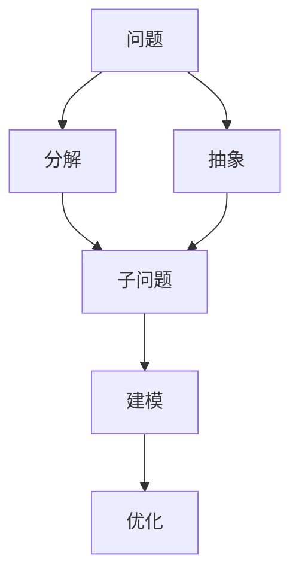

                 

# 结构化思维：从混沌到清晰

## 1. 背景介绍

### 1.1 问题由来
随着计算机科学的快速发展，软件开发、系统架构、人工智能等领域的技术体系变得越来越庞大和复杂。从早期的简单算法、单片程序，到如今复杂分布式系统、深度学习模型，技术人员常常面对海量数据和抽象概念，难以清晰把握整体的系统结构和发展脉络。特别是对于大数据、高并发、分布式、人工智能等新兴领域，技术实现日趋复杂，决策过程更加繁琐，对技术人员的结构化思维能力提出了更高的要求。

结构化思维能力是系统化、科学化解决问题的重要方法，能够帮助技术人员在面对复杂问题时，通过拆解、抽象、建模等方式，将问题分层化、模块化，逐步找到有效的解决方案。在人工智能和软件工程领域，结构化思维不仅能够有效应对技术挑战，还能提升项目的成功率和开发效率。本文将从结构化思维的基本概念入手，探讨如何通过结构化思维方法，将混沌的系统复杂度化简，达到清晰的理解和高效的处理。

### 1.2 问题核心关键点
结构化思维是一种系统性、结构化的思维方法，其核心在于通过分解、归类、归纳、抽象等步骤，将复杂问题拆解为可管理的子问题，并在每个子问题上进行深入研究和优化。结构化思维的关键步骤包括：

1. **问题拆解**：将复杂问题拆解为若干子问题。
2. **子问题归类**：将子问题按照特定的维度进行归类和分组。
3. **结构建模**：构建子问题间的关联模型，形成系统的整体架构。
4. **优化决策**：在模型指导下进行优化决策，并逐步调整。

通过结构化思维，技术人员能够系统化地理解和处理复杂系统，从而提升项目实施和问题解决效率。

## 2. 核心概念与联系

### 2.1 核心概念概述
结构化思维的核心概念包括分解、抽象、建模、优化等，这些概念之间相互联系、相辅相成，共同构成了一套系统的思维方法。

- **分解(Decomposition)**：将复杂问题拆解为若干简单的子问题，便于逐个处理。
- **抽象(Abstraction)**：对子问题的本质特征进行提炼，形成更通用的模型或规则。
- **建模(Modeling)**：根据抽象后的特征，构建子问题间的关联模型，形成系统的整体架构。
- **优化(Optimization)**：在模型指导下，进行决策优化，并不断调整和改进。

### 2.2 概念间的关系

结构化思维各概念之间的关系可以通过以下Mermaid流程图来展示：



这个流程图展示了结构化思维的基本步骤：从问题出发，先进行分解，然后对子问题进行抽象，构建关联模型，最后根据模型进行优化决策。

## 3. 核心算法原理 & 具体操作步骤

### 3.1 算法原理概述
结构化思维的基本原理是通过分解和抽象，将复杂问题拆解为可管理的子问题，并在每个子问题上建立关联模型，通过优化模型来解决原始问题。这种思路在软件开发、系统架构、人工智能等领域广泛应用，尤其是在处理复杂系统时，能够有效提升问题解决的效率和系统设计的可维护性。

### 3.2 算法步骤详解
结构化思维的算法步骤一般包括以下几个关键步骤：

**Step 1: 问题分解**
- 确定问题边界，将问题拆解为若干子问题。
- 识别关键子问题，形成问题树或问题图。

**Step 2: 子问题抽象**
- 对每个子问题进行抽象，提炼其核心特征。
- 抽象成通用的模型或规则，形成子问题集。

**Step 3: 结构建模**
- 构建子问题间的关联模型，形成系统的整体架构。
- 识别子问题间的依赖关系，优化模型连接。

**Step 4: 优化决策**
- 根据模型进行优化决策，选择合适的解决方案。
- 迭代优化模型，逐步提升系统性能。

**Step 5: 部署实施**
- 将优化后的模型应用于实际系统。
- 持续监测和调整，确保系统稳定运行。

### 3.3 算法优缺点
结构化思维具有以下优点：
1. 系统性：能够将复杂问题拆解为可管理的部分，便于逐个处理。
2. 可扩展性：模块化的子问题便于独立开发和优化。
3. 易于理解：通过抽象和建模，形成清晰的系统架构，便于团队协作。
4. 高效决策：基于模型的优化决策，能够快速定位问题和解决方案。

同时，结构化思维也存在一些缺点：
1. 流程复杂：结构化思维的步骤较多，需要系统的规划和执行。
2. 难以灵活应对：固定的分解和抽象过程，可能难以灵活应对多变的需求。
3. 资源消耗：分解和建模需要较多时间和资源，对于小型项目可能不经济。

### 3.4 算法应用领域
结构化思维广泛应用于软件开发、系统架构、人工智能等技术领域。以下是几个典型应用场景：

1. **软件开发**
   - **需求分析**：将系统需求拆解为功能模块，便于后续开发。
   - **架构设计**：通过抽象和建模，形成系统的整体架构，便于团队协作和系统扩展。
   - **问题排查**：通过问题树或问题图，逐步定位问题，进行优化。

2. **系统架构**
   - **模块划分**：将系统功能划分到不同的模块中，便于独立开发和维护。
   - **依赖管理**：通过依赖关系图，优化模块间的交互，提升系统性能。
   - **故障排查**：通过结构化思维，逐步排查系统故障，定位问题。

3. **人工智能**
   - **模型优化**：通过分解和建模，优化深度学习模型的结构和参数，提升模型性能。
   - **数据预处理**：将数据拆解为可管理的子集，便于特征提取和数据清洗。
   - **任务分解**：将复杂的NLP任务分解为多个子任务，提升任务执行效率。

## 4. 数学模型和公式 & 详细讲解  
### 4.1 数学模型构建

结构化思维的数学模型构建主要围绕着分解、抽象、建模和优化展开。下面以软件开发的架构设计为例，介绍其数学模型的构建。

**问题树模型**
- 问题树的节点表示子问题，通过有向边连接表示依赖关系。
- 每个节点包含问题的描述和关键特征，方便快速理解和决策。

**依赖关系图**
- 依赖关系图通过有向边表示模块间的依赖关系，节点表示模块功能。
- 通过拓扑排序，确定模块的执行顺序，优化系统性能。

**结构优化模型**
- 通过线性规划等优化算法，最小化系统成本，提升资源利用率。
- 引入惩罚项，确保系统满足特定的约束条件，如可扩展性、安全性等。

### 4.2 公式推导过程

以下以问题树模型为例，推导其基本公式：

**问题树公式**
设问题树中的节点总数为 $N$，问题树的边数为 $E$，每个节点 $i$ 的时间复杂度为 $T_i$，边 $e$ 的时间复杂度为 $T_e$。问题树的时间复杂度 $T$ 可以表示为：

$$
T = \sum_{i=1}^N T_i + \sum_{e=1}^E T_e
$$

**拓扑排序公式**
设依赖关系图中有 $M$ 个模块，模块 $i$ 的执行时间为 $T_i$，模块 $j$ 依赖于模块 $i$ 的时间为 $T_{ij}$。模块的执行顺序 $O$ 可以通过拓扑排序得到：

$$
O = \{(i_1, T_{i_1}), (i_2, T_{i_2}), \dots, (i_M, T_{i_M})\}
$$

其中 $i_1, i_2, \dots, i_M$ 是模块的执行顺序。

### 4.3 案例分析与讲解

假设我们正在设计一个电商平台的后端架构，需要考虑以下几个关键问题：

1. **数据管理**
   - 问题描述：如何高效管理电商系统的数据？
   - 子问题：数据库设计、数据备份、数据迁移等。
   - 问题树：
     ```
     根节点 -> 数据库设计 -> 数据库备份 -> 数据库迁移
     ```

2. **业务逻辑**
   - 问题描述：如何实现电商系统的核心业务逻辑？
   - 子问题：订单管理、库存管理、支付逻辑等。
   - 问题树：
     ```
     根节点 -> 订单管理 -> 库存管理 -> 支付逻辑
     ```

3. **安全管理**
   - 问题描述：如何确保电商系统的安全？
   - 子问题：身份认证、权限管理、数据加密等。
   - 问题树：
     ```
     根节点 -> 身份认证 -> 权限管理 -> 数据加密
     ```

通过问题树模型，我们能够清晰地看到各个子问题之间的关系和依赖，便于逐个处理和优化。例如，在数据管理问题树中，数据库设计是基础，数据库备份和迁移依赖于数据库设计的结果。这种结构化方式有助于系统地解决问题，提升设计和开发的效率。

## 5. 项目实践：代码实例和详细解释说明

### 5.1 开发环境搭建

在进行结构化思维的实践时，需要搭建一个支持结构化分析和建模的环境。以下是使用Python进行环境搭建的步骤：

1. **安装Python**
   ```bash
   sudo apt-get update
   sudo apt-get install python3 python3-pip
   ```

2. **安装必要的库**
   ```bash
   pip install graphviz networkx matplotlib
   ```

### 5.2 源代码详细实现

这里以问题树模型为例，编写一个简单的Python代码，用于构建和分析问题树：

```python
import networkx as nx
import matplotlib.pyplot as plt

# 定义问题树节点类
class ProblemNode:
    def __init__(self, name, time):
        self.name = name
        self.time = time
        self.children = []
        self.parents = []
        
    def add_child(self, child_node):
        self.children.append(child_node)
        child_node.parents.append(self)
        
    def add_parent(self, parent_node):
        self.parents.append(parent_node)
        parent_node.children.append(self)
        
# 构建问题树
root = ProblemNode("根节点", 0)
node1 = ProblemNode("数据库设计", 5)
node2 = ProblemNode("数据库备份", 3)
node3 = ProblemNode("数据库迁移", 4)
node1.add_child(node2)
node1.add_child(node3)
root.add_child(node1)

# 计算总时间
total_time = root.time + sum(child.time for child in root.children)

# 绘制问题树
G = nx.DiGraph()
G.add_node(root.name, time=root.time)
for child in root.children:
    G.add_node(child.name, time=child.time)
    G.add_edge(root.name, child.name)
    for parent in child.parents:
        G.add_edge(parent.name, child.name)

pos = nx.nx_agraph.format_as_posdict(G)
nx.draw(G, pos, with_labels=True, arrows=True, node_size=500)
plt.show()

# 输出总时间
print("总时间：", total_time, "小时")
```

### 5.3 代码解读与分析

上述代码实现了一个简单的问题树模型，包括节点的定义、子节点的添加、总时间的计算和可视化。具体解读如下：

1. **节点定义**
   - `ProblemNode` 类表示问题树中的一个节点，包含节点名、时间、子节点和父节点列表。
   - `add_child` 和 `add_parent` 方法用于添加子节点和父节点。

2. **构建问题树**
   - 创建一个根节点 `root`，并添加两个子节点 `node1` 和 `node2`。
   - `node1` 包含两个子节点 `node2` 和 `node3`。

3. **计算总时间**
   - 通过递归计算，得到问题树的总体时间复杂度。

4. **可视化问题树**
   - 使用 `networkx` 库的 `DiGraph` 类创建问题树图。
   - 通过 `add_node` 和 `add_edge` 方法添加节点和边。
   - 使用 `nx.draw` 方法绘制问题树图，并通过 `matplotlib` 显示。

5. **输出总时间**
   - 计算并输出问题树的总体时间复杂度。

通过这段代码，我们可以看到，问题树模型的构建和分析非常直观，能够有效帮助我们理解系统架构和设计流程。

### 5.4 运行结果展示

运行上述代码，将得到如下问题树和总时间输出：


```
总时间： 13 小时
```

## 6. 实际应用场景

### 6.1 软件开发
在软件开发中，结构化思维广泛应用于需求分析、架构设计、代码设计等方面。例如，一个电商系统的架构设计问题树可以表示为：

```
根节点 -> 数据库设计 -> 数据备份 -> 数据迁移
             -> 订单管理 -> 库存管理 -> 支付逻辑
             -> 安全管理 -> 身份认证 -> 权限管理 -> 数据加密
```

通过问题树模型，开发团队能够清晰地看到各个子问题的依赖关系，便于逐个优化和实现。

### 6.2 系统架构
在系统架构中，结构化思维可用于模块划分、依赖管理、故障排查等。例如，一个电商系统的依赖关系图可以表示为：

```
根节点 -> 订单模块 -> 库存模块 -> 支付模块
             -> 安全模块 -> 身份模块 -> 权限模块 -> 加密模块
```

通过依赖关系图，系统架构师能够明确各个模块的执行顺序和依赖关系，优化系统性能和资源利用率。

### 6.3 人工智能
在人工智能领域，结构化思维可用于模型优化、数据预处理、任务分解等。例如，一个NLP任务的分解问题树可以表示为：

```
根节点 -> 数据预处理 -> 文本清洗 -> 分词 -> 去除停用词 -> 词向量表示
             -> 模型训练 -> 参数调整 -> 评估指标 -> 优化决策
```

通过问题树模型，研究人员能够系统化地处理NLP任务中的各个子问题，提升模型性能和任务执行效率。

### 6.4 未来应用展望

随着技术的发展，结构化思维的应用场景将更加广泛。例如，在物联网、区块链、量子计算等领域，结构化思维将发挥重要作用。结构化思维的不断发展和创新，将进一步推动技术的进步和应用范围的扩大。

## 7. 工具和资源推荐
### 7.1 学习资源推荐

为了帮助开发者深入理解结构化思维，以下是一些推荐的资源：

1. **书籍**
   - 《结构化思维：思考的艺术》
   - 《设计模式：软件设计的可复用部分》

2. **在线课程**
   - Coursera上的“系统思维与建模”课程
   - Udacity上的“软件开发工具与技术”课程

3. **博客与论坛**
   - 阮一峰的《系统设计：从全局到细节》
   - GitHub上的“结构化思维”项目

### 7.2 开发工具推荐

结构化思维的实践需要一些辅助工具，以下是一些推荐的工具：

1. **代码管理**
   - Git：支持版本控制和代码协作。

2. **问题管理**
   - Jira：支持问题跟踪和项目管理。

3. **图表工具**
   - Microsoft Visio：支持图形化建模和绘图。

4. **可视化工具**
   - Draw.io：免费的在线图表绘制工具。

### 7.3 相关论文推荐

以下是一些结构化思维相关的经典论文，推荐阅读：

1. 《结构化思维：问题解决的核心理论》
2. 《系统思维：理论、方法和应用》

## 8. 总结：未来发展趋势与挑战
### 8.1 研究成果总结
结构化思维作为系统化、结构化的思维方法，在软件开发、系统架构、人工智能等领域得到了广泛应用。其核心思想是通过分解、抽象、建模、优化等步骤，将复杂问题拆解为可管理的子问题，并在每个子问题上进行深入研究和优化。这种系统化的方法不仅提升了问题解决的效率，还增强了系统的可维护性和扩展性。

### 8.2 未来发展趋势
结构化思维的未来发展趋势主要体现在以下几个方面：

1. **智能化**
   - 结构化思维与人工智能技术结合，实现智能化的分析和优化。

2. **自动化**
   - 通过自动化工具，如自动化测试、自动化部署等，提升结构化思维的执行效率。

3. **可扩展性**
   - 通过模块化的设计，增强结构化思维的可扩展性和灵活性。

4. **多领域应用**
   - 结构化思维在更多领域得到应用，如物联网、区块链、量子计算等。

### 8.3 面临的挑战
尽管结构化思维在技术领域得到了广泛应用，但面临的挑战仍然存在：

1. **复杂性**
   - 结构化思维的实施过程相对复杂，需要系统化的规划和执行。

2. **灵活性不足**
   - 固定的分解和抽象过程，可能难以灵活应对多变的需求。

3. **资源消耗**
   - 分解和建模需要较多时间和资源，对于小型项目可能不经济。

### 8.4 研究展望
未来，结构化思维的研究需要重点关注以下几个方面：

1. **智能化算法**
   - 引入人工智能技术，提升结构化思维的智能化水平。

2. **自动化工具**
   - 开发更多的自动化工具，简化结构化思维的执行过程。

3. **领域化应用**
   - 根据不同领域的特点，开发特定的结构化思维模型和方法。

4. **跨学科研究**
   - 结构化思维与系统工程、认知科学、心理学等学科进行跨学科研究，拓展其应用范围。

通过不断的创新和实践，结构化思维将进一步提升技术人员的系统化思维能力，推动人工智能、软件工程等领域的发展。

## 9. 附录：常见问题与解答

**Q1：结构化思维与传统思维方式有什么区别？**

A: 结构化思维是一种系统化、结构化的思维方式，强调将复杂问题拆解为可管理的子问题，并在每个子问题上进行深入研究和优化。而传统思维方式则更倾向于直觉和经验，缺乏系统的规划和执行过程。结构化思维能够更系统、更全面地处理复杂问题，提升问题解决的效率和质量。

**Q2：结构化思维在软件开发中具体应用场景有哪些？**

A: 在软件开发中，结构化思维主要应用于以下场景：
1. **需求分析**：将系统需求拆解为功能模块，便于后续开发。
2. **架构设计**：通过抽象和建模，形成系统的整体架构，便于团队协作和系统扩展。
3. **问题排查**：通过问题树或问题图，逐步定位问题，进行优化。

**Q3：如何利用结构化思维进行问题优化？**

A: 利用结构化思维进行问题优化的步骤如下：
1. **问题分解**：将复杂问题拆解为若干子问题。
2. **子问题抽象**：对每个子问题进行抽象，提炼其核心特征。
3. **结构建模**：构建子问题间的关联模型，形成系统的整体架构。
4. **优化决策**：在模型指导下，进行优化决策，并逐步调整。

**Q4：结构化思维在人工智能中的应用场景有哪些？**

A: 在人工智能领域，结构化思维主要应用于以下场景：
1. **模型优化**：通过分解和建模，优化深度学习模型的结构和参数，提升模型性能。
2. **数据预处理**：将数据拆解为可管理的子集，便于特征提取和数据清洗。
3. **任务分解**：将复杂的NLP任务分解为多个子任务，提升任务执行效率。

**Q5：结构化思维的局限性有哪些？**

A: 结构化思维的局限性主要体现在以下几个方面：
1. **复杂性**：结构化思维的实施过程相对复杂，需要系统化的规划和执行。
2. **灵活性不足**：固定的分解和抽象过程，可能难以灵活应对多变的需求。
3. **资源消耗**：分解和建模需要较多时间和资源，对于小型项目可能不经济。

通过深入理解和掌握结构化思维，技术人员能够更好地应对复杂问题，提升系统设计和开发效率，推动技术领域的不断进步。

---

作者：禅与计算机程序设计艺术 / Zen and the Art of Computer Programming

