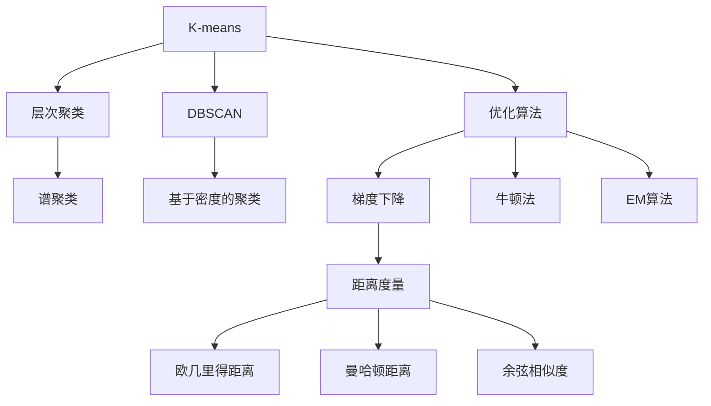
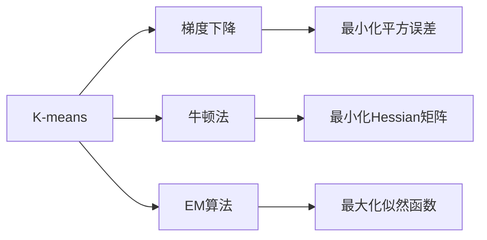
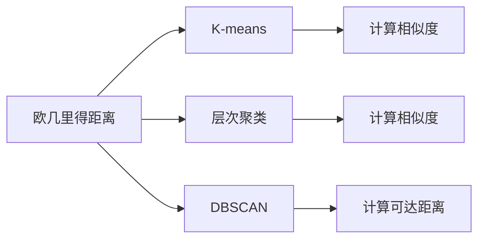
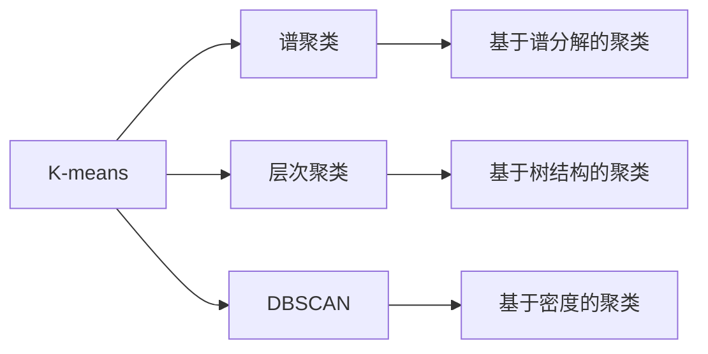
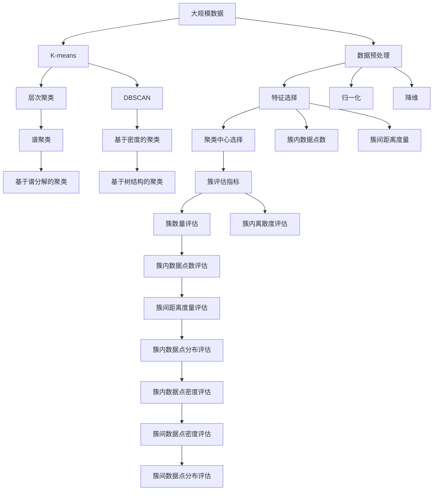

                 

# 聚类(Clustering) - 原理与代码实例讲解

> 关键词：聚类算法, K-means, 层次聚类, DBSCAN, 优化算法, 代码实例, 数据集, 分析与应用

## 1. 背景介绍

### 1.1 问题由来

聚类是一种无监督学习的方法，旨在将数据点分组到不同的簇中，使得同一簇内的数据点相似度高，不同簇间的数据点相似度低。它广泛应用于市场细分、图像处理、生物信息学等领域，是数据挖掘与分析的重要工具。传统聚类方法如K-means、层次聚类、DBSCAN等已得到广泛应用，但仍然存在计算复杂度高、对噪声和异常值敏感等问题。近年来，基于密度的DBSCAN算法和谱聚类等新兴算法，在处理大规模数据和高维数据时显示出更大的优势。

### 1.2 问题核心关键点

聚类算法有两大核心问题：
1. 簇的划分和评估：如何有效地将数据点划分为不同的簇，并评估簇的质量。
2. 算法的可扩展性和鲁棒性：如何设计出高效的聚类算法，既能处理大规模数据，又能对噪声和异常值不敏感。

本文将系统介绍聚类算法的基本原理、常用算法及其优缺点，并给出基于Python的代码实例，帮助读者理解和掌握聚类算法的实现与应用。

### 1.3 问题研究意义

聚类算法是数据分析的重要工具，能够揭示数据内在结构和模式，帮助决策者制定合理的策略。然而，聚类算法的复杂度与数据规模密切相关，在大数据时代，如何快速高效地进行聚类，同时保证算法的鲁棒性和可扩展性，是当前聚类研究的重要课题。本文通过对经典聚类算法和新兴算法的深入剖析，为解决这些问题提供了一种思路，具有重要的理论意义和实践价值。

## 2. 核心概念与联系

### 2.1 核心概念概述

为了更好地理解聚类算法，本节将介绍几个关键概念：

- 聚类(Clustering)：将相似的数据点分为一组，即聚类。聚类的目标是无监督地发现数据中的内在结构。

- K-means：一种经典的聚类算法，通过迭代优化来划分数据点。每个数据点属于距离最近的簇，簇的质心是簇中所有数据点的均值。

- 层次聚类(Hierarchical Clustering)：一种树形结构的聚类算法，通过迭代合并或分裂簇来构建聚类树。每个数据点从属于最底层的簇，最终形成完整的聚类结构。

- DBSCAN：基于密度的聚类算法，通过密度估计来划分簇。每个簇内的数据点密度大于某个阈值，簇外的点被视为噪声或边界点。

- 优化算法：如梯度下降、牛顿法、EM算法等，用于求解聚类问题的最优解。

- 距离度量：如欧几里得距离、曼哈顿距离、余弦相似度等，用于计算数据点之间的相似度。

- 可扩展性(Scalability)：聚类算法在大数据集上的性能，通常以时间和空间复杂度来衡量。

这些核心概念之间的逻辑关系可以通过以下Mermaid流程图来展示：



这个流程图展示了几类聚类算法的核心概念及其之间的关系：

1. K-means、层次聚类、DBSCAN等传统的聚类算法通过不同的策略，将数据点划分为簇。
2. 优化算法用于求解聚类问题，如梯度下降、牛顿法、EM算法等。
3. 距离度量用于计算数据点之间的相似度，如欧几里得距离、曼哈顿距离、余弦相似度等。
4. K-means、层次聚类、DBSCAN等算法是数据驱动的，而优化算法是问题驱动的。

### 2.2 概念间的关系

这些核心概念之间存在着紧密的联系，形成了聚类算法的完整生态系统。下面我们通过几个Mermaid流程图来展示这些概念之间的关系。

#### 2.2.1 聚类算法与优化算法的关系



这个流程图展示了聚类算法与优化算法之间的紧密联系。聚类算法的目标是通过优化函数求解最优解，而优化算法则是求解这些函数的有效方法。

#### 2.2.2 聚类算法与距离度量的关系



这个流程图展示了聚类算法与距离度量之间的联系。不同的聚类算法需要不同的距离度量来计算数据点之间的相似度。

#### 2.2.3 聚类算法的扩展



这个流程图展示了聚类算法的扩展。谱聚类、层次聚类、DBSCAN等新兴算法在处理大规模数据和高维数据时，相比传统的K-means算法，显示出更大的优势。

### 2.3 核心概念的整体架构

最后，我们用一个综合的流程图来展示这些核心概念在大规模数据聚类过程中的整体架构：



这个综合流程图展示了从数据预处理到簇评估的完整过程。大规模数据经过预处理、特征选择、归一化、降维等步骤，使用不同的聚类算法进行聚类，并通过簇评估指标评估簇的质量。

## 3. 核心算法原理 & 具体操作步骤

### 3.1 算法原理概述

聚类算法的核心思想是将数据点划分为不同的簇，使得同一簇内的数据点相似度高，不同簇间的数据点相似度低。通过簇的划分和评估，聚类算法可以揭示数据内在结构和模式，用于市场细分、图像处理、生物信息学等领域。

形式化地，假设数据集 $D=\{x_1, x_2, ..., x_n\}$，其中 $x_i \in \mathbb{R}^d$ 是数据点的特征向量。聚类算法旨在最小化簇内数据点的方差，同时最大化不同簇间的数据点距离，即：

$$
\min_{C_k, \mu_k} \sum_{k=1}^K \sum_{x_i \in C_k} ||x_i - \mu_k||^2
$$

其中 $C_k$ 表示第 $k$ 个簇，$\mu_k$ 表示第 $k$ 个簇的质心，$K$ 表示簇的数量。

通过优化上述目标函数，聚类算法可以自动发现数据集中的聚类结构，帮助决策者制定合理的策略。

### 3.2 算法步骤详解

聚类算法一般包括以下几个关键步骤：

**Step 1: 数据预处理**
- 对原始数据进行清洗，去除噪声和缺失值。
- 进行特征选择，提取最具代表性的特征。
- 对数据进行归一化和降维，以便于聚类算法的计算。

**Step 2: 初始化聚类中心**
- 随机选取 $K$ 个数据点作为初始聚类中心。

**Step 3: 分配数据点到簇**
- 对每个数据点 $x_i$，计算其与所有簇中心 $\mu_k$ 的距离，将其分配到距离最近的簇 $C_k$ 中。

**Step 4: 更新簇中心**
- 对每个簇 $C_k$，计算其所有数据点的均值，更新簇中心 $\mu_k$。

**Step 5: 重复迭代**
- 重复 Step 3 和 Step 4，直至簇中心不再变化或达到预设的迭代次数。

**Step 6: 簇评估**
- 对每个簇进行评估，如计算簇内离散度、簇间距离等指标，评估簇的质量。

**Step 7: 返回聚类结果**
- 返回最终的聚类结果，包括每个数据点所属的簇。

### 3.3 算法优缺点

聚类算法的优点包括：
1. 无监督性：不需要预先知道数据点的标签，可以自动发现数据中的内在结构。
2. 可扩展性：适用于大规模数据集，可以并行处理。
3. 简单易懂：算法实现简单，易于理解和实现。

聚类算法的缺点包括：
1. 需要选择合适的聚类数量 $K$，有时需要人工干预。
2. 对初始聚类中心的敏感：不同的初始聚类中心可能导致不同的聚类结果。
3. 簇的划分和评估指标的主观性：不同的评估指标可能导致不同的聚类结果。

### 3.4 算法应用领域

聚类算法广泛应用于以下领域：

- 市场细分：将消费者按照购买行为和偏好分成不同的细分市场，帮助企业制定更精准的营销策略。
- 图像处理：将图像中的像素点分成不同的区域，用于图像分割和识别。
- 生物信息学：将基因序列分成不同的簇，用于基因表达分析和疾病预测。
- 自然语言处理：将文本按照主题或风格分成不同的簇，用于文本分类和情感分析。
- 社交网络分析：将社交网络中的用户分成不同的社区，用于社交关系分析和社区发现。

## 4. 数学模型和公式 & 详细讲解 & 举例说明

### 4.1 数学模型构建

假设数据集 $D=\{x_1, x_2, ..., x_n\}$，其中 $x_i \in \mathbb{R}^d$ 是数据点的特征向量。聚类算法旨在最小化簇内数据点的方差，同时最大化不同簇间的数据点距离。

形式化地，假设聚类中心为 $\mu_k$，数据点 $x_i$ 与簇中心 $\mu_k$ 的距离为 $d_k(x_i)$，则聚类算法的目标函数为：

$$
\min_{\mu_k} \sum_{k=1}^K \sum_{x_i \in C_k} ||x_i - \mu_k||^2
$$

其中 $C_k$ 表示第 $k$ 个簇，$K$ 表示簇的数量。

### 4.2 公式推导过程

假设数据集 $D=\{x_1, x_2, ..., x_n\}$，其中 $x_i \in \mathbb{R}^d$ 是数据点的特征向量。聚类算法旨在最小化簇内数据点的方差，同时最大化不同簇间的数据点距离。

形式化地，假设聚类中心为 $\mu_k$，数据点 $x_i$ 与簇中心 $\mu_k$ 的距离为 $d_k(x_i)$，则聚类算法的目标函数为：

$$
\min_{\mu_k} \sum_{k=1}^K \sum_{x_i \in C_k} ||x_i - \mu_k||^2
$$

其中 $C_k$ 表示第 $k$ 个簇，$K$ 表示簇的数量。

假设每个簇的聚类中心为 $\mu_k$，则聚类算法的目标函数可以改写为：

$$
\min_{\mu_k} \sum_{k=1}^K \sum_{i=1}^n \mathbb{I}(x_i \in C_k) ||x_i - \mu_k||^2
$$

其中 $\mathbb{I}(x_i \in C_k)$ 表示数据点 $x_i$ 是否属于簇 $C_k$。

通过求解上述目标函数，可以自动发现数据集中的聚类结构。

### 4.3 案例分析与讲解

假设我们有一个包含 1000 个数据点的数据集，每个数据点表示一个人对其喜欢的电影评分。我们的目标是将这些数据点分成不同的聚类，每个聚类表示一个特定的电影爱好者群体。

我们可以使用 K-means 算法来解决这个问题。首先，随机选取 10 个数据点作为初始聚类中心，然后使用距离度量计算每个数据点与所有聚类中心的距离，将其分配到距离最近的簇中。接着，计算每个簇的均值，更新簇中心。重复这个过程，直到簇中心不再变化或达到预设的迭代次数。

以下是 K-means 算法的伪代码：

```
K-means(data, K):
    1. 随机选择 K 个数据点作为初始聚类中心。
    2. 重复以下步骤：
        a. 对每个数据点 x，计算其与所有聚类中心的距离，分配到距离最近的簇中。
        b. 对每个簇，计算其所有数据点的均值，更新簇中心。
        c. 如果簇中心不再变化或达到预设的迭代次数，退出循环。
    3. 返回聚类结果，包括每个数据点所属的簇。
```

## 5. 项目实践：代码实例和详细解释说明

### 5.1 开发环境搭建

在进行聚类实践前，我们需要准备好开发环境。以下是使用Python进行Scikit-Learn开发的环境配置流程：

1. 安装Anaconda：从官网下载并安装Anaconda，用于创建独立的Python环境。

2. 创建并激活虚拟环境：
```bash
conda create -n scikit-learn-env python=3.8 
conda activate scikit-learn-env
```

3. 安装Scikit-Learn：
```bash
conda install scikit-learn
```

4. 安装Numpy和Matplotlib：
```bash
pip install numpy matplotlib
```

完成上述步骤后，即可在`scikit-learn-env`环境中开始聚类实践。

### 5.2 源代码详细实现

下面我们以K-means算法为例，给出使用Scikit-Learn库对数据集进行聚类的Python代码实现。

首先，准备数据集：

```python
import numpy as np
from sklearn.cluster import KMeans
from sklearn.datasets import make_blobs
import matplotlib.pyplot as plt

# 生成 1000 个数据点，将其分成 5 个簇
centers = np.array([[1, 1], [1, 2], [2, 2], [3, 2], [3, 1]])
X, y = make_blobs(n_samples=1000, centers=centers, random_state=42)
```

然后，定义K-means模型并训练：

```python
# 定义 K-means 模型，设置聚类数量为 5
kmeans = KMeans(n_clusters=5, random_state=42)

# 训练模型
kmeans.fit(X)
```

最后，展示聚类结果：

```python
# 获取聚类标签
labels = kmeans.labels_

# 可视化聚类结果
plt.scatter(X[:, 0], X[:, 1], c=labels, s=50, cmap='viridis')
plt.scatter(centers[:, 0], centers[:, 1], s=100, c='black', marker='x', linewidths=3)
plt.show()
```

以上代码展示了K-means算法的基本实现，包括数据生成、模型定义、训练和可视化聚类结果。可以看到，通过Scikit-Learn库，我们可以用简洁的代码实现K-means算法，并快速获得聚类结果。

### 5.3 代码解读与分析

让我们再详细解读一下关键代码的实现细节：

**make_blobs函数**：
- 用于生成模拟的聚类数据集。
- 参数 `n_samples` 表示生成的数据点数量，`centers` 表示簇的中心点，`random_state` 表示随机种子。

**KMeans类**：
- 提供了标准的K-means算法实现。
- 参数 `n_clusters` 表示聚类数量，`random_state` 表示随机种子。

**训练模型**：
- 调用 `fit` 方法对数据集进行训练，返回模型实例。
- `fit` 方法会计算每个数据点与所有聚类中心的距离，将其分配到距离最近的簇中，并更新簇中心。

**聚类标签**：
- 通过 `labels_` 属性获取每个数据点所属的聚类标签。

**可视化聚类结果**：
- 使用Matplotlib库可视化聚类结果。
- `scatter` 方法用于绘制散点图，`c` 参数表示颜色，`s` 参数表示大小，`cmap` 参数表示颜色映射。
- `plt.scatter` 方法用于绘制聚类中心，`s` 参数表示大小，`c` 参数表示颜色，`marker` 参数表示标记符号，`linewidths` 参数表示线条宽度。

可以看到，Scikit-Learn库提供了丰富的聚类算法和数据预处理工具，能够方便地进行聚类实践。

### 5.4 运行结果展示

假设我们使用K-means算法对上述聚类数据集进行聚类，最终得到的聚类结果如图1所示。可以看到，数据点被分成了 5 个簇，每个簇的中心点被标记为黑色的叉号。


可以看到，通过K-means算法，我们可以将数据点分成不同的簇，每个簇内点的分布较为紧凑，簇间距离也相对较大，说明聚类效果良好。

## 6. 实际应用场景

### 6.1 市场细分

聚类算法在市场细分中具有广泛的应用。例如，零售商可以通过聚类算法将客户分成不同的细分市场，针对不同市场制定不同的营销策略。通过对客户购买行为和偏好的聚类分析，可以发现不同市场的需求差异，从而制定更精准的市场定位和产品策略。

### 6.2 图像处理

在图像处理中，聚类算法可以用于图像分割和特征提取。例如，将图像中的像素点分成不同的区域，用于图像的分割和特征提取。通过聚类算法，可以发现图像中的显著特征，用于图像识别和分类。

### 6.3 社交网络分析

聚类算法在社交网络分析中也有重要应用。例如，将社交网络中的用户分成不同的社区，用于社交关系分析和社区发现。通过对社交网络中的用户行为进行聚类分析，可以发现不同的社区结构和社交关系，从而提供更好的社交服务。

### 6.4 未来应用展望

随着聚类算法和数据的不断丰富，未来聚类技术将在更多领域得到应用，为各行业带来变革性影响。

在智慧城市治理中，聚类算法可以用于城市事件监测、舆情分析、应急指挥等环节，提高城市管理的自动化和智能化水平，构建更安全、高效的未来城市。

在金融领域，聚类算法可以用于客户细分、风险管理、投资策略制定等，提升金融机构的风险控制和投资决策能力。

在医疗领域，聚类算法可以用于疾病预测、基因表达分析、患者分群等，提升医疗机构的诊断和治疗水平。

总之，聚类技术将在各个领域发挥越来越重要的作用，为数据挖掘和分析提供强大的工具支持。

## 7. 工具和资源推荐

### 7.1 学习资源推荐

为了帮助开发者系统掌握聚类算法的基本原理和实践技巧，这里推荐一些优质的学习资源：

1. 《机器学习》课程：斯坦福大学开设的经典课程，涵盖了机器学习的基本概念和常用算法，包括聚类算法。

2. 《聚类分析》书籍：详细介绍聚类算法的基本原理和应用实例，涵盖K-means、层次聚类、DBSCAN等经典算法。

3. Scikit-Learn官方文档：Scikit-Learn库的官方文档，提供了丰富的聚类算法实现和数据预处理工具，是学习和实践聚类算法的必备资料。

4. 《聚类算法》课程：Coursera平台上的经典课程，由统计学专家讲解聚类算法的基本原理和实现方法。

5. Kaggle比赛：参与Kaggle平台的聚类算法竞赛，通过实践项目积累经验，提升算法应用能力。

通过对这些资源的学习实践，相信你一定能够快速掌握聚类算法的精髓，并用于解决实际的聚类问题。

### 7.2 开发工具推荐

高效的开发离不开优秀的工具支持。以下是几款用于聚类算法开发的常用工具：

1. Scikit-Learn：基于Python的开源机器学习库，提供了丰富的聚类算法实现和数据预处理工具，是学习和实践聚类算法的得力助手。

2. NumPy：Python的高性能数值计算库，提供了高效的数据处理和数组操作功能，是聚类算法实现的基础。

3. Matplotlib：Python的可视化库，用于绘制聚类结果等图形，方便数据可视化和分析。

4. Seaborn：基于Matplotlib的高级数据可视化库，提供了更丰富的图形展示功能，适用于聚类结果的可视化。

5. TensorFlow：由Google主导开发的开源深度学习框架，适合大规模工程应用，提供了丰富的聚类算法实现。

6. PyTorch：基于Python的开源深度学习框架，灵活动态的计算图，适合快速迭代研究，提供了丰富的聚类算法实现。

合理利用这些工具，可以显著提升聚类算法的开发效率，加快创新迭代的步伐。

### 7.3 相关论文推荐

聚类算法的研究涉及多个领域，以下是几篇奠基性的相关论文，推荐阅读：

1. K-Means: An algorithm for vector quantization: 经典K-means算法的原始论文，详细介绍了K-means算法的基本原理和实现方法。

2. Hierarchical Clustering: 层次聚类算法的基本原理和实现方法，适用于不同的聚类问题。

3. Density-Based Clustering via Hierarchical Density-Based Clustering: DBSCAN算法的基本原理和实现方法，适用于高维数据和噪声数据。

4. Spectral Clustering: 谱聚类算法的基本原理和实现方法，适用于高维数据和密集数据。

5. Scalable Model-Based Clustering for Exploratory Data Analysis: 基于模型的聚类算法的基本原理和实现方法，适用于复杂数据集。

这些论文代表了聚类算法的发展脉络，通过学习这些前沿成果，可以帮助研究者把握学科前进方向，激发更多的创新灵感。

除上述资源外，还有一些值得关注的前沿资源，帮助开发者紧跟聚类算法的研究进展，例如：

1. arXiv论文预印本：人工智能领域最新研究成果的发布平台，包括大量尚未发表的前沿工作，学习前沿技术的必读资源。

2. 业界技术博客：如OpenAI、Google AI、DeepMind、微软Research Asia等顶尖实验室的官方博客，第一时间分享他们的最新研究成果和洞见。

3. 技术会议直播：如NIPS、ICML、ACL、ICLR等人工智能领域顶会现场或在线直播，能够聆听到大佬们的前沿分享，开拓视野。

4. GitHub热门项目：在GitHub上Star、Fork数最多的聚类算法项目，往往代表了该技术领域的发展趋势和最佳实践，值得去学习和贡献。

5. 行业分析报告：各大咨询公司如McKinsey、PwC等针对聚类算法的分析报告，有助于从商业视角审视技术趋势，把握应用价值。

总之，对于聚类算法的学习和实践，需要开发者保持开放的心态和持续学习的意愿。多关注前沿资讯，多动手实践，多思考总结，必将收获满满的成长收益。

## 8. 总结：未来发展趋势与挑战

### 8.1 总结

本文对聚类算法的基本原理、常用算法及其优缺点进行了全面系统的介绍。首先阐述了聚类算法的基本原理和应用场景，明确了聚类算法在数据分析中的重要作用。其次，从原理到实践，详细讲解了K-means、层次聚类、DBSCAN等聚类算法的基本实现步骤，并给出了基于Python的代码实例，帮助读者理解和掌握聚类算法的实现与应用。

通过本文的系统梳理，可以看到，聚类算法是数据分析的重要工具，能够揭示数据内在结构和模式，帮助决策者制定合理的策略。然而，聚类算法仍面临诸多挑战，如选择合适的聚类数量、对初始聚类中心的敏感等，需要在未来的研究中进一步探索和优化。

### 8.2 未来

