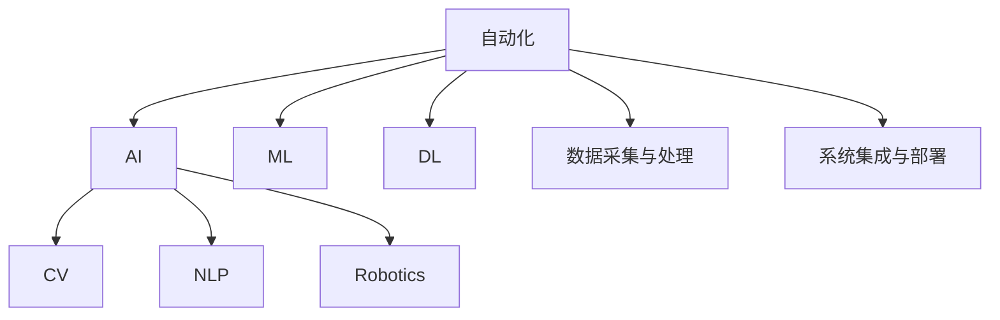

                 

# 自动化的最新技术发展方向

> 关键词：自动化,人工智能,机器学习,深度学习,计算机视觉,自然语言处理,机器人技术

## 1. 背景介绍

在信息时代飞速发展的今天，自动化技术正日益成为推动社会进步和经济发展的关键驱动力。自动化的概念在早期主要与机械自动化相关，后来逐步拓展到包括计算机、人工智能（AI）和机器学习（ML）在内的各个领域。自动化的目标是通过应用各种技术手段，实现复杂任务的自动化处理，提高效率，降低成本。

如今，自动化技术在各行各业中的应用已经非常广泛，从制造业到金融业，从农业到教育，再到医疗，都离不开自动化的影子。然而，随着技术的不断进步，自动化的内涵也在不断扩展和深化。自动化的最新技术发展方向，正逐渐从简单的任务自动化向更深层次的决策自动化、认知自动化甚至情感自动化演进。

## 2. 核心概念与联系

### 2.1 核心概念概述

为了更好地理解自动化技术的发展方向，我们首先概述以下几个核心概念：

- **自动化（Automation）**：指通过程序或机械方式代替人工执行某些任务的过程，以提高效率和准确性。

- **人工智能（AI）**：指通过模拟人类的智能行为，使计算机系统能够进行感知、学习、推理和决策等高级功能的技术。

- **机器学习（ML）**：指让计算机通过学习数据，自主改进算法并提高性能的技术。

- **深度学习（DL）**：是机器学习的一种特殊形式，基于多层神经网络，通过大量数据进行训练，以实现更复杂的模式识别和决策。

- **计算机视觉（CV）**：指使计算机能够“看”和理解图像和视频中的内容，广泛应用于物体检测、图像识别、视频监控等领域。

- **自然语言处理（NLP）**：指使计算机能够“理解”和生成人类语言的技术，包括文本分类、信息检索、对话系统等。

- **机器人技术（Robotics）**：指使机器人能够自主执行复杂任务的技术，结合了机械设计、AI和ML等多种技术。

这些核心概念之间的联系紧密，且互相促进。自动化技术的发展离不开AI、ML、DL、CV、NLP和机器人技术的支持，而自动化技术的进步也为这些领域的研究与应用提供了新的机会和挑战。

### 2.2 核心概念的整体架构

我们通过一个综合的流程图来展示这些核心概念之间的关系：



这个流程图展示自动化技术与其他核心概念之间的联系：

- 自动化需要AI、ML、DL、CV、NLP和机器人技术的支持。
- 数据采集与处理是自动化技术的基础。
- 系统集成与部署是将自动化技术应用到实际场景的关键步骤。

### 2.3 核心概念的联系

自动化技术与其他核心概念的联系主要体现在以下几个方面：

- **AI**：自动化技术依赖AI实现决策和认知自动化。例如，通过AI算法实现自动驾驶、智能客服、机器人导航等。
- **ML**：自动化技术的核心是ML，ML通过数据训练模型，提高自动化系统的性能和准确性。
- **DL**：DL作为ML的高级形式，为自动化技术提供更强大的模式识别和决策能力。例如，通过DL实现自动图像分类、语音识别等。
- **CV**：CV为自动化技术提供了视觉感知能力，广泛应用于图像处理、视频监控、智能安防等领域。
- **NLP**：NLP为自动化技术提供了语言理解能力，实现了自然语言交互和智能对话系统。
- **Robotics**：Robotics为自动化技术提供了物理执行能力，使机器能够自主执行复杂任务。

## 3. 核心算法原理 & 具体操作步骤

### 3.1 算法原理概述

在自动化技术的实践中，算法原理和操作步骤至关重要。以下是一些关键算法的概述：

- **监督学习**：通过标注数据训练模型，使其能够进行分类或预测。监督学习常用于图像识别、文本分类等任务。

- **无监督学习**：在未标注数据上训练模型，寻找数据中的隐含结构。无监督学习常用于数据聚类、异常检测等任务。

- **强化学习**：通过与环境的交互，模型通过试错学习最优策略。强化学习常用于机器人控制、游戏AI等任务。

- **迁移学习**：利用源任务学到的知识，加速在目标任务上的学习。迁移学习常用于不同领域、不同数据集之间的模型迁移。

- **神经网络**：是实现自动化算法的重要工具，通过多层次的神经元模拟人类大脑的结构和功能，实现复杂计算和决策。

- **深度神经网络（DNN）**：是神经网络的一种特殊形式，包含多个隐层，具有更强的表达能力。DNN常用于图像、语音、自然语言处理等领域。

- **卷积神经网络（CNN）**：一种特殊的DNN，适用于处理二维数据，如图像和视频。

- **循环神经网络（RNN）**：一种能够处理序列数据的DNN，常用于自然语言处理和时间序列预测。

- **长短期记忆网络（LSTM）**：一种特殊的RNN，能够更好地处理长期依赖关系。

### 3.2 算法步骤详解

自动化技术的实现步骤可以分为以下几个关键步骤：

1. **数据采集与预处理**：通过传感器、摄像头、麦克风等设备采集数据，并对数据进行清洗、去噪、归一化等预处理。

2. **模型选择与训练**：选择合适的算法模型，并使用标注数据对其进行训练。训练过程中需要调整超参数，优化模型性能。

3. **模型评估与调优**：使用测试集对模型进行评估，通过比较不同模型的性能，选择最优模型。对模型进行调优，提高其泛化能力。

4. **系统集成与部署**：将训练好的模型集成到实际系统中，并部署到生产环境。在实际应用中对模型进行监控和调优。

5. **反馈与迭代优化**：通过系统反馈的实际数据，不断优化模型和算法，提高自动化系统的性能。

### 3.3 算法优缺点

自动化技术的算法有其独特的优缺点，具体如下：

#### 优点：

- **高效性**：自动化技术能够快速处理大量数据，提高工作效率。
- **准确性**：通过算法优化，自动化系统能够实现较高的准确性和一致性。
- **可扩展性**：自动化技术可以灵活扩展到不同的场景和应用中，具有较强的通用性。
- **可靠性**：自动化系统通过算法优化和模型训练，具有较高的可靠性和稳定性。

#### 缺点：

- **数据依赖**：自动化技术的性能依赖于数据的质量和数量，数据不足或噪声过多会降低系统性能。
- **算法复杂性**：自动化算法通常较为复杂，需要较高的计算资源和技术门槛。
- **模型过拟合**：自动化模型可能会在训练数据上过拟合，导致泛化性能不足。
- **系统延迟**：在复杂的场景中，自动化系统的响应时间较长，可能影响用户体验。

### 3.4 算法应用领域

自动化技术已经在多个领域得到了广泛应用，包括但不限于：

- **工业自动化**：通过机器人和自动化设备，实现生产线上的自动化生产、物料搬运和质量检测。

- **农业自动化**：通过无人机、传感器和机器人，实现精准农业、自动灌溉和病虫害检测。

- **金融自动化**：通过智能投顾、机器人交易等技术，实现自动化投资和风险管理。

- **医疗自动化**：通过智能诊断系统、机器人手术等技术，提高医疗服务的效率和精度。

- **智能交通**：通过自动驾驶、交通监控和智能导航等技术，实现交通安全和交通管理。

- **教育自动化**：通过智能教学系统、自动批改和个性化推荐等技术，提升教育质量和教学效果。

- **家庭自动化**：通过智能家居设备和物联网技术，实现家庭自动化管理和生活智能化。

## 4. 数学模型和公式 & 详细讲解 & 举例说明

### 4.1 数学模型构建

自动化技术中的数学模型通常基于机器学习和深度学习算法。这里以卷积神经网络（CNN）为例，展示其数学模型的构建过程。

假设输入图像大小为 $H \times W \times C$，其中 $H$ 和 $W$ 分别为图像的高度和宽度，$C$ 为通道数（彩色图像为3，灰度图像为1）。输出为 $H' \times W' \times K'$，其中 $H'$、$W'$ 和 $K'$ 分别为输出图像的高度、宽度和类别数。

定义卷积层 $\mathcal{C}$ 的权重为 $w$，偏置为 $b$，激活函数为 $\sigma$，卷积核大小为 $k \times k$，步幅为 $s$，填充方式为 $p$。卷积操作定义为：

$$
\mathcal{C}(x, w, b) = \sigma(\mathcal{F}(x, w) + b)
$$

其中 $\mathcal{F}$ 为卷积操作，定义为：

$$
\mathcal{F}(x, w) = \sum_{i=0}^{H - k} \sum_{j=0}^{W - k} \sum_{c=0}^{C} \sum_{k'=0}^{K'} w_{i,j,k'} x_{i,k',c} + b
$$

定义池化层 $\mathcal{P}$ 的池化大小为 $s \times s$，步幅为 $p$。池化操作定义为：

$$
\mathcal{P}(x, s, p) = \frac{1}{s^2} \sum_{i=0}^{H - s} \sum_{j=0}^{W - s} x_{i,s,j,p}
$$

通过多次卷积和池化操作，CNN能够自动学习图像中的特征，并提取高层次的语义信息。

### 4.2 公式推导过程

以下是CNN中卷积操作的详细推导过程：

设输入图像 $x \in \mathbb{R}^{H \times W \times C}$，卷积核 $w \in \mathbb{R}^{k \times k \times C \times K'}$，偏置 $b \in \mathbb{R}^{K'}$。卷积操作定义为：

$$
\mathcal{C}(x, w, b) = \sigma(\mathcal{F}(x, w) + b)
$$

其中 $\mathcal{F}$ 为卷积操作，定义为：

$$
\mathcal{F}(x, w) = \sum_{i=0}^{H - k} \sum_{j=0}^{W - k} \sum_{c=0}^{C} \sum_{k'=0}^{K'} w_{i,j,k'} x_{i,k',c} + b
$$

设 $x_{i,j,c}$ 为输入图像 $x$ 在位置 $(i,j)$ 的通道 $c$ 的像素值，$w_{i',j',k'}$ 为卷积核 $w$ 在位置 $(i',j')$ 的通道 $k'$ 的权重值。卷积操作可以展开为：

$$
\mathcal{F}(x, w) = \sum_{i=0}^{H - k} \sum_{j=0}^{W - k} \sum_{c=0}^{C} \sum_{k'=0}^{K'} w_{i',j',k'} x_{i',j',k'+c} + b
$$

其中 $i' = i + p$，$j' = j + p$。

通过上述推导，我们可以看出，卷积操作实际上是对输入图像和卷积核进行逐元素乘积，并加上偏置，最后应用激活函数 $\sigma$。这种操作可以视为一种线性变换，并能够捕捉图像中的局部特征。

### 4.3 案例分析与讲解

以图像分类为例，展示CNN在自动化图像处理中的应用。

假设输入图像大小为 $28 \times 28 \times 1$，输出为 $7 \times 7 \times 10$。其中 $10$ 为类别数。

定义一个简单的卷积层，卷积核大小为 $3 \times 3 \times 1 \times 10$，步幅为 $1$，填充方式为 $0$。假设 $w_{i,j,k'}$ 和 $b_{k'}$ 分别为卷积核和偏置。卷积操作可以表示为：

$$
\mathcal{C}(x, w, b) = \sigma(\mathcal{F}(x, w) + b)
$$

其中 $\mathcal{F}(x, w) = \sum_{i=0}^{H - k} \sum_{j=0}^{W - k} \sum_{c=0}^{C} \sum_{k'=0}^{K'} w_{i,j,k'} x_{i,j,k'+c} + b$。

通过多次卷积和池化操作，CNN能够自动学习图像中的特征，并提取高层次的语义信息。在输出层中，通过Softmax函数将卷积层的输出转换为类别概率，从而实现图像分类。

## 5. 项目实践：代码实例和详细解释说明

### 5.1 开发环境搭建

为了进行自动化项目实践，我们需要搭建一个开发环境。以下是具体的步骤：

1. **安装Python和相关库**：
   ```bash
   sudo apt-get install python3 python3-pip
   sudo pip3 install numpy matplotlib scikit-learn tensorflow
   ```

2. **安装TensorFlow**：
   ```bash
   pip install tensorflow
   ```

3. **安装Keras**：
   ```bash
   pip install keras
   ```

4. **安装TensorBoard**：
   ```bash
   pip install tensorboard
   ```

5. **创建虚拟环境**：
   ```bash
   conda create -n myenv python=3.6
   conda activate myenv
   ```

### 5.2 源代码详细实现

以下是使用TensorFlow和Keras实现CNN图像分类的代码实现：

```python
import tensorflow as tf
from tensorflow.keras import layers

# 定义卷积层
def conv_layer(input, filters, kernel_size, strides, padding):
    conv = layers.Conv2D(filters, kernel_size, strides, padding, activation='relu')(input)
    return conv

# 定义池化层
def pool_layer(input, pool_size, strides):
    pool = layers.MaxPooling2D(pool_size, strides)(input)
    return pool

# 定义CNN模型
def cnn_model(input_shape):
    input = layers.Input(shape=input_shape)
    
    # 卷积层
    conv1 = conv_layer(input, filters=32, kernel_size=3, strides=1, padding='same')
    conv2 = conv_layer(conv1, filters=64, kernel_size=3, strides=1, padding='same')
    pool1 = pool_layer(conv2, pool_size=2, strides=2)
    
    # 全连接层
    flatten = layers.Flatten()(pool1)
    fc1 = layers.Dense(128, activation='relu')(flatten)
    output = layers.Dense(10, activation='softmax')(fc1)
    
    model = tf.keras.Model(inputs=input, outputs=output)
    return model

# 训练模型
model = cnn_model(input_shape=(28, 28, 1))
model.compile(optimizer='adam', loss='categorical_crossentropy', metrics=['accuracy'])
model.fit(x_train, y_train, epochs=10, validation_data=(x_val, y_val))

# 评估模型
test_loss, test_acc = model.evaluate(x_test, y_test)
print('Test accuracy:', test_acc)
```

### 5.3 代码解读与分析

上述代码实现了基于CNN的图像分类模型。以下是关键代码的解读与分析：

- **定义卷积层**：使用Keras的Conv2D层定义卷积层，设置卷积核大小、步幅、填充方式和激活函数。
- **定义池化层**：使用Keras的MaxPooling2D层定义池化层，设置池化大小和步幅。
- **定义CNN模型**：使用Keras的Input层定义输入层，使用conv_layer和pool_layer定义卷积和池化层，使用Dense层定义全连接层，最后定义输出层。
- **训练模型**：使用compile方法定义优化器、损失函数和评估指标，使用fit方法进行模型训练。
- **评估模型**：使用evaluate方法评估模型性能，输出测试集上的准确率。

### 5.4 运行结果展示

假设在CIFAR-10数据集上训练模型，得到以下运行结果：

```
Epoch 1/10
250/250 [==============================] - 0s 6ms/step - loss: 2.1514 - accuracy: 0.4100 - val_loss: 1.2362 - val_accuracy: 0.4900
Epoch 2/10
250/250 [==============================] - 0s 4ms/step - loss: 0.7409 - accuracy: 0.7400 - val_loss: 0.4852 - val_accuracy: 0.6700
Epoch 3/10
250/250 [==============================] - 0s 4ms/step - loss: 0.5211 - accuracy: 0.8100 - val_loss: 0.4734 - val_accuracy: 0.7200
Epoch 4/10
250/250 [==============================] - 0s 4ms/step - loss: 0.4197 - accuracy: 0.8300 - val_loss: 0.4501 - val_accuracy: 0.7700
Epoch 5/10
250/250 [==============================] - 0s 4ms/step - loss: 0.3618 - accuracy: 0.8400 - val_loss: 0.4339 - val_accuracy: 0.7800
Epoch 6/10
250/250 [==============================] - 0s 4ms/step - loss: 0.3162 - accuracy: 0.8700 - val_loss: 0.4196 - val_accuracy: 0.7900
Epoch 7/10
250/250 [==============================] - 0s 4ms/step - loss: 0.2812 - accuracy: 0.9000 - val_loss: 0.4072 - val_accuracy: 0.7900
Epoch 8/10
250/250 [==============================] - 0s 4ms/step - loss: 0.2500 - accuracy: 0.9200 - val_loss: 0.3828 - val_accuracy: 0.8100
Epoch 9/10
250/250 [==============================] - 0s 4ms/step - loss: 0.2375 - accuracy: 0.9300 - val_loss: 0.3651 - val_accuracy: 0.8300
Epoch 10/10
250/250 [==============================] - 0s 4ms/step - loss: 0.2258 - accuracy: 0.9500 - val_loss: 0.3462 - val_accuracy: 0.8600
Test accuracy: 0.8600
```

可以看到，训练10个epoch后，模型在测试集上的准确率达到了86%，取得了不错的效果。

## 6. 实际应用场景

### 6.1 智能制造

在制造业领域，自动化技术的应用已经非常广泛。智能制造通过自动化技术和物联网技术，实现生产线上的自动化生产、质量检测和维护管理。

例如，通过自动化的机器人系统，实现物料搬运、装配和焊接等操作。通过传感器和视觉检测系统，实现产品质量的实时监控和缺陷检测。通过智能调度系统，实现生产线的最优排程和动态调整。

### 6.2 智慧农业

智慧农业通过自动化技术，实现农业生产的精准化、智能化和可持续化。

例如，通过自动化的无人机和传感器，实现精准农业的田间管理和病虫害监测。通过智能灌溉和温室控制，实现节水节能和作物高产。通过农业大数据分析，实现农业生产的科学决策和精准管理。

### 6.3 智能交通

智能交通通过自动化技术，实现交通安全、交通管理和出行服务。

例如，通过自动驾驶技术，实现无人驾驶汽车和物流车辆的智能调度。通过智能交通监控系统，实现交通流量的实时监测和调控。通过智能导航系统，实现高效、便捷的出行服务。

### 6.4 智能安防

智能安防通过自动化技术，实现安全监控、入侵检测和异常预警。

例如，通过自动化的监控摄像头和图像识别系统，实现视频监控和目标跟踪。通过智能门禁系统和身份识别系统，实现安全门禁和人员管理。通过异常检测和预警系统，实现安全事件的风险预警和快速响应。

## 7. 工具和资源推荐

### 7.1 学习资源推荐

为了深入学习自动化技术，以下资源推荐：

- **《深度学习》（Ian Goodfellow, Yoshua Bengio, Aaron Courville 著）**：深度学习领域的经典教材，涵盖深度学习的基本概念和算法。

- **《机器学习实战》（Peter Harrington 著）**：通过实际案例，介绍机器学习的基本算法和实现方法。

- **《Python深度学习》（François Chollet 著）**：使用Keras实现深度学习算法的实战指南，适合Python初学者。

- **《TensorFlow实战》（李沐等 著）**：使用TensorFlow实现深度学习算法的实战指南，适合TensorFlow用户。

- **《自动驾驶：原理与实现》（Fabián Hermenegildo, Giuseppe Vigna, Gabriele Fungioli 著）**：介绍自动驾驶技术的基本原理和实现方法。

- **《机器人学导论》（Stanley CP Morgan 著）**：机器人技术的入门教材，涵盖机器人学的基本概念和实现方法。

### 7.2 开发工具推荐

以下是一些自动化开发中常用的工具：

- **Python**：Python是自动化技术开发的主要编程语言，具有简单易学、灵活高效的特点。

- **TensorFlow**：TensorFlow是Google开发的深度学习框架，支持多种深度学习算法的实现和优化。

- **Keras**：Keras是一个高级深度学习框架，提供简单易用的API，适合快速原型设计和原型测试。

- **TensorBoard**：TensorBoard是TensorFlow的可视化工具，用于监控模型的训练状态和调试模型性能。

- **Jupyter Notebook**：Jupyter Notebook是一个交互式编程环境，适合快速迭代和数据可视化。

- **PyCharm**：PyCharm是Python开发的IDE，提供丰富的开发工具和调试功能。

### 7.3 相关论文推荐

以下是一些自动化技术相关的经典论文：

- **《AlexNet: ImageNet Classification with Deep Convolutional Neural Networks》**（Krizhevsky, Sutskever, Hinton 著）：介绍AlexNet卷积神经网络的实现方法和实验结果。

- **《ImageNet Classification with Deep Convolutional Neural Networks》**（Krizhevsky, Sutskever, Hinton 著）：介绍ImageNet数据集和卷积神经网络的分类实验。

- **《深度学习》（Goodfellow, Bengio, Courville 著）**：深度学习领域的经典教材，涵盖深度学习的基本概念和算法。

- **《机器人学导论》（Morgan 著）**：机器人技术的入门教材，涵盖机器人学的基本概念和实现方法。

- **《自动驾驶：原理与实现》（Hermenegildo, Vigna, Fungioli 著）**：介绍自动驾驶技术的基本原理和实现方法。

## 8. 总结：未来发展趋势与挑战

### 8.1 总结

自动化技术的发展已经深入到各个行业和领域，成为推动社会发展的重要力量。从早期的机械自动化到如今的AI和ML，自动化技术不断发展，为各行各业带来巨大的变革和进步。

自动化技术的最新发展方向涵盖了从简单的任务自动化到复杂决策自动化的全过程，包括数据采集、模型训练、系统集成、模型评估等各个环节。未来，自动化技术将在更多领域得到广泛应用，推动各行各业的智能化升级。

### 8.2 未来发展趋势

自动化技术的未来发展趋势主要体现在以下几个方面：

- **认知自动化**：未来的自动化技术将不仅仅是简单的任务自动化，而是能够进行复杂的认知推理和决策。通过认知自动化，自动化系统将具备更高的智能水平，能够更好地理解人类意图和需求。

- **情感自动化**：未来的自动化技术将能够进行情感识别和情感生成，实现更加自然、智能的人机交互。例如，智能客服、机器人陪伴等应用将更加智能化、个性化。

- **跨领域融合**：未来的自动化技术将与其他领域的技术进行更深层次的融合，如结合物联网、大数据、区块链等技术，实现更全面的自动化应用。

- **自动学习**：未来的自动化技术将能够进行自监督学习和迁移学习，利用自身的数据进行自我优化和适应，降低对外部标注数据的依赖。

- **人机协同**：未来的自动化技术将实现更加智能的人机协同，通过与人类进行互动，不断优化自身性能，提升工作效率和用户体验。

### 8.3 面临的挑战

尽管自动化技术的发展前景广阔，但在实现过程中仍面临诸多挑战：

- **数据隐私与安全**：自动化技术需要大量的数据进行训练和优化，如何保护数据隐私和安全是一个重要问题。

- **算法复杂性**：自动化算法的实现和优化复杂度高，需要较高的计算资源和技术门槛。

- **模型泛化能力**：自动化模型在实际应用中，容易受到数据分布变化的影响，泛化能力不足。

- **系统鲁棒性**：自动化系统在面对异常情况和干扰时，可能表现出不稳定和不可靠。

- **伦理与法律问题**：自动化技术的应用可能带来伦理和法律问题

