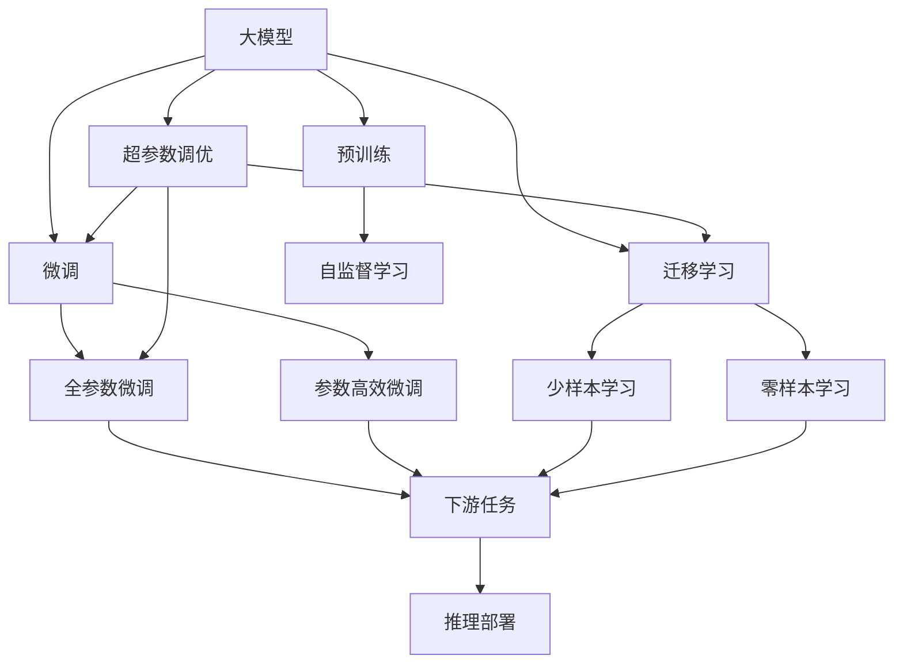

                 

## 1. 背景介绍

### 1.1 问题由来
随着人工智能(AI)技术的迅猛发展，大模型（如BERT, GPT等）在自然语言处理(NLP)、计算机视觉(CV)、语音识别(SR)等多个领域取得了突破性进展。这些大模型以其庞大的数据集、复杂的神经网络结构和卓越的性能，为AI应用开发提供了强有力的支持。然而，将大模型应用于实际场景中，仍需面对诸多挑战，如数据集构建、模型训练、推理部署等。如何构建高效、可扩展的大模型应用，成为当前AI应用开发的一个重要课题。

### 1.2 问题核心关键点
大模型应用开发的核心关键点包括：

- **数据集构建**：收集高质量、大规模的训练数据是模型性能的关键。
- **模型训练**：选择合适的优化器、学习率、正则化方法等，以避免过拟合。
- **推理部署**：将训练好的模型高效地部署到生产环境中，实现实时推理。
- **应用优化**：针对具体任务，进行微调或参数高效微调，提高模型性能。
- **模型监控**：实时监控模型性能，及时发现问题并进行修复。

这些关键点构成了大模型应用开发的完整流程，通过合理的技术手段和工程实践，可以最大化大模型的应用潜力。

### 1.3 问题研究意义
掌握大模型应用开发的技术，对于加速AI技术在各行业的应用具有重要意义：

1. **降低开发成本**：利用大模型可以减少从头训练所需的时间和资源投入。
2. **提升应用性能**：大模型通过预训练学习到丰富的知识，可以在少量数据上进行微调，获得优异的性能。
3. **加快迭代速度**：大模型提供了一个良好的基线，可以快速迭代开发新功能。
4. **增强泛化能力**：大模型具备较强的泛化能力，能够适应不同场景下的应用需求。
5. **促进技术发展**：大模型的应用开发有助于推动AI技术的进步，加速AI技术的产业化进程。

## 2. 核心概念与联系

### 2.1 核心概念概述

为了更好地理解大模型应用开发的流程和关键点，我们将介绍几个核心概念：

- **大模型**：指预训练后具有强大表示能力的模型，如BERT、GPT等。
- **微调(Fine-tuning)**：在预训练模型的基础上，使用少量标注数据进行微调，以适应特定任务。
- **参数高效微调(Parameter-Efficient Fine-Tuning, PEFT)**：只调整模型中部分参数，以提高微调效率。
- **迁移学习(Transfer Learning)**：利用预训练模型在不同任务上的知识，进行迁移学习。
- **超参数调优(Hyperparameter Tuning)**：通过优化模型训练的超参数，提高模型性能。
- **深度学习框架**：如TensorFlow、PyTorch等，提供模型训练、推理和部署的工具。

这些概念通过以下Mermaid流程图展示其联系：



### 2.2 概念间的关系

这些核心概念之间通过以下逻辑关系和流程图进行描述：

1. **大模型的预训练**：使用自监督学习任务，如语言建模、图像分类等，构建大模型，学习通用特征。
2. **微调**：在大模型基础上，通过少量标注数据进行有监督学习，优化模型特定任务的性能。
3. **迁移学习**：利用预训练模型在不同任务上的通用特征，进行任务间的迁移学习。
4. **参数高效微调**：在微调过程中，只更新模型部分参数，提高微调效率。
5. **超参数调优**：通过网格搜索、随机搜索等方法，优化模型训练的超参数，提高模型性能。
6. **推理部署**：将训练好的模型部署到生产环境中，实现实时推理。

## 3. 核心算法原理 & 具体操作步骤

### 3.1 算法原理概述
大模型应用开发的核心原理是通过微调、迁移学习和参数高效微调，将预训练模型适应于特定任务，提升模型性能。其核心步骤如下：

1. **数据集准备**：收集、清洗、标注数据集，确保数据质量。
2. **模型选择**：选择合适的大模型作为基线，如BERT、GPT等。
3. **模型微调**：使用少量标注数据进行微调，以适应特定任务。
4. **参数高效微调**：在微调过程中，只更新部分参数，避免过拟合。
5. **模型评估**：通过验证集和测试集，评估模型性能，确保模型泛化能力。

### 3.2 算法步骤详解
以下是详细的算法步骤：

1. **数据准备**：
   - 收集任务相关数据集。
   - 清洗数据集，处理缺失值、异常值等。
   - 标注数据集，为模型提供监督信号。

2. **模型选择与加载**：
   - 选择合适的大模型，如BERT、GPT等。
   - 使用深度学习框架，如TensorFlow、PyTorch，加载预训练模型。

3. **模型微调**：
   - 设计任务适配层，如分类器、解码器等。
   - 选择合适的优化器、学习率、正则化方法。
   - 使用标注数据集，进行有监督学习，更新模型参数。

4. **参数高效微调**：
   - 冻结预训练模型的大部分参数，只更新顶层或特定层的参数。
   - 使用适配器微调、LoRA等方法，减少模型参数更新量。

5. **模型评估**：
   - 在验证集上评估模型性能，调整超参数。
   - 在测试集上测试模型性能，确保模型泛化能力。

### 3.3 算法优缺点
**优点**：
- **泛化能力强**：预训练模型具备丰富的通用特征，通过微调和参数高效微调，适应不同任务。
- **训练速度快**：大模型训练需要大量数据和计算资源，微调和参数高效微调减少了训练时间。
- **性能提升明显**：微调和参数高效微调可以显著提升模型在特定任务上的性能。

**缺点**：
- **依赖标注数据**：微调需要少量标注数据，标注成本较高。
- **过拟合风险**：微调过程中，需要防止模型过拟合，确保泛化能力。
- **模型复杂度**：大模型参数量大，推理复杂度较高。

### 3.4 算法应用领域
大模型应用开发广泛应用于自然语言处理(NLP)、计算机视觉(CV)、语音识别(SR)等多个领域，包括：

- **文本分类**：将文本分类为不同类别，如情感分析、主题分类等。
- **命名实体识别**：识别文本中的实体，如人名、地名等。
- **机器翻译**：将源语言翻译为目标语言。
- **图像分类**：将图像分类为不同类别，如物体识别、场景分类等。
- **语音识别**：将语音转换为文本，并进行识别。
- **智能推荐**：根据用户行为和兴趣，推荐相关内容。

## 4. 数学模型和公式 & 详细讲解 & 举例说明

### 4.1 数学模型构建
大模型应用开发通常基于有监督学习模型，其数学模型为：

$$
\min_{\theta} \sum_{i=1}^N L(f_{\theta}(x_i), y_i)
$$

其中，$f_{\theta}$ 为模型，$x_i$ 为输入数据，$y_i$ 为标签，$L$ 为损失函数。

### 4.2 公式推导过程
以分类任务为例，模型输出概率分布为：

$$
P(y|x, \theta) = \frac{\exp(\mathbf{W}_x\mathbf{x} + b_x)}{\sum_k \exp(\mathbf{W}_k\mathbf{x} + b_k)}
$$

其中，$\mathbf{W}_x, b_x$ 为模型参数。

分类任务的损失函数为交叉熵损失：

$$
L = -\frac{1}{N}\sum_{i=1}^N y_i\log P(y|x, \theta) + (1-y_i)\log (1-P(y|x, \theta))
$$

### 4.3 案例分析与讲解
假设我们有一个情感分析任务，使用BERT模型进行微调。首先，我们需要准备一个标注好的情感分析数据集，包含正负情感的文本。然后，在BERT模型的顶部添加一个全连接层，用于情感分类。使用标注数据对模型进行微调，并使用验证集评估模型性能。最后，在测试集上测试模型，确保其泛化能力。

## 5. 项目实践：代码实例和详细解释说明

### 5.1 开发环境搭建
以下是在PyTorch框架下搭建大模型应用开发环境的流程：

1. **安装Python**：
   ```bash
   sudo apt-get update
   sudo apt-get install python3.7
   ```

2. **安装PyTorch**：
   ```bash
   pip install torch torchvision torchaudio
   ```

3. **安装TensorBoard**：
   ```bash
   pip install tensorboard
   ```

4. **准备数据集**：
   - 收集情感分析数据集。
   - 将数据集分为训练集、验证集和测试集。

### 5.2 源代码详细实现
以下是一个使用PyTorch进行情感分析任务的代码实现：

```python
import torch
import torch.nn as nn
import torch.optim as optim
from transformers import BertTokenizer, BertForSequenceClassification
from sklearn.model_selection import train_test_split
from torch.utils.data import Dataset, DataLoader

# 数据准备
tokenizer = BertTokenizer.from_pretrained('bert-base-uncased')
texts = []
labels = []

# 加载数据集
with open('data.txt', 'r') as f:
    for line in f:
        texts.append(line.strip())
        labels.append(1 if line[0] == '+' else 0)

# 划分数据集
train_texts, test_texts, train_labels, test_labels = train_test_split(texts, labels, test_size=0.2)

# 定义数据集类
class SentimentDataset(Dataset):
    def __init__(self, texts, labels, tokenizer):
        self.texts = texts
        self.labels = labels
        self.tokenizer = tokenizer

    def __len__(self):
        return len(self.texts)

    def __getitem__(self, item):
        text = self.texts[item]
        label = self.labels[item]
        encoding = self.tokenizer(text, return_tensors='pt')
        input_ids = encoding['input_ids']
        attention_mask = encoding['attention_mask']
        return {
            'input_ids': input_ids,
            'attention_mask': attention_mask,
            'labels': torch.tensor(label, dtype=torch.long)
        }

# 定义模型
model = BertForSequenceClassification.from_pretrained('bert-base-uncased', num_labels=2)

# 定义损失函数和优化器
criterion = nn.CrossEntropyLoss()
optimizer = optim.AdamW(model.parameters(), lr=2e-5)

# 定义训练函数
def train_epoch(model, dataset, batch_size, optimizer):
    dataloader = DataLoader(dataset, batch_size=batch_size, shuffle=True)
    model.train()
    epoch_loss = 0
    for batch in dataloader:
        input_ids = batch['input_ids'].to(device)
        attention_mask = batch['attention_mask'].to(device)
        labels = batch['labels'].to(device)
        model.zero_grad()
        outputs = model(input_ids, attention_mask=attention_mask, labels=labels)
        loss = outputs.loss
        epoch_loss += loss.item()
        loss.backward()
        optimizer.step()
    return epoch_loss / len(dataloader)

# 训练模型
device = torch.device('cuda' if torch.cuda.is_available() else 'cpu')
model.to(device)

for epoch in range(5):
    loss = train_epoch(model, SentimentDataset(train_texts, train_labels, tokenizer), 32, optimizer)
    print(f'Epoch {epoch+1}, train loss: {loss:.3f}')

# 评估模型
print('Validation results:')
evaluate(model, SentimentDataset(test_texts, test_labels, tokenizer), 32)

# 测试模型
print('Test results:')
evaluate(model, SentimentDataset(test_texts, test_labels, tokenizer), 32)
```

### 5.3 代码解读与分析
**数据处理**：
- 使用BertTokenizer对文本进行分词。
- 将文本和标签转换为模型可接受的格式。

**模型定义**：
- 使用BertForSequenceClassification定义模型，并设置标签数。
- 定义损失函数和优化器，选择合适的学习率。

**训练过程**：
- 定义训练函数，使用DataLoader进行批量数据处理。
- 在每个批次上计算损失函数，更新模型参数。

**评估与测试**：
- 使用evaluate函数在验证集和测试集上评估模型性能。

## 6. 实际应用场景

### 6.1 智能客服系统

大模型应用开发在智能客服系统中得到了广泛应用。传统客服系统需要大量人力，且响应速度慢，容易出错。通过使用BERT模型进行微调，可以实现自动化客服系统，提高响应速度和准确性。具体步骤如下：

1. **数据准备**：收集客服对话数据，标注常见问题和回答。
2. **模型微调**：使用标注数据对BERT模型进行微调，学习问答对。
3. **推理部署**：将微调后的模型部署到生产环境中，实现实时对话。

### 6.2 金融舆情监测

在金融领域，舆情监测对于风险控制和业务决策至关重要。通过使用BERT模型进行情感分析，可以实时监测舆情，及时发现和处理潜在风险。具体步骤如下：

1. **数据准备**：收集金融新闻、评论等文本数据，标注情感标签。
2. **模型微调**：使用标注数据对BERT模型进行情感分析微调。
3. **实时监测**：将微调后的模型部署到实时监测系统中，实时监测舆情。

### 6.3 个性化推荐系统

个性化推荐系统是电商、内容分发等领域的重要应用。通过使用BERT模型进行推荐，可以提供更加精准和个性化的推荐结果。具体步骤如下：

1. **数据准备**：收集用户行为数据，提取物品描述等文本信息。
2. **模型微调**：使用标注数据对BERT模型进行推荐微调。
3. **推荐预测**：使用微调后的模型对用户进行推荐。

## 7. 工具和资源推荐

### 7.1 学习资源推荐
为了掌握大模型应用开发的技巧，推荐以下学习资源：

1. **《深度学习入门》**：林轩田教授的课程，涵盖深度学习的基本概念和算法。
2. **《动手学深度学习》**：李沐教授的课程，详细介绍深度学习框架的使用。
3. **《Transformer》**：白伟教授的书籍，详细讲解Transformer的原理和应用。
4. **HuggingFace官方文档**：提供大量预训练模型和微调样例，是学习大模型的重要资料。
5. **Coursera课程**：提供深度学习相关的课程，涵盖多种前沿技术。

### 7.2 开发工具推荐
以下是大模型应用开发常用的工具：

1. **PyTorch**：深度学习框架，提供丰富的深度学习算法和模型。
2. **TensorFlow**：深度学习框架，生产部署方便。
3. **Jupyter Notebook**：交互式编程环境，方便调试和实验。
4. **TensorBoard**：可视化工具，实时监测模型训练状态。
5. **Weights & Biases**：模型训练的实验跟踪工具，记录和可视化模型训练过程中的各项指标。

### 7.3 相关论文推荐
以下是大模型应用开发领域的重要论文：

1. **Attention is All You Need**：提出Transformer结构，奠定大模型的基础。
2. **BERT: Pre-training of Deep Bidirectional Transformers for Language Understanding**：提出BERT模型，引入自监督学习任务。
3. **Parameter-Efficient Transfer Learning for NLP**：提出Adapter等参数高效微调方法，减少模型参数更新量。
4. **Fine-tuning a Language Model for Zero-shot Intent Classification**：提出零样本学习范式，利用大模型的通用知识。
5. **Scalable Attention Mechanisms for Neural Processes**：提出Scalable Attention，解决大模型推理复杂度问题。

## 8. 总结：未来发展趋势与挑战

### 8.1 研究成果总结
大模型应用开发领域取得了诸多重要成果，主要体现在以下几个方面：

1. **数据集构建**：收集大量高质量标注数据，为模型训练提供坚实基础。
2. **模型微调**：通过微调和参数高效微调，提升模型在特定任务上的性能。
3. **推理部署**：实现高效、可扩展的推理部署，确保模型实时可用。
4. **应用优化**：针对具体任务，进行优化，提升模型效果。

### 8.2 未来发展趋势
大模型应用开发领域将呈现以下几个发展趋势：

1. **模型规模增大**：大模型参数量将进一步增加，学习更多的通用特征。
2. **微调方法多样**：出现更多参数高效和计算高效的微调方法，提高微调效率。
3. **持续学习**：模型需要持续学习新知识，保持性能和时效性。
4. **多模态融合**：大模型将与其他模态数据进行融合，提升跨模态信息建模能力。
5. **知识整合**：将符号化先验知识与大模型结合，增强模型知识整合能力。

### 8.3 面临的挑战
大模型应用开发领域仍面临诸多挑战：

1. **标注数据依赖**：微调和参数高效微调仍需大量标注数据，获取成本较高。
2. **模型复杂度**：大模型参数量大，推理复杂度较高，需要优化。
3. **模型泛化能力**：模型容易过拟合，需要防止过拟合，确保泛化能力。
4. **可解释性**：大模型往往被视为"黑盒"，难以解释其决策过程。
5. **安全性和公平性**：大模型可能学习到有害信息，需要进行审查和规范。

### 8.4 研究展望
未来，大模型应用开发领域将在以下几个方面进行研究：

1. **无监督和半监督学习**：摆脱对标注数据的依赖，利用自监督学习、主动学习等方法。
2. **参数高效微调**：开发更多参数高效微调方法，减少模型参数更新量。
3. **知识整合**：将符号化先验知识与大模型结合，增强模型知识整合能力。
4. **多模态融合**：提升跨模态信息建模能力，实现多模态数据融合。
5. **伦理和安全**：研究大模型的伦理和安全问题，确保模型符合伦理道德和社会规范。

## 9. 附录：常见问题与解答

### 9.1 常见问题
**Q1: 大模型应用开发流程是什么？**

A: 大模型应用开发流程包括数据准备、模型选择与加载、模型微调、参数高效微调、模型评估、推理部署等步骤。

**Q2: 如何选择合适的优化器？**

A: 选择合适的优化器取决于任务的特性和模型的结构，如AdamW、SGD等。

**Q3: 如何防止模型过拟合？**

A: 防止模型过拟合的方法包括数据增强、正则化、早期停止等。

**Q4: 大模型推理部署需要注意什么？**

A: 大模型推理部署需要注意推理速度、内存占用、资源配置等问题。

**Q5: 如何评估模型性能？**

A: 评估模型性能的方法包括在验证集和测试集上计算损失和准确率等指标。

### 9.2 解答
以上问题及解答构成了大模型应用开发的实战指南，希望能帮助开发者更好地掌握大模型应用开发的技术和实践。

