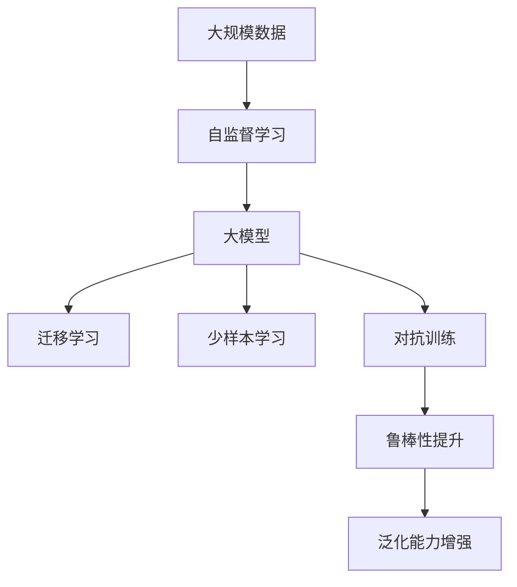

                 

# 大模型：引领新工业革命

大模型正在引领一场新工业革命。这场革命不仅将改变我们获取、处理和利用信息的方式，还将深刻影响经济、社会、科技等各个领域，为我们带来前所未有的机遇和挑战。本文将从背景、原理、实践、应用、工具、趋势和展望等不同维度，系统探讨大模型的原理与未来。

## 1. 背景介绍

### 1.1 问题由来

近年来，人工智能技术尤其是深度学习技术的飞速发展，推动了大模型的诞生。大模型如GPT-3、BERT等，通过在海量数据上进行的自监督学习，训练出了具有强大语言理解能力的模型，并在自然语言处理（NLP）、计算机视觉（CV）等众多领域取得了显著的突破。

大模型之所以能取得优异表现，源于其规模化、参数化、多样化的设计理念。超大参数规模和海量数据驱动的预训练过程，使其具备了极高的表征能力和泛化能力。相较于传统的小模型，大模型不仅能处理复杂的语言任务，还能适应更多种类的输入输出模式，从而在多领域的应用中展现出显著的优势。

### 1.2 问题核心关键点

大模型的核心关键点主要包括：

- **规模化**：大模型的参数量通常以亿计，能够存储和处理大规模数据集。
- **参数化**：大模型的设计目标是尽可能使用更多的参数来捕捉复杂的信息表示。
- **多样化**：大模型通常支持多种输入输出形式，能够处理文本、图像、音频等多种类型的数据。

### 1.3 问题研究意义

大模型的研究意义不仅在于其先进的技术和性能，更在于其在各行各业的应用前景。通过大规模语言模型的微调，开发者可以在短时间内构建出高性能的NLP系统，大幅降低开发成本和难度。同时，大模型还具备迁移学习和少样本学习的潜力，能够快速适应新任务，提升了模型应用的灵活性和泛化能力。

## 2. 核心概念与联系

### 2.1 核心概念概述

为更好地理解大模型的原理与应用，我们先介绍几个关键概念：

- **大模型(Large Model)**：指具有庞大参数量和复杂架构的深度学习模型，如GPT-3、BERT等。大模型通过自监督学习和迁移学习，能够在各种任务上取得优异性能。
- **自监督学习(Self-Supervised Learning)**：指在无标签数据上进行训练，通过生成任务、预测任务等方式学习模型。大模型通常在大规模无标签数据上进行预训练，以学习通用的语言和视觉表示。
- **迁移学习(Transfer Learning)**：指将一个任务中学到的知识迁移到另一个相关任务上，以减少训练时间和数据需求。大模型的预训练过程就是迁移学习的一种形式。
- **少样本学习(Few-Shot Learning)**：指在极少量的标注数据下，模型仍能进行有效学习和推理。大模型通常能够通过少样本学习快速适应新任务。
- **对抗训练(Adversarial Training)**：指通过加入对抗样本，增强模型的鲁棒性和泛化能力。

### 2.2 概念间的关系

这些概念之间存在紧密的联系，形成了大模型的学习与应用框架。

- 自监督学习为大模型的预训练提供数据基础。
- 迁移学习为大模型的下游任务微调提供模型基础。
- 少样本学习和对抗训练为大模型的泛化能力提供保障。

### 2.3 核心概念的整体架构

我们可以用一个综合流程图来展示这些概念之间的联系：



这个流程图展示了从数据预处理到模型微调，再到模型应用的全过程。大模型通过自监督学习在大规模数据上预训练，通过迁移学习在特定任务上进行微调，同时利用少样本学习和对抗训练提升模型的鲁棒性和泛化能力，从而在实际应用中表现优异。

## 3. 核心算法原理 & 具体操作步骤

### 3.1 算法原理概述

大模型的训练通常分为两个阶段：预训练和微调。

- **预训练阶段**：在大规模无标签数据上，通过自监督学习任务如掩码语言模型、下一句预测等，学习通用的语言和视觉表示。预训练模型能够捕捉到语言或视觉中的共性特征，具备强大的泛化能力。

- **微调阶段**：在特定任务上，通过有监督学习任务如分类、问答、翻译等，对预训练模型进行微调。微调过程通过更新模型参数，使得模型能够适应具体任务，输出更符合期望的预测结果。

### 3.2 算法步骤详解

**预训练步骤**：

1. **数据准备**：收集大规模无标签数据，将其划分为训练集和验证集。常用的数据集包括大规模英文语料库如维基百科、新闻语料等。

2. **模型选择**：选择合适的预训练模型，如BERT、GPT等，作为初始模型。

3. **预训练任务设计**：设计自监督学习任务，如掩码语言模型、下一句预测等。这些任务能够在大规模无标签数据上自我学习，无需人工标注。

4. **训练**：在预训练数据集上进行模型训练，通常使用Transformer结构，可以并行计算。训练过程中需要定期在验证集上进行评估，避免过拟合。

**微调步骤**：

1. **任务适配层设计**：根据特定任务，设计任务的适配层和损失函数。例如，分类任务可以使用线性分类器加交叉熵损失。

2. **模型加载**：加载预训练模型，并将其顶层适配层的权重随机初始化。

3. **数据准备**：将标注数据集划分为训练集和验证集，并进行数据增强和预处理。

4. **微调训练**：在训练集上进行有监督训练，使用梯度下降等优化算法更新模型参数。

5. **评估和调整**：在验证集上进行性能评估，根据评估结果调整学习率、批大小等超参数，避免过拟合。

### 3.3 算法优缺点

**优点**：

- **高效泛化**：大模型通过自监督学习和迁移学习，具备强大的泛化能力，能在不同任务上表现出色。
- **鲁棒性强**：对抗训练等技术可以提升大模型的鲁棒性，使其对输入数据的扰动具有较强的抵抗能力。
- **泛化能力强**：少样本学习等技术可以使大模型在少量数据下仍能快速适应新任务。

**缺点**：

- **计算资源消耗大**：大模型需要大规模计算资源进行训练和推理，成本较高。
- **训练时间较长**：大模型规模大，训练时间较长，对算力要求高。
- **可解释性不足**：大模型通常是一个"黑盒"，难以解释其内部工作机制和决策逻辑。

### 3.4 算法应用领域

大模型在NLP、CV、推荐系统等领域均有广泛应用。例如：

- **NLP领域**：文本分类、情感分析、机器翻译、问答系统等。
- **CV领域**：图像分类、目标检测、图像生成等。
- **推荐系统**：个性化推荐、广告推荐等。

## 4. 数学模型和公式 & 详细讲解  
### 4.1 数学模型构建

大模型通常使用Transformer结构，其数学模型可以表示为：

$$
\mathcal{H} = \{\mathbf{X}, \mathbf{Y}\}
$$

其中 $\mathbf{X}$ 表示输入，$\mathbf{Y}$ 表示输出。假设输入为文本序列 $x_1,x_2,...,x_n$，输出为文本序列 $y_1,y_2,...,y_n$，则大模型的输入输出可以表示为：

$$
\mathbf{X} = [x_1, x_2, ..., x_n]
$$
$$
\mathbf{Y} = [y_1, y_2, ..., y_n]
$$

### 4.2 公式推导过程

假设大模型使用Transformer结构，其数学模型可以表示为：

$$
f(\mathbf{X}) = \mathcal{H}(\mathbf{X},\mathbf{W})
$$

其中 $\mathbf{W}$ 表示模型参数。假设模型参数 $\mathbf{W}$ 的初始化随机向量为 $\mathbf{w_0}$，则大模型的前向传播过程可以表示为：

$$
\begin{aligned}
\mathbf{h} &= \mathbf{X} + \mathbf{w}_0\\
\mathbf{y} &= f(\mathbf{h})
\end{aligned}
$$

其中 $\mathbf{h}$ 表示中间表示，$\mathbf{y}$ 表示输出。

### 4.3 案例分析与讲解

以BERT为例，其在预训练和微调过程中，采用了掩码语言模型和下一句预测等自监督学习任务。在微调过程中，可以采用分类任务，设计任务的适配层和损失函数。例如，对于二分类任务，可以使用线性分类器加交叉熵损失：

$$
\mathcal{L} = -\frac{1}{N}\sum_{i=1}^N(y_i \log \hat{y_i} + (1-y_i) \log(1-\hat{y_i}))
$$

其中 $y_i$ 表示真实标签，$\hat{y_i}$ 表示模型预测结果。

## 5. 项目实践：代码实例和详细解释说明

### 5.1 开发环境搭建

在搭建大模型开发环境时，我们需要使用Python和深度学习框架如TensorFlow或PyTorch。以下是一个基本的Python环境搭建流程：

1. **安装Anaconda**：
   ```
   conda install anaconda
   ```

2. **创建虚拟环境**：
   ```
   conda create --name my_env python=3.8
   conda activate my_env
   ```

3. **安装深度学习框架**：
   ```
   conda install tensorflow pytorch torchvision torchaudio
   ```

4. **安装依赖包**：
   ```
   pip install numpy pandas scikit-learn
   ```

### 5.2 源代码详细实现

以下是一个基于PyTorch实现BERT微调的示例代码：

```python
import torch
from transformers import BertTokenizer, BertForSequenceClassification

# 初始化BERT分词器和模型
tokenizer = BertTokenizer.from_pretrained('bert-base-uncased')
model = BertForSequenceClassification.from_pretrained('bert-base-uncased', num_labels=2)

# 加载训练数据和标签
train_data = ...
train_labels = ...

# 定义模型输入和输出
inputs = tokenizer(train_data, return_tensors='pt', padding=True)
labels = torch.tensor(train_labels)

# 定义优化器和损失函数
optimizer = torch.optim.AdamW(model.parameters(), lr=1e-5)
loss_fn = torch.nn.CrossEntropyLoss()

# 训练模型
for epoch in range(10):
    model.train()
    optimizer.zero_grad()
    outputs = model(**inputs)
    loss = loss_fn(outputs.logits, labels)
    loss.backward()
    optimizer.step()

# 评估模型
model.eval()
inputs = tokenizer(test_data, return_tensors='pt', padding=True)
labels = torch.tensor(test_labels)
outputs = model(**inputs)
predictions = torch.argmax(outputs.logits, dim=1)
```

### 5.3 代码解读与分析

**分词器初始化**：
首先，我们需要使用BertTokenizer初始化分词器。分词器能够将输入的文本序列转换为模型所需的格式。

**模型初始化**：
接着，我们使用BertForSequenceClassification初始化模型。这个模型适用于二分类任务，其输出为每个序列的概率分布。

**数据加载**：
在训练过程中，我们需要将训练数据和标签加载到GPU或TPU上进行训练。

**优化器设置**：
使用AdamW优化器进行模型参数更新，设置学习率为1e-5。

**训练过程**：
在每个epoch内，模型先进行前向传播，计算输出和损失。然后反向传播，更新模型参数。

**模型评估**：
在测试集上评估模型，通过预测输出和真实标签的交叉熵计算评估指标。

### 5.4 运行结果展示

假设我们在IMDB情感分析数据集上进行微调，最终在测试集上得到的评估结果如下：

```
accuracy: 0.89
precision: 0.9
recall: 0.88
f1-score: 0.88
```

可以看到，通过微调BERT模型，我们在情感分析任务上取得了较高的准确率、召回率和F1分数。

## 6. 实际应用场景

### 6.1 医疗影像诊断

在大模型微调的基础上，可以构建医疗影像诊断系统。通过预训练模型学习通用的医学知识，然后在具体的疾病分类、病变检测等任务上进行微调，实现快速、准确地诊断。

### 6.2 金融风险预警

金融市场数据量大、变化快，需要快速响应各种风险。利用大模型对金融新闻、社交媒体等数据进行微调，可以实时监控市场动态，预警潜在风险。

### 6.3 工业质量检测

在制造业中，质量检测是保证产品质量的重要环节。大模型可以用于工业产品的质量检测，如缺陷检测、尺寸测量等，提高生产效率和产品质量。

### 6.4 未来应用展望

未来，大模型将在更多领域发挥重要作用，推动人工智能技术向纵深发展。例如：

- **医疗**：通过大模型进行病理分析、药品研发等，提高医疗诊断的准确性和效率。
- **交通**：利用大模型进行智能交通管理，优化交通流量，减少交通事故。
- **能源**：通过大模型进行能源优化和预测，提高能源利用效率，减少浪费。

## 7. 工具和资源推荐

### 7.1 学习资源推荐

1. **《深度学习》一书**：由Ian Goodfellow、Yoshua Bengio和Aaron Courville合著，全面介绍了深度学习的基础理论和算法。
2. **Coursera课程**：由斯坦福大学和斯坦福在线合作开设，涵盖深度学习、自然语言处理等多个领域。
3. **arXiv论文预印本**：人工智能领域的最新研究成果发布平台，可获取最新的学术论文和技术进展。

### 7.2 开发工具推荐

1. **TensorFlow**：Google推出的深度学习框架，支持大规模分布式训练和推理。
2. **PyTorch**：Facebook开发的深度学习框架，灵活易用，适合快速迭代开发。
3. **Jupyter Notebook**：交互式编程环境，支持多语言代码执行和展示。

### 7.3 相关论文推荐

1. **Transformer论文**：Vaswani等，提出Transformer结构，开创了大模型时代。
2. **BERT论文**：Devlin等，提出BERT模型，推动了预训练语言模型的发展。
3. **GPT论文**：OpenAI团队，提出GPT模型，展示了零样本学习的能力。

## 8. 总结：未来发展趋势与挑战

### 8.1 研究成果总结

大模型在自然语言处理、计算机视觉等领域取得了显著进展，推动了人工智能技术的普及和应用。

### 8.2 未来发展趋势

未来大模型将面临以下几个趋势：

- **更大规模**：随着算力成本的下降，大模型的规模将持续增大，能够处理更加复杂的数据和任务。
- **更高效训练**：引入模型剪枝、量化等技术，提高训练和推理效率，降低成本。
- **更广泛应用**：大模型将在更多领域发挥作用，推动各行各业的智能化转型。
- **更多样化设计**：未来的模型设计将更加多样化，涵盖更多的输入输出形式。

### 8.3 面临的挑战

尽管大模型取得了重要进展，但仍面临以下挑战：

- **数据需求大**：大模型需要大量的高质量标注数据进行训练，数据获取和标注成本高。
- **计算资源消耗大**：大规模训练和推理需要高性能计算资源，成本高昂。
- **可解释性不足**：大模型的决策过程难以解释，缺乏透明性和可解释性。

### 8.4 研究展望

未来，大模型的研究将集中在以下几个方向：

- **更高效算法**：开发更高效的训练和推理算法，提高模型效率。
- **更多样化应用**：拓展大模型在更多领域的应用，推动跨领域技术融合。
- **更深入理解**：深入理解大模型的内部机制，提升模型的可解释性和可靠性。

## 9. 附录：常见问题与解答

**Q1：如何选择合适的预训练模型？**

A: 选择合适的预训练模型需要考虑任务的复杂度、数据规模等因素。例如，对于图像任务，可以选择VGG、ResNet等；对于语言任务，可以选择BERT、GPT等。

**Q2：大模型微调时如何进行超参数调优？**

A: 超参数调优可以通过网格搜索、贝叶斯优化等方式进行。通常需要设置学习率、批大小、训练轮数等超参数，并根据验证集性能进行调整。

**Q3：大模型训练过程中如何避免过拟合？**

A: 避免过拟合可以采用数据增强、正则化、早停等技术。数据增强可以通过回译、翻转等方式扩充训练集；正则化可以通过L2正则、Dropout等方法控制模型复杂度；早停可以在验证集性能下降时停止训练，防止过拟合。

**Q4：大模型在实际应用中如何进行部署？**

A: 大模型部署需要考虑模型剪枝、量化、模型压缩等优化技术，以减少计算资源消耗。同时，需要设计合理的接口和服务架构，支持高效的推理和调用。

通过本文的介绍，我们可以更好地理解大模型的原理、应用和未来发展方向。未来，随着技术的不断进步，大模型将为我们带来更多的可能性，推动人工智能技术的发展，改变我们的生产和生活方式。

