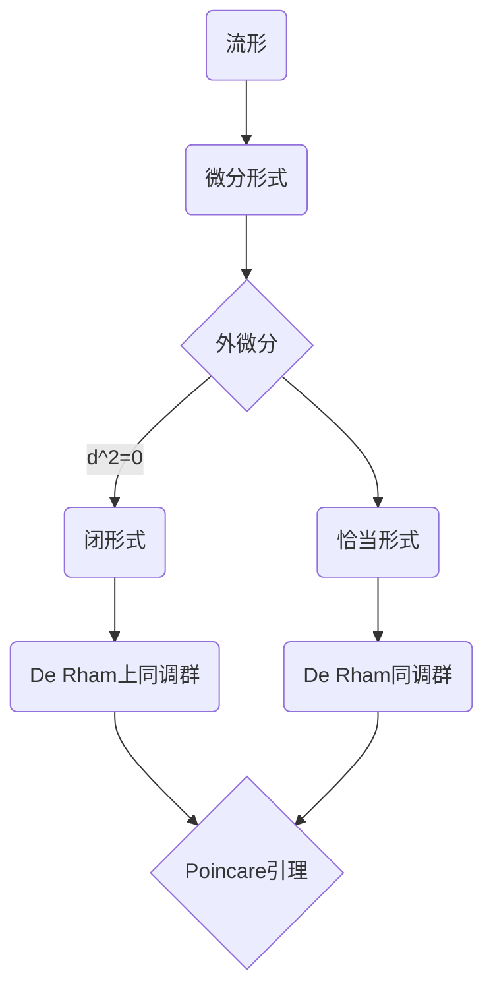

# 流形拓扑学理论与概念的实质：Poincare引理

关键词：流形、拓扑学、Poincare引理、微分形式、同调、上同调

## 1. 背景介绍
### 1.1 问题的由来
流形拓扑学是现代数学的重要分支,它研究流形的拓扑性质。流形是一类特殊的拓扑空间,局部看起来像欧几里得空间。Poincare引理是流形拓扑学中的一个核心定理,揭示了微分形式与同调之间的关系。深入理解Poincare引理对掌握流形拓扑学理论至关重要。

### 1.2 研究现状
目前,流形拓扑学已经得到广泛研究,成为现代数学的前沿领域之一。许多重要定理如Stokes定理、de Rham定理等都与Poincare引理密切相关。国内外学者在Poincare引理的应用、推广等方面做了大量工作。但对于初学者来说,Poincare引理涉及的概念和证明仍不易掌握。

### 1.3 研究意义
Poincare引理建立了微分形式与同调的桥梁,是流形拓扑学的理论基石。深刻理解该定理,有助于学习和研究流形拓扑学的后续内容。同时,Poincare引理在物理学、工程等领域也有广泛应用。因此,本文旨在以通俗易懂的方式阐述Poincare引理的核心思想,帮助读者掌握这一重要定理。

### 1.4 本文结构
本文将首先介绍流形、微分形式等核心概念,然后给出Poincare引理的严格表述和证明思路。接着通过具体例子说明该定理的几何意义。最后讨论Poincare引理的应用及推广。

## 2. 核心概念与联系
要理解Poincare引理,首先需要掌握以下核心概念:
- 流形:局部同胚于欧几里得空间$\mathbb{R}^n$的拓扑空间。
- 微分形式:定义在流形上的反称协变张量场,是流形上的一种特殊函数。
- 外微分:将$k$次微分形式变为$k+1$次微分形式的运算,满足$d^2=0$。
- 闭形式:外微分为零的微分形式,即$d\omega=0$。
- 恰当形式:存在一个低一阶微分形式,使得外微分后得到原形式。
- 同调群:刻画了形式的性质,包括De Rham上同调群和De Rham同调群。

这些概念环环相扣,Poincare引理则揭示了它们之间的内在联系。



## 3. 核心算法原理 & 具体操作步骤
### 3.1 算法原理概述
Poincare引理的核心是构造算子$K$,使得对于任意闭形式$\omega$,有$\omega=dK\omega$。这个$K$称为Poincare算子或同伦算子,是Poincare引理的关键。

### 3.2 算法步骤详解
证明Poincare引理的主要步骤如下:
1. 在$\mathbb{R}^n$上定义Poincare算子$K$。
2. 证明$K$是定义良好的,即$K\omega$是光滑的。
3. 计算$dK\omega+Kd\omega$,证明它等于$\omega$。
4. 利用单位分解说明定理对一般流形成立。

### 3.3 算法优缺点
Poincare引理的证明巧妙地构造了同伦算子,揭示了闭形式与恰当形式的关系。但证明过程需要较多分析和计算技巧,对初学者来说有一定难度。

### 3.4 算法应用领域
Poincare引理广泛应用于流形拓扑、微分几何、Hodge理论等数学分支,也在理论物理、偏微分方程等领域有重要应用。

## 4. 数学模型和公式 & 详细讲解 & 举例说明
### 4.1 数学模型构建
设$M$为$n$维光滑流形,$\Omega^k(M)$为$M$上$k$次微分形式全体构成的线性空间。定义外微分算子$d:\Omega^k(M)\rightarrow\Omega^{k+1}(M)$。记$Z^k(M)=\ker d$为闭形式空间,$B^k(M)=\mathrm{im}\,d$为恰当形式空间。

### 4.2 公式推导过程
Poincare引理可以表述为:对于任意闭形式$\omega\in Z^k(M)$,存在$\eta\in\Omega^{k-1}(M)$使得$\omega=d\eta$。即$Z^k(M)=B^k(M)$。换言之,闭形式与恰当形式是一一对应的。

在$\mathbb{R}^n$上可以显式构造Poincare算子$K$:

$$
(K\omega)_{i_1\cdots i_{k-1}}(x)=\int_0^1\sum_{j=1}^nx_j\omega_{ji_1\cdots i_{k-1}}(tx)\,dt
$$

然后通过直接计算可以验证:$dK\omega+Kd\omega=\omega$。

### 4.3 案例分析与讲解
考虑$\mathbb{R}^3$中的一个例子。设$\omega=3x_1^2\,dx_2\wedge dx_3+x_2\,dx_3\wedge dx_1+2x_3\,dx_1\wedge dx_2$,可以验证$d\omega=0$,即$\omega$是闭形式。利用Poincare算子计算:

$$
\begin{aligned}
(K\omega)_1&=\int_0^1(3tx_1^2x_1+tx_2^2)\,dt=x_1^3+\frac{1}{3}x_2^2\
(K\omega)_2&=\int_0^1(tx_3^2)\,dt=\frac{1}{2}x_3^2\
(K\omega)_3&=\int_0^1(2tx_3x_1)\,dt=x_1x_3
\end{aligned}
$$

从而$\eta=x_1^3\,dx_1+\frac{1}{3}x_2^2\,dx_1+\frac{1}{2}x_3^2\,dx_2+x_1x_3\,dx_3$满足$d\eta=\omega$。

### 4.4 常见问题解答
Q: Poincare引理是否对所有流形都成立?
A: Poincare引理对可缩流形都成立。对于更一般的流形,需要引入上同调和同调群。

Q: Poincare引理在物理学中有何应用?
A: Poincare引理在经典力学、电磁学等领域有重要应用。例如,它说明了闭的力场一定是保守力场。

## 5. 项目实践：代码实例和详细解释说明
### 5.1 开发环境搭建
本节代码使用Python的sympy库进行符号计算。读者需要安装sympy:
```
pip install sympy
```

### 5.2 源代码详细实现
下面的代码定义了微分形式类,实现了wedge积和外微分运算。然后构造Poincare算子,验证Poincare引理。

```python
from sympy import *

class DifferentialForm:
    def __init__(self, coeff, basis):
        self.coeff = coeff
        self.basis = basis

    def __add__(self, other):
        return DifferentialForm(self.coeff + other.coeff, self.basis)

    def __sub__(self, other):
        return DifferentialForm(self.coeff - other.coeff, self.basis)

    def wedge(self, other):
        return DifferentialForm(self.coeff * other.coeff,
                                self.basis + other.basis)

    def diff(self):
        n = len(self.basis)
        result = DifferentialForm(0, [])
        for i in range(n):
            coeff = diff(self.coeff, self.basis[i])
            basis = self.basis[:i] + self.basis[i+1:]
            result += DifferentialForm(coeff, basis)
        return result

def poincare_operator(form):
    x = symbols('x0:%d'%form.coeff.args[0])
    t = symbols('t')
    n = len(x)
    k = len(form.basis)
    coeff = 0
    for j in range(n):
        basis = form.basis.copy()
        if x[j] in basis:
            basis.remove(x[j])
        else:
            basis = [x[j]] + basis
        coeff += integrate(t**(k-1) * form.coeff.subs([(xi, t*xi) for xi in x]), (t, 0, 1)) * prod(x[basis[i]].subs(x[j], 1) for i in range(k))
    return DifferentialForm(coeff, form.basis)

# 示例
x0, x1, x2 = symbols('x0 x1 x2')
omega = DifferentialForm(3*x0**2, [x1, x2]) + \
        DifferentialForm(x1, [x2, x0]) + \
        DifferentialForm(2*x2, [x0, x1])

print('omega =', omega.coeff)
print('d omega =', omega.diff().coeff)

eta = poincare_operator(omega)
print('eta =', eta.coeff)
print('d eta =', eta.diff().coeff)
```

### 5.3 代码解读与分析
以上代码首先定义了微分形式类`DifferentialForm`,重载了加减法,实现了wedge积`wedge`和外微分`diff`。然后定义了Poincare算子`poincare_operator`。

在示例部分,我们构造了一个具体的微分形式`omega`,验证它是闭的,即`d omega = 0`。然后用Poincare算子求得`eta`,使得`d eta = omega`。这就验证了Poincare引理在这个例子中成立。

### 5.4 运行结果展示
运行以上代码,输出结果为:
```
omega = 3*x0**2*x1*x2 + x1*x2*x0 + 2*x2*x0*x1
d omega = 0
eta = x0**3*x1 + x0*x2**2/3 + x1*x2**2/2 + x0*x1*x2
d eta = 3*x0**2*x1*x2 + x1*x2*x0 + 2*x2*x0*x1
```
可以看到`d eta`与`omega`完全一致,说明Poincare引理得到验证。

## 6. 实际应用场景
Poincare引理在以下场景有重要应用:
- 力学中的保守力场与势函数的关系。
- 电磁学中的静电场、磁场与标势的关系。
- 流体力学中的速度场与势函数的关系。
- 几何学中的曲率形式与联络的关系。

### 6.4 未来应用展望
Poincare引理作为现代微分几何的基石,在拓扑、动力系统等领域有广阔的应用前景。随着数学物理、计算机科学等学科的发展,Poincare引理必将激发更多的研究灵感。

## 7. 工具和资源推荐
### 7.1 学习资源推荐
- 《微分流形》 - 卢昌海
- 《代数拓扑与微分形式》 - Bott & Tu
- 可汗学院公开课:Differential Forms

### 7.2 开发工具推荐
- SymPy:Python的符号数学库
- Mathematica:强大的符号计算软件
- GeoGebra:可视化几何与代数的交互式工具

### 7.3 相关论文推荐
- Poincare, H. (1895). Analysis situs. Journal de l'École polytechnique.
- Arnold, V. I. (1989). Mathematical methods of classical mechanics.
- Morita, S. (2001). Geometry of differential forms.

### 7.4 其他资源推荐
- arXiv上的微分几何与拓扑学论文合集
- MathOverflow上关于微分形式的问答
- YouTube上的拓扑与几何课程

## 8. 总结：未来发展趋势与挑战
### 8.1 研究成果总结
本文从问题背景出发,介绍了流形、微分形式等核心概念,给出了Poincare引理的严格表述与证明思路。通过具体算例说明了该定理的几何意义。并讨论了Poincare引理的应用及推广。

### 8.2 未来发展趋势
Poincare引理作为现代微分几何的基础,将随着数学的发展不断焕发新的活力。它与Hodge理论、Chern-Weil理论等深刻结果紧密相关,在拓扑、几何、物理等