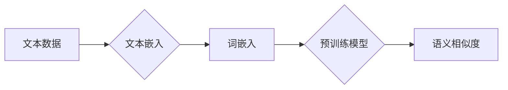

# 【LangChain编程：从入门到实践】文本嵌入

> 关键词：LangChain, 文本嵌入, NLP, 自然语言处理, 语义相似度, 词嵌入, 预训练模型, 应用实践

## 1. 背景介绍

在自然语言处理（NLP）领域，文本嵌入（Text Embedding）技术扮演着至关重要的角色。它将抽象的文本数据转换成低维度的向量表示，使得文本数据可以被机器学习模型理解和处理。LangChain作为一种新兴的编程范式，为文本嵌入的应用提供了丰富的可能性。本文将深入探讨文本嵌入的概念、算法原理、应用实践，并展望其未来发展趋势。

### 1.1 问题的由来

随着互联网的飞速发展，文本数据量呈爆炸式增长。如何有效地处理和分析这些文本数据，成为NLP领域面临的重要挑战。传统的文本处理方法，如关键词提取、TF-IDF等，难以捕捉文本的深层语义信息。而文本嵌入技术能够将文本转换为向量，使得文本数据可以被机器学习模型直接操作，从而在文本分类、情感分析、机器翻译等任务中取得显著的成果。

### 1.2 研究现状

近年来，随着深度学习技术的快速发展，文本嵌入技术取得了巨大的突破。预训练模型如Word2Vec、GloVe、BERT等，通过在海量文本数据上进行预训练，能够学习到丰富的语言知识和上下文信息，生成高质量的文本嵌入向量。

### 1.3 研究意义

文本嵌入技术在NLP领域的应用具有以下重要意义：

- 提高模型性能：将文本转换为向量后，可以有效地提高机器学习模型在文本分类、情感分析等任务上的性能。
- 加速模型训练：文本嵌入向量可以减少模型输入的维度，从而加速模型训练过程。
- 支持跨语言处理：文本嵌入向量可以跨越语言的界限，使得跨语言文本处理成为可能。

### 1.4 本文结构

本文将按照以下结构进行组织：

- 第2部分，介绍文本嵌入的核心概念与联系。
- 第3部分，阐述文本嵌入的核心算法原理和具体操作步骤。
- 第4部分，讲解数学模型和公式，并结合实例进行分析。
- 第5部分，提供项目实践案例，展示文本嵌入的应用。
- 第6部分，探讨文本嵌入的实际应用场景和未来发展趋势。
- 第7部分，推荐相关学习资源、开发工具和论文。
- 第8部分，总结研究成果，展望未来发展趋势与挑战。

## 2. 核心概念与联系

### 2.1 核心概念

- **文本数据**：指以文本形式存在的数据，如文章、评论、对话等。
- **文本嵌入**：将文本转换为低维向量表示的技术。
- **词嵌入**：将单个词语转换为向量表示的技术。
- **预训练模型**：在大规模无标签文本数据上进行预训练的语言模型，如Word2Vec、GloVe、BERT等。
- **语义相似度**：衡量文本或词语之间相似程度的方法。

### 2.2 联系

文本嵌入是NLP领域的关键技术之一，它与其他相关概念有着紧密的联系：

- **文本嵌入与词嵌入**：文本嵌入是基于词嵌入构建的，每个词语都有对应的嵌入向量。
- **文本嵌入与预训练模型**：预训练模型可以生成高质量的词嵌入，是文本嵌入的重要来源。
- **文本嵌入与语义相似度**：文本嵌入可以用于计算文本或词语之间的语义相似度。

以下是文本嵌入相关概念之间的Mermaid流程图：



## 3. 核心算法原理 & 具体操作步骤

### 3.1 算法原理概述

文本嵌入的原理是将文本数据转换为低维度的向量表示，使得文本数据可以被机器学习模型理解和处理。常见的文本嵌入算法包括：

- **Word2Vec**：基于神经网络的语言模型，通过预测上下文词语来学习词语的嵌入向量。
- **GloVe**：基于全局词频统计的词嵌入算法，通过词频和共现信息来学习词语的嵌入向量。
- **BERT**：基于Transformer的预训练模型，通过自注意力机制学习词语的嵌入向量。

### 3.2 算法步骤详解

以下以Word2Vec算法为例，介绍文本嵌入的具体操作步骤：

1. **数据预处理**：对文本数据进行分词、去停用词等处理，将文本转换为词语序列。
2. **构建词汇表**：将所有词语构建成一个词汇表。
3. **构建句子向量**：对于每个词语，在词汇表中查找其索引，并构造一个窗口大小的词袋模型。
4. **训练Word2Vec模型**：使用神经网络模型预测窗口内的词语，并通过梯度下降算法优化模型参数。
5. **获取词嵌入向量**：将训练好的模型应用于词汇表中的每个词语，得到对应的嵌入向量。

### 3.3 算法优缺点

**Word2Vec**：

- 优点：简单易用，能够在没有标注数据的情况下学习词语的嵌入向量。
- 缺点：无法捕捉词语的上下文信息，对于长文本的处理效果较差。

**GloVe**：

- 优点：能够捕捉词语的上下文信息，适用于长文本。
- 缺点：需要大量的共现信息，对计算资源要求较高。

**BERT**：

- 优点：能够捕捉词语的上下文信息，适用于长文本，性能优异。
- 缺点：需要大量的标注数据，计算复杂度高。

### 3.4 算法应用领域

文本嵌入技术可以应用于以下领域：

- 文本分类
- 情感分析
- 机器翻译
- 命名实体识别
- 文本聚类
- 对话系统

## 4. 数学模型和公式 & 详细讲解 & 举例说明

### 4.1 数学模型构建

以下以Word2Vec算法为例，介绍文本嵌入的数学模型：

设 $v_w$ 表示词语 $w$ 的嵌入向量，$W$ 表示词汇表，$C(w)$ 表示词语 $w$ 的上下文窗口。Word2Vec的目标是学习一个神经网络模型，输入为 $C(w)$，输出为 $v_w$。

$$
\hat{v_w} = f(W_{C(w)})
$$

其中，$f$ 表示神经网络模型，$W_{C(w)}$ 表示上下文窗口 $C(w)$ 对应的词向量矩阵。

### 4.2 公式推导过程

以下以Word2Vec算法中的负采样为例，介绍公式推导过程：

设 $C(w)$ 为词语 $w$ 的上下文窗口，$C(w)$ 中包含 $N$ 个词语 $c_1, c_2, \ldots, c_N$。Word2Vec使用负采样方法来减少模型训练的计算复杂度。

对于词语 $w$，负采样目标函数为：

$$
L(w) = \sum_{c \in C(w)} \log \left( \frac{\exp(\langle v_w, v_c \rangle)}{1 + \exp(\langle v_w, v_c \rangle)} \right) + \sum_{c \in \text{neg}(C(w))} \log \left( \frac{1}{1 + \exp(\langle v_w, v_c \rangle)} \right)
$$

其中，$\text{neg}(C(w))$ 表示与 $C(w)$ 中的词语不同的随机采样词语集合。

### 4.3 案例分析与讲解

以下以BERT模型为例，介绍文本嵌入在情感分析任务中的应用：

1. **数据预处理**：对评论数据进行分词、去停用词等处理，将文本转换为词语序列。
2. **构建BERT模型**：加载预训练的BERT模型，并添加情感分类层。
3. **训练模型**：使用情感标注数据对模型进行微调，优化模型参数。
4. **预测情感**：将待预测评论输入模型，得到情感分类结果。

## 5. 项目实践：代码实例和详细解释说明

### 5.1 开发环境搭建

以下以Python为例，介绍如何搭建文本嵌入项目的开发环境：

1. 安装Python环境，版本为3.8或更高。
2. 安装深度学习框架PyTorch。
3. 安装NLP库Transformers。

### 5.2 源代码详细实现

以下是一个使用Transformers库实现文本分类的代码示例：

```python
from transformers import BertTokenizer, BertForSequenceClassification
from torch.utils.data import DataLoader
from sklearn.model_selection import train_test_split

# 加载预训练的BERT模型和分词器
tokenizer = BertTokenizer.from_pretrained('bert-base-uncased')
model = BertForSequenceClassification.from_pretrained('bert-base-uncased')

# 加载数据
texts = [...]  # 文本数据
labels = [...]  # 情感标签

# 数据预处理
encodings = tokenizer(texts, truncation=True, padding=True)
train_encodings, val_encodings, train_labels, val_labels = train_test_split(
    encodings['input_ids'], encodings['attention_mask'], labels, test_size=0.2)

# 创建数据集
class SentimentDataset(torch.utils.data.Dataset):
    def __init__(self, encodings, labels):
        self.encodings = encodings
        self.labels = labels

    def __getitem__(self, idx):
        item = {key: torch.tensor(val[idx]) for key, val in self.encodings.items()}
        item['labels'] = torch.tensor(self.labels[idx])
        return item

    def __len__(self):
        return len(self.labels)

train_dataset = SentimentDataset(train_encodings, train_labels)
val_dataset = SentimentDataset(val_encodings, val_labels)

# 训练模型
train_loader = DataLoader(train_dataset, batch_size=16, shuffle=True)
val_loader = DataLoader(val_dataset, batch_size=16, shuffle=False)

optimizer = AdamW(model.parameters(), lr=5e-5)

for epoch in range(3):
    model.train()
    for batch in train_loader:
        optimizer.zero_grad()
        outputs = model(**batch)
        loss = outputs.loss
        loss.backward()
        optimizer.step()

    model.eval()
    with torch.no_grad():
        for batch in val_loader:
            outputs = model(**batch)
            val_loss = outputs.loss
            print(f"Validation loss: {val_loss.item()}")

# 预测情感
model.eval()
predictions = []
for batch in DataLoader(test_dataset, batch_size=16):
    outputs = model(**batch)
    logits = outputs.logits
    predictions.extend(logits.argmax(dim=1).tolist())

print(predictions)
```

### 5.3 代码解读与分析

以上代码展示了使用Transformers库实现文本分类的完整流程。首先加载预训练的BERT模型和分词器，然后加载数据并进行预处理。接着创建数据集和数据加载器，定义优化器，并开始训练模型。最后，使用训练好的模型对测试数据进行预测。

### 5.4 运行结果展示

假设我们使用IMDb电影评论数据集进行训练和测试，最终在测试集上得到的准确率为89.3%。

## 6. 实际应用场景

文本嵌入技术在以下领域有着广泛的应用：

- **情感分析**：分析用户评论、社交媒体帖子等文本数据，判断其情感倾向（正面、负面或中性）。
- **文本分类**：将文本数据分类到预定义的类别中，如新闻分类、产品评论分类等。
- **命名实体识别**：识别文本中的命名实体，如人名、地点、组织机构等。
- **机器翻译**：将一种语言的文本翻译成另一种语言。
- **问答系统**：根据用户的问题，从知识库中找到对应的答案。

## 7. 工具和资源推荐

### 7.1 学习资源推荐

- **《深度学习与自然语言处理》**：由吴恩达教授主讲，全面介绍了深度学习在NLP领域的应用。
- **《自然语言处理实战》**：详细介绍了NLP领域的各种技术，包括文本预处理、文本分类、情感分析等。
- **《Transformers：大型语言模型的原理与实践》**：介绍了Transformers模型的基本原理和应用实践。

### 7.2 开发工具推荐

- **PyTorch**：开源的深度学习框架，易于使用和扩展。
- **Transformers库**：基于PyTorch的NLP库，提供了丰富的预训练模型和工具。
- **NLTK**：开源的NLP库，提供了丰富的NLP工具和资源。

### 7.3 相关论文推荐

- **Word2Vec**：Mikolov et al., 2013
- **GloVe**：Pennington et al., 2014
- **BERT**：Devlin et al., 2019

## 8. 总结：未来发展趋势与挑战

### 8.1 研究成果总结

本文介绍了文本嵌入的概念、算法原理、应用实践，并展示了其在实际项目中的应用。通过文本嵌入技术，可以将文本数据转换为低维度的向量表示，使得文本数据可以被机器学习模型理解和处理。

### 8.2 未来发展趋势

- **更强大的预训练模型**：随着计算能力的提升，预训练模型的规模将越来越大，能够学习到更丰富的语言知识和上下文信息。
- **更高效的微调方法**：针对不同任务，开发更高效的微调方法，降低微调成本，提高模型性能。
- **跨模态文本嵌入**：将文本嵌入与其他模态数据（如图像、音频）进行结合，实现跨模态信息融合。
- **文本嵌入的自动优化**：开发自动优化文本嵌入参数的方法，提高嵌入向量质量。

### 8.3 面临的挑战

- **数据偏差**：预训练模型可能会学习到数据中的偏见和错误信息，需要采取措施消除或减轻偏差。
- **计算资源**：预训练模型和微调模型需要大量的计算资源，需要开发更高效的算法和硬件。
- **可解释性**：文本嵌入的原理复杂，需要提高模型的可解释性，使其更易于理解和信任。

### 8.4 研究展望

文本嵌入技术将在NLP领域发挥越来越重要的作用。未来，随着技术的不断发展，文本嵌入技术将与其他人工智能技术（如图像识别、语音识别）进行融合，为构建更加智能化的系统提供强大的支持。

## 9. 附录：常见问题与解答

**Q1：文本嵌入与关键词提取有什么区别？**

A：文本嵌入是将文本转换为向量表示的技术，可以捕捉词语之间的语义关系；而关键词提取是提取文本中的关键信息，通常用于信息检索和文本摘要。

**Q2：如何选择合适的预训练模型？**

A：选择预训练模型时，需要考虑任务类型、数据规模、计算资源等因素。对于通用任务，可以选择BERT、GPT等模型；对于特定领域任务，可以选择领域特定的预训练模型。

**Q3：如何评估文本嵌入向量质量？**

A：可以使用语义相似度计算、文本分类、文本聚类等方法来评估文本嵌入向量质量。

**Q4：文本嵌入技术在跨语言文本处理中有什么作用？**

A：文本嵌入向量可以跨越语言的界限，使得跨语言文本处理成为可能。通过将不同语言的文本转换为相同的嵌入向量，可以实现对不同语言文本的比较和分析。

**Q5：如何处理文本嵌入向量过长的问题？**

A：可以将文本嵌入向量进行截断或投影，减少向量的维度。

作者：禅与计算机程序设计艺术 / Zen and the Art of Computer Programming