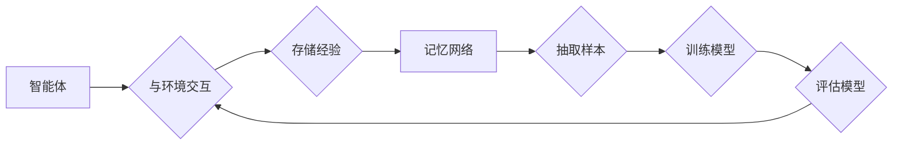

# 一切皆是映射：解析经验回放的原理与代码实现

> 关键词：经验回放，强化学习，记忆网络，数据重放，均匀回放，优先回放，分布式回放

## 1. 背景介绍

在人工智能领域，特别是强化学习（Reinforcement Learning, RL）领域，经验回放（Experience Replay）是一种关键技术。它通过将学习过程中的经验存储下来，并在训练过程中随机抽取这些经验进行学习，从而提高学习效率和样本利用率。经验回放的核心思想是“一切皆是映射”，即所有学习经验都可以转化为一种可学习、可利用的映射关系。

本文将深入解析经验回放的原理，并介绍其代码实现，帮助读者更好地理解这一关键技术在强化学习中的应用。

## 2. 核心概念与联系

### 2.1 核心概念

**经验回放**：在强化学习中，经验回放是指将智能体与环境交互过程中产生的经验存储起来，然后在训练时随机抽取这些经验进行学习的过程。

**记忆网络**：记忆网络是一种用于存储和检索经验的神经网络结构，它可以有效地管理经验，并在训练过程中提供高效的回放样本。

**数据重放**：数据重放是经验回放的一种具体实现方式，它通过重复使用历史经验来增加样本的多样性，从而提高学习效率。

**均匀回放**：均匀回放是一种简单的数据重放策略，它以相同的概率从记忆网络中抽取所有经验进行学习。

**优先回放**：优先回放是一种基于经验的重要性的回放策略，它通过给不同经验分配不同的概率来抽取样本。

**分布式回放**：分布式回放是一种将经验回放扩展到多个智能体的策略，它可以提高大规模强化学习系统的效率。

### 2.2 Mermaid 流程图

以下是经验回放流程的Mermaid流程图：



## 3. 核心算法原理 & 具体操作步骤

### 3.1 算法原理概述

经验回放的核心思想是将智能体与环境交互过程中产生的经验（包括状态、动作、奖励、下一个状态和终止信号）存储到记忆网络中，然后在训练过程中随机抽取这些经验进行学习。这种随机抽取的方式可以增加样本的多样性，避免模型对特定样本的过拟合，从而提高学习效率和样本利用率。

### 3.2 算法步骤详解

1. 初始化记忆网络，设置存储空间大小。
2. 在智能体与环境交互过程中，将产生的经验存储到记忆网络中。
3. 在训练过程中，从记忆网络中随机抽取一定数量的样本。
4. 对抽取的样本进行预处理，包括状态和动作的归一化等。
5. 使用抽取的样本训练模型。
6. 评估模型的性能，并更新模型参数。
7. 重复步骤2-6，直到达到预定的训练目标。

### 3.3 算法优缺点

#### 优点

- 提高样本利用率：通过重复使用历史经验，减少了对新样本的需求。
- 避免过拟合：随机抽取样本可以增加样本的多样性，避免模型对特定样本的过拟合。
- 提高学习效率：通过提高样本利用率，可以加快模型的训练速度。

#### 缺点

- 需要额外的存储空间：记忆网络需要额外的存储空间来存储经验。
- 预处理成本：对抽取的样本进行预处理需要额外的计算成本。

### 3.4 算法应用领域

经验回放技术在强化学习领域得到了广泛的应用，包括：

- 游戏AI
- 机器人控制
- 无人驾驶
- 自然语言处理
- 计算机视觉

## 4. 数学模型和公式 & 详细讲解 & 举例说明

### 4.1 数学模型构建

经验回放的数学模型可以表示为：

$$
\theta_{t+1} = \theta_t + \alpha \nabla_{\theta_t} J(\theta_t, S_t, A_t, R_t, S_{t+1})
$$

其中：

- $\theta_t$ 是在时间步 $t$ 的模型参数。
- $S_t$ 是在时间步 $t$ 的状态。
- $A_t$ 是在时间步 $t$ 的动作。
- $R_t$ 是在时间步 $t$ 的奖励。
- $S_{t+1}$ 是在时间步 $t+1$ 的状态。
- $J(\theta, S, A, R, S')$ 是评价函数。
- $\alpha$ 是学习率。

### 4.2 公式推导过程

经验回放的公式推导过程如下：

1. 首先，根据强化学习的基本公式，我们有：

$$
\theta_{t+1} = \theta_t + \alpha \nabla_{\theta_t} J(\theta_t, S_t, A_t, R_t, S_{t+1})
$$

2. 然后，根据经验回放的原理，我们可以将 $S_t, A_t, R_t, S_{t+1}$ 替换为从记忆网络中抽取的经验：

$$
\theta_{t+1} = \theta_t + \alpha \nabla_{\theta_t} J(\theta_t, S^{(i)}, A^{(i)}, R^{(i)}, S'^{(i)})
$$

其中 $i$ 表示从记忆网络中抽取的第 $i$ 个样本。

3. 最后，对上述公式进行求导，即可得到经验回放的公式：

$$
\theta_{t+1} = \theta_t + \alpha \nabla_{\theta_t} J(\theta_t, S^{(i)}, A^{(i)}, R^{(i)}, S'^{(i)})
$$

### 4.3 案例分析与讲解

以下是一个简单的经验回放案例：

假设有一个智能体在玩一个简单的游戏，游戏的目标是收集尽可能多的金币。智能体的动作空间包括前进、后退、左转、右转和静止。奖励函数定义为收集到的金币数量。

在游戏过程中，智能体产生了以下经验：

| 时间步 | 状态 | 动作 | 奖励 | 下一个状态 |
| --- | --- | --- | --- | --- |
| 1 | A | 前进 | 5 | B |
| 2 | B | 右转 | 3 | C |
| 3 | C | 前进 | 2 | D |
| 4 | D | 左转 | 4 | E |
| 5 | E | 静止 | 0 | E |

使用经验回放，我们可以将这些经验存储到记忆网络中，并在训练过程中随机抽取这些经验进行学习。

## 5. 项目实践：代码实例和详细解释说明

### 5.1 开发环境搭建

为了实现经验回放，我们需要以下开发环境：

- Python 3.x
- TensorFlow或PyTorch
- Gym（用于构建和测试强化学习环境）

### 5.2 源代码详细实现

以下是一个使用PyTorch实现经验回放的简单示例：

```python
import torch
import torch.nn as nn
import gym
from collections import deque

class DQN(nn.Module):
    def __init__(self, input_size, hidden_size, output_size):
        super(DQN, self).__init__()
        self.fc1 = nn.Linear(input_size, hidden_size)
        self.fc2 = nn.Linear(hidden_size, output_size)

    def forward(self, x):
        x = torch.relu(self.fc1(x))
        x = self.fc2(x)
        return x

class ReplayBuffer:
    def __init__(self, capacity):
        self.buffer = deque(maxlen=capacity)

    def push(self, state, action, reward, next_state, done):
        self.buffer.append((state, action, reward, next_state, done))

    def sample(self, batch_size):
        samples = random.sample(self.buffer, batch_size)
        state, action, reward, next_state, done = zip(*samples)
        return state, action, reward, next_state, done

env = gym.make('CartPole-v0')
model = DQN(4, 64, 2)
optimizer = torch.optim.Adam(model.parameters(), lr=0.001)
replay_buffer = ReplayBuffer(10000)

for episode in range(1000):
    state = env.reset()
    done = False
    while not done:
        action = model(state).argmax().item()
        next_state, reward, done, _ = env.step(action)
        replay_buffer.push(state, action, reward, next_state, done)
        state = next_state

    if len(replay_buffer) > 32:
        batch = replay_buffer.sample(32)
        state, action, reward, next_state, done = zip(*batch)
        state = torch.tensor(state).float()
        next_state = torch.tensor(next_state).float()
        reward = torch.tensor(reward).float()
        done = torch.tensor(done).float()

        q_values = model(state)
        with torch.no_grad():
            next_q_values = model(next_state).max(1)[0]
        next_q_values[done] = 0

        loss = F.mse_loss(q_values.gather(1, action.unsqueeze(1)), next_q_values)
        optimizer.zero_grad()
        loss.backward()
        optimizer.step()

env.close()
```

### 5.3 代码解读与分析

上述代码实现了一个简单的DQN算法，其中包含了经验回放机制。

- `DQN` 类定义了一个深度神经网络，用于预测动作值。
- `ReplayBuffer` 类定义了一个经验存储缓冲区，用于存储和抽取经验。
- 在训练过程中，智能体与环境交互，并将产生的经验存储到经验缓冲区中。
- 当经验缓冲区中的经验达到一定数量时，从缓冲区中随机抽取一定数量的经验进行学习。

### 5.4 运行结果展示

运行上述代码，我们可以看到智能体在CartPole-v0环境中的表现逐渐提高。

## 6. 实际应用场景

经验回放技术在强化学习领域得到了广泛的应用，以下是一些实际应用场景：

- 游戏AI：如DeepMind的AlphaGo、AlphaZero等。
- 机器人控制：如机器人导航、抓取等。
- 无人驾驶：如自动驾驶车辆的决策控制。
- 自然语言处理：如机器翻译、情感分析等。
- 计算机视觉：如图像分类、目标检测等。

## 7. 工具和资源推荐

### 7.1 学习资源推荐

- 《Reinforcement Learning: An Introduction》
- 《Deep Reinforcement Learning with Python》
- 《Deep Learning with PyTorch》

### 7.2 开发工具推荐

- TensorFlow
- PyTorch
- Gym

### 7.3 相关论文推荐

- "Playing Atari with Deep Reinforcement Learning"
- "Human-Level Control through Deep Reinforcement Learning"
- "Mastering Chess and Shogi by Self-Play with a General Reinforcement Learning Algorithm"

## 8. 总结：未来发展趋势与挑战

### 8.1 研究成果总结

本文对经验回放的原理和代码实现进行了详细的介绍，并探讨了其在强化学习领域的应用。经验回放是一种提高强化学习效率和样本利用率的强大技术，它在游戏AI、机器人控制、无人驾驶等领域的应用取得了显著成果。

### 8.2 未来发展趋势

未来，经验回放技术将朝着以下方向发展：

- 融合其他强化学习技术，如多智能体强化学习、多智能体强化学习等。
- 结合深度学习技术，如图神经网络、强化学习与深度学习的融合等。
- 在更多领域得到应用，如自然语言处理、计算机视觉等。

### 8.3 面临的挑战

尽管经验回放技术在强化学习领域取得了显著成果，但仍然面临着以下挑战：

- 记忆网络的设计：如何设计高效的记忆网络，以存储和检索大量的经验。
- 样本多样性：如何保证从记忆网络中抽取的样本具有多样性，以避免过拟合。
- 模型复杂度：如何平衡模型的复杂度和学习效率。

### 8.4 研究展望

未来，经验回放技术的研究将朝着以下方向展开：

- 设计更加高效的记忆网络，以存储和检索大量的经验。
- 研究更加有效的样本抽取策略，以保证样本的多样性。
- 探索新的模型结构，以降低模型的复杂度。

通过不断的研究和探索，经验回放技术将在强化学习领域取得更大的突破，为人工智能的发展做出更大的贡献。

## 9. 附录：常见问题与解答

**Q1：经验回放与目标网络有什么区别？**

A：经验回放和目标网络都是强化学习中的关键技术。经验回放通过存储和重放历史经验来提高学习效率，而目标网络通过同时训练两个神经网络来减少预测误差。

**Q2：如何选择合适的经验回放策略？**

A：选择合适的经验回放策略需要考虑以下因素：

- 经验缓冲区的大小
- 样本抽取的频率
- 样本抽取的概率分布

**Q3：经验回放是否适用于所有强化学习算法？**

A：经验回放适用于大多数强化学习算法，如DQN、DDPG、PPO等。

**Q4：如何解决经验回放中的样本多样性问题？**

A：解决经验回放中的样本多样性问题可以采用以下方法：

- 数据增强
- 随机化动作
- 使用不同的初始状态

**Q5：经验回放是否会导致数据泄露？**

A：经验回放本身不会导致数据泄露，但需要在设计过程中注意数据的安全性和隐私性。