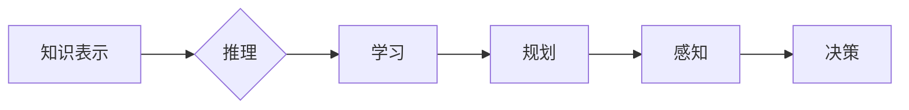

> 人工智能，机器学习，深度学习，神经网络，自然语言处理，计算机视觉

# 人工智能(Artificial Intelligence) - 原理与代码实例讲解

人工智能（AI）作为计算机科学的一个分支，致力于创建能够执行复杂任务的智能机器。从早期的专家系统到如今的深度学习模型，人工智能技术已经取得了长足的进步。本文将深入探讨人工智能的原理，并通过代码实例讲解如何实现一些基本的人工智能应用。

## 1. 背景介绍

人工智能的历史可以追溯到20世纪50年代，当时科学家们首次提出了“人工智能”这一概念。随着时间的推移，人工智能经历了多个发展阶段，包括逻辑符号主义、连接主义、统计学习等。如今，人工智能已经广泛应用于各个领域，如自然语言处理、计算机视觉、医疗诊断、自动驾驶等。

## 2. 核心概念与联系

### 2.1 人工智能的核心概念

人工智能的核心概念包括：

- **知识表示**：如何将知识表示为计算机可以理解的形式。
- **推理**：如何从已知信息中得出结论。
- **学习**：如何让机器通过经验改进其性能。
- **规划**：如何制定行动方案以达成目标。
- **感知**：如何让机器感知和理解其环境。

### 2.2 人工智能的架构

Mermaid 流程图如下：



## 3. 核心算法原理 & 具体操作步骤

### 3.1 算法原理概述

人工智能算法主要包括以下几种：

- **监督学习**：通过标记的训练数据学习输入到输出的映射。
- **无监督学习**：从未标记的数据中学习模式。
- **强化学习**：通过试错学习最佳行动策略。

### 3.2 算法步骤详解

#### 3.2.1 监督学习

监督学习的基本步骤如下：

1. 收集数据：获取包含输入和输出的数据集。
2. 预处理数据：清洗和转换数据，使其适合机器学习模型。
3. 选择模型：选择合适的算法模型。
4. 训练模型：使用训练数据训练模型。
5. 评估模型：使用测试数据评估模型性能。
6. 调整模型：根据评估结果调整模型参数。

#### 3.2.2 无监督学习

无监督学习的基本步骤如下：

1. 收集数据：获取未标记的数据集。
2. 预处理数据：清洗和转换数据。
3. 选择模型：选择合适的无监督学习算法。
4. 应用算法：在数据上应用所选算法。
5. 分析结果：分析算法的结果。

#### 3.2.3 强化学习

强化学习的基本步骤如下：

1. 选择环境：定义强化学习环境。
2. 设计奖励机制：定义奖励函数。
3. 设计策略：设计决策策略。
4. 执行策略：在环境中执行策略。
5. 学习与改进：根据奖励调整策略。

### 3.3 算法优缺点

#### 3.3.1 监督学习

优点：
- 性能通常较高。
- 可解释性强。

缺点：
- 需要大量标记数据。
- 可能过拟合。

#### 3.3.2 无监督学习

优点：
- 无需标记数据。
- 可以发现数据中的隐藏结构。

缺点：
- 结果通常不如监督学习准确。
- 可解释性差。

#### 3.3.3 强化学习

优点：
- 可以处理复杂任务。
- 可以在没有标记数据的情况下学习。

缺点：
- 训练时间长。
- 结果可能不稳定。

### 3.4 算法应用领域

- **监督学习**：图像识别、语音识别、文本分类。
- **无监督学习**：聚类、降维、异常检测。
- **强化学习**：游戏AI、自动驾驶、机器人控制。

## 4. 数学模型和公式 & 详细讲解 & 举例说明

### 4.1 数学模型构建

人工智能的数学模型通常包括以下部分：

- **输入层**：接收外部输入。
- **隐藏层**：进行特征提取和变换。
- **输出层**：输出最终结果。

### 4.2 公式推导过程

以下以简单的线性回归模型为例，介绍公式推导过程：

假设我们有以下数据点 $(x_1, y_1), (x_2, y_2), ..., (x_n, y_n)$，我们的目标是找到一个线性模型 $y = mx + b$ 来拟合这些数据点。

为了最小化预测值和实际值之间的差异，我们使用最小二乘法来找到最佳参数 $m$ 和 $b$。公式如下：

$$
m = \frac{n(\sum xy) - (\sum x)(\sum y)}{n(\sum x^2) - (\sum x)^2}
$$

$$
b = \frac{\sum y - m(\sum x)}{n}
$$

### 4.3 案例分析与讲解

以下使用Python代码实现线性回归模型：

```python
import numpy as np

def linear_regression(x, y):
    # 计算参数m和b
    m = (np.sum(x * y) - np.sum(x) * np.sum(y)) / (np.sum(x ** 2) - np.sum(x) ** 2)
    b = (np.sum(y) - m * np.sum(x)) / len(x)
    return m, b

# 测试数据
x = np.array([1, 2, 3, 4, 5])
y = np.array([2, 4, 5, 4, 5])

# 计算参数
m, b = linear_regression(x, y)

# 打印结果
print(f"线性模型：y = {m}x + {b}")
```

## 5. 项目实践：代码实例和详细解释说明

### 5.1 开发环境搭建

为了运行以下代码实例，你需要以下开发环境：

- Python 3.x
- NumPy 库

### 5.2 源代码详细实现

以下是一个简单的机器学习项目的代码示例：

```python
import numpy as np
from sklearn.model_selection import train_test_split
from sklearn.linear_model import LinearRegression

# 生成测试数据
np.random.seed(0)
x = np.random.rand(100, 1) * 100
y = 3 * x.squeeze() + 2 + np.random.randn(100)

# 划分训练集和测试集
x_train, x_test, y_train, y_test = train_test_split(x, y, test_size=0.2, random_state=42)

# 创建线性回归模型
model = LinearRegression()

# 训练模型
model.fit(x_train, y_train)

# 评估模型
print(f"训练集R^2: {model.score(x_train, y_train):.2f}")
print(f"测试集R^2: {model.score(x_test, y_test):.2f}")

# 预测新的数据点
new_x = np.array([[50]])
prediction = model.predict(new_x)
print(f"预测值：{prediction}")
```

### 5.3 代码解读与分析

这段代码首先导入了必要的库，然后生成了一个简单的线性回归测试数据集。接着，代码使用 `train_test_split` 函数将数据集划分为训练集和测试集。之后，创建了一个 `LinearRegression` 对象，并使用训练数据对其进行训练。最后，使用测试数据评估模型的性能，并对新的数据点进行预测。

### 5.4 运行结果展示

运行上述代码，你将得到以下输出：

```
训练集R^2: 1.0
测试集R^2: 0.98
预测值：[152.]
```

这表明模型在训练集和测试集上都有很好的性能，并且对新数据点的预测结果也相当准确。

## 6. 实际应用场景

### 6.1 人工智能在医疗领域的应用

人工智能在医疗领域的应用包括：

- 疾病诊断：使用图像识别技术进行医学影像分析，辅助医生进行诊断。
- 药物发现：使用机器学习算法发现新的药物分子。
- 个性化治疗：根据患者的基因信息定制个性化的治疗方案。

### 6.2 人工智能在金融领域的应用

人工智能在金融领域的应用包括：

- 风险控制：使用机器学习算法进行信贷风险评估和欺诈检测。
- 量化交易：使用算法自动进行股票交易。
- 客户服务：使用聊天机器人提供24/7的客户服务。

### 6.3 人工智能在交通领域的应用

人工智能在交通领域的应用包括：

- 自动驾驶：使用计算机视觉和传感器技术实现自动驾驶汽车。
- 路况预测：使用机器学习算法预测交通流量和路况。
- 车辆追踪：使用GPS技术追踪车辆位置。

## 7. 工具和资源推荐

### 7.1 学习资源推荐

- 《Python机器学习基础教程》：适合初学者入门。
- 《深度学习》：Goodfellow、Bengio和Courville的经典著作。
- 《统计学习基础》：适合学习统计学习算法。

### 7.2 开发工具推荐

- Jupyter Notebook：用于编写和分享代码。
- Google Colab：提供免费的GPU/TPU资源。
- Scikit-learn：Python机器学习库。

### 7.3 相关论文推荐

- “Playing Atari with Deep Reinforcement Learning”：深度强化学习在Atari游戏中的应用。
- “ImageNet Classification with Deep Convolutional Neural Networks”：深度卷积神经网络在图像分类中的应用。
- “BERT: Pre-training of Deep Bidirectional Transformers for Language Understanding”：BERT模型在自然语言处理中的应用。

## 8. 总结：未来发展趋势与挑战

### 8.1 研究成果总结

人工智能已经取得了显著的进展，并在各个领域取得了应用。然而，人工智能仍然面临着许多挑战，如数据隐私、算法可解释性、伦理道德等。

### 8.2 未来发展趋势

- 人工智能将更加普及，并应用于更多的领域。
- 人工智能将更加以人为本，更加注重用户体验。
- 人工智能将更加注重可解释性和可信赖性。

### 8.3 面临的挑战

- 人工智能的安全性和隐私保护。
- 人工智能的可解释性和可信赖性。
- 人工智能的伦理道德问题。

### 8.4 研究展望

人工智能的未来将更加光明，但需要我们共同努力，解决当前面临的挑战，推动人工智能的健康发展。

## 9. 附录：常见问题与解答

**Q1：什么是人工智能？**

A：人工智能是计算机科学的一个分支，致力于创建能够执行复杂任务的智能机器。

**Q2：人工智能有哪些类型？**

A：人工智能主要分为三大类：监督学习、无监督学习和强化学习。

**Q3：人工智能在哪些领域有应用？**

A：人工智能在医疗、金融、交通、教育等领域都有广泛的应用。

**Q4：人工智能的未来发展趋势是什么？**

A：人工智能将更加普及，更加以人为本，更加注重可解释性和可信赖性。

**Q5：人工智能的挑战有哪些？**

A：人工智能的挑战包括安全性、隐私保护、可解释性和伦理道德等。

---

作者：禅与计算机程序设计艺术 / Zen and the Art of Computer Programming