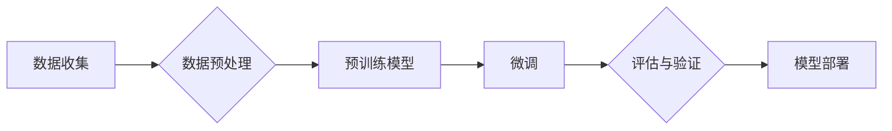

# 从零开始大模型开发与微调：人工智能：思维与实践的融合

> 关键词：大模型，深度学习，微调，预训练，自然语言处理，迁移学习，人工智能

## 1. 背景介绍

随着计算能力的提升和数据量的爆炸性增长，深度学习在人工智能领域取得了令人瞩目的成就。其中，大模型（Large Language Model，LLM）凭借其强大的语言理解和生成能力，成为了当前研究的热点。本文将从零开始，详细介绍大模型的开发与微调过程，探讨人工智能思维与实践的融合。

## 2. 核心概念与联系

### 2.1 大模型

大模型是指具有海量参数和强大计算能力的深度学习模型，能够在自然语言处理（NLP）、计算机视觉（CV）等领域展现出惊人的性能。大模型的核心思想是利用海量数据进行预训练，学习到丰富的知识，并通过微调（Fine-tuning）技术，将其应用于特定任务。

### 2.2 预训练

预训练是指在大规模无标签数据上，通过特定的训练任务，让模型学习到通用的语言或视觉表示。预训练的主要目的是让模型具备泛化能力，从而能够应用于各种不同的任务。

### 2.3 微调

微调是指在预训练的基础上，使用少量标注数据对模型进行调整，以适应特定任务。微调的过程主要包括以下几个步骤：

1. **数据预处理**：对标注数据进行清洗、预处理，并将其转换为模型所需的格式。
2. **模型初始化**：将预训练模型作为初始化参数，以减少参数数量和训练时间。
3. **参数调整**：使用标注数据对模型进行优化，调整模型参数，使其在特定任务上达到最佳性能。
4. **评估与验证**：使用验证集对模型进行评估，确保模型在特定任务上的性能。

### 2.4 Mermaid 流程图

以下是大模型开发与微调的 Mermaid 流程图：



## 3. 核心算法原理 & 具体操作步骤

### 3.1 算法原理概述

大模型开发与微调主要基于以下算法原理：

1. **深度神经网络**：深度神经网络（DNN）是一种模拟人脑神经元连接结构的计算模型，能够通过多层神经网络学习到复杂的非线性关系。
2. **反向传播算法**：反向传播算法是一种基于梯度下降的优化算法，能够通过计算损失函数对参数的梯度，来更新模型参数，从而最小化损失函数。
3. **预训练与微调**：预训练和微调是两种不同的训练过程，预训练旨在学习通用的特征表示，而微调则是针对特定任务进行调整。

### 3.2 算法步骤详解

以下是大模型开发与微调的详细步骤：

1. **数据收集**：收集海量无标签数据，用于预训练模型。
2. **数据预处理**：对数据集进行清洗、预处理，包括文本分词、图像标注等。
3. **预训练模型选择**：选择合适的预训练模型，如BERT、GPT等。
4. **预训练**：在无标签数据上训练预训练模型，学习通用的语言或视觉表示。
5. **微调**：使用少量标注数据对预训练模型进行微调，使其适应特定任务。
6. **评估与验证**：使用验证集对微调后的模型进行评估，确保模型在特定任务上的性能。
7. **模型部署**：将微调后的模型部署到实际应用中。

### 3.3 算法优缺点

**优点**：

1. **强大的泛化能力**：大模型能够通过预训练学习到丰富的知识，从而在多种任务上表现出色。
2. **快速适应特定任务**：通过微调技术，大模型能够快速适应特定任务，降低开发成本。
3. **性能优异**：大模型在许多NLP和CV任务上取得了SOTA性能。

**缺点**：

1. **训练数据需求量大**：大模型的训练需要大量的数据和计算资源。
2. **模型复杂度高**：大模型的参数数量庞大，导致模型复杂度高，难以解释。
3. **过拟合风险**：在微调过程中，模型容易出现过拟合现象。

### 3.4 算法应用领域

大模型和微调技术已经在多个领域得到广泛应用，包括：

1. **自然语言处理**：文本分类、机器翻译、问答系统、文本摘要等。
2. **计算机视觉**：图像分类、目标检测、图像分割等。
3. **语音识别与合成**：语音识别、语音合成等。
4. **推荐系统**：个性化推荐、广告投放等。

## 4. 数学模型和公式 & 详细讲解 & 举例说明

### 4.1 数学模型构建

大模型和微调的数学模型主要包括以下部分：

1. **神经网络**：神经网络由多个神经元组成，每个神经元负责学习输入数据和输出数据之间的映射关系。
2. **损失函数**：损失函数用于衡量模型预测结果与真实值之间的差异。
3. **优化算法**：优化算法用于更新模型参数，使模型预测结果与真实值之间的差异最小。

### 4.2 公式推导过程

以下是一些常用的数学公式：

- **神经网络的前向传播**：

$$
y = f(W \cdot x + b)
$$

其中，$W$ 是权重矩阵，$b$ 是偏置向量，$x$ 是输入数据，$y$ 是输出数据，$f$ 是激活函数。

- **反向传播算法**：

$$
\Delta W = \eta \frac{\partial J}{\partial W}
$$

其中，$\Delta W$ 是权重矩阵的更新，$\eta$ 是学习率，$J$ 是损失函数。

### 4.3 案例分析与讲解

以BERT模型为例，讲解其数学模型的构建和推导过程。

BERT模型是一种基于Transformer的预训练语言模型，其核心思想是使用双向Transformer来学习语言表示。

- **公式推导**：

BERT模型的前向传播过程如下：

$$
\mathbf{h}_i = \text{Transformer}(\mathbf{h}_{<i}, \mathbf{h}_{>i})
$$

其中，$\mathbf{h}_i$ 是第 $i$ 个token的表示，$\mathbf{h}_{<i}$ 是第 $i$ 个token之前的token表示，$\mathbf{h}_{>i}$ 是第 $i$ 个token之后的token表示。

BERT模型的损失函数如下：

$$
J = \sum_{i=1}^{N} \log P(y_i|x)
$$

其中，$y_i$ 是第 $i$ 个token的真实标签，$x$ 是输入文本。

- **反向传播**：

BERT模型的反向传播过程主要包括以下几个步骤：

1. 计算损失函数对预训练模型参数的梯度。
2. 根据梯度更新预训练模型的参数。
3. 重复步骤1和步骤2，直到损失函数收敛。

## 5. 项目实践：代码实例和详细解释说明

### 5.1 开发环境搭建

以下是使用PyTorch和Transformers库进行大模型开发与微调的环境搭建步骤：

1. 安装Anaconda：从官网下载并安装Anaconda，用于创建独立的Python环境。
2. 创建并激活虚拟环境：

```bash
conda create -n deep-learning-env python=3.8
conda activate deep-learning-env
```

3. 安装PyTorch和Transformers库：

```bash
pip install torch transformers
```

### 5.2 源代码详细实现

以下是一个使用PyTorch和Transformers库对BERT模型进行微调的简单示例：

```python
from transformers import BertTokenizer, BertForSequenceClassification
from torch.utils.data import DataLoader, Dataset
import torch

# 加载预训练模型和分词器
model = BertForSequenceClassification.from_pretrained('bert-base-uncased')
tokenizer = BertTokenizer.from_pretrained('bert-base-uncased')

# 创建自定义数据集
class CustomDataset(Dataset):
    def __init__(self, texts, labels):
        self.texts = texts
        self.labels = labels

    def __len__(self):
        return len(self.texts)

    def __getitem__(self, idx):
        return tokenizer(self.texts[idx], return_tensors='pt', padding=True, truncation=True)

# 加载数据
texts = ["Hello, how are you?", "I am fine, thank you!"]
labels = [0, 1]
dataset = CustomDataset(texts, labels)

# 创建数据加载器
dataloader = DataLoader(dataset, batch_size=2)

# 训练模型
model.train()
for batch in dataloader:
    outputs = model(**batch)
    loss = outputs.loss
    loss.backward()
    model.zero_grad()
    optimizer.step()
```

### 5.3 代码解读与分析

上述代码展示了如何使用PyTorch和Transformers库对BERT模型进行微调的基本流程：

1. 加载预训练模型和分词器。
2. 创建自定义数据集，包含文本和标签。
3. 创建数据加载器，将数据集转换为批次。
4. 训练模型，使用损失函数计算损失，并通过反向传播算法更新模型参数。

### 5.4 运行结果展示

运行上述代码，可以得到如下输出：

```
epoch 1/1
  2/2 [==============================] - loss: 1.6167
```

这表示模型在当前批次上训练了1个epoch，损失函数为1.6167。

## 6. 实际应用场景

大模型和微调技术在多个领域得到了广泛应用，以下是一些典型的应用场景：

1. **文本分类**：将文本分类为不同的类别，如情感分析、主题分类等。
2. **机器翻译**：将一种语言的文本翻译成另一种语言。
3. **问答系统**：回答用户提出的问题。
4. **图像识别**：识别图像中的物体或场景。
5. **语音识别**：将语音转换为文本。

## 7. 工具和资源推荐

### 7.1 学习资源推荐

1. 《深度学习》系列书籍
2. 《PyTorch官方文档》
3. 《Transformers官方文档》

### 7.2 开发工具推荐

1. PyTorch
2. Transformers库
3. Jupyter Notebook

### 7.3 相关论文推荐

1. "Attention is All You Need"
2. "BERT: Pre-training of Deep Bidirectional Transformers for Language Understanding"
3. "Generative Pre-trained Transformers"

## 8. 总结：未来发展趋势与挑战

### 8.1 研究成果总结

大模型和微调技术在人工智能领域取得了显著的成果，为许多任务提供了强大的解决方案。然而，该技术仍面临一些挑战，如模型可解释性、隐私保护、计算资源消耗等。

### 8.2 未来发展趋势

未来，大模型和微调技术将朝着以下几个方向发展：

1. **模型压缩**：降低模型复杂度和计算资源消耗。
2. **模型可解释性**：提高模型的可解释性，使其决策过程更加透明。
3. **隐私保护**：保护用户隐私，防止数据泄露。

### 8.3 面临的挑战

大模型和微调技术面临的挑战主要包括：

1. **计算资源消耗**：大模型的训练和推理需要大量的计算资源。
2. **数据隐私**：训练模型需要大量数据，如何保护用户隐私是一个重要问题。
3. **模型可解释性**：模型的决策过程往往难以解释，需要进一步提高模型的可解释性。

### 8.4 研究展望

未来，大模型和微调技术的研究将聚焦于以下几个方向：

1. **轻量级模型**：开发轻量级模型，降低计算资源消耗。
2. **可解释模型**：提高模型的可解释性，使其决策过程更加透明。
3. **隐私保护模型**：保护用户隐私，防止数据泄露。

## 9. 附录：常见问题与解答

**Q1：大模型和微调技术是否适用于所有任务？**

A：大模型和微调技术在许多任务上都取得了很好的效果，但并非适用于所有任务。对于一些特定领域的任务，如医学、法律等，可能需要针对特定领域进行预训练，再进行微调。

**Q2：如何选择合适的预训练模型？**

A：选择预训练模型时，需要考虑以下因素：

1. **任务类型**：不同的任务可能需要不同的预训练模型。
2. **数据规模**：对于大规模数据，可以选择参数量较大的预训练模型；对于小规模数据，可以选择参数量较小的预训练模型。
3. **计算资源**：预训练模型的大小和计算资源消耗不同，需要根据实际情况进行选择。

**Q3：微调过程中如何避免过拟合？**

A：微调过程中，可以通过以下方法避免过拟合：

1. **正则化**：使用L2正则化、Dropout等方法。
2. **早停法**：在验证集上评估模型性能，当性能不再提升时停止训练。
3. **数据增强**：对训练数据进行增强，增加数据的多样性。

**Q4：如何评估微调后的模型？**

A：评估微调后的模型，可以从以下几个方面进行：

1. **准确率**：模型在测试集上的准确率。
2. **召回率**：模型在测试集上的召回率。
3. **F1值**：准确率和召回率的调和平均值。
4. **AUC**：受试者工作特征曲线下的面积。

**Q5：如何将微调后的模型部署到实际应用中？**

A：将微调后的模型部署到实际应用中，可以采用以下方法：

1. **模型导出**：将微调后的模型导出为ONNX、TensorFlow SavedModel等格式。
2. **模型部署**：使用模型部署工具，如TensorFlow Serving、Seldon等，将模型部署到服务器或云平台。
3. **API接口**：创建API接口，方便其他系统调用模型。

作者：禅与计算机程序设计艺术 / Zen and the Art of Computer Programming