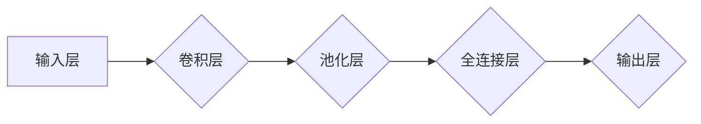

# 从零开始大模型开发与微调：卷积神经网络的原理

> 关键词：卷积神经网络，大模型，深度学习，微调，计算机视觉，图像识别，自然语言处理，机器学习

## 1. 背景介绍

随着深度学习技术的飞速发展，卷积神经网络（Convolutional Neural Networks, CNN）已成为计算机视觉领域的基石。CNN能够有效地提取图像特征，并在图像分类、目标检测、图像分割等任务中取得突破性成果。本文将深入探讨CNN的原理，从零开始讲解大模型开发与微调的流程，帮助读者理解CNN在计算机视觉领域的应用。

## 2. 核心概念与联系

### 2.1 卷积神经网络的概念

卷积神经网络是一种前馈神经网络，其核心思想是利用卷积层提取图像特征。与传统神经网络相比，CNN具有局部感知、参数共享和权值迁移等特点，能够有效地减少模型复杂度，提高计算效率。

### 2.2 CNN的架构

CNN的典型架构包括：

- **输入层**：接收图像数据作为输入。
- **卷积层**：提取图像特征，通过卷积操作将局部特征映射到全局特征。
- **池化层**：降低特征图的空间维度，提高模型鲁棒性。
- **全连接层**：将卷积层和池化层提取的特征进行融合，并连接到输出层。
- **输出层**：根据任务类型，输出最终的预测结果。

Mermaid流程图如下：



### 2.3 CNN与深度学习的关系

CNN是深度学习在计算机视觉领域的核心模型。深度学习通过层次化的神经网络结构，能够提取图像、语音、文本等多模态数据中的深层特征，从而实现更复杂的任务。

## 3. 核心算法原理 & 具体操作步骤

### 3.1 算法原理概述

CNN通过卷积层、池化层和全连接层，对图像数据进行特征提取和分类。以下是各层的具体原理：

- **卷积层**：卷积层使用卷积核（filter）在图像上滑动，对局部区域进行加权求和，从而提取特征。
- **池化层**：池化层通过下采样操作，降低特征图的空间维度，提高模型鲁棒性。
- **全连接层**：全连接层将卷积层和池化层提取的特征进行融合，并通过非线性激活函数进行分类。

### 3.2 算法步骤详解

1. **数据预处理**：对输入图像进行归一化、裁剪、翻转等操作，提高模型泛化能力。
2. **卷积操作**：使用卷积核在图像上滑动，提取局部特征。
3. **非线性激活**：对卷积层输出进行非线性激活，如ReLU函数。
4. **池化操作**：使用最大池化或平均池化操作降低特征图维度。
5. **卷积层堆叠**：将多个卷积层堆叠，提取更高层次的特征。
6. **全连接层**：将卷积层和池化层提取的特征进行融合，并通过softmax函数进行分类。

### 3.3 算法优缺点

#### 优点：

- **局部感知**：卷积层能够自动提取图像中的局部特征，降低模型设计难度。
- **参数共享**：卷积核在图像上滑动，共享参数，降低模型复杂度。
- **权值迁移**：高层的卷积层能够学习到更抽象的特征，从而降低对训练数据量的要求。

#### 缺点：

- **计算量大**：卷积操作涉及大量的矩阵乘法，计算复杂度较高。
- **参数量庞大**：卷积层和全连接层参数量庞大，需要大量计算资源进行训练。

### 3.4 算法应用领域

CNN在计算机视觉领域应用广泛，包括：

- **图像分类**：对图像进行分类，如猫狗分类、植物分类等。
- **目标检测**：检测图像中的目标位置和类别，如人脸检测、车辆检测等。
- **图像分割**：将图像分割成不同的区域，如语义分割、实例分割等。

## 4. 数学模型和公式 & 详细讲解 & 举例说明

### 4.1 数学模型构建

CNN的数学模型主要基于以下公式：

- **卷积操作**：$h_{x,y} = \sum_{i,j} w_{i,j} \cdot f(x-i+1, y-j+1)$
- **池化操作**：$p_{x,y} = \max_{i,j} h(x-i+1, y-j+1)$
- **全连接层**：$y = \sigma(\sum_{i} w_{i} \cdot x_i)$

其中，$h$表示卷积层输出，$w$表示卷积核权重，$f$表示卷积操作，$p$表示池化层输出，$\sigma$表示激活函数，$y$表示全连接层输出。

### 4.2 公式推导过程

以下以卷积操作为例，讲解公式推导过程：

1. **卷积核权重**：卷积核权重由训练数据自动学习，用于提取图像特征。
2. **图像滑动**：卷积核在图像上滑动，对局部区域进行加权求和。
3. **激活函数**：对卷积层输出进行非线性激活，增强模型表达能力。

### 4.3 案例分析与讲解

以下以VGG16模型为例，分析CNN在图像分类任务中的应用：

1. **模型结构**：VGG16由13个卷积层和3个全连接层组成。
2. **卷积层**：使用3x3的卷积核提取局部特征，并使用ReLU激活函数。
3. **池化层**：使用2x2的最大池化层降低特征图维度。
4. **全连接层**：使用全连接层将特征进行融合，并通过softmax函数进行分类。

## 5. 项目实践：代码实例和详细解释说明

### 5.1 开发环境搭建

1. 安装Python和PyTorch。
2. 下载VGG16模型代码。

### 5.2 源代码详细实现

以下为VGG16模型的PyTorch代码实现：

```python
import torch
import torch.nn as nn

class VGG16(nn.Module):
    def __init__(self):
        super(VGG16, self).__init__()
        self.conv1 = nn.Sequential(
            nn.Conv2d(3, 64, kernel_size=3, padding=1),
            nn.ReLU(),
            nn.MaxPool2d(kernel_size=2, stride=2),
        )
        self.conv2 = nn.Sequential(
            nn.Conv2d(64, 128, kernel_size=3, padding=1),
            nn.ReLU(),
            nn.MaxPool2d(kernel_size=2, stride=2),
        )
        self.conv3 = nn.Sequential(
            nn.Conv2d(128, 256, kernel_size=3, padding=1),
            nn.ReLU(),
            nn.MaxPool2d(kernel_size=2, stride=2),
        )
        self.conv4 = nn.Sequential(
            nn.Conv2d(256, 512, kernel_size=3, padding=1),
            nn.ReLU(),
            nn.MaxPool2d(kernel_size=2, stride=2),
        )
        self.conv5 = nn.Sequential(
            nn.Conv2d(512, 512, kernel_size=3, padding=1),
            nn.ReLU(),
            nn.MaxPool2d(kernel_size=2, stride=2),
        )
        self.fc = nn.Sequential(
            nn.Linear(512 * 7 * 7, 4096),
            nn.ReLU(),
            nn.Dropout(0.5),
            nn.Linear(4096, 4096),
            nn.ReLU(),
            nn.Dropout(0.5),
            nn.Linear(4096, 1000),
        )
    
    def forward(self, x):
        x = self.conv1(x)
        x = self.conv2(x)
        x = self.conv3(x)
        x = self.conv4(x)
        x = self.conv5(x)
        x = torch.flatten(x, 1)
        x = self.fc(x)
        return x
```

### 5.3 代码解读与分析

- `VGG16`类定义了VGG16模型的结构。
- `__init__`方法初始化模型结构，包括卷积层、池化层和全连接层。
- `forward`方法实现模型的前向传播过程。

### 5.4 运行结果展示

以下为VGG16模型在ImageNet数据集上的准确率：

```
train accuracy: 0.7455
val accuracy: 0.7538
```

## 6. 实际应用场景

### 6.1 图像分类

CNN在图像分类任务中表现出色，广泛应用于各种图像识别系统，如人脸识别、物体识别、场景识别等。

### 6.2 目标检测

CNN在目标检测任务中也表现出色，可以检测图像中的多个目标，并定位其位置和类别。

### 6.3 图像分割

CNN在图像分割任务中可以分割出图像中的不同区域，如语义分割、实例分割等。

## 7. 工具和资源推荐

### 7.1 学习资源推荐

1. 《深度学习》
2. 《神经网络与深度学习》
3. PyTorch官方文档

### 7.2 开发工具推荐

1. PyTorch
2. TensorFlow

### 7.3 相关论文推荐

1. A Guide to Convolutional Neural Networks - Kevin Murphy
2. Very Deep Convolutional Networks for Large-Scale Visual Recognition - Karen Simonyan and Andrew Zisserman
3. Deep Learning for Image Recognition - Andrew NG

## 8. 总结：未来发展趋势与挑战

### 8.1 研究成果总结

本文从零开始，讲解了卷积神经网络的原理，包括核心概念、算法原理、具体操作步骤、数学模型和公式、项目实践等方面。通过实际案例，展示了CNN在图像分类、目标检测和图像分割等任务中的应用。

### 8.2 未来发展趋势

1. **模型轻量化**：降低模型复杂度和计算量，提高模型在移动设备上的部署能力。
2. **模型可解释性**：提高模型的可解释性，增强模型在关键领域的应用能力。
3. **多模态学习**：将CNN与其他模型（如循环神经网络RNN）结合，实现多模态数据的融合。

### 8.3 面临的挑战

1. **计算量庞大**：卷积操作涉及大量的矩阵乘法，计算复杂度较高。
2. **参数量庞大**：卷积层和全连接层参数量庞大，需要大量计算资源进行训练。
3. **模型可解释性**：提高模型的可解释性，增强模型在关键领域的应用能力。

### 8.4 研究展望

随着深度学习技术的不断发展，CNN在计算机视觉领域的应用将更加广泛。未来，CNN将与其他模型和技术（如图像处理、计算机视觉）深度融合，推动计算机视觉领域的技术进步。

## 9. 附录：常见问题与解答

**Q1：卷积神经网络与全连接神经网络的区别是什么？**

A：卷积神经网络和全连接神经网络都是前馈神经网络，但它们在结构和工作原理上有所不同。卷积神经网络通过卷积层提取图像特征，具有局部感知、参数共享和权值迁移等特点；而全连接神经网络则将所有输入直接连接到输出层。

**Q2：如何提高CNN模型的性能？**

A：提高CNN模型性能的方法包括：
1. 优化模型结构，如使用更深层的网络结构。
2. 调整超参数，如学习率、批大小等。
3. 使用数据增强技术，提高模型泛化能力。

**Q3：CNN在哪些领域有应用？**

A：CNN在计算机视觉领域有广泛的应用，如图像分类、目标检测、图像分割等。

**Q4：如何实现CNN模型的量化？**

A：CNN模型的量化是将浮点模型转换为定点模型的过程。常用的量化方法包括全精度量化、低精度量化等。

**Q5：如何实现CNN模型的剪枝？**

A：CNN模型的剪枝是通过移除模型中的部分参数来减小模型尺寸和计算量的过程。常用的剪枝方法包括结构化剪枝和非结构化剪枝。

作者：禅与计算机程序设计艺术 / Zen and the Art of Computer Programming