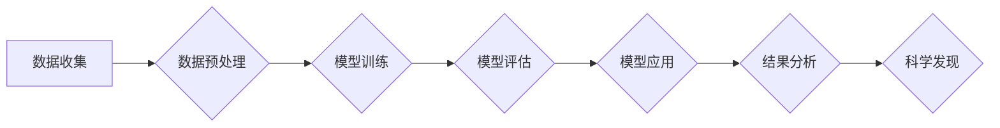

## 1. 背景介绍

人工智能（AI）技术近年来发展迅速，已从学术研究走向了实际应用，并在各个领域取得了显著成果。传统科学领域，作为人类文明发展的重要支柱，也开始积极探索AI技术的应用，旨在提升科研效率、推动科学发现。

传统科学领域涵盖了自然科学、社会科学、人文科学等多个领域，其研究对象和方法都具有其独特的特点。AI技术的应用可以帮助传统科学领域解决一些长期存在的难题，例如：

* **数据分析与挖掘:** 传统科学领域往往需要处理海量的数据，AI算法可以帮助科学家快速分析和挖掘数据中的规律和模式，从而发现新的科学现象和规律。
* **模型构建与模拟:** AI可以帮助科学家构建更复杂的科学模型，并进行更精准的模拟，从而更好地理解复杂系统和现象。
* **实验设计与优化:** AI可以帮助科学家设计更有效的实验方案，并优化实验参数，从而提高实验效率和准确性。
* **知识发现与推理:** AI可以帮助科学家从大量的文献和数据中发现新的知识，并进行逻辑推理，从而推动科学理论的构建和发展。

## 2. 核心概念与联系

**2.1 核心概念**

* **人工智能 (AI):** 人工智能是指模拟人类智能行为的计算机系统。它包括机器学习、深度学习、自然语言处理、计算机视觉等多个分支。
* **传统科学:** 传统科学是指基于理性思维和实证方法进行研究的科学体系，包括自然科学、社会科学、人文科学等多个领域。

**2.2 AI与传统科学的联系**

AI技术可以为传统科学领域提供强大的工具和手段，帮助科学家进行更深入、更有效的科学研究。

**2.3  AI应用于传统科学的流程图**



## 3. 核心算法原理 & 具体操作步骤

**3.1 算法原理概述**

机器学习是AI领域的核心技术之一，它通过算法训练模型，使模型能够从数据中学习规律，并对新数据进行预测或分类。

**3.2 算法步骤详解**

1. **数据收集:** 收集与研究目标相关的原始数据。
2. **数据预处理:** 对数据进行清洗、转换、特征提取等操作，使其适合模型训练。
3. **模型选择:** 根据研究目标和数据特点选择合适的机器学习算法。
4. **模型训练:** 使用训练数据训练模型，调整模型参数，使其能够准确地学习数据规律。
5. **模型评估:** 使用测试数据评估模型的性能，例如准确率、召回率、F1-score等。
6. **模型应用:** 将训练好的模型应用于实际问题，对新数据进行预测或分类。

**3.3 算法优缺点**

* **优点:**
    * 自动学习数据规律，无需人工编程。
    * 可以处理海量数据，发现隐藏的模式。
    * 能够不断学习和改进，提高预测精度。
* **缺点:**
    * 需要大量的训练数据。
    * 模型训练过程可能耗时较长。
    * 模型解释性较差，难以理解模型的决策过程。

**3.4 算法应用领域**

机器学习算法广泛应用于传统科学领域，例如：

* **生物医学:** 疾病诊断、药物研发、基因组分析。
* **材料科学:** 材料性能预测、新材料设计。
* **地球科学:** 气候变化预测、地震预警、资源勘探。
* **天文学:** 星系演化研究、天体发现。

## 4. 数学模型和公式 & 详细讲解 & 举例说明

**4.1 数学模型构建**

在机器学习中，常用的数学模型包括线性回归、逻辑回归、支持向量机、决策树等。这些模型都建立在一定的数学基础上，例如线性代数、概率论、统计学等。

**4.2 公式推导过程**

例如，线性回归模型的目标是找到一条直线，使得这条直线与数据点之间的误差最小。

线性回归模型的公式如下：

$$y = w_0 + w_1x_1 + w_2x_2 +... + w_nx_n$$

其中：

* $y$ 是预测值。
* $w_0, w_1, w_2,..., w_n$ 是模型参数。
* $x_1, x_2,..., x_n$ 是输入特征。

模型参数的求解可以通过最小二乘法来实现。

**4.3 案例分析与讲解**

假设我们想要预测房屋价格，输入特征包括房屋面积、房间数量、地理位置等。我们可以使用线性回归模型来建立房屋价格预测模型。

通过训练数据，我们可以得到模型参数，例如：

* $w_0 = 100000$
* $w_1 = 500$
* $w_2 = 10000$

这意味着，房屋面积每增加1平方米，价格会增加500元；房间数量每增加1个，价格会增加10000元。

## 5. 项目实践：代码实例和详细解释说明

**5.1 开发环境搭建**

可以使用Python语言和相关的机器学习库，例如Scikit-learn、TensorFlow、PyTorch等，来实现AI应用。

**5.2 源代码详细实现**

```python
from sklearn.linear_model import LinearRegression
from sklearn.model_selection import train_test_split
import pandas as pd

# 加载数据
data = pd.read_csv('house_price.csv')

# 分割数据
X = data[['area', 'rooms']]
y = data['price']
X_train, X_test, y_train, y_test = train_test_split(X, y, test_size=0.2, random_state=42)

# 创建线性回归模型
model = LinearRegression()

# 训练模型
model.fit(X_train, y_train)

# 预测测试数据
y_pred = model.predict(X_test)

# 评估模型性能
from sklearn.metrics import mean_squared_error
mse = mean_squared_error(y_test, y_pred)
print('Mean Squared Error:', mse)
```

**5.3 代码解读与分析**

这段代码首先加载了房屋价格数据，然后将数据分为训练集和测试集。接着，创建了一个线性回归模型，并使用训练集训练模型。最后，使用测试集预测房屋价格，并计算模型的均方误差。

**5.4 运行结果展示**

运行结果会显示出模型的均方误差，可以用来评估模型的性能。

## 6. 实际应用场景

**6.1 生物医学**

* **疾病诊断:** AI可以分析患者的医疗影像、基因数据等，辅助医生诊断疾病。
* **药物研发:** AI可以加速药物研发过程，例如预测药物的活性、安全性等。
* **个性化医疗:** AI可以根据患者的个体特征，提供个性化的治疗方案。

**6.2 材料科学**

* **材料性能预测:** AI可以预测材料的机械性能、热性能、电性能等。
* **新材料设计:** AI可以帮助科学家设计具有特定性能的新材料。
* **材料缺陷检测:** AI可以分析材料的微观结构，检测材料缺陷。

**6.3 地球科学**

* **气候变化预测:** AI可以分析气候数据，预测未来气候变化趋势。
* **地震预警:** AI可以分析地震前兆数据，提高地震预警的准确性。
* **资源勘探:** AI可以分析地质数据，辅助资源勘探。

**6.4 未来应用展望**

随着AI技术的不断发展，其在传统科学领域的应用将更加广泛和深入。例如：

* **科学发现加速:** AI可以帮助科学家更快地发现新的科学规律和现象。
* **跨学科研究促进:** AI可以促进不同学科之间的交叉研究，推动科学创新。
* **科学普及提升:** AI可以帮助将科学知识更直观地呈现给大众，提升科学普及水平。

## 7. 工具和资源推荐

**7.1 学习资源推荐**

* **在线课程:** Coursera、edX、Udacity等平台提供丰富的AI课程。
* **书籍:** 《深度学习》、《机器学习实战》等书籍是AI学习的经典教材。
* **开源项目:** TensorFlow、PyTorch等开源项目可以帮助开发者学习和实践AI技术。

**7.2 开发工具推荐**

* **Python:** Python是AI开发最常用的编程语言。
* **Scikit-learn:** Scikit-learn是Python机器学习库，提供丰富的算法和工具。
* **TensorFlow:** TensorFlow是Google开发的深度学习框架。
* **PyTorch:** PyTorch是Facebook开发的深度学习框架。

**7.3 相关论文推荐**

* **《ImageNet Classification with Deep Convolutional Neural Networks》**
* **《Attention Is All You Need》**
* **《BERT: Pre-training of Deep Bidirectional Transformers for Language Understanding》**

## 8. 总结：未来发展趋势与挑战

**8.1 研究成果总结**

AI技术在传统科学领域的应用取得了显著成果，例如在疾病诊断、药物研发、材料设计等方面取得了突破。

**8.2 未来发展趋势**

* **模型更加复杂:** 未来AI模型将更加复杂，能够处理更复杂的数据和问题。
* **解释性更强:** 未来AI模型的解释性将更加强，能够更好地解释模型的决策过程。
* **应用更加广泛:** 未来AI技术将应用于更多传统科学领域，推动科学发现和技术创新。

**8.3 面临的挑战**

* **数据质量:** AI模型的性能依赖于数据质量，如何获取高质量的数据仍然是一个挑战。
* **算法解释性:** 许多AI算法的决策过程难以解释，这限制了其在一些领域中的应用。
* **伦理问题:** AI技术的应用也带来了一些伦理问题，例如数据隐私、算法偏见等，需要得到妥善解决。

**8.4 研究展望**

未来，我们需要继续探索AI技术的潜力，开发更强大、更智能的AI模型，并解决AI技术应用中的挑战，推动AI技术在传统科学领域的更加广泛和深入的应用。

## 9. 附录：常见问题与解答

**9.1 如何选择合适的AI算法？**

选择合适的AI算法需要根据具体的应用场景和数据特点来决定。例如，对于分类问题，可以考虑使用逻辑回归、支持向量机等算法；对于回归问题，可以考虑使用线性回归、决策树等算法。

**9.2 如何评估AI模型的性能？**

常用的AI模型性能评估指标包括准确率、召回率、F1-score、均方误差等。

**9.3 如何解决AI算法的解释性问题？**

一些研究者正在开发更可解释的AI算法，例如规则学习、可视化解释等方法。


作者：禅与计算机程序设计艺术 / Zen and the Art of Computer Programming 
