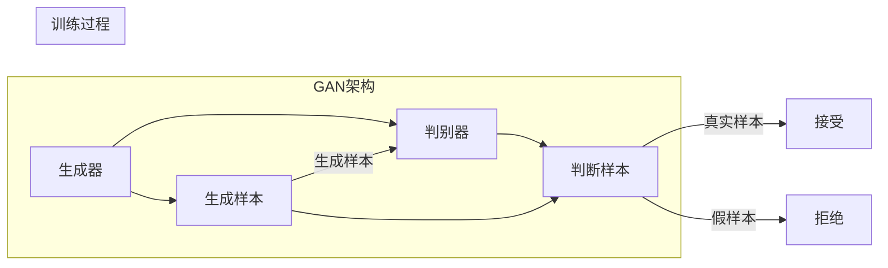

# GAN 判别模型：判别器 (Discriminator) 原理与代码实例讲解

> 关键词：生成对抗网络，GAN，判别器，深度学习，图像生成，自然语言处理

## 1. 背景介绍

生成对抗网络（Generative Adversarial Networks，GAN）是深度学习领域的一项革命性技术，它通过两个网络——生成器和判别器——之间的对抗性训练，实现了从数据分布中学习并生成与真实数据分布相似的样本。判别器是GAN中的一个核心组件，其作用是判断生成器生成的样本是否为真实样本。本文将深入探讨判别器的原理、实现方法和代码实例，帮助读者全面理解GAN中判别器的关键作用。

## 2. 核心概念与联系

### 2.1 GAN简介

GAN由Ian Goodfellow等人在2014年提出，它由两部分组成：生成器（Generator）和判别器（Discriminator）。生成器的目标是生成与真实数据分布相似的样本，而判别器的目标是区分真实样本和生成器生成的样本。

### 2.2 Mermaid 流程图



### 2.3 核心概念联系

在GAN中，生成器和判别器相互竞争，生成器试图生成更难被判别器识别的样本，而判别器则试图准确识别生成器和真实样本。这种对抗性的训练过程使得生成器能够学习到真实数据的分布，并生成高质量的样本。

## 3. 核心算法原理 & 具体操作步骤

### 3.1 算法原理概述

判别器的基本原理是使用深度神经网络来学习数据分布的特征，从而区分真实样本和生成器生成的样本。判别器通常采用多层的全连接神经网络，并通过交叉熵损失函数来衡量其预测结果与真实标签之间的差异。

### 3.2 算法步骤详解

1. **初始化**：初始化生成器和判别器，设置相同的架构，但参数不同。
2. **生成器生成样本**：生成器根据随机噪声生成样本。
3. **判别器判断样本**：判别器同时接收真实样本和生成器生成的样本，并输出判断结果。
4. **反向传播**：根据交叉熵损失函数计算判别器损失，并通过反向传播更新判别器参数。
5. **对抗训练**：生成器根据判别器的输出调整生成策略，以生成更难以被识别的样本。

### 3.3 算法优缺点

**优点**：
- 能够生成高质量、具有多样性的样本。
- 无需真实标签数据，适用于无监督学习场景。
- 应用范围广泛，包括图像生成、自然语言处理等领域。

**缺点**：
- 训练不稳定，容易陷入局部最优。
- 模型难以解释，难以理解生成样本的具体生成过程。

### 3.4 算法应用领域

- **图像生成**：生成逼真的图像、视频、动画等。
- **自然语言处理**：生成文本、翻译、对话系统等。
- **音频处理**：生成音乐、语音等。

## 4. 数学模型和公式 & 详细讲解 & 举例说明

### 4.1 数学模型构建

在GAN中，生成器和判别器的目标函数分别为：

$$
\min_{G} \max_{D} V(G,D) = \mathbb{E}_{z \sim p(z)}[D(G(z))] - \mathbb{E}_{x \sim p(x)}[D(x)]
$$

其中，$G(z)$ 是生成器生成的样本，$x$ 是真实样本，$z$ 是随机噪声。

### 4.2 公式推导过程

判别器目标函数的推导过程如下：

1. **定义交叉熵损失函数**：
$$
L(D) = -\mathbb{E}_{x \sim p(x)}[\log D(x)] - \mathbb{E}_{z \sim p(z)}[\log (1 - D(G(z))]
$$

2. **对判别器求导**：
$$
\frac{\partial L(D)}{\partial D} = \frac{\partial}{\partial D}[-\mathbb{E}_{x \sim p(x)}[\log D(x)] - \mathbb{E}_{z \sim p(z)}[\log (1 - D(G(z)))]
$$

3. **应用期望的求导法则**：
$$
\frac{\partial}{\partial D} \mathbb{E}_{x \sim p(x)}[f(D(x))] = \mathbb{E}_{x \sim p(x)}[\frac{\partial f(D(x))}{\partial D}]
$$

4. **计算梯度**：
$$
\frac{\partial L(D)}{\partial D} = -\frac{1}{N} \sum_{i=1}^N \frac{\partial \log D(x_i)}{\partial D} - \frac{1}{N} \sum_{i=1}^N \frac{\partial \log (1 - D(G(x_i)))}{\partial D}
$$

其中，$N$ 是样本数量。

### 4.3 案例分析与讲解

以下是一个使用PyTorch实现的简单GAN判别器代码示例：

```python
import torch
import torch.nn as nn
import torch.optim as optim

class Discriminator(nn.Module):
    def __init__(self, input_dim):
        super(Discriminator, self).__init__()
        self.model = nn.Sequential(
            nn.Linear(input_dim, 128),
            nn.LeakyReLU(0.2),
            nn.Linear(128, 1),
            nn.Sigmoid()
        )

    def forward(self, x):
        x = self.model(x)
        return x.view(-1, 1).squeeze(1)
```

在这个例子中，判别器是一个单层的神经网络，包含一个线性层、一个LeakyReLU激活函数和一个Sigmoid激活函数。判别器接收输入数据 $x$，并将其输入到神经网络中，最终输出一个介于0和1之间的概率值，表示输入数据为真实样本的概率。

## 5. 项目实践：代码实例和详细解释说明

### 5.1 开发环境搭建

以下是使用PyTorch实现GAN判别器的开发环境搭建步骤：

1. 安装PyTorch和CUDA：
```bash
pip install torch torchvision torchaudio
pip install torch-cuda
```

2. 创建一个新的Python虚拟环境，并安装所需的库：
```bash
conda create -n gan-env python=3.8
conda activate gan-env
pip install numpy pandas matplotlib
```

### 5.2 源代码详细实现

以下是一个使用PyTorch实现的简单GAN判别器代码实例：

```python
import torch
import torch.nn as nn
import torch.optim as optim

# 判别器定义
class Discriminator(nn.Module):
    def __init__(self, input_dim):
        super(Discriminator, self).__init__()
        self.model = nn.Sequential(
            nn.Linear(input_dim, 128),
            nn.LeakyReLU(0.2),
            nn.Linear(128, 1),
            nn.Sigmoid()
        )

    def forward(self, x):
        x = self.model(x)
        return x.view(-1, 1).squeeze(1)

# 初始化判别器
discriminator = Discriminator(input_dim=100)

# 定义损失函数和优化器
criterion = nn.BCELoss()
optimizer = optim.Adam(discriminator.parameters(), lr=0.0002)
```

### 5.3 代码解读与分析

在这个代码实例中，我们定义了一个简单的判别器，它包含一个线性层、一个LeakyReLU激活函数和一个Sigmoid激活函数。判别器接收输入数据 $x$，并将其输入到神经网络中，最终输出一个介于0和1之间的概率值，表示输入数据为真实样本的概率。

### 5.4 运行结果展示

以下是使用PyTorch运行GAN判别器代码的示例：

```python
# 生成随机噪声
z = torch.randn(64, 100)

# 前向传播
output = discriminator(z)

# 打印输出
print(output)
```

运行上述代码将输出一个64x1的张量，表示64个随机噪声样本经过判别器处理后的概率值。

## 6. 实际应用场景

判别器在GAN中的应用场景非常广泛，以下是一些典型的应用：

- **图像生成**：生成逼真的图像、视频、动画等。
- **自然语言处理**：生成文本、翻译、对话系统等。
- **音频处理**：生成音乐、语音等。

## 7. 工具和资源推荐

### 7.1 学习资源推荐

- 《Generative Adversarial Nets》：GAN的原始论文，详细介绍了GAN的理论基础和实现方法。
- 《Unsupervised Learning》：《Unsupervised Learning》这本书介绍了GAN的原理和应用，适合初学者阅读。
- 《GANs in Action》：这本书提供了GAN的实战案例，适合有一定基础的开发者学习。

### 7.2 开发工具推荐

- PyTorch：一个开源的深度学习框架，提供丰富的API和工具，易于使用。
- TensorFlow：另一个开源的深度学习框架，功能强大，适合进行大规模模型训练。
- Keras：一个高级神经网络API，易于使用，适合快速原型设计。

### 7.3 相关论文推荐

- Goodfellow et al. (2014): Generative Adversarial Nets
- Radford et al. (2015): Unsupervised Representation Learning with Deep Convolutional Generative Adversarial Networks
- Arjovsky et al. (2017): Wasserstein GAN

## 8. 总结：未来发展趋势与挑战

### 8.1 研究成果总结

GAN判别器作为GAN的重要组成部分，在图像生成、自然语言处理、音频处理等领域取得了显著的成果。判别器通过学习数据分布的特征，能够生成高质量、具有多样性的样本。

### 8.2 未来发展趋势

- **模型结构多样化**：未来的判别器将采用更复杂的网络结构，以学习更复杂的数据分布。
- **算法优化**：研究更有效的优化算法，提高训练效率和稳定性。
- **可解释性**：提高判别器的可解释性，更好地理解生成样本的生成过程。

### 8.3 面临的挑战

- **训练不稳定**：GAN的训练过程容易陷入局部最优，需要研究更稳定的训练方法。
- **模型解释性**：GAN模型难以解释，需要研究更可解释的模型结构和方法。
- **计算复杂度**：GAN的训练和推理过程计算复杂度较高，需要研究更高效的算法和硬件。

### 8.4 研究展望

GAN判别器的研究将继续深入，未来的研究方向包括：

- **新型GAN结构**：探索新的GAN结构，提高生成质量和训练稳定性。
- **可解释GAN**：研究可解释的GAN模型，提高模型的可信度和可用性。
- **跨领域GAN**：研究跨领域的GAN模型，实现跨领域样本生成。

## 9. 附录：常见问题与解答

**Q1：GAN判别器的作用是什么？**

A：GAN判别器的作用是判断生成器生成的样本是否为真实样本，通过与生成器的对抗性训练，生成器能够学习到真实数据的分布，并生成高质量的样本。

**Q2：GAN判别器是如何训练的？**

A：GAN判别器通过对抗性训练进行训练，生成器根据判别器的输出调整生成策略，而判别器则试图区分真实样本和生成器生成的样本。

**Q3：GAN判别器的应用领域有哪些？**

A：GAN判别器在图像生成、自然语言处理、音频处理等领域有广泛的应用。

**Q4：如何提高GAN判别器的训练稳定性？**

A：提高GAN判别器的训练稳定性可以通过以下方法实现：
- 使用不同的损失函数，如Wasserstein Loss。
- 调整学习率，避免过拟合。
- 使用对抗训练，使生成器和判别器相互竞争。
- 使用数据增强，提高数据多样性。

**Q5：GAN判别器的未来发展趋势是什么？**

A：GAN判别器的未来发展趋势包括：
- 模型结构多样化。
- 算法优化。
- 可解释性提高。

作者：禅与计算机程序设计艺术 / Zen and the Art of Computer Programming