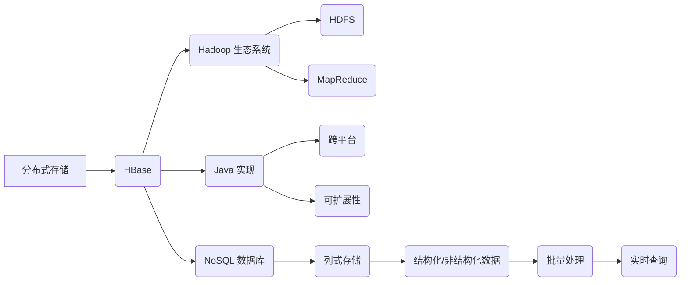

> HBase, 分布式存储, NoSQL, 列式数据库, Hadoop, Java, 数据模型, 批量处理, 实时查询

# HBase原理与代码实例讲解

HBase是一款由Apache软件基金会支持的开源分布式NoSQL数据库。它建立在Hadoop生态系统之上，提供了高可靠性、高性能的列式存储解决方案。本文将深入探讨HBase的原理，并通过代码实例进行详细讲解，帮助读者全面理解HBase的工作机制。

## 1. 背景介绍

### 1.1 问题的由来

随着互联网和大数据时代的到来，数据量呈爆炸式增长。传统的行式数据库在处理海量数据时，面临着性能瓶颈。为了满足对大数据的高并发读写需求，研究人员提出了NoSQL数据库，其中HBase作为其中的一员，因其高性能、高可靠性等特点，在分布式存储领域占据了重要地位。

### 1.2 研究现状

HBase自2006年开源以来，已经发展成为一个成熟的开源项目。它广泛应用于金融、电商、社交网络、物联网等众多领域。随着版本的不断更新，HBase的性能和功能也得到持续提升。

### 1.3 研究意义

HBase的原理和实现对于理解和应用NoSQL数据库具有重要意义。通过学习HBase，可以深入了解分布式存储架构，掌握大数据处理技术，为解决海量数据存储和查询问题提供新的思路。

### 1.4 本文结构

本文将按照以下结构进行讲解：

- 第2章介绍HBase的核心概念与联系。
- 第3章阐述HBase的核心算法原理和具体操作步骤。
- 第4章讲解HBase的数学模型和公式。
- 第5章提供HBase的代码实例和详细解释。
- 第6章探讨HBase的实际应用场景。
- 第7章展望HBase的未来发展趋势与挑战。
- 第8章总结全文，并提出研究展望。

## 2. 核心概念与联系

### 2.1 核心概念

- **分布式存储**：HBase将数据分布存储在多个节点上，通过分布式文件系统（如HDFS）实现数据的存储和访问。
- **NoSQL数据库**：HBase是一种非关系型数据库，不同于传统的行式数据库，它采用列式存储，适用于处理大量结构化和非结构化数据。
- **Hadoop生态系统**：HBase建立在Hadoop之上，与HDFS、MapReduce等组件紧密结合，提供强大的数据处理能力。
- **Java实现**：HBase使用Java语言编写，具有良好的跨平台性和可扩展性。
- **数据模型**：HBase采用列式存储，以行键、列族、列限定符和时间戳为基本数据结构。
- **批量处理**：HBase支持批量读写操作，提高数据处理效率。
- **实时查询**：HBase提供高效的读写性能，适用于实时查询场景。

### 2.2 Mermaid 流程图



## 3. 核心算法原理 & 具体操作步骤

### 3.1 算法原理概述

HBase采用主从式架构，包括HMaster、RegionServer和HRegion。HMaster负责集群管理，RegionServer负责存储和查询数据，HRegion是数据的基本存储单元。

### 3.2 算法步骤详解

1. **数据存储**：数据存储在HRegion中，每个HRegion由多个StoreFile组成，每个StoreFile包含多个HFile。
2. **数据查询**：客户端请求发送到RegionServer，RegionServer根据行键定位到对应的HRegion，然后从HFile中检索数据。
3. **数据写入**：数据写入到HRegion时，会先写入WAL（Write-Ahead Log），然后写入MemStore，当MemStore满时，会触发Compaction操作，将数据写入HFile。
4. **数据删除**：数据删除时，会标记为删除，然后在Major Compaction过程中，被删除的数据会被清除。

### 3.3 算法优缺点

#### 优点

- **高性能**：HBase采用列式存储，能够快速查询大量数据。
- **可扩展性**：HBase支持水平扩展，可以通过增加RegionServer来提高性能。
- **高可靠性**：HBase支持数据备份和故障转移，保证数据的可靠性。

#### 缺点

- **不适合小批量查询**：HBase的设计是为了处理大量数据，对于小批量查询效率较低。
- **事务支持有限**：HBase不支持复杂的事务操作，适用于读多写少的场景。

### 3.4 算法应用领域

HBase适用于以下场景：

- **日志聚合**：存储和分析日志数据。
- **用户行为分析**：分析用户行为数据，为个性化推荐提供支持。
- **实时分析**：实时处理和分析实时数据。
- **物联网**：存储和处理物联网设备的数据。

## 4. 数学模型和公式 & 详细讲解 & 举例说明

### 4.1 数学模型构建

HBase的数学模型主要涉及以下概念：

- **行键**：唯一标识一行数据的字符串。
- **列族**：同一列族的列具有相同的命名空间。
- **列限定符**：列族的成员，用于进一步细分数据。
- **时间戳**：记录数据版本的标识。

### 4.2 公式推导过程

假设HBase中的数据行可以表示为 $\text{RowKey} + \text{Family} + \text{Qualifier} + \text{Timestamp}$。

其中：

- $\text{RowKey}$ 表示行键。
- $\text{Family}$ 表示列族。
- $\text{Qualifier}$ 表示列限定符。
- $\text{Timestamp}$ 表示时间戳。

### 4.3 案例分析与讲解

假设有一个包含用户行为的HBase表，行键为用户ID，列族为行为类型，列限定符为行为详情，时间戳为行为发生时间。

例如，行键为 "user1"，列族为 "behavior"，列限定符为 "click"，时间戳为 "2023-01-01 12:00:00" 的数据表示用户user1在2023年1月1日12点进行了点击操作。

## 5. 项目实践：代码实例和详细解释说明

### 5.1 开发环境搭建

1. 安装Java Development Kit（JDK）。
2. 安装HBase。
3. 配置HBase环境变量。
4. 编写Java代码。

### 5.2 源代码详细实现

以下是一个简单的HBase Java代码示例，用于创建一个表，插入数据，查询数据和删除数据。

```java
import org.apache.hadoop.conf.Configuration;
import org.apache.hadoop.hbase.HBaseConfiguration;
import org.apache.hadoop.hbase.TableName;
import org.apache.hadoop.hbase.client.Connection;
import org.apache.hadoop.hbase.client.ConnectionFactory;
import org.apache.hadoop.hbase.client.Table;
import org.apache.hadoop.hbase.client.Put;
import org.apache.hadoop.hbase.client.Result;
import org.apache.hadoop.hbase.client.ResultScanner;
import org.apache.hadoop.hbase.client.Scan;

public class HBaseExample {

    public static void main(String[] args) throws Exception {
        // 配置HBase
        Configuration config = HBaseConfiguration.create();
        config.set("hbase.zookeeper.quorum", "localhost");
        config.set("hbase.zookeeper.property.clientPort", "2181");

        // 创建连接
        try (Connection connection = ConnectionFactory.createConnection(config)) {
            // 创建表
            Table table = connection.getTable(TableName.valueOf("users"));

            // 插入数据
            Put put = new Put(Bytes.toBytes("user1"));
            put.addColumn(Bytes.toBytes("behavior"), Bytes.toBytes("click"), Bytes.toBytes("2023-01-01 12:00:00"));
            table.put(put);

            // 查询数据
            Scan scan = new Scan();
            ResultScanner scanner = table.getScanner(scan);
            for (Result result : scanner) {
                System.out.println(result);
            }
            scanner.close();

            // 删除数据
            table.delete(new Delete(Bytes.toBytes("user1")));
        }
    }
}
```

### 5.3 代码解读与分析

- 首先，配置HBase连接，指定Zookeeper地址和端口。
- 然后，创建连接并获取表对象。
- 接着，创建一个Put对象，指定行键和行为数据。
- 将Put对象插入到表中。
- 使用Scan对象扫描表，打印查询结果。
- 最后，删除指定的用户数据。

### 5.4 运行结果展示

执行上述代码，将在控制台打印出插入和查询的数据，并删除指定的用户数据。

## 6. 实际应用场景

### 6.1 日志聚合

HBase可以用于存储和分析大量日志数据，例如Web日志、系统日志等。

### 6.2 用户行为分析

HBase可以用于存储和分析用户行为数据，例如用户点击、浏览、购买等。

### 6.3 实时分析

HBase可以用于实时处理和分析实时数据，例如股票交易、传感器数据等。

### 6.4 物联网

HBase可以用于存储和处理物联网设备的数据，例如设备状态、传感器数据等。

## 7. 工具和资源推荐

### 7.1 学习资源推荐

- 《HBase权威指南》
- 《HBase设计与实现》
- 《Hadoop实战》

### 7.2 开发工具推荐

- HBase客户端
- HBase Thrift API
- HBase Shell

### 7.3 相关论文推荐

- "The HBase Project: Nonrelational Big Data Storage for the relational world"
- "HBase: The Definitive Guide"

## 8. 总结：未来发展趋势与挑战

### 8.1 研究成果总结

本文介绍了HBase的原理和实现，并通过代码实例进行了详细讲解。通过学习本文，读者可以全面理解HBase的工作机制，并掌握其应用场景。

### 8.2 未来发展趋势

- HBase将继续优化其性能和功能，以适应不断增长的数据量和复杂度。
- HBase将与人工智能、机器学习等前沿技术相结合，实现更加智能的数据处理和分析。
- HBase将与其他NoSQL数据库进行融合，形成更加完善的数据生态系统。

### 8.3 面临的挑战

- HBase的性能和可扩展性仍需进一步提升。
- HBase的事务支持能力有限，需要改进。
- HBase的安全性和隐私保护需要加强。

### 8.4 研究展望

未来，HBase将继续在分布式存储领域发挥重要作用，为大数据处理和分析提供强大的支持。

## 9. 附录：常见问题与解答

**Q1：HBase与关系型数据库有何区别？**

A: HBase是一种NoSQL数据库，采用列式存储，适用于处理海量数据。而关系型数据库采用行式存储，适用于结构化数据。HBase的查询语言是HBase Shell，而关系型数据库使用SQL。

**Q2：HBase是否支持事务？**

A: HBase支持简单的事务操作，例如单行数据的修改和删除。但对于复杂的事务，如多行或多表操作，HBase不支持。

**Q3：HBase如何进行数据备份和恢复？**

A: HBase支持数据备份和恢复，可以通过HBase Shell或HBase API进行操作。

**Q4：HBase的适用场景有哪些？**

A: HBase适用于需要存储和分析大量数据的场景，例如日志聚合、用户行为分析、实时分析、物联网等。

作者：禅与计算机程序设计艺术 / Zen and the Art of Computer Programming