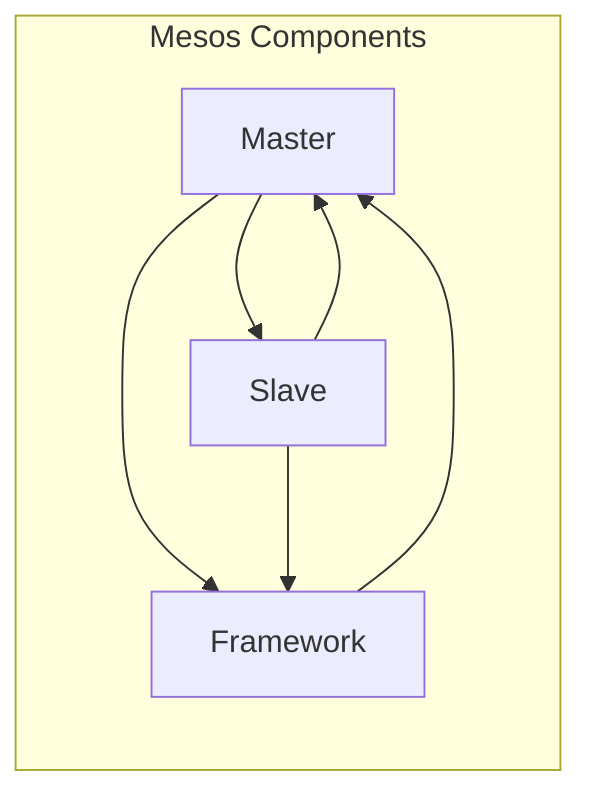

> Mesos, 分布式系统, 资源调度, 容器化, Marathon, Mesos-Docker, 应用部署

# Mesos原理与代码实例讲解

Mesos 是一个强大的分布式资源调度框架，它能够统一管理多台机器上的计算资源，为上层框架提供统一的接口，实现高效、灵活的资源分配和调度。本文将深入讲解 Mesos 的原理，并通过实际代码实例展示如何使用 Mesos 和 Marathon 部署和管理应用。

## 1. 背景介绍

随着云计算和容器化技术的发展，应用部署越来越倾向于分布式架构。然而，传统的单机部署方式难以满足大规模、高可用性的需求。Mesos 应运而生，它通过提供一个统一的资源层，使得上层框架可以跨多个节点共享资源，从而实现更加高效、灵活的资源利用。

### 1.1 问题的由来

在单机部署时代，应用通常运行在单个服务器上，资源利用率较低，且难以扩展。随着应用规模的扩大，单机部署的局限性逐渐显现，主要体现在以下几个方面：

- **资源利用率低**：单机部署下，许多资源如CPU、内存等往往无法充分利用。
- **扩展性差**：单机部署难以满足应用规模扩大的需求，需要不断采购新的服务器。
- **高可用性不足**：单机部署下，一旦服务器出现故障，应用将无法正常运行。

### 1.2 研究现状

Mesos 作为一种分布式资源调度框架，已经成为云计算和容器化领域的核心技术之一。它能够与多种上层框架集成，如 Marathon、Kubernetes 等，为应用提供高效、灵活的资源调度。

### 1.3 研究意义

研究 Mesos 的原理和应用，对于理解分布式系统架构、提升资源利用率、提高应用部署效率具有重要意义。

## 2. 核心概念与联系

### 2.1 核心概念原理

Mesos 的核心概念主要包括以下几部分：

- **Master**：Mesos 集群中的主节点，负责管理集群状态、调度任务等。
- **Slave**：Mesos 集群中的从节点，负责运行任务、汇报状态等。
- **Framework**：Mesos 的上层框架，如 Marathon、Kubernetes 等，负责提交任务、监控任务状态等。
- **Offer**：Mesos 从节点向 Master 提供的资源信息。
- **Task**：Mesos 调度框架提交的任务，由 Master 调度到从节点执行。

以下是 Mesos 架构的 Mermaid 流程图：



### 2.2 联系

Mesos Master 负责管理集群状态和任务调度，从节点 Slave 运行任务并汇报状态，上层框架 Framework 负责提交任务和监控任务状态。三者之间通过 RESTful API 通信，实现高效、可靠的资源调度和任务管理。

## 3. 核心算法原理 & 具体操作步骤

### 3.1 算法原理概述

Mesos 的核心算法包括以下几部分：

- **资源隔离**：Mesos 通过 cgroups 和 namespace 技术实现对资源的隔离，确保每个任务都有独立的资源环境。
- **资源调度**：Mesos 使用一种基于延迟调度的算法，根据任务的优先级和资源需求，动态地将任务调度到合适的从节点。
- **弹性伸缩**：Mesos 支持自动伸缩功能，根据任务负载动态调整资源分配。

### 3.2 算法步骤详解

Mesos 的调度流程大致如下：

1. 从节点向 Master 注册，提供本地的资源信息。
2. Framework 向 Master 提交任务，并指定任务所需的资源。
3. Master 根据任务需求和资源信息，选择合适的从节点执行任务。
4. 从节点启动任务，并向 Master 汇报任务状态。
5. Master 根据任务状态，进行必要的资源调整。

### 3.3 算法优缺点

Mesos 的优点：

- **资源利用率高**：Mesos 通过高效的任务调度和资源管理，能够最大化地利用资源。
- **灵活可扩展**：Mesos 支持多种上层框架和资源类型，能够适应不同的应用场景。
- **高可用性**：Mesos 支持多 Master 集群，确保集群的高可用性。

Mesos 的缺点：

- **复杂性**：Mesos 的架构和配置相对复杂，需要一定的学习成本。
- **性能开销**：Mesos 本身需要消耗一定的资源，可能对性能产生一定的影响。

### 3.4 算法应用领域

Mesos 在以下领域有着广泛的应用：

- **大数据处理**：如 Hadoop、Spark 等。
- **容器化应用**：如 Docker、Kubernetes 等。
- **微服务架构**：如 Spring Cloud、Dubbo 等。

## 4. 数学模型和公式 & 详细讲解 & 举例说明

### 4.1 数学模型构建

Mesos 的调度算法可以抽象为一个优化问题：

$$
\begin{align*}
\text{maximize} \quad & \sum_{i=1}^{N} \pi_i \\
\text{subject to} \quad & \sum_{i=1}^{N} r_i(x_i) \leq R \\
& x_i \in \{0,1\}
\end{align*}
$$

其中，$\pi_i$ 为任务 $i$ 的优先级，$r_i(x_i)$ 为任务 $i$ 在资源 $x_i$ 上的需求，$R$ 为总资源量。

### 4.2 公式推导过程

Mesos 的调度算法基于以下假设：

- 所有任务都是独立的。
- 资源是可以共享的。

基于以上假设，我们可以推导出 Mesos 的调度算法。

### 4.3 案例分析与讲解

假设有一个包含三个任务的集群，每个任务都需要 2 个 CPU 和 4GB 内存。集群总共有 6 个 CPU 和 12GB 内存。

根据资源需求，我们可以将任务分配如下：

- 任务 1：2 个 CPU，4GB 内存
- 任务 2：2 个 CPU，4GB 内存
- 任务 3：2 个 CPU，4GB 内存

这样，所有资源都被充分利用，且没有任务因资源不足而无法执行。

## 5. 项目实践：代码实例和详细解释说明

### 5.1 开发环境搭建

以下是使用 Mesos 和 Marathon 部署应用的基本步骤：

1. 安装 Mesos 和 Marathon。
2. 创建 Mesos 集群。
3. 创建 Marathon 集群。
4. 创建 Marathon 应用。

### 5.2 源代码详细实现

以下是使用 Python 编写的 Marathon 应用配置文件示例：

```python
from marathon import MarathonClient, MarathonApp

client = MarathonClient(url='http://marathon.mesos:8080')

app = MarathonApp(
    id='my-app',
    cmd='java -jar my-app.jar',
    cpus=2.0,
    mem=1024,
    instances=3,
    healthcheck=MarathonApp.Healthcheck(
        path='/health',
        grace=10,
        interval=10,
        timeout=10,
        max_attempts=3
    )
)

client.create_app(app)
```

### 5.3 代码解读与分析

上述代码创建了一个名为 `my-app` 的 Marathon 应用，该应用需要 2 个 CPU 和 1024MB 内存，并运行 3 个实例。同时，我们设置了健康检查机制，确保应用在运行过程中保持健康状态。

### 5.4 运行结果展示

运行上述代码后，Marathon 将创建一个 Mesos 任务，并在集群中执行。可以通过以下命令查看任务状态：

```bash
curl http://marathon.mesos:8080/v2/apps/my-app
```

## 6. 实际应用场景

Mesos 和 Marathon 在以下场景中有着广泛的应用：

- **大数据平台**：如 Apache Mesos、Apache Spark、Apache Hadoop 等。
- **容器化平台**：如 Mesos-Docker、Kubernetes 等。
- **微服务架构**：如 Spring Cloud、Dubbo 等。

## 7. 工具和资源推荐

### 7.1 学习资源推荐

- Mesos 官方文档：[Mesos 官方文档](https://mesos.github.io/)
- Marathon 官方文档：[Marathon 官方文档](https://mesosphere.com/docs/latest/marathon/)
- 《Mesos: A Platform for Fine-Grained Resource Sharing in the Data Center》：Mesos 的开创性论文。

### 7.2 开发工具推荐

- Mesos 和 Marathon 官方客户端：[Mesos 官方客户端](https://mesos.github.io/mesos-go/)、[Marathon 官方客户端](https://github.com/mesosphere/marathon-python)
- Docker：[Docker 官网](https://www.docker.com/)

### 7.3 相关论文推荐

- Mesos: A Platform for Fine-Grained Resource Sharing in the Data Center
- Design and Implementation of Apache Mesos
- A Comparison of Lightweight Container Schedulers

## 8. 总结：未来发展趋势与挑战

### 8.1 研究成果总结

本文深入讲解了 Mesos 的原理和应用，通过实际代码实例展示了如何使用 Mesos 和 Marathon 部署和管理应用。Mesos 作为一种强大的分布式资源调度框架，在云计算和容器化领域有着广泛的应用。

### 8.2 未来发展趋势

Mesos 的发展趋势主要包括：

- 与更多上层框架集成，如 Kubernetes、Spring Cloud 等。
- 加强与容器技术的结合，如 Docker、Kubernetes 等。
- 提高性能和可扩展性，满足更大规模应用的需求。

### 8.3 面临的挑战

Mesos 面临的挑战主要包括：

- 与现有系统的集成问题。
- 性能和可扩展性问题。
- 安全性问题。

### 8.4 研究展望

未来，Mesos 的发展需要关注以下方向：

- 提高与上层框架的集成度。
- 优化性能和可扩展性。
- 加强安全性和稳定性。

## 9. 附录：常见问题与解答

**Q1：Mesos 与 Kubernetes 有什么区别？**

A：Mesos 和 Kubernetes 都是分布式资源调度框架，但它们的设计理念和应用场景有所不同。Mesos 是一个通用的资源调度框架，可以与多种上层框架集成，如 Marathon、Kubernetes 等。Kubernetes 是一个专为容器化应用设计的资源调度框架。在性能方面，Mesos 通常比 Kubernetes 更高效，但 Kubernetes 的生态系统更丰富。

**Q2：Mesos 的资源隔离是如何实现的？**

A：Mesos 通过 cgroups 和 namespace 技术实现对资源的隔离。cgroups 用于限制每个容器或进程的资源使用，而 namespace 用于隔离容器或进程的命名空间，确保它们之间相互独立。

**Q3：如何监控 Mesos 集群的状态？**

A：可以使用 Mesos 官方提供的 Mesos Web UI、Mesos metrics 或其他第三方监控工具来监控 Mesos 集群的状态。

**Q4：如何将 Mesos 集群扩展到更多节点？**

A：将 Mesos 集群扩展到更多节点需要以下步骤：
1. 添加新的从节点到集群。
2. 在新的从节点上启动 Mesos 从节点进程。
3. 在 Master 上更新从节点信息。

**Q5：如何将应用部署到 Mesos 集群？**

A：可以使用 Marathon、Kubernetes 等上层框架将应用部署到 Mesos 集群。具体步骤如下：
1. 编写应用配置文件。
2. 使用 Marathon 或 Kubernetes 客户端将应用提交到 Mesos 集群。
3. 观察应用状态，确保应用正常运行。

---

作者：禅与计算机程序设计艺术 / Zen and the Art of Computer Programming