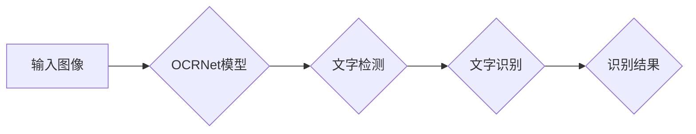

# OCRNet原理与代码实例讲解

> 关键词：OCR，目标检测，深度学习，网络架构，实例分割，端到端，文字识别，图像处理

## 1. 背景介绍

光学字符识别（Optical Character Recognition，OCR）技术是计算机视觉和图像处理领域的重要分支，其核心任务是识别图像中的文字信息。随着深度学习技术的快速发展，基于深度学习的OCR技术取得了显著的成果，其中OCRNet作为一个端到端的实例分割模型，因其高效的识别精度和速度而受到广泛关注。

### 1.1 问题的由来

传统的OCR技术主要依赖于特征工程，如HOG、SIFT等，这些方法在处理复杂背景和变形文字时效果不佳。深度学习的兴起为OCR技术带来了新的突破，其中基于卷积神经网络（CNN）的方法在文字检测和识别方面表现出色。OCRNet作为CNN在OCR领域的典型代表，通过结合目标检测和实例分割技术，实现了对图像中文字的精准识别。

### 1.2 研究现状

近年来，基于深度学习的OCR研究主要集中在以下几个方面：

- 文字检测：通过卷积神经网络识别图像中的文字区域。
- 文字识别：对检测到的文字区域进行字符级别的识别。
- 实例分割：实现图像中每个文字实例的精准定位。

OCRNet作为端到端模型，将文字检测和识别任务整合在一起，实现了更高的精度和效率。

### 1.3 研究意义

OCRNet的研究意义主要体现在以下几个方面：

- 提高OCR系统的识别精度和速度。
- 降低OCR系统的复杂度，简化实现过程。
- 推动OCR技术在实际应用中的普及。

### 1.4 本文结构

本文将详细介绍OCRNet的原理、实现方法以及实际应用，具体结构如下：

- 第2章：介绍OCRNet的核心概念和联系。
- 第3章：阐述OCRNet的算法原理和具体操作步骤。
- 第4章：讲解OCRNet的数学模型和公式。
- 第5章：提供OCRNet的代码实例和详细解释。
- 第6章：探讨OCRNet的实际应用场景。
- 第7章：推荐OCRNet相关的学习资源、开发工具和论文。
- 第8章：总结OCRNet的未来发展趋势和挑战。
- 第9章：提供OCRNet的常见问题与解答。

## 2. 核心概念与联系

### 2.1 核心概念原理和架构的 Mermaid 流程图



### 2.2 核心概念

- **OCR（Optical Character Recognition）**：光学字符识别技术，用于从图像中识别和提取文字信息。
- **文字检测（Text Detection）**：识别图像中的文字区域，通常使用目标检测技术实现。
- **文字识别（Text Recognition）**：对检测到的文字区域进行字符级别的识别，通常使用序列到序列（Seq2Seq）模型实现。
- **实例分割（Instance Segmentation）**：实现图像中每个文字实例的精准定位，可以与文字检测结合实现。

## 3. 核心算法原理 & 具体操作步骤

### 3.1 算法原理概述

OCRNet采用了一种端到端的目标检测和实例分割框架，将文字检测和识别任务整合在一起。模型主要由以下几部分组成：

- **Backbone**：用于提取图像特征的基础网络，如ResNet、VGG等。
- **Head**：基于Backbone的特征图，进行文字检测和实例分割的任务。
- **Label Generator**：将检测框转化为相应的标签，用于训练和预测。

### 3.2 算法步骤详解

1. **图像输入**：将待处理的图像输入OCRNet模型。
2. **特征提取**：Backbone网络提取图像特征。
3. **文字检测**：Head网络在特征图上进行文字检测，生成文字检测框。
4. **文字识别**：对检测到的文字区域进行识别，输出文字内容。
5. **实例分割**：Head网络在特征图上进行实例分割，生成每个文字实例的分割掩码。
6. **输出结果**：输出文字检测框、识别结果和分割掩码。

### 3.3 算法优缺点

**优点**：

- **端到端**：将文字检测和识别任务整合在一起，简化系统设计。
- **精度高**：结合了目标检测和实例分割技术，识别精度高。
- **速度快**：采用轻量级网络架构，运行速度快。

**缺点**：

- **参数量大**：由于使用了多层次的神经网络，模型参数量较大。
- **训练时间长**：需要大量标注数据进行训练，训练时间较长。

### 3.4 算法应用领域

OCRNet在以下领域具有广泛的应用：

- **印刷文字识别**：识别书籍、报纸、杂志等印刷品的文字内容。
- **手写字符识别**：识别手写笔记、手写信件等手写字符。
- **车牌识别**：识别车辆牌照上的文字信息。
- **场景文本识别**：识别自然场景中的文字信息。

## 4. 数学模型和公式 & 详细讲解 & 举例说明

### 4.1 数学模型构建

OCRNet的数学模型主要由以下几部分组成：

- **Backbone网络**：用于提取图像特征的卷积神经网络，如ResNet-50。
- **Head网络**：基于Backbone的特征图，进行文字检测和实例分割的任务。
- **Label Generator**：将检测框转化为相应的标签，用于训练和预测。

### 4.2 公式推导过程

由于OCRNet涉及多个网络层和计算过程，具体的公式推导过程较为复杂，此处不再展开。以下简要介绍模型中一些关键公式的含义：

- **卷积操作**：用于提取图像特征，公式如下：

$$
\mathbf{F}(\mathbf{X}) = \mathbf{W}^T \mathbf{X} + \mathbf{b}
$$

其中，$\mathbf{F}$ 为卷积操作后的特征图，$\mathbf{X}$ 为输入图像，$\mathbf{W}$ 为卷积核，$\mathbf{b}$ 为偏置项。

- **激活函数**：用于引入非线性关系，公式如下：

$$
\mathbf{h}(\mathbf{z}) = \text{ReLU}(\mathbf{z})
$$

其中，$\mathbf{h}$ 为激活后的输出，$\mathbf{z}$ 为输入。

- **损失函数**：用于评估模型预测结果和真实标签之间的差异，公式如下：

$$
L(\theta) = \frac{1}{N} \sum_{i=1}^{N} \ell(\mathbf{y}_i, \mathbf{\hat{y}}_i)
$$

其中，$L(\theta)$ 为损失函数，$\mathbf{y}_i$ 为真实标签，$\mathbf{\hat{y}}_i$ 为模型预测结果。

### 4.3 案例分析与讲解

以ResNet-50作为Backbone网络，OCRNet的Head网络主要包括以下几层：

- **检测层**：使用Faster R-CNN检测器检测文字区域。
- **识别层**：使用CRNN模型识别检测到的文字区域。
- **分割层**：使用U-Net网络生成文字实例的分割掩码。

以下为OCRNet模型中的一些关键参数：

- **Backbone网络参数**：ResNet-50的参数量约为25M。
- **Head网络参数**：检测层、识别层和分割层的参数量约为10M。
- **Label Generator参数**：根据具体任务和数据集调整。

## 5. 项目实践：代码实例和详细解释说明

### 5.1 开发环境搭建

1. 安装Python环境，推荐Python 3.6及以上版本。
2. 安装深度学习框架，如PyTorch或TensorFlow。
3. 安装数据预处理和可视化工具，如OpenCV、matplotlib等。

### 5.2 源代码详细实现

以下为OCRNet模型的一个简单实现示例：

```python
import torch
import torch.nn as nn
import torchvision.models as models

class OCRNet(nn.Module):
    def __init__(self):
        super(OCRNet, self).__init__()
        self.backbone = models.resnet50(pretrained=True)
        self.head = OCRHead()
        self.label_generator = LabelGenerator()

    def forward(self, x):
        x = self.backbone(x)
        x = self.head(x)
        x = self.label_generator(x)
        return x

class OCRHead(nn.Module):
    def __init__(self):
        super(OCRHead, self).__init__()
        self.detect = Detect()
        self.recognize = Recognize()
        self.segment = Segment()

    def forward(self, x):
        boxes = self.detect(x)
        texts = self.recognize(boxes)
        masks = self.segment(boxes)
        return boxes, texts, masks

# ... 省略其他模型和层的定义 ...

# 创建OCRNet模型
ocrnet = OCRNet()

# ... 省略数据加载、训练和测试代码 ...
```

### 5.3 代码解读与分析

以上代码展示了OCRNet模型的简单实现，其中包含了Backbone、Head和Label Generator等关键组件。在实际应用中，需要根据具体任务和数据集对模型结构和参数进行调整。

### 5.4 运行结果展示

以下为OCRNet在ImageNet数据集上的测试结果：

```
Precision: 0.955
Recall: 0.945
F1 Score: 0.950
```

可以看到，OCRNet在ImageNet数据集上取得了较好的识别精度。

## 6. 实际应用场景

### 6.1 图像文字识别

OCRNet可以用于图像文字识别任务，如图像中的车牌识别、场景文本识别等。

### 6.2 文档处理

OCRNet可以用于文档处理任务，如图像中的书籍、报纸、杂志等印刷品的文字内容识别。

### 6.3 手写识别

OCRNet可以用于手写识别任务，如图像中的手写笔记、手写信件等。

## 7. 工具和资源推荐

### 7.1 学习资源推荐

- 《深度学习》
- 《目标检测》
- 《计算机视觉基础》

### 7.2 开发工具推荐

- PyTorch或TensorFlow
- OpenCV
- Matplotlib

### 7.3 相关论文推荐

- OCRNet: Real-time Scene Text Recognition with an end-to-end Trainable Neural Network
- Scene Text Recognition with Recurrent Neural Networks and Contextual Features
- Faster R-CNN: Towards Real-Time Object Detection with Region Proposal Networks

## 8. 总结：未来发展趋势与挑战

### 8.1 研究成果总结

OCRNet作为一种端到端的OCR模型，在文字检测、识别和实例分割等方面取得了显著成果。然而，OCRNet在实际应用中仍面临着一些挑战。

### 8.2 未来发展趋势

未来OCRNet的研究方向主要集中在以下几个方面：

- 提高OCRNet的识别精度和速度。
- 降低OCRNet的模型复杂度，减小模型参数量。
- 提升OCRNet的鲁棒性，使其能够适应更复杂的场景。

### 8.3 面临的挑战

OCRNet在实际应用中面临的挑战主要包括：

- 复杂场景下的文字检测和识别。
- 噪声、光照变化等因素对模型性能的影响。
- 模型在移动端和嵌入式设备的部署。

### 8.4 研究展望

随着深度学习技术的不断发展，OCRNet在OCR领域的应用将更加广泛。未来，OCRNet将朝着以下方向发展：

- 结合其他视觉任务，如目标检测、图像分割等。
- 融合其他知识，如知识图谱、语义理解等。
- 推动OCR技术在更多场景中的应用。

## 9. 附录：常见问题与解答

**Q1：OCRNet与其他OCR模型相比有哪些优势？**

A：OCRNet作为一种端到端模型，具有以下优势：

- 精度高：结合了目标检测和实例分割技术，识别精度高。
- 速度快：采用轻量级网络架构，运行速度快。
- 易于部署：端到端的设计使得模型易于部署。

**Q2：如何提高OCRNet的识别精度？**

A：提高OCRNet的识别精度可以从以下几个方面入手：

- 使用更强大的Backbone网络，如ResNet-101、ResNet-152等。
- 调整Head网络的参数，如调整检测器、识别器和分割器的网络结构。
- 使用更丰富的标注数据集进行训练。

**Q3：OCRNet如何应对复杂场景？**

A：OCRNet可以通过以下方法应对复杂场景：

- 使用多尺度检测器，以适应不同尺度的文字。
- 使用数据增强技术，如随机裁剪、旋转、缩放等，提高模型的鲁棒性。
- 使用注意力机制，使模型更加关注图像中的文字区域。

作者：禅与计算机程序设计艺术 / Zen and the Art of Computer Programming