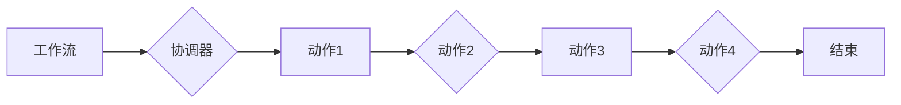

# Oozie工作流调度原理与代码实例讲解

> 关键词：Oozie，Hadoop，工作流，调度器，MapReduce，Hive，Pig，YARN，HDFS

## 1. 背景介绍

在分布式计算领域，Hadoop生态系统提供了强大的数据处理能力。然而，对于复杂的作业流程，手动管理多个MapReduce、Hive、Pig等作业的执行变得异常繁琐。Oozie应运而生，它是一个强大的工作流调度系统，可以自动化地编排和调度Hadoop生态系统的各种作业。本文将深入探讨Oozie的工作流调度原理，并通过代码实例进行详细讲解。

## 2. 核心概念与联系

### 2.1 核心概念

- **Oozie**：一个基于Hadoop生态系统的工作流调度器，用于定义、调度和管理Hadoop作业。
- **工作流**：Oozie中的作业单元，由多个动作组成，每个动作可以是一个MapReduce作业、Hive查询、Pig脚本或其他Hadoop作业。
- **动作**：工作流中的单个任务，如MapReduce作业、Hive查询等。
- **协调器**：工作流中的特殊动作，用于控制工作流的执行逻辑，如条件分支、循环等。
- **数据流**：工作流中动作之间的依赖关系，定义了动作执行的顺序。

### 2.2 架构的 Mermaid 流程图



在这个流程图中，工作流由一个开始节点A开始，经过一系列的动作（C、D、E、F），最后以结束节点G结束。协调器B用于控制动作之间的执行逻辑。

## 3. 核心算法原理 & 具体操作步骤

### 3.1 算法原理概述

Oozie的核心原理是定义一个工作流，其中包含一系列动作和协调器。Oozie服务器会根据工作流定义执行这些动作，并根据数据流控制动作的执行顺序。

### 3.2 算法步骤详解

1. 用户定义工作流，指定动作和协调器。
2. Oozie服务器解析工作流定义，构建工作流执行计划。
3. Oozie服务器根据执行计划开始执行动作，并根据数据流控制执行顺序。
4. 动作执行完成后，Oozie服务器检查是否有后续动作依赖，如果有，则等待依赖动作完成后继续执行。
5. 所有动作执行完成后，工作流结束。

### 3.3 算法优缺点

**优点**：

- **自动化**：自动化编排和调度Hadoop作业，简化了作业管理流程。
- **易于使用**：通过简单的XML文件定义工作流，易于理解和维护。
- **灵活性**：支持多种类型的动作和协调器，适用于各种复杂的工作流。

**缺点**：

- **复杂性**：对于复杂的作业流程，工作流定义可能变得相当复杂。
- **性能**：Oozie服务器需要解析和执行工作流定义，可能会对性能产生一定影响。

### 3.4 算法应用领域

Oozie适用于以下场景：

- **批处理作业**：自动化批处理作业的执行，如MapReduce、Hive、Pig作业。
- **数据管道**：构建数据管道，将数据从源系统传输到目标系统。
- **数据仓库**：自动化数据仓库的ETL过程。
- **机器学习**：自动化机器学习模型的训练和部署。

## 4. 数学模型和公式 & 详细讲解 & 举例说明

### 4.1 数学模型构建

Oozie工作流调度可以看作是一个有向无环图（DAG）的执行过程。每个节点代表一个动作，边代表动作之间的依赖关系。

### 4.2 公式推导过程

假设工作流包含n个动作，动作i的执行依赖于动作j（j<i），则动作i的执行时间可以表示为：

$$
T_i = T_j + C_i
$$

其中，$T_i$是动作i的执行时间，$T_j$是动作j的执行时间，$C_i$是动作i的执行成本。

### 4.3 案例分析与讲解

假设有一个工作流，包含以下动作：

- 动作1：MapReduce作业，执行成本为10分钟。
- 动作2：Hive查询，执行成本为5分钟。
- 动作3：Pig脚本，执行成本为8分钟。

动作1完成后，动作2和动作3可以并行执行。因此，动作2的执行时间取决于动作1的执行时间加上动作2的执行成本：

$$
T_2 = T_1 + C_2 = 10 + 5 = 15 \text{分钟}
$$

动作3的执行时间也类似：

$$
T_3 = T_1 + C_3 = 10 + 8 = 18 \text{分钟}
$$

因此，整个工作流的执行时间为18分钟。

## 5. 项目实践：代码实例和详细解释说明

### 5.1 开发环境搭建

1. 安装Hadoop和Oozie。
2. 配置Hadoop和Oozie，使其可以正常工作。

### 5.2 源代码详细实现

以下是一个简单的Oozie工作流定义示例：

```xml
<workflow xmlns="uri:oozie:workflow:0.4" name="example-workflow">
  <start to="mapreduce1"/>
  <action name="mapreduce1">
    <map-reduce xmlns="uri:oozie:map-reduce:0.2">
      <job-tracker>http://localhost:50030</job-tracker>
      <name-node>http://localhost:50070</name-node>
      <job-xml>/path/to/job.xml</job-xml>
    </map-reduce>
  </action>
  <end/>
</workflow>
```

这个工作流定义了一个名为`example-workflow`的工作流，它包含一个名为`mapreduce1`的MapReduce动作。工作流启动后会执行这个MapReduce动作。

### 5.3 代码解读与分析

- `<workflow>` 标签定义了整个工作流的根节点。
- `<start>` 标签定义了工作流的开始节点。
- `<action>` 标签定义了一个动作，包括动作的类型和名称。
- `<map-reduce>` 标签定义了一个MapReduce动作，包括作业跟踪器、名称节点和作业XML文件路径。

### 5.4 运行结果展示

在Oozie管理界面中，可以查看工作流的执行状态和日志信息。如果工作流执行成功，则表示所有动作都执行完成。

## 6. 实际应用场景

Oozie在实际应用中非常广泛，以下是一些常见的应用场景：

- **数据仓库ETL**：自动化ETL过程，从源系统提取数据，转换并加载到数据仓库。
- **机器学习模型训练**：自动化机器学习模型的训练过程，包括数据预处理、模型训练和模型评估。
- **报告生成**：自动化报告生成过程，包括数据提取、数据分析和报告格式化。

## 7. 工具和资源推荐

### 7.1 学习资源推荐

- Oozie官方文档：https://oozie.apache.org/
- Hadoop官方文档：https://hadoop.apache.org/

### 7.2 开发工具推荐

- IntelliJ IDEA：支持Oozie插件，可以方便地开发Oozie工作流。
- Eclipse：支持Oozie插件，可以方便地开发Oozie工作流。

### 7.3 相关论文推荐

- Hadoop: The Definitive Guide by Tom White
- Oozie: A Coordinated Workflow System for Hadoop by Suresh Sastri

## 8. 总结：未来发展趋势与挑战

### 8.1 研究成果总结

本文介绍了Oozie工作流调度原理，并通过代码实例进行了详细讲解。Oozie作为一种强大的工作流调度器，在Hadoop生态系统中的应用越来越广泛。

### 8.2 未来发展趋势

- Oozie将进一步与云计算平台集成，如AWS、Azure等。
- Oozie将支持更多的作业类型，如Spark、Flink等。
- Oozie将提供更丰富的调度策略，如依赖管理、资源管理等。

### 8.3 面临的挑战

- Oozie的学习曲线相对较陡峭，需要一定的时间来掌握。
- Oozie的性能需要进一步优化，以满足大规模作业的需求。

### 8.4 研究展望

Oozie将继续在Hadoop生态系统中的应用，并与其他技术融合，如大数据分析、机器学习等，为构建智能化的数据处理平台提供支持。

## 9. 附录：常见问题与解答

**Q1：Oozie与Quartz相比有什么区别？**

A: Oozie是一个专门为Hadoop生态系统设计的工作流调度器，而Quartz是一个通用的定时任务调度器。Oozie提供了更丰富的作业类型和调度策略，更适合于Hadoop生态系统的作业调度。

**Q2：如何调试Oozie工作流？**

A：可以通过Oozie管理界面查看工作流的执行状态和日志信息，以及Hadoop集群的日志信息来调试Oozie工作流。

**Q3：Oozie如何处理作业失败的情况？**

A：Oozie会根据工作流定义中的失败处理策略来处理作业失败的情况。可以选择重试失败的动作、跳过失败的动作或终止整个工作流。

作者：禅与计算机程序设计艺术 / Zen and the Art of Computer Programming