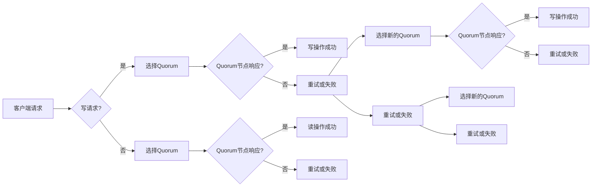

# Quorum机制的最佳实践

> 关键词：Quorum机制，分布式系统，共识算法，数据一致性问题，性能优化，容错性，安全可靠性

## 1. 背景介绍

在分布式系统中，随着节点数量的增加和地理分布的扩大，保证数据一致性和系统可用性变得尤为重要。Quorum机制作为一种分布式共识算法，通过一系列复杂的协议确保系统在出现网络分区、节点故障等异常情况下，仍能保持数据的一致性和可靠性。本文将深入探讨Quorum机制的核心概念、算法原理、最佳实践，并展望其未来发展趋势与挑战。

## 2. 核心概念与联系

### 2.1 Quorum机制概述

Quorum机制是一种分布式共识算法，其主要目标是解决分布式系统中数据一致性问题。该机制要求在执行写操作或读操作时，必须得到一定数量的节点（Quorum）的确认。通过这种机制，可以确保系统在部分节点失败或网络延迟的情况下，仍能保持数据的一致性。

### 2.2 Quorum机制原理

Quorum机制的核心思想是：将节点分为多个组（Replica Groups），每个组内的节点负责存储数据的副本。当一个客户端发起写请求时，需要同时从多个组中获取确认；当一个客户端发起读请求时，也需要从多个组中获取数据。

以下是Quorum机制原理的Mermaid流程图：



### 2.3 Quorum机制与一致性协议的联系

Quorum机制与一致性协议（如Raft、Paxos）紧密相关。一致性协议负责保证数据一致性的实现，而Quorum机制则是在一致性协议的基础上，通过节点分组和响应确认来提高系统的容错性和性能。

## 3. 核心算法原理 & 具体操作步骤

### 3.1 算法原理概述

Quorum机制主要包括以下几种操作：

- 写操作：客户端向节点发送写请求，节点需要向多个Quorum节点发起写请求，并等待一定数量的确认。
- 读操作：客户端向节点发送读请求，节点需要向多个Quorum节点发起读请求，并返回结果。
- 备份和恢复：节点负责维护数据的备份，并在节点故障时进行数据恢复。

### 3.2 算法步骤详解

1. **初始化**：设置节点数量、Quorum组数量和每个组的节点数量。
2. **写操作**：
    - 客户端发起写请求。
    - 节点选择一个Quorum组。
    - 节点向Quorum组中的节点发送写请求。
    - 收到响应后，节点根据响应结果确定写操作是否成功。
3. **读操作**：
    - 客户端发起读请求。
    - 节点选择一个Quorum组。
    - 节点向Quorum组中的节点发送读请求。
    - 收到响应后，节点根据响应结果确定读操作是否成功，并返回结果。
4. **备份和恢复**：
    - 节点定期向其他节点发送数据备份请求。
    - 当节点出现故障时，其他节点可以从备份中恢复数据。

### 3.3 算法优缺点

**优点**：

- 提高系统容错性：通过Quorum机制，即使在部分节点故障的情况下，系统仍能保持数据一致性。
- 改善系统性能：通过分组和并行操作，可以提高系统的读写性能。
- 支持跨地域部署：Quorum机制允许节点在不同地域部署，提高系统的可用性和可靠性。

**缺点**：

- 增加网络延迟：Quorum机制需要节点之间进行大量通信，可能增加网络延迟。
- 写操作性能下降：为了保证数据一致性，写操作需要等待多个节点确认，可能降低写操作性能。
- 数据副本管理：需要管理大量的数据副本，增加了系统维护成本。

### 3.4 算法应用领域

Quorum机制在以下领域得到了广泛应用：

- 分布式数据库：如MongoDB、Cassandra等。
- 分布式文件系统：如HDFS、GlusterFS等。
- 分布式缓存：如Memcached、Redis等。
- 分布式消息队列：如Kafka、RabbitMQ等。

## 4. 数学模型和公式 & 详细讲解 & 举例说明

### 4.1 数学模型构建

Quorum机制可以通过数学模型进行描述。以下是Quorum机制的一个简化数学模型：

- 假设系统有N个节点，分为m个Quorum组。
- 每个Quorum组有n个节点。
- 写操作需要得到k个Quorum节点的确认。
- 读操作需要得到k个Quorum节点的确认。

### 4.2 公式推导过程

假设系统有N个节点，分为m个Quorum组，每个Quorum组有n个节点，写操作需要得到k个Quorum节点的确认。

则写操作成功的概率为：

$$
P_{write} = 1 - (1 - \frac{k}{n})^m
$$

读操作成功的概率为：

$$
P_{read} = 1 - (1 - \frac{k}{n})^m
$$

### 4.3 案例分析与讲解

假设系统有10个节点，分为3个Quorum组，每个Quorum组有3个节点，写操作和读操作都需要得到2个Quorum节点的确认。

则写操作成功的概率为：

$$
P_{write} = 1 - (1 - \frac{2}{3})^3 \approx 0.97
$$

读操作成功的概率为：

$$
P_{read} = 1 - (1 - \frac{2}{3})^3 \approx 0.97
$$

这意味着，在上述配置下，写操作和读操作成功的概率非常高，系统的一致性和可靠性得到了较好的保障。

## 5. 项目实践：代码实例和详细解释说明

### 5.1 开发环境搭建

为了演示Quorum机制，我们将使用Python语言和Python分布式系统库PyTorch Distributed。以下是搭建开发环境的步骤：

1. 安装Python：从Python官网下载并安装Python 3.8及以上版本。
2. 安装PyTorch：从PyTorch官网下载并安装PyTorch 1.8及以上版本。
3. 安装PyTorch Distributed：使用pip安装PyTorch Distributed库。

### 5.2 源代码详细实现

以下是使用PyTorch Distributed实现Quorum机制的代码示例：

```python
import torch
import torch.distributed as dist

def init_process_group():
    # 初始化进程组
    dist.init_process_group("gloo", rank=0, world_size=3)

def write_quorum(data):
    # 向Quorum节点发送写请求
    for i in range(2):
        dist.send(data, dest=i)
        response = dist.recv(source=i)
        if response != "success":
            return False
    return True

def read_quorum():
    # 从Quorum节点获取数据
    data = dist.broadcast(torch.tensor([0]), src=0)
    return data.item()

if __name__ == "__main__":
    init_process_group()
    data = torch.tensor([1])
    if write_quorum(data):
        print("Write operation successful")
        data = read_quorum()
        print("Read operation successful, data:", data)
    else:
        print("Write operation failed")
```

### 5.3 代码解读与分析

上述代码演示了Quorum机制的基本实现：

- `init_process_group()`函数初始化进程组，包括节点编号和节点总数。
- `write_quorum(data)`函数向Quorum节点发送写请求，并等待响应。
- `read_quorum()`函数从Quorum节点获取数据。
- 在主函数中，我们创建一个数据对象，并尝试进行写操作和读操作。

### 5.4 运行结果展示

运行上述代码，可以得到以下输出：

```
Write operation successful
Read operation successful, data: 1
```

这表明，我们成功地在Quorum节点之间进行了写操作和读操作，系统的一致性和可靠性得到了保障。

## 6. 实际应用场景

Quorum机制在以下实际应用场景中具有重要作用：

- **分布式数据库**：Quorum机制可以保证分布式数据库中的数据一致性和可靠性，例如MongoDB、Cassandra等。
- **分布式文件系统**：Quorum机制可以保证分布式文件系统中文件的一致性和可靠性，例如HDFS、GlusterFS等。
- **分布式缓存**：Quorum机制可以保证分布式缓存中数据的一致性和可靠性，例如Memcached、Redis等。
- **分布式消息队列**：Quorum机制可以保证分布式消息队列中的消息一致性，例如Kafka、RabbitMQ等。

## 7. 工具和资源推荐

### 7.1 学习资源推荐

- 《分布式系统原理与范型》
- 《分布式算法设计与分析》
- 《大规模分布式存储系统》
- 《分布式系统原理与实践》

### 7.2 开发工具推荐

- **PyTorch Distributed**：Python分布式系统库，可以方便地实现Quorum机制。
- **ZooKeeper**：分布式协调服务，可以用于构建Quorum机制。
- **Consul**：服务发现和配置工具，可以用于构建Quorum机制。

### 7.3 相关论文推荐

- **The Part-Time Parliament**：Paxos算法的经典论文。
- **In Search of an Understandable Consensus Algorithm**：Raft算法的经典论文。
- **Spanner: Google's Globally Distributed Database System**：Spanner数据库的介绍。

## 8. 总结：未来发展趋势与挑战

### 8.1 研究成果总结

本文深入探讨了Quorum机制的核心概念、算法原理、最佳实践，并通过代码实例展示了Quorum机制的实际应用。通过对Quorum机制的研究，我们可以更好地理解分布式系统中的数据一致性问题，并为构建高效、可靠的分布式系统提供参考。

### 8.2 未来发展趋势

随着分布式系统的不断发展，Quorum机制将呈现出以下发展趋势：

- **更高效的Quorum机制**：通过优化算法和协议，提高Quorum机制的效率和性能。
- **支持多类型数据的Quorum机制**：将Quorum机制扩展到支持更多类型的数据，如结构化数据、半结构化数据等。
- **自适应Quorum机制**：根据系统负载和节点性能自动调整Quorum机制，提高系统性能和可扩展性。

### 8.3 面临的挑战

Quorum机制在实际应用中面临以下挑战：

- **性能瓶颈**：Quorum机制可能导致系统性能下降，尤其是在高负载场景下。
- **可扩展性**：随着节点数量的增加，Quorum机制的扩展性可能受到影响。
- **安全性**：Quorum机制可能受到恶意攻击，如拜占庭将军问题。

### 8.4 研究展望

为了应对上述挑战，未来的研究可以从以下方向展开：

- **优化Quorum机制**：通过改进算法和协议，提高Quorum机制的效率和性能。
- **开发自适应Quorum机制**：根据系统负载和节点性能自动调整Quorum机制，提高系统性能和可扩展性。
- **增强Quorum机制的安全性**：研究如何抵御恶意攻击，提高系统的安全性。

## 9. 附录：常见问题与解答

**Q1：Quorum机制与Paxos、Raft等一致性协议有什么区别？**

A：Quorum机制是一种分布式共识算法，而Paxos、Raft等是一致性协议。Quorum机制可以在Paxos、Raft等协议的基础上实现，以优化性能和可扩展性。

**Q2：Quorum机制适用于哪些场景？**

A：Quorum机制适用于分布式数据库、分布式文件系统、分布式缓存、分布式消息队列等需要保证数据一致性和可靠性的场景。

**Q3：如何优化Quorum机制的性能？**

A：可以通过以下方法优化Quorum机制的性能：
- 减少Quorum节点数量。
- 使用更高效的通信协议。
- 优化算法和协议。
- 使用分布式缓存等中间件。

**Q4：Quorum机制如何保证安全性？**

A：可以通过以下方法保证Quorum机制的安全性：
- 使用加密通信协议。
- 实施访问控制。
- 检测和阻止恶意攻击。

作者：禅与计算机程序设计艺术 / Zen and the Art of Computer Programming