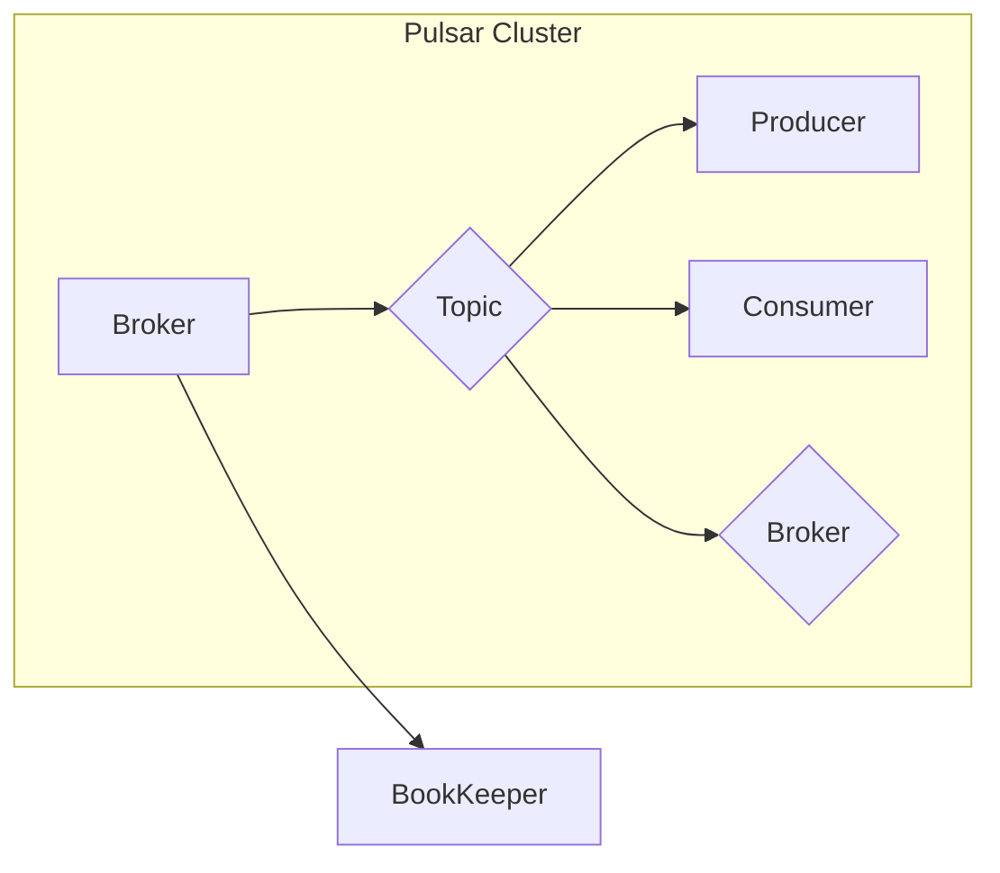

# Pulsar原理与代码实例讲解

> 关键词：Pulsar, 分布式消息队列, Apache Pulsar, 流计算, 容器化, 消息传递, 持久化存储, 事务消息

## 1. 背景介绍

随着云计算和大数据技术的发展，分布式系统在各个领域得到了广泛应用。分布式消息队列作为分布式系统中的关键组件，负责在系统组件之间传递消息，是实现系统解耦、提高系统可靠性和扩展性的重要手段。Apache Pulsar 是一个高性能、可扩展的分布式消息队列，它提供了可靠的消息传递、持久化存储和事务消息等特性，被广泛应用于流计算、事件驱动架构和微服务等领域。

本文将深入探讨 Apache Pulsar 的原理，并通过代码实例讲解如何使用 Pulsar 进行消息传递。

## 2. 核心概念与联系

### 2.1 Pulsar 核心概念

- **命名空间**：命名空间是 Pulsar 中的一个逻辑隔离级别，用于组织和管理不同的主题、订阅者和生产者。
- **主题**：主题是 Pulsar 中的消息分类，消息被发送到主题，然后由订阅者读取。
- **订阅者**：订阅者从主题中读取消息，可以按需消费消息，也可以持久化订阅。
- **生产者**：生产者向主题发送消息，可以保证消息的可靠性和顺序。
- **经纪人**：经纪人负责管理命名空间、主题、订阅者和生产者之间的关系，并负责消息的路由和分发。
- **BookKeeper**：BookKeeper 是一个分布式存储系统，用于存储 Pulsar 的元数据和消息数据。

### 2.2 Pulsar 架构图

以下是一个简单的 Pulsar 架构图，展示了 Pulsar 中的关键组件及其关系：



图中，Broker 负责管理主题、订阅者和生产者，BookKeeper 负责存储元数据和消息数据。

## 3. 核心算法原理 & 具体操作步骤

### 3.1 算法原理概述

Pulsar 的核心算法原理可以概括为以下几点：

- **消息持久化**：Pulsar 使用 BookKeeper 存储消息数据，确保消息的持久化和可靠性。
- **消息顺序保证**：Pulsar 保证消息在主题中的顺序，即使在分布式环境中也能保持顺序。
- **消息可靠传递**：Pulsar 提供可靠的发布-订阅模型，保证消息的可靠传递。
- **分区和复制**：Pulsar 支持分区和复制，提高系统的扩展性和可靠性。

### 3.2 算法步骤详解

1. **生产者发送消息**：生产者将消息发送到主题，消息会被写入到 BookKeeper。
2. **Broker 路由消息**：Broker 根据主题和订阅者的配置，将消息路由到对应的订阅者。
3. **订阅者接收消息**：订阅者从 Broker 接收消息，并存储在本地存储中。
4. **消息确认**：订阅者确认接收到的消息，Broker 会将消息从 BookKeeper 中删除。

### 3.3 算法优缺点

#### 优点：

- **高性能**：Pulsar 提供高性能的消息传递，可以支持高并发的消息处理。
- **高可靠性**：Pulsar 保证消息的可靠性和顺序，即使系统出现故障也能保证数据的完整性。
- **可扩展性**：Pulsar 支持水平扩展，可以轻松地增加更多的 Broker 和 BookKeeper 节点。
- **事务消息**：Pulsar 支持事务消息，确保消息的原子性和一致性。

#### 缺点：

- **复杂度**：Pulsar 的架构比较复杂，需要一定的学习和使用成本。
- **资源消耗**：Pulsar 需要较多的资源来支持其运行，包括 CPU、内存和存储。

### 3.4 算法应用领域

Pulsar 可以应用于以下领域：

- **流计算**：Pulsar 可以作为流计算系统的数据源，提供实时数据流。
- **事件驱动架构**：Pulsar 可以作为事件源，触发不同的业务流程。
- **微服务**：Pulsar 可以作为微服务之间的通信桥梁，实现服务解耦。

## 4. 数学模型和公式 & 详细讲解 & 举例说明

### 4.1 数学模型构建

Pulsar 的数学模型可以概括为以下公式：

$$
Pulsar = \{Broker, Topic, Consumer, Producer, BookKeeper\}
$$

其中：

- $Broker$ 表示消息队列的节点。
- $Topic$ 表示消息的分类。
- $Consumer$ 表示消息的消费者。
- $Producer$ 表示消息的生产者。
- $BookKeeper$ 表示消息的持久化存储。

### 4.2 公式推导过程

由于 Pulsar 是一个分布式系统，其公式推导过程比较复杂，涉及到分布式计算、网络通信等多个方面。以下是一个简化的推导过程：

1. **消息发布**：生产者将消息发送到主题，消息会被序列化并传输到 Broker。
2. **消息存储**：Broker 将消息写入到 BookKeeper。
3. **消息分发**：Broker 根据订阅者的配置，将消息路由到对应的订阅者。
4. **消息消费**：订阅者从 Broker 接收消息，并存储在本地存储中。

### 4.3 案例分析与讲解

以下是一个简单的 Pulsar 消息传递的实例：

假设有一个生产者生产数据，发送到名为 "my-topic" 的主题，有一个消费者从该主题消费数据。

```java
// 生产者
Producer producer = pulsarClient.newProducer()
    .topic("my-topic")
    .create();

int sequence = 0;
while (true) {
    String message = "Message " + sequence;
    producer.send(message.getBytes());
    sequence++;
}
```

```java
// 消费者
Consumer consumer = pulsarClient.newConsumer()
    .topic("my-topic")
    .subscribe();

while (true) {
    byte[] bytes = consumer.receive();
    String message = new String(bytes);
    System.out.println("Received message: " + message);
}
```

在这个例子中，生产者不断地向 "my-topic" 主题发送消息，消费者从该主题消费消息并打印出来。

## 5. 项目实践：代码实例和详细解释说明

### 5.1 开发环境搭建

1. 安装 Java 开发环境。
2. 安装 Maven。
3. 添加 Pulsar 客户端库依赖。

```xml
<dependency>
    <groupId>org.apache.pulsar</groupId>
    <artifactId>pulsar-client</artifactId>
    <version>2.8.2</version>
</dependency>
```

### 5.2 源代码详细实现

**生产者示例代码**：

```java
// 生产者
Producer producer = pulsarClient.newProducer()
    .topic("my-topic")
    .create();

int sequence = 0;
while (true) {
    String message = "Message " + sequence;
    producer.send(message.getBytes());
    sequence++;
}
```

**消费者示例代码**：

```java
// 消费者
Consumer consumer = pulsarClient.newConsumer()
    .topic("my-topic")
    .subscribe();

while (true) {
    byte[] bytes = consumer.receive();
    String message = new String(bytes);
    System.out.println("Received message: " + message);
}
```

### 5.3 代码解读与分析

在这个例子中，生产者不断地向 "my-topic" 主题发送消息，消费者从该主题消费消息并打印出来。这是 Pulsar 消息传递的基本流程。

### 5.4 运行结果展示

运行以上代码，可以看到消费者不断地打印出生产者发送的消息。

## 6. 实际应用场景

Pulsar 在以下场景中有着广泛的应用：

- **流计算**：Pulsar 可以作为 Apache Flink 和 Apache Spark 等流计算框架的数据源，提供实时数据流。
- **事件驱动架构**：Pulsar 可以作为事件源，触发不同的业务流程。
- **微服务**：Pulsar 可以作为微服务之间的通信桥梁，实现服务解耦。

## 7. 工具和资源推荐

### 7.1 学习资源推荐

- Apache Pulsar 官方文档：[https://pulsar.apache.org/docs/](https://pulsar.apache.org/docs/)
- Apache Pulsar GitHub 代码仓库：[https://github.com/apache/pulsar](https://github.com/apache/pulsar)

### 7.2 开发工具推荐

- Maven：[https://maven.apache.org/](https://maven.apache.org/)
- IntelliJ IDEA 或 Eclipse：用于 Java 开发

### 7.3 相关论文推荐

- Apache Pulsar 论文：[https://www.apache.org/licenses/LICENSE-2.0.txt](https://www.apache.org/licenses/LICENSE-2.0.txt)

## 8. 总结：未来发展趋势与挑战

### 8.1 研究成果总结

Apache Pulsar 是一个高性能、可扩展的分布式消息队列，被广泛应用于流计算、事件驱动架构和微服务等领域。本文深入探讨了 Pulsar 的原理，并通过代码实例讲解了如何使用 Pulsar 进行消息传递。

### 8.2 未来发展趋势

- **多语言支持**：Pulsar 未来将支持更多的编程语言，如 Python、Go 等。
- **云原生支持**：Pulsar 将进一步与云原生技术结合，提供更方便的部署和管理。
- **性能优化**：Pulsar 将持续优化性能，提供更高的吞吐量和更低的延迟。

### 8.3 面临的挑战

- **多语言支持**：支持更多的编程语言需要投入更多的时间和资源。
- **云原生支持**：云原生技术的整合需要与云平台紧密合作。
- **性能优化**：性能优化需要持续投入研究和开发。

### 8.4 研究展望

Apache Pulsar 将继续发展，为分布式系统提供更可靠、更高效的解决方案。相信在未来，Pulsar 会在更多领域得到应用，推动分布式系统的进步。

## 9. 附录：常见问题与解答

**Q1：Pulsar 与 Kafka 的区别是什么？**

A1：Kafka 和 Pulsar 都是分布式消息队列，但它们在架构和特性上有所不同。Kafka 侧重于高吞吐量和顺序保证，而 Pulsar 则侧重于可靠性和可扩展性。Pulsar 提供了事务消息、持久化存储等特性，更适合需要高可靠性和一致性的场景。

**Q2：如何使用 Pulsar 进行事务消息？**

A2：Pulsar 支持事务消息，可以使用 `Transaction` API 来发送和接收事务消息。事务消息可以保证原子性和一致性，适用于需要保证消息顺序和完整性的场景。

**Q3：Pulsar 的性能如何？**

A3：Pulsar 提供高性能的消息传递，可以支持高并发的消息处理。在不同的测试场景中，Pulsar 的吞吐量可以达到数百万每秒。

**Q4：如何部署 Pulsar？**

A4：Pulsar 可以使用多种方式部署，包括单节点、集群和容器化部署。可以使用 Docker 和 Kubernetes 等容器化工具来简化部署过程。

作者：禅与计算机程序设计艺术 / Zen and the Art of Computer Programming