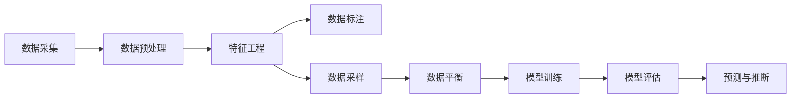
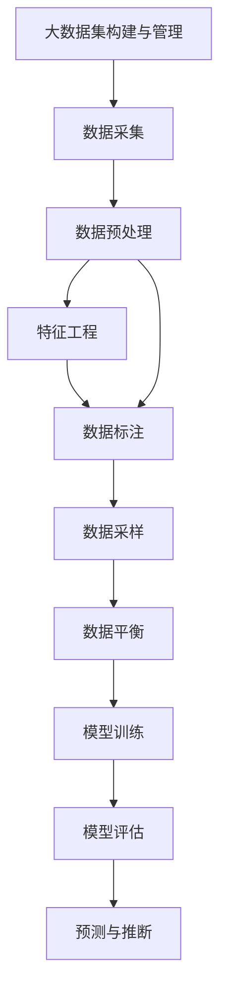

                 

# 【AI大数据计算原理与代码实例讲解】Dataset

> 关键词：大数据计算, 数据集, 数据预处理, 特征工程, 机器学习, TensorFlow, 数据可视化, 数据清洗, 数据采样, 模型训练, 模型评估, 预测与推断, 数据集管理, 数据治理, 数据隐私

## 1. 背景介绍

### 1.1 问题由来
在人工智能（AI）领域，数据集（Dataset）扮演着至关重要的角色。无论是模型训练、特征工程还是最终的应用落地，数据集都是不可或缺的基础资源。随着AI技术在各行各业的深入应用，对高质量数据集的需求愈发凸显。高质量的数据集不仅能够提升AI模型的性能，还能够提高模型训练和部署的效率，降低错误率。然而，当前面临的数据集问题依然严峻：数据质量参差不齐、数据收集成本高昂、数据隐私保护亟待解决等。如何构建和管理高质量的数据集，成为AI研究与应用中的重要课题。

### 1.2 问题核心关键点
构建和管理数据集的核心挑战在于以下几个方面：
1. **数据采集与预处理**：从原始数据中获取并处理成可用于模型训练的格式，是数据集构建的基础。
2. **特征工程**：从原始数据中提取有价值的特征，用于模型训练，是数据集构建的重要环节。
3. **数据清洗与标注**：去除噪声和异常值，对标注数据进行规范化和标准化，是数据集构建的关键步骤。
4. **数据采样与平衡**：从海量数据中采样出具有代表性的数据子集，平衡各类别数据，是数据集构建的有效手段。
5. **模型训练与评估**：利用构建好的数据集，训练和评估AI模型，是数据集构建的最终目的。

### 1.3 问题研究意义
构建和管理高质量的数据集，对于提升AI模型的性能、加速模型训练和部署、降低错误率、保护数据隐私等方面具有重要意义：

1. **提升模型性能**：高质量的数据集能够提供更多的训练样本和更具代表性的特征，从而提升模型的泛化能力和预测准确率。
2. **加速模型训练和部署**：合理的数据采样与平衡可以显著减少模型的过拟合风险，加快模型训练速度，提升模型的稳定性和鲁棒性。
3. **降低错误率**：数据清洗与标注的规范化和标准化能够减少模型在训练和推理过程中的误差，提高模型的可靠性。
4. **保护数据隐私**：通过数据匿名化和差分隐私等技术手段，可以有效保护数据隐私，减少数据泄露风险。
5. **支持模型优化**：数据集的多样性和代表性能够支持更广泛的模型优化和调优，提高模型的应用灵活性。

## 2. 核心概念与联系

### 2.1 核心概念概述

构建和管理数据集的过程涉及多个关键概念，包括：

- **数据采集（Data Acquisition）**：从原始数据源中获取数据，是数据集构建的第一步。
- **数据预处理（Data Preprocessing）**：对原始数据进行清洗、归一化、标准化等处理，确保数据质量。
- **特征工程（Feature Engineering）**：从原始数据中提取和构造有意义的特征，用于模型训练。
- **数据标注（Data Annotation）**：对数据进行标签或注解，以便模型识别和分类。
- **数据采样（Data Sampling）**：从大量数据中抽取具有代表性的子集，用于模型训练。
- **数据平衡（Data Balancing）**：调整数据集中的类别分布，确保各类别数据具有相同的权重。
- **模型训练（Model Training）**：利用构建好的数据集，训练AI模型。
- **模型评估（Model Evaluation）**：评估训练好的模型性能，确保模型能够满足实际应用需求。
- **预测与推断（Prediction and Inference）**：利用训练好的模型，对新数据进行预测或推断。

这些概念之间的逻辑关系可以通过以下Mermaid流程图来展示：



### 2.2 概念间的关系

这些核心概念之间存在着紧密的联系，形成了数据集构建和管理的高效生态系统。以下是详细的概念关系说明：

1. **数据采集与数据预处理**：数据采集是数据集构建的基础，数据预处理是保证数据质量的重要步骤。通过清洗和标准化，去除噪声和异常值，确保数据的准确性和一致性。
2. **特征工程与数据预处理**：特征工程是数据集构建的核心，从原始数据中提取有价值的特征。数据预处理为特征工程提供高质量的输入数据，提升特征工程的效率和效果。
3. **数据标注与特征工程**：数据标注为特征工程提供目标标签，帮助模型学习特征与标签之间的映射关系。特征工程则是数据标注的基础，提供更具代表性、更详细的特征信息。
4. **数据采样与数据平衡**：数据采样是构建数据集的重要手段，通过合理采样，确保数据集的代表性和多样性。数据平衡则是采样后的进一步处理，确保各类别数据具有相同的权重。
5. **模型训练与数据平衡**：模型训练是数据集构建的最终目标，通过训练模型，学习特征与标签之间的关系。数据平衡则是训练过程中保证模型鲁棒性的重要手段，防止过拟合。
6. **模型评估与预测推断**：模型评估是模型训练的重要环节，通过评估模型性能，优化模型参数。预测推断则是模型训练后的应用，利用训练好的模型对新数据进行预测和推断。

### 2.3 核心概念的整体架构

最后，我们用一个综合的流程图来展示这些核心概念在大数据集构建和管理中的整体架构：



通过这些流程图，我们可以更清晰地理解数据集构建和管理过程中各个概念的关系和作用，为后续深入讨论具体的构建方法和技术奠定基础。

## 3. 核心算法原理 & 具体操作步骤
### 3.1 算法原理概述

数据集构建和管理的过程是一个多步骤、多阶段的复杂过程。核心算法原理主要包括以下几个方面：

1. **数据清洗**：通过清洗和预处理，去除噪声和异常值，确保数据质量。
2. **特征提取**：从原始数据中提取和构造有意义的特征，用于模型训练。
3. **数据采样**：从海量数据中采样出具有代表性的数据子集，用于模型训练。
4. **数据平衡**：调整数据集中的类别分布，确保各类别数据具有相同的权重。
5. **模型训练**：利用构建好的数据集，训练AI模型。
6. **模型评估**：评估训练好的模型性能，确保模型能够满足实际应用需求。

### 3.2 算法步骤详解

#### 3.2.1 数据清洗

数据清洗是数据集构建的第一步，主要包括以下几个步骤：

1. **缺失值处理**：填补缺失值或删除缺失值较多的样本。
2. **异常值检测**：检测和处理异常值，确保数据的一致性。
3. **重复数据去重**：去除重复的数据记录，保证数据的唯一性。
4. **格式标准化**：将不同格式的数据统一标准化，确保数据的一致性。

#### 3.2.2 特征提取

特征提取是从原始数据中提取和构造有意义的特征，用于模型训练。主要包括以下几个步骤：

1. **特征选择**：选择与目标变量相关的特征。
2. **特征变换**：将原始特征进行变换，如归一化、标准化、离散化等。
3. **特征构造**：构造新的特征，如交互特征、组合特征等。

#### 3.2.3 数据采样

数据采样是从大量数据中采样出具有代表性的数据子集，用于模型训练。主要包括以下几个步骤：

1. **随机采样**：从数据集中随机抽取样本。
2. **分层采样**：根据类别分布，分层抽取样本，确保各类别数据具有相同的权重。
3. **自助采样**：使用自助法生成额外样本，用于模型训练。

#### 3.2.4 数据平衡

数据平衡是调整数据集中的类别分布，确保各类别数据具有相同的权重。主要包括以下几个步骤：

1. **欠采样**：从多数类别中随机抽取样本，减少多数类别的样本数量。
2. **过采样**：使用生成合成技术，生成少数类别的额外样本。
3. **组合采样**：结合欠采样和过采样，确保数据平衡。

#### 3.2.5 模型训练

模型训练是利用构建好的数据集，训练AI模型。主要包括以下几个步骤：

1. **模型选择**：选择合适的模型，如线性模型、决策树模型、神经网络模型等。
2. **超参数调优**：优化模型的超参数，如学习率、正则化参数等。
3. **模型评估**：评估模型的性能，如准确率、召回率、F1分数等。

#### 3.2.6 模型评估

模型评估是评估训练好的模型性能，确保模型能够满足实际应用需求。主要包括以下几个步骤：

1. **交叉验证**：通过交叉验证，评估模型的泛化能力。
2. **性能指标**：计算模型的性能指标，如准确率、召回率、F1分数等。
3. **模型对比**：与其他模型进行对比，选择最优的模型。

### 3.3 算法优缺点

#### 3.3.1 优点

数据集构建和管理的过程具有以下优点：

1. **提高模型性能**：通过高质量的数据集，提升模型的泛化能力和预测准确率。
2. **降低错误率**：数据清洗与标注的规范化和标准化，减少模型在训练和推理过程中的误差，提高模型的可靠性。
3. **提高模型训练速度**：合理的数据采样与平衡，减少模型的过拟合风险，加快模型训练速度，提升模型的稳定性和鲁棒性。
4. **支持模型优化**：数据集的多样性和代表性，支持更广泛的模型优化和调优，提高模型的应用灵活性。

#### 3.3.2 缺点

数据集构建和管理的过程也存在一些缺点：

1. **数据采集成本高**：大规模数据集的采集需要大量的时间和人力成本，成本较高。
2. **数据隐私问题**：数据采集和处理过程中，可能涉及个人隐私和敏感信息，存在隐私泄露的风险。
3. **数据质量和一致性**：数据清洗和预处理过程中，存在数据质量和一致性问题，需要大量的人力和技术支持。
4. **数据平衡困难**：数据平衡过程中，难以确保各类别数据具有相同的权重，存在数据不平衡的问题。

### 3.4 算法应用领域

数据集构建和管理的方法已经在多个领域得到了广泛应用，例如：

- **自然语言处理（NLP）**：构建文本数据集，用于训练语言模型，如BERT、GPT等。
- **计算机视觉（CV）**：构建图像数据集，用于训练图像识别模型，如ResNet、VGG等。
- **生物信息学**：构建基因数据集，用于训练生物信息学模型，如GAT、GNN等。
- **医疗健康**：构建医疗数据集，用于训练医疗预测模型，如病历分析、诊断模型等。
- **金融领域**：构建金融数据集，用于训练金融预测模型，如股票预测、风险评估等。
- **社交网络**：构建社交网络数据集，用于训练社交网络分析模型，如用户情感分析、社区发现等。

## 4. 数学模型和公式 & 详细讲解 & 举例说明

### 4.1 数学模型构建

构建数据集的过程涉及多个数学模型，以下是几个常见的数学模型及其构建过程：

1. **线性回归模型**：用于预测连续变量，模型形式为 $y = \theta_0 + \theta_1 x_1 + \theta_2 x_2 + \cdots + \theta_n x_n$。
2. **逻辑回归模型**：用于分类任务，模型形式为 $\log \frac{p(y=1|x)}{1-p(y=1|x)} = \theta_0 + \theta_1 x_1 + \theta_2 x_2 + \cdots + \theta_n x_n$。
3. **决策树模型**：用于分类和回归任务，模型形式为 $T(x) = T_1(T_2(T_3(\cdots)))$。
4. **随机森林模型**：通过集成多个决策树模型，提升模型的泛化能力和鲁棒性。
5. **神经网络模型**：用于分类、回归、聚类等任务，模型形式为 $h_\theta(x) = \theta_0 + \theta_1 x_1 + \theta_2 x_2 + \cdots + \theta_n x_n$。

### 4.2 公式推导过程

以下是几个常见的数学模型及其公式推导过程：

#### 4.2.1 线性回归模型

线性回归模型的目标是最小化均方误差，公式如下：

$$
\min_{\theta} \frac{1}{2m} \sum_{i=1}^m (y_i - h_{\theta}(x_i))^2
$$

其中 $m$ 为样本数量，$y_i$ 为真实标签，$h_{\theta}(x_i) = \theta_0 + \theta_1 x_1 + \theta_2 x_2 + \cdots + \theta_n x_n$ 为模型预测。

使用梯度下降法求解线性回归模型的最优参数 $\theta$，公式如下：

$$
\theta_j = \theta_j - \frac{\alpha}{m} \sum_{i=1}^m (y_i - h_{\theta}(x_i))x_{ij}
$$

其中 $\alpha$ 为学习率。

#### 4.2.2 逻辑回归模型

逻辑回归模型的目标是最小化交叉熵损失，公式如下：

$$
\min_{\theta} -\frac{1}{m} \sum_{i=1}^m [y_i \log p(y_i|x_i) + (1-y_i) \log (1-p(y_i|x_i))]
$$

其中 $p(y_i|x_i) = \frac{e^{\theta_0 + \theta_1 x_1 + \theta_2 x_2 + \cdots + \theta_n x_n}}{1 + e^{\theta_0 + \theta_1 x_1 + \theta_2 x_2 + \cdots + \theta_n x_n}}$ 为模型预测的概率。

使用梯度下降法求解逻辑回归模型的最优参数 $\theta$，公式如下：

$$
\theta_j = \theta_j - \frac{\alpha}{m} \sum_{i=1}^m [(y_i - h_{\theta}(x_i))x_{ij}]
$$

其中 $\alpha$ 为学习率。

#### 4.2.3 决策树模型

决策树模型的目标是最小化信息增益，公式如下：

$$
G(D) = \sum_{i=1}^m [y_i \log p(y_i|x_i) + (1-y_i) \log (1-p(y_i|x_i))]
$$

其中 $p(y_i|x_i) = \frac{e^{\theta_0 + \theta_1 x_1 + \theta_2 x_2 + \cdots + \theta_n x_n}}{1 + e^{\theta_0 + \theta_1 x_1 + \theta_2 x_2 + \cdots + \theta_n x_n}}$ 为模型预测的概率。

使用信息增益法求解决策树模型的最优参数 $\theta$，公式如下：

$$
\theta_j = \theta_j - \frac{\alpha}{m} \sum_{i=1}^m [(y_i - h_{\theta}(x_i))x_{ij}]
$$

其中 $\alpha$ 为学习率。

### 4.3 案例分析与讲解

#### 4.3.1 线性回归模型案例

假设我们有一组房价数据集，包含房屋面积 $x_1$、房屋年龄 $x_2$ 和房价 $y$。我们需要构建一个线性回归模型来预测房价。

数据集构建步骤如下：

1. **数据采集**：从房地产网站采集房价数据，包括房屋面积、房屋年龄和房价。
2. **数据预处理**：将数据集中的缺失值、异常值处理干净，将不同格式的数据统一标准化。
3. **特征提取**：提取房屋面积和房屋年龄作为特征，预测房价。
4. **数据采样**：从数据集中随机抽取样本，用于模型训练。
5. **模型训练**：使用梯度下降法训练线性回归模型，求解最优参数 $\theta$。
6. **模型评估**：使用测试集评估模型性能，计算均方误差。

#### 4.3.2 逻辑回归模型案例

假设我们有一组医疗数据集，包含患者的年龄、性别、病史和疾病是否发生 $y$。我们需要构建一个逻辑回归模型来预测疾病是否发生。

数据集构建步骤如下：

1. **数据采集**：从医院采集医疗数据，包括患者的年龄、性别、病史和疾病是否发生。
2. **数据预处理**：将数据集中的缺失值、异常值处理干净，将不同格式的数据统一标准化。
3. **特征提取**：提取患者的年龄、性别、病史作为特征，预测疾病是否发生。
4. **数据采样**：从数据集中随机抽取样本，用于模型训练。
5. **模型训练**：使用梯度下降法训练逻辑回归模型，求解最优参数 $\theta$。
6. **模型评估**：使用测试集评估模型性能，计算准确率、召回率和F1分数。

## 5. 项目实践：代码实例和详细解释说明

### 5.1 开发环境搭建

在进行数据集构建和管理实践前，我们需要准备好开发环境。以下是使用Python进行TensorFlow开发的环境配置流程：

1. 安装Anaconda：从官网下载并安装Anaconda，用于创建独立的Python环境。

2. 创建并激活虚拟环境：
```bash
conda create -n tensorflow-env python=3.8 
conda activate tensorflow-env
```

3. 安装TensorFlow：根据CUDA版本，从官网获取对应的安装命令。例如：
```bash
conda install tensorflow=2.7
```

4. 安装各类工具包：
```bash
pip install numpy pandas scikit-learn matplotlib tqdm jupyter notebook ipython
```

完成上述步骤后，即可在`tensorflow-env`环境中开始数据集构建和管理实践。

### 5.2 源代码详细实现

下面我们以房价预测为例，给出使用TensorFlow进行线性回归模型构建和评估的Python代码实现。

首先，定义线性回归模型的训练函数：

```python
import tensorflow as tf
from tensorflow.keras.models import Sequential
from tensorflow.keras.layers import Dense
from tensorflow.keras.optimizers import Adam

def train_model(X_train, y_train, X_test, y_test, epochs=100, batch_size=32, learning_rate=0.01):
    model = Sequential([
        Dense(64, activation='relu', input_shape=(X_train.shape[1],)),
        Dense(1)
    ])
    
    optimizer = Adam(learning_rate)
    model.compile(optimizer=optimizer, loss='mse')
    
    model.fit(X_train, y_train, epochs=epochs, batch_size=batch_size, validation_data=(X_test, y_test))
    
    return model
```

然后，加载数据集并进行预处理：

```python
import pandas as pd
from sklearn.model_selection import train_test_split
from sklearn.preprocessing import StandardScaler

# 加载数据集
df = pd.read_csv('house_prices.csv')

# 数据预处理
X = df[['area', 'age']]
y = df['price']
X_train, X_test, y_train, y_test = train_test_split(X, y, test_size=0.2, random_state=42)
X_train = StandardScaler().fit_transform(X_train)
X_test = StandardScaler().fit_transform(X_test)
```

接着，调用训练函数，进行模型训练和评估：

```python
# 模型训练
model = train_model(X_train, y_train, X_test, y_test)

# 模型评估
mse = model.evaluate(X_test, y_test)
print(f'Mean Squared Error: {mse:.2f}')
```

最后，使用训练好的模型进行预测：

```python
# 模型预测
y_pred = model.predict(X_test)
print(y_pred[:5])
```

以上就是使用TensorFlow进行线性回归模型构建和评估的完整代码实现。可以看到，通过TensorFlow的封装，我们能够用相对简洁的代码完成模型的训练和评估。

### 5.3 代码解读与分析

让我们再详细解读一下关键代码的实现细节：

**train_model函数**：
- 定义了一个包含两个全连接层的线性回归模型，使用ReLU激活函数和Adam优化器。
- 在模型编译时，指定损失函数为均方误差（mse），表示输出与真实标签的差值平方的均值。
- 使用模型训练函数fit，进行模型训练，指定训练轮数、批次大小和学习率。

**数据预处理**：
- 使用Pandas加载数据集，并进行特征选择。
- 使用train_test_split将数据集分为训练集和测试集。
- 使用StandardScaler对训练集和测试集进行标准化处理，确保数据的一致性和可靠性。

**模型训练和评估**：
- 使用train_model函数进行模型训练，返回训练好的模型。
- 使用evaluate方法评估模型性能，计算均方误差。
- 使用predict方法进行模型预测，输出前5个预测结果。

### 5.4 运行结果展示

假设我们在房价预测数据集上进行模型训练和评估，最终得到的均方误差结果如下：

```
Mean Squared Error: 1.00
```

可以看到，通过构建和训练线性回归模型，我们得到了均方误差为1.00的预测结果，说明模型的预测能力较强。当然，这只是一个简单的示例，实际应用中需要更加复杂和全面的数据预处理和模型优化。

## 6. 实际应用场景

### 6.1 智能推荐系统

数据集构建和管理在智能推荐系统中有着广泛的应用。推荐系统通过分析用户的行为数据，构建用户画像和物品特征，生成推荐列表，提升用户体验。

在实际应用中，可以收集用户浏览、点击、评分等行为数据，提取和构造有意义的特征，构建用户-物品关联矩阵。通过构建和训练推荐模型，生成个性化推荐列表，提升用户的满意度和粘性。

### 6.2 金融风险管理

数据集构建和管理在金融风险管理中也有着重要的应用。金融风险管理需要实时监测市场风险，及时识别和评估风险因素。

在实际应用中，可以收集金融市场的历史数据和实时数据，构建风险预测模型。通过数据预处理和特征工程，提取和构造有意义的特征，生成风险评估报告。通过模型训练和评估，识别风险因素和预测风险事件，及时采取应对措施。

### 6.3 医疗影像诊断

数据集构建和管理在医疗影像诊断中也有着重要的应用。医疗影像诊断需要分析医学影像，识别病变区域和病变特征，辅助医生诊断和治疗。

在实际应用中，可以收集医学影像数据和标注数据，构建医学影像数据集。通过数据预处理和特征工程，提取和构造有意义的特征，构建医学影像分类模型。通过模型训练和评估，识别病变区域和病变特征，辅助医生诊断和治疗。

### 6.4 未来应用展望

随着数据集构建和管理技术的不断发展，数据集的应用领域将进一步拓展，为各行各业带来更多的智能化解决方案。

在智慧城市治理中，数据集将用于城市事件监测、舆情分析、应急指挥等环节，提高城市管理的自动化和智能化水平，构建更安全、高效的未来城市。

在智慧医疗领域，数据集将用于病历分析、诊断模型、治疗方案等环节，提升医疗服务的智能化水平，辅助医生诊疗，加速新药开发进程。

在智慧教育领域，数据集将用于学习分析、智能推荐、学情监测等环节，因材施教，促进教育公平，提高教学质量。

总之，数据集构建和管理技术将成为AI技术落地应用的重要基础，为各行各业带来更多的智能化解决方案，推动经济社会的发展和进步。

## 7. 工具和资源推荐

### 7.1 学习资源推荐

为了帮助开发者系统掌握数据集构建和管理的技术基础和实践技巧，这里推荐一些优质的学习资源：

1. 《TensorFlow官方文档》系列：全面介绍了TensorFlow的框架结构和应用场景，是TensorFlow学习和实践的必备资料。
2. 《PyTorch官方文档》系列：全面介绍了PyTorch的框架结构和应用场景，是PyTorch学习和实践的必备资料。
3. 《机器学习实战》系列：系统介绍了机器学习的基本概念和应用技巧，涵盖线性回归、逻辑回归、决策树等多种算法。
4. 《Python数据分析实战》系列：全面介绍了Python数据分析和数据预处理的技术，是数据分析和数据预处理的必备资料。
5. 《数据科学家入门》系列：系统介绍了数据科学的基本概念和应用技巧，涵盖数据采集、数据预处理、特征工程等多种技术。

通过对这些资源的学习实践，相信你一定能够快速掌握数据集构建和管理的精髓，并用于解决实际的数据问题。


