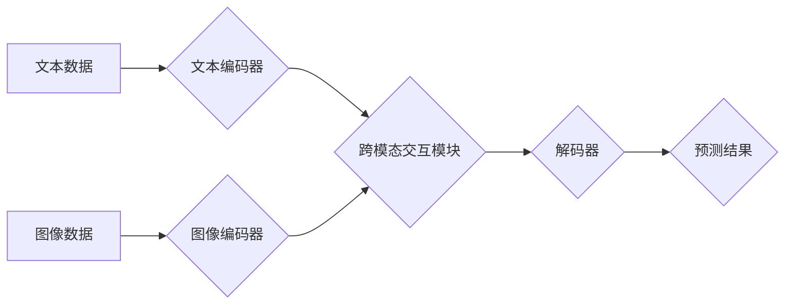

## 多模态全面接入的 AI 应用

> 关键词：多模态学习、自然语言处理、计算机视觉、语音识别、多媒体理解、AI 应用、深度学习

## 1. 背景介绍

人工智能（AI）技术近年来取得了飞速发展，特别是深度学习的兴起，为多模态数据处理带来了新的机遇。多模态数据是指包含多种类型信息的数据，例如文本、图像、音频、视频等。与单模态数据相比，多模态数据更丰富、更全面，能够提供更深入的理解和分析。

传统 AI 系统主要依赖单一模态数据，例如文本或图像，这限制了其对真实世界复杂场景的理解能力。而多模态学习旨在融合不同模态数据，学习数据之间的相互关系，从而实现更智能、更全面的应用。

多模态全面接入的 AI 应用已经开始在各个领域得到广泛应用，例如：

* **智能客服:** 通过语音识别、自然语言处理和图像识别技术，实现更自然、更智能的客户服务体验。
* **医疗诊断:** 利用医学图像、病历文本和语音记录，辅助医生进行更准确的诊断。
* **教育培训:** 通过视频、音频、文本和交互式练习，提供更个性化、更有效的学习体验。
* **内容创作:** 利用多模态数据生成更丰富、更生动的文本、图像和视频内容。

## 2. 核心概念与联系

多模态学习的核心是融合不同模态数据，学习数据之间的相互关系。

**2.1 多模态数据融合**

多模态数据融合是指将来自不同模态的数据进行整合，形成一个统一的表示。常用的融合方法包括：

* **早期融合:** 将不同模态数据在特征提取阶段进行融合，例如将文本和图像特征进行拼接。
* **晚期融合:** 将不同模态数据分别进行特征提取，然后在分类或预测阶段进行融合，例如将文本和图像特征分别输入到不同的神经网络，最后将输出结果进行融合。
* **跨模态注意力机制:** 利用注意力机制学习不同模态数据之间的重要关系，赋予不同模态数据不同的权重。

**2.2 多模态模型架构**

多模态模型通常由以下几个部分组成：

* **模态编码器:** 负责将不同模态数据编码成特征向量。
* **跨模态交互模块:** 负责学习不同模态数据之间的关系。
* **解码器:** 负责根据融合后的特征向量进行预测或分类。

**2.3 Mermaid 流程图**



## 3. 核心算法原理 & 具体操作步骤

### 3.1 算法原理概述

多模态学习算法的核心是学习不同模态数据之间的关系，并利用这些关系进行预测或分类。常用的算法包括：

* **多任务学习:** 将多个相关任务一起训练，例如文本分类和图像识别。
* **联合训练:** 将不同模态数据一起训练，学习数据之间的联合分布。
* **对抗训练:** 使用对抗样本训练模型，提高模型的鲁棒性。

### 3.2 算法步骤详解

以联合训练为例，其具体步骤如下：

1. **数据预处理:** 将不同模态数据进行预处理，例如文本分词、图像裁剪等。
2. **特征提取:** 使用不同的编码器提取不同模态数据的特征向量。
3. **数据融合:** 将不同模态的特征向量进行融合，形成一个统一的表示。
4. **模型训练:** 使用联合训练的损失函数训练模型，例如交叉熵损失函数。
5. **模型评估:** 使用测试数据评估模型的性能，例如准确率、召回率等。

### 3.3 算法优缺点

**优点:**

* 可以充分利用不同模态数据的互补性，提高模型的性能。
* 可以学习数据之间的更深层次的语义关系。

**缺点:**

* 需要处理不同模态数据的复杂性，例如数据格式、尺度等问题。
* 需要大量的训练数据，才能有效地学习数据之间的关系。

### 3.4 算法应用领域

* **图像字幕生成:** 将图像与文本进行关联，生成图像的描述性文本。
* **视频理解:** 理解视频内容，例如识别视频中的事件、人物和物体。
* **情感分析:** 分析文本、图像和音频中的情感信息。

## 4. 数学模型和公式 & 详细讲解 & 举例说明

### 4.1 数学模型构建

多模态学习模型通常使用深度学习框架，例如TensorFlow或PyTorch，构建。模型的数学模型可以表示为一个多层神经网络，其中每一层都包含不同的神经元和激活函数。

### 4.2 公式推导过程

模型的训练过程是通过最小化损失函数来实现的。损失函数通常是交叉熵损失函数，其公式如下：

$$
L = -\sum_{i=1}^{N} y_i \log(p_i)
$$

其中：

* $L$ 是损失函数
* $N$ 是样本数量
* $y_i$ 是真实标签
* $p_i$ 是模型预测的概率

### 4.3 案例分析与讲解

例如，在图像字幕生成任务中，模型的输入是图像，输出是图像的描述性文本。模型的训练过程是通过最小化图像和文本之间的距离来实现的。可以使用BLEU指标来评估模型的性能，BLEU指标是衡量机器翻译质量的指标。

## 5. 项目实践：代码实例和详细解释说明

### 5.1 开发环境搭建

* Python 3.6+
* TensorFlow 2.0+
* PyTorch 1.0+
* CUDA 10.0+

### 5.2 源代码详细实现

```python
import tensorflow as tf

# 定义图像编码器
image_encoder = tf.keras.Sequential([
    tf.keras.layers.Conv2D(32, (3, 3), activation='relu'),
    tf.keras.layers.MaxPooling2D((2, 2)),
    tf.keras.layers.Conv2D(64, (3, 3), activation='relu'),
    tf.keras.layers.MaxPooling2D((2, 2)),
    tf.keras.layers.Flatten(),
    tf.keras.layers.Dense(128, activation='relu')
])

# 定义文本编码器
text_encoder = tf.keras.Sequential([
    tf.keras.layers.Embedding(vocab_size, embedding_dim),
    tf.keras.layers.LSTM(128)
])

# 定义跨模态交互模块
cross_modal_interaction = tf.keras.layers.Dot(axes=1)

# 定义解码器
decoder = tf.keras.Sequential([
    tf.keras.layers.Dense(vocab_size, activation='softmax')
])

# 定义模型
model = tf.keras.Model(inputs=[image_input, text_input], outputs=decoder(cross_modal_interaction([image_encoder(image_input), text_encoder(text_input)])))

# 编译模型
model.compile(optimizer='adam', loss='sparse_categorical_crossentropy', metrics=['accuracy'])

# 训练模型
model.fit(train_data, epochs=10)
```

### 5.3 代码解读与分析

* 代码首先定义了图像编码器和文本编码器，分别用于提取图像和文本的特征向量。
* 跨模态交互模块使用Dot操作来计算图像和文本特征向量的点积，学习数据之间的关系。
* 解码器用于根据融合后的特征向量生成文本。
* 模型使用Adam优化器和交叉熵损失函数进行训练。

### 5.4 运行结果展示

训练完成后，可以使用测试数据评估模型的性能。可以使用BLEU指标来评估模型的性能，BLEU指标是衡量机器翻译质量的指标。

## 6. 实际应用场景

### 6.1 智能客服

多模态学习可以用于构建更智能的智能客服系统。例如，系统可以理解用户的语音和文本输入，并根据用户的需求提供相应的帮助。

### 6.2 医疗诊断

多模态学习可以用于辅助医生进行医疗诊断。例如，系统可以分析患者的医学图像、病历文本和语音记录，并提供诊断建议。

### 6.3 教育培训

多模态学习可以用于构建更个性化的教育培训系统。例如，系统可以根据学生的学习进度和需求，提供相应的学习内容和练习。

### 6.4 未来应用展望

多模态全面接入的 AI 应用未来将更加广泛，例如：

* **虚拟助手:** 更智能、更自然的虚拟助手，可以理解用户的多种模态输入，并提供更个性化的服务。
* **自动驾驶:** 利用多模态数据，例如图像、雷达数据和传感器数据，提高自动驾驶系统的安全性。
* **增强现实:** 利用多模态数据，例如图像、音频和触觉信息，构建更沉浸式的增强现实体验。

## 7. 工具和资源推荐

### 7.1 学习资源推荐

* **书籍:**
    * Deep Learning with Python by Francois Chollet
    * Hands-On Machine Learning with Scikit-Learn, Keras & TensorFlow by Aurélien Géron
* **课程:**
    * Stanford CS231n: Convolutional Neural Networks for Visual Recognition
    * Deep Learning Specialization by Andrew Ng

### 7.2 开发工具推荐

* **TensorFlow:** https://www.tensorflow.org/
* **PyTorch:** https://pytorch.org/
* **Keras:** https://keras.io/

### 7.3 相关论文推荐

* **Show, Attend and Tell: Neural Image Captioning with Visual Attention** by Xu et al. (2015)
* **Multimodal Deep Learning: A Survey** by Kiela et al. (2018)

## 8. 总结：未来发展趋势与挑战

### 8.1 研究成果总结

多模态学习取得了显著的进展，在图像字幕生成、视频理解、情感分析等领域取得了优异的性能。

### 8.2 未来发展趋势

* **更强大的模型架构:** 探索更强大的多模态模型架构，例如Transformer-based模型。
* **更有效的训练方法:** 研究更有效的训练方法，例如自监督学习和迁移学习。
* **更广泛的应用场景:** 将多模态学习应用到更多领域，例如医疗、教育、自动驾驶等。

### 8.3 面临的挑战

* **数据获取和标注:** 多模态数据的获取和标注成本较高。
* **模型复杂度:** 多模态模型通常非常复杂，训练和部署成本较高。
* **解释性:** 多模态模型的决策过程难以解释，缺乏透明度。

### 8.4 研究展望

未来，多模态学习将继续是一个重要的研究方向，需要进一步探索更强大的模型架构、更有效的训练方法和更广泛的应用场景。


## 9. 附录：常见问题与解答

### 9.1 什么是多模态学习？

多模态学习是指利用多种类型数据（例如文本、图像、音频）进行学习，并从中学习数据之间的关系。

### 9.2 多模态学习有哪些应用场景？

多模态学习的应用场景非常广泛，例如：

* 智能客服
* 医疗诊断
* 教育培训
* 内容创作
* 自动驾驶

### 9.3 如何进行多模态学习？

多模态学习通常使用深度学习框架，例如TensorFlow或PyTorch，构建模型。模型的训练过程是通过最小化损失函数来实现的。

### 9.4 多模态学习有哪些挑战？

多模态学习面临着以下挑战：

* 数据获取和标注成本高
* 模型复杂度高
* 解释性差

### 9.5 多模态学习的未来发展趋势？

未来，多模态学习将继续是一个重要的研究方向，需要进一步探索更强大的模型架构、更有效的训练方法和更