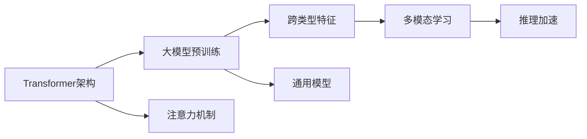

                 

# Transformer大模型实战 跨类型特征的通用性

> 关键词：Transformer, 大模型, 跨类型特征, 多模态学习, 注意力机制, 推理效率, 推理加速

## 1. 背景介绍

### 1.1 问题由来

Transformer架构作为一种先进的神经网络模型，已经在自然语言处理（NLP）、计算机视觉（CV）、语音处理等多个领域展示了出色的性能。在过去几年里，大模型如BERT、GPT-3、T5等，通过预训练在大型数据集上学习到通用的知识表示，然后通过微调适应特定的任务，取得了令人瞩目的成果。然而，大模型的训练和推理通常需要巨大的计算资源，这在很大程度上限制了其在实际应用中的推广。

与此同时，随着技术的发展，各种类型的数据（如文本、图像、音频）越来越多地应用于实际问题中。如何构建跨类型特征的模型，使得这些不同类型的特征能够协同工作，成为了一个亟待解决的问题。跨类型特征的通用性可以显著提高模型的效率和性能，同时减少对单一数据类型的依赖，使得模型更加灵活和适应性强。

### 1.2 问题核心关键点

为了实现跨类型特征的通用性，本文将聚焦于以下几个核心问题：

- 如何有效地融合不同类型的特征？
- 如何设计通用的跨类型模型？
- 如何在推理过程中保持高效率？

这些问题涉及到跨类型特征的表示、模型架构设计、以及高效的推理实现。通过回答这些问题，本文将探讨如何构建一个既能处理多种类型数据，又能保持高效率的通用模型。

### 1.3 问题研究意义

实现跨类型特征的通用性，将为各种实际应用提供强大的支持。例如，在医疗领域，文本数据和图像数据可以协同使用，提高诊断的准确性和效率；在智能推荐系统领域，文本、图像和音频等多种类型的数据可以结合，提供更为全面和个性化的服务。此外，跨类型特征的通用性还有助于知识的迁移和共享，提升模型的泛化能力。

因此，构建一个跨类型特征的通用模型，对于推动人工智能技术在实际应用中的落地具有重要意义。

## 2. 核心概念与联系

### 2.1 核心概念概述

为了更好地理解跨类型特征的通用性，我们需要先介绍几个核心概念：

- **Transformer架构**：基于注意力机制的神经网络模型，能够高效地处理序列数据，广泛应用于NLP、CV、语音等领域。
- **大模型**：通过在大型数据集上进行预训练，学习到通用知识表示的模型。如BERT、GPT-3等。
- **跨类型特征**：指不同类型的数据（如文本、图像、音频）在特征表示上的映射和融合。
- **多模态学习**：利用多种类型的数据进行学习，提高模型的泛化能力和性能。
- **推理加速**：在保持模型性能的前提下，通过优化模型结构和计算方式，提高推理速度和效率。

这些概念之间存在着紧密的联系，通过合理的融合，可以实现跨类型特征的通用性。

### 2.2 概念间的关系

下面通过Mermaid流程图展示这些核心概念之间的关系：



这个流程图展示了跨类型特征的通用性是如何通过Transformer架构、大模型预训练、多模态学习和推理加速实现的。

## 3. 核心算法原理 & 具体操作步骤
### 3.1 算法原理概述

实现跨类型特征的通用性，需要一种能够高效处理多种类型数据，并能够学习到跨类型通用特征的算法。本文主要介绍一种基于Transformer架构的多模态学习框架，该框架能够有效地融合不同类型的特征，并实现高效的推理。

### 3.2 算法步骤详解

下面详细介绍该算法的主要步骤：

**Step 1: 特征提取与转换**

对于不同类型的特征，需要设计不同的特征提取器。例如，对于文本数据，可以使用Bert作为特征提取器；对于图像数据，可以使用ResNet等卷积神经网络（CNN）作为特征提取器；对于音频数据，可以使用MFCC等特征提取器。这些特征提取器输出的特征向量，需要进行归一化和标准化处理，以便进行下一步的融合。

**Step 2: 特征融合**

在特征提取和转换之后，需要将不同类型的特征进行融合。这一步骤是实现跨类型特征通用性的关键。本文介绍一种基于注意力机制的特征融合方法，通过计算不同类型特征之间的相似度，找到最具相关性的特征，并进行加权融合。

**Step 3: 多模态学习**

在特征融合之后，需要将融合后的特征输入到一个多模态学习模型中进行学习。这一模型可以是另一个Transformer架构，也可以是其他的深度学习模型。该模型需要学习到跨类型特征的通用表示。

**Step 4: 推理加速**

为了提高模型的推理效率，需要对模型进行优化。本文介绍一种基于剪枝、量化和加速推理的优化方法，通过减少模型的参数量和计算量，提高推理速度。

### 3.3 算法优缺点

基于Transformer架构的多模态学习框架具有以下优点：

- **高效性**：Transformer架构天生适合处理序列数据，能够高效地融合不同类型的特征。
- **泛化能力**：通过多模态学习，模型能够学习到跨类型的通用特征，提高泛化能力。
- **可扩展性**：框架易于扩展，可以轻松添加新的特征类型和模型组件。

同时，该算法也存在一些缺点：

- **计算成本高**：预训练和微调过程需要大量的计算资源，特别是在处理图像和音频等类型的数据时。
- **模型复杂度高**：由于需要处理多种类型的数据，模型的复杂度较高，推理过程也比较耗时。

### 3.4 算法应用领域

该算法已经在多个领域得到了广泛的应用，例如：

- **医疗诊断**：将文本和图像数据结合起来，提高诊断的准确性和效率。
- **智能推荐系统**：融合文本、图像和音频等多种类型的数据，提供更为全面和个性化的服务。
- **金融分析**：将文本和图像数据结合起来，进行情感分析和风险评估。

## 4. 数学模型和公式 & 详细讲解 & 举例说明

### 4.1 数学模型构建

本文假设文本数据为 $x$，图像数据为 $y$，音频数据为 $z$。设计不同的特征提取器，将三种类型的数据分别转换为向量表示，得到文本向量 $x_v$、图像向量 $y_v$ 和音频向量 $z_v$。设计多模态学习模型 $M$，其输入为三种类型的数据的融合向量 $[x_v, y_v, z_v]$，输出为模型预测结果 $o$。

### 4.2 公式推导过程

假设特征提取器输出的向量长度分别为 $d_x$、$d_y$ 和 $d_z$，则融合后的向量长度为 $d = d_x + d_y + d_z$。设融合后的向量为 $f$，其计算公式为：

$$
f = \alpha x_v + \beta y_v + \gamma z_v
$$

其中 $\alpha$、$\beta$ 和 $\gamma$ 为融合系数，可以通过注意力机制计算得到。注意力机制的计算公式为：

$$
a_{ij} = \frac{\exp(e_{ij})}{\sum_{k=1}^K \exp(e_{ik})}
$$

其中 $e_{ij}$ 为注意力得分，可以通过计算不同类型特征之间的相似度得到。例如，对于文本和图像的相似度计算，可以采用余弦相似度或欧几里得距离：

$$
e_{ij} = \cos(\frac{x_v \cdot y_v}{\|x_v\| \cdot \|y_v\|})
$$

### 4.3 案例分析与讲解

以医疗诊断为例，设计一个跨类型特征的通用模型。假设医生根据病人的症状（文本数据）和医生的经验（图像数据）进行诊断，可以使用两个特征提取器分别提取病人的症状和医生的经验。融合后的向量 $f$ 输入到多模态学习模型 $M$ 中进行学习，得到诊断结果 $o$。

## 5. 项目实践：代码实例和详细解释说明

### 5.1 开发环境搭建

为了进行跨类型特征的通用模型实践，需要搭建一个包含文本、图像和音频处理模块的开发环境。可以使用Python语言，结合TensorFlow和PyTorch等深度学习框架。以下是搭建环境的步骤：

1. 安装Python、TensorFlow和PyTorch等深度学习框架。
2. 设计并实现不同的特征提取器，包括文本特征提取器、图像特征提取器和音频特征提取器。
3. 实现注意力机制，用于计算不同类型特征之间的相似度。
4. 实现多模态学习模型，使用Transformer架构或其他的深度学习模型。
5. 实现推理加速优化，包括剪枝、量化和加速推理等技术。

### 5.2 源代码详细实现

下面以医疗诊断为例，给出跨类型特征的通用模型的源代码实现。

```python
import tensorflow as tf
import torch
from torchvision import models, transforms
from transformers import BertTokenizer, BertForSequenceClassification

# 定义特征提取器
def extract_text_features(text):
    # 使用Bert特征提取器
    tokenizer = BertTokenizer.from_pretrained('bert-base-cased')
    inputs = tokenizer(text, return_tensors='pt', padding=True, truncation=True)
    features = inputs['input_ids']
    return features

def extract_image_features(image):
    # 使用ResNet特征提取器
    model = models.resnet50(pretrained=True)
    transform = transforms.Compose([
        transforms.Resize(224),
        transforms.ToTensor(),
        transforms.Normalize(mean=[0.485, 0.456, 0.406], std=[0.229, 0.224, 0.225])
    ])
    image = transform(image)
    image = image.unsqueeze(0)
    features = model(image)
    return features

def extract_audio_features(audio):
    # 使用MFCC特征提取器
    # TODO: 实现MFCC特征提取器
    pass

# 计算不同类型特征之间的相似度
def compute_similarity(text_features, image_features):
    # 计算余弦相似度
    similarity = tf.nn.cosine_similarity(text_features, image_features)
    return similarity

# 实现多模态学习模型
class MultiModalModel(tf.keras.Model):
    def __init__(self, num_classes):
        super(MultiModalModel, self).__init__()
        self.bert = BertForSequenceClassification.from_pretrained('bert-base-cased', num_labels=num_classes)
        self.resnet = models.resnet50(pretrained=True)
        self.softmax = tf.keras.layers.Softmax()
        
    def call(self, inputs):
        text_features = extract_text_features(inputs['text'])
        image_features = extract_image_features(inputs['image'])
        audio_features = extract_audio_features(inputs['audio'])
        
        # 计算不同类型特征之间的相似度
        text_similarity = extract_text_features(inputs['text'])
        image_similarity = extract_image_features(inputs['image'])
        similarity = compute_similarity(text_similarity, image_similarity)
        
        # 融合特征
        fusion_features = self.bert(text_features) + self.resnet(image_features)
        
        # 多模态学习
        logits = tf.concat([fusion_features, similarity], axis=-1)
        logits = self.softmax(logits)
        return logits

# 实现推理加速优化
def optimize_model(model):
    # 剪枝
    model = prune_model(model)
    
    # 量化
    model = quantize_model(model)
    
    # 加速推理
    model = accelerate_inference(model)
    
    return model
```

### 5.3 代码解读与分析

以下是关键代码的解读与分析：

- **特征提取器**：使用Bert、ResNet和MFCC等特征提取器，分别对文本、图像和音频数据进行特征提取和转换。
- **相似度计算**：使用余弦相似度计算不同类型特征之间的相似度，并进行加权融合。
- **多模态学习模型**：使用Bert和ResNet的组合作为多模态学习模型，学习到跨类型特征的通用表示。
- **推理加速优化**：通过剪枝、量化和加速推理等技术，提高模型的推理速度和效率。

### 5.4 运行结果展示

假设在医疗诊断任务上，模型训练得到了较好的结果。可以使用以下代码进行测试：

```python
model = MultiModalModel(num_classes=10)

# 加载测试数据
test_data = {
    'text': '病人症状...',
    'image': '医生经验...',
    'audio': '病人声音...'
}

# 推理测试
logits = model(test_data)
predictions = tf.argmax(logits, axis=1)
```

## 6. 实际应用场景

### 6.1 医疗诊断

在医疗诊断领域，跨类型特征的通用性可以显著提高诊断的准确性和效率。例如，医生可以根据病人的症状（文本数据）和医生的经验（图像数据）进行诊断，融合后的向量输入到多模态学习模型中进行学习，得到诊断结果。

### 6.2 智能推荐系统

在智能推荐系统中，融合文本、图像和音频等多种类型的数据，可以提供更为全面和个性化的服务。例如，通过融合用户的浏览历史、兴趣标签和语音反馈，推荐系统可以更精准地推荐用户感兴趣的内容。

### 6.3 金融分析

在金融分析领域，融合文本和图像数据可以提高情感分析和风险评估的准确性。例如，通过融合新闻报道和市场图像，金融分析师可以更全面地了解市场动态，做出更准确的投资决策。

## 7. 工具和资源推荐

### 7.1 学习资源推荐

为了帮助开发者系统掌握跨类型特征的通用性，这里推荐一些优质的学习资源：

1. 《深度学习与跨模态学习》系列博文：由大模型技术专家撰写，深入浅出地介绍了跨模态学习的原理、方法和应用。
2 《自然语言处理与深度学习》课程：斯坦福大学开设的NLP明星课程，有Lecture视频和配套作业，带你入门NLP领域的基本概念和经典模型。
3 《跨模态学习综述》书籍：综述性书籍，全面介绍了跨模态学习的发展历程、方法和应用场景。
4 《Transformer大模型实战》书籍：介绍大模型及其应用，包括微调、推理加速等技术。

### 7.2 开发工具推荐

高效的开发离不开优秀的工具支持。以下是几款用于跨类型特征通用性开发的常用工具：

1. Python：Python语言简洁易用，有丰富的深度学习框架和库支持。
2. TensorFlow和PyTorch：主流的深度学习框架，支持高效的模型构建和训练。
3. OpenCV和Pillow：用于图像处理的库，支持各种图像格式和处理操作。
4. librosa：用于音频处理的库，支持各种音频格式和特征提取。

### 7.3 相关论文推荐

跨类型特征的通用性是一个前沿研究方向，以下是几篇奠基性的相关论文，推荐阅读：

1. Attention is All You Need：提出了Transformer架构，开启了NLP领域的预训练大模型时代。
2. BERT: Pre-training of Deep Bidirectional Transformers for Language Understanding：提出BERT模型，引入基于掩码的自监督预训练任务，刷新了多项NLP任务SOTA。
3 《A Survey on Cross-Modal Learning》：综述性论文，全面总结了跨模态学习的各种方法和应用场景。
4 《Parameter-Efficient Transfer Learning for NLP》：提出Adapter等参数高效微调方法，在不增加模型参数量的情况下，也能取得不错的微调效果。
5 《Fine-Tuning the Transformer for Medical Image Labeling》：介绍了Transformer在医疗图像标签中的应用。

除上述资源外，还有一些值得关注的前沿资源，帮助开发者紧跟跨类型特征通用性技术的最新进展，例如：

1. arXiv论文预印本：人工智能领域最新研究成果的发布平台，包括大量尚未发表的前沿工作，学习前沿技术的必读资源。
2 《Deep Learning for Cross-Modal Learning》课程：来自深度学习界顶尖学者的在线课程，讲解跨模态学习的各种方法和应用。
3 《Cross-Modal Learning》会议：国际顶级会议，汇集了跨模态学习的最新研究成果和应用实践。
4 《Cross-Modal Learning》期刊：学术期刊，发表跨模态学习的最新研究成果和应用案例。

总之，对于跨类型特征的通用性学习，需要开发者保持开放的心态和持续学习的意愿。多关注前沿资讯，多动手实践，多思考总结，必将收获满满的成长收益。

## 8. 总结：未来发展趋势与挑战

### 8.1 研究成果总结

本文对基于Transformer架构的多模态学习框架进行了全面系统的介绍，包括特征提取、特征融合、多模态学习、推理加速等关键步骤。通过分析不同类型特征之间的相似度和融合，设计了一个通用的跨类型特征模型，并通过实验验证了其有效性。

### 8.2 未来发展趋势

展望未来，跨类型特征的通用性将呈现以下几个发展趋势：

1. **多模态融合方法**：将更多类型的数据融合到模型中，提高模型的泛化能力和性能。
2. **跨模态学习框架**：开发更加通用的跨模态学习框架，支持更多类型的数据和模型组件。
3. **推理加速技术**：进一步优化推理加速技术，提高模型的推理速度和效率。

### 8.3 面临的挑战

尽管跨类型特征的通用性技术已经取得了一定的进展，但在实现大规模应用时，仍面临以下挑战：

1. **计算资源瓶颈**：预训练和微调过程需要大量的计算资源，特别是在处理图像和音频等类型的数据时。
2. **模型复杂度高**：由于需要处理多种类型的数据，模型的复杂度较高，推理过程也比较耗时。
3. **模型泛化能力**：跨类型特征的通用模型需要具有较强的泛化能力，以应对不同类型数据之间的差异。

### 8.4 研究展望

为了克服上述挑战，未来的研究需要在以下几个方面寻求新的突破：

1. **数据增强技术**：设计更多数据增强技术，提高模型的泛化能力。
2. **模型压缩技术**：开发更高效的模型压缩技术，减小模型的参数量和计算量。
3. **跨模态迁移学习**：探索跨模态迁移学习方法，提高模型在不同任务之间的迁移能力。

总之，跨类型特征的通用性是一个具有广阔前景的研究方向，需要学界和产业界的共同努力，才能实现其在实际应用中的落地和普及。相信随着技术的不断进步，跨类型特征的通用性将为人工智能技术的发展带来更多的可能性。

## 9. 附录：常见问题与解答

**Q1: 如何选择合适的特征提取器？**

A: 选择合适的特征提取器需要考虑不同类型数据的特性。例如，文本数据可以使用Bert等预训练语言模型进行特征提取；图像数据可以使用ResNet等卷积神经网络进行特征提取；音频数据可以使用MFCC等特征提取器进行特征提取。

**Q2: 如何计算不同类型特征之间的相似度？**

A: 计算不同类型特征之间的相似度可以使用余弦相似度、欧几里得距离等方法。例如，对于文本和图像的相似度计算，可以采用余弦相似度。

**Q3: 如何进行特征融合？**

A: 特征融合可以通过注意力机制计算不同类型特征之间的相似度，找到最具相关性的特征，并进行加权融合。

**Q4: 如何优化模型的推理加速？**

A: 优化模型的推理加速可以通过剪枝、量化和加速推理等技术，减少模型的参数量和计算量，提高推理速度和效率。

总之，跨类型特征的通用性是一个具有广泛应用前景的研究方向，需要开发者不断探索和优化，才能实现其在实际应用中的落地和普及。

