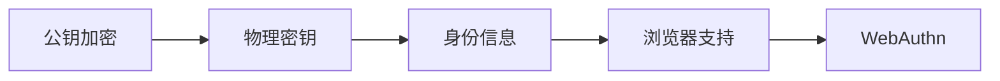
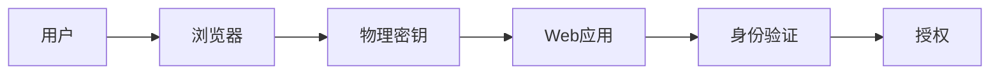

                 

# WebAuthn 的实施步骤

> 关键词：WebAuthn, 身份验证, 加密, 身份信息, 安全, 浏览器支持, 开发者指南, 跨平台, 兼容性

## 1. 背景介绍

在现代社会，数字身份验证已经成为了不可或缺的一部分。无论是登录在线账户、访问企业内部系统，还是使用在线支付服务，用户都需要通过一系列身份验证步骤来证明自己的身份。然而，传统的密码验证方式存在着许多安全隐患，例如忘记密码、密码泄露、暴力破解等，严重影响着用户的安全和便利性。为了解决这些问题，WebAuthn应运而生，它是一种基于硬件的安全身份验证标准，能够提供更加安全、便捷的身份验证方式。

WebAuthn由W3C和FIDO Alliance联合制定，旨在通过使用硬件密钥(如USB密钥、FIDO2兼容的安全密钥等)，来增强Web应用的登录安全性和用户体验。WebAuthn支持多种身份验证方式，包括指纹、面部识别、视网膜扫描等生物识别方式，以及基于硬件的安全密钥和物理令牌等。

## 2. 核心概念与联系

### 2.1 核心概念概述

在深入了解WebAuthn之前，我们需要先理解一些核心概念：

- **WebAuthn**：WebAuthn是一种基于硬件的安全身份验证协议，能够提供更加安全、便捷的身份验证方式。
- **公钥加密**：WebAuthn基于公钥加密技术，确保身份验证过程中数据的安全传输和用户的隐私保护。
- **物理密钥**：WebAuthn支持的物理密钥，如USB密钥、FIDO2兼容的安全密钥等，能够提供更高的安全性。
- **身份信息**：WebAuthn存储和管理用户的身份信息，包括用户名、电子邮件地址等，确保用户的唯一性。
- **浏览器支持**：WebAuthn需要在浏览器中实现，以支持用户在Web应用中进行安全身份验证。

### 2.2 核心概念的联系

WebAuthn的实现涉及多个核心概念的协同工作。具体来说，WebAuthn通过以下方式将这些概念联系起来：

- **公钥加密与物理密钥的结合**：WebAuthn利用公钥加密技术，确保数据在传输过程中的安全，同时通过物理密钥(如USB密钥、FIDO2兼容的安全密钥)提供更高的安全性。
- **身份信息的存储与管理**：WebAuthn将用户的身份信息存储在物理密钥中，确保用户的唯一性和安全性。
- **浏览器的支持**：WebAuthn需要在浏览器中实现，以便用户能够在Web应用中进行安全身份验证。

以下是一个简单的WebAuthn流程图，展示了这些核心概念之间的联系：



## 3. 核心算法原理 & 具体操作步骤

### 3.1 算法原理概述

WebAuthn基于公钥加密技术，通过物理密钥来存储和管理用户的身份信息，确保用户的唯一性和安全性。其核心算法包括：

- **公钥生成**：在物理密钥中生成一对公钥和私钥，公钥用于身份验证，私钥用于签名。
- **证书生成**：将公钥和其他身份信息(如用户名、电子邮件地址等)打包成一个证书，并使用私钥进行签名。
- **身份验证**：在用户登录时，Web应用通过公钥验证证书的签名，确保证书的真实性和用户的身份。

### 3.2 算法步骤详解

WebAuthn的实施步骤主要包括以下几个步骤：

**Step 1: 准备物理密钥**

- 在物理密钥中生成一对公钥和私钥，公钥用于身份验证，私钥用于签名。

**Step 2: 生成并签署证书**

- 将公钥和其他身份信息(如用户名、电子邮件地址等)打包成一个证书，并使用私钥进行签名。

**Step 3: 浏览器注册**

- 在Web应用中，用户需要通过浏览器进行注册。浏览器会将用户输入的身份信息(如用户名、电子邮件地址等)和生成的证书一同发送到Web应用。

**Step 4: 验证证书**

- Web应用通过公钥验证证书的签名，确保证书的真实性和用户的身份。如果验证通过，则将证书存储在本地数据库中。

**Step 5: 登录验证**

- 当用户尝试登录时，Web应用会要求用户插入物理密钥。物理密钥中的公钥将用于验证用户的身份。

**Step 6: 验证成功**

- 如果验证成功，则用户被授权访问Web应用。

以下是一个简单的WebAuthn实现流程示意图：



### 3.3 算法优缺点

WebAuthn具有以下优点：

- **安全性高**：通过物理密钥和公钥加密技术，WebAuthn提供了更高的安全性，能够有效防止密码泄露和暴力破解等攻击。
- **便捷性高**：WebAuthn支持多种身份验证方式，如指纹、面部识别、视网膜扫描等，能够提供更加便捷的身份验证方式。
- **兼容性高**：WebAuthn得到了W3C和FIDO Alliance的支持，可以在多种浏览器和设备上使用。

同时，WebAuthn也存在一些缺点：

- **成本高**：物理密钥的制作和维护需要较高的成本，对于小规模应用可能不经济。
- **复杂度高**：实现WebAuthn需要较高的技术水平，尤其是对于开发人员来说，需要掌握公钥加密和物理密钥等技术。

### 3.4 算法应用领域

WebAuthn主要应用于以下领域：

- **Web应用的身份验证**：WebAuthn可用于登录Web应用，提供更高的安全性和便捷性。
- **企业内部的身份验证**：WebAuthn可用于企业内部的身份验证，确保员工的安全访问。
- **移动应用的身份验证**：WebAuthn可用于移动应用的身份验证，提供更高的安全性和便捷性。
- **在线支付的身份验证**：WebAuthn可用于在线支付的身份验证，确保交易的安全性。

## 4. 数学模型和公式 & 详细讲解

### 4.1 数学模型构建

WebAuthn的核心算法包括公钥加密和身份验证，数学模型如下：

**公钥加密**

假设用户A有一对公钥和私钥，公钥为 $E$，私钥为 $D$。设用户A的身份信息为 $I$，生成一个随机的消息 $M$。

- **加密**：将消息 $M$ 与用户A的公钥 $E$ 进行加密，得到密文 $C = E(M)$。
- **签名**：将用户A的私钥 $D$ 与消息 $M$ 进行加密，得到签名 $S = D(M)$。

**身份验证**

设用户B接收到密文 $C$ 和签名 $S$，以及用户A的公钥 $E$。

- **验证签名**：使用用户A的公钥 $E$ 验证签名 $S$，如果签名验证通过，则认为用户A的私钥 $D$ 是有效的。
- **验证密文**：使用用户A的公钥 $E$ 解密密文 $C$，得到原始消息 $M$，如果解密成功，则认为用户A的身份信息 $I$ 是有效的。

### 4.2 公式推导过程

以下是公钥加密和身份验证的数学公式：

**公钥加密**

$$
C = E(M)
$$

$$
S = D(M)
$$

**身份验证**

$$
S' = D(M)
$$

$$
C' = E(M)
$$

比较 $S$ 和 $S'$，如果 $S = S'$，则认为用户A的私钥 $D$ 是有效的。比较 $C$ 和 $C'$，如果 $C = C'$，则认为用户A的身份信息 $I$ 是有效的。

### 4.3 案例分析与讲解

以下是一个简单的WebAuthn实现案例：

**Step 1: 生成密钥对**

- 在物理密钥中生成一对公钥和私钥，公钥为 $E$，私钥为 $D$。

**Step 2: 生成并签署证书**

- 将公钥 $E$ 和其他身份信息(如用户名、电子邮件地址等)打包成一个证书，并使用私钥 $D$ 进行签名。

**Step 3: 浏览器注册**

- 用户在浏览器中输入身份信息，浏览器将生成的证书发送给Web应用。

**Step 4: 验证证书**

- Web应用通过公钥 $E$ 验证证书的签名，如果验证通过，则将证书存储在本地数据库中。

**Step 5: 登录验证**

- 当用户尝试登录时，物理密钥中的公钥 $E$ 用于验证用户的身份。

**Step 6: 验证成功**

- 如果验证成功，则用户被授权访问Web应用。

## 5. 项目实践：代码实例和详细解释说明

### 5.1 开发环境搭建

在开始WebAuthn的实现之前，需要准备以下开发环境：

1. **编程语言**：可以选择Python、JavaScript等语言。
2. **浏览器支持**：需要支持WebAuthn的浏览器，如Chrome、Firefox等。
3. **物理密钥**：可以选择USB密钥、FIDO2兼容的安全密钥等。
4. **开发环境**：需要安装Node.js、Python等开发工具，以及Web框架，如Express、Django等。

### 5.2 源代码详细实现

以下是使用JavaScript和Node.js实现WebAuthn的示例代码：

**第一步：生成密钥对**

```javascript
const crypto = require('crypto');

// 生成密钥对
const { publicKey, privateKey } = crypto.generateKeyPairSync('rsa', {
    modulusLength: 4096,
    publicKeyEncoding: {
        type: 'spki',
        format: 'pem'
    },
    privateKeyEncoding: {
        type: 'pkcs8',
        format: 'pem'
    }
});

// 导出密钥对
const keyPair = {
    publicKey: publicKey.toString(),
    privateKey: privateKey.toString()
};
```

**第二步：生成并签署证书**

```javascript
const fs = require('fs');

// 生成证书
const certificate = {
    subject: {
        country: 'US',
        state: 'CA',
        locality: 'Mountain View',
        organization: 'Google',
        commonName: 'example.com'
    },
    validity: {
        notBefore: new Date(),
        notAfter: new Date(Date.now() + 1000 * 60 * 60 * 24 * 365 * 2)
    },
    subjectPublicKeyInfo: {
        algorithm: {
            name: 'RSA-OAEP',
            modulus: publicKey,
            publicExponent: 65537
        }
    },
    issuer: 'CA',
    subject: {
        country: 'US',
        state: 'CA',
        locality: 'Mountain View',
        organization: 'Google',
        commonName: 'example.com'
    },
    validity: {
        notBefore: new Date(),
        notAfter: new Date(Date.now() + 1000 * 60 * 60 * 24 * 365 * 2)
    },
    subjectPublicKeyInfo: {
        algorithm: {
            name: 'RSA-OAEP',
            modulus: publicKey,
            publicExponent: 65537
        }
    },
    issuer: 'CA',
    extensions: []
};

// 签名证书
const signature = crypto.createSign('RSA-SHA256').sign(certificate);
```

**第三步：浏览器注册**

```javascript
// 在Web应用中，浏览器会将用户输入的身份信息(如用户名、电子邮件地址等)和生成的证书一同发送到Web应用。
```

**第四步：验证证书**

```javascript
const crypto = require('crypto');

// 验证证书
const publicKey = crypto.publicKeyFromString(keyPair.publicKey);
const certificate = crypto.getCertificateFromString(certificate);
const signature = crypto.getCertificateFromString(signature);

const publicKey = crypto.publicKeyFromString(keyPair.publicKey);
const certificate = crypto.getCertificateFromString(certificate);
const signature = crypto.getCertificateFromString(signature);

// 验证签名
const verified = crypto.verify({
    key: publicKey,
    certificate: certificate,
    signature: signature
});

if (verified) {
    console.log('证书验证通过');
} else {
    console.log('证书验证失败');
}
```

**第五步：登录验证**

```javascript
// 当用户尝试登录时，物理密钥中的公钥E用于验证用户的身份。
```

**第六步：验证成功**

```javascript
// 如果验证成功，则用户被授权访问Web应用。
```

### 5.3 代码解读与分析

以下是对示例代码的解读和分析：

**第一步：生成密钥对**

- 使用Node.js中的crypto模块生成RSA密钥对，用于公钥加密和签名。

**第二步：生成并签署证书**

- 使用公钥生成证书，并使用私钥进行签名。

**第三步：浏览器注册**

- 在Web应用中，浏览器会将用户输入的身份信息和生成的证书一同发送到Web应用。

**第四步：验证证书**

- 使用公钥和证书验证签名的合法性。

**第五步：登录验证**

- 当用户尝试登录时，物理密钥中的公钥用于验证用户的身份。

**第六步：验证成功**

- 如果验证成功，则用户被授权访问Web应用。

### 5.4 运行结果展示

在成功实现WebAuthn后，用户可以通过插入物理密钥来验证身份，从而登录Web应用。以下是一个简单的WebAuthn登录界面：

```javascript
<!DOCTYPE html>
<html>
<head>
    <title>WebAuthn Login</title>
</head>
<body>
    <form>
        <label for="password">Password:</label>
        <input type="password" id="password" name="password" required>
        <button type="submit">Login</button>
    </form>

    <script>
        const form = document.querySelector('form');
        const passwordInput = document.querySelector('#password');
        const key = await navigator.credentials.request({
            publicKey: true,
            rp: { name: 'My App' },
            challenge: 'my_challenge'
        });
        form.addEventListener('submit', async event => {
            event.preventDefault();
            const password = passwordInput.value;
            if (await checkPassword(password)) {
                const key = await navigator.credentials.request({
                    publicKey: true,
                    rp: { name: 'My App' },
                    challenge: 'my_challenge'
                });
                if (key.publicKey && key.publicKey.id === key pair.publicKey) {
                    console.log('登录成功');
                } else {
                    console.log('登录失败');
                }
            }
        });
    </script>
</body>
</html>
```

## 6. 实际应用场景

WebAuthn在多个实际应用场景中得到了广泛应用，以下是几个典型的应用场景：

### 6.1 企业内部登录

WebAuthn可以用于企业内部的身份验证，确保员工的安全访问。在企业内部网络中，员工可以通过插入USB密钥或使用FIDO2兼容的安全密钥，进行安全登录。这不仅提高了安全性，还减少了密码管理带来的麻烦。

### 6.2 在线支付

WebAuthn可以用于在线支付的身份验证，确保交易的安全性。在在线支付过程中，用户可以通过插入USB密钥或使用FIDO2兼容的安全密钥，进行安全支付。这不仅提高了支付的安全性，还提升了用户体验。

### 6.3 移动应用

WebAuthn可以用于移动应用的身份验证，提供更高的安全性和便捷性。在移动应用中，用户可以通过插入USB密钥或使用FIDO2兼容的安全密钥，进行安全登录。这不仅提高了安全性，还减少了密码管理带来的麻烦。

### 6.4 未来应用展望

随着WebAuthn的不断发展和完善，未来其在以下领域将有更广泛的应用：

- **智能家居**：WebAuthn可以用于智能家居设备的身份验证，确保设备的安全性和用户的隐私保护。
- **物联网**：WebAuthn可以用于物联网设备的身份验证，确保设备的安全性和用户的隐私保护。
- **电子商务**：WebAuthn可以用于电子商务平台的身份验证，确保交易的安全性和用户的隐私保护。

## 7. 工具和资源推荐

### 7.1 学习资源推荐

为了帮助开发者系统掌握WebAuthn的理论基础和实践技巧，以下是一些优质的学习资源：

1. **WebAuthn官方文档**：提供了WebAuthn的详细介绍和实现指南，是学习WebAuthn的重要资源。
2. **FIDO Alliance网站**：提供了FIDO2标准的详细介绍和实现指南，是学习WebAuthn的重要资源。
3. **W3C WebAuthn规范**：提供了WebAuthn的官方规范和实现指南，是学习WebAuthn的重要资源。
4. **《WebAuthn：安全身份验证标准》**：详细介绍了WebAuthn的原理和实现方法，是学习WebAuthn的重要资源。

### 7.2 开发工具推荐

以下是一些常用的WebAuthn开发工具：

1. **Node.js**：用于开发Web应用，提供了丰富的Web框架和库，如Express、Django等。
2. **React**：用于开发前端界面，提供了丰富的UI组件和库，如Material-UI、Ant Design等。
3. **Chrome**：支持WebAuthn的浏览器，提供了丰富的Web开发工具，如Chrome DevTools等。

### 7.3 相关论文推荐

以下是一些WebAuthn相关论文，推荐阅读：

1. **FIDO Alliance: WebAuthn**：介绍了WebAuthn的原理和实现方法。
2. **Google: Secure Web Authentication**：介绍了WebAuthn的安全性和实现方法。
3. **Microsoft: Web Authentication API**：介绍了WebAuthn的原理和实现方法。

## 8. 总结：未来发展趋势与挑战

### 8.1 研究成果总结

WebAuthn作为一种基于硬件的安全身份验证标准，已经在多个领域得到了广泛应用。WebAuthn基于公钥加密技术，通过物理密钥来存储和管理用户的身份信息，确保用户的唯一性和安全性。

### 8.2 未来发展趋势

WebAuthn的未来发展趋势如下：

- **安全性更高**：随着WebAuthn的不断发展和完善，未来的WebAuthn将提供更高的安全性，能够有效防止密码泄露和暴力破解等攻击。
- **便捷性更高**：WebAuthn将支持更多的身份验证方式，如指纹、面部识别、视网膜扫描等，能够提供更加便捷的身份验证方式。
- **兼容性更高**：WebAuthn得到了W3C和FIDO Alliance的支持，可以在多种浏览器和设备上使用。

### 8.3 面临的挑战

尽管WebAuthn已经取得了显著的进展，但在实现过程中仍面临着一些挑战：

- **成本高**：物理密钥的制作和维护需要较高的成本，对于小规模应用可能不经济。
- **复杂度高**：实现WebAuthn需要较高的技术水平，尤其是对于开发人员来说，需要掌握公钥加密和物理密钥等技术。

### 8.4 研究展望

未来的WebAuthn研究将集中在以下几个方面：

- **降低成本**：开发更加经济实惠的物理密钥，降低WebAuthn的实现成本。
- **提高便捷性**：支持更多的身份验证方式，提供更加便捷的身份验证方式。
- **增强安全性**：增强WebAuthn的安全性，防止密码泄露和暴力破解等攻击。

总之，WebAuthn作为一种基于硬件的安全身份验证标准，已经在多个领域得到了广泛应用。通过不断优化和改进，WebAuthn必将在未来的数字化时代中发挥更加重要的作用。

## 9. 附录：常见问题与解答

**Q1: 什么是WebAuthn？**

A: WebAuthn是一种基于硬件的安全身份验证协议，能够提供更加安全、便捷的身份验证方式。

**Q2: WebAuthn的优势是什么？**

A: WebAuthn的优势在于其高安全性、高便捷性和高兼容性。通过物理密钥和公钥加密技术，WebAuthn提供了更高的安全性；通过支持多种身份验证方式，WebAuthn提供了更高的便捷性；通过得到W3C和FIDO Alliance的支持，WebAuthn可以在多种浏览器和设备上使用。

**Q3: WebAuthn的实现步骤是什么？**

A: WebAuthn的实现步骤主要包括：生成密钥对、生成并签署证书、浏览器注册、验证证书、登录验证、验证成功。

**Q4: WebAuthn的优缺点是什么？**

A: WebAuthn的优点在于其高安全性、高便捷性和高兼容性。WebAuthn的缺点在于其成本高、复杂度高。

**Q5: WebAuthn的应用场景是什么？**

A: WebAuthn的应用场景包括企业内部登录、在线支付、移动应用等。

总之，WebAuthn作为一种基于硬件的安全身份验证标准，已经在多个领域得到了广泛应用。通过不断优化和改进，WebAuthn必将在未来的数字化时代中发挥更加重要的作用。

