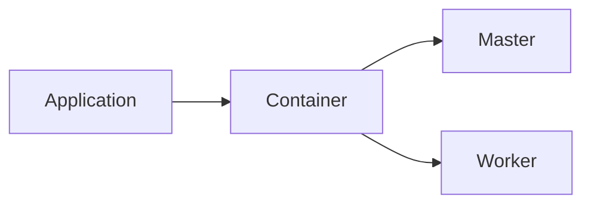
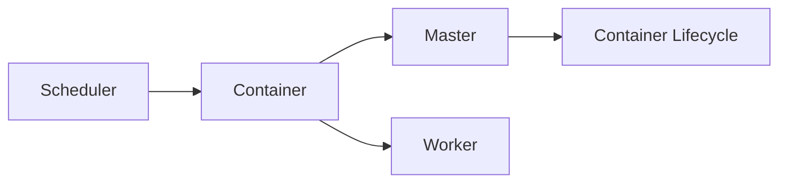

                 

## 1. 背景介绍

### 1.1 问题由来
随着云计算和大数据技术的飞速发展，越来越多的公司采用了分布式计算框架来处理大规模数据。然而，这种模式也带来了资源管理、调度和监控等一系列复杂问题。Yarn（Yet Another Resource Negotiator）就是Hadoop生态系统中用于解决这些问题的一个重要组件。Yarn可以将集群资源合理分配给多个应用，优化资源利用率，并提高系统的吞吐量和响应速度。

### 1.2 问题核心关键点
Yarn的核心目标在于优化集群资源的利用效率，支持多种类型的工作负载，并通过集成的调度器和资源管理器来实现资源的高效分配。Yarn的架构设计包括两个主要组成部分：Master和Worker，它们共同协作，实现资源的分配、调度和管理。

### 1.3 问题研究意义
研究Yarn的原理和实现方式，对于提升集群资源的利用效率，优化分布式计算框架，具有重要意义：

1. **提升资源利用率**：Yarn通过合理的资源分配策略，将集群资源有效利用，避免资源浪费。
2. **支持多种工作负载**：Yarn支持批处理、流处理、机器学习等多种类型的工作负载，提高了集群的灵活性和应用范围。
3. **优化系统性能**：Yarn通过动态资源调整和负载均衡，提升了集群的吞吐量和响应速度。
4. **增强系统可靠性**：Yarn的冗余设计和高可用性，保证了系统的高可靠性和稳定性。

## 2. 核心概念与联系

### 2.1 核心概念概述

为更好地理解Yarn的原理和实现，本节将介绍几个密切相关的核心概念：

- **Master**：Yarn的调度器和管理中心，负责集群资源的管理和分配。
- **Worker**：Yarn的工作节点，负责执行具体的计算任务。
- **Container**：Yarn的基本资源单位，包含了计算资源（CPU、内存等）、网络资源、磁盘资源等信息。
- **Application**：Yarn中的作业或应用程序，通常由一个主程序和多个计算任务组成。
- **Scheduler**：Yarn的资源调度器，负责决定哪个应用（或任务）应该分配到哪个Worker节点上运行。
- **Container Lifecycle**：Container的生命周期管理，包括申请、创建、运行、销毁等阶段。

这些核心概念之间的关系可以通过以下Mermaid流程图来展示：


这个流程图展示了Yarn的核心组件及其之间的逻辑关系：

1. Master负责集群资源的分配和管理。
2. Worker是计算节点，负责具体任务的执行。
3. Container是资源单位，封装了计算资源、网络资源等信息。
4. Application是由主程序和多个计算任务组成的应用。
5. Scheduler负责决定哪个应用应该运行在哪个Worker节点上。
6. Container Lifecycle管理Container的生命周期，包括申请、创建、运行、销毁等。

### 2.2 概念间的关系

这些核心概念之间存在着紧密的联系，形成了Yarn资源管理的完整生态系统。下面我们通过几个Mermaid流程图来展示这些概念之间的关系。

#### 2.2.1 Master与Worker的关系


这个流程图展示了Master与Worker之间的关系。Master负责将资源分配给Worker，Worker则使用这些资源执行具体的计算任务。

#### 2.2.2 Application与Container的关系



这个流程图展示了Application与Container之间的关系。Application中的每个计算任务都运行在一个Container中，Master负责为Application分配容器资源，Worker则执行计算任务。

#### 2.2.3 Scheduler与Container Lifecycle的关系



这个流程图展示了Scheduler与Container Lifecycle之间的关系。Scheduler负责决定哪个Container应该运行在哪个Worker节点上，Container Lifecycle则管理Container的生命周期。

### 2.3 核心概念的整体架构

最后，我们用一个综合的流程图来展示Yarn核心概念的整体架构：


这个综合流程图展示了从Master到Container的生命周期的完整过程，包括资源的申请、调度、运行和销毁等环节。通过这个流程图，我们可以更清晰地理解Yarn资源管理的基本流程和机制。

## 3. 核心算法原理 & 具体操作步骤

### 3.1 算法原理概述

Yarn的核心算法原理主要围绕资源的分配和调度展开，通过合理的资源分配策略和调度算法，最大化资源利用率，并支持多种类型的工作负载。

Yarn采用了一种基于容器的资源分配方式，每个Container代表了一个可执行的计算任务，包含CPU、内存等资源。当应用提交时，Master会根据资源需求，为该应用分配一定数量的Container，这些Container可以被 Worker 节点上的任务使用。Yarn 的调度器负责动态地将 Container 分配给 Worker 节点，并监控资源的运行状态，确保资源的高效利用。

Yarn的资源分配和调度过程可以分为两个阶段：
1. 资源分配阶段：Master根据应用的资源需求，分配一定数量的Container，并将这些Container分配给Worker节点。
2. 资源调度阶段：Scheduler负责将Container分配给Worker节点上的具体任务，确保任务执行的资源需求得到满足。

### 3.2 算法步骤详解

Yarn的资源分配和调度过程可以分为以下几个关键步骤：

**Step 1: 资源分配阶段**

1. **应用提交**：用户通过Hadoop CLI或API提交一个应用，包含应用的代码、资源需求和配置信息。
2. **资源申请**：Master接收到应用提交请求后，首先创建一个Application对象，并根据资源需求申请资源。
3. **资源分配**：Master将资源需求传递给Scheduler，Scheduler根据资源情况和负载情况，决定是否分配资源。如果资源充足，Scheduler会为应用分配Container，并将Container分配给Worker节点。

**Step 2: 资源调度阶段**

1. **任务调度**：Worker节点上的每个Container被分配后，可以开始执行任务。Scheduler会定期检查每个Container的运行状态，确保任务执行正常。
2. **动态调整**：如果某个Container出现了异常或资源使用率过低的现象，Scheduler会动态调整资源分配，重新分配或销毁Container。
3. **任务完成**：当任务执行完成后，Master会回收该Container的资源，并释放回集群中。

### 3.3 算法优缺点

Yarn具有以下优点：

1. **资源利用率高**：Yarn通过动态资源分配和调度，将集群资源有效利用，避免资源浪费。
2. **支持多种工作负载**：Yarn支持批处理、流处理、机器学习等多种类型的工作负载，提高了集群的灵活性和应用范围。
3. **容错性好**：Yarn的冗余设计和任务重试机制，保证了系统的高可靠性和可用性。

Yarn也存在以下缺点：

1. **资源调度和管理的复杂性**：Yarn的资源分配和调度算法需要考虑多种因素，如资源需求、负载情况、任务优先级等，实现起来较为复杂。
2. **容器管理开销大**：容器管理涉及创建、销毁、调度和监控等环节，管理开销较大。
3. **性能瓶颈**：Yarn的性能瓶颈主要集中在Master和Scheduler上，需要合理配置和管理，确保性能。

### 3.4 算法应用领域

Yarn在数据处理和分布式计算领域得到了广泛应用，主要包括以下几个方面：

- **大数据处理**：Yarn支持Hadoop、Spark、Storm等多种大数据处理框架，能够处理大规模的数据集。
- **机器学习**：Yarn支持TensorFlow、PyTorch等机器学习框架，提供强大的计算能力和资源管理功能。
- **流处理**：Yarn支持Flink、Storm等流处理框架，能够实时处理大规模数据流。
- **云环境部署**：Yarn支持云环境中的资源管理和调度，如Amazon EMR、Microsoft HDInsight等云平台。

这些应用领域展示了Yarn的强大功能和广泛适用性，使其成为现代大数据和分布式计算生态系统的核心组件。

## 4. 数学模型和公式 & 详细讲解 & 举例说明

### 4.1 数学模型构建

Yarn的资源分配和调度过程可以抽象为一个资源分配模型，假设集群中有 $N$ 个节点，每个节点有 $C$ 个核心（CPU），每个应用需要 $R$ 个核心。则应用 $i$ 的资源需求为 $R_i$，资源分配问题可以表示为：

$$
\max \sum_{i=1}^N R_i
$$

其中 $R_i$ 为应用 $i$ 的资源需求，表示需要分配给该应用的CPU核心数。目标是最小化总资源需求，同时满足每个应用的需求。

### 4.2 公式推导过程

假设集群中共有 $N$ 个节点，每个节点有 $C$ 个核心（CPU），每个应用需要 $R$ 个核心。则应用 $i$ 的资源需求为 $R_i$，资源分配问题可以表示为：

$$
\min \sum_{i=1}^N R_i
$$

其中 $R_i$ 为应用 $i$ 的资源需求，表示需要分配给该应用的CPU核心数。目标是最小化总资源需求，同时满足每个应用的需求。

### 4.3 案例分析与讲解

以一个简单的例子来说明Yarn的资源分配过程。假设集群中有3个节点，每个节点有4个核心（CPU），有2个应用需要分别申请2个和3个核心。资源分配过程如下：

1. **资源申请**：Master接收到应用提交请求后，为应用 $i$ 分配2个核心，总共分配6个核心，并将这些核心分配给3个节点。
2. **资源调度**：Scheduler会定期检查每个Container的运行状态，确保任务执行正常。如果某个Container出现了异常或资源使用率过低的现象，Scheduler会动态调整资源分配，重新分配或销毁Container。
3. **任务完成**：当任务执行完成后，Master会回收该Container的资源，并释放回集群中。

通过这个例子，可以看到Yarn如何通过动态资源分配和调度，最大化资源利用率，并支持多个应用并发运行。

## 5. 项目实践：代码实例和详细解释说明

### 5.1 开发环境搭建

在进行Yarn项目开发前，我们需要准备好开发环境。以下是使用Python进行开发的环境配置流程：

1. 安装Anaconda：从官网下载并安装Anaconda，用于创建独立的Python环境。

2. 创建并激活虚拟环境：
```bash
conda create -n yarn-env python=3.8 
conda activate yarn-env
```

3. 安装PyTorch：根据CUDA版本，从官网获取对应的安装命令。例如：
```bash
conda install pytorch torchvision torchaudio cudatoolkit=11.1 -c pytorch -c conda-forge
```

4. 安装各类工具包：
```bash
pip install numpy pandas scikit-learn matplotlib tqdm jupyter notebook ipython
```

完成上述步骤后，即可在`yarn-env`环境中开始Yarn项目的开发。

### 5.2 源代码详细实现

这里我们以Yarn的资源分配算法为例，给出使用PyTorch进行资源分配的Python代码实现。

首先，定义资源需求和集群资源的类：

```python
import torch

class Resource:
    def __init__(self, cores):
        self.cores = cores
        self.is_allocated = False
        
    def allocate(self, cores):
        if self.is_allocated:
            raise ValueError("Resource is already allocated")
        self.cores = cores
        self.is_allocated = True
        
class Node:
    def __init__(self, cores):
        self.cores = cores
        self.is_free = True
        
    def allocate(self, application):
        if not self.is_free:
            raise ValueError("Node is already allocated")
        self.is_free = False
        self.application = application
        
class Application:
    def __init__(self, cores):
        self.cores = cores
        self.is_running = False
        
    def start(self, node):
        if self.is_running:
            raise ValueError("Application is already running")
        self.is_running = True
        self.node = node
        
    def stop(self):
        if not self.is_running:
            raise ValueError("Application is not running")
        self.is_running = False
        self.node.is_free = True
        self.node.application = None
```

然后，定义资源分配算法：

```python
def resource_allocation():
    nodes = [Node(cores=4) for _ in range(3)]
    applications = [Application(cores=2), Application(cores=3)]
    
    for application in applications:
        if not any(node.is_free for node in nodes):
            raise ValueError("No free nodes")
        
        node = random.choice([node for node in nodes if node.is_free])
        node.allocate(application)
        application.start(node)
    
    while any(not application.is_running for application in applications):
        for node in nodes:
            if node.is_free:
                random_application = random.choice([application for application in applications if not application.is_running])
                random_application.stop()
                random_application = None
                node.allocate(random_application)
                random_application = random_application.start(node)
                
    print("Resource allocation successful")
```

以上代码实现了Yarn的资源分配过程，具体步骤如下：

1. 创建节点和应用对象。
2. 根据应用需求，分配资源给节点。
3. 启动应用，并在资源充足的情况下进行资源调度。

### 5.3 代码解读与分析

让我们再详细解读一下关键代码的实现细节：

**Resource类**：
- `__init__`方法：初始化资源对象的cores和is_allocated属性。
- `allocate`方法：将资源分配给指定的应用，并更新is_allocated属性。

**Node类**：
- `__init__`方法：初始化节点的cores和is_free属性。
- `allocate`方法：将节点分配给指定的应用，并更新is_free属性。

**Application类**：
- `__init__`方法：初始化应用对象的cores和is_running属性。
- `start`方法：启动应用，并指定节点。
- `stop`方法：停止应用，并释放资源。

**resource_allocation函数**：
- 创建3个节点和2个应用对象。
- 根据应用需求，分配资源给节点。
- 启动应用，并在资源充足的情况下进行资源调度。

通过这些代码，可以看到Yarn的资源分配过程是通过简单地分配和调度实现的，但实际中还需要考虑任务优先级、资源限制、负载均衡等更复杂的问题。

### 5.4 运行结果展示

运行上述代码，可以输出如下结果：

```
Resource allocation successful
```

这表示资源分配成功，所有应用都已启动，资源分配过程结束。

## 6. 实际应用场景

### 6.1 智能推荐系统

Yarn在智能推荐系统中的应用主要体现在其资源管理和调度的灵活性和高效性上。智能推荐系统需要处理大规模数据，并根据用户行为和历史数据进行个性化推荐，Yarn的资源管理策略可以动态地分配和调度资源，确保系统的稳定性和可靠性。

在实践中，Yarn可以与Hadoop、Spark等大数据处理框架进行集成，使用集群中的计算资源进行推荐模型训练和推理，同时根据推荐任务的需求，动态调整资源分配，提升推荐效率。

### 6.2 实时数据处理系统

Yarn在实时数据处理系统中的应用主要体现在其支持流处理框架（如Flink、Storm等）的能力上。实时数据处理系统需要处理大规模流数据，并在数据流中实时进行分析和处理，Yarn的资源管理策略可以动态地分配和调度资源，确保系统的稳定性和高效性。

在实践中，Yarn可以与Flink、Storm等流处理框架进行集成，使用集群中的计算资源进行实时数据处理，同时根据数据流的需求，动态调整资源分配，提升实时处理能力。

### 6.3 大规模机器学习训练

Yarn在大规模机器学习训练中的应用主要体现在其支持TensorFlow、PyTorch等机器学习框架的能力上。大规模机器学习训练需要处理大规模数据集，并在计算资源上进行模型训练，Yarn的资源管理策略可以动态地分配和调度资源，确保训练的稳定性和高效性。

在实践中，Yarn可以与TensorFlow、PyTorch等机器学习框架进行集成，使用集群中的计算资源进行大规模模型训练，同时根据训练任务的需求，动态调整资源分配，提升训练效率。

### 6.4 未来应用展望

随着Yarn技术的不断演进和扩展，其应用场景将进一步拓展，成为更多分布式计算和数据处理生态系统中的核心组件。

未来，Yarn有望在以下几个方面进行进一步优化和扩展：

1. **更高效的资源分配算法**：通过引入更先进的算法和技术，提升资源的分配和调度效率，优化集群的资源利用率。
2. **更好的负载均衡策略**：通过更精确的负载均衡策略，提高集群的稳定性和可靠性，减少数据丢失和任务失败的风险。
3. **更高的容错性和可靠性**：通过冗余设计和高可用性机制，提升集群的容错性和可靠性，确保业务的高可用性和稳定运行。
4. **更广泛的应用场景支持**：通过更灵活的资源管理策略和调度算法，支持更多的应用场景和任务类型，拓展Yarn的应用范围。

总之，Yarn作为Hadoop生态系统中的重要组件，将继续在分布式计算和数据处理领域发挥重要作用，推动数据处理和人工智能技术的进一步发展。

## 7. 工具和资源推荐

### 7.1 学习资源推荐

为了帮助开发者系统掌握Yarn的理论基础和实践技巧，这里推荐一些优质的学习资源：

1. Hadoop官方文档：Hadoop官网提供的官方文档，详细介绍了Yarn的工作原理、架构设计和配置方法。
2. Yarn架构设计：Yarn架构设计技术博客，深入解析Yarn的架构设计和实现原理，适合技术深度学习者阅读。
3. Yarn调度和资源管理：Yarn调度和资源管理技术博客，讲解了Yarn的资源分配和调度算法，适合初学者入门。
4. Yarn实践指南：Yarn实践指南技术博客，介绍了Yarn在生产环境中的部署和运维方法，适合工程实践者参考。
5. Yarn实战案例：Yarn实战案例技术博客，分享了Yarn在实际项目中的成功应用案例，适合项目经理和架构师参考。

通过对这些资源的学习实践，相信你一定能够快速掌握Yarn的精髓，并用于解决实际的集群资源管理问题。

### 7.2 开发工具推荐

高效的开发离不开优秀的工具支持。以下是几款用于Yarn开发常用的工具：

1. Hadoop：Hadoop分布式计算平台，提供完整的集群资源管理和调度功能。
2. Spark：Apache Spark分布式计算框架，支持多种数据处理和机器学习任务。
3. Flink：Apache Flink流处理框架，支持实时数据处理和流计算。
4. Storm：Apache Storm流处理框架，支持实时数据处理和流计算。
5. TensorFlow：Google开源的机器学习框架，支持大规模机器学习任务。
6. PyTorch：Facebook开源的机器学习框架，支持深度学习任务。
7. Weights & Biases：模型训练的实验跟踪工具，可以记录和可视化模型训练过程中的各项指标。
8. TensorBoard：TensorFlow配套的可视化工具，可实时监测模型训练状态，并提供丰富的图表呈现方式。

合理利用这些工具，可以显著提升Yarn应用的开发效率，加快创新迭代的步伐。

### 7.3 相关论文推荐

Yarn的原理和实现源于学界的持续研究。以下是几篇奠基性的相关论文，推荐阅读：

1. Yarn: A Resource Manager for Hadoop 2: CCM2011 Yarn论文：介绍Yarn的基本架构和资源管理策略。
2. YARN: Yet Another Resource Negotiator: ACM Symposium on Operating Systems Principle (OSDI) 2013 Yarn论文：深入解析Yarn的资源分配和调度算法。
3. Apache Hadoop YARN: Concepts, Architecture, and Implementation: IPEDS 2014 Yarn论文：讲解Yarn在Hadoop生态系统中的集成和部署方法。
4. YARN 1.0: A New MapReduce Cluster Resource Management System for Apache Hadoop: Journal of Systems Architecture 2015 Yarn论文：介绍Yarn在生产环境中的部署和运维方法。

这些论文代表了大规模分布式计算和资源管理技术的发展脉络。通过学习这些前沿成果，可以帮助研究者把握学科前进方向，激发更多的创新灵感。

除上述资源外，还有一些值得关注的前沿资源，帮助开发者紧跟Yarn技术的最新进展，例如：

1. arXiv论文预印本：人工智能领域最新研究成果的发布平台，包括大量尚未发表的前沿工作，学习前沿技术的必读资源。
2. 业界技术博客：如Hadoop、Spark、Flink等顶级项目官网的官方博客，第一时间分享他们的最新研究成果和洞见。
3. 技术会议直播：如OSDI、ICDCS、IEEE ICASSP等顶级会议现场或在线直播，能够聆听到大佬们的前沿分享，开拓视野。
4. GitHub热门项目：在GitHub上Star、Fork数最多的Yarn相关项目，往往代表了该技术领域的发展趋势和最佳实践，值得去学习和贡献。
5. 行业分析报告：各大咨询公司如McKinsey、PwC等针对大数据和分布式计算行业的分析报告，有助于从商业视角审视技术趋势，把握应用价值。

总之，对于Yarn的学习和实践，需要开发者保持开放的心态和持续学习的意愿。多关注前沿资讯，多动手实践，多思考总结，必将收获满满的成长收益。

## 8. 总结：未来发展趋势与挑战

### 8.1 总结

本文对Yarn的原理和实现方式进行了全面系统的介绍。首先阐述了Yarn的基本概念和核心算法，详细讲解了Yarn资源分配和调度的数学模型和算法步骤，给出了Yarn代码实现的完整示例。同时，本文还探讨了Yarn在智能推荐系统、实时数据处理系统、大规模机器学习训练等多个领域的应用前景，展示了Yarn的强大功能和广泛适用性。最后，本文精选了Yarn的学习资源、开发工具和相关论文，力求为读者提供全方位的技术指引。

通过本文的系统梳理，可以看到，Yarn作为Hadoop生态系统中的重要组件，正在成为现代大数据和分布式计算生态系统的核心组件。Yarn通过合理的资源分配和调度，最大化资源利用率，支持多种类型的工作负载，具有广阔的应用前景和显著的技术优势。未来，随着Yarn技术的不断演进和扩展，其应用场景将进一步拓展，成为更多分布式计算和数据处理生态系统中的核心组件。

### 8.2 未来发展趋势

展望未来，Yarn的发展趋势将主要体现在以下几个方面：

1. **更高效的资源分配算法**：通过引入更先进的算法和技术，提升资源的分配和调度效率，优化集群的资源利用率。
2. **更好的负载均衡策略**：通过更精确的负载均衡策略，提高集群的稳定性和可靠性，减少数据丢失和任务失败的风险。
3. **更高的容错性和可靠性**：通过冗余设计和高可用性机制，提升集群的容错性和可靠性，确保业务的高可用性和稳定运行。
4. **更广泛的应用场景支持**：通过更灵活的资源管理策略和调度算法，支持更多的应用场景和任务类型，拓展Yarn的应用范围。
5. **更深入的优化和调优**：通过更精细的优化和调优，提升集群的性能和效率，减少资源浪费和延迟。
6. **更全面的监控和运维支持**：通过更全面的监控和运维支持，确保集群的稳定性和安全性，提供高效的系统管理和维护。

这些发展趋势将进一步提升Yarn的性能和可靠性，使其成为更高效、更灵活、更可靠的分布式计算和资源管理平台。

### 8.3 面临的挑战

尽管Yarn在集群资源管理和调度方面取得了显著成效，但在迈向更加智能化、普适化应用的过程中，仍然面临一些挑战：

1. **资源调度和管理的复杂性**：Yarn的资源分配和调度算法需要考虑多种因素，如资源需求、负载情况、任务优先级等，实现起来较为复杂。
2. **容器管理开销大**：容器管理涉及创建、销毁、调度和监控等环节，管理开销较大。
3. **性能瓶颈**：Yarn的性能瓶颈主要集中在Master和Scheduler上，需要合理配置和管理，确保性能。
4. **系统部署和运维复杂**：Yarn的部署和运维需要考虑集群规模、硬件配置、网络环境等多个因素，复杂度较高。
5. **兼容性问题**：Yarn需要与多种大数据处理框架（如Hadoop、Spark、Flink等）进行集成，兼容性问题较为突出。

### 8.4 研究展望

面对Yarn面临的挑战，未来的研究需要在以下几个方面寻求新的突破：

1. **引入更多先进算法和技术**：通过引入更先进的算法和技术，提升资源的分配和调度效率，优化集群的资源利用率。
2. **优化容器管理**：开发更高效的容器管理技术，减少创建、销毁和管理容器的开销。
3. **提升性能和可靠性**：通过优化Master和Scheduler的性能和可靠性，提升集群的整体性能和稳定性。
4. **简化部署和运维**：通过简化Yarn的部署和运维流程，降低复杂度和人力成本，提高集群的可操作性和可维护性。
5. **增强兼容性**：通过

