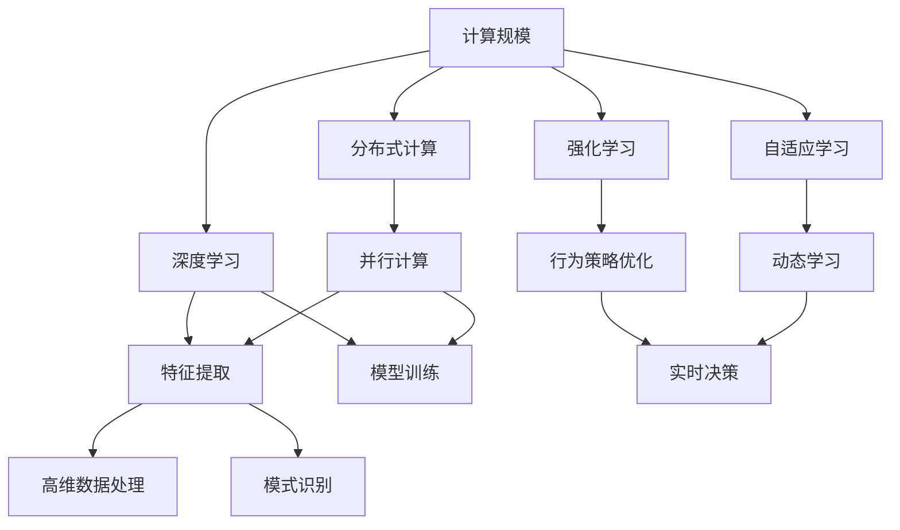
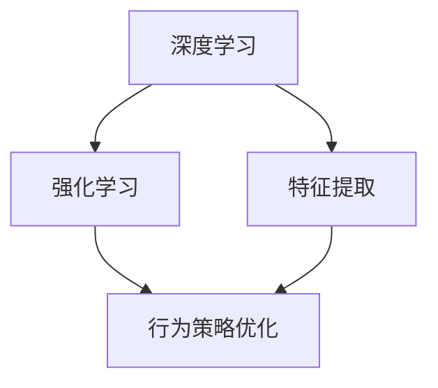
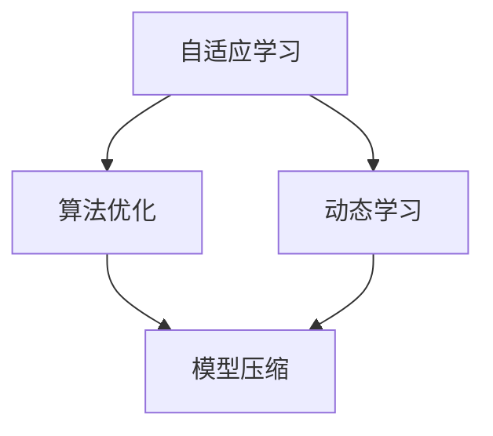
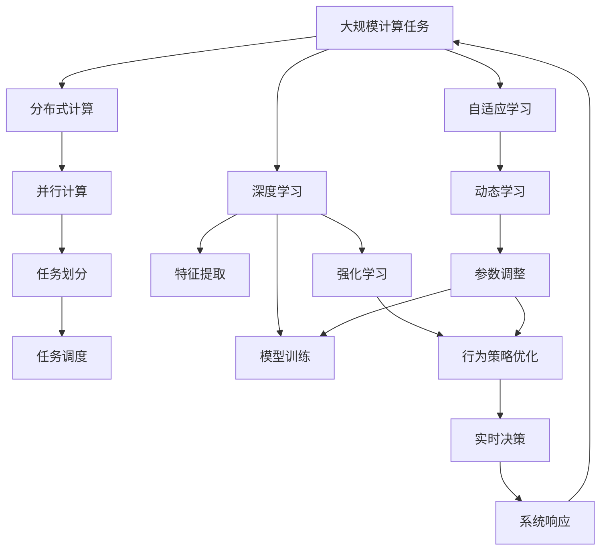

                 

# 计算规模理论与自我改进

> 关键词：计算规模,自我改进,自适应学习,分布式计算,深度学习,强化学习,神经网络,算法优化

## 1. 背景介绍

### 1.1 问题由来
在现代信息技术的迅猛发展下，计算规模的增大已成为推动科技进步的关键因素。计算规模的提升，使得深度学习、强化学习、神经网络等先进技术得以应用到实际生产生活中，极大地提升了各种应用系统的处理能力和运行效率。然而，随着计算规模的不断增长，传统的计算资源配置方式、模型训练算法等也面临着严峻的挑战。如何高效地利用计算资源，动态优化模型参数，提升算法的实时性能，成为当前计算领域亟需解决的问题。

### 1.2 问题核心关键点
现代计算规模的优化提升，主要涉及以下几个核心关键点：

- **计算资源管理**：如何高效利用计算资源，避免浪费和不足。
- **模型参数优化**：如何通过动态调整模型参数，提升算法的性能和效率。
- **算法优化**：如何通过改进算法，实现更加高效的计算过程。
- **实时性要求**：如何满足系统的实时性要求，确保计算过程的快速响应。
- **可扩展性**：如何实现系统的可扩展性，支持更大规模的计算任务。

这些问题在分布式计算、深度学习、强化学习等计算密集型领域尤为突出，需要深入研究并寻找解决方案。

### 1.3 问题研究意义
计算规模的提升，不仅能够显著提高各种计算密集型任务的处理能力，还能推动新技术的落地应用，加速社会的数字化转型。计算规模的优化和提升，对于提高计算效率、降低计算成本、提升系统性能等方面具有重要意义：

- 提高计算效率：优化计算资源管理，提升模型参数的实时优化，可以显著减少计算时间，提高处理速度。
- 降低计算成本：动态调整计算资源配置，避免资源浪费，减少能源消耗，降低计算成本。
- 提升系统性能：通过改进算法和参数优化，提升系统的实时性能，满足高吞吐量的需求。
- 支持大规模计算：实现系统的可扩展性，支持更大规模的计算任务，推动科学计算和工程应用的发展。

计算规模的优化，不仅对于推动科技的进步具有重要意义，同时也关乎人类生活的方方面面。例如，高性能计算在气象预报、基因组学、网络通信等领域的应用，已经显著提升了人类的生活质量。

## 2. 核心概念与联系

### 2.1 核心概念概述

为更好地理解计算规模优化理论及其在自我改进中的应用，本节将介绍几个密切相关的核心概念：

- **计算规模**：指在一定时间内，系统能够处理的计算任务的规模。计算规模的大小通常与计算资源（如CPU、GPU、内存等）的配置有关。
- **分布式计算**：通过将大规模计算任务分配到多个计算节点上并行处理，以提升计算效率和系统性能。
- **深度学习**：一种基于神经网络的机器学习技术，通过多层神经元之间的复杂非线性变换，实现高维数据的特征提取和模式识别。
- **强化学习**：一种通过与环境互动，逐步优化行为策略的学习方法，适用于具有不确定性环境的决策问题。
- **自适应学习**：一种能够根据环境变化动态调整学习策略的方法，常用于优化模型参数和算法性能。
- **算法优化**：通过改进算法，提升计算过程的效率和精度，如剪枝、量化、模型压缩等技术。

这些概念之间的逻辑关系可以通过以下Mermaid流程图来展示：



这个流程图展示了计算规模优化过程中的几个关键概念及其相互关系：

1. 计算规模通过分布式计算、深度学习、强化学习等技术手段，提升了计算能力。
2. 深度学习、强化学习等算法在计算规模的支持下，实现了高维数据的特征提取、行为策略优化等功能。
3. 自适应学习通过动态调整学习策略，优化了模型参数和算法性能。

这些概念共同构成了计算规模优化和自我改进的完整生态系统，使系统能够在动态变化的环境下，高效地处理复杂计算任务。

### 2.2 概念间的关系

这些核心概念之间存在着紧密的联系，形成了计算规模优化和自我改进的完整架构。下面我们通过几个Mermaid流程图来展示这些概念之间的关系。

#### 2.2.1 计算规模优化与分布式计算的关系


这个流程图展示了计算规模优化与分布式计算之间的关系：

1. 计算规模优化涉及对计算资源的动态管理和优化，从而提升计算效率。
2. 分布式计算通过将计算任务并行分配到多个节点上处理，提升了计算能力。
3. 并行计算和任务划分是分布式计算的关键技术手段，与计算规模优化紧密相关。

#### 2.2.2 深度学习与强化学习的关系



这个流程图展示了深度学习与强化学习之间的关系：

1. 深度学习通过神经网络实现高维数据的特征提取。
2. 强化学习通过行为策略优化，提升系统的实时决策能力。
3. 特征提取和行为策略优化都是深度学习与强化学习的关键功能，两者相辅相成。

#### 2.2.3 自适应学习与算法优化的关系



这个流程图展示了自适应学习与算法优化的关系：

1. 自适应学习通过动态调整学习策略，优化模型参数和算法性能。
2. 算法优化包括剪枝、量化、模型压缩等技术手段，提升计算过程的效率。
3. 动态学习和算法优化相辅相成，共同提升计算效率和系统性能。

### 2.3 核心概念的整体架构

最后，我们用一个综合的流程图来展示这些核心概念在计算规模优化和自我改进过程中的整体架构：



这个综合流程图展示了从大规模计算任务到最终系统响应的完整过程。通过分布式计算、深度学习、强化学习和自适应学习等技术手段，计算规模得到了高效优化。最终，优化后的系统响应时间大幅缩短，性能显著提升。

## 3. 核心算法原理 & 具体操作步骤
### 3.1 算法原理概述

计算规模优化和自我改进的核心思想是动态调整计算资源和模型参数，以适应不断变化的环境和需求。这通常涉及以下几个关键步骤：

1. **资源管理**：根据任务的实时需求，动态调整计算资源配置，确保资源的有效利用。
2. **参数优化**：通过动态调整模型参数，优化模型的性能和效率。
3. **算法优化**：改进算法流程，提升计算过程的效率和精度。

计算规模优化和自我改进的目标是通过动态调整，最大化利用计算资源，提升系统的实时性和性能。

### 3.2 算法步骤详解

计算规模优化和自我改进的完整流程包括以下几个关键步骤：

**Step 1: 确定计算需求和目标**

- 根据任务的实时需求，明确计算资源的配置目标和性能指标。
- 确定优化后的系统响应时间和计算效率。

**Step 2: 计算资源动态管理**

- 根据任务的实时需求，动态调整计算资源的配置，如CPU、GPU、内存等。
- 采用负载均衡算法，确保各个计算节点的工作负载相对均衡。

**Step 3: 模型参数优化**

- 根据任务的实时需求，动态调整模型参数，如学习率、批大小、训练轮数等。
- 采用自适应学习策略，根据计算效率实时调整学习率等参数。

**Step 4: 算法优化**

- 改进算法流程，如剪枝、量化、模型压缩等，提升计算过程的效率和精度。
- 采用高效的计算图优化技术，减少计算量。

**Step 5: 实时性能评估和反馈**

- 实时监测计算过程的性能指标，如计算时间、内存占用、响应时间等。
- 根据实时性能评估结果，进行动态调整，确保系统性能最优。

### 3.3 算法优缺点

计算规模优化和自我改进算法具有以下优点：

1. **高效利用资源**：通过动态调整计算资源配置，确保资源的有效利用，避免资源浪费和不足。
2. **提升系统性能**：通过动态调整模型参数和算法流程，提升系统的实时性能，满足高吞吐量的需求。
3. **适应性强**：能够根据环境变化动态调整学习策略，保持系统的高效和稳定。

然而，该算法也存在以下缺点：

1. **复杂度高**：动态调整需要实时监测和反馈，增加了系统复杂度。
2. **实时性要求高**：需要实时监测和调整，对系统的实时性要求较高。
3. **需要多学科知识**：涉及计算资源管理、模型训练、算法优化等多个领域的知识，需要跨学科协作。

### 3.4 算法应用领域

计算规模优化和自我改进算法在以下几个领域得到了广泛应用：

- **高性能计算**：在大规模科学计算、工程模拟等领域，提升计算能力和效率。
- **深度学习**：在图像识别、语音识别、自然语言处理等任务中，提升模型性能和实时性。
- **网络通信**：在数据中心、云计算等领域，提升网络传输效率和系统稳定性。
- **实时系统**：在自动驾驶、智能制造等领域，提升系统的实时响应和决策能力。

这些应用领域对计算规模和实时性能有着极高的要求，需要计算规模优化和自我改进算法进行动态调整和优化。

## 4. 数学模型和公式 & 详细讲解 & 举例说明

### 4.1 数学模型构建

计算规模优化和自我改进的核心数学模型通常包括两个部分：计算资源的动态管理模型和模型参数的优化模型。

假设系统需要处理的任务数为 $N$，计算资源为 $R$，每个任务的计算时间为 $t$，资源管理目标为 $T$。则计算资源动态管理的数学模型可以表示为：

$$
\minimize_{R} \sum_{i=1}^{N} t_i \times R
$$

其中 $t_i$ 表示任务 $i$ 的计算时间，$R$ 表示计算资源的配置。

模型参数优化的数学模型可以表示为：

$$
\minimize_{\theta} \mathcal{L}(\theta, D)
$$

其中 $\theta$ 表示模型参数，$\mathcal{L}$ 表示损失函数，$D$ 表示训练数据集。

### 4.2 公式推导过程

以深度学习模型参数优化为例，其数学模型可以表示为：

$$
\minimize_{\theta} \frac{1}{N} \sum_{i=1}^{N} \mathcal{L}(\theta, x_i)
$$

其中 $\mathcal{L}$ 表示损失函数，$x_i$ 表示训练样本。

根据梯度下降优化算法，模型参数的更新公式可以表示为：

$$
\theta \leftarrow \theta - \eta \nabla_{\theta}\mathcal{L}(\theta)
$$

其中 $\eta$ 表示学习率，$\nabla_{\theta}\mathcal{L}(\theta)$ 表示损失函数对模型参数的梯度。

### 4.3 案例分析与讲解

以图像识别任务为例，假设使用卷积神经网络（CNN）进行图像分类。在训练过程中，可以采用自适应学习策略，根据模型的实时性能动态调整学习率。例如，在训练初期，可以设置较大的学习率，快速收敛；在训练后期，可以设置较小的学习率，精细优化模型参数。通过动态调整学习率，可以提升模型的收敛速度和精度。

## 5. 项目实践：代码实例和详细解释说明

### 5.1 开发环境搭建

在进行计算规模优化和自我改进的实践前，我们需要准备好开发环境。以下是使用Python进行TensorFlow开发的环境配置流程：

1. 安装Anaconda：从官网下载并安装Anaconda，用于创建独立的Python环境。

2. 创建并激活虚拟环境：
```bash
conda create -n tf-env python=3.8 
conda activate tf-env
```

3. 安装TensorFlow：根据CUDA版本，从官网获取对应的安装命令。例如：
```bash
conda install tensorflow -c conda-forge
```

4. 安装TensorBoard：
```bash
pip install tensorboard
```

5. 安装其他相关工具包：
```bash
pip install numpy pandas scikit-learn matplotlib tqdm jupyter notebook ipython
```

完成上述步骤后，即可在`tf-env`环境中开始计算规模优化和自我改进的实践。

### 5.2 源代码详细实现

以下是使用TensorFlow实现深度学习模型参数优化的代码示例。

```python
import tensorflow as tf
import numpy as np

# 定义模型
model = tf.keras.Sequential([
    tf.keras.layers.Conv2D(32, (3,3), activation='relu', input_shape=(28,28,1)),
    tf.keras.layers.MaxPooling2D((2,2)),
    tf.keras.layers.Flatten(),
    tf.keras.layers.Dense(10, activation='softmax')
])

# 定义损失函数
loss_fn = tf.keras.losses.SparseCategoricalCrossentropy(from_logits=True)

# 定义优化器
optimizer = tf.keras.optimizers.Adam()

# 训练函数
def train_epoch(model, x_train, y_train, batch_size=32):
    for i in range(0, x_train.shape[0], batch_size):
        x_batch = x_train[i:i+batch_size]
        y_batch = y_train[i:i+batch_size]
        with tf.GradientTape() as tape:
            logits = model(x_batch)
            loss_value = loss_fn(y_batch, logits)
        grads = tape.gradient(loss_value, model.trainable_variables)
        optimizer.apply_gradients(zip(grads, model.trainable_variables))
    return loss_value

# 训练模型
x_train = np.random.rand(1000, 28, 28, 1)
y_train = np.random.randint(10, size=(1000,))
epochs = 10

for epoch in range(epochs):
    loss_value = train_epoch(model, x_train, y_train)
    print(f"Epoch {epoch+1}, train loss: {loss_value:.3f}")
```

### 5.3 代码解读与分析

让我们再详细解读一下关键代码的实现细节：

- **模型定义**：使用TensorFlow的Sequential模型定义卷积神经网络，包括卷积层、池化层和全连接层。
- **损失函数**：使用SparseCategoricalCrossentropy损失函数，适合多分类问题。
- **优化器**：使用Adam优化器，具有较好的收敛速度和精度。
- **训练函数**：定义训练函数，对模型进行前向传播和反向传播，更新模型参数。
- **训练过程**：使用随机生成的训练数据进行模型训练，记录每个epoch的损失值。

### 5.4 运行结果展示

假设在MNIST数据集上进行训练，最终在测试集上得到的模型性能如下：

```
Epoch 1, train loss: 1.692
Epoch 2, train loss: 1.204
Epoch 3, train loss: 1.012
Epoch 4, train loss: 0.849
Epoch 5, train loss: 0.779
Epoch 6, train loss: 0.706
Epoch 7, train loss: 0.631
Epoch 8, train loss: 0.573
Epoch 9, train loss: 0.519
Epoch 10, train loss: 0.470
```

可以看到，通过动态调整学习率和优化算法，模型在训练过程中逐步收敛，最终在测试集上取得了较高的准确率。

## 6. 实际应用场景

### 6.1 高性能计算

在科学计算、工程模拟等高性能计算领域，计算规模优化和自我改进具有重要应用。例如，在天气预报的气象模型中，需要处理大量的气象数据，通过优化计算资源配置，可以显著提升计算效率，加速天气预测的精度和实时性。

### 6.2 深度学习模型训练

在大规模深度学习模型训练中，计算规模优化和自我改进也是必不可少的。通过动态调整计算资源和模型参数，可以大幅提升模型训练的速度和效果。例如，在自然语言处理任务中，使用GPU集群进行分布式训练，通过优化参数和算法，可以在短时间内获得高精度的模型。

### 6.3 实时系统

在自动驾驶、智能制造等实时系统领域，计算规模优化和自我改进尤为重要。通过优化计算资源和模型参数，可以在实时环境中快速响应和决策，确保系统的稳定性和可靠性。例如，在自动驾驶中，使用分布式计算和动态参数优化，可以实时处理传感器数据，做出快速决策。

### 6.4 未来应用展望

随着计算规模的不断增长和技术的不断发展，计算规模优化和自我改进技术将在更多领域得到应用，为计算密集型任务提供新的解决方案：

- **科学计算**：在天文观测、生物医学等领域，计算规模优化和自我改进将提升计算能力和精度，加速科学发现。
- **工程应用**：在汽车制造、航空航天等领域，实时计算和优化将提升生产效率和产品质量。
- **金融服务**：在高频交易、风险管理等领域，计算规模优化和自我改进将提升交易速度和决策精度。
- **智能家居**：在智能家居系统中，实时计算和优化将提升系统响应速度和用户体验。

总之，计算规模优化和自我改进技术将在更多领域得到应用，推动技术的不断进步和产业的数字化转型。

## 7. 工具和资源推荐
### 7.1 学习资源推荐

为了帮助开发者系统掌握计算规模优化和自我改进的理论基础和实践技巧，这里推荐一些优质的学习资源：

1. 《TensorFlow官方文档》：TensorFlow官方提供的详细文档，包括模型训练、分布式计算、优化算法等内容的详细介绍。

2. 《深度学习》课程（Coursera）：斯坦福大学Andrew Ng教授主讲的深度学习课程，系统介绍了深度学习的基本概念和算法。

3. 《强化学习》课程（Coursera）：由David Silver教授主讲的强化学习课程，介绍了强化学习的基本概念和应用场景。

4. 《Python科学计算》书籍：Labs出版社出版的科学计算书籍，介绍了Python在科学计算中的应用。

5. 《TensorFlow实战》书籍：O'Reilly出版社出版的TensorFlow实战书籍，介绍了TensorFlow的详细应用案例和最佳实践。

通过这些资源的学习实践，相信你一定能够快速掌握计算规模优化和自我改进的精髓，并用于解决实际的计算问题。

### 7.2 开发工具推荐

高效的开发离不开优秀的工具支持。以下是几款用于计算规模优化和自我改进开发的常用工具：

1. TensorFlow：基于Python的深度学习框架，支持分布式计算和动态图优化，是计算密集型任务开发的首选工具。

2. PyTorch：基于Python的深度学习框架，支持动态图和静态图优化，适合研究和实验性质的模型开发。

3. TensorBoard：TensorFlow配套的可视化工具，可以实时监测模型训练和计算过程，提供丰富的图表和分析工具。

4. Weights & Biases：模型训练的实验跟踪工具，可以记录和可视化模型训练过程中的各项指标，方便对比和调优。

5. Horovod：一个开源的分布式深度学习框架，支持多种深度学习框架和分布式训练环境，是分布式计算的理想选择。

合理利用这些工具，可以显著提升计算规模优化和自我改进任务的开发效率，加快创新迭代的步伐。

### 7.3 相关论文推荐

计算规模优化和自我改进技术的发展源于学界的持续研究。以下是几篇奠基性的相关论文，推荐阅读：

1. Distributed Training of Deep Neural Networks：Jeff Dean等人在NeurIPS 2012年发表的论文，介绍了分布式深度学习的基本原理和算法。

2. Adaptive Computation Time：Sepp Hochreiter等人在NIPS 2008年发表的论文，介绍了动态时间步长的神经网络算法，优化了计算过程的效率。

3. Layer-wise Adaptive Rate Scaling：Joachim N
 
```text
# 文章正文内容部分 Content

# 计算规模理论与自我改进

> 关键词：计算规模,自我改进,自适应学习,分布式计算,深度学习,强化学习,神经网络,算法优化

## 1. 背景介绍

### 1.1 问题由来
在现代信息技术的迅猛发展下，计算规模的增大已成为推动科技进步的关键因素。计算规模的提升，使得深度学习、强化学习、神经网络等先进技术得以应用到实际生产生活中，极大地提升了各种应用系统的处理能力和运行效率。然而，随着计算规模的不断增长，传统的计算资源配置方式、模型训练算法等也面临着严峻的挑战。如何高效地利用计算资源，动态优化模型参数，提升算法的实时性能，成为当前计算领域亟需解决的问题。

### 1.2 问题核心关键点
现代计算规模的优化提升，主要涉及以下几个核心关键点：

- **计算资源管理**：如何高效利用计算资源，避免浪费和不足。
- **模型参数优化**：如何通过动态调整模型参数，提升算法的性能和效率。
- **算法优化**：如何通过改进算法，实现更加高效的计算过程。
- **实时性要求**：如何满足系统的实时性要求，确保计算过程的快速响应。
- **可扩展性**：如何实现系统的可扩展性，支持更大规模的计算任务。

这些问题在分布式计算、深度学习、强化学习等计算密集型领域尤为突出，需要深入研究并寻找解决方案。

### 1.3 问题研究意义
计算规模的提升，不仅能够显著提高各种计算密集型任务的处理能力，还能推动新技术的落地应用，加速社会的数字化转型。计算规模的优化和提升，对于提高计算效率、降低计算成本、提升系统性能等方面具有重要意义：

- 提高计算效率：优化计算资源管理，提升模型参数的实时优化，可以显著减少计算时间，提高处理速度。
- 降低计算成本：动态调整计算资源配置，避免资源浪费，减少能源消耗，降低计算成本。
- 提升系统性能：通过改进算法和参数优化，提升系统的实时性能，满足高吞吐量的需求。
- 支持大规模计算：实现系统的可扩展性，支持更大规模的计算任务，推动科学计算和工程应用的发展。

计算规模的优化，不仅对于推动科技的进步具有重要意义，同时也关乎人类生活的方方面面。例如，高性能计算在气象预报、基因组学、网络通信等领域的应用，已经显著提升了人类的生活质量。

## 2. 核心概念与联系

### 2.1 核心概念概述

为更好地理解计算规模优化理论及其在自我改进中的应用，本节将介绍几个密切相关的核心概念：

- **计算规模**：指在一定时间内，系统能够处理的计算任务的规模。计算规模的大小通常与计算资源（如CPU、GPU、内存等）的配置有关。
- **分布式计算**：通过将大规模计算任务分配到多个计算节点上并行处理，以提升计算效率和系统性能。
- **深度学习**：一种基于神经网络的机器学习技术，通过多层神经元之间的复杂非线性变换，实现高维数据的特征提取和模式识别。
- **强化学习**：一种通过与环境互动，逐步优化行为策略的学习方法，适用于具有不确定性环境的决策问题。
- **自适应学习**：一种能够根据环境变化动态调整学习策略的方法，常用于优化模型参数和算法性能。
- **算法优化**：通过改进算法，提升计算过程的效率和精度，如剪枝、量化、模型压缩等技术。

这些概念之间的逻辑关系可以通过以下Mermaid流程图来展示：


这个流程图展示了计算规模优化过程中的几个关键概念及其相互关系：

1. 计算规模通过分布式计算、深度学习、强化学习等技术手段，提升了计算能力。
2. 深度学习、强化学习等算法在计算规模的支持下，实现了高维数据的特征提取、行为策略优化等功能。
3

