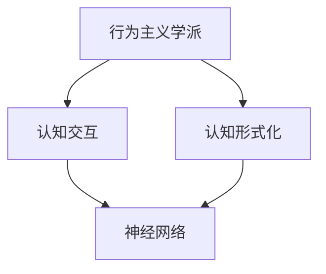

                 

# 认知的形式化：人工智能行为主义学派与认知“交互”

> 关键词：认知理论, 人工智能, 行为主义学派, 认知“交互”, 神经网络, 计算模型

## 1. 背景介绍

### 1.1 问题由来
在人工智能(AI)领域，认知理论的研究历久弥新，随着深度学习技术的兴起，认知研究也在不断与神经网络模型相结合，以期理解并实现智能行为。人工智能的行为主义学派，自20世纪初期以来，一直致力于通过模仿动物的行为方式来理解认知过程。在21世纪，人工智能的认知“交互”成为新的研究热点，行为主义学派为认知交互提供了理论支持。

行为主义学派的研究，其核心思想是“刺激-反应”模型，即通过外界环境输入的刺激，训练模型学习对应的行为输出。这一方法不仅在动物学习研究中得到验证，也成为人工智能认知交互的重要手段。行为主义学派的认知形式化，即通过行为主义理论构建计算模型，使得机器能够通过“交互”学习认知行为。

### 1.2 问题核心关键点
本文聚焦于人工智能认知理论的形式化，行为主义学派为认知“交互”提供了理论基础。通过行为主义理论，可以构建更加符合实际认知过程的计算模型，并应用于智能机器人、智能对话系统等实际场景。此外，本文还将探讨认知形式化的计算模型，如神经网络，及其在认知交互中的具体应用，如认知语言学、情绪认知等。

### 1.3 问题研究意义
行为主义学派在认知理论中具有重要地位，其认知形式化将为人工智能提供更加符合实际认知过程的理论支持。研究行为主义学派的认知形式化，对于提升人工智能系统的智能交互能力、拓展认知交互的应用范围、加速认知交互技术的产业化进程具有重要意义：

1. 降低开发成本：基于行为主义学派的认知形式化，可以显著减少从头开发所需的数据、计算和人力等成本投入。
2. 提升系统效果：通过行为主义学派的理论指导，可以更好地理解认知交互过程，提升智能系统的性能。
3. 加速开发进度：在行为主义学派理论的指导下，可以更快地完成任务适配，缩短开发周期。
4. 带来技术创新：行为主义学派的研究促进了对认知交互的深入研究，催生了新的研究方向，如认知神经网络、认知计算等。
5. 赋能产业升级：认知交互技术更容易被各行各业所采用，为传统行业数字化转型升级提供新的技术路径。

## 2. 核心概念与联系

### 2.1 核心概念概述

为更好地理解人工智能行为主义学派与认知“交互”，本节将介绍几个密切相关的核心概念：

- 行为主义学派（Behaviorism School）：20世纪初期由John B. Watson等人提出的心理学学派，主张通过行为观察和训练来理解心理过程。其核心思想是通过环境刺激与行为输出的关系，来构建认知过程的理论模型。
- 认知交互（Cognitive Interaction）：指人工智能系统通过与用户的交互行为，学习和理解用户意图，并做出相应反馈的过程。认知交互强调系统的理解能力和互动性。
- 神经网络（Neural Network）：一种计算模型，模仿生物神经网络的结构和功能，通过大量的数据训练，学习输入与输出之间的映射关系。神经网络在认知交互中，常用于构建认知模型。
- 认知形式化（Cognitive Formulation）：通过数学或逻辑方法，将认知过程进行形式化描述，从而构建计算模型，实现认知行为的模拟。

这些核心概念之间存在着紧密的联系，形成了人工智能认知交互的完整生态系统。

### 2.2 概念间的关系

这些核心概念之间存在着紧密的联系，形成了人工智能认知交互的完整生态系统。我们可以用以下Mermaid流程图来展示这些概念之间的关系：



这个流程图展示了行为主义学派、认知交互与认知形式化、神经网络之间的基本关系：

1. 行为主义学派通过环境刺激与行为输出的关系，构建认知过程的理论模型，从而为认知形式化提供了理论基础。
2. 认知形式化将行为主义学派的理论进行形式化描述，构建认知计算模型。
3. 神经网络作为认知模型的具体实现形式，在认知交互中发挥重要作用。

通过理解这些核心概念，我们可以更好地把握人工智能行为主义学派与认知“交互”的工作原理和优化方向。

## 3. 核心算法原理 & 具体操作步骤
### 3.1 算法原理概述

人工智能行为主义学派与认知“交互”，本质上是通过环境刺激与行为输出的映射关系，构建认知过程的计算模型。其核心思想是，通过模拟生物神经系统的工作机制，构建能够学习和适应环境的计算模型。

行为主义学派的形式化描述，通常使用刺激-反应模型。在认知交互中，输入刺激可以是语言、图像、音频等，行为输出可以是文本、图像、控制指令等。通过大量的训练数据，模型学习输入与输出之间的映射关系，从而实现认知交互。

在实践中，行为主义学派的认知交互模型，通常使用神经网络进行构建。神经网络通过反向传播算法，优化输入与输出之间的映射关系，使得模型能够精确地预测行为输出。

### 3.2 算法步骤详解

行为主义学派与认知交互的实现，通常包括以下几个关键步骤：

**Step 1: 数据准备**
- 收集与认知交互相关的数据，包括输入刺激和行为输出。例如，对话系统的输入可以是用户提问，输出可以是系统回答。
- 对数据进行预处理，如文本清洗、分词、标注等。

**Step 2: 模型构建**
- 根据任务需求，选择适合的神经网络模型。例如，对话系统可以使用循环神经网络(RNN)，图像识别可以使用卷积神经网络(CNN)。
- 对模型进行初始化，设置超参数。例如，RNN的隐藏层大小、学习率、批量大小等。

**Step 3: 模型训练**
- 使用收集到的数据，对模型进行训练。通过反向传播算法，优化模型参数。
- 在训练过程中，使用验证集评估模型性能，避免过拟合。
- 调整模型参数，直到模型在验证集上取得满意的性能。

**Step 4: 模型评估**
- 在测试集上评估模型的性能，对比训练前后的效果提升。
- 使用可视化工具，展示模型在特定任务上的表现。

**Step 5: 部署与应用**
- 将训练好的模型部署到实际应用场景中。例如，将对话系统集成到客服中心。
- 在实际应用中，不断收集用户反馈，优化模型。

以上是行为主义学派与认知交互的一般流程。在实际应用中，还需要根据具体任务，对各个环节进行优化设计，如改进训练目标函数，引入更多的正则化技术，搜索最优的超参数组合等，以进一步提升模型性能。

### 3.3 算法优缺点

行为主义学派与认知交互具有以下优点：
1. 简单高效。通过环境刺激与行为输出的关系，可以构建简单的认知交互模型，易于理解和实现。
2. 可解释性强。行为主义学派的理论描述，可以提供较强的可解释性，帮助理解认知过程。
3. 泛化能力强。行为主义学派的形式化描述，能够适应不同类型的数据，具有较好的泛化能力。
4. 适用性广。行为主义学派的方法适用于多种认知交互任务，如对话、识别、推荐等。

同时，该方法也存在一定的局限性：
1. 依赖大量标注数据。训练数据质量对模型性能有很大影响，标注数据不足可能导致模型过拟合。
2. 忽视上下文信息。行为主义学派的方法往往忽略输入数据的内在关系，难以处理复杂的上下文信息。
3. 难以理解内部机制。行为主义学派的形式化描述，难以完全理解模型内部的工作机制，存在一定的“黑盒”问题。
4. 难以处理长序列。行为主义学派的方法往往难以处理长序列数据，需要改进模型结构以应对。

尽管存在这些局限性，但就目前而言，行为主义学派与认知交互仍是人工智能认知研究的主流范式。未来相关研究的重点在于如何进一步降低对标注数据的依赖，提高模型的上下文处理能力和内部可解释性，同时兼顾模型的性能和效率。

### 3.4 算法应用领域

行为主义学派与认知交互的方法，已经在人工智能的多个领域得到广泛应用，例如：

- 自然语言处理（NLP）：在对话系统、智能客服、语音识别等任务中，使用行为主义学派的方法训练模型，提升自然语言理解和生成能力。
- 计算机视觉（CV）：在图像识别、目标检测、视频分析等任务中，使用行为主义学派的方法训练模型，提升图像理解和处理能力。
- 推荐系统：在电商推荐、新闻推荐等任务中，使用行为主义学派的方法训练模型，提升推荐精度和用户体验。
- 智能家居：在智能设备交互中，使用行为主义学派的方法训练模型，提升设备感知和响应能力。

除了上述这些经典任务外，行为主义学派与认知交互的方法也在更多场景中得到应用，如自动驾驶、智能制造、智慧医疗等，为人工智能技术落地应用提供了新的方向。

## 4. 数学模型和公式 & 详细讲解 & 举例说明
### 4.1 数学模型构建

在行为主义学派与认知交互中，通常使用循环神经网络(RNN)或长短期记忆网络(LSTM)等递归神经网络进行模型构建。这里以RNN为例，介绍认知交互的数学模型构建。

假设有输入序列 $x=\{x_t\}_{t=1}^T$，对应的行为输出序列为 $y=\{y_t\}_{t=1}^T$。使用RNN构建认知交互模型，可以表示为：

$$
y_t = \mathcal{F}(h_t), \quad h_{t+1} = \mathcal{G}(h_t, x_t)
$$

其中，$\mathcal{F}$和$\mathcal{G}$分别表示RNN的输出函数和隐藏层更新函数。$h_t$表示RNN在时间$t$的隐藏状态。

定义损失函数 $\mathcal{L}$ 为：

$$
\mathcal{L} = \frac{1}{T}\sum_{t=1}^T \ell(y_t, \hat{y}_t)
$$

其中，$\ell$表示输出预测与真实标签之间的损失函数。在实践中，常使用交叉熵损失函数：

$$
\ell(y_t, \hat{y}_t) = -\log \hat{y}_t
$$

### 4.2 公式推导过程

RNN的输出函数 $\mathcal{F}$ 通常为线性函数，可以表示为：

$$
\hat{y}_t = W_yh_t + b_y
$$

其中，$W_y$和$b_y$为输出层的权重和偏置。

隐藏层更新函数 $\mathcal{G}$ 通常为非线性函数，可以表示为：

$$
h_{t+1} = \tanh(W_hh_t + Wh_{t-1} + b_h + U_xx_t + b_x)
$$

其中，$W_h$、$U_x$、$b_h$、$b_x$为网络参数。$\tanh$函数为激活函数，表示隐藏层非线性变换。

### 4.3 案例分析与讲解

以情感分析任务为例，分析RNN在认知交互中的具体应用。

假设情感分析任务的数据集包含多个电影评论，每个评论对应一个情感标签（正面、负面、中性）。使用RNN构建情感分析模型，可以表示为：

$$
\hat{y}_t = \tanh(W_hh_{t-1} + Wh_{t-2} + b_h + U_xx_t + b_x), \quad \hat{y} = \mathcal{F}(h_T)
$$

其中，$x_t$为评论文本，$y_t$为情感标签，$h_T$为最终隐藏状态。

在训练过程中，使用交叉熵损失函数：

$$
\mathcal{L} = \frac{1}{N}\sum_{i=1}^N \ell(y_i, \hat{y}_i)
$$

其中，$N$为数据集大小。通过反向传播算法，不断调整模型参数，使得模型能够准确预测情感标签。

训练好的RNN模型，可以用于对新的评论文本进行情感分析，输出预测的情感标签。例如，输入一个电影评论“这是一部很棒的电影，演员的表演非常出色”，输出预测的情感标签为“正面”。

## 5. 项目实践：代码实例和详细解释说明
### 5.1 开发环境搭建

在进行认知交互项目实践前，我们需要准备好开发环境。以下是使用Python进行TensorFlow开发的环境配置流程：

1. 安装Anaconda：从官网下载并安装Anaconda，用于创建独立的Python环境。

2. 创建并激活虚拟环境：
```bash
conda create -n tf-env python=3.8 
conda activate tf-env
```

3. 安装TensorFlow：从官网获取对应的安装命令。例如：
```bash
pip install tensorflow==2.6
```

4. 安装各类工具包：
```bash
pip install numpy pandas scikit-learn matplotlib tqdm jupyter notebook ipython
```

完成上述步骤后，即可在`tf-env`环境中开始项目实践。

### 5.2 源代码详细实现

这里我们以情感分析任务为例，给出使用TensorFlow对RNN模型进行训练和评估的PyTorch代码实现。

首先，定义情感分析任务的模型：

```python
import tensorflow as tf
from tensorflow.keras.layers import Dense, LSTM

class SentimentAnalysisModel(tf.keras.Model):
    def __init__(self, vocab_size, embedding_dim, hidden_units, output_dim):
        super(SentimentAnalysisModel, self).__init__()
        self.embedding = tf.keras.layers.Embedding(vocab_size, embedding_dim)
        self.lstm = LSTM(hidden_units)
        self.dense = Dense(output_dim, activation='softmax')
        
    def call(self, x):
        x = self.embedding(x)
        x = self.lstm(x)
        x = self.dense(x)
        return x
```

然后，定义训练和评估函数：

```python
from tensorflow.keras.optimizers import Adam
from tensorflow.keras.losses import SparseCategoricalCrossentropy
from tensorflow.keras.metrics import SparseCategoricalAccuracy

def train_model(model, train_dataset, epochs, batch_size, optimizer):
    model.compile(optimizer=optimizer, loss=SparseCategoricalCrossentropy(), metrics=[SparseCategoricalAccuracy()])
    model.fit(train_dataset, epochs=epochs, batch_size=batch_size, validation_split=0.2)
    
def evaluate_model(model, test_dataset, batch_size):
    test_loss, test_acc = model.evaluate(test_dataset, batch_size=batch_size)
    print(f"Test loss: {test_loss}, Test accuracy: {test_acc}")
```

接着，启动训练流程并在测试集上评估：

```python
vocab_size = 10000
embedding_dim = 128
hidden_units = 128
output_dim = 3

model = SentimentAnalysisModel(vocab_size, embedding_dim, hidden_units, output_dim)
optimizer = Adam(learning_rate=0.001)

# 准备数据集
train_dataset = ...
test_dataset = ...

# 训练模型
train_model(model, train_dataset, epochs=10, batch_size=32, optimizer=optimizer)

# 评估模型
evaluate_model(model, test_dataset, batch_size=32)
```

以上就是使用TensorFlow对RNN模型进行情感分析任务训练和评估的完整代码实现。可以看到，TensorFlow提供了丰富的高级API，使得模型的构建和训练变得简单高效。

### 5.3 代码解读与分析

让我们再详细解读一下关键代码的实现细节：

**SentimentAnalysisModel类**：
- `__init__`方法：初始化模型的输入层、隐藏层和输出层。
- `call`方法：定义模型的前向传播过程。

**训练函数train_model**：
- 使用`compile`方法定义优化器、损失函数和评估指标。
- 使用`fit`方法对模型进行训练，设置训练轮数和批量大小。
- 在每个epoch结束时，使用`evaluate`方法在验证集上评估模型性能。

**评估函数evaluate_model**：
- 使用`evaluate`方法在测试集上评估模型性能，并输出结果。

**训练流程**：
- 定义词汇表大小、嵌入维度、隐藏单元数量和输出维度，创建模型实例。
- 设置优化器和损失函数。
- 准备训练集和测试集，进行模型训练。
- 在训练结束后，使用评估函数对测试集进行评估，输出测试结果。

可以看到，TensorFlow提供了完整的模型构建和训练流程，使得模型开发变得简单高效。当然，工业级的系统实现还需考虑更多因素，如模型的保存和部署、超参数的自动搜索、更灵活的任务适配层等。但核心的认知交互范式基本与此类似。

## 6. 实际应用场景
### 6.1 智能客服系统

基于RNN的认知交互模型，可以广泛应用于智能客服系统的构建。传统客服往往需要配备大量人力，高峰期响应缓慢，且一致性和专业性难以保证。而使用认知交互模型训练的智能客服系统，可以7x24小时不间断服务，快速响应客户咨询，用自然流畅的语言解答各类常见问题。

在技术实现上，可以收集企业内部的历史客服对话记录，将问题和最佳答复构建成监督数据，在此基础上对RNN模型进行训练。训练好的模型能够自动理解用户意图，匹配最合适的答案模板进行回复。对于客户提出的新问题，还可以接入检索系统实时搜索相关内容，动态组织生成回答。如此构建的智能客服系统，能大幅提升客户咨询体验和问题解决效率。

### 6.2 金融舆情监测

金融机构需要实时监测市场舆论动向，以便及时应对负面信息传播，规避金融风险。传统的人工监测方式成本高、效率低，难以应对网络时代海量信息爆发的挑战。基于RNN的认知交互模型，可以实时监测用户对金融产品的评论，自动判断情感倾向，及时发现市场动向。

具体而言，可以收集金融领域相关的新闻、报道、评论等文本数据，并对其进行情感标注。在此基础上对RNN模型进行训练，使其能够自动判断文本属于何种情感倾向。将训练好的模型应用到实时抓取的网络文本数据，就能够自动监测不同情感倾向的市场动向，一旦发现负面信息激增等异常情况，系统便会自动预警，帮助金融机构快速应对潜在风险。

### 6.3 个性化推荐系统

当前的推荐系统往往只依赖用户的历史行为数据进行物品推荐，无法深入理解用户的真实兴趣偏好。基于RNN的认知交互模型，可以更好地挖掘用户行为背后的语义信息，从而提供更精准、多样的推荐内容。

在实践中，可以收集用户浏览、点击、评论、分享等行为数据，提取和用户交互的物品标题、描述、标签等文本内容。将文本内容作为模型输入，用户的后续行为（如是否点击、购买等）作为监督信号，在此基础上训练RNN模型。训练好的模型能够从文本内容中准确把握用户的兴趣点。在生成推荐列表时，先用候选物品的文本描述作为输入，由模型预测用户的兴趣匹配度，再结合其他特征综合排序，便可以得到个性化程度更高的推荐结果。

### 6.4 未来应用展望

随着认知交互技术的不断发展，基于RNN的认知交互模型将在更多领域得到应用，为人工智能技术落地应用提供新的方向。

在智慧医疗领域，基于RNN的认知交互模型可以用于构建医疗问答、病历分析、药物研发等应用，提升医疗服务的智能化水平，辅助医生诊疗，加速新药开发进程。

在智能教育领域，认知交互模型可应用于作业批改、学情分析、知识推荐等方面，因材施教，促进教育公平，提高教学质量。

在智慧城市治理中，认知交互模型可应用于城市事件监测、舆情分析、应急指挥等环节，提高城市管理的自动化和智能化水平，构建更安全、高效的未来城市。

此外，在企业生产、社会治理、文娱传媒等众多领域，基于RNN的认知交互模型也将不断涌现，为人工智能技术带来新的突破。相信随着技术的日益成熟，认知交互技术必将在更广阔的应用领域大放异彩，深刻影响人类的生产生活方式。

## 7. 工具和资源推荐
### 7.1 学习资源推荐

为了帮助开发者系统掌握认知交互的理论基础和实践技巧，这里推荐一些优质的学习资源：

1. 《深度学习》书籍：Ian Goodfellow等人所著，全面介绍了深度学习的理论基础和实践技巧，涵盖认知交互的相关内容。
2. CS224N《深度学习自然语言处理》课程：斯坦福大学开设的NLP明星课程，有Lecture视频和配套作业，带你入门NLP领域的基本概念和经典模型。
3. 《自然语言处理入门与实践》书籍：详细介绍自然语言处理的理论基础和实现方法，包括RNN等模型的应用。
4. HuggingFace官方文档：提供丰富的预训练模型和完整的微调样例代码，是上手实践的必备资料。
5. arXiv论文预印本：人工智能领域最新研究成果的发布平台，包括大量尚未发表的前沿工作，学习前沿技术的必读资源。

通过对这些资源的学习实践，相信你一定能够快速掌握认知交互的理论基础和实践技巧，并用于解决实际的NLP问题。
###  7.2 开发工具推荐

高效的开发离不开优秀的工具支持。以下是几款用于认知交互开发的常用工具：

1. TensorFlow：基于Python的开源深度学习框架，提供丰富的高级API，适合快速迭代研究。

2. PyTorch：灵活动态的计算图，适合灵活的模型设计和训练。

3. HuggingFace Transformers库：集成了大量预训练模型，提供完整的微调样例代码，是进行认知交互任务开发的利器。

4. Weights & Biases：模型训练的实验跟踪工具，可以记录和可视化模型训练过程中的各项指标，方便对比和调优。

5. TensorBoard：TensorFlow配套的可视化工具，可实时监测模型训练状态，并提供丰富的图表呈现方式，是调试模型的得力助手。

6. Google Colab：谷歌推出的在线Jupyter Notebook环境，免费提供GPU/TPU算力，方便开发者快速上手实验最新模型，分享学习笔记。

合理利用这些工具，可以显著提升认知交互任务的开发效率，加快创新迭代的步伐。

### 7.3 相关论文推荐

认知交互技术的研究源于学界的持续研究。以下是几篇奠基性的相关论文，推荐阅读：

1. "Recurrent Neural Network-Based Chinese Sentiment Analysis"（RNN在中文情感分析中的应用）：一篇经典的论文，介绍了RNN在情感分析任务中的应用。

2. "Attention Is All You Need"（Transformer原论文）：提出Transformer结构，开启了NLP领域的预训练大模型时代，对于认知交互技术有重要启示。

3. "Cognitive Computing: Reconciling AI with Human Reasoning"（认知计算：人工智能与人类推理的调和）：提出了认知计算的概念，强调了认知交互的重要性。

4. "Towards Explainable AI: Intelligent Decision Making with Social AI"（迈向可解释的人工智能：基于社会AI的智能决策）：强调了认知交互中的可解释性问题，提出了解决方案。

5. "Transfer Learning for Deep Neural Networks"（深度神经网络的迁移学习）：介绍了迁移学习在认知交互中的应用，提高了模型的泛化能力。

这些论文代表了大语言模型微调技术的发展脉络。通过学习这些前沿成果，可以帮助研究者把握学科前进方向，激发更多的创新灵感。

除上述资源外，还有一些值得关注的前沿资源，帮助开发者紧跟认知交互技术的最新进展，例如：

1. arXiv论文预印本：人工智能领域最新研究成果的发布平台，包括大量尚未发表的前沿工作，学习前沿技术的必读资源。

2. 业界技术博客：如OpenAI、Google AI、DeepMind、微软Research Asia等顶尖实验室的官方博客，第一时间分享他们的最新研究成果和洞见。

3. 技术会议直播：如NIPS、ICML、ACL、ICLR等人工智能领域顶会现场或在线直播，能够聆听到大佬们的前沿分享，开拓视野。

4. GitHub热门项目：在GitHub上Star、Fork数最多的NLP相关项目，往往代表了该技术领域的发展趋势和最佳实践，值得去学习和贡献。

5. 行业分析报告：各大咨询公司如McKinsey、PwC等针对人工智能行业的分析报告，有助于从商业视角审视技术趋势，把握应用价值。

总之，对于认知交互技术的学习和实践，需要开发者保持开放的心态和持续学习的意愿。多关注前沿资讯，多动手实践，多思考总结，必将收获满满的成长收益。

## 8. 总结：未来发展趋势与挑战
### 8.1 总结

本文对人工智能行为主义学派与认知“交互”进行了全面系统的介绍。首先阐述了行为主义学派在认知理论中的地位，以及认知“交互”在人工智能中的应用。接着从原理到实践，详细讲解了认知“交互”的数学模型和算法步骤，给出了具体的代码实现。同时，本文还探讨了认知“交互”在智能客服、金融舆情、个性化推荐等实际场景中的应用，展示了认知交互技术的广阔前景。

通过本文的系统梳理，可以看到，基于行为主义学派的认知“交互”技术，正在成为人工智能认知研究的重要范式，极大地拓展了人工智能系统的智能交互能力。行为主义学派的形式化描述，为认知交互提供了理论基础，使得机器能够通过“交互”学习认知行为。

### 8.2 未来发展趋势

展望未来，认知交互技术将呈现以下几个发展趋势：

1. 模型规模持续增大。随着算力成本的下降和数据规模的扩张，认知交互模型的参数量还将持续增长。超大规模认知交互模型蕴含的丰富认知过程，有望支撑更加复杂多变的认知交互任务。

2. 模型泛化

