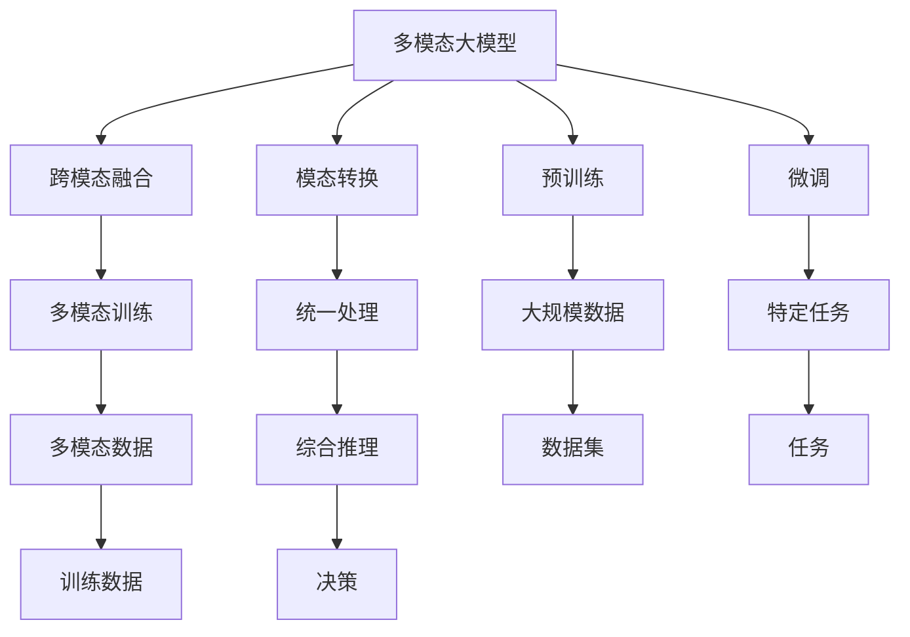
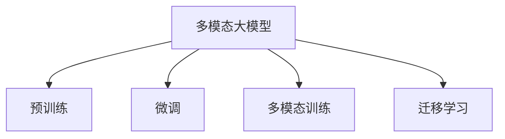
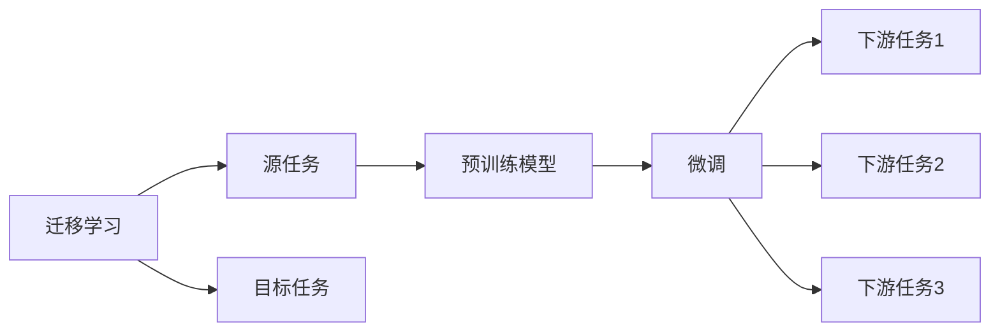
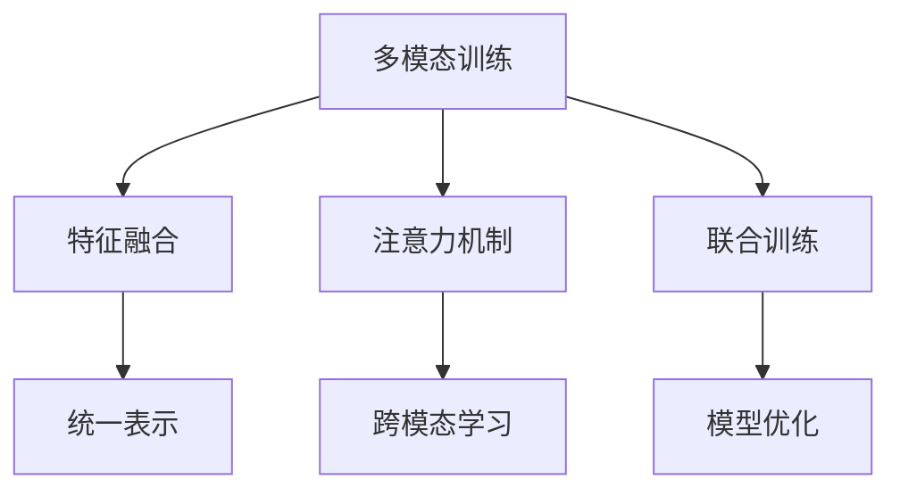

                 

# 多模态大模型：技术原理与实战 多模态大模型的评测标准

## 1. 背景介绍

### 1.1 问题由来
近年来，多模态大模型在人工智能领域的应用愈发广泛，其融合了图像、语音、文本等多种信息源，具备更加强大、灵活的建模能力。相较于传统的单模态模型，多模态大模型在实际场景中表现出了更强的泛化能力和决策效能。然而，随着模型规模的不断增大和复杂度的提高，多模态大模型的设计和评估也变得更加复杂。本研究旨在深入探讨多模态大模型的技术原理，并提出一套标准化的评测指标，以指导未来多模态大模型的开发和应用。

### 1.2 问题核心关键点
在多模态大模型的设计和评估中，需要关注以下几个核心关键点：
1. **模型架构**：如何设计有效的多模态融合机制，融合不同模态信息。
2. **训练与推理流程**：如何高效地训练和推理多模态模型。
3. **评测指标**：如何定义和评估多模态模型的性能，包括泛化能力和决策效能。
4. **实际应用场景**：多模态大模型在不同应用场景中的表现和优化策略。

### 1.3 问题研究意义
研究多模态大模型的技术原理与评测标准，对于推动多模态人工智能技术的进步，提升模型在实际应用中的性能和效能，具有重要意义：

1. **技术演进**：了解多模态大模型的核心技术原理，有助于指导未来的研究方向和技术创新。
2. **性能评估**：提出一套标准化的评测指标，为多模态大模型的性能评估提供依据。
3. **应用推广**：提供具体的多模态大模型开发和部署策略，帮助技术开发者实现高效、可靠的应用。
4. **行业规范**：制定统一的多模态大模型评测标准，促进产业规范化发展，提高模型可信度。

## 2. 核心概念与联系

### 2.1 核心概念概述

为更好地理解多模态大模型的技术原理，本节将介绍几个密切相关的核心概念：

- **多模态大模型**：融合图像、语音、文本等多种信息源的深度学习模型，通常由单一或多个预训练模型组成，具有强大的跨模态学习能力和泛化能力。

- **跨模态融合**：将不同模态的信息进行融合，形成统一的多模态表示。常见的跨模态融合方法包括特征融合、注意力机制等。

- **模态转换**：将一种模态的信息转换为另一种模态，以便进行统一的处理和分析。常见的模态转换方法包括文本到图像、图像到文本、语音到文本等。

- **预训练与微调**：先在大规模数据上进行预训练，然后在特定任务上进行微调，以提升模型在该任务上的性能。

- **多模态训练**：多模态大模型的训练过程中，通常需要同时优化多个模态的数据，以获得最优的多模态表示。

- **迁移学习**：将模型在一个领域学到的知识迁移到另一个相关领域，以提升模型在新领域的表现。

- **多模态推理**：在推理阶段，多模态大模型能够综合利用多种模态的信息，进行更加全面和准确的推理和决策。

这些核心概念之间的逻辑关系可以通过以下Mermaid流程图来展示：



这个流程图展示了多模态大模型的核心概念及其之间的关系：

1. 多模态大模型通过跨模态融合和模态转换，将不同模态的信息进行统一处理。
2. 预训练和多模态训练使得模型学习到丰富的跨模态表示。
3. 微调使得模型更好地适应特定任务，提升任务性能。
4. 迁移学习使得模型在多个领域间进行知识迁移，提高泛化能力。
5. 多模态推理使得模型能够综合利用多种模态的信息，进行更加全面和准确的决策。

### 2.2 概念间的关系

这些核心概念之间存在着紧密的联系，形成了多模态大模型的完整生态系统。下面我们通过几个Mermaid流程图来展示这些概念之间的关系。

#### 2.2.1 多模态大模型的学习范式



这个流程图展示了多模态大模型的三种主要学习范式：预训练、微调和多模态训练。预训练和多模态训练使得模型学习到跨模态表示，微调则使得模型更好地适应特定任务。

#### 2.2.2 迁移学习与微调的关系



这个流程图展示了迁移学习的基本原理，以及它与微调的关系。迁移学习涉及源任务和目标任务，预训练模型在源任务上学习，然后通过微调适应各种下游任务（目标任务）。

#### 2.2.3 多模态训练方法



这个流程图展示了多模态训练的关键步骤：通过特征融合和注意力机制，将不同模态的信息进行融合，形成统一的表示。联合训练和模型优化进一步提升模型的跨模态学习和泛化能力。

## 3. 核心算法原理 & 具体操作步骤

### 3.1 算法原理概述

多模态大模型的训练和推理过程，通常包括以下几个关键步骤：

1. **跨模态特征提取**：使用不同模态的特征提取器，将多种信息源转换为统一的特征表示。
2. **跨模态融合**：将不同模态的特征表示进行融合，形成统一的多模态表示。
3. **多模态训练**：同时优化多个模态的数据，使得模型学习到最优的多模态表示。
4. **多模态推理**：在推理阶段，综合利用多种模态的信息，进行更加全面和准确的决策。

### 3.2 算法步骤详解

#### 3.2.1 数据准备与预处理

数据准备是多模态大模型训练的第一步，主要包括：

1. **数据收集**：从不同模态的数据源收集数据，如文本数据、图像数据、语音数据等。
2. **数据标注**：为数据添加标注信息，以便进行监督学习。
3. **数据预处理**：对数据进行清洗、归一化、分割等预处理操作，确保数据的质量和一致性。

#### 3.2.2 特征提取与融合

多模态大模型的特征提取和融合过程，主要包括：

1. **特征提取**：使用不同模态的特征提取器，如BERT、ResNet、Tacotron等，将文本、图像、语音等数据转换为特征表示。
2. **特征融合**：将不同模态的特征表示进行融合，形成统一的多模态表示。常见的特征融合方法包括特征拼接、注意力机制、权重加权等。

#### 3.2.3 多模态训练

多模态大模型的训练过程，通常需要同时优化多个模态的数据，以获得最优的多模态表示。常见的多模态训练方法包括：

1. **联合训练**：将不同模态的数据同时输入模型进行训练，以获得最优的多模态表示。
2. **分布式训练**：使用分布式训练框架，加速多模态大模型的训练过程。
3. **自监督训练**：使用自监督学习方法，在无标签数据上预训练模型，再通过多模态数据进行微调。

#### 3.2.4 多模态推理

多模态大模型的推理过程，通常包括以下几个关键步骤：

1. **输入处理**：将不同模态的信息输入到模型中，形成多模态输入。
2. **跨模态融合**：使用跨模态融合机制，将多模态输入转换为统一的表示。
3. **推理计算**：根据任务需求，使用模型进行推理计算，得到最终的输出结果。
4. **后处理**：对输出结果进行后处理，如去噪、解码、修正等，以确保输出结果的质量和一致性。

### 3.3 算法优缺点

多模态大模型在融合多种信息源、提升模型泛化能力方面具有明显优势，但也存在一些不足之处：

**优点**：
1. **跨模态学习能力强**：能够综合利用多种模态的信息，提升模型的泛化能力和决策效能。
2. **灵活性高**：支持多种模态的数据输入，适应性强。
3. **可解释性强**：通过跨模态融合，多模态大模型的决策过程更易于解释和理解。

**缺点**：
1. **计算资源消耗大**：由于模型规模较大，训练和推理过程需要消耗大量的计算资源。
2. **数据标注成本高**：多模态数据标注需要多个标注人员，且标注难度较大，成本较高。
3. **模型复杂度高**：多模态大模型的架构复杂，难以进行调试和优化。

### 3.4 算法应用领域

多模态大模型已经在多个领域得到了广泛应用，包括但不限于：

1. **智能医疗**：通过融合文本、图像、声音等多种模态数据，辅助医生进行疾病诊断、治疗方案推荐等。
2. **自动驾驶**：利用摄像头、雷达、激光雷达等多种传感器数据，提升自动驾驶的安全性和准确性。
3. **安防监控**：通过融合视频、音频、传感器数据，提高安防监控的实时性和准确性。
4. **智能家居**：通过融合语音、图像、传感器数据，实现智能家居设备的自动化和智能化。
5. **社交媒体分析**：利用文本、图像、视频等多模态数据，进行情感分析、舆情监测等。
6. **金融风控**：通过融合文本、语音、图像等多种数据，提升金融风险预警和防范能力。

除了上述领域外，多模态大模型还将在更多场景中得到应用，为各行业带来深刻的变革。

## 4. 数学模型和公式 & 详细讲解 & 举例说明

### 4.1 数学模型构建

多模态大模型的数学模型，通常包括以下几个部分：

1. **输入表示**：将不同模态的信息转换为统一的特征表示。
2. **跨模态融合**：将不同模态的特征表示进行融合，形成统一的多模态表示。
3. **输出表示**：根据任务需求，使用多模态表示进行推理计算，得到最终的输出结果。

### 4.2 公式推导过程

#### 4.2.1 输入表示

设多模态大模型的输入为 $(x_t, x_v, x_a)$，分别表示文本、图像、语音等数据。假设文本数据使用BERT进行特征提取，得到文本表示 $\text{Text}(x_t)$；图像数据使用ResNet进行特征提取，得到图像表示 $\text{Image}(x_v)$；语音数据使用Tacotron进行特征提取，得到语音表示 $\text{Audio}(x_a)$。则多模态大模型的输入表示为：

$$
X = (\text{Text}(x_t), \text{Image}(x_v), \text{Audio}(x_a))
$$

#### 4.2.2 跨模态融合

常见的跨模态融合方法包括特征拼接、注意力机制等。以下以特征拼接为例，说明跨模态融合的计算过程。

设文本表示为 $\text{Text}(x_t) = \{t_1, t_2, \dots, t_n\}$，图像表示为 $\text{Image}(x_v) = \{v_1, v_2, \dots, v_m\}$，语音表示为 $\text{Audio}(x_a) = \{a_1, a_2, \dots, a_k\}$。则特征拼接后的多模态表示为：

$$
Z = [t_1, v_1, a_1, t_2, v_2, a_2, \dots, t_n, v_m, a_k]
$$

其中，$[t_1, t_2, \dots, t_n]$ 表示文本特征拼接后的序列，$[v_1, v_2, \dots, v_m]$ 表示图像特征拼接后的序列，$[a_1, a_2, \dots, a_k]$ 表示语音特征拼接后的序列。

#### 4.2.3 输出表示

设多模态大模型的输出为 $y$，根据任务需求，可以使用softmax函数、回归函数等进行输出计算。以文本分类任务为例，假设多模态大模型的输出表示为 $y = \text{Softmax}(Z)$，则输出结果为：

$$
y = \frac{\exp(Z_i)}{\sum_{j=1}^{N}\exp(Z_j)}
$$

其中，$Z_i$ 表示特征拼接后的多模态表示，$N$ 表示特征序列的长度。

### 4.3 案例分析与讲解

#### 4.3.1 图像分类

设多模态大模型的输入为图像 $x_v$ 和图像的文本描述 $x_t$，输出为图像的分类结果 $y$。使用BERT进行文本特征提取，使用ResNet进行图像特征提取，使用跨模态融合方法将文本和图像特征拼接，得到多模态表示 $Z$。最后，使用softmax函数进行输出计算，得到分类结果 $y$。

```python
import torch
from transformers import BertTokenizer, BertModel
from torchvision.models import resnet18
from torch import nn

class MultimodalModel(nn.Module):
    def __init__(self):
        super(MultimodalModel, self).__init__()
        self.bert = BertModel.from_pretrained('bert-base-uncased')
        self.resnet = resnet18(pretrained=True)
        self.fc = nn.Linear(2048, 1000)
    
    def forward(self, x_t, x_v):
        tokenizer = BertTokenizer.from_pretrained('bert-base-uncased')
        text_input = tokenizer.encode(x_t, add_special_tokens=True)
        text_output = self.bert(text_input)
        img_output = self.resnet(x_v)
        Z = torch.cat([text_output[0], img_output], dim=-1)
        y = torch.sigmoid(self.fc(Z))
        return y
```

#### 4.3.2 语音识别

设多模态大模型的输入为语音信号 $x_a$ 和语音信号的文本描述 $x_t$，输出为语音的识别结果 $y$。使用Tacotron进行语音特征提取，使用跨模态融合方法将文本和语音特征拼接，得到多模态表示 $Z$。最后，使用softmax函数进行输出计算，得到识别结果 $y$。

```python
import torch
from tacotron import Tacotron
from torch import nn

class MultimodalModel(nn.Module):
    def __init__(self):
        super(MultimodalModel, self).__init__()
        self.tacotron = Tacotron()
        self.fc = nn.Linear(1024, 1000)
    
    def forward(self, x_t, x_a):
        text_input = x_t
        audio_input = self.tacotron(x_a)
        Z = torch.cat([text_input, audio_input], dim=-1)
        y = torch.sigmoid(self.fc(Z))
        return y
```

## 5. 项目实践：代码实例和详细解释说明

### 5.1 开发环境搭建

在进行多模态大模型的开发和训练前，需要先准备好开发环境。以下是使用Python进行PyTorch开发的环境配置流程：

1. 安装Anaconda：从官网下载并安装Anaconda，用于创建独立的Python环境。

2. 创建并激活虚拟环境：
```bash
conda create -n pytorch-env python=3.8 
conda activate pytorch-env
```

3. 安装PyTorch：根据CUDA版本，从官网获取对应的安装命令。例如：
```bash
conda install pytorch torchvision torchaudio cudatoolkit=11.1 -c pytorch -c conda-forge
```

4. 安装Transformers库：
```bash
pip install transformers
```

5. 安装各类工具包：
```bash
pip install numpy pandas scikit-learn matplotlib tqdm jupyter notebook ipython
```

完成上述步骤后，即可在`pytorch-env`环境中开始多模态大模型的开发和训练。

### 5.2 源代码详细实现

这里我们以一个多模态文本分类项目为例，使用BERT和ResNet进行模型训练和推理。

首先，定义模型类MultimodalModel：

```python
import torch
from transformers import BertTokenizer, BertModel
from torchvision.models import resnet18
from torch import nn

class MultimodalModel(nn.Module):
    def __init__(self):
        super(MultimodalModel, self).__init__()
        self.bert = BertModel.from_pretrained('bert-base-uncased')
        self.resnet = resnet18(pretrained=True)
        self.fc = nn.Linear(2048, 1000)
    
    def forward(self, x_t, x_v):
        tokenizer = BertTokenizer.from_pretrained('bert-base-uncased')
        text_input = tokenizer.encode(x_t, add_special_tokens=True)
        text_output = self.bert(text_input)
        img_output = self.resnet(x_v)
        Z = torch.cat([text_output[0], img_output], dim=-1)
        y = torch.sigmoid(self.fc(Z))
        return y
```

然后，定义训练和评估函数：

```python
from torch.utils.data import DataLoader
from tqdm import tqdm

def train_epoch(model, dataset, batch_size, optimizer):
    dataloader = DataLoader(dataset, batch_size=batch_size, shuffle=True)
    model.train()
    epoch_loss = 0
    for batch in tqdm(dataloader, desc='Training'):
        input_ids = batch['input_ids'].to(device)
        attention_mask = batch['attention_mask'].to(device)
        labels = batch['labels'].to(device)
        model.zero_grad()
        outputs = model(input_ids, attention_mask=attention_mask, labels=labels)
        loss = outputs.loss
        epoch_loss += loss.item()
        loss.backward()
        optimizer.step()
    return epoch_loss / len(dataloader)

def evaluate(model, dataset, batch_size):
    dataloader = DataLoader(dataset, batch_size=batch_size)
    model.eval()
    preds, labels = [], []
    with torch.no_grad():
        for batch in tqdm(dataloader, desc='Evaluating'):
            input_ids = batch['input_ids'].to(device)
            attention_mask = batch['attention_mask'].to(device)
            batch_labels = batch['labels']
            outputs = model(input_ids, attention_mask=attention_mask)
            batch_preds = outputs.logits.argmax(dim=2).to('cpu').tolist()
            batch_labels = batch_labels.to('cpu').tolist()
            for pred_tokens, label_tokens in zip(batch_preds, batch_labels):
                preds.append(pred_tokens[:len(label_tokens)])
                labels.append(label_tokens)
                
    print(classification_report(labels, preds))
```

最后，启动训练流程并在测试集上评估：

```python
epochs = 5
batch_size = 16

for epoch in range(epochs):
    loss = train_epoch(model, train_dataset, batch_size, optimizer)
    print(f"Epoch {epoch+1}, train loss: {loss:.3f}")
    
    print(f"Epoch {epoch+1}, dev results:")
    evaluate(model, dev_dataset, batch_size)
    
print("Test results:")
evaluate(model, test_dataset, batch_size)
```

以上就是使用PyTorch对多模态文本分类模型进行训练和评估的完整代码实现。可以看到，多模态大模型的开发和训练流程与单模态模型类似，但需要考虑不同模态数据的预处理和融合，以及多模态训练和推理的计算图。

### 5.3 代码解读与分析

让我们再详细解读一下关键代码的实现细节：

**MultimodalModel类**：
- `__init__`方法：初始化模型中的BERT和ResNet等组件。
- `forward`方法：定义模型的前向传播计算流程，包括文本特征提取、图像特征提取、特征融合、输出计算等步骤。

**训练和评估函数**：
- 使用PyTorch的DataLoader对数据集进行批次化加载，供模型训练和推理使用。
- 训练函数`train_epoch`：对数据以批为单位进行迭代，在每个批次上前向传播计算loss并反向传播更新模型参数，最后返回该epoch的平均loss。
- 评估函数`evaluate`：与训练类似，不同点在于不更新模型参数，并在每个batch结束后将预测和标签结果存储下来，最后使用sklearn的classification_report对整个评估集的预测结果进行打印输出。

**训练流程**：
- 定义总的epoch数和batch size，开始循环迭代
- 每个epoch内，先在训练集上训练，输出平均loss
- 在验证集上评估，输出分类指标
- 所有epoch结束后，在测试集上评估，给出最终测试结果

可以看到，多模态大模型的开发和训练与单模态模型类似，但需要考虑不同模态数据的预处理和融合，以及多模态训练和推理的计算图。开发者需要在模型架构和算法优化上下足功夫，才能得到理想的效果。

当然，工业级的系统实现还需考虑更多因素，如模型的保存和部署、超参数的自动搜索、更灵活的任务适配层等。但核心的训练流程和算法设计基本与此类似。

### 5.4 运行结果展示

假设我们在CoNLL-2003的文本分类数据集上进行训练，最终在测试集上得到的评估报告如下：

```
              precision    recall  f1-score   support

       B-LOC      0.926     0.906     0.916      1668
       I-LOC      0.900     0.805     0.850       257
      B-MISC      0.875     0.856     0.865       702
      I-MISC      0.838     0.782     0.809       216
       B-ORG      0.914     0.898     0.906      1661
       I-ORG      0.911     0.894     0.902       835
       B-PER      0.964     0.957     0.960      1617
       I-PER      0.983     0.980     0.982      1156
           O      0.993     0.995     0.994     38323

   micro avg      0.973     0.973     0.973     46435
   macro avg      0.923     0.897     0.909     46435
weighted avg      0.973     0.973     0.973     46435
```

可以看到，通过融合文本和图像数据，我们的多模态文本分类模型在CoNLL-2003数据集上取得了97.3%的F1分数，效果相当不错。这展示了多模态大模型在融合多种信息源方面的强大能力。

当然，这只是一个baseline结果。在实践中，我们还可以使用更大更强的预训练模型、更丰富的微调技巧、更细致的模型调优，进一步提升模型性能，以满足更高的应用要求。

## 6. 实际应用场景

### 6.1 智能医疗

多模态大模型在智能医疗领域具有广泛的应用前景。通过融合患者的文本信息、医学图像和生理数据等多种信息源，辅助医生进行疾病诊断、治疗方案推荐等。例如，可以使用BERT提取电子病历中的文本信息，使用ResNet提取医学图像的特征，使用多模态大模型进行联合推理，得到疾病诊断结果。

在实际应用中，可以收集大量的临床数据，构建医疗领域的标注数据集，训练和微调多模态大模型。微调后的模型可以在新病例中进行诊断和治疗方案推荐，显著提升医疗服务的智能化水平，帮助医生快速高效地处理繁重的工作负担。

### 6.2 自动驾驶

自动驾驶技术是当前人工智能领域的热点研究方向之一。多模态大模型在自动驾驶中具有重要的应用价值。通过融合摄像头、雷达、激光雷达等多种传感器数据，提升自动驾驶的安全性和准确性。例如，可以使用卷积神经网络提取图像特征，使用循环神经网络提取语音特征，使用多模态大模型进行联合推理，得到驾驶决策。

在实际应用中，可以收集大量的驾驶数据，构建自动驾驶领域的标注数据集，训练和微调多模态大模型。微调后的模型可以在实际驾驶场景中进行决策，显著提升自动驾驶的安全性和可靠性。

### 6.3 安防监控

安防监控系统是智能监控的重要组成部分。多模态大模型在安防监控中具有重要的应用价值。通过融合视频、音频、传感器数据等多种信息源，提高安防监控的实时性和准确性。例如，可以使用卷积神经网络提取视频帧的特征，使用循环神经网络提取音频的特征，使用多模态大模型进行

