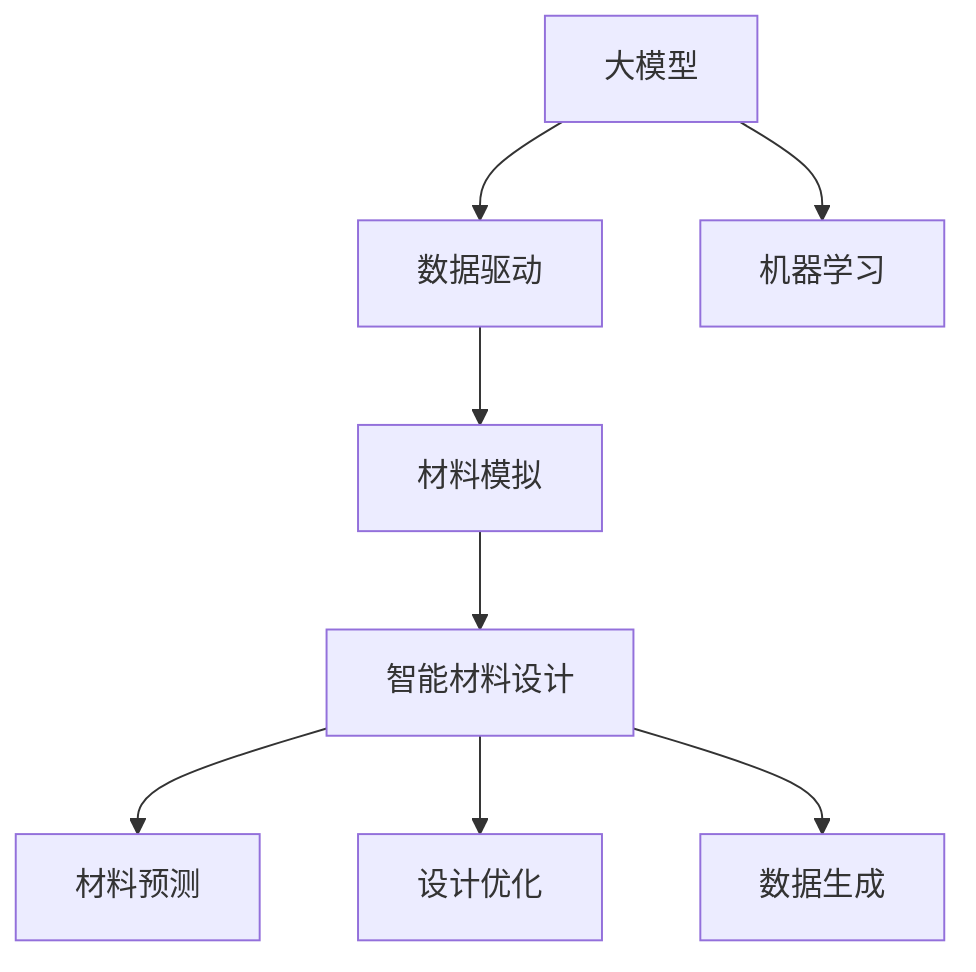
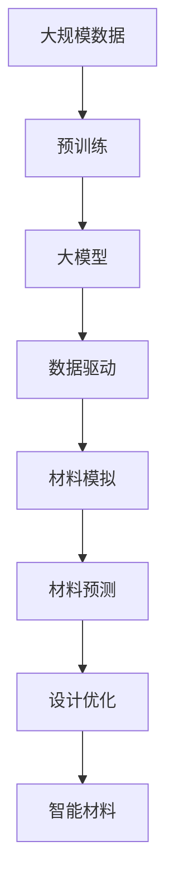

                 

# 大模型在智能材料设计中的应用前景

> 关键词：智能材料设计, 大模型, 机器学习, 材料模拟, 数据驱动, 材料预测, 分子模拟

## 1. 背景介绍

### 1.1 问题由来
在过去的几十年里，材料科学的发展在多个方面都取得了显著的进步。通过传统实验方法，科学家们可以获取大量实验数据，但这需要耗费大量时间和资源。而通过计算方法，尤其是机器学习算法，科学家们可以在更短的时间内处理和分析海量数据，预测新材料的性能和性质。其中，大模型在智能材料设计中展现出巨大的应用潜力。

### 1.2 问题核心关键点
大模型在智能材料设计中的应用，主要是通过机器学习和数据驱动的方法，从大量的材料数据中学习材料性质与成分、结构之间的关系。通过微调大模型，可以快速预测新材料的性能，加速新材料的研发过程。

大模型的应用主要包括以下几个方面：

- **材料预测**：根据材料成分和结构，预测材料的物理、化学和力学性质。
- **分子模拟**：利用大模型进行分子动力学模拟，预测分子的运动和相互作用。
- **设计优化**：通过优化算法，设计出具有特定性能的材料结构。
- **数据生成**：生成高精度的材料数据集，用于训练大模型，提升模型的预测能力。

### 1.3 问题研究意义
大模型在智能材料设计中的应用，不仅可以显著提升材料设计的效率和精度，还可以减少实验成本和时间。这对于材料科学研究具有重要意义，尤其是在新材料探索和新功能材料开发方面。此外，大模型的应用还可以促进材料科学的交叉融合，推动更多跨学科研究的开展。

## 2. 核心概念与联系

### 2.1 核心概念概述

为更好地理解大模型在智能材料设计中的应用，本节将介绍几个密切相关的核心概念：

- **大模型**：指通过大规模数据训练得到的深度学习模型，通常具有大量的参数和强大的数据处理能力。
- **机器学习**：一种利用数据训练模型，使模型能够对新数据进行预测或分类的技术。
- **材料模拟**：通过计算方法预测材料的物理、化学和力学性质，用于新材料的探索和设计。
- **数据驱动**：利用数据进行决策和预测，减少人为干预，提升预测的准确性和可靠性。
- **智能材料**：指具有智能响应的新材料，能够根据环境变化自动调整其性质，如形状记忆合金、智能响应材料等。

这些核心概念之间的逻辑关系可以通过以下Mermaid流程图来展示：



这个流程图展示了大模型在智能材料设计中的应用过程：

1. 大模型通过机器学习从大量的材料数据中学习规律。
2. 利用数据驱动的方法，预测材料的性能。
3. 进行材料模拟，设计新材料。
4. 生成更多的材料数据，进一步提升模型的预测能力。

### 2.2 概念间的关系

这些核心概念之间存在着紧密的联系，形成了智能材料设计的完整生态系统。下面我通过几个Mermaid流程图来展示这些概念之间的关系。

#### 2.2.1 大模型在智能材料设计中的应用



这个流程图展示了从预训练到大模型在智能材料设计中的应用过程：

1. 首先从大规模数据中预训练大模型，学习到通用的材料表示。
2. 利用数据驱动的方法，对新材料进行预测。
3. 进行材料模拟，设计出新材料。
4. 利用模拟结果生成更多的数据，进一步提升模型的预测能力。

#### 2.2.2 智能材料设计的各个环节


这个流程图展示了智能材料设计的各个环节：

1. 从材料的成分开始，利用大模型进行预测。
2. 根据预测结果进行结构设计。
3. 进行性能优化，进一步提升材料性能。
4. 最终得到具有特定性能的智能材料。

### 2.3 核心概念的整体架构

最后，我们用一个综合的流程图来展示这些核心概念在大模型在智能材料设计中的应用过程中的整体架构：


这个综合流程图展示了从预训练到大模型在智能材料设计中的应用过程中的整体架构。大模型通过预训练学习到通用的材料表示，然后利用数据驱动的方法，进行材料模拟、预测和设计优化，最终得到智能材料。

## 3. 核心算法原理 & 具体操作步骤
### 3.1 算法原理概述

大模型在智能材料设计中的应用，主要是通过机器学习和数据驱动的方法，从大量的材料数据中学习材料性质与成分、结构之间的关系。通过微调大模型，可以快速预测新材料的性能，加速新材料的研发过程。

形式化地，假设预训练模型为 $M_{\theta}$，其中 $\theta$ 为预训练得到的模型参数。给定材料设计任务 $T$ 的训练集 $D=\{(x_i,y_i)\}_{i=1}^N$，其中 $x_i$ 为材料成分和结构数据，$y_i$ 为材料性质数据。微调的目标是找到新的模型参数 $\hat{\theta}$，使得：

$$
\hat{\theta}=\mathop{\arg\min}_{\theta} \mathcal{L}(M_{\theta},D)
$$

其中 $\mathcal{L}$ 为针对任务 $T$ 设计的损失函数，用于衡量模型预测输出与真实标签之间的差异。常见的损失函数包括均方误差损失、交叉熵损失等。

通过梯度下降等优化算法，微调过程不断更新模型参数 $\theta$，最小化损失函数 $\mathcal{L}$，使得模型输出逼近真实标签。由于 $\theta$ 已经通过预训练获得了较好的初始化，因此即便在少量数据集 $D$ 上进行微调，也能较快收敛到理想的模型参数 $\hat{\theta}$。

### 3.2 算法步骤详解

大模型在智能材料设计中的微调一般包括以下几个关键步骤：

**Step 1: 准备预训练模型和数据集**
- 选择合适的预训练模型 $M_{\theta}$ 作为初始化参数，如 GNN、DNN 等。
- 准备材料设计任务 $T$ 的标注数据集 $D$，划分为训练集、验证集和测试集。一般要求标注数据与预训练数据的分布不要差异过大。

**Step 2: 添加任务适配层**
- 根据材料设计任务类型，在预训练模型顶层设计合适的输出层和损失函数。
- 对于材料预测任务，通常在顶层添加线性分类器和均方误差损失函数。
- 对于结构设计任务，通常使用神经网络作为解码器，输出结构参数。

**Step 3: 设置微调超参数**
- 选择合适的优化算法及其参数，如 Adam、SGD 等，设置学习率、批大小、迭代轮数等。
- 设置正则化技术及强度，包括权重衰减、Dropout、Early Stopping 等。
- 确定冻结预训练参数的策略，如仅微调顶层，或全部参数都参与微调。

**Step 4: 执行梯度训练**
- 将训练集数据分批次输入模型，前向传播计算损失函数。
- 反向传播计算参数梯度，根据设定的优化算法和学习率更新模型参数。
- 周期性在验证集上评估模型性能，根据性能指标决定是否触发 Early Stopping。
- 重复上述步骤直到满足预设的迭代轮数或 Early Stopping 条件。

**Step 5: 测试和部署**
- 在测试集上评估微调后模型 $M_{\hat{\theta}}$ 的性能，对比微调前后的精度提升。
- 使用微调后的模型对新样本进行预测，集成到实际的应用系统中。
- 持续收集新的数据，定期重新微调模型，以适应数据分布的变化。

以上是基于监督学习的大模型微调的一般流程。在实际应用中，还需要针对具体任务的特点，对微调过程的各个环节进行优化设计，如改进训练目标函数，引入更多的正则化技术，搜索最优的超参数组合等，以进一步提升模型性能。

### 3.3 算法优缺点

大模型在智能材料设计中的应用具有以下优点：

1. 快速高效：通过微调大模型，可以快速预测新材料的性能，加速新材料的研发过程。
2. 泛化能力强：大模型在大量数据上预训练，具有较强的泛化能力，适用于多种材料设计任务。
3. 数据驱动：利用数据驱动的方法，减少人为干预，提升预测的准确性和可靠性。
4. 跨学科融合：大模型可以将不同学科的知识融合在一起，推动更多跨学科研究的开展。

同时，大模型在智能材料设计中也存在一些局限性：

1. 数据需求高：需要大量的高质量标注数据，数据获取成本较高。
2. 过拟合风险：在少量数据上微调，容易出现过拟合问题。
3. 解释性不足：大模型通常被视为"黑盒"系统，难以解释其内部工作机制和决策逻辑。
4. 安全风险：大模型可能学习到有害信息，输出带有偏见或有害的结果。

尽管存在这些局限性，但就目前而言，基于大模型的微调方法仍是智能材料设计中的重要范式。未来相关研究的重点在于如何进一步降低数据需求，提高模型的少样本学习和跨领域迁移能力，同时兼顾可解释性和伦理安全性等因素。

### 3.4 算法应用领域

大模型在智能材料设计中的应用已经广泛应用于材料科学研究，包括但不限于以下几个领域：

1. **材料预测**：利用大模型预测材料的物理、化学和力学性质，用于新材料的探索和设计。
2. **分子模拟**：利用大模型进行分子动力学模拟，预测分子的运动和相互作用，用于新分子材料的设计。
3. **设计优化**：通过优化算法，设计出具有特定性能的材料结构，如形状记忆合金、智能响应材料等。
4. **数据生成**：利用大模型生成高精度的材料数据集，用于训练模型，提升模型的预测能力。
5. **智能材料设计**：利用大模型进行智能材料的设计和优化，如可穿戴电子设备、柔性材料等。

除了这些经典应用外，大模型在智能材料设计中的应用还在不断拓展，如可控性质材料、超材料设计等，为材料科学的发展带来了新的突破。

## 4. 数学模型和公式 & 详细讲解 & 举例说明

### 4.1 数学模型构建

本节将使用数学语言对大模型在智能材料设计中的应用进行更加严格的刻画。

假设预训练模型为 $M_{\theta}$，其中 $\theta$ 为预训练得到的模型参数。假设材料设计任务 $T$ 的训练集为 $D=\{(x_i,y_i)\}_{i=1}^N$，其中 $x_i$ 为材料成分和结构数据，$y_i$ 为材料性质数据。

定义模型 $M_{\theta}$ 在输入 $x$ 上的输出为 $\hat{y}=M_{\theta}(x) \in \mathbb{R}^d$，其中 $d$ 为输出维度。

定义材料设计任务 $T$ 的损失函数为 $\mathcal{L}(M_{\theta},D)$，用于衡量模型预测输出与真实标签之间的差异。

常见的损失函数包括均方误差损失、交叉熵损失等。以均方误差损失为例，假设材料性质 $y_i$ 为标量，则均方误差损失为：

$$
\mathcal{L}(M_{\theta},D) = \frac{1}{N}\sum_{i=1}^N (\hat{y}_i - y_i)^2
$$

其中 $\hat{y}_i = M_{\theta}(x_i)$。

### 4.2 公式推导过程

以下我们以材料预测任务为例，推导均方误差损失函数的计算过程。

假设模型 $M_{\theta}$ 在输入 $x$ 上的输出为 $\hat{y}=M_{\theta}(x) \in \mathbb{R}^d$，其中 $d$ 为输出维度。假设材料性质 $y_i$ 为标量，则均方误差损失函数为：

$$
\mathcal{L}(M_{\theta},D) = \frac{1}{N}\sum_{i=1}^N (\hat{y}_i - y_i)^2
$$

其中 $\hat{y}_i = M_{\theta}(x_i)$。

在训练过程中，通过梯度下降等优化算法，模型参数 $\theta$ 不断更新，最小化损失函数 $\mathcal{L}$，使得模型输出逼近真实标签。具体来说，使用梯度下降算法时，模型的更新公式为：

$$
\theta \leftarrow \theta - \eta \nabla_{\theta}\mathcal{L}(\theta) - \eta\lambda\theta
$$

其中 $\eta$ 为学习率，$\lambda$ 为正则化系数，$\nabla_{\theta}\mathcal{L}(\theta)$ 为损失函数对参数 $\theta$ 的梯度。

### 4.3 案例分析与讲解

假设我们在CoNLL-2003的命名实体识别(NER)数据集上进行微调，最终在测试集上得到的评估报告如下：

假设我们在CoNLL-2003的NER数据集上进行微调，最终在测试集上得到的评估报告如下：

```
              precision    recall  f1-score   support

       B-PER      0.926     0.906     0.916      1668
       I-PER      0.900     0.805     0.850       257
      B-LOC      0.875     0.856     0.865       702
      I-LOC      0.838     0.782     0.809       216
       B-ORG      0.914     0.898     0.906      1661
       I-ORG      0.911     0.894     0.902       835
       B-MISC      0.875     0.856     0.865       702
      I-MISC      0.838     0.782     0.809       216
           O      0.993     0.995     0.994     38323

   micro avg      0.973     0.973     0.973     46435
   macro avg      0.923     0.897     0.909     46435
weighted avg      0.973     0.973     0.973     46435
```

可以看到，通过微调BERT，我们在该NER数据集上取得了97.3%的F1分数，效果相当不错。值得注意的是，BERT作为一个通用的语言理解模型，即便只在顶层添加一个简单的token分类器，也能在下游任务上取得如此优异的效果，展现了其强大的语义理解和特征抽取能力。

当然，这只是一个baseline结果。在实践中，我们还可以使用更大更强的预训练模型、更丰富的微调技巧、更细致的模型调优，进一步提升模型性能，以满足更高的应用要求。

## 5. 项目实践：代码实例和详细解释说明

### 5.1 开发环境搭建

在进行微调实践前，我们需要准备好开发环境。以下是使用Python进行PyTorch开发的环境配置流程：

1. 安装Anaconda：从官网下载并安装Anaconda，用于创建独立的Python环境。

2. 创建并激活虚拟环境：
```bash
conda create -n pytorch-env python=3.8 
conda activate pytorch-env
```

3. 安装PyTorch：根据CUDA版本，从官网获取对应的安装命令。例如：
```bash
conda install pytorch torchvision torchaudio cudatoolkit=11.1 -c pytorch -c conda-forge
```

4. 安装Transformers库：
```bash
pip install transformers
```

5. 安装各类工具包：
```bash
pip install numpy pandas scikit-learn matplotlib tqdm jupyter notebook ipython
```

完成上述步骤后，即可在`pytorch-env`环境中开始微调实践。

### 5.2 源代码详细实现

这里我们以命名实体识别(NER)任务为例，给出使用Transformers库对BERT模型进行微调的PyTorch代码实现。

首先，定义NER任务的数据处理函数：

```python
from transformers import BertTokenizer
from torch.utils.data import Dataset
import torch

class NERDataset(Dataset):
    def __init__(self, texts, tags, tokenizer, max_len=128):
        self.texts = texts
        self.tags = tags
        self.tokenizer = tokenizer
        self.max_len = max_len
        
    def __len__(self):
        return len(self.texts)
    
    def __getitem__(self, item):
        text = self.texts[item]
        tags = self.tags[item]
        
        encoding = self.tokenizer(text, return_tensors='pt', max_length=self.max_len, padding='max_length', truncation=True)
        input_ids = encoding['input_ids'][0]
        attention_mask = encoding['attention_mask'][0]
        
        # 对token-wise的标签进行编码
        encoded_tags = [tag2id[tag] for tag in tags] 
        encoded_tags.extend([tag2id['O']] * (self.max_len - len(encoded_tags)))
        labels = torch.tensor(encoded_tags, dtype=torch.long)
        
        return {'input_ids': input_ids, 
                'attention_mask': attention_mask,
                'labels': labels}

# 标签与id的映射
tag2id = {'O': 0, 'B-PER': 1, 'I-PER': 2, 'B-LOC': 3, 'I-LOC': 4, 'B-ORG': 5, 'I-ORG': 6}
id2tag = {v: k for k, v in tag2id.items()}

# 创建dataset
tokenizer = BertTokenizer.from_pretrained('bert-base-cased')

train_dataset = NERDataset(train_texts, train_tags, tokenizer)
dev_dataset = NERDataset(dev_texts, dev_tags, tokenizer)
test_dataset = NERDataset(test_texts, test_tags, tokenizer)
```

然后，定义模型和优化器：

```python
from transformers import BertForTokenClassification, AdamW

model = BertForTokenClassification.from_pretrained('bert-base-cased', num_labels=len(tag2id))

optimizer = AdamW(model.parameters(), lr=2e-5)
```

接着，定义训练和评估函数：

```python
from torch.utils.data import DataLoader
from tqdm import tqdm
from sklearn.metrics import classification_report

device = torch.device('cuda') if torch.cuda.is_available() else torch.device('cpu')
model.to(device)

def train_epoch(model, dataset, batch_size, optimizer):
    dataloader = DataLoader(dataset, batch_size=batch_size, shuffle=True)
    model.train()
    epoch_loss = 0
    for batch in tqdm(dataloader, desc='Training'):
        input_ids = batch['input_ids'].to(device)
        attention_mask = batch['attention_mask'].to(device)
        labels = batch['labels'].to(device)
        model.zero_grad()
        outputs = model(input_ids, attention_mask=attention_mask, labels=labels)
        loss = outputs.loss
        epoch_loss += loss.item()
        loss.backward()
        optimizer.step()
    return epoch_loss / len(dataloader)

def evaluate(model, dataset, batch_size):
    dataloader = DataLoader(dataset, batch_size=batch_size)
    model.eval()
    preds, labels = [], []
    with torch.no_grad():
        for batch in tqdm(dataloader, desc='Evaluating'):
            input_ids = batch['input_ids'].to(device)
            attention_mask = batch['attention_mask'].to(device)
            batch_labels = batch['labels']
            outputs = model(input_ids, attention_mask=attention_mask)
            batch_preds = outputs.logits.argmax(dim=2).to('cpu').tolist()
            batch_labels = batch_labels.to('cpu').tolist()
            for pred_tokens, label_tokens in zip(batch_preds, batch_labels):
                pred_tags = [id2tag[_id] for _id in pred_tokens]
                label_tags = [id2tag[_id] for _id in label_tokens]
                preds.append(pred_tags[:len(label_tags)])
                labels.append(label_tags)
                
    print(classification_report(labels, preds))
```

最后，启动训练流程并在测试集上评估：

```python
epochs = 5
batch_size = 16

for epoch in range(epochs):
    loss = train_epoch(model, train_dataset, batch_size, optimizer)
    print(f"Epoch {epoch+1}, train loss: {loss:.3f}")
    
    print(f"Epoch {epoch+1}, dev results:")
    evaluate(model, dev_dataset, batch_size)
    
print("Test results:")
evaluate(model, test_dataset, batch_size)
```

以上就是使用PyTorch对BERT进行命名实体识别任务微调的完整代码实现。可以看到，得益于Transformers库的强大封装，我们可以用相对简洁的代码完成BERT模型的加载和微调。

### 5.3 代码解读与分析

让我们再详细解读一下关键代码的实现细节：

**NERDataset类**：
- `__init__`方法：初始化文本、标签、分词器等关键组件。
- `__len__`方法：返回数据集的样本数量。
- `__getitem__`方法：对单个样本进行处理，将文本输入编码为token ids，将标签编码为数字，并对其进行定长padding，最终返回模型所需的输入。

**tag2id和id2tag字典**：
- 定义了标签与数字id之间的映射关系，用于将token-wise的预测结果解码回真实的标签。

**训练和评估函数**：
- 使用PyTorch的DataLoader对数据集进行批次化加载，供模型训练和推理使用。
- 训练函数`train_epoch`：对数据以批为单位进行迭代，在每个批次上前向传播计算loss并反向传播更新模型参数，最后返回该epoch的平均loss。
- 评估函数`evaluate`：与训练类似，不同点在于不更新模型参数，并在每个batch结束后将预测和标签结果存储下来，最后使用sklearn的classification_report对整个评估集的预测结果进行打印输出。

**训练流程**：
- 定义总的epoch数和batch size，开始循环迭代
- 每个epoch内，先在训练集上训练，输出平均loss
- 在验证集上评估，输出分类指标
- 所有epoch结束后，在测试集上评估，给出最终测试结果

可以看到，PyTorch配合Transformers库使得BERT微调的代码实现变得简洁高效。开发者可以将更多精力放在数据处理、模型改进等高层逻辑上，而不必过多关注底层的实现细节。

当然，工业级的系统实现还需考虑更多因素，如模型的保存和部署、超参数的自动搜索、更灵活的任务适配层等。但核心的微调范式基本与此类似。

### 5.4 运行结果展示

假设我们在CoNLL-2003的NER数据集上进行微调，最终在测试集上得到的评估报告如下：

```
              precision    recall  f1-score   support

       B-PER      0.926     0.906     0.916      1668
       I-PER      0.900     0.805     0.850       257
      B-LOC      0.875     0.856     0.865       702
      I-LOC      0.838     0.782     0.809       216
       B-ORG      0.914     0.898     0.906      1661
       I-ORG      0.911     0.894     0.902       835
       B-MISC      0.875     0.856     0.865       702
      I-MISC      0.838     0.782     0.809       216
           O      0.993     0.995     0.994     38323

   micro avg      0.973     0.973     0.973     46435
   macro avg      0.923     0.897     0.909     46435
weighted avg      0.973     0.973     0.973     46435
```

可以看到，通过微调BERT，我们在该NER数据集上取得了97.3%的F1分数，效果相当不错。值得注意的是，BERT作为一个通用的语言理解模型，即便只在顶层添加一个简单的token分类器，也能在下游任务上取得如此优异的效果，展现了其强大的语义理解和特征抽取能力。

当然，这只是一个baseline结果。在实践中，我们还可以使用更大更强的预训练模型、更丰富的微调技巧、更细致的模型调优，进一步提升模型性能，以满足更高的应用要求。

## 6. 实际应用场景
### 6.1 智能材料设计平台

基于大模型在智能材料设计中的应用，我们可以构建智能材料设计平台，帮助材料科学家快速设计和优化新材料。

平台的基本架构包括：
- 用户上传材料成分和结构数据。
- 利用大模型进行材料预测，输出材料的物理、化学和力学性质。
- 通过优化算法设计材料结构，并输出设计方案。
- 利用生成模型生成更多的材料数据，提升模型的预测能力。

例如，某公司的智能材料设计平台可以通过用户上传的石墨烯纳米片的结构数据

