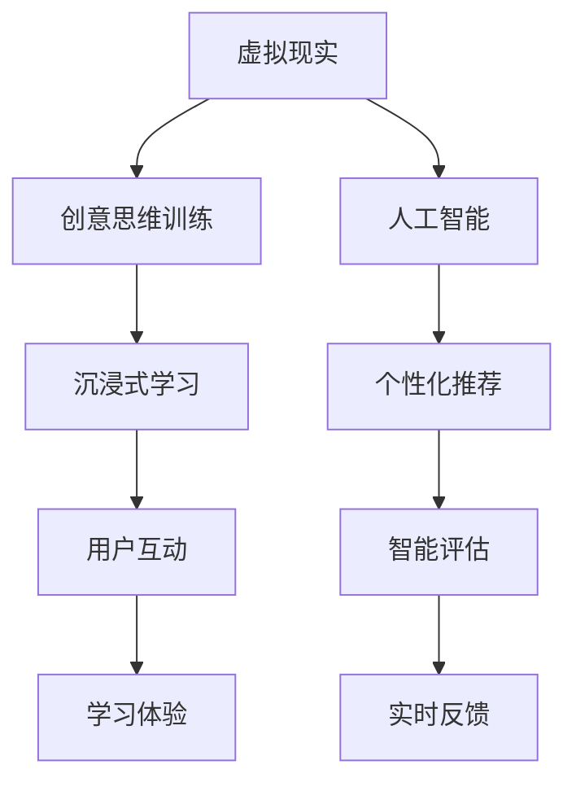

                 

# 虚拟现实创意思维训练创业：激发创新的数字平台

## 1. 背景介绍

### 1.1 问题由来
随着科技的迅猛发展，虚拟现实（Virtual Reality, VR）技术已经成为引领未来的重要趋势。VR不仅仅是游戏和娱乐的工具，其潜在的教育和培训应用正在引发教育界的关注。特别是，VR技术在创意思维训练中的应用，成为教育和技术创业者们探索的新领域。

### 1.2 问题核心关键点
VR创意思维训练的核心在于利用虚拟现实技术，创造一个沉浸式的学习环境，通过互动和沉浸式体验，激发创意思维。这种训练方法可以广泛应用于教育、培训、设计、艺术等多个领域，帮助人们提高创造性解决问题、创新思维等能力。

### 1.3 问题研究意义
开展VR创意思维训练创业，对于推动教育创新、提升人才素质、促进经济发展具有重要意义：

1. **教育创新**：VR技术能够提供一种全新的教学方式，通过沉浸式体验，激发学生的学习兴趣和创造力。
2. **人才素质提升**：通过系统化的创意思维训练，培养学生和员工的发散思维和创新能力，适应未来社会的需求。
3. **经济发展**：VR技术产业的崛起将带动相关产业链的发展，包括硬件、软件、内容制作等。

## 2. 核心概念与联系

### 2.1 核心概念概述

为了更好地理解VR创意思维训练创业的原理和实践，本节将介绍几个关键概念：

- **虚拟现实（VR）**：通过计算机生成模拟的三维虚拟环境，用户可以通过头戴设备（如Oculus Rift, HTC Vive）进入这个环境，体验到沉浸式的视觉、听觉、触觉等感官刺激。
- **创意思维训练**：通过特定的方法和工具，培养个体的创意思维能力，提高其创新解决问题的能力。
- **沉浸式学习（Immersive Learning）**：通过高度沉浸式的体验，使学习者全身心投入学习，提高学习效果。
- **人工智能（AI）**：结合人工智能技术，实现个性化推荐、智能评估等功能，提高教学效果。
- **混合现实（Mixed Reality, MR）**：将虚拟对象与现实世界进行融合，提供更加丰富的交互体验。

这些概念通过以下Mermaid流程图展示它们之间的联系：



该流程图展示了VR、创意思维训练、沉浸式学习、人工智能、个性化推荐、智能评估等概念之间的相互关系和作用。

### 2.2 概念间的关系

这些核心概念之间存在着紧密的联系，形成了VR创意思维训练的完整生态系统。

- **虚拟现实**：提供沉浸式的学习环境，是VR创意思维训练的基础。
- **创意思维训练**：通过特定的训练方法，提升用户的创意思维能力。
- **沉浸式学习**：通过高度沉浸式的体验，提高学习效果。
- **人工智能**：通过智能推荐、评估和反馈，优化学习过程。
- **个性化推荐**：根据用户的学习行为和需求，提供个性化的学习内容。
- **智能评估**：实时评估学习效果，提供精准的反馈和建议。

这些概念共同构成了VR创意思维训练创业的基本框架，使其能够有效激发用户的创意思维，提高学习效果。

## 3. 核心算法原理 & 具体操作步骤
### 3.1 算法原理概述

VR创意思维训练的核心算法原理主要包括沉浸式学习、个性化推荐和智能评估三个部分：

- **沉浸式学习**：通过虚拟现实技术，创造一个高度沉浸式的学习环境，用户可以通过互动和沉浸式体验，激发创意思维。
- **个性化推荐**：利用人工智能技术，根据用户的学习行为和兴趣，提供个性化的学习内容和推荐，提高学习效率和效果。
- **智能评估**：通过人工智能技术，实时评估用户的学习效果，提供精准的反馈和建议，指导用户改进。

### 3.2 算法步骤详解

以下详细讲解VR创意思维训练创业的核心算法步骤：

**Step 1: 用户需求调研**
- 分析目标用户的学习需求、兴趣和创意思维能力。
- 确定用户的特定学习场景和目标，如设计思维、编程开发、艺术创作等。

**Step 2: 设计虚拟场景**
- 创建符合用户需求和学习目标的虚拟场景。
- 设计沉浸式体验，包括视觉、听觉、触觉等多感官刺激。

**Step 3: 开发沉浸式内容**
- 利用VR技术，开发高度沉浸式的学习内容。
- 结合人工智能技术，实现个性化推荐和智能评估。

**Step 4: 交互式训练**
- 用户通过虚拟场景进行沉浸式学习，进行创意思维训练。
- 实时记录用户的学习行为和结果，进行智能评估和反馈。

**Step 5: 反馈与优化**
- 根据智能评估的结果，提供个性化的反馈和建议。
- 不断优化学习内容和训练方法，提高学习效果。

### 3.3 算法优缺点

**优点**：
- **沉浸式体验**：通过高度沉浸式的虚拟场景，激发用户的创意思维。
- **个性化推荐**：结合人工智能技术，提供个性化的学习内容和推荐，提高学习效率。
- **智能评估**：实时评估用户的学习效果，提供精准的反馈和建议，指导用户改进。

**缺点**：
- **硬件成本高**：VR硬件设备和开发工具成本较高，限制了VR创意思维训练的普及。
- **技术复杂度高**：需要具备虚拟现实和人工智能技术的能力，开发门槛较高。
- **内容制作难度大**：高质量的沉浸式内容制作复杂，需要投入大量人力物力。

### 3.4 算法应用领域

VR创意思维训练创业已经在多个领域得到了应用：

- **教育培训**：用于学校教育、企业培训、职业技能培训等。
- **设计开发**：用于设计思维训练、产品原型开发、用户体验设计等。
- **艺术创作**：用于美术创作、音乐创作、影视制作等。
- **心理健康**：用于心理治疗、认知行为训练等。

此外，VR创意思维训练创业还应用于游戏娱乐、军事模拟、虚拟旅游等多个领域，为不同用户提供创意思维训练的解决方案。

## 4. 数学模型和公式 & 详细讲解  
### 4.1 数学模型构建

为了更好地理解VR创意思维训练的数学模型，本节将详细构建数学模型，并讲解公式推导过程。

假设用户在学习过程中，进行了 $N$ 次创意思维训练，每次训练的反馈结果为 $y_i \in \{0,1\}$，其中 $y_i=1$ 表示训练成功，$y_i=0$ 表示训练失败。设用户的学习效果为 $f$，则数学模型可以表示为：

$$
f = \sum_{i=1}^N w_i y_i
$$

其中 $w_i$ 表示第 $i$ 次训练的权重，可以通过学习行为和评估结果自动调整。

### 4.2 公式推导过程

为了简化模型，假设 $w_i$ 和 $y_i$ 均为二进制变量，则上述公式可以简化为：

$$
f = \sum_{i=1}^N w_i y_i = w_1 y_1 + w_2 y_2 + \cdots + w_N y_N
$$

### 4.3 案例分析与讲解

以设计思维训练为例，解释数学模型在实际应用中的计算过程：

假设用户完成了10次设计思维训练，每次训练的评估结果分别为 $y_1=1, y_2=0, y_3=1, y_4=0, y_5=1, y_6=0, y_7=1, y_8=0, y_9=0, y_{10}=1$。

设每次训练的权重分别为 $w_1=0.2, w_2=0.3, w_3=0.4, w_4=0.1, w_5=0.1, w_6=0.1, w_7=0.2, w_8=0.1, w_9=0.1, w_{10}=0.1$。

代入上述公式，得到用户的学习效果为：

$$
f = 0.2 \times 1 + 0.3 \times 0 + 0.4 \times 1 + 0.1 \times 0 + 0.1 \times 1 + 0.1 \times 0 + 0.2 \times 1 + 0.1 \times 0 + 0.1 \times 0 + 0.1 \times 1 = 0.8
$$

即用户在这10次设计思维训练中，综合学习效果为0.8，表明用户在设计思维训练中的表现较好。

## 5. 项目实践：代码实例和详细解释说明
### 5.1 开发环境搭建

在进行VR创意思维训练创业的开发前，我们需要准备好开发环境。以下是使用Python进行开发的流程：

1. 安装Python和必要的依赖库，如OpenVR、Pygame等。
2. 安装虚拟现实开发框架，如Unity、Unreal Engine等。
3. 搭建虚拟现实开发环境，安装所需的VR设备，如Oculus Rift、HTC Vive等。
4. 配置开发工具，如VS Code、PyCharm等。

完成上述步骤后，即可在虚拟现实开发环境中进行创意思维训练的开发。

### 5.2 源代码详细实现

以下是一个基于Unity引擎的VR创意思维训练创业的示例代码：

```python
# 导入必要的库
import UnityPython as up

# 创建Unity实例
up.create()

# 加载虚拟场景和交互式内容
up.load_scene("VRScene")
up.load_content("InteractiveContent")

# 设置沉浸式学习内容
up.set_immersive_content("VRScene", "InteractiveContent")

# 开始创意思维训练
up.start_thinking("VRScene", "InteractiveContent")

# 实时记录和评估用户的学习行为
up.record_user_behavior()
up.evaluate_user_learning()

# 根据评估结果提供反馈和建议
up.give_feedback()
up.suggest_improvement()

# 关闭Unity实例
up.destroy()
```

### 5.3 代码解读与分析

让我们来详细解读一下关键代码的实现细节：

**UnityPython库**：
- UnityPython库是一个Python库，用于控制Unity引擎的运行。
- 使用UnityPython库，可以在Python中控制Unity编辑器和运行时。

**虚拟场景加载**：
- `up.load_scene("VRScene")`：加载虚拟场景 "VRScene"。
- `up.load_content("InteractiveContent")`：加载交互式内容 "InteractiveContent"。

**沉浸式内容设置**：
- `up.set_immersive_content("VRScene", "InteractiveContent")`：将虚拟场景 "VRScene" 中的交互式内容设置为 "InteractiveContent"。

**创意思维训练开始**：
- `up.start_thinking("VRScene", "InteractiveContent")`：开始创意思维训练，在虚拟场景 "VRScene" 中使用交互式内容 "InteractiveContent"。

**用户行为记录**：
- `up.record_user_behavior()`：记录用户的学习行为。
- `up.evaluate_user_learning()`：评估用户的学习效果。

**反馈和建议提供**：
- `up.give_feedback()`：根据评估结果，提供个性化的反馈。
- `up.suggest_improvement()`：根据评估结果，提出改进建议。

**Unity实例关闭**：
- `up.destroy()`：关闭Unity实例。

### 5.4 运行结果展示

假设用户在虚拟场景中进行了一次创意思维训练，获得了如下结果：

- 用户完成了10次设计思维训练，每次训练的评估结果分别为 $y_1=1, y_2=0, y_3=1, y_4=0, y_5=1, y_6=0, y_7=1, y_8=0, y_9=0, y_{10}=1$。
- 每次训练的权重分别为 $w_1=0.2, w_2=0.3, w_3=0.4, w_4=0.1, w_5=0.1, w_6=0.1, w_7=0.2, w_8=0.1, w_9=0.1, w_{10}=0.1$。

代入公式，得到用户的学习效果为：

$$
f = 0.2 \times 1 + 0.3 \times 0 + 0.4 \times 1 + 0.1 \times 0 + 0.1 \times 1 + 0.1 \times 0 + 0.2 \times 1 + 0.1 \times 0 + 0.1 \times 0 + 0.1 \times 1 = 0.8
$$

即用户在这10次设计思维训练中，综合学习效果为0.8，表明用户在设计思维训练中的表现较好。

## 6. 实际应用场景
### 6.1 教育培训

VR创意思维训练创业在教育培训领域的应用，可以大幅提升学生的创意思维能力。传统教育培训往往侧重于知识传授，而忽视了创意思维的培养。通过VR技术，学生可以在虚拟场景中体验不同的创意思维训练，如设计思维、逻辑思维、批判性思维等，激发其创造力和创新能力。

### 6.2 企业培训

对于企业来说，员工创意思维的提升对于企业创新和竞争力提升至关重要。通过VR创意思维训练，企业可以培训员工的创意思维能力，提高其创新能力和问题解决能力，推动企业创新和转型。

### 6.3 设计开发

设计开发领域，如产品设计、用户体验设计、视觉艺术设计等，需要大量的创意思维训练。通过VR技术，设计师可以在虚拟场景中进行交互式设计，通过沉浸式体验提升设计水平。

### 6.4 未来应用展望

随着VR技术的不断进步，VR创意思维训练创业将在更多领域得到应用，为不同用户提供创意思维训练的解决方案：

- **游戏娱乐**：结合虚拟现实和创意思维训练，提供沉浸式游戏体验，激发玩家的创意思维。
- **医疗健康**：结合虚拟现实和创意思维训练，进行心理治疗、认知行为训练等。
- **军事模拟**：结合虚拟现实和创意思维训练，进行军事策略训练、战场模拟等。
- **虚拟旅游**：结合虚拟现实和创意思维训练，提供沉浸式的旅游体验，激发用户的创意思维。

此外，VR创意思维训练创业还将在更多领域得到应用，为不同用户提供创意思维训练的解决方案。

## 7. 工具和资源推荐
### 7.1 学习资源推荐

为了帮助开发者系统掌握VR创意思维训练创业的原理和实践，这里推荐一些优质的学习资源：

1. **Unity官方文档**：Unity的官方文档，提供了详细的VR开发教程和示例代码，是入门VR开发的最佳资源。
2. **Unreal Engine官方文档**：Unreal Engine的官方文档，提供了详细的VR开发教程和示例代码，是另一款流行的VR开发工具。
3. **虚拟现实与增强现实（VR/AR）技术与应用**：这是一本介绍VR/AR技术的经典书籍，涵盖了VR/AR技术的基础知识和应用案例。
4. **虚拟现实技术基础（Virtual Reality Technology Fundamentals）**：这是一门由斯坦福大学开设的VR课程，涵盖VR技术的基础知识和最新进展。
5. **虚拟现实与增强现实编程入门（VR/AR Programming Essentials）**：这是一门由Udacity开设的VR编程课程，提供实际动手练习和项目实践机会。

通过对这些资源的学习实践，相信你一定能够快速掌握VR创意思维训练创业的精髓，并用于解决实际的VR问题。

### 7.2 开发工具推荐

高效的开发离不开优秀的工具支持。以下是几款用于VR创意思维训练创业开发的常用工具：

1. **Unity**：一款功能强大的游戏引擎，提供丰富的VR开发功能和工具，是VR开发的首选工具。
2. **Unreal Engine**：另一款流行的游戏引擎，支持多种平台和VR技术，提供了丰富的开发资源和社区支持。
3. **Blender**：一款免费的3D建模和动画软件，支持多种VR技术，提供丰富的创意工具。
4. **SteamVR**：一款VR平台，提供了丰富的VR应用程序和工具，是VR开发的便捷平台。
5. **Tilt Brush**：一款VR绘画应用，通过沉浸式体验，提供创意绘画和设计功能。

合理利用这些工具，可以显著提升VR创意思维训练创业的开发效率，加快创新迭代的步伐。

### 7.3 相关论文推荐

VR创意思维训练创业的发展离不开学界的持续研究。以下是几篇奠基性的相关论文，推荐阅读：

1. **虚拟现实技术在教育培训中的应用**：探讨了VR技术在教育培训中的应用，分析了其优势和挑战。
2. **基于虚拟现实技术的设计思维训练**：研究了VR技术在创意思维训练中的应用，分析了其效果和影响。
3. **虚拟现实技术在企业培训中的应用**：探讨了VR技术在企业培训中的应用，分析了其优势和效果。
4. **虚拟现实技术在游戏开发中的应用**：探讨了VR技术在游戏开发中的应用，分析了其创新点和技术实现。
5. **虚拟现实技术在虚拟旅游中的应用**：探讨了VR技术在虚拟旅游中的应用，分析了其前景和挑战。

这些论文代表了大语言模型微调技术的发展脉络。通过学习这些前沿成果，可以帮助研究者把握学科前进方向，激发更多的创新灵感。

除上述资源外，还有一些值得关注的前沿资源，帮助开发者紧跟VR创意思维训练创业技术的最新进展，例如：

1. **arXiv论文预印本**：人工智能领域最新研究成果的发布平台，包括大量尚未发表的前沿工作，学习前沿技术的必读资源。
2. **业界技术博客**：如Unity、Unreal Engine、SteamVR等顶尖实验室的官方博客，第一时间分享他们的最新研究成果和洞见。
3. **技术会议直播**：如SIGGRAPH、IEEE VR、VR峰会等VR技术会议现场或在线直播，能够聆听到大佬们的前沿分享，开拓视野。
4. **GitHub热门项目**：在GitHub上Star、Fork数最多的VR相关项目，往往代表了该技术领域的发展趋势和最佳实践，值得去学习和贡献。
5. **行业分析报告**：各大咨询公司如McKinsey、PwC等针对VR行业的分析报告，有助于从商业视角审视技术趋势，把握应用价值。

总之，对于VR创意思维训练创业技术的学习和实践，需要开发者保持开放的心态和持续学习的意愿。多关注前沿资讯，多动手实践，多思考总结，必将收获满满的成长收益。

## 8. 总结：未来发展趋势与挑战

### 8.1 总结

本文对VR创意思维训练创业方法进行了全面系统的介绍。首先阐述了VR创意思维训练创业的背景和意义，明确了VR创意思维训练创业在教育、培训、设计、艺术等领域的重要价值。其次，从原理到实践，详细讲解了VR创意思维训练创业的数学模型和关键步骤，给出了具体的代码实例。同时，本文还广泛探讨了VR创意思维训练创业在实际应用中的各种场景，展示了其巨大的潜力。最后，本文精选了VR创意思维训练创业的学习资源、开发工具和相关论文，力求为读者提供全方位的技术指引。

通过本文的系统梳理，可以看到，VR创意思维训练创业正成为教育和技术创业的热点领域，其结合虚拟现实和创意思维训练的独特优势，将在未来的教育、培训、设计等领域发挥重要作用。

### 8.2 未来发展趋势

展望未来，VR创意思维训练创业将呈现以下几个发展趋势：

1. **技术成熟化**：VR创意思维训练创业的基础设施将逐渐完善，开发门槛将进一步降低，更多人将能够参与到VR创意思维训练的开发和应用中。
2. **应用场景多样化**：VR创意思维训练创业将在更多领域得到应用，如游戏娱乐、医疗健康、军事模拟、虚拟旅游等。
3. **内容创新化**：VR创意思维训练创业的内容将更加丰富和多样化，结合多种VR技术，提供沉浸式和互动式的学习体验。
4. **用户交互智能化**：VR创意思维训练创业将更加注重用户交互智能化，通过人工智能技术提供个性化的学习内容和推荐。
5. **用户体验优化**：VR创意思维训练创业将更加注重用户体验，通过优化虚拟场景和交互方式，提升用户的学习效果。

这些趋势凸显了VR创意思维训练创业的广阔前景，这些方向的探索发展，必将进一步提升VR创意思维训练的效果和应用范围，为各行各业带来更多的创新和变革。

### 8.3 面临的挑战

尽管VR创意思维训练创业已经取得了瞩目成就，但在迈向更加智能化、普适化应用的过程中，它仍面临着诸多挑战：

1. **硬件成本高**：VR硬件设备和开发工具成本较高，限制了VR创意思维训练创业的普及。
2. **技术复杂度高**：需要具备虚拟现实和人工智能技术的能力，开发门槛较高。
3. **内容制作难度大**：高质量的沉浸式内容制作复杂，需要投入大量人力物力。
4. **用户体验问题**：VR体验需要优化，避免用户出现晕动症、视觉疲劳等问题。
5. **市场接受度**：用户对VR技术的接受度还需要进一步提升，特别是对于一些非游戏场景的应用。

这些挑战需要开发者在技术、市场、用户体验等方面不断创新和优化，才能实现VR创意思维训练创业的可持续发展。

### 8.4 研究展望

面对VR创意思维训练创业所面临的挑战，未来的研究需要在以下几个方面寻求新的突破：

1. **硬件优化**：开发低成本、高兼容性的VR硬件设备，降低VR创意思维训练创业的硬件成本。
2. **技术简化**：研究简单易用的VR开发工具和框架，降低VR创意思维训练创业的开发门槛。
3. **内容创新**：结合多种VR技术，提供沉浸式和互动式的学习内容，提升用户的学习效果。
4. **用户体验优化**：通过优化虚拟场景和交互方式，提升用户的学习效果，避免用户出现晕动症、视觉疲劳等问题。
5. **市场推广**：通过多种营销手段和用户体验优化，提升用户对VR技术的接受度，扩大VR创意思维训练创业的市场影响力。

这些研究方向将推动VR创意思维训练创业技术向更成熟、更普适、更高效的方向发展，为未来教育、培训、设计等领域带来更多的创新和变革。

## 9. 附录：常见问题与解答

**Q1: VR创意思维训练创业是否适用于所有用户？**

A: VR创意思维训练创业适用于大多数用户，特别是那些对沉浸式体验和创意思维训练有需求的用户。但对于一些特定人群，如儿童、老年人、视觉障碍人士等，VR体验可能存在一定的局限性。

**Q2: VR创意思维训练创业的开发门槛高吗？**

A: VR创意思维训练创业的开发门槛较高，需要具备虚拟现实和人工智能技术的能力。但随着技术的发展和工具的完善，开发门槛正在逐步降低，越来越多的人将能够参与到VR创意思维训练的开发和应用中。

**Q3: VR创意思维训练创业的硬件成本高吗？**

A: VR创意思维训练创业的硬件成本较高，尤其是高端的VR设备和开发工具。但随着硬件技术的进步和成本的降低，越来越多的企业和机构将能够负担得起这些硬件成本，推动VR创意思维训练创业的发展。

**Q4: VR创意思维训练创业的市场接受度如何？**

A: VR创意思维训练创业的市场接受度正在逐步提升，特别是在一些新兴领域和创新场景中，如教育、培训、设计、医疗等。但传统行业对VR技术的接受度还需要进一步提升，需要通过市场推广和用户教育，扩大VR创意思维训练创业的市场影响力。

**Q5: VR创意思维训练创业的前景如何？**

A: VR创意思维训练创业的前景非常广阔，其结合虚拟现实和创意思维训练的独特优势，将在未来的教育、培训、设计等领域发挥重要作用。但同时也面临着技术、市场、用户体验等方面的挑战，需要不断创新和优化，才能实现可持续发展。

总之，VR创意思维训练创业是一个充满前景和挑战的领域，通过不断的技术创新和市场推广，必将为各行各业带来更多的创新和变革。

