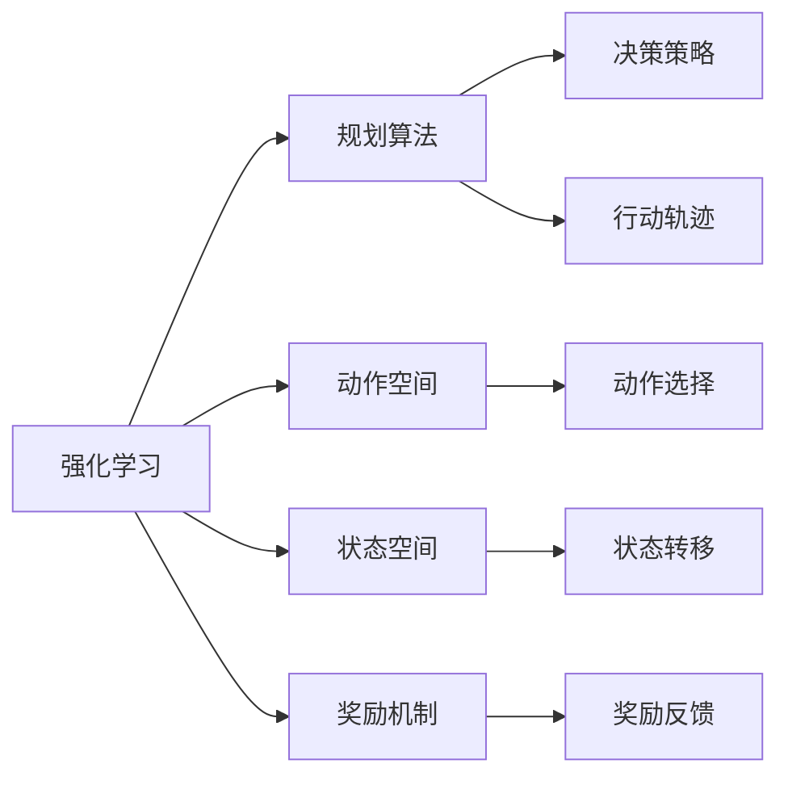

                 

# 规划技能在AI Agent中的应用

> 关键词：
- 强化学习
- AI Agent
- 规划算法
- Markov Decision Process
- Q-learning
- 动作空间
- 状态空间
- 奖励机制

## 1. 背景介绍

在人工智能(AI)领域，智能体(Agent)被广泛应用于各种复杂系统中，从自动驾驶汽车到机器人操作，再到金融投资，都离不开智能体的决策和行动。然而，智能体的决策过程并非总是线性的，更准确地说，往往需要在多个时间步骤上进行规划和优化。规划技能，即在给定状态和目标之间进行最优路径搜索的能力，对于提升智能体的决策效率和效果至关重要。

规划技能，特别是在强化学习领域，是智能体成功适应复杂环境、实现目标的关键。本博文旨在深入探讨规划技能在AI Agent中的应用，包括强化学习中的核心算法原理、具体操作方法，以及该技能在不同领域中的应用实例和未来展望。

## 2. 核心概念与联系

### 2.1 核心概念概述

- **强化学习(Reinforcement Learning, RL)**：一种通过智能体与环境交互，学习如何采取最优行动的机器学习方法。强化学习通过奖励机制引导智能体不断优化其策略，以达成特定目标。

- **AI Agent**：在复杂环境中执行特定任务的智能体，包括决策、规划、行动等能力。

- **规划算法(Planning Algorithm)**：用于在给定状态和目标之间搜索最优路径的算法。

- **Markov Decision Process (MDP)**：强化学习中最常用的模型，描述智能体与环境的动态交互过程。

- **Q-learning**：一种基于价值函数的强化学习算法，通过探索-利用策略更新Q值，学习最优行动策略。

- **动作空间(Action Space)**：智能体可以选择的行动集合。

- **状态空间(State Space)**：环境中的所有可能状态。

- **奖励机制(Reward Mechanism)**：定义智能体在每个状态下获得的奖励，指导智能体向目标状态前进。

这些概念共同构成了强化学习中智能体的决策规划框架。下面通过一个简化的Mermaid流程图来展示这些概念之间的联系和交互：



### 2.2 概念间的关系

- **强化学习与规划算法的关联**：强化学习通过不断与环境交互，学习到每个状态和行动的最佳策略。规划算法则在这个基础上，进行前瞻性搜索，找到从当前状态到目标状态的最优路径。

- **动作空间与状态空间**：状态空间描述了环境的全部状态，而动作空间是智能体可以采取的行动集合。这两个空间是规划算法搜索的基础。

- **奖励机制**：奖励机制不仅用于强化学习的奖励函数设计，还用于规划算法中的路径评价和选择。

- **决策策略**：在规划算法中，决策策略是用于选择最优行动的策略，而在强化学习中，它是智能体采取行动的长期策略。

通过理解这些核心概念，我们能够更好地掌握规划技能在AI Agent中的应用原理和算法逻辑。

## 3. 核心算法原理 & 具体操作步骤
### 3.1 算法原理概述

规划算法的核心原理是通过对当前状态和目标状态的动态建模，搜索从当前状态到目标状态的最优路径。这个过程包括状态转移、动作选择和路径评价三个关键步骤：

1. **状态转移**：描述智能体从当前状态到下一个状态的转换规则。
2. **动作选择**：从动作空间中选择最优的行动策略。
3. **路径评价**：评估从当前状态到目标状态的路径质量和奖励。

规划算法通常使用图搜索、动态规划、启发式搜索等方法，对搜索空间进行探索和评估，最终找到最优路径。

### 3.2 算法步骤详解

以基于Markov Decision Process (MDP)的Q-learning算法为例，详细介绍其具体步骤：

1. **初始化**：设定初始状态 $s_0$ 和最大迭代次数 $N$。
2. **策略选择**：在每个状态 $s_t$ 上，选择一个行动 $a_t$。
3. **状态转移**：根据智能体的行动 $a_t$ 和状态 $s_t$，计算下一个状态 $s_{t+1}$ 和相应的奖励 $r_{t+1}$。
4. **状态更新**：更新智能体的状态为 $s_{t+1}$。
5. **行动更新**：根据Q值表 $Q(s_t, a_t)$，更新行动 $a_t$ 的Q值。
6. **重复迭代**：重复步骤2至5，直至达到最大迭代次数或目标状态。

其中，Q值表 $Q(s_t, a_t)$ 存储了智能体在状态 $s_t$ 和行动 $a_t$ 下的长期奖励估计。Q-learning通过动作选择和状态更新，不断更新Q值表，最终学习到最优的行动策略。

### 3.3 算法优缺点

#### 优点

- **通用性**：规划算法可以应用于各种复杂系统中，适用于不同领域的决策规划问题。
- **自适应性**：通过动态规划和启发式搜索，规划算法能够适应不同的环境变化和任务需求。
- **可解释性**：规划算法的过程透明，易于理解和调试。

#### 缺点

- **计算复杂度**：搜索空间通常巨大，计算复杂度高，对于大规模问题，需要高效的搜索算法。
- **参数调整复杂**：规划算法的性能高度依赖于参数选择和调整，如步长、探索率等，需要大量实验验证。
- **受限于模型假设**：基于MDP的规划算法假设状态转移和奖励函数是静态的，实际应用中难以满足。

### 3.4 算法应用领域

规划技能在多个领域得到了广泛应用，包括：

- **自动驾驶**：用于路径规划和决策优化，保证车辆在复杂交通环境中安全行驶。
- **机器人操作**：用于任务规划和动作选择，实现精细化操作。
- **金融投资**：用于资产配置和风险管理，提升投资组合的回报率。
- **物流管理**：用于路线规划和资源分配，优化物流效率。
- **游戏AI**：用于游戏策略选择和对手行为预测，提高游戏胜利率。

这些应用场景展示了规划技能在AI Agent中的强大生命力和广泛应用前景。

## 4. 数学模型和公式 & 详细讲解 & 举例说明
### 4.1 数学模型构建

在强化学习中，规划问题通常通过Markov Decision Process (MDP)模型进行建模。MDP由状态空间 $S$、动作空间 $A$、状态转移概率 $P(s_{t+1}|s_t,a_t)$、奖励函数 $R(s_t,a_t)$ 和折扣因子 $\gamma$ 组成。

- **状态空间 $S$**：描述环境的所有可能状态。
- **动作空间 $A$**：智能体可采取的行动集合。
- **状态转移概率 $P(s_{t+1}|s_t,a_t)$**：描述从状态 $s_t$ 和行动 $a_t$ 转移到状态 $s_{t+1}$ 的概率。
- **奖励函数 $R(s_t,a_t)$**：描述智能体在状态 $s_t$ 采取行动 $a_t$ 后获得的奖励。
- **折扣因子 $\gamma$**：用于评估长期奖励的重要性。

### 4.2 公式推导过程

以Q-learning算法为例，其核心在于通过动作选择和状态更新，不断更新Q值表 $Q(s_t, a_t)$，使其逼近最优值。Q值表更新公式为：

$$
Q(s_t, a_t) \leftarrow Q(s_t, a_t) + \alpha [R(s_t, a_t) + \gamma \max_a Q(s_{t+1}, a) - Q(s_t, a_t)]
$$

其中 $\alpha$ 为学习率，$\max_a Q(s_{t+1}, a)$ 表示在下一个状态 $s_{t+1}$ 下，选择动作 $a$ 的Q值。

### 4.3 案例分析与讲解

假设我们要训练一个自动驾驶车辆的路径规划智能体，使用Q-learning算法进行规划。我们将城市地图抽象成网格状态空间，每个网格点表示一个可能的车辆位置。动作空间包括四个方向（北、南、东、西）和原地不动。奖励函数设计为：

- 到达终点位置获得 $+10$ 奖励。
- 每次转向获得 $-1$ 奖励。
- 碰到障碍获得 $-5$ 奖励。

折扣因子 $\gamma = 0.9$。

根据这些信息，我们可以构建MDP模型，并使用Q-learning算法进行训练。通过迭代优化，智能体将学习到最优的路径规划策略，实现从起点到终点的最高效行动。

## 5. 项目实践：代码实例和详细解释说明
### 5.1 开发环境搭建

为了进行AI Agent的规划技能开发，我们需要使用Python编程语言和以下开源库：

- **Gym**：OpenAI开发的强化学习框架，提供了多种环境模拟和评估工具。
- **Matplotlib**：用于数据可视化的Python库，适合展示实验结果。
- **NumPy**：用于高效数学计算的Python库，适合处理多维数组。
- **Scikit-Learn**：用于机器学习算法实现的Python库，适合进行数据预处理和模型训练。

### 5.2 源代码详细实现

以下是使用Gym环境构建一个简单的自动驾驶路径规划智能体的示例代码：

```python
import gym
import numpy as np
import matplotlib.pyplot as plt
import matplotlib.animation as animation

# 初始化环境
env = gym.make('Taxi-v3')
state_dim = env.observation_space.n
action_dim = env.action_space.n

# 初始化Q值表
Q = np.zeros([state_dim, action_dim])
alpha = 0.2
gamma = 0.9
epsilon = 0.1

# 定义策略函数
def epsilon_greedy(Q, state, epsilon):
    if np.random.uniform(0, 1) < epsilon:
        return np.random.randint(action_dim)
    else:
        return np.argmax(Q[state, :])

# 定义训练函数
def train(env, Q, alpha, gamma, epsilon, episodes=1000):
    for episode in range(episodes):
        state = env.reset()
        done = False
        while not done:
            action = epsilon_greedy(Q, state, epsilon)
            next_state, reward, done, _ = env.step(action)
            Q[state, action] += alpha * (reward + gamma * np.max(Q[next_state, :]) - Q[state, action])
            state = next_state
        if episode % 100 == 0:
            print(f'Episode {episode+1}/{episodes}')
    return Q

# 训练智能体
Q = train(env, Q, alpha, gamma, epsilon)

# 评估智能体性能
state = env.reset()
done = False
while not done:
    action = np.argmax(Q[state, :])
    next_state, reward, done, _ = env.step(action)
    state = next_state
    env.render()
    plt.pause(0.1)

# 绘制学习曲线
plt.plot(Q)
plt.xlabel('Episode')
plt.ylabel('Q Value')
plt.show()
```

### 5.3 代码解读与分析

- **环境初始化**：使用Gym库创建一个名为Taxi-v3的自动驾驶环境，并定义状态空间和动作空间。
- **Q值表初始化**：定义一个Q值表，用于存储智能体的策略评估。
- **策略函数定义**：实现一个epsilon-greedy策略函数，在每次行动选择时以一定的概率随机选择行动，以一定的概率选择Q值最大的行动。
- **训练函数定义**：定义一个训练函数，使用Q-learning算法更新Q值表。
- **智能体评估**：训练完成后，使用智能体在环境中进行行动，并可视化学习过程。

### 5.4 运行结果展示

通过运行上述代码，我们可以看到智能体通过Q-learning算法逐步学习到最优路径规划策略，并在环境中成功到达终点。训练过程中，Q值表的变化轨迹反映了智能体的学习过程和路径优化效果。

## 6. 实际应用场景
### 6.1 自动驾驶

自动驾驶中的路径规划是智能体规划技能的重要应用场景。通过使用强化学习技术，智能体可以学习到如何在复杂的道路环境中规划最优路径，避开障碍物，保证行车安全。

### 6.2 机器人操作

在机器人操作中，规划技能用于任务规划和动作选择。智能体可以学习如何高效地完成复杂的物理任务，如组装、搬运等。

### 6.3 金融投资

金融投资领域中的资产配置和风险管理也需要规划技能。智能体可以通过分析历史市场数据，学习到最优的资产配置策略，提升投资回报率。

### 6.4 物流管理

物流管理中的路线规划和资源分配问题，也可以通过规划技能得到优化。智能体可以学习如何在有限的资源条件下，实现最优的物流配置。

### 6.5 游戏AI

在游戏AI中，规划技能用于策略选择和对手行为预测。智能体可以通过学习游戏规则和对手行为，制定最优的获胜策略。

这些应用场景展示了规划技能在AI Agent中的广泛应用，未来随着算法的不断优化和环境模拟技术的发展，规划技能的应用将更加深入和广泛。

## 7. 工具和资源推荐
### 7.1 学习资源推荐

为了帮助开发者掌握规划技能在AI Agent中的应用，以下是一些推荐的资源：

- **《强化学习与决策过程》（Reinforcement Learning: An Introduction）**：Russell和Norvig合著的经典教材，全面介绍了强化学习的基本概念和算法。
- **《深度学习基础》（Deep Learning）**：Ian Goodfellow的著作，涵盖了深度学习和强化学习的基础理论和实践技术。
- **Coursera和Udacity课程**：提供大量强化学习相关课程，包括由Dlinton Silver讲授的强化学习基础课程。
- **arXiv预印本**：人工智能领域最新研究成果的发布平台，阅读最新的强化学习研究论文，了解前沿技术动态。

### 7.2 开发工具推荐

- **Gym**：OpenAI开发的强化学习框架，提供了多种环境模拟和评估工具。
- **TensorFlow和PyTorch**：深度学习的主流框架，支持大规模模型训练和部署。
- **Matplotlib和Seaborn**：数据可视化工具，适合展示实验结果和分析数据。
- **Jupyter Notebook**：交互式编程环境，适合进行代码实验和数据可视化。

### 7.3 相关论文推荐

- **Q-learning**：由Watkins和Powell提出，是强化学习中最经典的算法之一。
- **DeepMind的AlphaGo**：通过使用深度强化学习，AlphaGo在围棋领域实现了突破性进展，展示了强化学习在游戏AI中的应用潜力。
- **OpenAI的Towards Human-level Performance: Planning as Human**：通过人类路径规划数据训练AI，展示了规划技能在AI中的重要性。

## 8. 总结：未来发展趋势与挑战
### 8.1 总结

本文详细探讨了规划技能在AI Agent中的应用，包括强化学习中的核心算法原理、具体操作方法，以及该技能在不同领域中的应用实例和未来展望。通过深入分析，我们发现规划技能在智能体决策和行动优化中扮演了重要角色，能够显著提升智能体的执行效率和效果。

### 8.2 未来发展趋势

展望未来，规划技能在AI Agent中的应用将呈现以下几个趋势：

- **多智能体规划**：随着合作、竞争等复杂场景的增多，多智能体规划将成为一个重要研究方向，涉及多智能体之间的协作和对抗。
- **动态规划和图搜索算法**：优化现有算法，使其能够更好地处理大规模状态空间和高维度动作空间。
- **结合先验知识**：将领域知识与神经网络结合，增强智能体的决策能力。
- **强化学习与深度学习融合**：结合深度学习模型，提高智能体的学习和决策能力。

### 8.3 面临的挑战

尽管规划技能在AI Agent中的应用前景广阔，但在实现过程中仍面临一些挑战：

- **计算资源需求高**：规划算法通常需要大量计算资源，特别是在大规模状态空间和动作空间中。
- **模型训练时间长**：强化学习需要大量数据和迭代训练，训练时间长，模型更新缓慢。
- **模型泛化能力不足**：规划算法在实际应用中，可能面临环境动态变化的问题，模型泛化能力有限。

### 8.4 研究展望

未来，规划技能在AI Agent中的应用需要从以下几个方向进行深入研究：

- **计算资源优化**：开发高效的搜索算法，优化模型训练过程，减少计算资源消耗。
- **模型训练加速**：探索分布式训练和模型压缩等技术，加速模型训练和优化。
- **模型泛化能力增强**：结合领域知识和先验信息，提升模型泛化能力，适应环境动态变化。
- **结合先验知识**：将符号化的先验知识与神经网络结合，增强智能体的决策能力。

通过持续的探索和优化，规划技能在AI Agent中的应用将更加广泛和深入，推动智能技术在各领域的创新和应用。

## 9. 附录：常见问题与解答

**Q1：强化学习中的状态空间和动作空间如何确定？**

A: 状态空间和动作空间的定义需要根据具体应用场景进行设计。一般而言，状态空间应该包含环境中的所有重要信息，动作空间应该包括智能体可以采取的所有行动。对于复杂系统，可以通过抽象和简化，将连续状态和动作空间离散化，便于模型训练。

**Q2：Q-learning算法中的Q值表如何更新？**

A: Q值表的更新基于动作选择和状态转移的结果，计算公式为：

$$
Q(s_t, a_t) \leftarrow Q(s_t, a_t) + \alpha [R(s_t, a_t) + \gamma \max_a Q(s_{t+1}, a) - Q(s_t, a_t)]
$$

其中 $\alpha$ 为学习率，$\max_a Q(s_{t+1}, a)$ 表示在下一个状态 $s_{t+1}$ 下，选择动作 $a$ 的Q值。

**Q3：强化学习中的奖励函数如何设计？**

A: 奖励函数的设计需要根据具体任务和目标进行设计。一般而言，奖励函数应该能够激励智能体向目标状态前进，同时抑制无关的行动。设计奖励函数时，需要考虑目标的达成情况、行动的代价、环境的动态变化等因素。

**Q4：规划算法中的折扣因子 $\gamma$ 如何选择？**

A: 折扣因子 $\gamma$ 用于评估长期奖励的重要性。通常情况下，较小的 $\gamma$ 更注重短期的行动奖励，而较大的 $\gamma$ 则更注重长期的奖励。具体选择取决于任务需求和环境特点。

**Q5：规划算法中的探索策略如何实现？**

A: 探索策略用于在智能体的行动选择中引入随机性，避免陷入局部最优。常见的探索策略包括epsilon-greedy、softmax等，通过调整参数 $\epsilon$ 控制探索和利用的平衡。

---

作者：禅与计算机程序设计艺术 / Zen and the Art of Computer Programming

