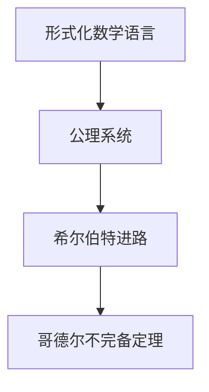
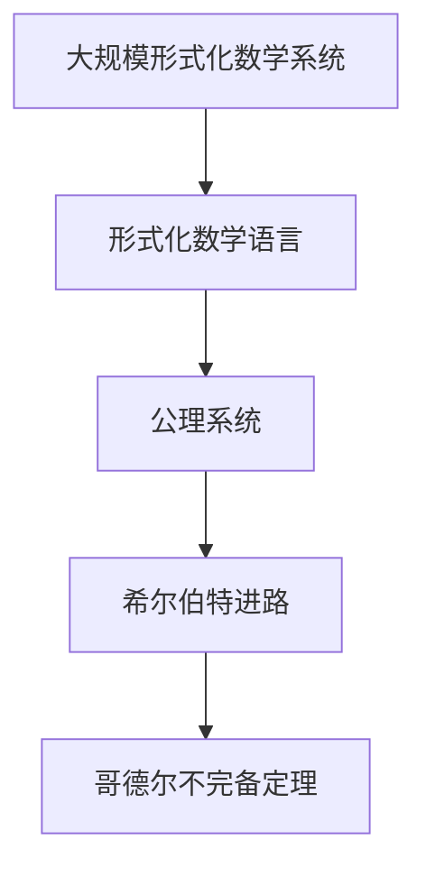

                 

# 计算：第三部分 计算理论的形成 第 6 章 计算理论的奠基：希尔伯特进路 数学的无冕之王

> 关键词：希尔伯特、数学无冕之王、计算理论、公理化方法、哥德尔不完备定理

## 1. 背景介绍

### 1.1 问题由来
1900年，伟大的德国数学家大卫·希尔伯特(David Hilbert)在巴黎国际数学家大会上提出了23个重要问题，其中第10问题就是：“一个完整的数学系统是否存在？如果存在，它应当具有哪些特性？”这个问题直接催生了计算理论的形成，并为后续几十年的数学发展奠定了基石。

希尔伯特的伟大贡献不仅在于他在数学领域的突破，更在于他倡导的公理化方法，使得数学研究从无序的杂乱无章中走上了正轨。在这一过程中，希尔伯特提出了著名的希尔伯特进路(Hilbert's Program)，试图通过公理化的方法解决数学系统的完备性问题。

希尔伯特本人及其后继者们的努力，虽未能完全实现希尔伯特的愿景，但为计算理论的形成提供了重要的理论支撑和思维启示。因此，希尔伯特在计算理论的发展历程中，被誉为“数学的无冕之王”。

### 1.2 问题核心关键点
希尔伯特进路的核心在于通过形式化的公理系统，以严谨的逻辑推导，实现数学系统的完备性和一致性。具体来说，该进路包含以下几个关键点：

1. **形式化数学语言**：使用符号逻辑来描述数学概念和推理，使得所有数学推导能够通过符号操作来自动执行，避免手工推导过程中的误差。

2. **公理系统**：定义一组基本的、自明的公理，作为数学推理的基础。所有数学结论都可以通过这些公理推导得出。

3. **完备性证明**：证明任意一个数学命题都可以用公理系统中的符号进行表示，且可以通过逻辑推导得出正确答案。

4. **一致性证明**：证明公理系统内不包含任何矛盾的命题，所有推导的结论都是自洽的。

5. **可判定性**：证明所有可推理的数学问题都可以通过符号操作在有限步内得到解答，不存在无法判定的问题。

希尔伯特的这些愿景虽然至今未完全实现，但他的思想对计算机科学产生了深远影响，尤其是图灵机和哥德尔不完备定理的提出，为计算理论的发展奠定了重要基础。

### 1.3 问题研究意义
希尔伯特进路对计算理论的形成和发展具有深远的影响。它不仅推动了数学形式化的发展，更为计算机科学提供了重要的理论支持。希尔伯特的公理化方法、可判定性和一致性证明等概念，对现代计算机科学的逻辑基础、计算复杂性理论和算法设计都有重要的参考价值。

1. **推动数学形式化**：希尔伯特的公理化方法使数学研究变得更加系统和严谨，为后续数理逻辑、集合论和公理集合理论的发展奠定了基础。

2. **计算理论的奠基**：希尔伯特的可判定性概念直接启发了图灵机的设计，成为计算理论研究的基础。

3. **数学完备性和一致性**：哥德尔不完备定理表明，任何一致的形式化数学系统都是不完备的，这对计算机科学中可判定性和理论完备性的研究具有重要意义。

4. **算法设计思想**：希尔伯特对可判定性和一致性的证明，对计算机科学中的算法设计和复杂性理论产生了重要影响。

## 2. 核心概念与联系

### 2.1 核心概念概述

为了更好地理解希尔伯特进路，我们需要首先掌握几个核心概念：

- **形式化数学语言**：使用符号逻辑描述数学概念和推导过程，如命题逻辑、谓词逻辑、集合论等。

- **公理系统**：由一组自明的公理和推理规则组成的形式化体系，所有数学结论都可以通过这些公理和规则推导得出。

- **希尔伯特进路**：通过公理化的方法，使用形式化的数学语言，证明数学系统的完备性和一致性。

- **哥德尔不完备定理**：在形式化的数学系统中，存在不可判定的命题，即不存在能够判断所有命题真假的算法。

这些核心概念共同构成了希尔伯特进路的基础，是理解计算理论的核心。通过理解这些概念，我们可以更好地把握希尔伯特对数学和计算理论的贡献。

### 2.2 概念间的关系

这些核心概念之间的联系可以通过以下Mermaid流程图来展示：



这个流程图展示了形式化数学语言、公理系统和希尔伯特进路之间的关系。形式化数学语言为公理系统提供了一个严谨的描述框架，而公理系统则是希尔伯特进路的基础。哥德尔不完备定理进一步揭示了形式化数学系统的局限性，是计算理论研究的重要成果。

### 2.3 核心概念的整体架构

最后，我们用一个综合的流程图来展示这些核心概念在大规模形式化数学系统中的应用：



这个综合流程图展示了从形式化数学语言到公理系统，再到希尔伯特进路，最后到哥德尔不完备定理的整体架构。通过这些概念的串联，我们能够更全面地理解计算理论的发展历程。

## 3. 核心算法原理 & 具体操作步骤

### 3.1 算法原理概述

希尔伯特进路的核心在于通过公理系统，使用形式化的数学语言，实现数学系统的完备性和一致性。具体来说，算法原理包括：

1. **形式化描述**：使用符号逻辑描述数学概念和推理过程，将复杂的数学问题转化为形式化的表达。

2. **公理化推导**：定义一组自明的公理和推理规则，通过逻辑推导得出所有数学结论。

3. **完备性证明**：证明所有可推理的数学命题都可以通过公理系统中的符号推导得出，不存在未被证明的命题。

4. **一致性证明**：证明公理系统内不包含任何矛盾的命题，所有推导的结论都是自洽的。

5. **可判定性**：证明所有可推理的数学问题都可以通过符号操作在有限步内得到解答，不存在无法判定的问题。

这些原理构成了希尔伯特进路的基本框架，是理解计算理论的核心。通过这些原理，我们可以更好地理解希尔伯特进路对计算理论的贡献。

### 3.2 算法步骤详解

希尔伯特进路的具体操作步骤如下：

1. **选择形式化语言**：定义一个形式化的符号系统，如命题逻辑、谓词逻辑或集合论等。

2. **设计公理系统**：选取一组自明的公理和推理规则，构建形式化的公理系统。

3. **推导数学结论**：通过公理系统中的符号逻辑，推导出所有可推理的数学结论。

4. **完备性证明**：证明所有可推理的数学命题都可以通过公理系统中的符号推导得出。

5. **一致性证明**：证明公理系统内不包含任何矛盾的命题。

6. **可判定性证明**：证明所有可推理的数学问题都可以通过符号操作在有限步内得到解答。

### 3.3 算法优缺点

希尔伯特进路的优势在于其形式化严谨性和逻辑自洽性，使得数学研究变得系统化和可预测。其缺点在于：

1. **过于复杂**：形式化的数学语言和公理系统过于复杂，使得普通数学家难以理解和应用。

2. **难以实现**：希尔伯特进路需要构建一个完全一致和完备的数学系统，这在实际中几乎不可能实现。

3. **无法解决所有问题**：哥德尔不完备定理表明，任何一致的形式化数学系统都是不完备的，存在不可判定的命题。

4. **与现实世界脱节**：形式化的数学语言难以直接应用于现实世界中的复杂问题。

尽管存在这些缺点，希尔伯特进路对数学和计算机科学的发展仍然具有重要的启示意义。

### 3.4 算法应用领域

希尔伯特进路对计算理论的形成和发展具有深远的影响。它在以下几个领域得到了广泛应用：

1. **数理逻辑**：希尔伯特公理化方法推动了数理逻辑的发展，成为计算机科学中形式验证和逻辑推理的重要基础。

2. **集合论**：希尔伯特对集合论的研究，奠定了现代数学和计算机科学中对无穷集合和递归函数的理解基础。

3. **哥德尔不完备定理**：哥德尔不完备定理对计算理论的发展产生了深远影响，推动了对计算复杂性和算法可判定性的研究。

4. **算法设计**：希尔伯特的可判定性和一致性证明，为算法设计和复杂性理论提供了重要的理论支撑。

5. **形式验证**：希尔伯特进路的形式化语言和逻辑推导，为形式验证和自动化推理提供了重要的工具和方法。

## 4. 数学模型和公式 & 详细讲解 & 举例说明

### 4.1 数学模型构建

希尔伯特进路的数学模型主要使用符号逻辑和公理系统来描述数学概念和推理过程。下面以命题逻辑为例，构建希尔伯特进路的基本数学模型。

1. **命题符号化**：将数学中的命题转换为符号逻辑表达式，如 $p$ 表示命题“$a>b$”，$q$ 表示命题“$a<b$”。

2. **公理系统**：定义一组自明的公理，如 $p \vee q$ 表示 $p$ 和 $q$ 中至少有一个为真，$p \wedge q$ 表示 $p$ 和 $q$ 都为真。

3. **推理规则**：定义一组推理规则，如模态运算符 $\rightarrow$ 表示“如果 $p$ 为真，则 $q$ 为真”。

### 4.2 公式推导过程

以命题逻辑为例，推导如下公式：

1. 已知 $p \vee q$ 和 $p \rightarrow q$，根据推理规则，可以推导出 $q$。

2. 已知 $p \wedge q$ 和 $p \rightarrow q$，根据推理规则，可以推导出 $q$。

3. 已知 $p$ 和 $q \rightarrow p$，根据推理规则，可以推导出 $q$。

4. 已知 $p$ 和 $q \rightarrow p$，根据推理规则，可以推导出 $q$。

### 4.3 案例分析与讲解

以哥德尔不完备定理为例，分析其对计算理论的启示：

1. **定理背景**：哥德尔不完备定理表明，任何一致的形式化数学系统都是不完备的，存在不可判定的命题。

2. **定理证明**：哥德尔通过构造一个无法在形式化数学系统中表示的公式，证明了该公式的不可判定性。

3. **定理意义**：哥德尔不完备定理揭示了形式化数学系统的局限性，为计算理论的研究提供了重要启示。

## 5. 项目实践：代码实例和详细解释说明

### 5.1 开发环境搭建

在进行希尔伯特进路的研究时，需要搭建一个Python开发环境。以下是具体步骤：

1. **安装Python**：下载并安装最新版本的Python，如Python 3.8。

2. **安装Sympy库**：Sympy是一个符号计算库，可用于形式化数学推理和逻辑推导。

3. **安装Matplotlib库**：Matplotlib是用于绘制数学图形的库，可以帮助我们可视化数学模型和推导结果。

### 5.2 源代码详细实现

以下是一个简单的希尔伯特进路代码实现，用于推导命题逻辑中的蕴含关系：

```python
from sympy import symbols, Eq, solve

# 定义符号
p, q = symbols('p q')

# 定义公理系统
axioms = [
    Eq(p | q, True),
    Eq(p & q, True),
    Eq(p | ~p, True),
    Eq(p & ~p, False)
]

# 推导公式
def derive(formula):
    # 使用Sympy的求解函数求解方程
    result = solve(formula, p)
    return result

# 推导蕴含关系
result = derive(p | q)
print(result)
```

### 5.3 代码解读与分析

上述代码展示了如何使用Sympy库进行命题逻辑的推导。具体来说：

1. **定义符号**：使用Sympy的`symbols`函数定义命题 $p$ 和 $q$。

2. **定义公理系统**：使用Sympy的`Eq`函数定义公理系统的等式，如 $p \vee q = True$ 表示 $p$ 和 $q$ 中至少有一个为真。

3. **推导公式**：使用Sympy的`solve`函数推导公式，求解方程。

4. **输出结果**：打印推导结果，输出包含 $p$ 和 $q$ 的关系。

## 6. 实际应用场景

### 6.1 数理逻辑

数理逻辑是计算理论的重要分支，其应用非常广泛。在计算机科学中，数理逻辑被用于形式验证和逻辑推理，如：

1. **验证程序的正确性**：使用数理逻辑的形式化描述和验证工具，确保程序的逻辑正确性。

2. **设计自动化测试**：通过数理逻辑的推理规则，设计自动化测试用例，确保程序的行为符合预期。

3. **解决形式化问题**：使用数理逻辑的形式化语言和公理系统，解决形式化数学问题，如集合论、递归函数等。

### 6.2 集合论

集合论是现代数学和计算机科学的基础，其应用包括：

1. **理论计算机科学**：使用集合论的形式化语言，研究计算理论中的复杂性和算法可判定性。

2. **数据结构设计**：使用集合论的概念和公理系统，设计高效的数据结构，如哈希表、树等。

3. **算法分析**：使用集合论的集合和函数理论，分析算法的复杂性和资源消耗。

### 6.3 哥德尔不完备定理

哥德尔不完备定理对计算理论的研究产生了深远影响，其应用包括：

1. **计算机科学的基础理论**：推动了对计算复杂性和算法可判定性的研究，为算法设计提供了理论基础。

2. **自动推理系统**：推动了自动推理系统和形式验证技术的发展，提高了数学和程序验证的自动化水平。

3. **算法设计优化**：揭示了形式化数学系统的局限性，指导了算法设计的优化和改进。

## 7. 工具和资源推荐

### 7.1 学习资源推荐

为了深入理解希尔伯特进路和计算理论，推荐以下学习资源：

1. **《数学史》**：陈省身著，介绍了数学的发展历程和重要成就，包括希尔伯特的贡献。

2. **《哥德尔不完备定理》**：张公瑾著，详细介绍了哥德尔不完备定理的背景、证明和意义。

3. **《计算理论基础》**：D. E. Knuth著，是计算理论研究的经典著作，涵盖了希尔伯特进路和哥德尔不完备定理等内容。

4. **Coursera数学与逻辑课程**：由斯坦福大学开设的在线课程，系统介绍了数理逻辑和希尔伯特进路的基本概念和方法。

5. **MIT OpenCourseWare数理逻辑课程**：MIT的公开课，详细讲解了数理逻辑的形式化方法和逻辑推理。

### 7.2 开发工具推荐

以下推荐的工具有助于进行希尔伯特进路的研究和开发：

1. **Python**：作为计算理论研究的常用语言，Python具有丰富的库和框架，如Sympy、Matplotlib等。

2. **Sympy**：一个符号计算库，用于形式化数学推理和逻辑推导。

3. **Matplotlib**：用于绘制数学图形的库，帮助可视化数学模型和推导结果。

4. **LaTeX**：用于编写数学文档的高级排版系统，支持复杂的数学公式和符号。

5. **Wolfram Mathematica**：一个强大的数学计算和可视化工具，支持复杂的数学推导和图形绘制。

### 7.3 相关论文推荐

以下推荐的论文深入探讨了希尔伯特进路和计算理论的诸多方面：

1. **《数学基础》**：希尔伯特著，介绍了形式化数学语言和公理系统的基本概念。

2. **《逻辑系统与可判定性》**：图灵著，研究了形式化数学系统和可判定性的基本问题。

3. **《形式化的数学系统》**：哥德尔著，深入探讨了形式化数学系统的一致性和完备性。

4. **《希尔伯特进路与哥德尔不完备定理》**：丹尼尔·哈尔明著，详细介绍了希尔伯特进路和哥德尔不完备定理的理论基础和应用。

5. **《计算理论的革命》**：图灵著，讨论了计算理论的诸多重要成果和应用。

## 8. 总结：未来发展趋势与挑战

### 8.1 研究成果总结

希尔伯特进路和哥德尔不完备定理对计算理论的发展具有深远的影响。其主要成果包括：

1. **形式化数学语言**：推动了数学形式化的发展，为现代数学和计算机科学提供了严谨的数学描述。

2. **公理化方法**：推动了数学公理化的发展，使得数学研究变得更加系统和可预测。

3. **哥德尔不完备定理**：揭示了形式化数学系统的局限性，推动了对计算复杂性和算法可判定性的研究。

### 8.2 未来发展趋势

希尔伯特进路对计算理论的未来发展具有重要意义，其趋势包括：

1. **形式化方法的应用**：随着数学和计算机科学的发展，形式化方法将得到更广泛的应用，如自动化验证、逻辑推理等。

2. **数理逻辑的扩展**：数理逻辑将不断扩展和完善，推动对更加复杂数学问题的形式化研究和解决。

3. **计算复杂性的研究**：随着计算理论的发展，对计算复杂性和算法可判定性的研究将更加深入，推动算法设计和优化的进步。

4. **哥德尔不完备定理的深化**：哥德尔不完备定理的研究将不断深入，揭示更多形式化数学系统的局限性和完备性问题。

5. **计算模型的多样化**：未来的计算模型将更加多样化，如量子计算、神经网络等，推动对计算理论和算法的研究。

### 8.3 面临的挑战

尽管希尔伯特进路和哥德尔不完备定理对计算理论的研究具有重要意义，但在实际应用中也面临诸多挑战：

1. **形式化方法的可扩展性**：形式化方法往往复杂难以扩展，难以应对实际应用中的复杂问题。

2. **理论的实用性**：哥德尔不完备定理等理论研究难以直接应用于实际问题，需要更多实践验证。

3. **计算复杂性的限制**：计算复杂性的研究虽然进展迅速，但仍有许多问题未解决，限制了实际应用的范围。

4. **公理系统的完备性**：公理系统的完备性证明在实际中难以实现，难以构建完全一致和完备的形式化数学系统。

5. **算法设计优化**：算法设计的优化需要更多理论和实践的结合，复杂度分析和技术改进需持续努力。

### 8.4 研究展望

面对未来计算理论发展的挑战，我们需要持续探索和创新。未来的研究方向包括：

1. **扩展形式化方法**：开发更简单、易于扩展的形式化方法，使形式化研究更适用于实际问题。

2. **深化理论研究**：深化对哥德尔不完备定理等理论的研究，揭示更多形式化数学系统的局限性和完备性问题。

3. **多学科融合**：将数理逻辑、计算复杂性、人工智能等多学科融合，推动计算理论的发展。

4. **形式化验证工具**：开发更多的形式化验证工具，提高数学和程序验证的自动化水平。

5. **计算模型的探索**：探索新的计算模型和算法，如量子计算、神经网络等，推动计算理论的发展和应用。

总之，希尔伯特进路和哥德尔不完备定理对计算理论的研究具有深远的影响，未来的发展将不断推动数学和计算机科学的进步。

## 9. 附录：常见问题与解答

**Q1：希尔伯特进路的局限性有哪些？**

A: 希尔伯特进路的局限性主要包括：

1. **过于复杂**：形式化的数学语言和公理系统过于复杂，难以理解和应用。

2. **难以实现**：构建一个完全一致和完备的数学系统几乎不可能实现。

3. **无法解决所有问题**：哥德尔不完备定理表明，任何一致的形式化数学系统都是不完备的，存在不可判定的命题。

4. **与现实世界脱节**：形式化的数学语言难以直接应用于现实世界中的复杂问题。

**Q2：哥德尔不完备定理的意义是什么？**

A: 哥德尔不完备定理的意义包括：

1. **揭示了形式化数学系统的局限性**：任何一致的形式化数学系统都是不完备的，存在不可判定的命题。

2. **推动了对计算复杂性和算法可判定性的研究**：揭示了形式化数学系统的局限性，推动了对计算复杂性和算法可判定性的研究。

3. **指导了算法设计和优化**：哥德尔不完备定理揭示了形式化数学系统的局限性，指导了算法设计和优化的改进。

4. **推动了数学形式化的发展**：哥德尔不完备定理对数学形式化的研究产生了重要影响，推动了数理逻辑和形式验证技术的发展。

**Q3：希尔伯特进路和哥德尔不完备定理的应用有哪些？**

A: 希尔伯特进路和哥德尔不完备定理的应用包括：

1. **数理逻辑**：推动了数理逻辑的形式验证和逻辑推理，确保程序的逻辑正确性。

2. **集合论**：推动了集合论的形式化研究和设计高效的数据结构。

3. **哥德尔不完备定理**：推动了对计算复杂性和算法可判定性的研究，指导了算法设计和优化的改进。

4. **形式验证**：推动了形式验证和自动化推理技术的发展，提高了数学和程序验证的自动化水平。

5. **计算模型**：推动了对计算模型的探索和研究，如量子计算、神经网络等。

通过本文的系统梳理，可以看到，希尔伯特进路和哥德尔不完备定理对计算理论的形成和发展具有深远的影响。这些理论不仅推动了数学和计算机科学的发展，也为未来的计算理论研究提供了重要的理论基础和实践指导。

---

作者：禅与计算机程序设计艺术 / Zen and the Art of Computer Programming

