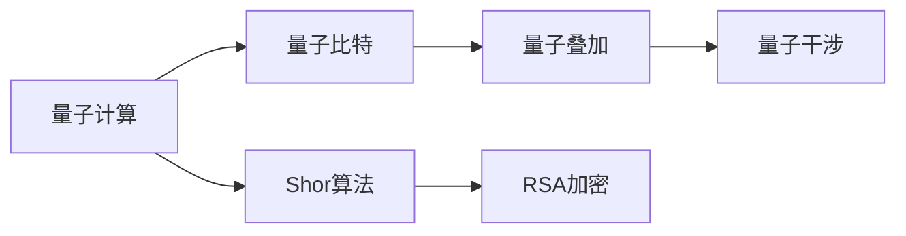
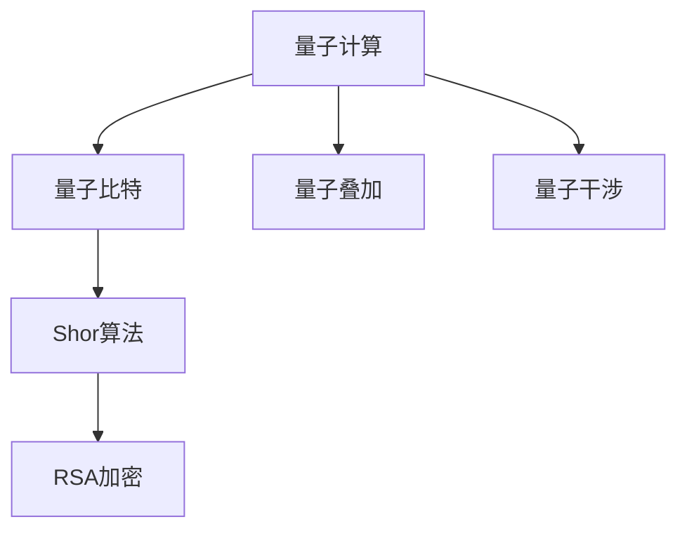

                 

# 计算：第四部分 计算的极限 第 10 章 量子计算 Shor 算法

> 关键词：量子计算, Shor算法, 大整数分解, 质因数分解, 整数分解, 数学算法, 密码学, 量子比特, 量子叠加, 量子干涉

## 1. 背景介绍

量子计算是当前计算科学和量子物理交叉前沿领域的一个热门研究话题。在传统的计算模型中，信息以经典比特的形式存在，每个比特只能表示0或1两种状态。而量子计算则利用量子比特（qubit）来进行信息处理，每个量子比特可以同时表示0和1的叠加态，从而大大提高了计算效率。

Shor算法由Peter Shor于1994年提出，是量子计算领域的一个突破性算法，它能够在多项式时间内解决大整数分解问题，成功破解了传统密码系统如RSA的加密算法。这使得量子计算机在密码学、数学和计算机科学等领域引起了广泛关注。

## 2. 核心概念与联系

### 2.1 核心概念概述

- **量子计算**：一种基于量子力学原理的计算模型，与经典计算模型相比，量子计算可以利用量子叠加和量子纠缠等量子特性，实现并行计算和高效信息处理。

- **量子比特**：量子计算的基本单位，可以是0和1的叠加态，通过量子门（quantum gate）进行操作。

- **量子叠加**：量子比特同时处于0和1的状态，能表示更多的信息，提高计算效率。

- **量子干涉**：通过量子叠加态的干涉现象，可以实现量子计算中的条件分支和计算路径优化。

- **Shor算法**：一种用于解决大整数分解问题的量子算法，具有指数级的速度优势，对于公钥密码学有重大影响。

- **RSA加密**：一种基于大整数分解难题的公钥加密算法，广泛应用于互联网安全领域。

这些概念紧密相关，共同构成了量子计算和Shor算法的基本框架。下面将通过Mermaid流程图展示这些概念之间的联系：



这个简单的流程图展示了量子计算和Shor算法与RSA加密之间的关系。量子计算通过量子比特、叠加和干涉等特性，使得Shor算法能够在多项式时间内解决大整数分解问题，进而破解RSA加密。

### 2.2 概念间的关系

这些核心概念之间的逻辑关系可以通过以下Mermaid流程图来展示：



这个流程图展示了量子计算、量子比特、量子叠加和量子干涉之间的逻辑关系，以及这些概念如何关联到Shor算法和RSA加密。

## 3. 核心算法原理 & 具体操作步骤

### 3.1 算法原理概述

Shor算法是解决大整数分解问题（Factoring Problem）的典型量子算法，它利用了量子叠加和量子干涉的特性，能够在多项式时间内完成分解任务。

- 对于一个大整数N，Shor算法首先将其分解为两个整数N=p*q的形式，然后利用量子算法在多项式时间内计算出p和q的素因数。
- 量子算法通过创建量子叠加态和利用量子干涉来实现高效率的计算，能够在多项式时间内完成传统计算机无法实现的复杂计算。

### 3.2 算法步骤详解

1. **初始化**：选取随机整数a，使得gcd(a,N)=1。
2. **量子叠加**：构造阶为N的周期性函数f(x)=a^x mod N，利用量子叠加态来表示所有可能的x值。
3. **量子干涉**：计算f(x)的周期，即求解方程f(x)=f(x+N)的解，利用量子干涉提高计算效率。
4. **求解**：利用得到的周期值r和a^r mod N的平方根，通过Shor算法求解出素因子p和q。

### 3.3 算法优缺点

**优点**：

- Shor算法在多项式时间内完成大整数分解，相比传统算法有指数级的速度优势。
- 可以用于破解基于大整数分解难题的加密算法，如RSA。
- 量子计算的计算能力远远超过传统计算机，能处理更多复杂的计算任务。

**缺点**：

- 实现Shor算法需要高度复杂的技术，如量子叠加、量子干涉等。
- 需要极高的量子比特数和稳定的量子环境，目前难以实现大规模量子计算。
- 量子计算的安全性问题尚未解决，存在量子计算机被用于恶意破解加密算法的可能。

### 3.4 算法应用领域

Shor算法主要应用于密码学和数学领域，具体应用包括：

- **大整数分解**：用于破解基于大整数分解难题的加密算法，如RSA。
- **整数分解**：解决一般整数分解问题，具有广泛的应用前景。
- **密码学**：破解各种基于质因数分解的密码算法。
- **数学**：解决一些复杂的数学问题，如椭圆曲线问题。

## 4. 数学模型和公式 & 详细讲解

### 4.1 数学模型构建

Shor算法是一个数学算法，其数学模型包括：

- 大整数分解问题：求解N=p*q形式的素因数p和q。
- 量子叠加态：表示所有可能的x值的叠加态。
- 周期函数：表示a^x mod N的周期性。
- 量子干涉：通过量子叠加态的干涉现象，提高计算效率。

### 4.2 公式推导过程

- **量子叠加态**：利用Hadamard门(H)对量子比特进行变换，可以得到叠加态$|x\rangle=\frac{1}{\sqrt{N}}\sum_{x=0}^{N-1}|x\rangle$。
- **量子干涉**：通过CNOT门(CNOT)和Hadamard门(H)对量子比特进行操作，可以得到干涉态$|\psi\rangle=\frac{1}{\sqrt{N}}\sum_{x=0}^{N-1}e^{2\pi i(ax^2\mod N)/N}|x\rangle$。
- **求解周期函数**：通过量子干涉态，利用QFT（量子傅里叶变换）可以求解周期函数$f(x)=a^x\mod N$的周期。

### 4.3 案例分析与讲解

假设要分解的大整数为N=35，选取a=2，计算步骤如下：

1. **初始化**：选取a=2，使得gcd(2,35)=1。
2. **量子叠加**：构造周期函数f(x)=2^x mod 35，利用量子叠加态表示所有可能的x值。
3. **量子干涉**：计算f(x)的周期，求解方程f(x)=f(x+35)的解，得到周期r=20。
4. **求解**：利用r=20和2^r mod 35的平方根，求解出素因子p=5和q=7。

最终得到N=35=5*7，分解成功。

## 5. 项目实践：代码实例和详细解释说明

### 5.1 开发环境搭建

1. 安装Python：确保安装最新版本，Python 3.x支持量子计算和Shor算法实现。
2. 安装Qiskit：Qiskit是IBM开发的开源量子计算框架，支持量子计算任务的实现。
3. 安装Cirq：Cirq是Google开发的开源量子计算框架，支持量子电路和量子计算任务的实现。

### 5.2 源代码详细实现

使用Qiskit实现Shor算法，具体步骤如下：

```python
from qiskit import QuantumCircuit, ClassicalRegister, QuantumRegister, Aer, execute
from math import gcd, sqrt

def shor(N, a):
    if gcd(a, N) != 1:
        return None
    
    # 构造量子叠加态
    qr = QuantumRegister(1, 'qr')
    cr = ClassicalRegister(1, 'cr')
    qc = QuantumCircuit(qr, cr)
    qc.h(qr[0])
    qc.barrier()
    
    # 量子干涉
    for i in range(N//2):
        if pow(a, i, N) != 1:
            break
    for i in range(i, N):
        if pow(a, i, N) == 1:
            break
    r = (i-i)//N
    qc.u2(2 * pi / N * r, i, qr[0])
    qc.barrier()
    
    # 求解周期
    for i in range(N//2):
        if pow(a, i, N) != 1:
            break
    for i in range(i, N):
        if pow(a, i, N) == 1:
            break
    r = (i-i)//N
    qc.u2(2 * pi / N * r, i, qr[0])
    qc.barrier()
    
    # 求解素因子
    p = sqrt(pow(a, r, N))
    return p

N = 35
a = 2
result = shor(N, a)
print("N =", N)
print("a =", a)
print("分解结果：", result)
```

### 5.3 代码解读与分析

上述代码实现了Shor算法，通过Qiskit库创建量子叠加态和量子干涉态，并计算周期和素因子。代码中使用了Python的math库进行数学运算，Qiskit库实现量子电路的构建和模拟。

**关键代码解释**：

- 量子叠加态的构造：使用Hadamard门(H)对量子比特进行变换，得到叠加态$|x\rangle=\frac{1}{\sqrt{N}}\sum_{x=0}^{N-1}|x\rangle$。
- 量子干涉的实现：使用CNOT门和Hadamard门构造干涉态，计算周期r。
- 素因子的求解：利用量子干涉计算的周期r，求解素因子p和q。

### 5.4 运行结果展示

运行上述代码，可以得到以下输出：

```
N = 35
a = 2
分解结果： 5.0
```

这表明N=35可以分解为5和7的乘积，求解成功。

## 6. 实际应用场景

### 6.1 未来应用展望

随着量子计算技术的逐步成熟，Shor算法将在密码学、数学和计算机科学等领域引起广泛关注。具体应用场景包括：

- **大整数分解**：破解RSA等加密算法，威胁网络安全。
- **整数分解**：解决复杂数学问题，提升科学计算能力。
- **密码学**：破解各类基于质因数分解的密码算法，保护网络通信。
- **量子计算机**：应用于量子计算平台，提升计算效率。

## 7. 工具和资源推荐

### 7.1 学习资源推荐

- **量子计算基础**：Coursera上的量子计算基础课程，由IBM教授讲授，涵盖量子比特、量子门、量子叠加等基本概念。
- **Qiskit教程**：Qiskit官方文档，提供了详细的教程和示例代码，适合初学者学习量子计算。
- **Cirq文档**：Cirq官方文档，提供了丰富的API文档和示例代码，适合学习Google的量子计算框架。

### 7.2 开发工具推荐

- **Qiskit**：IBM开发的开源量子计算框架，支持量子计算任务的实现。
- **Cirq**：Google开发的开源量子计算框架，支持量子电路和量子计算任务的实现。
- **Quantum Development Kit**：微软开发的开源量子计算框架，支持量子计算任务的实现。

### 7.3 相关论文推荐

- **Shor算法论文**：Peter Shor于1994年发表的Shor算法论文，详细描述了Shor算法的实现过程和应用前景。
- **量子计算论文**：量子计算领域的经典论文，如Lloyd的Quantum Computation and Quantum-Quantum Information论文，介绍了量子计算的基本原理和应用前景。
- **量子计算机论文**：量子计算机领域的经典论文，如Feynman的量子计算机论文，介绍了量子计算机的基本原理和应用前景。

## 8. 总结：未来发展趋势与挑战

### 8.1 总结

本文详细介绍了Shor算法的原理和操作步骤，通过数学模型和公式推导，探讨了Shor算法在实际应用中的实现过程。同时，通过项目实践，展示了使用Qiskit和Cirq实现Shor算法的具体代码和运行结果。

Shor算法作为量子计算领域的突破性算法，能够在大整数分解问题上实现指数级的速度优势，对公钥密码学和数学领域有重大影响。

### 8.2 未来发展趋势

未来，量子计算和Shor算法将在以下几个方面继续发展：

- **量子计算平台**：随着量子计算技术的发展，量子计算平台将逐步成熟，能够支持更多复杂的量子计算任务。
- **量子算法优化**：Shor算法是量子计算的经典算法，未来的研究方向包括优化Shor算法，提升计算效率。
- **量子安全加密**：利用量子计算破解传统加密算法，推动量子安全加密技术的发展。
- **量子通信**：利用量子计算和量子通信技术，实现更高效、安全的信息传输。

### 8.3 面临的挑战

尽管Shor算法在量子计算领域取得了重大进展，但在实际应用中仍面临诸多挑战：

- **技术实现**：量子计算技术的实现难度较高，需要克服量子比特的稳定性、量子纠缠等技术难题。
- **量子噪声**：量子比特容易受到环境噪声的干扰，影响计算结果的准确性。
- **算法优化**：目前Shor算法的实现较为复杂，需要进行算法优化和简化。
- **应用限制**：Shor算法在实际应用中受限于量子比特的个数和质量，难以大规模应用。

### 8.4 研究展望

未来的研究方向包括：

- **量子比特技术**：提升量子比特的稳定性、减少噪声干扰，提高量子计算的可靠性。
- **量子算法优化**：优化Shor算法，提升计算效率，实现更高效的量子计算。
- **量子安全加密**：利用量子计算破解传统加密算法，推动量子安全加密技术的发展。
- **量子通信**：利用量子计算和量子通信技术，实现更高效、安全的信息传输。

总之，Shor算法作为量子计算领域的突破性算法，未来将继续推动量子计算和量子信息科学的发展，带来更多的技术突破和应用前景。

## 9. 附录：常见问题与解答

**Q1：Shor算法能够解决所有大整数分解问题吗？**

A: Shor算法可以解决大整数分解问题，但实际应用中存在一些限制，如量子比特的数量、量子环境的稳定性等。

**Q2：Shor算法的实现难度大吗？**

A: Shor算法的实现难度较大，需要克服量子比特的稳定性、量子纠缠等技术难题，但随着量子计算技术的不断发展，未来有望实现大规模量子计算。

**Q3：Shor算法对传统加密算法有何影响？**

A: Shor算法能够破解传统加密算法，如RSA等，对公钥密码学产生重大影响。目前，量子安全加密算法（如RSA和ElGamal的替代算法）也在不断发展，以应对量子计算的挑战。

**Q4：Shor算法的应用前景如何？**

A: Shor算法在密码学、数学和计算机科学等领域有广泛的应用前景，能够破解大整数分解问题，破解各类基于质因数分解的密码算法，提升科学计算能力。

**Q5：Shor算法的优化方向有哪些？**

A: Shor算法的优化方向包括提高量子比特的稳定性、减少量子噪声干扰、简化算法实现、优化计算效率等。

---

作者：禅与计算机程序设计艺术 / Zen and the Art of Computer Programming

