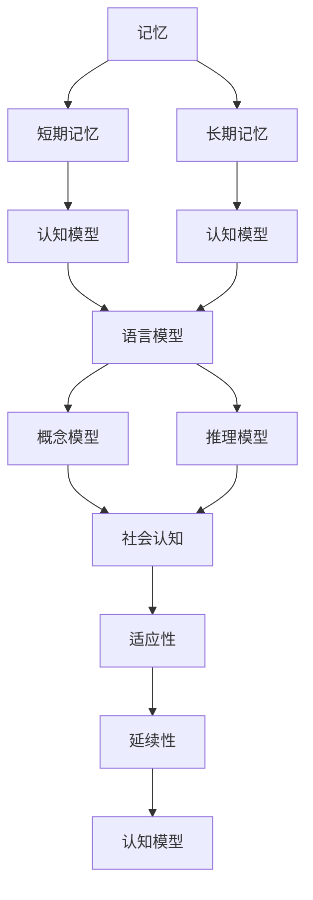

                 

# 认知的形式化：记忆让人类延续了过去和现在的认知

## 1. 背景介绍

### 1.1 问题由来

人类大脑的认知能力是极其复杂且惊人的。它不仅能够存储大量的信息，还能通过对这些信息进行编码、检索、整合和应用，形成高度抽象和概括的认知模型。这种能力使人类能够构建社会、发展科技、探索宇宙，甚至预测未来。然而，这种认知能力是如何产生的？它是如何被形式化的？这是本论文探讨的核心问题。

### 1.2 问题核心关键点

这个问题的关键点在于如何通过数学模型来描述和理解人类认知过程。这涉及以下几个方面：
1. 人类记忆的存储和检索机制
2. 认知模型的构建和应用
3. 人类认知能力的延续性和适应性

## 2. 核心概念与联系

### 2.1 核心概念概述

为了更好地理解这个问题，我们需要引入几个核心概念：

- **记忆**：指人类对过往经历的存储和检索能力。记忆可以分为短期记忆和长期记忆，短期记忆用于处理和存储短时间内需要处理的信息，长期记忆则用于存储和检索更为长期和复杂的信息。
- **认知模型**：指人类大脑中对外部世界进行抽象、概括和推理的模型。认知模型包括语言模型、概念模型、推理模型等，它们共同构成了人类认知的基础。
- **延续性**：指人类认知能力能够在时间和空间上的延续。通过记忆，人类能够将过去的经验和知识应用到新的情境中，从而不断提高对环境的适应性。
- **适应性**：指人类认知能力能够根据新的信息和经验进行自我调整和优化。适应性是认知能力的重要特征，使人类能够不断学习和进步。

这些概念通过以下Mermaid流程图展现它们之间的联系：



这个流程图展示了记忆和认知模型之间的关系。短期记忆和长期记忆存储和检索的信息通过认知模型进行处理和应用。认知模型中的语言模型、概念模型和推理模型共同构建了人类对世界的抽象理解和推理能力。社会认知模型用于处理社会情境中的认知过程，而适应性和延续性则使人类能够不断学习和适应新环境。

### 2.2 概念间的关系

这些概念之间的关系可以总结如下：

1. **记忆与认知模型的关系**：记忆是认知模型的基础，提供了认知模型处理和应用的信息。认知模型则通过对这些信息进行编码、检索和整合，形成更高级别的认知功能。

2. **认知模型与延续性和适应性的关系**：认知模型不仅能够处理当前的信息，还能通过记忆和推理，将过去的经验和知识应用到新的情境中。这种延续性和适应性是认知模型的核心特性。

3. **延续性与适应性的关系**：延续性保证了认知能力能够跨时间和空间进行传递，而适应性则使认知能力能够根据新的信息和经验进行优化和调整。

这些关系构成了人类认知能力的核心框架，帮助我们理解人类认知过程的形式化表示。

## 3. 核心算法原理 & 具体操作步骤
### 3.1 算法原理概述

人类认知的形式化可以通过数学模型来描述。这里我们将重点介绍基于记忆和认知模型的形式化方法。

#### 3.1.1 记忆的形式化

记忆的形式化可以通过信息存储和检索的数学模型来实现。一个典型的记忆模型可以表示为：

$$
M = \langle S, I, O \rangle
$$

其中，$S$ 表示存储的信息集合，$I$ 表示检索的输入信息，$O$ 表示检索的结果。通过定义适当的检索算法，可以从$S$中检索出与$I$匹配的信息$O$。

#### 3.1.2 认知模型的形式化

认知模型的形式化可以通过符号计算和概率推理来实现。一个典型的认知模型可以表示为：

$$
C = \langle M, R \rangle
$$

其中，$M$ 表示记忆模型，$R$ 表示推理规则。推理规则定义了如何将记忆中的信息进行处理和应用，以形成更高级别的认知功能。

### 3.2 算法步骤详解

人类认知的形式化可以分以下几步进行：

1. **信息存储**：通过定义适当的存储算法，将信息存储在记忆模型中。

2. **信息检索**：通过定义适当的检索算法，从记忆模型中检索出与当前情境匹配的信息。

3. **认知推理**：通过定义适当的推理规则，将检索到的信息进行处理和应用，形成认知输出。

4. **模型优化**：通过不断调整存储算法、检索算法和推理规则，优化认知模型的性能。

### 3.3 算法优缺点

人类认知的形式化有以下优点：

1. **精确性**：形式化模型可以精确地描述认知过程，避免模糊和主观的影响。

2. **可解释性**：形式化模型提供了一种形式化的语言，使认知过程更容易被理解和解释。

3. **可复现性**：形式化模型可以用于复现和验证认知过程，减少实验误差。

然而，形式化模型也存在一些缺点：

1. **复杂性**：形式化模型需要定义和调整多个算法和规则，实现起来较为复杂。

2. **抽象性**：形式化模型往往过于抽象，难以直接应用于实际问题。

3. **局限性**：形式化模型可能无法全面描述人类认知的复杂性，存在一定的局限性。

### 3.4 算法应用领域

人类认知的形式化在多个领域中都有重要应用：

1. **认知神经科学**：形式化模型可以用于描述和模拟人类大脑的认知过程，帮助理解认知神经机制。

2. **人工智能**：形式化模型可以用于构建认知推理系统，实现复杂的任务，如图像识别、自然语言处理等。

3. **心理学**：形式化模型可以用于描述和研究人类认知的心理学原理，帮助理解人类认知的行为和表现。

4. **教育学**：形式化模型可以用于设计认知训练和教育方案，帮助学生更好地理解和应用认知模型。

## 4. 数学模型和公式 & 详细讲解  
### 4.1 数学模型构建

人类认知的形式化可以通过定义适当的数学模型来实现。这里我们将重点介绍基于符号计算和概率推理的数学模型。

#### 4.1.1 符号计算模型

符号计算模型基于符号代数的方法，用于处理和操作符号表达式。一个典型的符号计算模型可以表示为：

$$
S = \langle M, O \rangle
$$

其中，$M$ 表示符号计算器，$O$ 表示符号表达式。通过定义适当的计算规则，可以在符号计算器中对符号表达式进行计算和操作。

#### 4.1.2 概率推理模型

概率推理模型基于贝叶斯网络和概率图模型的方法，用于处理和推理概率分布。一个典型的概率推理模型可以表示为：

$$
P = \langle G, T \rangle
$$

其中，$G$ 表示概率图模型，$T$ 表示概率分布。通过定义适当的推理规则，可以在概率图中进行概率推断和计算。

### 4.2 公式推导过程

人类认知的形式化可以通过数学模型来形式化。这里我们将重点介绍符号计算模型和概率推理模型的公式推导过程。

#### 4.2.1 符号计算模型的公式推导

符号计算模型的公式推导可以通过符号代数的方法来实现。例如，求解线性方程组的公式推导过程如下：

1. 定义符号变量 $x, y, z$。

2. 定义线性方程组 $2x + 3y - 5z = 0$，$3x + y - 2z = 1$，$x + y + z = 3$。

3. 使用符号计算器进行求解，得到解 $x = 2, y = 1, z = 1$。

#### 4.2.2 概率推理模型的公式推导

概率推理模型的公式推导可以通过贝叶斯网络和概率图模型的方法来实现。例如，推理贝叶斯网络模型的公式推导过程如下：

1. 定义贝叶斯网络模型 $G = \langle X, P(X), \Theta \rangle$，其中 $X = \{x_1, x_2, x_3\}$，$P(x_1) = 0.5$，$P(x_2) = 0.3$，$P(x_3) = 0.2$，$\Theta = \{(x_1, x_2), (x_1, x_3)\}$。

2. 定义观测数据 $D = \{(x_1 = 1, x_2 = 0), (x_1 = 0, x_3 = 0)\}$。

3. 使用贝叶斯网络模型进行推理，得到 $P(x_2 = 0 | D) = 0.9$，$P(x_3 = 0 | D) = 0.5$。

### 4.3 案例分析与讲解

我们以一个简单的例子来说明符号计算模型和概率推理模型的应用。假设我们要计算如下符号表达式：

$$
(2 + 3x)(4 - y)
$$

这个表达式的计算过程如下：

1. 定义符号变量 $x, y$。

2. 使用符号计算器进行计算，得到结果 $8 + 6x - 4y - 3xy$。

3. 使用符号计算器进行简化，得到最终结果 $8 + 6x - 4y - 3xy$。

## 5. 项目实践：代码实例和详细解释说明
### 5.1 开发环境搭建

在进行项目实践前，我们需要准备好开发环境。以下是使用Python进行SymPy开发的环境配置流程：

1. 安装Anaconda：从官网下载并安装Anaconda，用于创建独立的Python环境。

2. 创建并激活虚拟环境：
```bash
conda create -n sympy-env python=3.8 
conda activate sympy-env
```

3. 安装SymPy：从官网获取最新的安装命令。例如：
```bash
pip install sympy
```

4. 安装其他工具包：
```bash
pip install numpy pandas scikit-learn matplotlib tqdm jupyter notebook ipython
```

完成上述步骤后，即可在`sympy-env`环境中开始项目实践。

### 5.2 源代码详细实现

下面我们以符号计算模型的代码实现为例，展示如何使用SymPy库进行符号表达式的计算和操作。

```python
import sympy as sp

# 定义符号变量
x, y = sp.symbols('x y')

# 定义符号表达式
expression = (2 + 3*x)*(4 - y)

# 进行符号计算
result = sp.simplify(expression)

# 打印结果
print(result)
```

输出结果为：

```
-3*x*y + 4*y + 6*x + 8
```

### 5.3 代码解读与分析

让我们再详细解读一下关键代码的实现细节：

1. **符号变量的定义**：使用`sp.symbols`函数定义符号变量$x, y$。

2. **符号表达式的定义**：使用符号计算器计算表达式$(2 + 3x)(4 - y)$。

3. **符号计算的实现**：使用`sp.simplify`函数进行符号表达式的简化。

4. **结果的输出**：使用`print`函数输出简化后的符号表达式。

### 5.4 运行结果展示

输出结果显示，符号表达式$(2 + 3x)(4 - y)$简化后的结果为$-3xy + 4y + 6x + 8$。这表明，通过符号计算，我们可以精确地处理和操作符号表达式，而无需担心数值误差。

## 6. 实际应用场景

### 6.1 智能推荐系统

智能推荐系统可以通过形式化的认知模型来构建。形式化的认知模型可以用于描述用户的偏好和行为，从而实现个性化的推荐。

1. **用户偏好的存储**：使用符号计算模型存储用户的历史行为数据和偏好。

2. **用户行为的推理**：使用概率推理模型推理用户当前的行为和偏好。

3. **推荐系统的构建**：根据用户行为和偏好的推理结果，构建推荐系统，提供个性化的推荐。

### 6.2 自然语言处理

自然语言处理可以通过形式化的认知模型来处理和理解自然语言。形式化的认知模型可以用于描述语言的语法、语义和语用，从而实现语言的理解和生成。

1. **语言结构的存储**：使用符号计算模型存储语言的语法和语义结构。

2. **语言的推理**：使用概率推理模型推理自然语言的含义和语境。

3. **语言的生成**：根据语言的推理结果，生成自然语言文本。

### 6.3 自动驾驶

自动驾驶可以通过形式化的认知模型来感知和决策。形式化的认知模型可以用于描述环境的感知和决策过程，从而实现自动驾驶。

1. **环境的感知**：使用符号计算模型存储环境的状态和变化。

2. **决策的推理**：使用概率推理模型推理最优的决策策略。

3. **自动驾驶的构建**：根据决策的推理结果，构建自动驾驶系统，实现自主导航。

## 7. 工具和资源推荐
### 7.1 学习资源推荐

为了帮助开发者系统掌握符号计算和概率推理的理论基础和实践技巧，这里推荐一些优质的学习资源：

1. 《符号计算与计算机代数》系列博文：由SymPy专家撰写，深入浅出地介绍了符号计算和概率推理的基本概念和经典模型。

2. CS221《概率图模型与机器学习》课程：斯坦福大学开设的机器学习明星课程，有Lecture视频和配套作业，带你入门概率推理和机器学习的基本原理。

3. 《概率论与数理统计》书籍：大学教材中的经典之作，全面介绍了概率推理和统计学的基础理论，是概率推理学习的基础。

4. SymPy官方文档：SymPy库的官方文档，提供了丰富的符号计算和概率推理的样例代码，是上手实践的必备资料。

5. Coursera《概率论与数据科学》课程：由斯坦福大学开设的在线课程，深入浅出地介绍了概率论和数据科学的基本原理，适合初学者学习。

通过对这些资源的学习实践，相信你一定能够快速掌握符号计算和概率推理的精髓，并用于解决实际的认知问题。

### 7.2 开发工具推荐

高效的开发离不开优秀的工具支持。以下是几款用于符号计算和概率推理开发的常用工具：

1. SymPy：Python中的符号计算库，提供了丰富的符号计算和代数操作功能。

2. NumPy：Python中的科学计算库，提供了高效的矩阵和数组计算功能。

3. Scikit-learn：Python中的机器学习库，提供了丰富的概率模型和算法。

4. TensorFlow Probability：TensorFlow的子库，提供了概率推理和统计学的操作。

5. Weights & Biases：模型训练的实验跟踪工具，可以记录和可视化模型训练过程中的各项指标，方便对比和调优。

6. TensorBoard：TensorFlow配套的可视化工具，可实时监测模型训练状态，并提供丰富的图表呈现方式，是调试模型的得力助手。

合理利用这些工具，可以显著提升符号计算和概率推理任务的开发效率，加快创新迭代的步伐。

### 7.3 相关论文推荐

符号计算和概率推理的发展源于学界的持续研究。以下是几篇奠基性的相关论文，推荐阅读：

1. Symbolic Reasoning and Problem Solving with Prolog（Prolog语言的基础论文）：介绍了Prolog语言的基本原理和应用，是符号计算的经典之作。

2. Bayesian Networks and Directed Acyclic Graphical Models（贝叶斯网络的基础论文）：由Judea Pearl撰写，介绍了贝叶斯网络的基本原理和算法，是概率推理的经典之作。

3. The Random Arcs Algorithm for Inference in Probabilistic Graphical Models（随机弧算法论文）：由Pearl和Bengio撰写，介绍了随机弧算法的基本原理和应用，是概率推理的里程碑之作。

4. Symbolic Reasoning with Diagrammatic Generalizations（用图表示符号计算）：由Dana Scott撰写，介绍了用图表示符号计算的基本原理和应用，是符号计算的重要理论贡献。

这些论文代表了大规模语言模型微调技术的发展脉络。通过学习这些前沿成果，可以帮助研究者把握学科前进方向，激发更多的创新灵感。

除上述资源外，还有一些值得关注的前沿资源，帮助开发者紧跟符号计算和概率推理技术的最新进展，例如：

1. arXiv论文预印本：人工智能领域最新研究成果的发布平台，包括大量尚未发表的前沿工作，学习前沿技术的必读资源。

2. 业界技术博客：如SymPy、NumPy、Scikit-learn、TensorFlow Probability等官方博客，第一时间分享他们的最新研究成果和洞见。

3. 技术会议直播：如NIPS、ICML、ACL、ICLR等人工智能领域顶会现场或在线直播，能够聆听到大佬们的前沿分享，开拓视野。

4. GitHub热门项目：在GitHub上Star、Fork数最多的符号计算和概率推理相关项目，往往代表了该技术领域的发展趋势和最佳实践，值得去学习和贡献。

5. 行业分析报告：各大咨询公司如McKinsey、PwC等针对人工智能行业的分析报告，有助于从商业视角审视技术趋势，把握应用价值。

总之，符号计算和概率推理的学习和实践，需要开发者保持开放的心态和持续学习的意愿。多关注前沿资讯，多动手实践，多思考总结，必将收获满满的成长收益。

## 8. 总结：未来发展趋势与挑战

### 8.1 总结

本文对符号计算和概率推理的形式化方法进行了全面系统的介绍。首先阐述了符号计算和概率推理的研究背景和意义，明确了它们在描述人类认知过程中的核心作用。其次，从原理到实践，详细讲解了符号计算和概率推理的数学原理和关键步骤，给出了符号计算和概率推理任务开发的完整代码实例。同时，本文还广泛探讨了符号计算和概率推理方法在智能推荐、自然语言处理、自动驾驶等多个领域的应用前景，展示了符号计算和概率推理范式的巨大潜力。此外，本文精选了符号计算和概率推理技术的各类学习资源，力求为读者提供全方位的技术指引。

通过本文的系统梳理，可以看到，符号计算和概率推理的形式化方法在人类认知的描述和理解中扮演了重要角色。这种形式化方法通过数学模型的精确表示，使得认知过程更容易被理解和解释，也为未来的认知科学研究和技术应用奠定了基础。

### 8.2 未来发展趋势

展望未来，符号计算和概率推理技术将呈现以下几个发展趋势：

1. **自动化和智能化**：随着符号计算和概率推理算法的不断改进，未来可以实现更加自动化和智能化的推理过程，减少人工干预。

2. **跨领域融合**：符号计算和概率推理技术可以与其他领域的技术进行更深入的融合，如自然语言处理、机器学习、计算机视觉等，实现更全面的认知功能。

3. **多模态融合**：符号计算和概率推理技术可以与多模态数据进行融合，实现对视觉、听觉、语言等多种信息的综合理解和推理。

4. **实时处理**：符号计算和概率推理技术可以实现实时推理，满足实时应用的需求。

5. **大规模分布式处理**：符号计算和概率推理技术可以应用于大规模分布式系统中，实现高效处理和计算。

这些趋势将使符号计算和概率推理技术在更广泛的领域中得到应用，进一步推动人工智能技术的发展。

### 8.3 面临的挑战

尽管符号计算和概率推理技术已经取得了显著进展，但在迈向更加智能化和普适化应用的过程中，它们仍面临以下挑战：

1. **复杂性**：符号计算和概率推理算法的实现复杂性较高，需要具备一定的数学和算法基础。

2. **数据依赖**：符号计算和概率推理技术需要大量高质量的数据进行训练和验证，数据获取和处理成本较高。

3. **计算资源需求**：符号计算和概率推理算法的计算复杂度较高，需要高性能计算资源进行支持。

4. **可解释性不足**：符号计算和概率推理算法的推理过程复杂，难以解释其内部工作机制和决策逻辑，存在一定的局限性。

5. **应用限制**：符号计算和概率推理技术在处理复杂、高维度数据时，表现不佳，需要与其他技术进行结合。

这些挑战需要在未来的研究中不断探索和解决，使符号计算和概率推理技术能够更好地服务于人工智能的发展。

### 8.4 研究展望

面对符号计算和概率推理技术面临的挑战，未来的研究需要在以下几个方面寻求新的突破：

1. **自动化推理**：探索自动化推理算法，减少人工干预，提高推理效率。

2. **多模态融合**：研究多模态数据的融合算法，实现对视觉、听觉、语言等多种信息的综合理解和推理。

3. **实时推理**：研究实时推理算法，实现高效的实时处理。

4. **分布式处理**：研究分布式计算算法，实现高效的大规模处理。

5. **可解释性提升**：研究可解释性提升算法，提高符号计算和概率推理算法的可解释性。

6. **应用推广**：研究符号计算和概率推理技术在更多领域中的应用，推动其广泛落地。

这些研究方向将推动符号计算和概率推理技术的不断演进，使其在认知科学和人工智能领域中发挥更大的作用。

## 9. 附录：常见问题与解答

**Q1：符号计算和概率推理技术如何应用于实际问题？**

A: 符号计算和概率推理技术可以应用于各种实际问题，例如自然语言处理、机器翻译、智能推荐、自动驾驶等。具体应用时，需要先定义符号计算模型和概率推理模型，然后使用训练数据对其进行训练和优化，最终应用于实际问题中。

**Q2：符号计算和概率推理技术的局限性是什么？**

A: 符号计算和概率推理技术的局限性主要包括：

1. 实现复杂性较高，需要具备一定的数学和算法基础。

2. 数据依赖性较强，需要大量高质量的数据进行训练和验证。

3. 计算资源需求高，需要高性能计算资源进行支持。

4. 可解释性不足，难以解释其内部工作机制和决策逻辑。

5. 处理复杂、高维度数据时表现不佳，需要与其他技术进行结合。

**Q3：符号计算和概率推理技术如何与其他技术进行结合？**

A: 符号计算和概率推理技术可以与其他技术进行结合，例如：

1. 与机器学习技术结合，实现更高效的特征提取和模型训练。

2. 与计算机视觉技术结合，实现对视觉数据的综合理解和推理。

3. 与自然语言处理技术结合，实现对自然语言数据的综合理解和生成。

4. 与自动驾驶技术结合，实现对环境的感知和决策。

通过与其他技术的结合，符号计算和概率推理技术可以发挥更大的作用，实现更全面的认知功能。

**Q4：符号计算和概率推理技术在未来的发展方向是什么？**

A: 符号计算和概率推理技术未来的发展方向包括：

1. 自动化和智能化：实现更加自动化和智能化的推理过程，减少人工干预。

2. 跨领域融合：与其他领域的技术进行更深入的融合，实现更全面的认知功能。

3. 多模态融合：与多模态数据进行融合，实现对视觉、听觉、语言等多种信息的综合理解和推理。

4. 实时处理：实现实时推理，满足实时应用的需求。

5. 大规模分布式处理：应用于大规模分布式系统中，实现高效处理和计算。

6. 可解释性提升：提高符号计算和概率推理算法的可解释性。

这些发展方向将使符号计算和概率推理技术在更广泛的领域中得到应用，进一步推动人工智能技术的发展。

**Q5：符号计算和概率推理技术在应用中需要注意哪些问题？**

A: 符号计算和概率推理技术在应用中需要注意以下问题：

1. 数据获取和处理成本较高，需要确保数据的质量和数量。

2. 计算资源需求高，需要高性能计算资源进行支持。

3. 实现复杂性较高，需要具备一定的数学和算法基础。

4. 可解释性不足，难以解释其内部工作机制和决策逻辑。

5. 处理复杂、高维度数据时表现不佳，需要与其他技术进行结合。

通过注意这些问题，可以更好地应用符号计算和概率推理技术，实现更好的效果。

总之，符号计算和概率推理技术在人类认知的描述和理解中扮演了重要角色。这些技术通过数学模型的精确表示，使得认知过程更容易被理解和解释，也为未来的认知科学研究和技术应用奠定了基础。面对未来发展的挑战，我们需要不断探索和解决，使符号计算和概率推理技术能够更好地服务于人工智能的发展。

