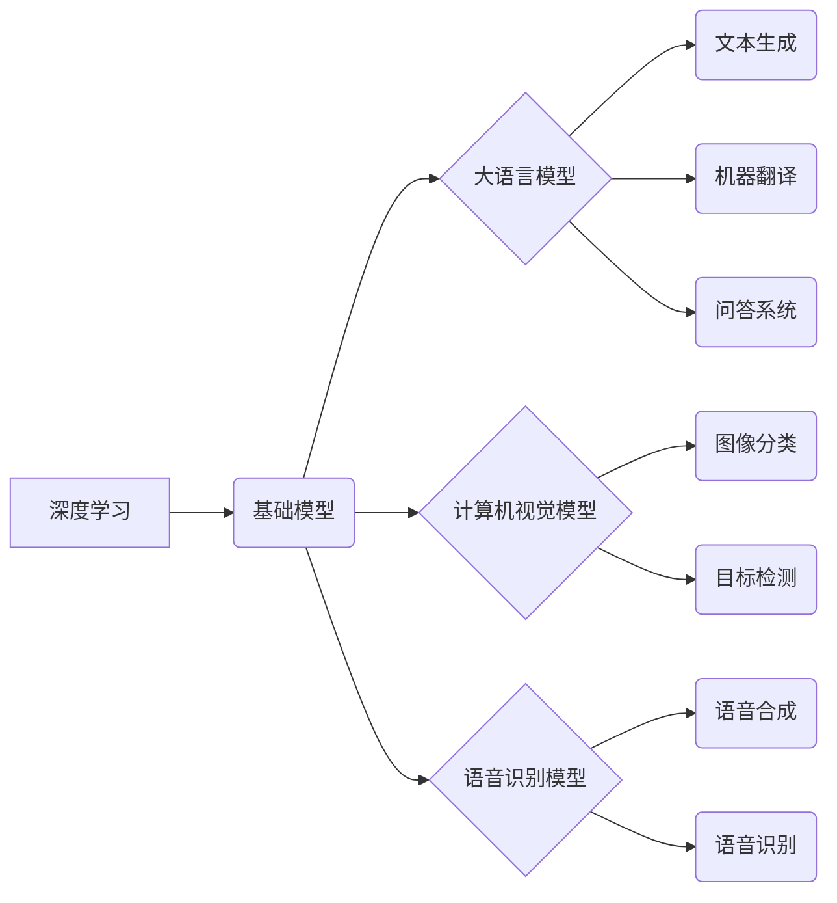

## 基础模型的技术生态系统

> 关键词：基础模型、大语言模型、深度学习、迁移学习、模型蒸馏、模型压缩、开源社区、应用场景

### 1. 背景介绍

近年来，深度学习技术取得了飞速发展，基础模型（Foundation Models）作为其重要组成部分，展现出强大的学习能力和泛化能力，在自然语言处理、计算机视觉、语音识别等领域取得了突破性进展。基础模型通常是指在海量数据上预训练的大规模深度学习模型，能够通过微调适应各种下游任务，从而降低了模型训练成本和时间，并提升了模型性能。

基础模型的兴起，标志着人工智能领域进入了一个新的时代。它不仅改变了传统机器学习的模式，也催生了一系列新的技术和应用场景。

### 2. 核心概念与联系

**2.1 核心概念**

* **基础模型 (Foundation Models):** 在海量数据上预训练的大规模深度学习模型，具备强大的泛化能力，能够适应各种下游任务。
* **大语言模型 (Large Language Models, LLMs):** 一类专门处理文本数据的基础模型，例如GPT-3、BERT、LaMDA等。
* **深度学习 (Deep Learning):** 一种机器学习方法，利用多层神经网络模拟人类大脑的学习过程。
* **迁移学习 (Transfer Learning):** 将预训练模型在源任务上的知识迁移到目标任务，提高目标任务的学习效率。
* **模型蒸馏 (Model Distillation):** 将大型模型的知识“蒸馏”到小型模型中，降低模型大小和计算成本。
* **模型压缩 (Model Compression):** 通过各种技术手段，减少模型参数量和计算复杂度，提高模型的效率。

**2.2 架构关系**



### 3. 核心算法原理 & 具体操作步骤

**3.1 算法原理概述**

基础模型的训练主要基于深度学习算法，例如Transformer、CNN、RNN等。这些算法通过多层神经网络结构，学习数据中的复杂模式和关系。

**3.2 算法步骤详解**

1. **数据预处理:** 将原始数据清洗、格式化，并转换为模型可理解的格式。
2. **模型构建:** 根据任务需求选择合适的深度学习架构，并定义模型参数。
3. **预训练:** 在海量数据上进行无监督学习，训练模型学习数据中的通用特征和知识。
4. **微调:** 将预训练模型应用于特定下游任务，通过少量标注数据进行微调，提升模型在目标任务上的性能。

**3.3 算法优缺点**

* **优点:**
    * 强大的泛化能力，能够适应各种下游任务。
    * 降低了模型训练成本和时间。
    * 提升了模型性能。
* **缺点:**
    * 需要海量数据进行预训练。
    * 计算资源需求高。
    * 存在潜在的偏差和安全风险。

**3.4 算法应用领域**

基础模型在各个领域都有广泛的应用，例如：

* **自然语言处理:** 文本生成、机器翻译、问答系统、情感分析等。
* **计算机视觉:** 图像分类、目标检测、图像生成等。
* **语音识别:** 语音转文本、语音合成等。
* **科学研究:** 蛋白质结构预测、药物发现等。

### 4. 数学模型和公式 & 详细讲解 & 举例说明

**4.1 数学模型构建**

基础模型通常基于神经网络架构，其数学模型可以表示为一个复杂的函数映射关系。

假设输入数据为 $x$, 输出数据为 $y$, 模型参数为 $\theta$, 则模型的数学表达式可以表示为：

$$y = f(x, \theta)$$

其中，$f$ 代表神经网络的激活函数，$\theta$ 代表模型的参数。

**4.2 公式推导过程**

模型参数的学习过程通常基于梯度下降算法，其目标是找到最优的参数 $\theta$, 使得模型输出与真实值之间的误差最小化。

梯度下降算法的核心思想是通过不断迭代更新模型参数，使得模型输出逐渐逼近真实值。

具体公式如下：

$$\theta = \theta - \alpha \frac{\partial Loss(y, f(x, \theta))}{\partial \theta}$$

其中，$\alpha$ 代表学习率，$Loss$ 代表损失函数，$\frac{\partial Loss(y, f(x, \theta))}{\partial \theta}$ 代表损失函数对模型参数的梯度。

**4.3 案例分析与讲解**

例如，在训练一个图像分类模型时，输入数据为图像像素值，输出数据为图像类别标签。

损失函数可以选用交叉熵损失函数，其目标是使得模型输出的类别概率分布与真实类别标签分布尽可能接近。

通过梯度下降算法，不断更新模型参数，使得模型能够准确地识别图像类别。

### 5. 项目实践：代码实例和详细解释说明

**5.1 开发环境搭建**

基础模型的开发通常需要使用深度学习框架，例如TensorFlow、PyTorch等。

需要安装相应的软件包和依赖库，并配置开发环境。

**5.2 源代码详细实现**

具体代码实现根据模型架构和任务需求而有所不同。

例如，使用PyTorch训练一个简单的图像分类模型，代码示例如下：

```python
import torch
import torch.nn as nn
import torch.optim as optim

# 定义模型架构
class SimpleCNN(nn.Module):
    def __init__(self):
        super(SimpleCNN, self).__init__()
        self.conv1 = nn.Conv2d(3, 16, kernel_size=3, padding=1)
        self.relu = nn.ReLU()
        self.pool = nn.MaxPool2d(kernel_size=2, stride=2)
        self.fc1 = nn.Linear(16 * 7 * 7, 128)
        self.fc2 = nn.Linear(128, 10)

    def forward(self, x):
        x = self.pool(self.relu(self.conv1(x)))
        x = x.view(-1, 16 * 7 * 7)
        x = self.relu(self.fc1(x))
        x = self.fc2(x)
        return x

# 实例化模型
model = SimpleCNN()

# 定义损失函数和优化器
criterion = nn.CrossEntropyLoss()
optimizer = optim.Adam(model.parameters(), lr=0.001)

# 训练模型
for epoch in range(10):
    #... (训练代码)

```

**5.3 代码解读与分析**

代码示例展示了使用PyTorch训练一个简单的图像分类模型的基本流程。

模型架构包括卷积层、激活函数、池化层和全连接层。

训练过程包括数据加载、模型前向传播、损失函数计算、反向传播和模型参数更新。

**5.4 运行结果展示**

训练完成后，可以评估模型的性能，例如准确率、召回率等。

可以使用测试集数据对模型进行评估，并根据评估结果进行模型调优。

### 6. 实际应用场景

基础模型在各个领域都有广泛的应用，例如：

* **自然语言处理:**
    * **文本生成:** 使用GPT-3等模型生成高质量的文本内容，例如文章、故事、对话等。
    * **机器翻译:** 使用BERT等模型实现高质量的机器翻译，跨越语言障碍。
    * **问答系统:** 使用LaMDA等模型构建智能问答系统，提供更自然、更人性化的交互体验。
* **计算机视觉:**
    * **图像分类:** 使用ResNet等模型实现图像分类，例如识别物体、场景等。
    * **目标检测:** 使用YOLO等模型实现目标检测，例如定位和识别图像中的物体。
    * **图像生成:** 使用GAN等模型生成逼真的图像，例如人脸生成、场景合成等。
* **语音识别:**
    * **语音转文本:** 使用RNN等模型实现语音转文本，例如语音助手、字幕生成等。
    * **语音合成:** 使用Tacotron等模型实现语音合成，例如虚拟助手、语音朗读等。

**6.4 未来应用展望**

基础模型的应用前景广阔，未来将有更多创新应用场景出现，例如：

* **个性化教育:** 基于基础模型，构建个性化学习平台，为每个学生提供定制化的学习内容和教学方式。
* **医疗诊断:** 基于基础模型，辅助医生进行疾病诊断，提高诊断准确率和效率。
* **科学发现:** 基于基础模型，加速科学研究，例如药物发现、材料设计等。

### 7. 工具和资源推荐

**7.1 学习资源推荐**

* **书籍:**
    * 《深度学习》
    * 《自然语言处理》
    * 《计算机视觉》
* **在线课程:**
    * Coursera
    * edX
    * Udacity

**7.2 开发工具推荐**

* **深度学习框架:** TensorFlow, PyTorch, Keras
* **编程语言:** Python
* **云计算平台:** AWS, Azure, Google Cloud

**7.3 相关论文推荐**

* **Transformer:** Attention Is All You Need
* **BERT:** BERT: Pre-training of Deep Bidirectional Transformers for Language Understanding
* **GPT-3:** Language Models are Few-Shot Learners

### 8. 总结：未来发展趋势与挑战

**8.1 研究成果总结**

基础模型技术取得了显著进展，在各个领域展现出强大的应用潜力。

**8.2 未来发展趋势**

* **模型规模进一步扩大:** 预计未来基础模型规模将继续扩大，学习能力和泛化能力将进一步提升。
* **多模态学习:** 基础模型将融合文本、图像、音频等多模态数据，实现更全面的知识表示和理解。
* **可解释性增强:** 研究将更加注重基础模型的可解释性，提高模型决策的透明度和可信度。

**8.3 面临的挑战**

* **数据获取和隐私保护:** 基础模型训练需要海量数据，如何获取高质量数据并保障数据隐私是一个重要挑战。
* **计算资源需求:** 基础模型训练需要大量的计算资源，如何降低训练成本和能源消耗是一个关键问题。
* **模型安全性和鲁棒性:** 基础模型可能存在安全漏洞和鲁棒性问题，需要加强模型安全性和可靠性研究。

**8.4 研究展望**

未来基础模型研究将更加注重模型的效率、可解释性和安全性，并探索其在更多领域的新应用场景。


### 9. 附录：常见问题与解答

* **什么是基础模型？**

基础模型是指在海量数据上预训练的大规模深度学习模型，具备强大的泛化能力，能够适应各种下游任务。

* **基础模型有哪些应用场景？**

基础模型在各个领域都有广泛的应用，例如自然语言处理、计算机视觉、语音识别等。

* **如何训练基础模型？**

基础模型的训练通常需要使用深度学习框架，例如TensorFlow、PyTorch等，并进行海量数据预处理和模型参数优化。

* **基础模型有哪些挑战？**

基础模型面临的数据获取、计算资源、安全性和鲁棒性等挑战。


作者：禅与计算机程序设计艺术 / Zen and the Art of Computer Programming 
