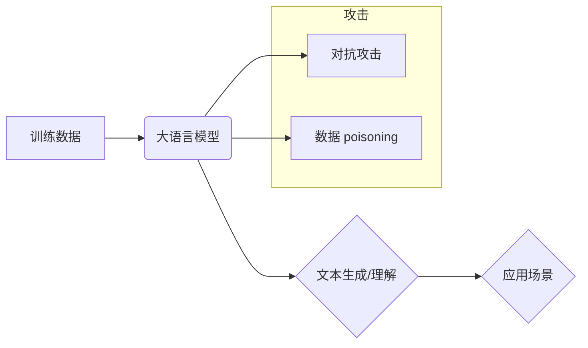

## 大语言模型应用指南：防御策略

> 关键词：大语言模型、LLM、安全、防御策略、对抗攻击、数据 poisoning、模型中毒、可解释性、鲁棒性

### 1. 背景介绍

大语言模型 (LLM) 作为人工智能领域的一项突破性进展，展现出强大的文本生成、理解和翻译能力，在自然语言处理、机器翻译、代码生成等领域取得了显著成就。然而，随着 LLM 的应用范围不断扩大，其潜在的安全风险也日益凸显。

LLM 的训练数据通常来自互联网，可能包含偏见、错误信息和恶意内容，这可能导致模型生成不准确、有偏见甚至有害的输出。此外，攻击者可以利用 LLM 的可预测性进行对抗攻击，例如生成巧妙的文本以欺骗模型，或者通过数据 poisoning 污染模型训练数据，从而改变模型的行为。

因此，针对 LLM 的安全防御策略至关重要，以确保其安全、可靠和可信赖地应用于各种场景。

### 2. 核心概念与联系

**2.1 核心概念**

* **大语言模型 (LLM):** 训练数据量巨大，参数数量庞大的深度学习模型，能够理解和生成人类语言。
* **对抗攻击:** 利用模型的弱点，设计精心构造的输入，以欺骗模型做出错误的预测或生成不期望的输出。
* **数据 poisoning:** 恶意地污染模型训练数据，从而改变模型的学习结果，导致模型生成错误或有偏见的结果。
* **模型中毒:**  攻击者通过注入恶意代码或数据，改变模型的行为，使其产生预期的恶意输出。
* **可解释性:**  能够理解模型的决策过程，解释模型是如何生成特定输出的。
* **鲁棒性:**  模型能够抵抗对抗攻击和数据 poisoning 等恶意行为的影响，保持其正常工作状态。

**2.2 架构关系**

### 3. 核心算法原理 & 具体操作步骤

**3.1 算法原理概述**

LLM 的训练通常基于 Transformer 架构，利用 self-attention 机制学习文本的上下文关系。训练过程通过最大化预测下一个词的概率来优化模型参数。

**3.2 算法步骤详解**

1. **数据预处理:** 将文本数据进行清洗、分词、标记等预处理操作，使其适合模型训练。
2. **模型构建:** 根据 Transformer 架构构建 LLM 模型，包括编码器、解码器和注意力机制等组件。
3. **模型训练:** 使用预处理后的数据训练模型，通过反向传播算法优化模型参数，使其能够准确预测下一个词。
4. **模型评估:** 使用测试数据评估模型的性能，例如困惑度、BLEU 等指标。
5. **模型部署:** 将训练好的模型部署到实际应用场景中，用于文本生成、理解、翻译等任务。

**3.3 算法优缺点**

* **优点:** 能够学习复杂的文本关系，生成高质量的文本输出。
* **缺点:** 训练成本高，需要大量数据和计算资源，容易受到对抗攻击和数据 poisoning 的影响。

**3.4 算法应用领域**

* 自然语言处理：文本分类、情感分析、问答系统等。
* 机器翻译：将一种语言翻译成另一种语言。
* 代码生成：自动生成代码。
* 内容创作：生成新闻、故事、诗歌等文本内容。

### 4. 数学模型和公式 & 详细讲解 & 举例说明

**4.1 数学模型构建**

LLM 的核心是 Transformer 架构，其使用 self-attention 机制来学习文本的上下文关系。

**4.2 公式推导过程**

* **Self-Attention 机制:**

$$
Attention(Q, K, V) = \frac{exp(Q \cdot K^T / \sqrt{d_k})}{exp(Q \cdot K^T / \sqrt{d_k})} \cdot V
$$

其中：

* $Q$: 查询矩阵
* $K$: 键矩阵
* $V$: 值矩阵
* $d_k$: 键向量的维度

**4.3 案例分析与讲解**

假设我们有一个句子 "The cat sat on the mat"，其词向量表示为：

* The: [0.1, 0.2, 0.3]
* cat: [0.4, 0.5, 0.6]
* sat: [0.7, 0.8, 0.9]
* on: [1.0, 1.1, 1.2]
* the: [0.1, 0.2, 0.3]
* mat: [1.3, 1.4, 1.5]

使用 self-attention 机制，模型可以计算每个词与其他词之间的相关性，例如 "cat" 与 "sat" 之间的关系较高，因为它们共同描述了猫的行为。

### 5. 项目实践：代码实例和详细解释说明

**5.1 开发环境搭建**

使用 Python 语言和深度学习框架 TensorFlow 或 PyTorch 搭建开发环境。

**5.2 源代码详细实现**

使用预训练的 LLM 模型，例如 BERT 或 GPT-3，并进行微调以适应特定的应用场景。

**5.3 代码解读与分析**

代码主要包括数据加载、模型加载、模型微调、模型评估等步骤。

**5.4 运行结果展示**

使用测试数据评估模型的性能，并展示模型生成的文本输出。

### 6. 实际应用场景

**6.1 文本生成:**

* 自动生成新闻报道、故事、诗歌等文本内容。
* 生成对话机器人聊天脚本。

**6.2 文本理解:**

* 情感分析：识别文本中的情感倾向。
* 问答系统：根据给定的问题，从文本中找到答案。

**6.3 机器翻译:**

* 将一种语言翻译成另一种语言。

**6.4 未来应用展望**

* 更智能的聊天机器人和虚拟助手。
* 个性化的教育和培训系统。
* 更高效的代码生成和软件开发工具。

### 7. 工具和资源推荐

**7.1 学习资源推荐**

* **书籍:**

    * 《深度学习》
    * 《自然语言处理》

* **在线课程:**

    * Coursera
    * edX

**7.2 开发工具推荐**

* **深度学习框架:** TensorFlow, PyTorch
* **自然语言处理库:** NLTK, spaCy

**7.3 相关论文推荐**

* **BERT:** Devlin et al., "BERT: Pre-training of Deep Bidirectional Transformers for Language Understanding"
* **GPT-3:** Brown et al., "Language Models are Few-Shot Learners"

### 8. 总结：未来发展趋势与挑战

**8.1 研究成果总结**

LLM 在文本生成、理解和翻译等领域取得了显著进展，为人工智能的未来发展提供了新的可能性。

**8.2 未来发展趋势**

* 模型规模和能力的进一步提升。
* 更高效的训练和推理算法。
* 更强的可解释性和鲁棒性。

**8.3 面临的挑战**

* 数据偏见和错误信息的影响。
* 对抗攻击和数据 poisoning 的威胁。
* 计算资源和能源消耗问题。

**8.4 研究展望**

* 开发更安全、可靠和可信赖的 LLM。
* 探索 LLM 在更多领域的应用。
* 研究 LLM 的伦理和社会影响。

### 9. 附录：常见问题与解答

* **Q: 如何评估 LLM 的性能？**
* **A:** 可以使用困惑度、BLEU 等指标来评估 LLM 的性能。
* **Q: 如何防御对抗攻击？**
* **A:** 可以使用对抗训练、鲁棒性优化等方法来防御对抗攻击。
* **Q: 如何解决数据偏见问题？**
* **A:** 可以使用数据清洗、数据增强、公平性约束等方法来解决数据偏见问题。

作者：禅与计算机程序设计艺术 / Zen and the Art of Computer Programming 
