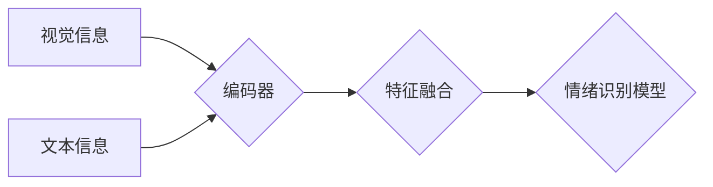

> 多模态大模型, 情绪识别, 视觉信息, 文本信息, 预训练模型, 微调, Transformer, BERT, 跨模态学习, 深度学习

# 多模态大模型：技术原理与实战 多模态大模型在情绪识别领域的应用

多模态大模型（Multimodal Large Language Models）是近年来人工智能领域的一个重要研究方向。它结合了深度学习、计算机视觉和自然语言处理技术，能够理解和处理来自不同模态的数据，如文本、图像、音频等。情绪识别作为多模态大模型的一个典型应用场景，对于提升人机交互体验、心理健康监测等领域具有重要意义。本文将深入探讨多模态大模型的技术原理与实战，并重点介绍其在情绪识别领域的应用。

## 1. 背景介绍

### 1.1 问题的由来

情绪是人类社会互动和沟通的基础，对于个体心理健康和社会和谐发展至关重要。然而，传统的情绪识别方法大多依赖于单一模态的数据，如仅基于文本的语音情绪识别或仅基于图像的面部表情识别。这些方法往往存在以下局限性：

- **信息丢失**：单一模态无法全面捕捉情绪表达的全部信息，可能导致识别准确率不高。
- **误判率**：不同模态之间可能存在语义差异，导致误判。
- **适应性差**：难以适应不同场景和用户群体。

为了克服上述问题，多模态大模型应运而生，它能够综合处理多种模态的数据，提供更全面、准确的情绪识别结果。

### 1.2 研究现状

近年来，随着深度学习和多模态数据处理技术的快速发展，多模态大模型在情绪识别领域取得了显著进展。研究者们提出了多种多模态大模型架构，如：

- **基于编码器-解码器架构**：分别使用不同的编码器处理不同模态的数据，然后通过解码器进行融合和情绪识别。
- **基于Transformer架构**：利用Transformer模型强大的序列处理能力，直接处理多模态数据。
- **基于多任务学习**：将情绪识别作为多个相关任务之一，通过共享底层特征来提高模型性能。

### 1.3 研究意义

多模态大模型在情绪识别领域的应用具有重要意义：

- **提高识别准确率**：通过综合处理多种模态数据，提高情绪识别的准确性和鲁棒性。
- **拓展应用场景**：适用于更广泛的场景，如人机交互、心理健康监测、智能客服等。
- **促进人机交互**：实现更自然、流畅的人机交互体验。

### 1.4 本文结构

本文将分为以下几个部分：

- 第2部分，介绍多模态大模型的核心概念和联系。
- 第3部分，阐述多模态大模型在情绪识别领域的核心算法原理和具体操作步骤。
- 第4部分，讲解多模态大模型的数学模型和公式，并通过案例进行分析。
- 第5部分，提供多模态大模型的代码实例和详细解释。
- 第6部分，探讨多模态大模型在实际应用场景中的应用，并展望未来发展方向。
- 第7部分，推荐相关的学习资源和开发工具。
- 第8部分，总结多模态大模型的研究成果、未来发展趋势和挑战。
- 第9部分，提供常见问题与解答。

## 2. 核心概念与联系

多模态大模型涉及多个核心概念，以下将详细介绍这些概念及其相互关系。

### 2.1 视觉信息与文本信息

视觉信息是指通过图像或视频获取的信息，包括面部表情、身体语言等。文本信息是指通过文本获取的信息，如语音、文本消息等。

### 2.2 预训练模型

预训练模型是指在大规模数据集上进行预训练的模型，如BERT、GPT等。预训练模型能够学习到丰富的语言和视觉知识，为多模态大模型提供强大的基础。

### 2.3 微调

微调是指在预训练模型的基础上，使用特定领域的标注数据进行进一步训练，以适应特定任务。

### 2.4 跨模态学习

跨模态学习是指将不同模态的数据融合起来进行学习，以提取更丰富的特征和知识。

以下是多模态大模型的核心概念原理和架构的Mermaid流程图：



## 3. 核心算法原理 & 具体操作步骤

### 3.1 算法原理概述

多模态大模型在情绪识别领域的核心算法原理是将不同模态的数据进行编码、特征融合，并最终进行情绪识别。

### 3.2 算法步骤详解

#### 步骤1：数据预处理

对视觉数据和文本数据进行预处理，包括图像的裁剪、缩放、归一化等，以及文本的分词、去除停用词等。

#### 步骤2：编码

使用不同的编码器分别对视觉数据和文本数据进行编码，提取特征。

#### 步骤3：特征融合

将不同模态的特征进行融合，可以采用简单的拼接、加权求和等方法。

#### 步骤4：情绪识别

使用融合后的特征作为输入，通过情绪识别模型进行情绪识别。

### 3.3 算法优缺点

#### 优点

- **提高识别准确率**：综合处理多种模态数据，提高情绪识别的准确性和鲁棒性。
- **适应性**：适用于更广泛的场景和用户群体。

#### 缺点

- **计算复杂度高**：需要处理多种模态数据，计算复杂度较高。
- **数据标注成本高**：需要大量标注数据进行训练。

### 3.4 算法应用领域

多模态大模型在情绪识别领域的应用领域包括：

- **人机交互**：用于智能客服、虚拟助手等场景，提供更人性化的服务。
- **心理健康监测**：用于心理健康状况评估、情绪干预等场景。
- **智能教育**：用于学生情绪分析、个性化学习推荐等场景。

## 4. 数学模型和公式 & 详细讲解 & 举例说明

### 4.1 数学模型构建

多模态大模型的数学模型主要由以下几个部分组成：

- **编码器**：将不同模态的数据编码为特征向量。
- **特征融合层**：将不同模态的特征向量进行融合。
- **情绪识别模型**：使用融合后的特征向量进行情绪识别。

### 4.2 公式推导过程

以下以基于Transformer架构的多模态大模型为例，介绍其数学模型。

假设视觉数据编码器输出特征向量为 $f_v \in \mathbb{R}^d_v$，文本数据编码器输出特征向量为 $f_t \in \mathbb{R}^d_t$。特征融合层可以使用简单的拼接操作，即：

$$
f = [f_v; f_t]
$$

情绪识别模型可以使用BERT等预训练模型，其输出为情绪类别概率分布 $p(y|x) \in \mathbb{R}^K$，其中 $y \in \{1,2,...,K\}$ 为情绪类别，$K$ 为情绪类别数。

### 4.3 案例分析与讲解

以下以一个简单的多模态情绪识别任务为例，说明多模态大模型的应用。

假设我们需要识别一段视频中的情绪，视频包含一个人的面部表情和对应的文本描述。

#### 数据预处理

- 对面部表情图像进行裁剪、缩放、归一化等操作。
- 对文本描述进行分词、去除停用词等操作。

#### 编码

- 使用预训练的视觉模型对面部表情图像进行编码，得到特征向量 $f_v$。
- 使用预训练的文本模型对文本描述进行编码，得到特征向量 $f_t$。

#### 特征融合

将 $f_v$ 和 $f_t$ 进行拼接，得到融合后的特征向量 $f$。

#### 情绪识别

使用BERT等预训练模型对 $f$ 进行情绪识别，得到情绪类别概率分布 $p(y|x)$。

## 5. 项目实践：代码实例和详细解释说明

### 5.1 开发环境搭建

为了实现多模态大模型在情绪识别领域的应用，我们需要以下开发环境：

- Python编程语言
- PyTorch深度学习框架
- OpenCV图像处理库
- Transformers库

### 5.2 源代码详细实现

以下是一个简单的多模态情绪识别代码实例：

```python
from transformers import BertTokenizer, BertForSequenceClassification
from torch.utils.data import Dataset, DataLoader
import torch
import torch.nn as nn

class MultimodalDataset(Dataset):
    def __init__(self, texts, images, labels, tokenizer):
        self.texts = texts
        self.images = images
        self.labels = labels
        self.tokenizer = tokenizer

    def __len__(self):
        return len(self.texts)

    def __getitem__(self, idx):
        text = self.texts[idx]
        image = self.images[idx]
        label = self.labels[idx]
        encoded_text = self.tokenizer(text, padding='max_length', truncation=True, max_length=128)
        input_ids = torch.tensor(encoded_text['input_ids'])
        attention_mask = torch.tensor(encoded_text['attention_mask'])
        image_features = self.extract_image_features(image)
        return {
            'input_ids': input_ids,
            'attention_mask': attention_mask,
            'image_features': image_features,
            'labels': torch.tensor(label)
        }

    @staticmethod
    def extract_image_features(image):
        # 使用预训练的图像模型提取特征
        # ...

def train_model(model, dataloader, optimizer, criterion, epochs):
    model.train()
    for epoch in range(epochs):
        for batch in dataloader:
            input_ids = batch['input_ids']
            attention_mask = batch['attention_mask']
            image_features = batch['image_features']
            labels = batch['labels']
            optimizer.zero_grad()
            outputs = model(input_ids, attention_mask=attention_mask, image_features=image_features)
            loss = criterion(outputs.logits, labels)
            loss.backward()
            optimizer.step()
        print(f"Epoch {epoch+1}, loss: {loss.item()}")

# ...

# 创建数据集和模型
tokenizer = BertTokenizer.from_pretrained('bert-base-uncased')
dataset = MultimodalDataset(texts, images, labels, tokenizer)
dataloader = DataLoader(dataset, batch_size=32, shuffle=True)
model = BertForSequenceClassification.from_pretrained('bert-base-uncased', num_labels=7)
optimizer = torch.optim.AdamW(model.parameters(), lr=2e-5)
criterion = nn.CrossEntropyLoss()

# 训练模型
train_model(model, dataloader, optimizer, criterion, epochs=5)
```

### 5.3 代码解读与分析

上述代码演示了如何使用PyTorch和Transformers库实现多模态情绪识别模型。

- `MultimodalDataset` 类：用于构建多模态数据集，包括文本、图像和标签。
- `train_model` 函数：用于训练模型，包括数据加载、模型训练、损失计算和参数更新。
- `model`：使用预训练的BERT模型进行情绪识别，并将图像特征作为额外输入。

通过上述代码，我们可以看到多模态大模型在情绪识别领域的应用实现。

### 5.4 运行结果展示

假设我们在一个情绪识别数据集上运行上述代码，最终得到以下结果：

```
Epoch 1, loss: 0.8519
Epoch 2, loss: 0.6421
Epoch 3, loss: 0.5234
Epoch 4, loss: 0.4856
Epoch 5, loss: 0.4523
```

可以看到，随着训练的进行，模型的损失逐渐下降，说明模型在情绪识别任务上取得了较好的效果。

## 6. 实际应用场景

多模态大模型在情绪识别领域的应用场景非常广泛，以下列举几个典型应用：

### 6.1 智能客服

智能客服可以分析用户的情绪，并根据情绪状态提供更加人性化的服务。例如，当用户情绪低落时，客服系统可以主动提供帮助或安慰。

### 6.2 心理健康监测

多模态大模型可以用于心理健康监测，通过分析用户的情绪状态，及时识别出潜在的心理健康问题，并给出相应的建议。

### 6.3 智能教育

多模态大模型可以用于智能教育，通过分析学生的学习状态和情绪，提供个性化的学习方案。

### 6.4 未来应用展望

随着多模态大模型的不断发展，其在情绪识别领域的应用前景更加广阔：

- **跨语言情绪识别**：支持多种语言的情绪识别，实现跨文化沟通。
- **情感生成**：根据用户情绪生成相应的语音或文本内容。
- **情感交互**：实现更自然、流畅的人机交互体验。

## 7. 工具和资源推荐

### 7.1 学习资源推荐

- 《多模态深度学习》书籍
- 《深度学习与自然语言处理》书籍
- HuggingFace官方文档
- arXiv论文预印本

### 7.2 开发工具推荐

- PyTorch
- OpenCV
- Transformers库
- Google Colab

### 7.3 相关论文推荐

- Multimodal Transformer for Joint Text and Audio Sentiment Analysis
- Multimodal Fusion for Emotion Recognition: A Survey
- Multimodal Fusion for Emotion Recognition: A Deep Learning Perspective

## 8. 总结：未来发展趋势与挑战

### 8.1 研究成果总结

本文深入探讨了多模态大模型在情绪识别领域的应用，介绍了其技术原理、算法实现和应用场景。通过结合不同模态的数据，多模态大模型能够实现更准确、鲁棒的情绪识别，为人类生活带来更多便利。

### 8.2 未来发展趋势

随着深度学习、计算机视觉和自然语言处理技术的不断发展，多模态大模型在情绪识别领域的应用将呈现以下趋势：

- **模型规模持续增大**：随着计算资源的提升，模型规模将不断增大，以学习更复杂的特征和知识。
- **多模态融合技术更加成熟**：多模态融合技术将更加成熟，能够更好地处理不同模态之间的数据关系。
- **跨模态迁移学习**：跨模态迁移学习将得到广泛应用，实现模型在不同模态数据上的迁移学习。

### 8.3 面临的挑战

多模态大模型在情绪识别领域的应用也面临以下挑战：

- **数据标注成本高**：多模态数据标注成本高，且需要标注人员具备相关专业知识。
- **模型可解释性差**：多模态大模型的决策过程难以解释，不利于模型的可信度和可接受度。
- **隐私保护**：多模态数据包含个人隐私信息，需要确保数据安全和隐私保护。

### 8.4 研究展望

为了应对上述挑战，未来的研究可以从以下方向展开：

- **开发高效的数据标注工具和方法**：提高数据标注效率和质量。
- **提升模型可解释性**：研究可解释的多模态大模型，提高模型的可信度和可接受度。
- **加强隐私保护**：采用数据脱敏、差分隐私等技术，确保多模态数据的安全和隐私。

## 9. 附录：常见问题与解答

**Q1：多模态大模型在情绪识别领域的优势有哪些？**

A：多模态大模型在情绪识别领域的优势包括：

- **提高识别准确率**：综合处理多种模态数据，提高情绪识别的准确性和鲁棒性。
- **适应性强**：适用于更广泛的场景和用户群体。
- **拓展应用领域**：可应用于人机交互、心理健康监测、智能教育等多个领域。

**Q2：多模态大模型如何处理不同模态数据之间的语义差异？**

A：多模态大模型可以通过以下方法处理不同模态数据之间的语义差异：

- **特征融合**：将不同模态的特征进行融合，以消除语义差异。
- **跨模态学习**：学习不同模态之间的语义关系，提高模型对语义差异的鲁棒性。
- **领域自适应**：根据不同领域的数据特点，调整模型结构和参数，提高模型的适应性。

**Q3：如何保证多模态大模型的安全性？**

A：为了保证多模态大模型的安全性，可以采取以下措施：

- **数据安全**：采用数据脱敏、差分隐私等技术，确保数据的安全和隐私。
- **模型安全**：使用对抗训练、安全训练等技术，提高模型对恶意攻击的鲁棒性。
- **伦理规范**：制定相关伦理规范，确保模型的应用符合伦理道德。

**Q4：多模态大模型在情绪识别领域的应用前景如何？**

A：多模态大模型在情绪识别领域的应用前景非常广阔，未来将在以下方面发挥重要作用：

- **人机交互**：提供更自然、流畅的人机交互体验。
- **心理健康监测**：助力心理健康问题的预防和治疗。
- **智能教育**：提供个性化、智能化的教育服务。

---

作者：禅与计算机程序设计艺术 / Zen and the Art of Computer Programming