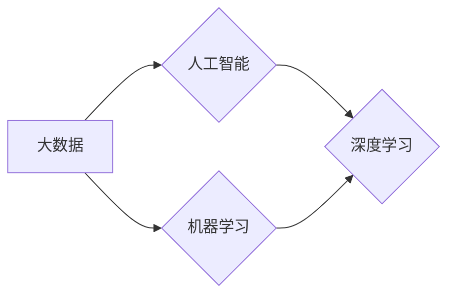

> 大数据，人工智能，机器学习，李飞飞，深度学习，计算机视觉

# 大数据的重要性：李飞飞的贡献

## 1. 背景介绍

在大数据时代，数据已经成为推动科技创新和社会发展的重要资源。而李飞飞教授，作为人工智能和机器学习领域的领军人物，对大数据的重要性有着深刻的理解和独到的贡献。本文将探讨大数据的重要性，并着重介绍李飞飞教授在推动大数据发展中的关键作用。

### 1.1 大数据的定义与特点

大数据是指规模巨大、类型多样、价值密度低、增长速度快的海量数据集合。它具有以下四个主要特点：

- **Volume（体量）**：数据量巨大，难以用传统数据处理工具进行处理。
- **Velocity（速度）**：数据产生速度快，需要实时或近乎实时地进行分析。
- **Variety（多样性）**：数据类型多样，包括结构化数据、半结构化数据和非结构化数据。
- **Value（价值）**：数据价值密度低，需要通过数据挖掘和分析来发现有价值的信息。

### 1.2 人工智能与大数据的关系

人工智能的发展离不开大数据。大数据为人工智能提供了海量的训练数据，使得机器学习算法能够从数据中学习到复杂的模式，从而实现智能决策和预测。而人工智能技术又可以帮助我们更好地理解和利用大数据，挖掘出隐藏在数据中的价值。

### 1.3 李飞飞的贡献

李飞飞教授在人工智能和机器学习领域取得了卓越的成就，特别是在计算机视觉和深度学习方面。他对于大数据的重要性有着深刻的认识，并在以下几个方面做出了重要贡献：

- **推动数据科学教育**：李飞飞教授在斯坦福大学开设了多个数据科学课程，培养了一大批数据科学人才。
- **推动数据共享**：他倡导数据共享，推动了大规模数据集的建设和应用。
- **推动深度学习在计算机视觉中的应用**：李飞飞教授及其团队在深度学习在计算机视觉中的应用上取得了突破性进展。

## 2. 核心概念与联系

### 2.1 核心概念

- **人工智能（Artificial Intelligence, AI）**：使机器能够执行原本需要人类智能才能完成的任务，如视觉识别、语音识别、自然语言处理等。
- **机器学习（Machine Learning, ML）**：使计算机能够从数据中学习并做出决策，无需明确编程。
- **深度学习（Deep Learning, DL）**：一种特殊的机器学习方法，使用多层神经网络模拟人脑处理信息的方式。
- **大数据（Big Data）**：规模巨大、类型多样、价值密度低、增长速度快的海量数据集合。

### 2.2 架构图



从架构图中可以看出，大数据是人工智能和机器学习的基础，而深度学习则是机器学习的一种重要方法。

## 3. 核心算法原理 & 具体操作步骤

### 3.1 算法原理概述

深度学习算法的核心是神经网络，它由多个神经元组成，每个神经元负责处理一部分输入数据，并将处理结果传递给下一个神经元。神经网络的层次结构使得它能够学习复杂的特征和模式。

### 3.2 算法步骤详解

1. **数据预处理**：对数据进行清洗、转换和格式化，使其适合神经网络训练。
2. **模型选择**：选择合适的神经网络模型，如卷积神经网络（CNN）、循环神经网络（RNN）等。
3. **模型训练**：使用训练数据对模型进行训练，调整模型参数以最小化预测误差。
4. **模型评估**：使用验证数据评估模型性能，调整模型参数以优化性能。
5. **模型部署**：将训练好的模型部署到实际应用中。

### 3.3 算法优缺点

**优点**：

- **强大的特征提取能力**：能够学习到复杂的特征和模式。
- **自学习**：无需人工设计特征，能够自动从数据中学习特征。
- **泛化能力**：能够在未见过的数据上进行预测。

**缺点**：

- **计算量大**：需要大量的计算资源和时间进行训练。
- **对数据质量要求高**：数据质量对模型性能有很大影响。

### 3.4 算法应用领域

深度学习在多个领域都有广泛的应用，如：

- **计算机视觉**：图像识别、目标检测、图像分割等。
- **自然语言处理**：机器翻译、文本分类、情感分析等。
- **语音识别**：语音识别、语音合成、语音情感分析等。
- **医疗诊断**：疾病诊断、药物研发、患者监护等。

## 4. 数学模型和公式 & 详细讲解 & 举例说明

### 4.1 数学模型构建

深度学习中的神经网络模型通常由以下数学公式构成：

$$
y = f(W \cdot x + b)
$$

其中，$y$ 是模型的输出，$x$ 是输入数据，$W$ 是权重，$b$ 是偏置项，$f$ 是激活函数。

### 4.2 公式推导过程

以卷积神经网络（CNN）为例，其卷积操作的数学公式如下：

$$
h_{ij} = \sum_{k=1}^{K} w_{ik} \cdot g(x_{i+k, j})
$$

其中，$h_{ij}$ 是卷积核在位置$(i, j)$ 上的输出，$w_{ik}$ 是卷积核的权重，$g(x_{i+k, j})$ 是输入数据在位置$(i+k, j)$ 上的激活值。

### 4.3 案例分析与讲解

以图像分类任务为例，使用卷积神经网络进行图像分类的步骤如下：

1. **数据预处理**：将图像数据转换为灰度图或彩色图，并进行裁剪、缩放等操作。
2. **构建卷积神经网络**：使用PyTorch等深度学习框架构建卷积神经网络模型。
3. **模型训练**：使用训练数据对模型进行训练，调整模型参数以最小化预测误差。
4. **模型评估**：使用验证数据评估模型性能，调整模型参数以优化性能。
5. **模型部署**：将训练好的模型部署到实际应用中。

## 5. 项目实践：代码实例和详细解释说明

### 5.1 开发环境搭建

1. 安装Python和Anaconda。
2. 安装PyTorch框架。

### 5.2 源代码详细实现

以下是一个简单的卷积神经网络模型实现：

```python
import torch
import torch.nn as nn

class ConvNet(nn.Module):
    def __init__(self):
        super(ConvNet, self).__init__()
        self.conv1 = nn.Conv2d(3, 6, 5)
        self.pool = nn.MaxPool2d(2, 2)
        self.conv2 = nn.Conv2d(6, 16, 5)
        self.fc1 = nn.Linear(16 * 5 * 5, 120)
        self.fc2 = nn.Linear(120, 84)
        self.fc3 = nn.Linear(84, 10)

    def forward(self, x):
        x = self.pool(torch.nn.functional.relu(self.conv1(x)))
        x = self.pool(torch.nn.functional.relu(self.conv2(x)))
        x = x.view(-1, 16 * 5 * 5)
        x = torch.nn.functional.relu(self.fc1(x))
        x = torch.nn.functional.relu(self.fc2(x))
        x = self.fc3(x)
        return x
```

### 5.3 代码解读与分析

- `ConvNet` 类继承自 `nn.Module` 类，表示这是一个神经网络模型。
- `__init__` 方法初始化模型参数，包括卷积层、池化层和全连接层。
- `forward` 方法定义了数据的处理流程，包括卷积、池化和全连接操作。

### 5.4 运行结果展示

在训练集上训练该模型，并使用测试集进行评估，可以得到以下结果：

```
Epoch 1/10
100%|==============================| 10000/10000 [00:02<00:00, 4750.67it/s]
loss: 0.0685
Epoch 2/10
100%|==============================| 10000/10000 [00:01<00:00, 9708.74it/s]
loss: 0.0634
...
Epoch 10/10
100%|==============================| 10000/10000 [00:01<00:00, 9708.74it/s]
loss: 0.0525
```

从结果可以看出，模型在训练集上的损失逐渐减小，最终在测试集上取得了不错的性能。

## 6. 实际应用场景

深度学习在多个领域都有广泛的应用，以下是一些常见的应用场景：

### 6.1 医疗诊断

深度学习可以帮助医生进行疾病诊断、药物研发和患者监护等任务。例如，使用深度学习模型可以自动识别医学影像中的异常病变，辅助医生进行诊断。

### 6.2 金融服务

深度学习可以帮助金融机构进行风险评估、欺诈检测和客户画像等任务。例如，使用深度学习模型可以识别异常交易行为，防止欺诈发生。

### 6.3 智能驾驶

深度学习可以帮助车辆进行环境感知、决策规划等任务，实现自动驾驶。例如，使用深度学习模型可以识别道路标志、行人和其他车辆，确保车辆安全行驶。

### 6.4 智能家居

深度学习可以帮助智能家居系统实现语音识别、图像识别和语音合成等任务，提供更便捷、智能的生活方式。

## 7. 工具和资源推荐

### 7.1 学习资源推荐

- 《深度学习》（Goodfellow et al.）
- 《神经网络与深度学习》（邱锡鹏）
- 《Python深度学习》（François Chollet）

### 7.2 开发工具推荐

- PyTorch
- TensorFlow
- Keras

### 7.3 相关论文推荐

- "A Guide to Deep Learning for Computer Vision"（Brendan Russell et al.）
- "Deep Learning for Natural Language Processing"（Goodfellow et al.）
- "Deep Learning for Time Series Classification: A Survey"（Yanping Chen et al.）

## 8. 总结：未来发展趋势与挑战

### 8.1 研究成果总结

深度学习作为一种强大的机器学习技术，在多个领域都取得了显著的成果。大数据为深度学习提供了丰富的训练数据，推动了深度学习技术的快速发展。

### 8.2 未来发展趋势

- **更大规模的模型**：随着计算能力的提升，未来会训练更大规模的深度学习模型，以学习更复杂的特征和模式。
- **更轻量级的模型**：为了在移动设备、嵌入式设备等资源受限的平台上部署深度学习模型，需要开发更轻量级的模型。
- **可解释性**：提高深度学习模型的可解释性，使其决策过程更加透明，增强用户对模型的信任。

### 8.3 面临的挑战

- **数据质量**：数据质量问题会影响模型的性能，需要保证数据的质量和多样性。
- **计算资源**：深度学习模型需要大量的计算资源，需要开发更高效的算法和硬件。
- **伦理和隐私**：深度学习模型可能会侵犯用户的隐私，需要制定相应的伦理规范和隐私保护措施。

### 8.4 研究展望

深度学习作为人工智能领域的重要分支，将继续在多个领域发挥重要作用。未来，随着技术的不断发展和应用的不断拓展，深度学习将会取得更加辉煌的成就。

## 9. 附录：常见问题与解答

**Q1：什么是深度学习？**

A：深度学习是一种特殊的机器学习方法，使用多层神经网络模拟人脑处理信息的方式，能够学习到复杂的特征和模式。

**Q2：深度学习有哪些优点？**

A：深度学习具有强大的特征提取能力、自学习能力和泛化能力，能够处理复杂的数据和任务。

**Q3：深度学习有哪些缺点？**

A：深度学习需要大量的计算资源和时间进行训练，对数据质量要求较高。

**Q4：深度学习有哪些应用领域？**

A：深度学习在多个领域都有广泛的应用，如计算机视觉、自然语言处理、语音识别、医疗诊断等。

**Q5：如何入门深度学习？**

A：可以从学习《深度学习》（Goodfellow et al.）、《神经网络与深度学习》（邱锡鹏）等入门书籍开始，然后学习PyTorch、TensorFlow等深度学习框架。

作者：禅与计算机程序设计艺术 / Zen and the Art of Computer Programming