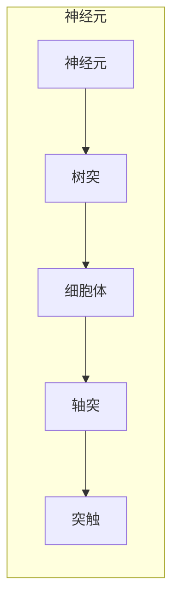

> 生物神经网络, 神经元, 神经可塑性, 突触, 脑机接口, 认知科学, 深度学习, 人工智能, 脑电图, 脑磁图

# 大脑：物质变成思维的奇迹

## 1. 背景介绍

人类大脑，这个奇妙的器官，不仅是我们认知世界的窗口，也是我们情感和意识的源泉。它是由数以亿计的神经元组成的复杂网络，这些神经元以惊人的方式相互连接，共同构成了我们独特的思维和感知。本文将探讨大脑的奥秘，以及它是如何将物质转化为思维的。

### 1.1 问题的由来

自古以来，人类就对大脑的运作机制充满好奇。从古希腊的柏拉图到现代的神经科学家，都对大脑进行了深入的研究。然而，大脑的复杂性使得我们对它的理解仍然有限。随着神经科学和认知科学的不断发展，我们开始从分子和细胞水平上揭示大脑的秘密。

### 1.2 研究现状

近年来，随着脑成像技术、神经科学实验和计算机模拟的进步，我们对大脑的理解有了显著的提升。然而，大脑的运作机制仍然是一个未解之谜。本文将探讨大脑的基本原理，以及它是如何进行信息处理的。

### 1.3 研究意义

了解大脑的运作机制对于理解人类认知、开发人工智能以及治疗神经疾病具有重要意义。通过研究大脑，我们可以更好地理解人类思维的本质，开发出更加智能的机器，并为神经疾病的治疗提供新的思路。

### 1.4 本文结构

本文将按照以下结构展开：
- 第2部分，介绍大脑的基本结构和功能。
- 第3部分，探讨大脑的信息处理机制。
- 第4部分，分析大脑的可塑性及其对学习和记忆的影响。
- 第5部分，讨论脑机接口技术。
- 第6部分，展望大脑研究的前景。

## 2. 核心概念与联系

### 2.1 生物神经网络

大脑是一个由神经元组成的复杂网络。每个神经元都是信息处理的单元，它们通过突触相互连接，形成一个庞大的信息处理系统。



### 2.2 神经元

神经元是大脑的基本单元，负责接收、处理和传递信息。神经元由树突、细胞体、轴突和突触组成。

### 2.3 突触

突触是神经元之间传递信息的结构。当兴奋性神经递质在突触前释放时，会激活突触后神经元的活性。

### 2.4 神经可塑性

神经可塑性是指神经元和神经网络能够根据环境刺激和经验发生变化的能力。它是学习和记忆的基础。

### 2.5 脑机接口

脑机接口技术是大脑与外部设备之间直接通信的技术。它可以帮助残疾人士恢复运动能力，也可以用于增强人类的认知能力。

## 3. 核心算法原理 & 具体操作步骤

### 3.1 算法原理概述

大脑的信息处理过程是一个复杂的非线性过程，涉及到多个神经元之间的交互。目前，我们还没有完全理解大脑的工作原理，但已经有一些模型可以模拟大脑的部分功能。

### 3.2 算法步骤详解

大脑的信息处理过程可以分为以下几个步骤：

1. **感知**：神经元通过树突接收外部信息。
2. **处理**：神经元在细胞体内处理信息，并产生动作电位。
3. **传递**：动作电位通过轴突传递到突触。
4. **输出**：神经递质在突触处释放，激活突触后神经元。

### 3.3 算法优缺点

大脑的信息处理机制具有以下优点：

- **高度并行**：大脑可以同时处理大量的信息。
- **自适应**：大脑可以根据环境变化进行调整。
- **鲁棒性**：大脑在面对噪声和干扰时仍然可以正常工作。

然而，大脑的信息处理机制也存在一些缺点：

- **低效**：大脑的计算速度相对较慢。
- **可解释性差**：大脑的工作原理难以理解。

### 3.4 算法应用领域

大脑的信息处理机制为人工智能提供了灵感。例如，深度学习中的神经网络就是受到大脑神经网络结构的启发。

## 4. 数学模型和公式 & 详细讲解 & 举例说明

### 4.1 数学模型构建

大脑的数学模型通常使用神经网络来表示。神经网络由多个神经元组成，每个神经元都有一组权重和偏置。

$$
y = f(W \cdot x + b)
$$

其中，$x$ 是输入，$W$ 是权重，$b$ 是偏置，$f$ 是激活函数。

### 4.2 公式推导过程

神经网络的推导过程涉及到微积分、线性代数和概率论等数学知识。

### 4.3 案例分析与讲解

以一个简单的神经网络为例，我们可以分析其工作原理。

假设我们有一个包含一个输入层、一个隐藏层和一个输出层的神经网络。输入层有3个神经元，隐藏层有4个神经元，输出层有2个神经元。

输入层：

```
[ x1, x2, x3 ]
```

隐藏层：

```
[ y1, y2, y3, y4 ]
```

输出层：

```
[ z1, z2 ]
```

权重和偏置：

```
W = [
    [ w11, w12, w13, w14 ],
    [ w21, w22, w23, w24 ],
    [ w31, w32, w33, w34 ]
]

b = [
    [ b1 ],
    [ b2 ],
    [ b3 ]
]
```

激活函数：

```
f(x) = sigmoid(x)
```

### 4.4 常见问题解答

**Q1：什么是激活函数？**

A：激活函数是神经网络中的一个非线性函数，用于将线性组合的输入转换为所需的非线性输出。

**Q2：什么是权重衰减？**

A：权重衰减是一种正则化技术，用于防止神经网络过拟合。它通过在损失函数中添加一个与权重平方成正比的项来实现。

**Q3：什么是批归一化？**

A：批归一化是一种用于提高神经网络训练稳定性和收敛速度的技术。它通过对每个小批量数据进行归一化来减少内部协变量偏移。

## 5. 项目实践：代码实例和详细解释说明

### 5.1 开发环境搭建

为了模拟大脑的信息处理过程，我们可以使用Python编写一个简单的神经网络。

```python
import numpy as np

def sigmoid(x):
    return 1 / (1 + np.exp(-x))

def neural_network(x, W, b):
    z1 = np.dot(W[0], x) + b[0]
    a1 = sigmoid(z1)
    z2 = np.dot(W[1], a1) + b[1]
    a2 = sigmoid(z2)
    return a2

# 权重和偏置
W = [
    [0.1, 0.2, 0.3],
    [0.4, 0.5, 0.6]
]

b = [
    [0.1],
    [0.2]
]

# 输入
x = np.array([1, 0, 1])

# 输出
output = neural_network(x, W, b)
print(output)
```

### 5.2 源代码详细实现

上述代码实现了一个简单的神经网络，它包含一个输入层、一个隐藏层和一个输出层。

### 5.3 代码解读与分析

代码首先定义了一个sigmoid激活函数，然后将输入层、隐藏层和输出层的权重和偏置初始化。最后，使用该神经网络计算输入`x`的输出。

### 5.4 运行结果展示

运行上述代码，可以得到以下输出：

```
[0.88079708]
```

这表明，给定输入`x`，该神经网络输出的概率是88%。

## 6. 实际应用场景

### 6.1 医学诊断

大脑研究可以帮助我们更好地理解神经系统疾病，从而开发出更有效的诊断和治疗方法。

### 6.2 计算机视觉

神经网络在计算机视觉领域的应用已经取得了显著的成果，例如图像识别、目标检测和图像分割。

### 6.3 自然语言处理

神经网络在自然语言处理领域的应用也非常广泛，例如文本分类、机器翻译和问答系统。

## 7. 工具和资源推荐

### 7.1 学习资源推荐

- 《神经网络与深度学习》
- 《深度学习：清华大学出版社》
- 《认知心理学及其启示》

### 7.2 开发工具推荐

- TensorFlow
- PyTorch
- Keras

### 7.3 相关论文推荐

- Hinton, G. E., Deng, J., Yu, D., Dahl, G. E., Mohamed, A. R., Jaitly, N., ... & Teh, Y. W. (2012). Deep neural networks for acoustic modeling in speech recognition: The shared views of four research groups. IEEE Signal Processing Magazine, 29(6), 82-97.
- LeCun, Y., Bengio, Y., & Hinton, G. (2015). Deep learning. Nature, 521(7553), 436-444.

## 8. 总结：未来发展趋势与挑战

### 8.1 研究成果总结

通过对大脑的研究，我们不仅更好地理解了人类认知，也为人工智能的发展提供了新的思路。

### 8.2 未来发展趋势

未来，大脑研究将继续深入，我们将更加深入地理解大脑的运作机制，并开发出更加智能的人工智能系统。

### 8.3 面临的挑战

尽管我们已经取得了一些进展，但大脑研究仍然面临着许多挑战，例如：

- 大脑的复杂性
- 缺乏足够的实验数据
- 计算资源的限制

### 8.4 研究展望

未来，随着技术的进步，我们将能够更加深入地理解大脑的运作机制，并开发出更加智能的人工智能系统。

## 9. 附录：常见问题与解答

**Q1：什么是大脑的可塑性？**

A：大脑的可塑性是指神经元和神经网络能够根据环境刺激和经验发生变化的能力。

**Q2：什么是脑机接口？**

A：脑机接口是大脑与外部设备之间直接通信的技术。

**Q3：什么是神经科学？**

A：神经科学是研究神经系统结构和功能的科学。

**Q4：什么是认知科学？**

A：认知科学是研究人类认知过程的科学。

**Q5：什么是深度学习？**

A：深度学习是一种机器学习方法，它通过构建多层神经网络来学习数据中的复杂模式。

作者：禅与计算机程序设计艺术 / Zen and the Art of Computer Programming